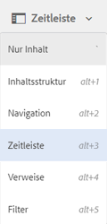

# Aktivitäts-Stream in der Zeitleiste {#activity-stream-in-timeline}

Diese Funktion zeigt Aktivitätsprotokolle für Assets in der Zeitleiste an. Wenn Sie einen der folgenden Asset-bezogenen Vorgänge in [!DNL Adobe Experience Manager Assets]durchführen, aktualisiert die Aktivitäts-Stream-Funktion die Zeitleiste, um die Aktivität anzuzeigen.

Folgende Vorgänge werden im Aktivitäts-Stream protokolliert:

* Erstellen
* Löschen
* Download (einschließlich Ausgabedarstellungen)
* Veröffentlichen
* Veröffentlichung aufheben
* Genehmigen
* Ablehnen
* Verschieben

Die in der Zeitleiste angezeigten Aktivitätsprotokolle werden aus dem Ordner `/var/audit/com.day.cq.dam/content/dam` in CRX abgerufen, in dem Protokolldateien gespeichert werden.

Darüber hinaus wird die Timeline-Aktivität protokolliert, wenn neue Assets hochgeladen oder vorhandene Assets geändert und in den Experience Manager über [Adobe Asset Link](https://helpx.adobe.com/de/enterprise/admin-guide.html/enterprise/using/manage-assets-using-adobe-asset-link.ug.html) oder [[!DNL Experience Manager] Desktop-Programm](https://experienceleague.adobe.com/docs/experience-manager-desktop-app/using/introduction.html?lang=de).

>[!NOTE]
>
>Übergangsarbeitsabläufe werden nicht in der Zeitleiste angezeigt, da keine Verlaufsinformationen für diese Arbeitsabläufe gespeichert werden.

Um den Aktivitäts-Stream anzuzeigen, führen Sie einen oder mehrere Vorgänge für die Assets aus, wählen Sie das Asset aus und wählen Sie dann **[!UICONTROL Zeitleiste]** aus der GlobalNav-Liste aus.

In der Zeitleiste wird der Aktivitäts-Stream für die mit den Assets ausgeführten Vorgänge angezeigt.

>[!NOTE]
>
>Der standardmäßige Speicherort für Aufgaben des Typs **Veröffentlichen** und **Veröffentlichung aufheben** befindet sich in `/var/audit/com.day.cq.replication/content`. Für Aufgaben des Typs **Verschieben** ist der standardmäßige Speicherort `/var/audit/com.day.cq.wcm.core.page`.
