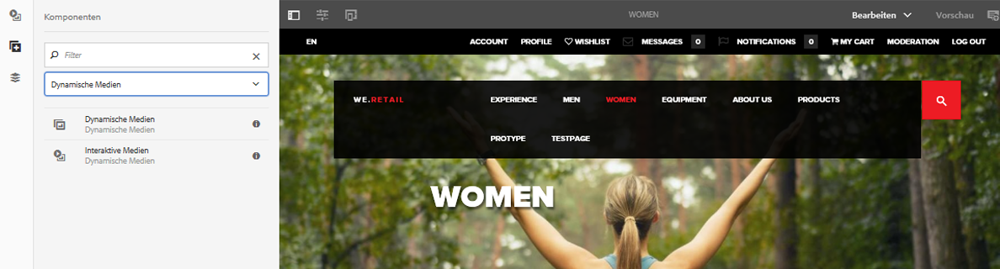
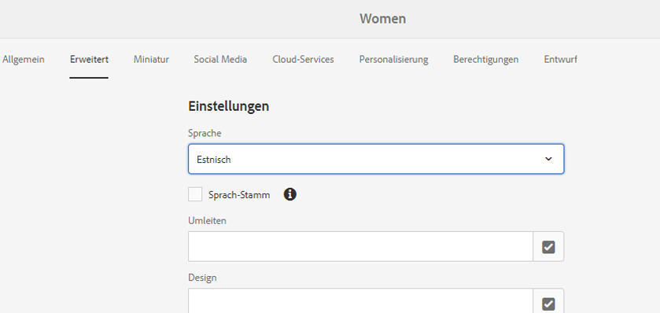
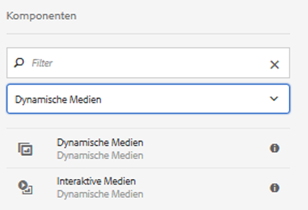
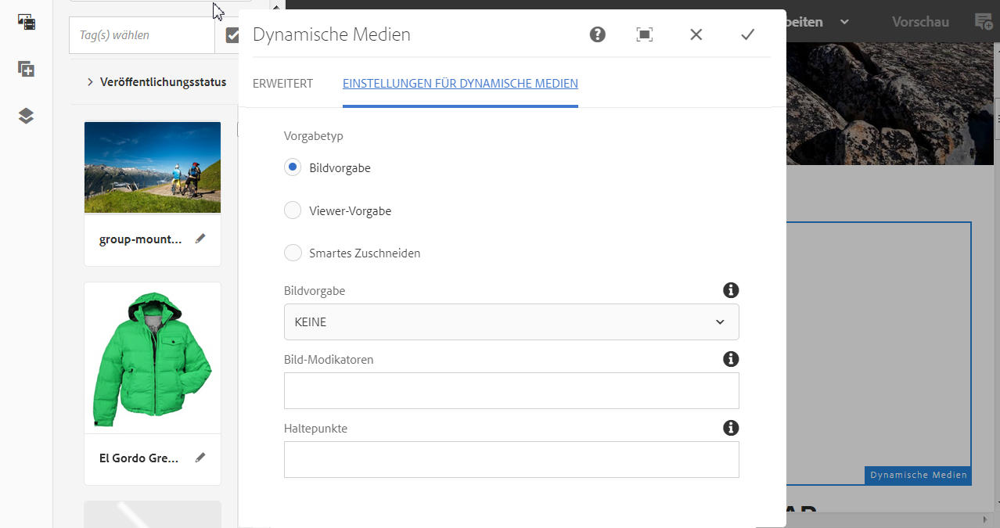
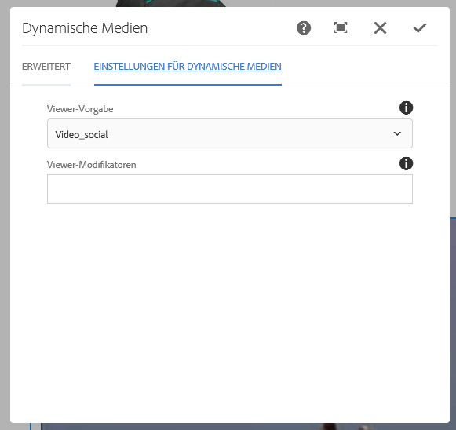
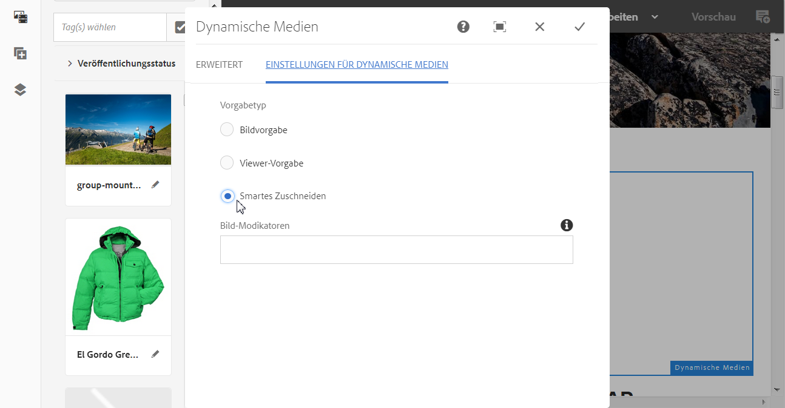
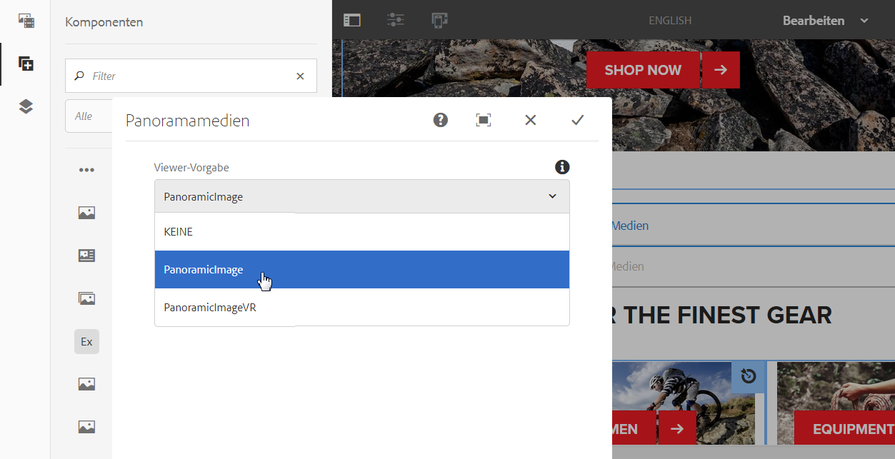

# Hinzufügen von Dynamic Media-Assets zu Seiten {#adding-dynamic-media-assets-to-pages}

Um die Funktion für dynamische Medien zu Assets hinzuzufügen, die Sie auf Ihren Websites verwenden, können Sie die **Dynamic Media** oder **Interaktive Medien** direkt auf der Seite. Wechseln Sie dazu in den Layoutmodus und aktivieren Sie die Komponenten vom Typ „Dynamische Medien“. Anschließend können Sie der Seite diese Komponenten und der Komponente Assets hinzufügen. „Dynamische Medien“ und „Interaktive Medien“ sind intelligente Komponenten, die erkennen, ob Sie ein Bild oder ein Video hinzufügen. Die verfügbaren Optionen werden entsprechend angepasst.

Sie fügen Dynamic Media-Assets direkt zur Seite hinzu, wenn Sie AEM als WCM verwenden. Wenn Sie einen Drittanbieter für Ihr WCM verwenden, [verknüpfen](linking-urls-to-yourwebapplication.md) Sie Ihre Assets oder [betten](embed-code.md) Sie sie ein. Eine responsive Website von Drittanbietern finden Sie unter [Bereitstellen optimierter Bilder für eine responsive Site](responsive-site.md).

>[!NOTE]
>
>Sie müssen Assets veröffentlichen, um sie Seiten in AEM hinzufügen zu können. Siehe [Veröffentlichen von Dynamic Media-Assets](publishing-dynamicmedia-assets.md).

## Hinzufügen einer Dynamic Media-Komponente zu einer Seite {#adding-a-dynamic-media-component-to-a-page}

Das Hinzufügen einer Dynamic Media-Komponente zu einer Seite entspricht dem Hinzufügen einer Komponente zu einer beliebigen Seite. Die Dynamic Media-Komponenten werden in den folgenden Abschnitten ausführlich beschrieben.

>[!NOTE]
>
>Wenn eine Dynamic Media-Komponente auf einer Webseite vorhanden ist, auf die ein Benutzer mit schreibgeschützten Berechtigungen zugreifen kann, werden die Seitenumbrüche und die Komponenten nicht korrekt dargestellt. Der Grund dafür ist, dass die Seite neu erstellt wird, um sicherzustellen, dass die Eigenschaften der Komponenten gut sind und alle referenzierten Assets und Konfigurationen verfügbar sind. Die Seite wird dann erneut gerendert, wodurch die Komponenten beschädigt werden. Der entsprechende Komponenten-Code auf der Seite kann aufgrund des schreibgeschützten Zugriffs des Benutzers nicht erneut gerendert werden.
>  
>Um dieses Problem zu vermeiden, stellen Sie sicher, dass AEM Sites-Benutzer über die erforderlichen Berechtigungen für den Zugriff auf die Assets verfügen.

1. Öffnen Sie in AEM die Seite, auf der Sie die Dynamic Media-Komponente hinzufügen möchten.
1. Klicken Sie im Bedienfeld auf der linken Seite der Seite (Sie müssen ggf. die Anzeige des Seitenbedienfelds umschalten) auf die **[!UICONTROL Komponenten]** Symbol.
1. Unter dem **[!UICONTROL Komponenten]** -Überschrift in der Dropdown-Liste wählen Sie **[!UICONTROL Dynamic Media]**. Wenn keine Liste der Dynamic Media-Komponenten verfügbar ist, müssen Sie wahrscheinlich die zu verwendenden Dynamic Media-Komponenten aktivieren. Informationen hierzu finden Sie unter [Aktivieren von Dynamic Media-Komponenten](#enabling-dynamic-media-components).

   

1. Ziehen Sie eine Dynamic Media-Komponente, die Sie verwenden möchten, an die gewünschte Position auf der Seite.
1. Bewegen Sie den Mauszeiger direkt über die Komponente. Wenn die Komponente blau hervorgehoben wird, tippen Sie einmal darauf, um die Symbolleiste der Komponente anzuzeigen. Tippen Sie auf das Symbol **** Konfiguration (Schraubenschlüssel).
1. [Komponenten bearbeiten](#dynamic-media-components) und klicken Sie auf das Häkchen, um die Änderungen zu speichern.

### Aktivieren von Dynamic Media-Komponenten {#enabling-dynamic-media-components}

Wenn keine Dynamic Media-Komponenten zum Hinzufügen zu einer Seite verfügbar sind, bedeutet dies wahrscheinlich, dass Sie zunächst die zu verwendenden Komponenten aktivieren müssen.

1. Öffnen Sie in AEM die Seite, auf der Sie die Dynamic Media-Komponente hinzufügen möchten.
1. Tippen Sie links oben auf der Seite in der Symbolleiste auf das Symbol „Seiteninformationen“ und dann in der Dropdown-Liste auf **[!UICONTROL Vorlage bearbeiten]**.

   

1. Tippen Sie oben rechts auf der Seite in der Symbolleiste in der Dropdown-Liste auf **[!UICONTROL Struktur]**.

   

1. Tippen Sie unten auf der Seite auf **[!UICONTROL Layout-Container]**, um die Symbolleiste zu öffnen. Tippen Sie anschließend auf das Symbol „Richtlinie“.
1. Stellen Sie auf der Seite **[!UICONTROL Layout-Container]** unter der Überschrift **[!UICONTROL Eigenschaften]** sicher, dass die Registerkarte **[!UICONTROL Zugelassene Komponenten]** ausgewählt ist.

   

1. Scrollen Sie nach unten, bis **[!UICONTROL Dynamic Media]** angezeigt wird.
1. Tippen Sie links neben **[!UICONTROL Dynamic Media]** auf „>“, um die Liste zu erweitern, und wählen Sie die Dynamic Media-Komponenten aus, die Sie aktivieren möchten.

   

1. Tippen Sie rechts oben auf der Seite **[!UICONTROL Layout-Container]** auf das Symbol „Fertig“ (Häkchen).

1. Tippen Sie oben rechts auf der Seite in der Symbolleiste in der Dropdown-Liste auf **[!UICONTROL Anfänglicher Inhalt]** und [fügen Sie dann wie gewohnt eine Dynamic Media-Komponente zu einer Seite hinzu](#adding-a-dynamic-media-component-to-a-page).

## Lokalisieren von Dynamic Media-Komponenten {#localizing-dynamic-media-components}

Zum Lokalisieren von Dynamic Media-Komponenten stehen Ihnen zwei Möglichkeiten zur Verfügung:

* Öffnen Sie auf einer Web-Seite unter „Sites“ die Option **[!UICONTROL Eigenschaften]** und wählen Sie die Registerkarte **[!UICONTROL Erweitert]** aus. Wählen Sie die gewünschte Sprache für die Lokalisierung aus.

   

* Wählen Sie über den Site-Selector die gewünschte Seite oder Seitengruppe aus. Tippen Sie auf **[!UICONTROL Eigenschaften]** und wählen Sie die Registerkarte **[!UICONTROL Erweitert]** aus. Wählen Sie die gewünschte Sprache für die Lokalisierung aus.

   >[!NOTE]
   >
   >Nicht allen im Menü **[!UICONTROL Sprache]** verfügbaren Sprachen sind derzeit Tokens zugewiesen.

## Dynamic Media-Komponenten {#dynamic-media-components}

Dynamic Media und interaktive Medien sind im [!UICONTROL Dynamic Media] Registerkarte in [!UICONTROL Komponenten]. Verwenden Sie die Komponente [!UICONTROL Interaktive Medien] für beliebige interaktive Assets wie interaktive Videos, interaktive Bilder oder Karussell-Sets. Verwenden Sie für alle anderen Komponenten vom Typ „Dynamische Medien“ die Komponente Dynamische Medien.

>[!NOTE]
>
>Diese Komponenten sind nicht standardmäßig verfügbar und müssen zunächst über den Vorlagen-Editor bereitgestellt werden. [Nachdem sie im Vorlageneditor zur Verfügung gestellt wurden, können Sie die Komponenten wie jede andere AEM-Komponente Ihrer Seite hinzufügen.](/help/sites-authoring/templates.md#editing-templates-template-authors)

### Komponente „Dynamische Medien“ {#dynamic-media-component}

Die Dynamic Media-Komponente ist intelligent. Je nachdem, ob Sie ein Bild oder Video hinzufügen, haben Sie verschiedene Optionen. Die Komponente unterstützt Bildvorgaben, bildbasierte Viewer wie Bildsets sowie Rotationssets, Sets für gemischte Medien und Videos. Darüber hinaus ist der Viewer responsiv. Das heißt, die Größe des Bildschirms ändert sich automatisch entsprechend der Bildschirmgröße. Bei allen Viewern handelt es sich um HTML5-Viewer.

>[!NOTE]
>
>Wenn es eine Dynamic Media-Komponente, eine interaktive Medienkomponente oder beides auf einer Webseite gibt, auf die ein Benutzer mit schreibgeschützten Berechtigungen zugreifen kann, werden die Seitenumbrüche und die Komponenten nicht korrekt dargestellt. Der Grund dafür ist, dass die Seite neu erstellt wird, um sicherzustellen, dass die Eigenschaften der Komponenten gut sind und alle referenzierten Assets und Konfigurationen verfügbar sind. Die Seite wird dann erneut gerendert, wodurch die Komponenten beschädigt werden. Der entsprechende Komponenten-Code auf der Seite kann aufgrund des schreibgeschützten Zugriffs des Benutzers nicht erneut gerendert werden.
>  
>Um dieses Problem zu vermeiden, stellen Sie sicher, dass AEM Sites-Benutzer über die erforderlichen Berechtigungen für den Zugriff auf die Assets verfügen.

>[!NOTE]
>
>Wenn Sie die Dynamic Media-Komponente hinzufügen und **[!UICONTROL Einstellungen für Dynamic Media]** leer ist, ist es nicht möglich, ein Asset ordnungsgemäß hinzuzufügen. Überprüfen Sie Folgendes:
>
>* Sie [Dynamic Media aktiviert](config-dynamic.md) haben. Dynamic Media ist standardmäßig deaktiviert.
>* das Bild eine Pyramid TIFF-Datei aufweist. Bilder, die vor der Aktivierung von Dynamic Media importiert wurden, verfügen nicht über eine Pyramid TIFF-Datei.

>

#### Arbeiten mit Bildern  {#when-working-with-images}

Mit der Komponente „Dynamic Media“ können Sie dynamische Bilder, einschließlich Bildsets, Rotationssets und Sets für gemischte Medien, hinzufügen. Sie können Vergrößerungen sowie Verkleinerungen vornehmen und (sofern zutreffend) ein Bild in einem Rotationsset drehen oder ein Bild aus einem anderen Set auswählen.

Sie können zudem die Viewer-Vorgabe, Bildvorgabe oder das Bildformat direkt in der Komponente konfigurieren. Um ein Bild dynamisch zu machen, können Sie die Haltepunkte festlegen oder eine dynamische Bildvorgabe anwenden.

Sie müssen die folgenden Dynamic Media-Einstellungen bearbeiten, indem Sie auf **[!UICONTROL Bearbeiten]** Symbol in der Komponente und dann **[!UICONTROL Dynamic Media-Einstellungen]**.

>[!NOTE]
>
>Standardmäßig ist die Bildkomponente für Dynamic Media adaptiv. Wenn Sie eine feste Größe festlegen möchten, legen Sie sie in der Komponente im **[!UICONTROL Erweitert]** mit dem **[!UICONTROL Breite]** und **[!UICONTROL Höhe]** -Einstellungen.

* **[!UICONTROL Viewer-Vorgabe]**
Wählen Sie eine vorhandene Viewer-Vorgabe aus dem Dropdown-Menü aus. Wenn die gewünschte Viewer-Vorgabe nicht sichtbar ist, müssen Sie sie möglicherweise sichtbar machen. Siehe „Verwalten von Viewer-Vorgaben“. Es ist nicht möglich, eine Viewer-Vorgabe auszuwählen, wenn Sie eine Bildvorgabe verwenden, und umgekehrt.
Dies ist die einzig verfügbare Option beim Anzeigen von Bildsets, Rotationssets oder Sets für gemischte Medien. Die angezeigten Viewer-Vorgaben sind ebenfalls intelligent – es werden nur relevante Viewer-Vorgaben angezeigt.

* **[!UICONTROL Viewer-Modifikatoren]**
Viewer-Modifikatoren haben die Form &quot;name=value pair with a &amp; delimiter&quot;und ermöglichen eine Viewer-Bearbeitung, wie im Viewer-Referenzhandbuch beschrieben. Ein Beispiel für einen Viewer-Modifikator ist posterimage=img.jpg&amp;caption=text.vtt,1 , das ein anderes Bild für die Videominiatur festlegt und dem Video eine Untertiteldatei zuordnet.

* **[!UICONTROL Bildvorgabe]**
Wählen Sie eine vorhandene Bildvorgabe aus dem Dropdown-Menü aus. Wenn die gewünschte Bildvorgabe nicht sichtbar ist, müssen Sie sie möglicherweise sichtbar machen. Siehe „Verwalten von Bildvorgaben“. Es ist nicht möglich, eine Viewer-Vorgabe auszuwählen, wenn Sie eine Bildvorgabe verwenden, und umgekehrt.
Diese Option ist beim Anzeigen von Bildsets, Rotationssets oder Sets für gemischte Medien nicht verfügbar.

* **[!UICONTROL Bild-Modifikatoren]**
Sie können Bildeffekte anwenden, indem Sie zusätzliche Bildbefehle bereitstellen. Diese werden unter „Bildvorgaben“ und in der Referenz zum Image-Serving-Befehl beschrieben.
Diese Option ist beim Anzeigen von Bildsets, Rotationssets oder Sets für gemischte Medien nicht verfügbar.

* **[!UICONTROL Haltepunkte]**
Wenn Sie dieses Asset auf einer responsiven Site verwenden, müssen Sie die Bildhaltepunkte hinzufügen. Bildhaltepunkte müssen durch Kommas (,) voneinander getrennt werden. Diese Option kann verwendet werden, wenn in einer Bildvorgabe keine Höhe oder Breite festgelegt ist.
Diese Option ist beim Anzeigen von Bildsets, Rotationssets oder Sets für gemischte Medien nicht verfügbar.
Sie können die folgenden erweiterten Einstellungen bearbeiten, indem Sie in der Komponente auf **[!UICONTROL Bearbeiten]** klicken.

* **[!UICONTROL Titel]**
Ändern Sie den Titel des Bildes.

* **[!UICONTROL Alternativtext]**
Fügen Sie dem Bild einen Titel für die Benutzer hinzu, deren Grafiken deaktiviert sind.
Diese Option ist beim Anzeigen von Bildsets, Rotationssets oder Sets für gemischte Medien nicht verfügbar.

* **[!UICONTROL URL, Öffnen in]**
Sie können ein Asset so einrichten, dass ein Link geöffnet wird. Legen Sie die URL fest. Geben Sie in „Öffnen in“ an, ob der Link im selben oder einem neuen Fenster geöffnet werden soll.
Diese Option ist beim Anzeigen von Bildsets, Rotationssets oder Sets für gemischte Medien nicht verfügbar.

* **[!UICONTROL Breite]** und **[!UICONTROL Höhe]**
Geben Sie einen Wert in Pixel an, wenn das Bild eine feste Größe aufweisen soll. Wenn die Werte leer gelassen werden, ist das Asset adaptiv.

#### Arbeiten mit Videos {#when-working-with-video}

Verwenden Sie die Dynamic Media-Komponente, um Ihren Web-Seiten dynamische Videos hinzuzufügen. Beim Bearbeiten der Komponente können Sie eine vordefinierte Video-Viewer-Vorgabe für das Wiedergeben des Videos auf der Seite verwenden.

Sie müssen die folgenden Dynamic Media-Einstellungen bearbeiten, indem Sie auf **[!UICONTROL Bearbeiten]** in der Komponente.

>[!NOTE]
>
>Die Videokomponente für Dynamic Media ist standardmäßig adaptiv. Wenn sie eine feste Größe aufweisen soll, müssen Sie dies in der Komponente auf der Registerkarte **[!UICONTROL Erweitert]** mit **[!UICONTROL Breite]** und [!UICONTROL Höhe] festlegen.

* **[!UICONTROL Viewer-Vorgabe]**
Wählen Sie eine vorhandene Video-Viewer-Vorgabe aus dem Dropdown-Menü aus. Wenn die gewünschte Viewer-Vorgabe nicht sichtbar ist, müssen Sie sie möglicherweise sichtbar machen. Siehe „Verwalten von Viewer-Vorgaben“.

* **[!UICONTROL Viewer-Modifikatoren]**
Viewer-Modifikatoren haben die Form &quot;name=value pair with a &amp; delimiter&quot;und ermöglichen eine Viewer-Bearbeitung, wie im Adobe Viewer-Referenzhandbuch beschrieben. Ein Beispiel für einen Viewer-Modifikator ist posterimage=img.jpg&amp;caption=text.vtt,1.

   Mit Viewer-Modifikatoren können Sie beispielsweise Folgendes tun:

   * Verknüpfen einer Untertiteldatei mit einem Video [Beschriftung.](https://experienceleague.adobe.com/docs/dynamic-media-developer-resources/library/viewers-aem-assets-dmc/video/command-reference-url-video/r-html5-video-viewer-url-caption.html?lang=de)
   * Verknüpfen einer Navigationsdatei mit einem Video [Navigation.](https://experienceleague.adobe.com/docs/dynamic-media-developer-resources/library/viewers-aem-assets-dmc/video/command-reference-url-video/r-html5-video-viewer-url-navigation.html?lang=de)

Sie können Folgendes bearbeiten: [!UICONTROL Erweiterte Einstellungen] durch Klicken auf **[!UICONTROL Bearbeiten]** in der Komponente.

* **[!UICONTROL Titel]**
Ändern Sie den Titel des Videos.

* **[!UICONTROL Breite]** und **[!UICONTROL Höhe]**
Geben Sie einen Wert in Pixel an, wenn das Video eine feste Größe aufweisen soll. Wenn die Werte leer gelassen werden, wird es adaptiv.

#### Bei der Arbeit mit smartem Zuschneiden {#when-working-with-smart-crop}

Verwenden Sie die Dynamic Media-Komponente, um Bild-Assets für smartes Zuschneiden zu Ihren Web-Seiten hinzuzufügen. Beim Bearbeiten der Komponente können Sie eine vordefinierte Video-Viewer-Vorgabe für das Wiedergeben des Videos auf der Seite verwenden.

Weitere Informationen finden Sie unter [Bildprofile](image-profiles.md).

Sie können Folgendes bearbeiten: [!UICONTROL Dynamic Media-Einstellungen] durch Klicken auf **[!UICONTROL Bearbeiten]** in der Komponente.

>[!NOTE]
>
>Standardmäßig ist die Bildkomponente für Dynamic Media adaptiv. Wenn Sie eine feste Größe einrichten möchten, legen Sie sie auf der Registerkarte [!UICONTROL Erweitert] in der Komponente mit der **[!UICONTROL Breite]** und **[!UICONTROL Höhe]** fest.

* **[!UICONTROL Bild-Modifikatoren]**
Sie können Bildeffekte anwenden, indem Sie zusätzliche Bildbefehle bereitstellen. Diese werden unter „Bildvorgaben“ und in der Referenz zum Image-Serving-Befehl beschrieben.
Diese Option ist beim Anzeigen von Bildsets, Rotationssets oder Sets für gemischte Medien nicht verfügbar.

Sie können Folgendes bearbeiten: **[!UICONTROL Erweitert]** Einstellungen durch Klicken auf **[!UICONTROL Bearbeiten]** in der Komponente.

* **[!UICONTROL Titel]**
Ändern Sie den Titel des Smart Crop-Bildes.

* **[!UICONTROL Alternativtext]**
Fügen Sie dem smarten Zuschnittbild einen Titel für die Benutzer hinzu, deren Grafiken deaktiviert sind.
Diese Option ist beim Anzeigen von Bildsets, Rotationssets oder Sets für gemischte Medien nicht verfügbar.

* **[!UICONTROL URL, Öffnen in]**
Sie können ein Asset so einrichten, dass ein Link geöffnet wird. Legen Sie die URL fest. Geben Sie in „Öffnen in“ an, ob der Link im selben oder einem neuen Fenster geöffnet werden soll.
Diese Option ist beim Anzeigen von Bildsets, Rotationssets oder Sets für gemischte Medien nicht verfügbar.

* **[!UICONTROL Höhe]** und **[!UICONTROL Breite]**
Geben Sie einen Wert in Pixel an, wenn das smarte Zuschnittbild eine feste Größe aufweisen soll. Wenn die Werte leer gelassen werden, wird es adaptiv.

### Interaktive Medienkomponente {#interactive-media-component}

Die Komponente „Interaktive Medien“ ist für Assets mit interaktiven Elementen wie Hotspots oder Imagemaps vorgesehen. Verwenden Sie bei interaktiven Bildern, interaktiven Videos oder Karussellbannern die Komponente Interaktive Medien.

Die interaktive Medienkomponente ist intelligent. Je nachdem, ob Sie ein Bild oder Video hinzufügen, haben Sie verschiedene Optionen. Zudem ist der Viewer dynamisch. Die Größe des Bildschirms ändert sich demnach automatisch auf Grundlage der Bildschirmgröße. Bei allen Viewern handelt es sich um HTML5-Viewer.

>[!NOTE]
>
>Wenn es eine Dynamic Media-Komponente, eine interaktive Medienkomponente oder beides auf einer Webseite gibt, auf die ein Benutzer mit schreibgeschützten Berechtigungen zugreifen kann, werden die Seitenumbrüche und die Komponenten nicht korrekt dargestellt. Der Grund dafür ist, dass die Seite neu erstellt wird, um sicherzustellen, dass die Eigenschaften der Komponenten gut sind und alle referenzierten Assets und Konfigurationen verfügbar sind. Die Seite wird dann erneut gerendert, wodurch die Komponenten beschädigt werden. Der entsprechende Komponenten-Code auf der Seite kann aufgrund des schreibgeschützten Zugriffs des Benutzers nicht erneut gerendert werden.
> 
>Um dieses Problem zu vermeiden, stellen Sie sicher, dass AEM Sites-Benutzer über die erforderlichen Berechtigungen für den Zugriff auf die Assets verfügen.

Sie können die folgenden allgemeinen Einstellungen **** bearbeiten, indem Sie in der Komponente auf **[!UICONTROL Bearbeiten]** klicken.

* **[!UICONTROL Viewer-Vorgabe]**
Wählen Sie eine vorhandene Viewer-Vorgabe aus dem Dropdown-Menü aus. Wenn die gewünschte Viewer-Vorgabe nicht sichtbar ist, müssen Sie sie möglicherweise sichtbar machen. Viewer-Vorgaben müssen veröffentlicht werden, bevor sie verwendet werden können. Siehe „Verwalten von Viewer-Vorgaben“.

* **[!UICONTROL Titel]**
Ändern Sie den Titel des Videos.

* **[!UICONTROL Breite]** und **[!UICONTROL Höhe]**
Geben Sie einen Wert in Pixel an, wenn das Video eine feste Größe aufweisen soll. Wenn die Werte leer gelassen werden, wird es adaptiv.

Sie können die folgenden Einstellungen von **[!UICONTROL Zu Warenkorb hinzufügen]** bearbeiten, indem Sie in der Komponente auf **[!UICONTROL Bearbeiten]** klicken.

* **[!UICONTROL Produkt-Asset anzeigen]**
Standardmäßig ist dieser Wert ausgewählt. Das Produkt-Asset zeigt ein Bild des Produkts, wie im Commerce-Modul definiert. Deaktivieren Sie das Kontrollkästchen, um das Produkt-Asset nicht anzuzeigen.

* **[!UICONTROL Produktpreis anzeigen]**
Standardmäßig ist dieser Wert ausgewählt. Der Produktpreis gibt den Preis des Artikels an, wie im Commerce-Modul definiert. Deaktivieren Sie das Kontrollkästchen, um den Produktpreis nicht anzuzeigen.

* **[!UICONTROL Produktformular anzeigen]**
Standardmäßig ist dieser Wert nicht ausgewählt. Das Produktformular beinhaltet jegliche Produktvarianten, etwa hinsichtlich der Größe und der Farbe. Deaktivieren Sie das Kontrollkästchen, um die Produktvarianten nicht anzuzeigen.

### Komponente für Panoramamedien {#panoramic-media-component}

Die Panoramamedienkomponente bezieht sich auf Kugelpanoramen. Solche Bilder bieten ein 360°-Zuschauererlebnis eines Raums, einer Immobile, eines Ortes oder einer Landschaft. Damit ein Bild als Kugelpanorama gilt, muss MINDESTENS eine der beiden folgenden Eigenschaften zutreffen:

* Ein Seitenverhältnis von 2:1.
* Mit den Keywords „equirectangular“ oder („spherical“ und „panorama“) oder („spherical“ und „panoramic“) als Tags versehen. Weitere Informationen finden Sie unter [Verwenden von Tags](/help/sites-authoring/tags.md).

Die Kriterien für das Seitenverhältnis sowie die Keywords gelten für Panorama-Assets für die Asset-Detailseite und die WCM-Komponente „Panoramamedien“.

Sie können die folgenden erweiterten Einstellungen bearbeiten, indem Sie in der Komponente auf **[!UICONTROL Konfigurieren]** tippen.

* **[!UICONTROL Viewer-Vorgabe]**
Wählen Sie einen vorhandenen Viewer aus dem Dropdown-Menü &quot;Viewer-Vorgabe&quot;aus.

Wenn die gesuchte Viewer-Vorgabe nicht angezeigt wird, stellen Sie sicher, dass sie veröffentlicht wurde. Sie müssen Viewer-Vorgaben veröffentlichen, bevor Sie sie verwenden können. Siehe [Verwalten von Viewer-Vorgaben](managing-viewer-presets.md).

### Bereitstellen von Dynamic Media-Assets mit HTTP/2 {#using-http-to-delivery-dynamic-media-assets}

HTTP/2 ist das neue, aktualisierte Web-Protokoll, das die Kommunikation zwischen Browser und Servern verbessert. Es beschleunigt die Übertragung von Informationen und reduziert die erforderliche Prozessorleistung. Es ist jetzt möglich, Dynamic Media-Assets über HTTP/2 bereitzustellen, das schnellere Reaktions- und Ladezeiten bietet.

Vollständige Informationen zu den ersten Schritten mit HTTP/2 und Ihrem Dynamic Media-Konto finden Sie unter [Bereitstellung von Inhalt über HTTP/2](http2.md).

>[!MORELIKETHIS]
>
>* [Farb-Management mit AEM Dynamic Media](https://helpx.adobe.com/experience-manager/kt/assets/using/dynamic-media-color-management-technical-video-setup.html)
>* [Verwenden der benutzerdefinierten Videominiatur mit AEM Dynamic Media](https://helpx.adobe.com/experience-manager/kt/assets/using/dynamic-media-video-thumbnails-feature-video-use.html)
>* [Verwenden des Asset-Viewers mit AEM Dynamic Media](https://helpx.adobe.com/experience-manager/kt/assets/using/dynamic-media-viewer-feature-video-understand.html)
>* [Verwenden von interaktiven Videos mit AEM Dynamic Media](https://helpx.adobe.com/experience-manager/kt/assets/using/dynamic-media-interactive-video-feature-video-use.html)
>* [Verwenden des Video-Players in AEM Dynamic Media](https://helpx.adobe.com/experience-manager/kt/assets/using/dynamic-media-video-player-feature-video-use.html)
>* [Verwenden des Scharfzeichnens von Bildern mit AEM Dynamic Media](https://helpx.adobe.com/experience-manager/6-4/assets/using/best-practices-for-optimizing-the-quality-of-your-images.html)

