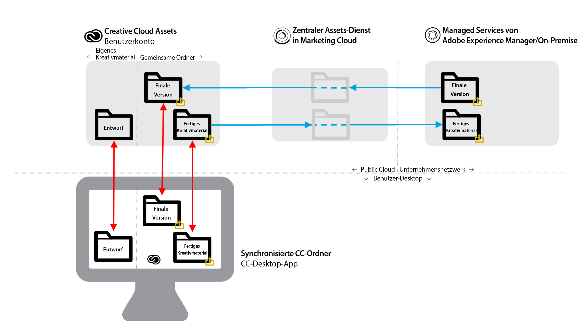

# Best Practices für die Ordnerfreigabe aus AEM in Creative Cloud {#aem-to-creative-cloud-folder-sharing-best-practices}

>[!CAUTION]
>
>Die Ordnerfreigabe von AEM in Creative Cloud wird nicht mehr unterstützt. Adobe empfiehlt dringend die Verwendung neuerer Funktionen wie [Adobe Asset Link](https://helpx.adobe.com/de/enterprise/admin-guide.html/enterprise/using/adobe-asset-link.ug.html) oder [AEM Desktop-App](https://experienceleague.adobe.com/docs/experience-manager-desktop-app/using/using.html?lang=de). Weitere Informationen finden Sie unter [Best Practices zur AEM- und Creative Cloud-Integration](/help/assets/aem-cc-integration-best-practices.md).

Adobe Experience Manager (AEM) kann so konfiguriert werden, dass Benutzer in AEM Assets Ordner für Creative Cloud-Benutzer freigeben können. Daher sind diese Ordner im Creative Cloud Assets-Dienst als freigegebene Ordner verfügbar. Diese Funktion kann verwendet werden, um Dateien zwischen Kreativteams und AEM Assets-Benutzern auszutauschen, insbesondere wenn die kreativen Benutzer keinen Zugriff auf die AEM Assets-Instanz (d. h. keinen Zugriff auf das Unternehmensnetzwerk) haben.

Diese Art der Integration kann in beiden Fällen verwendet werden, insbesondere bei der Zusammenarbeit mit Benutzern, die keinen direkten Zugriff auf AEM Assets haben:

* Freigeben eines Satzes bestimmter Assets aus AEM Assets für Benutzer von Creative Cloud-Dateien (z. B. einen Überblick für das Kreativteam und einen Satz genehmigter Assets für das Design einer neuen Marketingaktivität)
* Empfangen von neuen Dateien von Creative Cloud-Benutzern.

>[!NOTE]
>
>Vor der Lektüre dieses Dokuments können Sie sich die allgemeinen [Best Practices zur AEM- und Creative Cloud-Integration](aem-cc-integration-best-practices.md) durchlesen, wenn Sie sich zunächst einen Überblick über dieses Thema verschaffen möchten.

## Überblick {#overview}

Die Freigabe von AEM zum Creative Cloud-Ordner beruht auf der serverseitigen Freigabe von Ordnern und Dateien zwischen AEM Assets- und Creative Cloud-Konten. Kreativprofis, die die Creative Cloud-Desktop-Anwendung auf ihren Desktops verwenden, können die freigegebenen Ordner zusätzlich mithilfe der Adobe CreativeSync-Technologie direkt auf ihren Festplatten bereitstellen.

Das folgende Diagramm bietet einen Überblick über die Integration.

Die Integration umfasst folgende Elemente:

* **Im Unternehmensnetzwerk bereitgestellter AEM Assets-** Server (verwaltete Dienste oder lokale Dienste): Die Freigabe von Ordnern wird hier initiiert.
* **Zentraler Assets-Dienst in Adobe Marketing Cloud**: Vermittelnder Dienst zwischen AEM und Creative Cloud-Speicherdiensten. Die Verwaltung des Unternehmens, das die Integration nutzt, muss auf einem Vertrauensverhältnis zwischen dem Marketing Cloud-Unternehmen und der AEM Assets-Instanz basieren. Um für zusätzliche Sicherheit zu sorgen, wird [eine Liste von zugelassenen Creative Cloud-Mitwirkenden definiert](https://experienceleague.adobe.com/docs/core-services/interface/assets/t-admin-add-cc-user.html?lang=en#assets), mit denen AEM Assets-Benutzer freigegebene Ordner gemeinsam nutzen können.
* **Webdienste**  für Creative Cloud Assets (Web-Benutzeroberfläche für Datenspeicherung- und Creative Cloud-Dateien): Hier können bestimmte Creative Cloud-Benutzer, für die ein AEM Assets-Ordner freigegeben wurde, die Einladung annehmen und den Ordner in ihrer Creative Cloud-Konto-Datenspeicherung anzeigen.
* **Creative Cloud-Desktop-Anwendung**: (Optional) Ermöglicht den direkten Zugriff auf freigegebene Ordner/Dateien vom Desktop des kreativen Benutzers über die Synchronisierung mit der Creative Cloud Assets-Datenspeicherung.

## Funktionen und Einschränkungen {#characteristics-and-limitations}

* **Einfache Übertragung von Änderungen:** Dateiänderungen werden nur in eine Richtung übertragen - aus dem System (AEM oder Creative Cloud Assets), in dem das Asset ursprünglich erstellt (hochgeladen) wurde. Die Integration bietet keine vollautomatische Zweiwegsynchronisierung zwischen beiden Systemen.

* **Versionierung:**

   * AEM erstellt bei Aktualisierungen nur dann Versionen eines Assets, wenn die Datei von AEM stammt und dort aktualisiert wird.
   * Creative Cloud Assets bietet eine eigene [Versionierungsfunktion](https://helpx.adobe.com/de/creative-cloud/help/versioning-faq.html), die für laufende Aktualisierungen vorgesehen ist (Aktualisierungen werden bis zu zehn Tage gespeichert).

* **Platzbeschränkungen:** Dateigrößen und Dateigrößen, die ausgetauscht werden, sind durch die für Kreativbenutzer  [angegebene Anzahl von ](https://helpx.adobe.com/de/creative-cloud/kb/file-storage-quota.html) Creative Cloud-Assets (je nach Abonnement) und eine Beschränkung der Dateigröße auf 5 GB beschränkt. Darüber hinaus wird der Speicherplatz durch das Assets-Kontingent beschränkt, die das Unternehmen im zentralen Assets-Dienst von Adobe Marketing Cloud festgelegt hat.

* **Platzanforderungen:** Die Dateien in freigegebenen Ordnern müssen auch physisch in AEM und dann im Creative Cloud-Konto gespeichert werden, wobei eine zwischengespeicherte Kopie im Marketing Cloud Assets-Hauptdienst enthalten sein muss.
* **Vernetzung und Bandbreite:** Die Dateien in freigegebenen Ordnern und alle Updates müssen über das Netzwerk zwischen den Systemen übertragen werden. Sie sollten sicherstellen, dass nur relevante Dateien und Aktualisierungen freigegeben werden.
* **Ordnertyp**: Die Freigabe von Assets-Ordnern des Typs `sling:OrderedFolder` wird nicht unterstützt. Wenn Sie einen Ordner bei seiner Erstellung in AEM Assets freigeben möchten, wählen Sie nicht die Option „Geordnet“ aus.

## Best Practices {#best-practices}

Best Practices für die Verwendung der Ordnerfreigabe von AEM in Creative Cloud:

* **Volumenaspekte:** AEM/Creative Cloud-Ordnerfreigabe sollte verwendet werden, um eine kleinere Anzahl von Dateien freizugeben, z. B. für eine bestimmte Kampagne oder Aktivität. Greifen Sie für das Freigeben größerer Mengen von Assets, z. B. aller genehmigten Assets in der Organisation, besser auf andere Methoden zurück (z. B. AEM Assets Brand Portal) oder die AEM Desktop App.
* **Vermeiden Sie die Freigabe von tiefen Hierarchien:** Die Freigabe funktioniert rekursiv und lässt keine selektive Aufhebung der Freigabe zu. Normalerweise sollten nur Ordner ohne Unterordner oder mit einer sehr einfachen Hierarchie, z. B. eine Ebene für Unterordner, für die Freigabe in Erwägung gezogen werden.
* **Separate Ordner für die einmalige Freigabe:** Separate Ordner sollten verwendet werden, um endgültige Assets von AEM Assets in Creative Cloud-Dateien freizugeben und um kreative Assets wieder von Creative Cloud-Dateien in AEM Assets freizugeben. Zusammen mit einer guten Benennungskonvention für diese Ordner wird eine verständlichere Umgebung für AEM Assets- und Creative Cloud-Anwender erstellt.
* **Vermeiden Sie WIP im freigegebenen Ordner:** Freigegebener Ordner sollte nicht für Work in Progress verwendet werden. Verwenden Sie einen separaten Ordner in Creative Cloud Files, um Aufgaben auszuführen, die häufige Dateiänderungen erfordern.
* **Neue Beginn-Arbeit außerhalb des freigegebenen Ordners:** Neue Entwürfe (Kreativdateien) sollten im separaten WIP-Ordner in Creative Cloud-Dateien gestartet werden. Wenn sie für AEM Assets-Benutzer freigegeben werden können, sollten sie verschoben oder in den freigegebenen Ordner gespeichert werden.
* **Vereinfachen Sie die Freigabestruktur:** Für ein besser zu handhabendes Betriebssystem sollten Sie die Freigabestruktur vereinfachen. Anstatt alle Kreativ-Benutzer freizugeben, sollten AEM Assets-Ordner nur für Teamvertreter freigegeben werden, z. B. für einen Kreativdirektor oder Teammanager. Auf diese Weise kann der Leiter des Kreativbereichs endgültige Assets erhalten, über die Arbeitsaufteilung entscheiden und dann die Designer in ihren eigenen Creative Cloud-Konten an den unfertigen Assets arbeiten lassen. Sie können die Arbeit mithilfe von Funktionen zur Zusammenarbeit mit Creative Clouden koordinieren und schließlich Assets, die für die Freigabe an AEM Assets bereit sind, auswählen und in ihren kreativen freigegebenen Ordner einfügen.

Das folgende Diagramm veranschaulicht eine Beispielkonfiguration zum Erstellen neuer Designs auf der Basis bestehender endgültiger Assets von AEM Assets.

