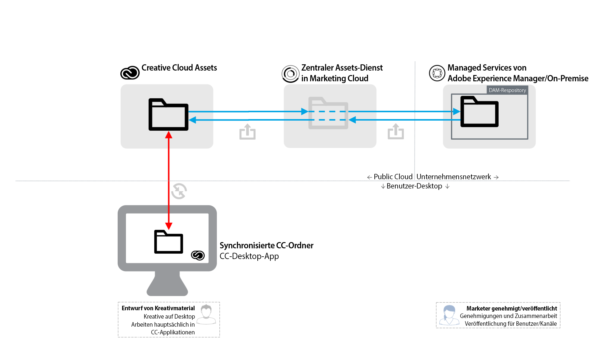

# [!DNL Experience Manager] Best Practices für die  [!DNL Creative Cloud] Ordnerfreigabe {#aem-to-creative-cloud-folder-sharing-best-practices}

>[!CAUTION]
>
>Die Funktion &quot;Experience Manager zur Ordnerfreigabe in Creative Cloud&quot;wird nicht mehr unterstützt. Adobe empfiehlt dringend die Verwendung neuerer Funktionen wie [Adobe Asset Link](https://helpx.adobe.com/de/enterprise/admin-guide.html/enterprise/using/adobe-asset-link.ug.html) oder [Experience Manager-Desktop-Programm](https://experienceleague.adobe.com/docs/experience-manager-desktop-app/using/using.html?lang=de). Weitere Informationen finden Sie unter [Best Practices für die Integration von Experience Managern und Creative Clouden](/help/assets/aem-cc-integration-best-practices.md).

Adobe Experience Manager kann so konfiguriert werden, dass Benutzer in Experience Manager Assets Ordner für Creative Cloud-Benutzer freigeben können, sodass sie als freigegebene Ordner im Creative Cloud Assets-Dienst verfügbar sind. Die Funktion kann zum Austausch von Dateien zwischen Kreativ-Teams und Experience Manager Assets-Benutzern verwendet werden, insbesondere dann, wenn die Kreativbenutzer keinen Zugriff auf die Experience Manager Assets-Instanz haben (sie befinden sich nicht im Unternehmensnetzwerk).

Dieser Integrationstyp kann in beiden Anwendungsfällen verwendet werden, insbesondere bei der Arbeit mit Benutzern, die keinen direkten Zugriff auf Experience Manager-Assets haben:

* Freigeben einer Reihe bestimmter Assets aus Experience Manager Assets für Creative Cloud-Dateibenutzer (z. B. eine Kreativelement-Kurzbeschreibung und eine Reihe genehmigter Assets für Designarbeiten für eine neue Marketingaktivität)
* Empfangen von neuen Dateien von Creative Cloud-Benutzern.

>[!NOTE]
>
>Bevor Sie dieses Dokument lesen, können Sie die allgemeinen Best Practices für die Integration von Experience Managern und Creative Clouden ](aem-cc-integration-best-practices.md) durchlesen, um einen Überblick über das Thema zu erhalten.[

## Übersicht {#overview}

Die Ordnerfreigabe von Experience Managern in Creative Clouden beruht auf der serverseitigen Freigabe von Ordnern und Dateien zwischen Experience Manager Assets und Creative Cloud-Konten. Kreativprofis, die das Creative Cloud-Desktop-Programm auf ihren Desktops verwenden, können die freigegebenen Ordner zusätzlich mithilfe der Adobe CreativeSync-Technologie direkt auf ihren Datenträgern verfügbar machen.

Das folgende Diagramm bietet einen Überblick über die Integration.

Die Integration umfasst folgende Elemente:

* **[!DNL Assets]** Server, der im Unternehmensnetzwerk bereitgestellt wird (Managed Services oder On-Premise): Die Ordnerfreigabe wird hier initiiert.
* **Adobe Marketing Cloud Assets Core Service**: fungiert als Vermittler zwischen Experience Manager- und Creative Cloud-Speicherdiensten. Der Administrator des Unternehmens, das die Integration verwendet, muss eine Vertrauensbeziehung zwischen der Marketing Cloud-Organisation und der Experience Manager Assets-Instanz herstellen. Um für zusätzliche Sicherheit zu sorgen, wird [eine Liste von zugelassenen Creative Cloud-Mitwirkenden definiert](https://experienceleague.adobe.com/docs/core-services/interface/assets/t-admin-add-cc-user.html#assets), mit denen  Assets-Benutzer freigegebene Ordner gemeinsam nutzen können.
* **Creative Cloud Assets-Webdienste**  (Web-Benutzeroberfläche für Speicher- und Creative Cloud-Dateien): Hier können bestimmte Creative Cloud-Benutzer, für die ein Assets-Ordner freigegeben wurde, die Einladung annehmen und den Ordner in ihrem Creative Cloud-Kontospeicher anzeigen.
* **Creative Cloud-Desktop-Programm**: (Optional) Ermöglicht den direkten Zugriff auf freigegebene Ordner/Dateien vom Desktop des kreativen Benutzers über die Synchronisierung mit dem Creative Cloud Assets-Speicher.

## Funktionen und Einschränkungen {#characteristics-and-limitations}

* **Einwegübertragung von Änderungen:**  Dateiänderungen werden nur in eine Richtung propagiert - aus dem System (Experience Manager- oder Creative Cloud-Assets), in dem das Asset ursprünglich erstellt (hochgeladen) wurde. Die Integration bietet keine vollautomatische Zweiwegsynchronisierung zwischen beiden Systemen.

* **Versionierung:**

   * Experience Manager erstellt bei Aktualisierungen nur Versionen eines Assets, wenn die Datei aus Experience Manager stammt und dort aktualisiert wird.
   * Creative Cloud Assets bietet eine eigene [Versionierungsfunktion](https://helpx.adobe.com/de/creative-cloud/help/versioning-faq.html), die für laufende Aktualisierungen vorgesehen ist (Aktualisierungen werden bis zu zehn Tage gespeichert).

* **Speicherplatzbeschränkungen:** Die Größe und die Menge der ausgetauschten Dateien ist durch die für kreative Benutzer  [angegebenen Asset-](https://helpx.adobe.com/de/creative-cloud/kb/file-storage-quota.html) Creative Cloud (abhängig von der Abonnementebene) und eine Beschränkung der Dateigröße auf maximal 5 GB beschränkt. Darüber hinaus wird der Speicherplatz durch das Assets-Kontingent beschränkt, die das Unternehmen im zentralen Assets-Dienst von Adobe Marketing Cloud festgelegt hat.

* **Speicheranforderungen:**  Die Dateien in freigegebenen Ordnern müssen ebenfalls physisch in Experience Manager und dann im Creative Cloud-Konto gespeichert werden, wobei eine Kopie im Marketing Cloud Assets Core Service zwischengespeichert werden muss.
* **Netzwerke und Bandbreite:** Die Dateien in freigegebenen Ordnern und alle Updates müssen über das Netzwerk zwischen den Systemen übertragen werden. Sie sollten sicherstellen, dass nur relevante Dateien und Aktualisierungen freigegeben werden.
* **Ordnertyp**: Die Freigabe von Assets-Ordnern des Typs `sling:OrderedFolder` wird nicht unterstützt. Wenn Sie einen Ordner beim Erstellen in Experience Manager-Assets freigeben möchten, wählen Sie nicht die Option &quot;Geordnet&quot;aus.

## Best Practices {#best-practices}

Best Practices zur Nutzung der Ordnerfreigabe von Experience Managern in Creative Clouden:

* **Überlegungen zum Volumen:** Experience Manager, die Dateiordnerfreigabe sollte verwendet werden, um eine kleinere Anzahl von Creative Clouden freizugeben, z. B. für eine bestimmte Kampagne oder Aktivität. Verwenden Sie andere Verteilungsmethoden (z. B. Experience Manager Assets Brand Portal) oder das Experience Manager-Desktop-Programm, um größere Asset-Sets wie alle genehmigten Assets in der Organisation freizugeben.
* **Vermeiden Sie die Freigabe tiefer Hierarchien:**  Die Freigabe funktioniert rekursiv und lässt keine selektive Aufhebung der Freigabe zu. Normalerweise sollten nur Ordner ohne Unterordner oder mit einer sehr einfachen Hierarchie, z. B. eine Ebene für Unterordner, für die Freigabe in Erwägung gezogen werden.
* **Separate Ordner für die unidirektionale Freigabe:** Separate Ordner sollten verwendet werden, um endgültige Assets von Experience Manager-Assets in Creative Cloud-Dateien freizugeben und Kreativ-bereitgestellte Assets wieder aus Creative Cloud-Dateien in freizugeben  [!DNL Assets]. Zusammen mit einer guten Benennungskonvention für diese Ordner wird eine besser verständliche Arbeitsumgebung für Experience Manager Assets und Creative Cloud-Benutzer erstellt.
* **Vermeiden Sie WIP im freigegebenen Ordner:** Der freigegebene Ordner sollte nicht für laufende Arbeiten verwendet werden. Verwenden Sie einen separaten Ordner in Creative Cloud Files , um Arbeiten durchzuführen, die häufige Dateiänderungen erfordern.
* **Beginnen Sie neue Arbeit außerhalb des freigegebenen Ordners:** Neue Designs (Kreativdateien) sollten im separaten WIP-Ordner in den Creative Cloud-Dateien gestartet werden. Sobald sie für Experience Manager Assets-Benutzer freigegeben werden können, sollten sie verschoben oder im freigegebenen Ordner gespeichert werden.
* **Vereinfachung der Freigabestruktur:** Für eine besser verwaltbare Funktionsweise sollten Sie über eine Vereinfachung der Freigabestruktur nachdenken. Anstatt alle Kreativ-Benutzer freizugeben, sollten Experience Manager Assets-Ordner nur für Teammitarbeiter freigegeben werden, z. B. für einen Kreativdirektor oder Teammanager. Auf diese Weise kann der Leiter des Kreativbereichs endgültige Assets erhalten, über die Arbeitsaufteilung entscheiden und dann die Designer in ihren eigenen Creative Cloud-Konten an den unfertigen Assets arbeiten lassen. Sie können Funktionen zur Zusammenarbeit mit Creative Clouden verwenden, um die Arbeit zu koordinieren, Assets, die bereit sind, für Experience Manager-Assets freizugeben, auszuwählen und schließlich in ihren Ordner zu verschieben, der für kreative Zwecke nutzbar ist.

Das folgende Diagramm zeigt eine Beispielkonfiguration zum Erstellen neuer Designs, die auf vorhandenen endgültigen Assets aus Experience Manager Assets basieren.

