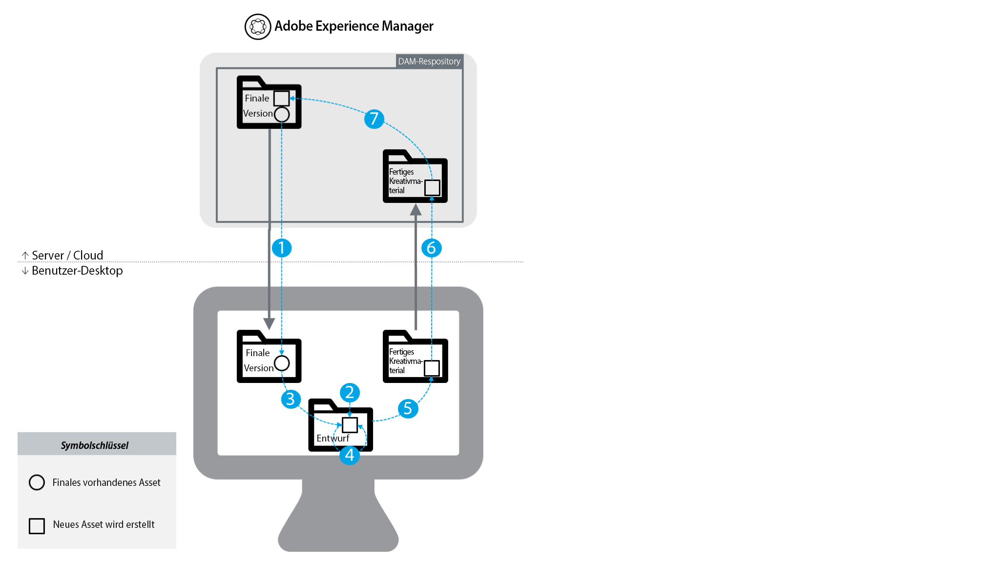
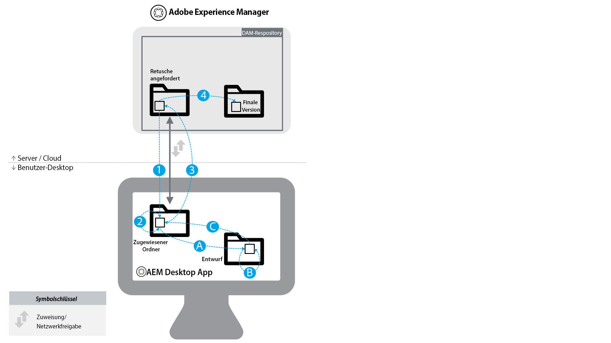

# Best Practices für die Integration von [!DNL Experience Manager] und [!DNL Creative Cloud] {#aem-and-creative-cloud-integration-best-practices}

<!-- TBD: Reconcile with 6.5 article that's ahead of this article now in terms of content streamlining and structuring.
-->

Adobe Experience Manager Assets ist eine DAM-Lösung (Digital Asset Management), die mit Adobe Creative Cloud integriert werden kann, um DAM-Benutzer bei der Zusammenarbeit mit Kreativ-Teams zu unterstützen und so die Kooperation beim Erstellen von Inhalten zu optimieren.

Adobe Creative Cloud bietet Kreativ-Teams ein System von Lösungen und Services, um digitale Assets zu erstellen. Dieses Angebot enthält Desktop-Programme und Mobile Apps, Cloud-Services wie Speicher mit Desktop-Synchronisierung oder Web-Erlebnis sowie Marktplätze wie Adobe Stock.

Lesen Sie weiter, um mehr darüber zu erfahren, welche Integration Sie zwischen Desktop und DAM-Enterprise-System abhängig vom Nutzungsszenario und von den entsprechenden Best Practices für die Verbindungs-Workflows wählen sollten.

>[!NOTE]
>
>Ordnerfreigabe aus [!DNL Experience Manager] zu Creative Cloud ist veraltet und wird nicht mehr in diesem Handbuch behandelt. Adobe empfiehlt die Verwendung neuerer Funktionen wie [Adobe Asset Link](https://helpx.adobe.com/de/enterprise/using/adobe-asset-link.html) oder [[!DNL Experience Manager] Desktop-Programm](https://experienceleague.adobe.com/docs/experience-manager-desktop-app/using/introduction.html?lang=de) , um kreativen Benutzern Zugriff auf Assets zu gewähren, die in verwaltet werden. [!DNL Experience Manager].

## Kooperationsanforderungen von Kreativen, Marketern und DAM-Benutzenden {#collaboration-needs-of-creatives-marketers-and-dam-users}

| Voraussetzungen | Nutzungsszenario | Betroffene Oberflächen |
|---|---|---|
| Vereinfachtes Desktop-Erlebnis für Kreative | Für Kreativprofis oder allgemein für Desktop-Benutzer, die mit nativen Anwendungen zur Asset-Erstellung arbeiten, soll der Zugriff auf Assets von einem DAM-System ([!DNL Assets]) optimiert werden. Sie benötigen eine einfache und unkomplizierte Möglichkeit zum Identifizieren, Verwenden (Öffnen), Bearbeiten und Speichern von Änderungen in [!DNL Experience Manager] sowie zum Hochladen neuer Dateien. | Windows- oder Mac-Desktop, Creative Cloud-Programme |
| Bereitstellen von hochwertigen, gebrauchsfertigen Assets aus Adobe Stock | Marketer tragen zu einer schnelleren Inhaltserstellung bei, indem sie beim Beschaffen von und Suchen nach Assets helfen. Kreativprofis verwenden die genehmigten Assets direkt in ihren Kreativ-Tools. | [!DNL Assets]; Adobe Stock Marketplace; Metadatenfelder |
| Verteilen und Freigeben von Assets nach Organisationen | Interne Abteilungen/Zweigstellen und externe Partner, Distributoren und Agenturen verwenden die genehmigten Assets, die von der übergeordneten Organisation freigegeben wurden. Die Organisation möchte die erstellten Assets sicher und nahtlos für eine größere Wiederverwendung freigeben. | Brand Portal, Asset Share Commons |

## Adobe-Angebote zur Unterstützung von Kooperationsbedarf {#adobe-offerings-to-support-the-collaboration-need}

| Wertangebot für die betroffenen Benutzer | Adobe-Angebot | Betroffene Oberflächen |
|---|---|---|
| Kreative Benutzer können Assets aus [!DNL Experience Manager], öffnen und verwenden Sie sie, bearbeiten und laden Sie Änderungen in hoch. [!DNL Experience Manager], und laden Sie neue Dateien in hoch. [!DNL Experience Manager], ohne Creative Cloud-Apps zu verlassen. | [Adobe Asset Link](https://helpx.adobe.com/enterprise/using/adobe-asset-link.html) | Photoshop, Illustrator und InDesign |
| Business-Anwender vereinfachen das Öffnen und Verwenden von Assets, das Bearbeiten und Hochladen von Änderungen in [!DNL Experience Manager] sowie das Hochladen neuer Dateien aus der Desktop-Umgebung in [!DNL Experience Manager]. Sie nutzen eine generische Integration, um jeden Asset-Typ in nativen Desktop-Programmen zu öffnen, auch von anderen Anbietern als Adobe. | [[!DNL Experience Manager] -Desktop-Programm](https://experienceleague.adobe.com/docs/experience-manager-desktop-app/using/using.html?lang=de) | [!DNL Experience Manager] Desktop App auf Windows- und Mac-Desktop |
| Marketer und Geschäftsbenutzer können die Adobe Stock-Assets in der [!DNL Experience Manager]. Lizenzierte und gespeicherte Assets liefern ausgewählte Adobe Stock-Metadaten für eine bessere Governance. | [Integration von Experience Manager und Adobe Stock](aem-assets-adobe-stock.md) | [!DNL Experience Manager]-Web-Oberfläche |

Dieser Artikel konzentriert sich in erster Linie auf die ersten beiden Aspekte der Zusammenarbeit. Die Verteilung und Beschaffung von Vermögenswerten im entsprechende Maß wird kurz als Verwendungsfall genannt. Für solche Lösungen sollten Sie Adobe Brand Portal oder Asset Share Commons beachten. Alternative Lösungen wie [Brand Portal](https://helpx.adobe.com/de/experience-manager/brand-portal/user-guide.html), Lösungen, die auf Basis von [Asset Share Commons](https://adobe-marketing-cloud.github.io/asset-share-commons/)-Komponenten oder [Link-Freigabe](/help/assets/link-sharing.md) mithilfe von [Experience Manager Assets](/help/assets/managing-assets-touch-ui.md) erstellt werden können, sind auf Grundlage der spezifischen Anforderungen zu prüfen.

![Creative Cloud-Verbindungen für [!DNL Experience Manager]: Festlegen der zu verwendenden Funktion](assets/creative-connections-aem.png)

<!-- 
## Terms and definitions {#terms-and-definitions}

The terms used in this document may have a different meaning in other contexts. In particular, the following terms pertaining to the digital asset lifecycle are used when referring to workflows between a creative professional's desktop and DAM:

* **Work-in-progress or creative work-in-progress (WIP):** A phase in asset lifecycle where an asset undergoes multiple changes and is typically not yet ready to be shared with broader teams.
* **Creative-ready assets:** Assets that are ready to be shared with a broader team, or have been  selected / approved  by the creative team for sharing with marketing or LOB teams.
* **Asset approvals:** The approval process that runs for assets already uploaded to DAM, which typically includes brand approvals, legal approvals, and so on.
* **Final asset:** An asset that has gone through all  approvals/metadata  tagging and is ready to be used by the broader team. Such an asset is stored in DAM and made available to all (or all interested) users. It can be used in marketing channels or by creative teams to create designs.
* **Minor asset  update/change:** A quick and small change to a digital asset. It is often made in response to a retouching or minor editing request, asset review, or approval (for example, reposition, change text size, adjust saturation/brightness, color, and so on).
* **Major asset  update/change:** A change to a digital asset that requires considerable work, and sometimes must be done over a longer period of time. It typically includes multiple changes. The asset must be saved multiple times while being updated. Major asset updates typically cause the asset to enter a WIP stage.
* **DAM:** Digital asset management. In this document, it is synonymous with Experience Manager Assets, unless specifically mentioned otherwise.
* **Creative user:** A creative professional, who creates digital assets using Creative Cloud apps and services. In some cases, a creative user may be a member of a creative team who may use Creative Cloud, but does not create digital assets (like a creative director or creative team manager).
* **DAM user:** A typical user of a DAM system. Depending on the organization, a DAM user can be a marketing or a non-marketing user, for example a Line-of-Business (LOB) user, librarian, sales person, and so on.
-->

### Zuordnen von Anwendungsfällen

| Nutzungsszenario | [!DNL Experience Manager]-Desktop-Programm | Ordnerfreigabe | Andere Lösungen |
|---|---|---|---|
| Freigeben einer kleineren Anzahl (1) von DAM-Assets für einen kreativen Benutzer | ✔ | ms |  |
| Freigeben einer größeren Anzahl (2) von DAM-Assets für einen kreativen Benutzer | ✔ | ✘ | [Brand Portal](https://experienceleague.adobe.com/docs/experience-manager-brand-portal/using/home.html?lang=de)   [Asset-Freigabe](assets-finder-editor.md) |
| Freigabe von DAM-Assets für Benutzer, die Zugriff auf DAM haben | ✔ | ms | [Link-Freigabe](link-sharing.md) |
| Freigabe von DAM-Assets für Benutzer, die keinen Zugriff auf DAM haben | ✘ | ✔ | [Brand Portal](https://experienceleague.adobe.com/docs/experience-manager-brand-portal/using/home.html)   [Asset-Freigabe](assets-finder-editor.md) |
| Speichern einer kleineren Anzahl/Menge von Assets in DAM | ✔ | ms | [Hochladen über die Web-Benutzeroberfläche](managing-assets-touch-ui.md) |
| Speichern einer größeren Anzahl von Assets in DAM (3) | ✔ | ✘ | [Hochladen über die Web-Benutzeroberfläche](managing-assets-touch-ui.md)   Benutzerdefiniertes Skript/Tool |
| Migrieren einer sehr großen Anzahl von Assets zu DAM | ✘ | ✘ | [Migrationshandbuch](assets-migration-guide.md) |
| Schnelles Öffnen eines Assets auf dem Desktop | ✔ | ✘ |  |
| Schnelles Öffnen und Ändern eines Assets auf dem Desktop | ✔ | ✘ |  |

Die Legende für die Symbole:

* ✔✔: bevorzugte Lösung
* ✔: akzeptable Lösung
* ✘: sollte nicht für das Nutzungsszenario verwendet werden

Zusätzliche Hinweise:

* (1) Kleinere Anzahl von Assets: Beispiel: ein kleiner Satz von Assets, die sich auf ein Projekt oder eine Kampagne beziehen
* (2) Größere Anzahl von Assets: z. B. alle genehmigten Assets in der Organisation
* (3) Verwendung [!DNL Experience Manager] Funktion zum Hochladen von Ordnern mit dem Desktop-Programm

Um Nutzungsszenarien zum Verteilen von Assets zu unterstützen, sollten andere Lösungen in Betracht gezogen werden:

* [Brand Portal](https://helpx.adobe.com/experience-manager/brand-portal/user-guide.html) für ein konfigurierbares SaaS-Add-on auf [!DNL Experience Manager] Assets zum Veröffentlichen von Assets.
* Benutzerdefinierte Lösungen auf Grundlage der [Asset Share Commons](https://adobe-marketing-cloud.github.io/asset-share-commons/)-Code-Basis.
* [!DNL Experience Manager][-Linkfreigabe](/help/assets/link-sharing.md), um Assets ad hoc mithilfe von Links freizugeben.
* [[!DNL Experience Manager] Assets-Web-Benutzeroberfläche](/help/assets/managing-assets-touch-ui.md) mit Gebieten für externe Parteien, die durch [!DNL Experience Manager] Einrichtung der Zugriffssteuerung und mit den erforderlichen IT-/Netzwerkkonfigurationsanpassungen, die diesen externen Benutzern Zugriff auf [!DNL Experience Manager].

## Grundlegende Konzepte und Nutzungsszenarien {#key-concepts-and-use-cases}

### Glossar der allgemeinen Begriffe {#glossary-of-common-terms}

* **Laufende Arbeit oder laufende kreative Arbeit (Work-In-Progress, WIP):** Eine Phase im Asset-Lebenszyklus, in der ein Asset mehrfach geändert wird und in der Regel noch nicht zur Freigabe für breitere Teams bereit ist.
* **Fertige Kreativ-Assets:** Assets, die für ein breiteres Team freigegeben werden können oder die vom Kreativ-Team für die Freigabe mit Marketing- oder LOB-Teams ausgewählt/genehmigt wurden.
* **Asset-Genehmigungen:** Der Genehmigungsprozess, der für Assets ausgeführt wird, die bereits auf DAM hochgeladen wurden. Dazu gehören in der Regel Markengenehmigungen, Genehmigungen usw.
* **Abgeschlossenes Asset:** Ein Asset, für das alle Genehmigungen/Metadaten-Tagging durchgeführt wurden und das bereit für die Verwendung durch das breitere Team ist. Ein solches Asset wird in DAM gespeichert und allen (bzw. allen interessierten) Benutzern zur Verfügung gestellt. Es kann in Marketing-Kanälen oder von Kreativ-Teams verwendet werden, um Designs zu erstellen.
* **Kleinere Asset-Aktualisierung/-Änderung:** Schnelle, kleine Änderung an einem digitalen Asset. Diese wird häufig aufgrund einer Retuschieranfrage oder einer kleineren Bearbeitungsanfrage, einer Asset-Überprüfung oder einer Genehmigung (z. B. Neupositionierung, Änderung der Textgröße, Anpassung der Sättigung/Helligkeit, Farbe usw.) durchgeführt.
* **Größere Asset-Aktualisierung/-Änderung:** Änderung eines digitalen Assets, die viel Arbeit erfordert und manchmal über einen längeren Zeitraum erfolgen muss. Diese umfasst in der Regel mehrere Änderungen. Das Asset muss während der Aktualisierung mehrmals gespeichert werden. Bei umfangreichen Asset-Aktualisierungen wird das Asset in der Regel in eine WIP-Phase versetzt.
* **DAM:** Digital Asset Management. In diesem Dokument wird der Begriff synonym mit [!DNL Experience Manager Assets] verwendet, sofern nicht ausdrücklich anders angegeben.
* **Kreativer Benutzer:** Kreativprofi, der digitale Assets mit Creative Cloud-Programmen und -Services erstellt. In einigen Fällen kann ein kreativer Benutzer Mitglied eines Kreativ-Teams sein, das möglicherweise Creative Cloud verwendet, aber keine digitalen Assets erstellt (z. B. Creative Director oder Creative Team Manager).
* **DAM-Benutzer:** Ein typischer Benutzer eines DAM-Systems. Je nach Organisation kann ein DAM-Benutzer ein Marketing- oder Nicht-Marketing-Benutzer sein, z. B. Branchenbenutzer, Bibliothekar, Vertriebsmitarbeiter usw.

### Überlegungen zur Verwendung von [!DNL Experience Manager] und Creative Cloud-Integration {#considerations-when-using-aem-and-creative-cloud-integration}

* Siehe [Best Practices für das Desktop-Programm](https://experienceleague.adobe.com/docs/experience-manager-desktop-app/using/troubleshoot.html?lang=de#best-practices-to-prevent-troubles)
* Siehe [Adobe Stock-Integration](aem-assets-adobe-stock.md)
* Siehe [Adobe Asset Link](https://helpx.adobe.com/enterprise/using/adobe-asset-link.html)

Dies ist eine kurze Zusammenfassung der Best Practices für die Integration von Experience Manager und Creative Cloud. Lesen Sie den Rest dieses Dokuments, um detaillierte Informationen dazu zu erhalten.

* **Für kreative Benutzer, die in Photoshop, InDesign oder Illustrator arbeiten:** Adobe Asset Link bietet ein optimales Benutzererlebnis, einschließlich der ordnungsgemäßen Abwicklung laufender Arbeiten an aus ausgecheckten Assets.[!DNL Experience Manager]
* **Für einen vereinfachten Desktop-Zugriff auf Assets in beliebigen allgemeinen Dateiformaten oder Applikationen:** Verwenden Sie das [!DNL Experience Manager]-Desktop-Programm
* **Verstehen, warum und wann Assets in DAM gespeichert werden:** Aktualisierungen, die dem größeren Team in Ihrer Organisation zur Verfügung zu stellen sind
* **Beachten des Volumens freigegebener Assets:** Wenn Ihr Anwendungsfall die Asset-Verteilung ist, könnten Governance und Sicherheit die wichtigsten Aspekte sein. Erwägen Sie die Verwendung von Tools, die für eine skalierte Vorgehensweise entwickelt wurden, wie z. B. Brand Portal.
* **Wissenswertes über den Asset-Lebenszyklus:** Sie müssen wissen, welche Assets in Ihrer Organisation von den verschiedenen Teams genutzt werden.
* **Sorgfältige Verarbeitung häufiger Asset-Speichervorgänge:** Adobe Asset Link übernimmt diese Aufgabe für Sie – mit PS, AI und ID. Führen Sie für andere Programme keine laufenden Arbeitsaufgaben im zugeordneten/freigegebenen Ordner aus, es sei denn, Sie benötigen alle Änderungen in DAM.

### Zugriff auf Adobe Stock-Assets über [!DNL Assets] {#access-to-adobe-stock-assets-from-aem-assets}

[[!DNL Experience Manager] und Adobe Stock-Integration](/help/assets/aem-assets-adobe-stock.md) stellt [!DNL Experience Manager] Benutzer mit der Möglichkeit, Assets aus Adobe Stock in zu suchen, eine Vorschau anzuzeigen, zu lizenzieren und zu speichern [!DNL Experience Manager]. Lizenzierte und gespeicherte Adobe Stock-Assets verfügen über ausgewählte Adobe Stock-Metadaten, mit denen Suchvorgänge über zusätzliche Filter durchgeführt werden können.

Einige wichtige Punkte zu dieser Integration:

* Wenn Assets aus dem Adobe-Bestand in gespeichert werden [!DNL Experience Manager], werden sie zu regulären [!DNL Experience Manager] Assets, wobei die Binärdatei im [!DNL Experience Manager] Repository. Einige mit Adobe Stock verknüpfte Metadaten werden für das Asset in [!DNL Experience Manager], andernfalls sieht der Aufnahmevorgang genauso aus wie bei jeder anderen Datei. Wenn beispielsweise Smart-Tags aktiv sind, werden die Tags beim Speichern diesen Assets hinzugefügt.
* Das Asset, das in gespeichert wurde [!DNL Experience Manager] ist eine Kopie, kein Link zurück zu Adobe Stock.

**[!DNL Experience Manager]Arbeiten mit Assets in Creative Cloud, die aus Adobe Stock in gespeichert wurden**. Diese Integration ist zwar unabhängig von Adobe Asset Link, aber Adobe Asset Link erkennt diese so aus Adobe Stock gespeicherten Assets und zeigt zusätzliche Metadaten sowie ein Adobe Stock-Symbol auf diesen Assets in der Adobe Asset Link-Erweiterungsoberfläche in Photoshop, Illustrator bzw. InDesign an. Die Dateien stehen zum Durchsuchen, Öffnen usw. zur Verfügung, da sie regulär sind [!DNL Experience Manager] Assets beim Speichern in [!DNL Experience Manager].
Kreative Benutzer, die in Creative Cloud-Apps mit vorhandener Adobe Asset Link-Erweiterung arbeiten, haben nicht nur Zugriff auf bereits lizenzierte Assets von Adobe Stock in [!DNL Experience Manager]kann auch das Bedienfeld Creative Cloud-Bibliotheken verwenden, um Adobe Stock-Assets zu suchen, in der Vorschau anzuzeigen und zu lizenzieren.
In lizenzierte und gespeicherte Assets aus Adobe Stock [!DNL Experience Manager] für breitere Teams verfügbar sein, die auf [!DNL Experience Manager] Assets-Bereitstellung, während Kreative, die Assets aus Adobe Stock über das Bedienfeld Creative Cloud-Bibliotheken lizenzieren, diese nur standardmäßig in ihrem Creative Cloud-Konto zur Verfügung stellen.

<!-- 
TBD: A condensed version of the below content is better placed in the Adobe DAM article.
-->

## Informationen zum Speichern von Assets in DAM {#about-storing-assets-in-a-dam}

Für das Entwickeln eines effizienten Workflows zwischen Kreativ-Teams und Marketing-/Branchen-Teams sowie für die Auswahl der besten Begleitfunktionen ist es wichtig zu verstehen, wann und warum Assets in DAM gespeichert werden.

### Warum Assets in DAM gespeichert werden {#why-assets-are-stored-in-dam}

Das Speichern von Assets in DAM macht sie leicht zugänglich und auffindbar. Es wird sichergestellt, dass die Assets von verschiedenen Benutzern in der gesamten Organisation oder im gesamten System genutzt werden, z. B. von Kunden, Partnern usw.

Die meisten Unternehmen speichern nur Assets, die für nachgelagerte Marketing-/LOB-Prozesse relevant sind (Veröffentlichen in Kanälen wie Webkanälen über [!DNL Experience Manager] Sites oder andere Kanäle, die von Adobe Experience Cloud, Advertising Cloud bereitgestellt und von Analytics Cloud gemessen werden (Bereitstellung für Benutzer/Partner usw.). Außerdem speichern Organisationen Assets, für die möglicherweise ein Prüfungs-/Genehmigungsprozess in DAM erfolgt. Auf diese Weise werden hauptsächlich Assets in DAM gespeichert, die mit hoher Wahrscheinlichkeiten genutzt werden, und das Speichern von Assets im Leerlauf wird vermieden.

Die Speicherung von Assets hängt außerdem von Überlegungen zu technischen Aspekten und zur Ressourcennutzung ab. DAM bietet zusätzliche Services rund um gespeicherte Assets, darunter Extrahieren von Metadaten, Versionierung, Erstellen von Vorschauen/Transcodierung, Verwalten von Referenzen und Hinzufügen von Informationen zur Zugriffssteuerung. Diese Services erfordern zusätzlich Zeit und Infrastrukturressourcen.

Häufig ist das Speichern aller Assets und Aktualisierungen nicht empfehlenswert. Beispiel: Wenn Aktualisierungen von schlechter Qualität sind und einen unverhältnismäßigen Ressourcenverbrauch aufweisen, sollten die Assets nicht in DAM gespeichert werden.

### Wann Assets in DAM gespeichert werden {#when-assets-are-stored-in-dam}

Kreativ-Teams (und Organisationen) sind in der Regel nicht daran interessiert, Assets in jeder Phase des Asset-Lebenszyklus zu speichern. Beispielsweise vermeiden sie das Speichern von Assets in den folgenden Fällen:

* Assets, die noch nicht abgeschlossen sind, oder zum Experimentieren verwendet werden
* Assets, die den Prüfungszyklus des Kreativ-Teams/internen Teams nicht bestehen
* Verglichen mit dem betreffenden Asset verfügt das Team über bessere Beispiele für seine Arbeit, um sie externen Teams vorzustellen

In der Regel werden Assets der folgenden Klassen in DAM gespeichert:

* Assets, die einen bestimmten Reifegrad erreicht haben und als bereit zur Freigabe für andere Benutzer gelten
* Assets, die vorab vom Kreativ-Team ausgewählt wurden
* Bestimmte Asset-Formate, die vom Marketing-Team verwendet werden können oder abhängig von einem bestimmten Vertrag bzw. einer Vereinbarung angefordert wurden (z. B. aus RAW-Dateien konvertierte JPG-Dateien, TIFF-Dateien/-Bilder aus PSD-Originaldateien)

### Wann Aktualisierungen von Assets in DAM gespeichert werden {#when-updates-to-assets-are-stored-in-dam}

In der Regel sollten nur Aktualisierungen von Assets in DAM gespeichert werden, die für den Großteil der DAM-Benutzer relevant sind. Dadurch wird sichergestellt, dass Benutzern (Marketing- und ähnliche Funktionen) in der DAM-Asset-Zeitleiste nur relevante Versionen angezeigt werden.

Normalerweise handelt es sich dabei um Änderungen in Bezug auf die wichtigsten Meilensteine im Asset-Lebenszyklus. Beispielsweise sollte das ursprüngliche fertige Kreativ-Asset oder eine offizielle Aktualisierung basierend auf einer Anforderung/Überprüfung durch das Kreativteam in DAM gespeichert und versioniert werden.

Die Aktualisierung des Kreativ-Teams zur Überprüfung durch das Marketing-Team nach einer Änderungsanfrage für ein vorhandenes Asset in DAM ist ein Beispiel für eine relevante Aktualisierung. Diese sollte als Referenzmaterial oder zum Zurücksetzen auf die letzte Version in DAM gespeichert und versioniert werden.

Es folgen Beispiele für Updates, die normalerweise nicht relevant sind:

* Frühe Versionen von Assets, die hochgeladen wurden, bevor sie für die Marketingüberprüfung bereit waren
* Häufige kreative Änderungen am Asset in der WIP-Phase, bevor das Kreativteam das Asset für fertig erklärt

### Benutzerzugriff auf DAM {#user-access-to-dam}

[!DNL Experience Manager] Assets unterstützt zwei Arten von Benutzern, die auf deren Zugriff auf die Assets-Implementierung basieren. [!DNL Experience Manager] Normalerweise haben Benutzer innerhalb des Unternehmensnetzwerks (Firewall) direkten Zugriff auf DAM. Andere Benutzer außerhalb des Unternehmensnetzwerks haben dagegen keinen direkten Zugriff. Der Benutzertyp bestimmt, welche Integrationen aus technischer Sicht verwendet werden können.

#### Kreative Benutzer mit direktem Zugriff auf DAM {#creative-users-with-direct-access-to-dam}

Normalerweise haben interne Kreativ-Teams oder Agenturen/Kreativprofis, die in das interne Netzwerk  im internen Netzwerk integriert sind, haben Zugriff auf die DAM-Instanz, einschließlich [!DNL Experience Manager] anmelden.

In diesen Fällen [!DNL Experience Manager] Das -Desktop-Programm bietet einfachen Zugriff auf endgültige/genehmigte Assets und ermöglicht das Speichern von fertigen Kreativ-Assets in DAM.

#### Kreative Benutzer ohne Zugriff auf DAM {#creative-users-without-access-to-dam}

Externe Agenturen oder Freiberufler ohne direkten Zugriff auf die DAM-Instanz benötigen möglicherweise Zugriff auf genehmigte Assets oder möchten ihre neuen Designs in DAM hinzufügen.

In solchen Fällen können Sie die [!DNL Experience Manager]/Creative Cloud-Integration zur Verbesserung des Workflows. Die Voraussetzung ist, dass die kreativen Benutzer über eine Adobe ID und ein Creative Cloud-Konto mit Speicherdienst verfügen.

Stellen Sie mit den folgenden Strategien Zugriff auf abgeschlossene/genehmigte Assets bereit:

* So gewähren Sie Zugriff auf eine große Anzahl von Assets: Verwendung [[!DNL Experience Manager] Assets Brand Portal](https://experienceleague.adobe.com/docs/experience-manager-brand-portal/using/home.html)oder der Implementierung der [Asset-Freigabe](assets-finder-editor.md) on [!DNL Experience Manager] Veröffentlichungs-Infrastruktur

* So gewähren Sie Zugriff auf einige Assets: [!DNL Experience Manager] Die Ordnerfreigabe mit Adobe Creative Cloud kann zusätzlich zu [!DNL Experience Manager] Assets Brand Portal oder Asset-Freigabe. Beachten Sie, dass es bestimmte Einschränkungen bei dieser Integration gibt, die in diesem Artikel ausführlicher behandelt werden.

### Anwendungsfälle {#use-cases}

In den folgenden Nutzungsszenarios werden verschiedene Arten von Workflows zwischen DAM und dem Desktop des Designers beschrieben.

#### Erstellen neuer Designs mithilfe von Assets aus DAM {#creating-new-designs-using-assets-from-dam}

Das folgende Diagramm illustriert den Lebenszyklus von digitalen Assets. Es veranschaulicht, wie kreative Benutzer und DAM-Benutzer (Marketingexperten, Branchenbenutzer) vorhandene Assets nutzen, zur Erstellung weiterer Assets verwenden und zur Genehmigung senden.

Der Asset-Lebenszyklus umfasst die folgenden Phasen:

1. Freigabe genehmigter Assets in Creative Desktop: Abgeschlossene Assets aus DAM werden kreativen Benutzern (auf dem Desktop) zur Verfügung gestellt.
1. Erstellen eines neuen Designs (kreatives digitales Asset): Eine neue Datei wird im Bereich für laufende Arbeit (WIP) gespeichert.
1. Verwenden (Platzieren) genehmigter Assets in einem neuen Design: Der kreative Benutzer erstellt ein neues Asset mithilfe vorhandener genehmigter Assets in Creative Cloud-Apps
1. Häufiges Speichern von WIP-Aktualisierungen: Der kreative Benutzer iteriert schnell und speichert die Datei häufig. In dieser Phase kann der kreative Benutzer mit anderen zusammenarbeiten, aber die häufig gespeicherten Aktualisierungen sind  für DAM-Benutzer normalerweise nicht von Interesse.
1. Das Asset erreicht den Status „fertiges Kreativ-Asset“ und wird im entsprechenden Ordner gespeichert.
1. Asset-  update : Eine Asset-Aktualisierung oder eine neue Datei ist in DAM für Benutzer verfügbar.
1. Asset wird in die Produktion verschoben: Dies ist ein DAM-Prozess, der je nach Organisation Tagging, Genehmigungen und eine Änderung der Zugriffskontrolle umfassen kann. In dieser Phase gilt das Asset als abgeschlossen und kann von größeren Teams verwendet werden, die DAM nutzen. Es kann auch von kreativen Benutzern zum Erstellen weiterer Assets verwendet werden.

Hier finden Sie einige allgemeine Empfehlungen zur Verwaltung von Assets während dieses Prozesses:

* Verwenden Sie einen dedizierten Speicherbereich/-system, z. B. den synchronisierten Ordner &quot;Adobe Creative Cloud Assets&quot;, für die WIP-Dateien: Häufige Updates, die für DAM-Benutzer nicht relevant sind, werden am besten von einem dedizierten System verarbeitet und nicht von innerhalb [!DNL Experience Manager] Assets. WIP-Assets können mit dem Adobe Creative Cloud-Desktop-Programm auf die lokale Festplatte synchronisiert, auf dem lokalen Speicher gespeichert usw.
* Verwenden Sie getrennte Ordner/Freigaben für abgeschlossene Assets und Assets, die in DAM hochgeladen werden: Der Übersichtlichkeit wegen sollten sich abgeschlossene Assets (Beispiel „Final“ oben) als auch Assets, die wieder in DAM hochgeladen werden („Creative Ready“ oben), in einem eigenen zugeordneten/freigegebenen Ordner befinden.

#### Vorhandene Assets ändern, die in DAM verwaltet werden {#changing-existing-assets-managed-in-dam}

In einigen Fällen können Assets in DAM Änderungen erfordern. Beispiele dafür sind:

* Anforderung von Änderungen an Assets aus der Überprüfung und Genehmigung, die in [!DNL Experience Manager] Assets
* Wesentliche Aktualisierungen von vorhandenen abgeschlossenen Assets
* Schnelle Bearbeitungen einer vorhandenen Datei (insbesondere bevor diese abschließend genehmigt wird)

In diesen Fällen [!DNL Experience Manager] Das -Desktop-Programm bietet die einfachste Möglichkeit, diese Vorgänge auszuführen.

Hier wird der Ereignisablauf im Diagramm dargestellt:

<!-- TBD for formatting. 
This article will get fixed automatically when 6.5 content is ported to it.
And 6.5 content will be ported after updating it for [!DNL Experience Manager] desktop app 2.0 best practices.
And it will be updated for DA2.0 best practices after 6.5 repo is available for writers to edit content in.
-->

* **1:** Geben Sie das Asset von DAM für den Desktop frei oder öffnen Sie es direkt auf dem Desktop in der gewünschten Anwendung (z. B. Adobe Photoshop usw.). Das Auschecken wird empfohlen, um die Datei zu sperren.
* **2:** Geringfügige Aktualisierung: Bearbeiten Sie die Datei und speichern Sie die Änderungen.
* Alternativer Ablauf zu Schritt 2

   * **A:** Wesentliche Aktualisierung: Wenn die Datei mehrere aufwendige Änderungen erfordert, sollte sie von Zeit zu Zeit gespeichert und in einen Ordner/Bereich für laufende Arbeit kopiert werden.
   * **B:** Die Arbeit an der Datei wird in den WIP-Ordnern fortgesetzt. Die gespeicherten Änderungen werden nicht mit der Version in DAM synchronisiert.
   * **C:** Nach Abschluss der Aktualisierungen wird die Datei wieder in den zugeordneten Ordner kopiert oder dort gespeichert.

* **3:** Asset-Aktualisierungen werden in DAM übernommen. Checken Sie das Asset ein, um es zu entsperren.
* **4:** Asset wird in die Produktion verschoben.

Hier finden Sie einige allgemeine Empfehlungen zur Verwaltung von Assets während dieses Prozesses:

* Vermeiden Sie das direkte Speichern einer Datei, die Sie über eine Netzwerkfreigabe geöffnet haben, die von [!DNL Experience Manager] Desktop-Programm, es sei denn, die Änderungen, die Sie an der Datei vorgenommen haben, sind gering.
* Kopieren Sie die Datei in einen separaten WIP-Ordner, wenn Sie weitere Änderungen daran vornehmen möchten, speichern Sie gelegentlich oder arbeiten Sie mit dem Kreativteam zusammen.

#### Massen-Upload in DAM {#bulk-upload-to-dam}

In einigen Szenarien müssen Sie möglicherweise eine größere Anzahl von Dateien gleichzeitig in DAM hochladen. Beispiele dafür sind:

* Hochladen der Ergebnisse von Foto-Shootings oder größeren Projekten
* Hochladen von Assets von Kreativagenturen
* Hochladen von Assets aus einem größeren Satz, wenn die Auswahl außerhalb von DAM erfolgt

Hinweis: Diese Beschreibung bezieht sich auf das betriebsbedingte Hochladen von Dateien (z. B. jede Woche oder bei jedem  Fotoshootings usw.), als normaler Teil des Workflows des Desktop-Benutzers. Das Migrieren großer Assets wird hier nicht behandelt.

Für den Massenupload von Assets können Sie die folgenden Funktionen nutzen:

* Verwenden Sie zum Hochladen großer/hierarchischer Ordner die [!DNL Experience Manager] -Desktop-Programm, das eine [Ordner-Upload](https://helpx.adobe.com/de/experience-manager/desktop-app/aem-desktop-app.html#bulkupload) Funktion. Sie können auch hierarchische Ordnerstrukturen hochladen. Das Hochladen von Assets erfolgt im Hintergrund und ist daher nicht an eine Webbrowser-Sitzung gebunden.
* Wenn Sie einige Dateien aus einem Ordner hochladen möchten, ziehen Sie sie direkt vom Desktop in die Web-Benutzeroberfläche oder verwenden Sie die Option Erstellen im [!DNL Experience Manager] Assets-Web-Benutzeroberfläche.

>[!NOTE]
>
>Je nach Ihren Geschäftsanforderungen können Sie auch benutzerdefinierte Upload-Programme verwenden.

#### Verwalten digitaler Assets direkt auf dem Desktop {#managing-digital-assets-directly-from-desktop}

Wenn Sie digitale Assets mithilfe von Netzwerk-Dateifreigaben verwalten, kann stattdessen einfach die über das [!DNL Experience Manager]-Desktop-Programm zugeordnete Netzwerkfreigabe verwendet werden. Beachten Sie beim Übergang von Netzwerkdateifreigaben Folgendes: [!DNL Experience Manager] Die Web-Benutzeroberfläche bietet eine Vielzahl von Digital Asset Management-Funktionen, die weit über das hinausgehen, was in einer Netzwerkfreigabe möglich ist (Suche, Sammlungen, Metadaten, Zusammenarbeit, Vorschau usw.), und [!DNL Experience Manager] Das -Desktop-Programm bietet einen praktischen Link, um das serverseitige DAM-Repository mit der Arbeit auf dem Desktop zu verbinden.

Vermeiden Sie die Verwendung von [!DNL Experience Manager] -Desktop-Programm zum Verwalten von Assets direkt in der Netzwerkfreigabe von [!DNL Experience Manager] Assets. Vermeiden Sie beispielsweise die Verwendung des [!DNL Experience Manager]-Desktop-Programms zum Verschieben/Kopieren mehrerer Dateien. Verwenden Sie stattdessen die [!DNL Experience Manager] Assets-Web-Benutzeroberfläche, um Ordner aus Finder/Explorer in die Netzwerkfreigabe zu ziehen oder die [!DNL Experience Manager] Funktion &quot;Asset-Ordner-Upload&quot;.

#### Asset-Migration {#asset-migration}

Informationen zum Planen und Ausführen von Asset-Migrationen von vorhandenen Systemen in ein neues System oder Migrieren großer Mengen von auf Servern gespeicherten Assets finden Sie im [Migrationshandbuch](/help/assets/assets-migration-guide.md). [!DNL Experience Manager] Desktop App und Integrationen aus in Creative Cloud unterstützen keine derartigen Migrationen. [!DNL Experience Manager] Aufgrund der großen Menge an aufzunehmenden Assets und der zusätzlichen Anforderungen rund um Metadatenzuordnungen, Transformationen und Aufnahmen sollten Migrationen mithilfe anderer Tools und Ansätze erfolgen.

>[!MORELIKETHIS]
>
>* [Adobe Asset Link](https://helpx.adobe.com/in/enterprise/admin-guide.html/in/enterprise/using/adobe-asset-link.ug.html)
>* [[!DNL Experience Manager] Best Practices für das Desktop-Programm](https://experienceleague.adobe.com/docs/experience-manager-desktop-app/using/archive/best-practices-for-v1.html?lang=de)
>* [[!DNL Experience Manager] Brand Portal](https://experienceleague.adobe.com/docs/experience-manager-brand-portal/using/introduction/brand-portal.html?lang=de)
>* [[!DNL Experience Manager] und Adobe Stock-Integration](aem-assets-adobe-stock.md)

