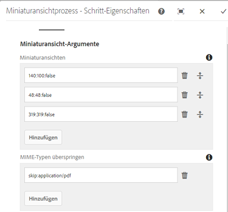
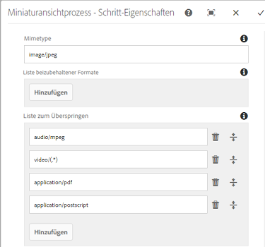
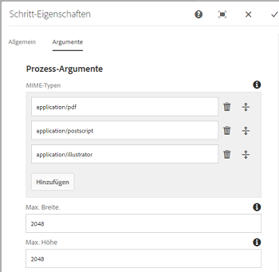
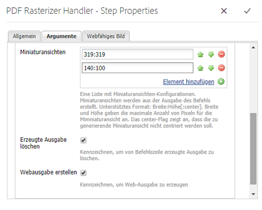
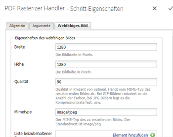
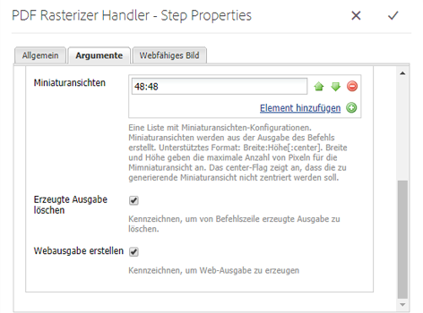
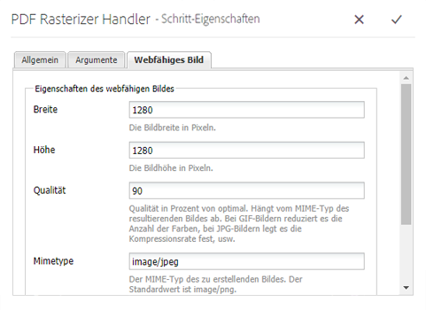

# Verwenden von PDF Rasterizer {#using-pdf-rasterizer}

>[!CAUTION]
>
>AEM 6.4 hat das Ende der erweiterten Unterstützung erreicht und diese Dokumentation wird nicht mehr aktualisiert. Weitere Informationen finden Sie in unserer [technische Unterstützung](https://helpx.adobe.com/de/support/programs/eol-matrix.html). Unterstützte Versionen suchen [here](https://experienceleague.adobe.com/docs/?lang=de).

Wenn Sie große, inhaltslastige PDF- oder AI-Dateien in [!DNL Adobe Experience Manager Assets] hochladen, erstellt die Standardbibliothek u. U. keine genaue Ausgabe. Die Adobe PDF Rasterizer-Bibliothek kann zuverlässigere und präzisere Ausgaben erstellen als Standardbibliotheken. Adobe empfiehlt die Verwendung der PDF Rasterizer-Bibliothek für folgende Szenarien:

Adobe empfiehlt die Verwendung der PDF Rasterizer-Bibliothek für folgende Dateien:

* Hohe, inhaltsintensive AI-Dateien oder PDF-Dateien.
* AI-Dateien und PDF-Dateien mit Miniaturansichten, die nicht standardmäßig generiert werden.
* AI-Dateien mit PMS-Farben (Pantone Matching System)

Mit PDF Rasterizer erstellte Miniaturansichten und Vorschauen weisen im Vergleich mit der standardmäßigen Ausgabe eine bessere Qualität auf und bieten daher eine konsistente Darstellung auf allen Geräten. Die Adobe PDF Rasterizer-Bibliothek unterstützt keine Farbraumkonvertierung. Die Ausgabe erfolgt immer an RGB, unabhängig vom Farbraum der Quelldatei.

1. Installieren Sie das PDF Rasterizer-Paket auf Ihrer [!DNL Adobe Experience Manager]-Bereitstellung von [Software Distribution](https://experience.adobe.com/#/downloads/content/software-distribution/de/aem.html?package=/content/software-distribution/de/details.html/content/dam/aem/public/adobe/packages/cq650/product/assets/aem-assets-pdf-rasterizer-pkg-4.4.zip).

   >[!NOTE]
   >
   >Die PDF Rasterizer-Bibliothek ist nur für Windows und Linux verfügbar.

1. Greifen Sie auf die [!DNL Assets] Workflow-Konsole zu unter `https://[aem_server]:[port]/workflow`. Öffnen Sie den Workflow [!UICONTROL DAM-Update-Asset].

1. Gehen Sie folgendermaßen vor, um die Generierung von Miniaturansichten und Web-Ausgabedarstellungen für PDF- und AI-Dateien mit den Standardmethoden zu verhindern:

   * Öffnen Sie die **[!UICONTROL Miniaturansichten]** Schritt und Hinzufügen `application/pdf` oder `application/postscript` im **[!UICONTROL MIME-Typen überspringen]** Feld unter **[!UICONTROL Miniaturen]** nach Bedarf.

   

   * Fügen Sie auf der Registerkarte **[!UICONTROL Webfähiges Bild]** je nach Ihren Anforderungen `application/pdf` oder `application/postscript` unter **[!UICONTROL Liste zum Überspringen]** hinzu.

   

1. Öffnen Sie den Schritt **[!UICONTROL PDF-/AI-Bildvorschau-Wiedergabe rastern]** und entfernen Sie den MIME-Typ, für den Sie die standardmäßige Erstellung von Bildvorschau-Ausgabedarstellungen überspringen möchten. Entfernen Sie beispielsweise den MIME-Typ `application/pdf`, `application/postscript` oder `application/illustrator` aus der Liste **[!UICONTROL MIME-Typen]**.

   

1. Ziehen Sie den Schritt **[!UICONTROL PDF Rasterizer-Handler]** aus dem Seitenbereich unter den Schritt **[!UICONTROL Miniaturansichten verarbeiten]**.
1. Konfigurieren Sie die folgenden Argumente für den Schritt **[!UICONTROL PDF Rasterizer-Handler]**:

   * MIME-Typen: `application/pdf` oder `application/postscript`
   * Befehle: `PDFRasterizer -d -s 1280 -t PNG -i ${file}`
   * Fügen Sie Größen für Miniaturansichten hinzu: 319:319, 140:100, 48:48. Fügen Sie ggf. eine benutzerdefinierte Konfiguration für Miniaturansichten hinzu.

   Die Befehlszeilenargumente für den `PDFRasterizer`-Befehl können Folgendes enthalten:

   * `-d`: Flag für eine reibungslose Darstellung von Text, Vektorgrafiken und Bildern. Erstellt Bilder mit besserer Qualität. Wenn Sie diesen Parameter einbeziehen, wird der Befehl jedoch langsam ausgeführt und die Bildgröße erhöht.

   * `-s`: Maximale Bildabmessung (Höhe oder Breite). Dieser Wert wird für jede Seite in DPI umgewandelt. Wenn Seiten eine andere Größe haben, kann jede Seite möglicherweise um einen anderen Wert skaliert werden. Der Standardwert ist die tatsächliche Seitengröße.

   * `-t`: Typ des Ausgabebildes. Gültige Typen sind JPEG, PNG, GIF und BMP. Das Standardformat ist JPEG.

   * `-i`: Pfad für die Eingabe-PDF. Dieser Parameter ist erforderlich.

   * `-h`: Hilfe

1. Um Zwischenausgabeformate zu löschen, wählen Sie **[!UICONTROL Erzeugte Ausgabe löschen]**.
1. Um Web-Ausgabedarstellungen von PDF Rasterizer generieren zu lassen, wählen Sie **[!UICONTROL Webausgabe erstellen]** aus.

   

1. Legen Sie die Einstellungen auf der Registerkarte **[!UICONTROL Webfähiges Bild]** fest.

   

1. Speichern Sie den Workflow.
1. Damit PDF Rasterizer PDF-Seiten mit PDF-Bibliotheken verarbeiten kann, öffnen Sie das Modell **[!UICONTROL DAM-Prozess-Teil-Asset]** über die [!UICONTROL Workflow]-Konsole.
1. Ziehen Sie im Seitenbereich den Schritt „PDF Rasterizer-Handler“ unter den Schritt **[!UICONTROL Webfähige Bildwiedergaben erstellen]**.
1. Konfigurieren Sie die folgenden Argumente für den Schritt **[!UICONTROL PDF Rasterizer-Handler]**:

   * MIME-Typen: `application/pdf` oder `application/postscript`
   * Befehle: `PDFRasterizer -d -s 1280 -t PNG -i ${file}`
   * Fügen Sie Größen für Miniaturansichten hinzu: `319:319`, `140:100`, `48:48`. Fügen Sie ggf. eine benutzerdefinierte Konfiguration für Miniaturansichten hinzu.

   Die Befehlszeilenargumente für den `PDFRasterizer`-Befehl können Folgendes enthalten:

   * `-d`: Flag für eine reibungslose Darstellung von Text, Vektorgrafiken und Bildern. Erstellt Bilder mit besserer Qualität. Wenn Sie diesen Parameter einbeziehen, wird der Befehl jedoch langsam ausgeführt und die Bildgröße erhöht.

   * `-s`: Maximale Bildabmessung (Höhe oder Breite). Dieser Wert wird für jede Seite in DPI umgewandelt. Wenn Seiten eine andere Größe haben, kann jede Seite möglicherweise um einen anderen Wert skaliert werden. Der Standardwert ist die tatsächliche Seitengröße.

   * `-t`: Typ des Ausgabebildes. Gültige Typen sind JPEG, PNG, GIF und BMP. Das Standardformat ist JPEG.

   * `-i`: Pfad für die Eingabe-PDF. Dieser Parameter ist erforderlich.

   * `-h`: Hilfe

1. Um Zwischenausgabeformate zu löschen, wählen Sie **[!UICONTROL Erzeugte Ausgabe löschen]**.
1. Um Web-Ausgabedarstellungen von PDF Rasterizer generieren zu lassen, wählen Sie **[!UICONTROL Webausgabe erstellen]** aus.

   

1. Legen Sie die Einstellungen auf der Registerkarte **[!UICONTROL Webfähiges Bild]** fest.

   

1. Speichern Sie den Workflow.
1. Laden Sie eine PDF- oder AI-Datei in [!DNL Experience Manager Assets] hoch. PDF Rasterizer erstellt die Miniaturansichten und Webausgaben für die Datei.
