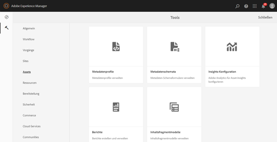
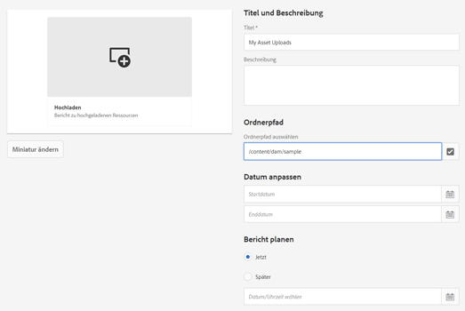
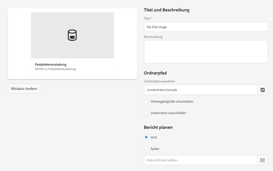
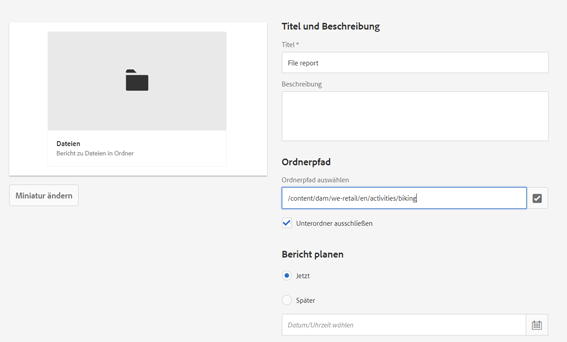
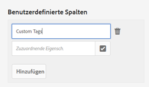
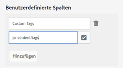

# Asset-Berichte {#asset-reports}

Mit Asset Berichte können Sie das Dienstprogramm Ihrer [!DNL Adobe Experience Manager Assets] Bereitstellung bewerten. Damit [!DNL Assets]können Sie verschiedene Berichte für Ihre digitalen Assets erstellen. Die Berichte bieten hilfreiche Informationen über die Nutzung Ihres Systems, über die Art und Weise, wie Benutzer mit Assets interagieren und welche Assets heruntergeladen und freigegeben werden.

Use the information in the reports to derive key success metrics to measure the adoption of [!DNL Assets] within your enterprise and by customers.

The [!DNL Assets] reporting framework uses [!DNL Sling] jobs to asynchronously process report requests in an ordered manner. Es ist für große Repositorys skalierbar. Die asynchrone Berichtsverarbeitung steigert die Effizienz und Geschwindigkeit der Berichtsgenerierung.

Die Berichtsverwaltungsoberfläche ist intuitiv und umfasst detaillierte Optionen und Steuerelemente für den Zugriff auf archivierte Berichte und das Anzeigen des Ausführungsstatus von Berichten („Erfolg“, „Fehlgeschlagen“ und „In Warteschlange“).

Wenn ein Bericht generiert wird, werden Sie mit einer E-Mail (optional) und einer Benachrichtigung im Posteingang benachrichtigt. Sie können einen Bericht auf der Berichtslistenseite anzeigen, herunterladen oder löschen. Dort werden alle zuvor generierten Berichte angezeigt.

## Voraussetzung {#prerequisite-for-reporting}

Um Berichte zu erstellen, stellen Sie Folgendes sicher:

* Aktivieren Sie den [!UICONTROL Day CQ DAM Ereignis Recorder] -Dienst unter **[!UICONTROL Tools]** > **[!UICONTROL Vorgänge]** > **[!UICONTROL Web-Konsole]**.
* Wählen Sie die Aktivitäten oder Ereignis aus, auf denen Sie Berichte haben möchten. Um beispielsweise einen Bericht zu heruntergeladenen Assets zu erstellen, wählen Sie &quot; [!UICONTROL Asset heruntergeladen (HERUNTERGELADEN)]&quot;aus.

## Erstellen von Berichten {#generate-reports}

[!DNL Experience Manager Assets] erstellt die folgenden Standardberichte für Sie:

* Hochladen
* Download
* Ablauf
* Änderung
* Veröffentlichen
* [!DNL Brand Portal] publish
* Festplattenauslastung
* Dateien
* Link-Freigabe

[!DNL Adobe Experience Manager] Administratoren können diese Berichte ganz einfach für Ihre Implementierung erstellen und anpassen. Um einen Bericht zu erstellen, müssen Administratoren folgende Schritte durchführen:

1. Klicken Sie in der [!DNL Experience Manager] Benutzeroberfläche auf **[!UICONTROL Werkzeuge]** > **[!UICONTROL Assets]** > **[!UICONTROL Berichte]**.

   

1. On the [!UICONTROL Asset Reports] page, click **[!UICONTROL Create]** from the toolbar.
1. From the **[!UICONTROL Create Report page]** page, choose the report you want to create and click **[!UICONTROL Next]**.

   

   >[!NOTE]
   >
   >Standardmäßig sind die Inhaltsfragmente und Linkfreigaben im Bericht „Asset heruntergeladen“ enthalten. Wählen Sie die passende Option aus, um einen Bericht zu Linkfreigaben zu erstellen oder Inhaltsfragmente aus dem Downloadbericht auszuschließen.

   >[!NOTE]
   >
   >Der [!UICONTROL Download] -Bericht zeigt nur Details zu den Assets an, die einzeln ausgewählt und heruntergeladen wurden. Es enthält jedoch keine Details zu den Assets, die sich in einem heruntergeladenen Ordner befanden.

1. Konfigurieren Sie die Berichtdetails wie Titel, Beschreibung, Miniaturansicht sowie den Ordnerpfad im CRX-Repository, der den Speicherort des Berichts angibt. By default, the folder path is `/content/dam`. Sie können auch einen anderen Pfad festlegen.

   

   Wählen Sie den Datumsbereich für Ihren Bericht aus.

   Sie können den Bericht wahlweise sofort oder zu einem zukünftigen Zeitpunkt generieren lassen.

   >[!NOTE]
   >
   >Wenn Sie den Bericht zu einem späteren Zeitpunkt planen, stellen Sie sicher, dass Sie das Datum und die Uhrzeit in den Feldern Datum und Uhrzeit angeben. Wenn Sie keinen Wert angeben, behandelt die Berichterstattungs-Engine den Bericht als einen sofort zu erstellenden Bericht.

   Die Konfigurationsfelder unterscheiden sich möglicherweise basierend auf der Art des erstellten Berichts. Beispielsweise bietet der Bericht zur **[!UICONTROL Festplattenauslastung]** Optionen, um bei der Berechnung des von Assets genutzten Festplattenvolumens Asset-Ausgabeformate miteinzubeziehen. Sie können Assets zur Berechnung der Speichernutzung in Unterordnern ein- oder ausschließen.

   >[!NOTE]
   >
   >Der Bericht zur **[!UICONTROL Festplattenauslastung]** umfasst keine Felder für den Datumsbereich, da er nur den aktuellen Speicherbedarf angibt.

   

   When you create the **[!UICONTROL Files]** report, you can include/exclude sub-folders. Bei diesem Bericht können Sie jedoch keine Asset-Ausgabeformate miteinbeziehen.

   

   The **[!UICONTROL Link Share]** report displays URLs to assets that are shared with external users from within [!DNL Assets]. Er enthält E-Mail-IDs des Benutzers, der die Assets freigegeben hat, E-Mail-IDs von Benutzern, für die die Assets freigegeben wurden, Freigabedatum und Ablaufdatum des Links. Die Spalten können nicht angepasst werden.

   The **[!UICONTROL Link Share]** report, does not include options for sub-folders and renditions because it merely publishes the shared URLs that appear under `/var/dam/share`.

   

1. Click **[!UICONTROL Next]** from the toolbar.

1. Auf der Seite **[!UICONTROL Spalten konfigurieren]** sind einige Spalten standardmäßig für den Bericht ausgewählt. Sie können weitere Spalten auswählen. Heben Sie die Auswahl einer Spalte auf, wenn sie nicht im Bericht angezeigt werden soll.

   

   To display a custom column name or property path, configure the properties for the asset binary under the `jcr:content` node in CRX. Alternativ können Sie sie über die Auswahl für den Eigenschaftspfad hinzufügen.

   

1. Click **[!UICONTROL Create]** from the toolbar. Eine Meldung benachrichtigt Sie darüber, dass die Berichtserstellung startet.
1. On the [!UICONTROL Asset Reports] page, the report generation status is based on the current state of the report job, for example [!UICONTROL Success], [!UICONTROL Failed], [!UICONTROL Queued], or [!UICONTROL Scheduled]. Derselbe Status wird auch im Benachrichtigungsfeld angezeigt.Klicken Sie zur Ansicht der Berichtsseite auf den Link Bericht. Alternatively, select the report, and click **[!UICONTROL View]** from the toolbar.

   

   Click **[!UICONTROL Download]** from the toolbar to download the report in CSV format.

## Hinzufügen benutzerdefinierter Spalten     {#add-custom-columns}

Sie können folgenden Berichten benutzerdefinierte Spalten hinzufügen, um weitere Daten für Ihre speziellen Anforderungen anzuzeigen:

* Hochladen
* Download
* Ablauf
* Änderung
* Veröffentlichen
* [!DNL Brand Portal] publish
* Dateien

Gehen Sie wie folgt vor, um benutzerspezifische Spalten zu diesen Berichten hinzuzufügen:

1. Klicken Sie [!DNL Manager interface]im Fenster auf **[!UICONTROL Werkzeuge]** > **[!UICONTROL Assets]** > **[!UICONTROL Berichte]**.
1. On the [!UICONTROL Asset Reports] page, click **[!UICONTROL Create]** from the toolbar.

1. From the **[!UICONTROL Create Report]** page, choose the report you want to create and click **[!UICONTROL Next]**.
1. Konfigurieren Sie Berichtsdetails wie Titel, Beschreibung, Miniaturansicht, Ordnerpfad und Datumsbereich wie gewünscht.

1. Um eine benutzerdefinierte Spalte anzuzeigen, geben Sie den Namen der Spalte unter **[!UICONTROL Benutzerdefinierte Spalten]** an.

   

1. Fügen Sie den Eigenschaftspfad mit der Auswahl für den Eigenschaftspfad im `jcr:content`-Knoten in CRXDE hinzu. Alternativ können Sie den Pfad im Feld „Eigenschaftspfad“ eingeben.

   

   Alternativ können Sie den Pfad im Feld „Eigenschaftspfad“ eingeben.

   

   To add more custom columns, click **[!UICONTROL Add]** and repeat steps 5 and 6.

1. Click **[!UICONTROL Create]** from the toolbar. Eine Meldung benachrichtigt Sie darüber, dass die Berichtserstellung startet.

## Konfigurieren des Bereinigungsdiensts {#configure-purging-service}

Um nicht mehr benötigte Berichte zu entfernen, konfigurieren Sie den Bereinigungsdienst für DAM-Berichte über die Web-Konsole, um vorhandene Berichte basierend auf Menge und Alter zu bereinigen.

1. Greifen Sie über `https://[aem_server]:[port]/system/console/configMgr` auf die Web-Konsole (Configuration Manager) zu.
1. Öffnen Sie die Konfiguration für den **[!UICONTROL Bereinigungsdienst für DAM-Berichte]**.
1. Geben Sie die Häufigkeit (Zeitintervall) für den Bereinigungsdienst in das Feld `scheduler.expression.name` ein. Sie können auch die Schwellenwerte für das Alter und die Menge der Berichte konfigurieren.
1. Speichern Sie die Änderungen.
