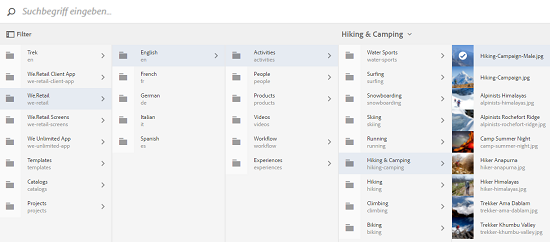
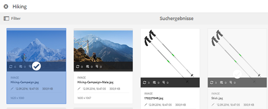
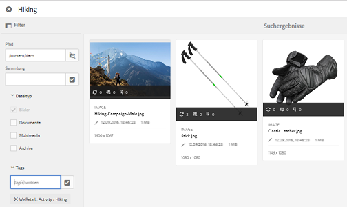

# Asset-Wähler {#asset-selector}

>[!NOTE]
>
>Die Asset-Auswahl hieß in früheren Versionen von AEM [Asset-Auswahl](https://helpx.adobe.com/experience-manager/6-2/assets/using/asset-picker.html).

Mit der Asset-Auswahl können Sie Assets in [!DNL Adobe Experience Manager] Assets durchsuchen, suchen und filtern. Außerdem können Sie die Metadaten der Assets abrufen, die Sie über den Asset-Wähler auswählen. Sie können die Benutzeroberfläche des Asset-Wählers mit unterstützten Anforderungsparametern starten, um sie anzupassen. Mit diesen Parametern wird der Kontext des Asset-Wählers für ein bestimmtes Szenario festgelegt.

Derzeit können Sie die Anforderungsparameter `assettype` (*Bild/Video/Text*) und die Auswahl `mode` (*Einfach/Mehrere*) als Kontextinformationen für die Asset-Auswahl übergeben, die während der gesamten Auswahl intakt bleibt.

Die Asset-Auswahl verwendet die HTML5-Meldung **Window.postMessage**, um Daten für das ausgewählte Asset an den Empfänger zu senden.

Der Asset-Wähler basiert auf dem Vokabular der Foundation-Auswahl von Granite. Standardmäßig wird die Asset-Auswahl im Durchsuchen-Modus ausgeführt. Sie können jedoch mithilfe der Omniture Search-Erfahrung Filter anwenden, um Ihre Suche nach bestimmten Assets zu verfeinern.

Sie können jede Webseite (unabhängig davon, ob sie zum CQ-Container gehört) mit der Asset-Auswahl (`https://[AEM_server]:[port]/aem/assetpicker.html`) integrieren.

## Kontextparameter {#contextual-parameters}

Sie können die folgenden Anfrageparameter in einer URL übergeben, um den Asset-Wähler in einem bestimmten Kontext zu starten:

| Name | Werte | Beispiel | Zweck |
|---|---|---|---|
| resource suffix (B) | Ordnerpfad als Ressourcensuffix in der URL:`http://localhost:4502/aem/` `assetpicker.html/<folder_path>` | Um die Asset-Auswahl mit einem bestimmten ausgewählten Ordner zu starten, z. B. wenn der Ordner `/content/dam/we-retail/en/activities` ausgewählt ist, muss die URL dem folgenden Formular entsprechen: `http://localhost:4502/aem/assetpicker.html` `/content/dam/we-retail/en/activities?assettype=images` | Wenn beim Starten des Asset-Wählers ein bestimmter Ordner ausgewählt sein soll, können Sie ihn als Ressourcensuffix übergeben. |
| mode | single, multiple | `http://localhost:4502/aem/assetpicker.html` `?mode=multiple`   `http://localhost:4502/aem/assetpicker.html` `?mode=single` | Im Modus „multiple“ können Sie mit dem Asset-Wähler mehrere Assets gleichzeitig auswählen. |
| dialog | true, false | `http://localhost:4502/aem/assetpicker.html` `?dialog=true` | Verwenden Sie diese Parameter, um den Asset-Wähler als Granite-Dialogfeld zu öffnen. Diese Option ist nur relevant, wenn Sie den Asset-Wähler per Granite-Pfadfeld starten und als pickerSrc-URL konfigurieren. |
| root | `<folder_path>` | `http://localhost:4502/aem/` `assetpicker.html?assettype=images` `&root=/content/dam/we-retail/en/activities` | Verwenden Sie diese Option, um den Stammordner für den Asset-Wähler anzugeben. In diesem Fall können Sie mit dem Asset-Wähler nur untergeordnete Assets (direkt/indirekt) unter dem Stammordner auswählen. |
| viewmode | Suchen |  | So starten Sie die Asset-Auswahl im Suchmodus mit den Parametern &quot;Asset-Typ&quot;und &quot;mimetype&quot;. |
| assettype (S) | images, documents, multimedia, archives | <ul><li>`http://localhost:4502/aem/assetpicker.html?viewmode=search&assettype=images`</li> <li>`http://localhost:4502/aem/assetpicker.html?viewmode=search&assettype=documents`</li> <li>`http://localhost:4502/aem/assetpicker.html?viewmode=search&assettype=multimedia`</li> <li>`http://localhost:4502/aem/assetpicker.html?viewmode=search&assettype=archives`</li> | Verwenden Sie diese Option, um die Asset-Typen basierend auf dem übergebenen Wert zu filtern. |
| mimetype | MIME-Typen (`/jcr:content/metadata/dc:format`) eines Assets (Platzhalter wird ebenfalls unterstützt) | <ul><li>`http://localhost:4502/aem/assetpicker.html?viewmode=search&mimetype=image/png`</li>  <li>`http://localhost:4502/aem/assetpicker.html?viewmode=search&?mimetype=*png`</li>  <li>`http://localhost:4502/aem/assetpicker.html?viewmode=search&mimetype=*presentation`</li>  <li>`http://localhost:4502/aem/assetpicker?viewmode=search&mimetype=*presentation&mimetype=*png`</li></ul> | Verwenden Sie diese Option zum Filtern von Assets anhand von MIME-Typen. |

## Verwenden Sie die Asset-Auswahl {#using-the-asset-selector}

1. Wechseln Sie für den Zugriff auf die Benutzeroberfläche des Asset-Wählers zu `https://[AEM_server]:[port]/aem/assetpicker`.
1. Navigieren Sie zum gewünschten Ordner und wählen Sie mindestens ein Asset aus.

   

   Alternativ dazu können Sie über das OmniSearch-Feld nach dem gewünschten Asset suchen und es dann auswählen.

   

   Wenn Sie das OmniSearch-Feld zum Suchen nach Assets verwenden, können Sie im Bereich **[!UICONTROL Filter]** verschiedene Filter auswählen, um Ihre Suche einzugrenzen.

   

1. Tippen/klicken Sie auf **[!UICONTROL Wählen Sie]** in der Symbolleiste aus.
