# Asset-Vorlagen {#asset-templates}

Asset-Vorlagen sind eine spezielle Asset-Klasse, die die schnelle Wiederverwendung visuell ansprechender Inhalte für digitale und Druckmedien erleichtert. Eine Asset-Vorlage enthält zwei Teile: den unveränderlichen Messagingabschnitt und den bearbeitbaren Abschnitt.

Der unveränderliche Messagingabschnitt kann proprietären Inhalt enthalten, z. B. das Markenlogo und Copyright-Informationen, die nicht bearbeitet werden können. Der bearbeitbare Bereich kann visuelle und textuelle Inhalte in Feldern enthalten, die bearbeitet werden können, um Nachrichten anzupassen.

Da eingeschränkte Bearbeitungen flexibel vorgenommen werden können, während das globale Erscheinungsbild geschützt ist, sind Asset-Vorlagen ideale Bausteine für die schnelle Inhaltsadaptation und Verteilung als Inhaltsartefakte für verschiedene Funktionen. Durch die Wiederverwendung von Inhalten werden die Kosten für die Verwaltung von Printkanälen und digitalen Kanälen reduziert und ganzheitliche und konsistente Umgebungen für diese Kanäle bereitgestellt.

Marketer können Vorlagen in [!DNL Experience Manager] Assets und die Verwendung einer einzelnen Basisvorlage, um mühelos mehrere personalisierte Druckerlebnisse zu erstellen. Sie können verschiedene Arten von Marketingmaterial erstellen, z. B. Broschüren, Flyer, Postkarten, Visitenkarten usw., um Kunden Ihre Marketingbotschaft eindeutig und klar zu vermitteln. Außerdem können Sie aus vorhandenen oder neuen Druckausgaben mehrseitige Druckausgaben zusammenstellen. Und das Beste ist: Sie können ohne großen Aufwand gleichzeitig digitale Umgebungen und Printumgebungen bereitstellen, um für Benutzer eine konsistente integrierte Erfahrung zu schaffen.

Bei Asset-Vorlagen handelt es sich zwar meistens um InDesign-Dateien, aber gute InDesign-Kenntnisse sind keine Grundvoraussetzung für die Erstellung von beeindruckenden Artefakten. Es ist nicht erforderlich, dass Sie die Felder Ihrer InDesign-Vorlage den Produktfeldern zuordnen, wie dies sonst beim Erstellen von Katalogen der Fall ist. Sie können die Vorlagen im WYSIWYG-Modus direkt auf der Web-Oberfläche bearbeiten. Damit InDesign Ihre Bearbeitungsänderungen jedoch verarbeiten kann, müssen Sie zunächst [!DNL Experience Manager] Assets zur Integration mit dem InDesign-Server.

Die Möglichkeit, InDesign-Vorlagen über die Webbenutzeroberfläche zu bearbeiten, fördert die Zusammenarbeit zwischen dem Kreativ- und Marketingpersonal und sorgt gleichzeitig dafür, dass für regionale Werbeinitiativen die Zeit bis zur Veröffentlichung verkürzt wird.

Sie können Asset-Vorlagen für folgende Zwecke nutzen:

* Ändern von bearbeitbaren Vorlagenfeldern über die Webbenutzeroberfläche
* Steuern der grundlegenden Textformatierung, z. B. Schriftgröße, -stil und -typ auf Tag-Ebene
* Ändern von Bildern in der Vorlage per Inhaltsauswahl
* Anzeigen von Vorlagenbearbeitungen in der Vorschau
* Zusammenführen mehrerer Vorlagendateien zum Erstellen eines mehrseitigen Artefakts

Wenn Sie eine Vorlage für Ihr Material auswählen, [!DNL Assets] erstellt eine Kopie der Vorlage, die Sie bearbeiten können. Die ursprüngliche Vorlage wird beibehalten, um sicherzustellen, dass Ihre globalen Logos und Unternehmenskennzeichnungen intakt bleiben und wiederverwendet werden können, um für eine einheitliche Markendarstellung zu sorgen.

Sie können die aktualisierte Datei im übergeordneten Ordner in den folgenden Formaten exportieren:

* INDD
* PDF
* JPG

Außerdem können Sie die Ausgabe in diesen Formaten auf Ihr lokales System herunterladen.

## Erstellen von Sicherheiten {#creating-a-collateral}

Stellen Sie sich einen Fall vor, in dem Sie digitales druckbares Marketingmaterial, z. B. Broschüren, Flyer und Anzeigen, für eine anstehende Kampagne erstellen und für Ihre Geschäfte weltweit bereitstellen möchten. Wenn Sie das Material basierend auf einer Vorlage erstellen, können Sie kanalübergreifend eine einheitliche Kundenerfahrung erzielen. Designer können die Kampagnenvorlagen (einseitige oder mehrseitige) mithilfe einer kreativen Lösung wie InDesign erstellen und die Vorlagen in [!DNL Assets] für Sie. Bevor Sie ein Material erstellen, lassen Sie eine oder mehrere INDD-Vorlagen im Voraus in den Experience Manager hochladen und verfügbar.

1. Klicken Sie auf [!DNL Experience Manager] und klicken Sie auf **[!UICONTROL Assets]** auf der Navigationsseite.
1. Wählen Sie in den Optionen die Option **[!UICONTROL Vorlagen]**.

   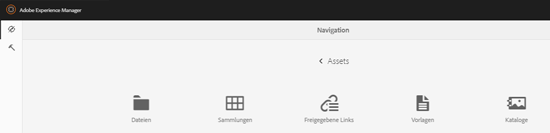

1. Klicken bzw. tippen Sie auf **[!UICONTROL Erstellen]** und wählen Sie im Menü anschließend das Material aus, das Sie erstellen möchten. Wählen Sie beispielsweise **[!UICONTROL Broschüre]**.

   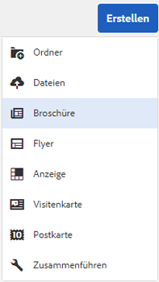

1. Lassen Sie eine oder mehrere INDD-Vorlagen im Voraus in den Experience Manager hochgeladen und verfügbar. Wählen Sie eine Vorlage für Ihre Broschüre aus und klicken bzw. tippen Sie auf **[!UICONTROL Weiter]**.

   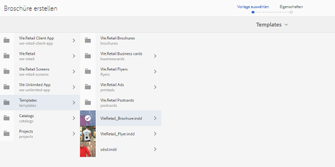

1. Geben Sie einen Namen und eine optionale Beschreibung für die Broschüre an.

   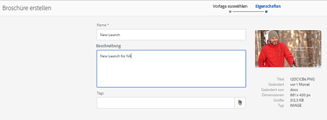

1. (Optional) Klicken bzw. tippen Sie neben dem Feld **[!UICONTROL Tags]** auf das Symbol **[!UICONTROL Tags]** und wählen Sie mindestens ein Tag für die Broschüre aus. Klicken bzw. tippen Sie auf **[!UICONTROL Bestätigen]**, um die Auswahl zu bestätigen.

   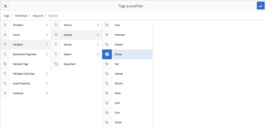

1. Klicken Sie auf **[!UICONTROL Erstellen]**. In einem Dialogfeld mit einem Hinweis wird bestätigt, dass eine neue Broschüre erstellt wurde. Klicken bzw. tippen Sie auf **[!UICONTROL Öffnen]**, um die Broschüre im Bearbeitungsmodus zu öffnen.

   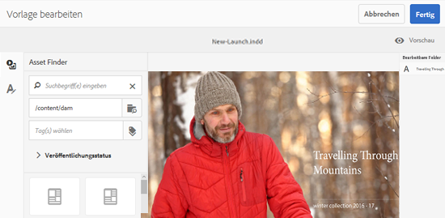

   Alternativ hierzu können Sie das Dialogfeld schließen und auf der Seite „Vorlagen“ zu dem Ordner navigieren, mit dem Sie den Vorgang begonnen haben, um die erstellte Broschüre anzuzeigen. Der Typ des Materials wird in der Kartenansicht in der dazugehörigen Miniaturansicht angezeigt. In diesem Fall wird in der Miniaturansicht beispielsweise „Broschüre“ angezeigt.

   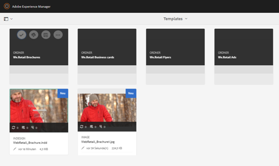

## Bearbeiten von Sicherheiten {#editing-a-collateral}

Sie können Material sofort nach dem Erstellen bearbeiten. Alternativ hierzu können Sie es über die Seite „Vorlagen“ oder die Asset-Seite öffnen.

1. Sie haben folgende Möglichkeiten, um das Material zur Bearbeitung zu öffnen:

   * Öffnen Sie das Material (in diesem Fall die Broschüre), das Sie in Schritt 7 unter [Erstellen von Marketingmaterial](asset-templates.md#creating-a-collateral) erstellt haben.
   * Navigieren Sie auf der Seite „Vorlagen“ zu einem Ordner, in dem Sie das Material erstellt haben, und klicken bzw. tippen Sie in der Miniaturansicht eines Marketingmaterialelements auf die Option zum schnellen Bearbeiten.
   * Klicken bzw. tippen Sie auf der Asset-Seite für das Element in der Symbolleiste auf das Symbol „Bearbeiten“.
   * Wählen Sie das Material aus und klicken/tippen Sie in der Symbolleiste auf das Symbol Bearbeiten .

   

   Links auf der Seite werden die Asset-Suche und der Text-Editor angezeigt. Der Text-Editor ist standardmäßig geöffnet.

   Sie können den Text-Editor verwenden, um den Text zu ändern, der im Textfeld angezeigt werden soll. Sie können Schriftgröße, -stil, -farbe und -typ auf der Tag-Ebene ändern.

   Mit der Asset-Suche können Sie in [!DNL Assets] und ersetzen Sie die bearbeitbaren Bilder in der Vorlage durch Bilder Ihrer Wahl.

   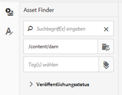

   Die bearbeitbaren Bilder werden rechts angezeigt. Damit ein Feld bearbeitet werden kann in [!DNL Assets], muss das entsprechende Feld in der Vorlage in InDesign getaggt werden. Anders ausgedrückt: Es muss in InDesign als bearbeitbar gekennzeichnet werden.

   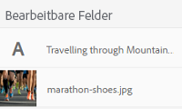

   >[!NOTE]
   >
   >Stellen Sie sicher, dass [!DNL Experience Manager] -Instanz ist mit einem InDesign-Server integriert, um [!DNL Assets] , um Daten aus der InDesign-Vorlage zu extrahieren und sie zur Bearbeitung verfügbar zu machen. Weitere Informationen finden Sie unter [Integration [!DNL Assets] mit InDesign Server](indesign.md).

1. Klicken bzw. tippen Sie zum Ändern des Texts in einem bearbeitbaren Feld in der Liste mit den entsprechenden Feldern auf das Textfeld und bearbeiten Sie den Text.

   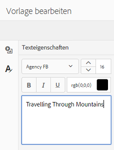

   Sie können die Texteigenschaften, z. B. Schriftstil, -farbe und -größe, mit den vorhandenen Optionen bearbeiten.

1. Klicken bzw. tippen Sie auf das Symbol **[!UICONTROL Vorschau]**, um eine Vorschau für die Textänderungen anzuzeigen.

   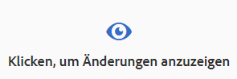

1. Um ein Bild auszutauschen, klicken/tippen Sie auf die **[!UICONTROL Asset Finder]** Symbol.

   

1. Wählen Sie in der Liste mit den bearbeitbaren Feldern das Bildfeld aus und ziehen Sie das gewünschte Bild dann aus der Asset-Auswahl in das bearbeitbare Feld.

   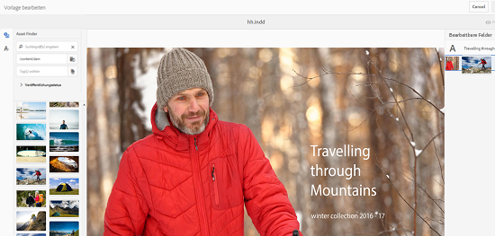

   Sie können auch nach Bildern suchen, indem Sie Stichwörter, Tags und den Veröffentlichungsstatus angeben. Sie können die [!DNL Assets] Repository erstellen und zum Speicherort des gewünschten Bildes navigieren.

   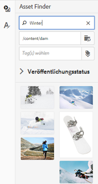

1. Klicken/tippen Sie auf **[!UICONTROL Vorschau]** -Symbol, um eine Vorschau des Bildes anzuzeigen.

   

1. Verwenden Sie unten die Optionen für die Seitennavigation, um für mehrseitiges Marketingmaterial eine bestimmte Seite zu bearbeiten.

   

1. Klicken bzw. tippen Sie in der Symbolleiste auf das Symbol **[!UICONTROL Vorschau]**, um eine Vorschau für alle Änderungen anzuzeigen. Klicken/Tippen **[!UICONTROL Fertig]** , um die Bearbeitungsänderungen am Material zu speichern.

   >[!NOTE]
   >
   >Die Symbole „Vorschau“ und „Fertig“ sind nur aktiviert, wenn die bearbeitbaren Bildfelder im Material keine fehlenden Symbole aufweisen. Wenn in Ihrem Material Symbole fehlen, liegt dies daran, dass [!DNL Experience Manager] kann die Bilder in der InDesign-Vorlage nicht auflösen. Normalerweise [!DNL Experience Manager] kann in folgenden Fällen keine Bilder auflösen:
   >
   >* Bilder werden nicht in die zugrunde liegende InDesign-Vorlage eingebettet
   >* Bilder verfügen über Verknüpfungen mit dem lokalen Dateisystem

   >
   >Aktivieren [!DNL Experience Manager] Gehen Sie wie folgt vor, um Bilder aufzulösen:
   >
   >* Betten Sie Bilder ein, während Sie InDesign-Vorlagen erstellen (siehe [Informationen zu Links und eingebetteten Grafiken](https://helpx.adobe.com/de/indesign/using/graphics-links.html)).
   >* Berg [!DNL Experience Manager] Ihrem lokalen Dateisystem und ordnen Sie dann fehlende Symbole vorhandenen zu [!DNL Experience Manager] Assets.

   >
   >Weitere Informationen zum Arbeiten mit InDesign-Dokumenten finden Sie unter [Best Practices für die Arbeit mit InDesign-Dokumenten in [!DNL Experience Manager]](https://helpx.adobe.com/de/experience-manager/kb/best-practices-idd-docs-aem.html).

1. Wählen Sie zum Generieren einer PDF-Ausgabe für die Broschüre im Dialogfeld die Acrobat-Option aus und klicken Sie anschließend auf **[!UICONTROL Weiter]**.
1. Das Marketingmaterial wird in dem Ordner erstellt, in dem Sie den Vorgang begonnen haben. Öffnen Sie das Marketingmaterialelement und wählen Sie in der GlobalNav-Liste die Option **[!UICONTROL Ausgabeformate]**, um die Ausgabeformate anzuzeigen.

   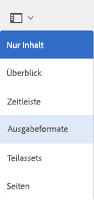

1. Klicken/tippen Sie in der Ausgabedarstellungsliste auf die PDF-Ausgabedarstellung , um die PDF-Datei herunterzuladen. Öffnen Sie die PDF-Datei, um das Material zu überprüfen.

   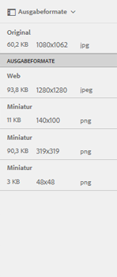

## Zusammenführen von Material {#merge-collateral}

1. Klicken oder tippen Sie auf **[!UICONTROL Tools > Assets]**.
1. Wählen Sie in den Optionen die Option **[!UICONTROL Vorlagen]**.
1. Klicken/Tippen **[!UICONTROL Erstellen]** und wählen Sie **[!UICONTROL Zusammenführen]** aus dem Menü.

   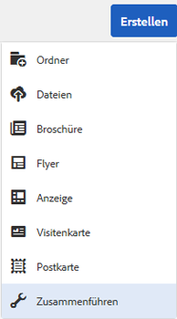

1. Klicken bzw. tippen Sie auf der Seite „Zusammenführen von Vorlagen“ auf das Symbol „Zusammenführen“.

   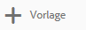

1. Navigieren Sie zum Speicherort des Materials, das Sie zusammenführen möchten, und klicken bzw. tippen Sie auf die Miniaturansichten der entsprechenden Materialelemente, um sie auszuwählen.

   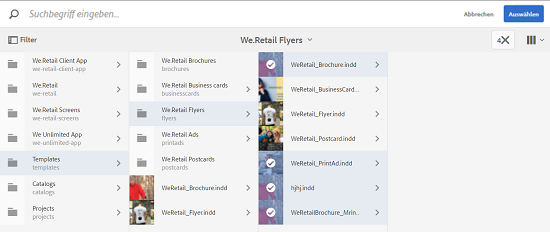

   Sie können auch über das OmniSearch-Feld nach Vorlagen suchen.

   

   Sie können die [!DNL Assets] Repository oder Sammlungen, navigieren Sie zum Speicherort der gewünschten Vorlagen und wählen Sie sie aus, um sie zusammenzuführen.

   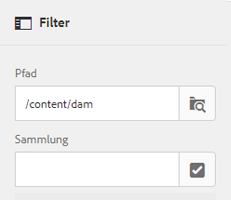

   Sie können verschiedene Filter anwenden, um nach den gewünschten Vorlagen zu suchen. Es ist beispielsweise möglich, basierend auf dem Dateityp oder auf Tags nach Vorlagen zu suchen.

   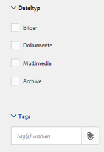

1. Klicken bzw. tippen Sie in der Symbolleiste auf **[!UICONTROL Weiter]**.
1. Im **[!UICONTROL Vorschau &amp; Neu anordnen]** , ordnen Sie bei Bedarf die Vorlagen neu und zeigen Sie eine Vorschau der Auswahl der zusammenzuführenden Vorlagen an. Klicken bzw. tippen Sie in der Symbolleiste dann auf **[!UICONTROL Weiter]**.

   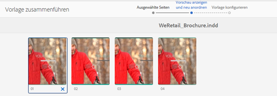

1. Geben Sie im Bildschirm &quot;Vorlage konfigurieren&quot;einen Namen für das Material an. Geben Sie optional Tags an, die jeweils geeignet sind. Wählen Sie die Option **[!UICONTROL Acrobat (.PDF)]**, falls Sie die Ausgabe im PDF-Format exportieren möchten. Standardmäßig wird das Material im JPG- und InDesign-Format exportiert. Klicken bzw. tippen Sie auf **[!UICONTROL Miniatur ändern]**, um die angezeigte Miniaturansicht für das mehrseitige Material zu ändern.

   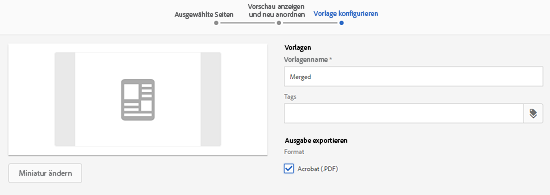

1. Klicken bzw. tippen Sie auf **[!UICONTROL Speichern]** und dann im Dialogfeld auf **[!UICONTROL OK]**, um das Dialogfeld zu schließen. Das mehrseitige Material wird in dem Ordner erstellt, in dem Sie den Vorgang begonnen haben.

   >[!NOTE]
   >
   >Es ist nicht möglich, zusammengeführtes Material später zu ändern oder zum Erstellen von anderem Material zu verwenden.
