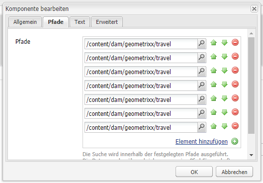
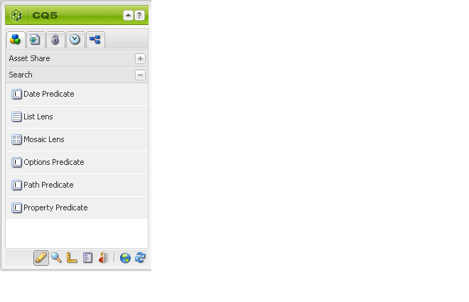
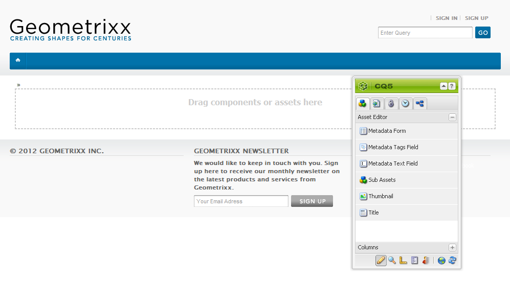
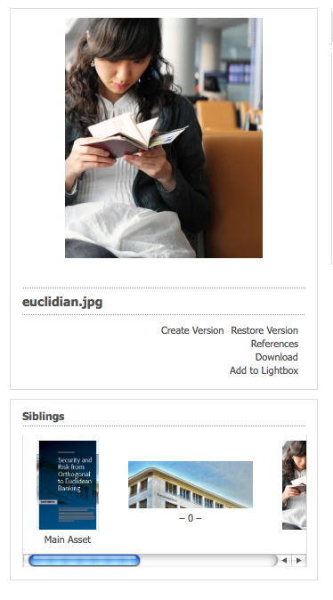
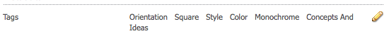
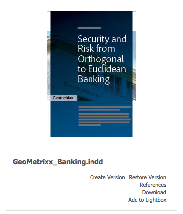

# Erstellen und Konfigurieren von Asset-Editor-Seiten {#creating-and-configuring-asset-editor-pages}

>[!CAUTION]
>
>AEM 6.4 hat das Ende der erweiterten Unterstützung erreicht und diese Dokumentation wird nicht mehr aktualisiert. Weitere Informationen finden Sie in unserer [technische Unterstützung](https://helpx.adobe.com/de/support/programs/eol-matrix.html). Unterstützte Versionen suchen [here](https://experienceleague.adobe.com/docs/?lang=de).

Dieses Dokument beschäftigt sich mit den folgenden Themen:

* Warum sollten Sie benutzerdefinierte Asset-Editor-Seiten erstellen?
* Erstellen und Anpassen von Asset-Editor-Seiten, bei denen es sich um WCM-Seiten handelt, mit denen Sie Metadaten anzeigen und bearbeiten sowie Aktionen für das Asset durchführen können.
* So bearbeiten Sie mehrere Assets gleichzeitig.

>[!NOTE]
>
>Asset-Freigabe ist als Open-Source-Refrerenzimplementierung verfügbar. Siehe [Asset-Freigabe](https://adobe-marketing-cloud.github.io/asset-share-commons/) . Es wird nicht offiziell unterstützt.

## Warum Asset-Editor-Seiten erstellen und konfigurieren? {#why-create-and-configure-asset-editor-pages}

Digital Asset Management wird in einer immer größeren Anzahl von Szenarien eingesetzt. Beim Umstieg von einer kleinen Lösung für eine kleine Gruppe von Fachleuten (beispielsweise Fotografinnen und Fotografen oder Taxonominnen und Taxonomen) auf ein System für größere und vielfältigere Benutzergruppen (beispielsweise Business-Anwenderinnen und -Anwender, WCM-Autorinnen und -Autoren, Journalistinnen und Journalisten usw.) stellt die leistungsstarke Benutzeroberfläche von [!DNL Adobe Experience Manager Assets] für Profis möglicherweise zu viele Informationen bereit, sodass die beteiligten Personen für den Zugriff auf die für sie relevanten digitalen Assets spezielle Benutzeroberflächen oder Anwendungen beantragen.

Bei diesen Asset-orientierten Anwendungen kann es sich um einfache Fotogalerien in einem Intranet handeln, in die Mitarbeiter Fotos von Messebesuchen oder ein Pressezentrum auf einer öffentlich zugänglichen Website hochladen können, wie beispielsweise im mit Geometrixx gelieferten Beispiel. Asset-orientierte Anwendungen können sich auch auf komplette Lösungen wie Warenkörbe, Checkout- und Verifizierungsprozesse erstrecken.

Das Erstellen einer Asset-orientierten Anwendung wird zu einem großen Teil zu einem Konfigurationsprozess, der keine Kodierung erfordert, nur Kenntnisse über Benutzergruppen und deren Anforderungen sowie Kenntnisse über die verwendeten Metadaten. Mit [!DNL Assets] erstellte Asset-orientierte Anwendungen sind erweiterbar: Mit moderatem Kodierungsaufwand können Sie wiederverwendbare Komponenten für die Suche, Anzeige und Bearbeitung von Assets erstellen.

Eine Asset-orientierte Anwendung in [!DNL Experience Manager] besteht aus einer Asset-Editor-Seite, die eine detaillierte Ansicht eines bestimmten Assets liefert. Über eine Asset-Editor-Seite können zudem Metadaten bearbeitet werden, sofern Benutzende, die auf das Asset zugreifen, über die erforderlichen Berechtigungen verfügen.

## Erstellen und Konfigurieren einer Asset-Freigabe-Seite {#creating-and-configuring-an-asset-share-page}

Sie passen die DAM Finder-Funktion an und erstellen Seiten mit allen erforderlichen Funktionen, die Asset-Freigabe-Seiten genannt werden. Um eine neue Asset-Freigabe-Seite zu erstellen, fügen Sie die Seite mithilfe der Vorlage &quot;Asset-Freigabe&quot;hinzu und passen dann die Aktionen an, die Benutzer auf dieser Seite durchführen können, bestimmen, wie die Assets für Betrachter angezeigt werden, und entscheiden, wie Benutzer ihre Abfragen erstellen können.

Im Folgenden finden Sie einige Anwendungsfälle zum Erstellen einer benutzerdefinierten Asset-Freigabe-Seite:

* Pressezentrum für Journalisten
* Bildsuchmaschine für interne Geschäftsbenutzer
* Bilddatenbank für Website-Benutzer
* Medien-Tagging-Oberfläche für Metadaten-Editoren

### Erstellen einer Asset-Freigabe-Seite {#creating-an-asset-share-page}

Um eine neue Asset-Freigabe-Seite zu erstellen, können Sie sie entweder beim Arbeiten auf Websites oder über den Digital Asset Manager erstellen.

>[!NOTE]
>
>Wenn Sie eine Asset-Freigabe-Seite aus **Neu** Im Digital Asset Manager werden automatisch ein Asset-Viewer und ein Asset-Editor erstellt.

So erstellen Sie eine neue Asset-Freigabe-Seite in der **Websites** console:

1. Im **[!UICONTROL Websites]** Registerkarte, navigieren Sie zu dem Ort, an dem Sie eine Asset-Freigabe-Seite erstellen möchten, und klicken Sie auf **[!UICONTROL Neu]**.

1. Wählen Sie die **[!UICONTROL Asset-Freigabe]** Seite und klicken Sie auf **[!UICONTROL Erstellen]**. Die neue Seite wird erstellt und die Asset-Freigabe-Seite wird im **[!UICONTROL Websites]** Registerkarte.

Die mit der Geometrixx DAM Asset Share-Vorlage erstellte Basisseite sieht wie folgt aus:

Um Ihre Asset-Freigabe-Seite anzupassen, verwenden Sie Elemente aus dem Sidekick und bearbeiten auch Query Builder-Eigenschaften. Die Seite **[!UICONTROL Geometrixx Pressezentrum]** ist eine auf dieser Vorlage basierende angepasste Version einer Seite:

So erstellen Sie eine neue Asset-Freigabe-Seite über den Digital Asset Manager:

1. Im Digital Asset Manager in **[!UICONTROL Neu]** auswählen **[!UICONTROL Neue Asset-Freigabe]**.
1. Im **[!UICONTROL Titel]** Geben Sie den Namen der Asset-Freigabe-Seite ein. Geben Sie bei Bedarf einen Namen für die URL ein.

   

1. Doppelklicken Sie auf die Asset-Freigabe-Seite, um sie zu öffnen und die Seite zu konfigurieren.

   

   Wenn Sie eine Asset-Freigabe-Seite aus **[!UICONTROL Neu]**, werden ein Asset-Viewer und ein Asset-Editor automatisch für Sie erstellt.

#### Aktionen anpassen {#customizing-actions}

Anhand einer Auswahl vordefinierter Aktionen können Sie bestimmen, welche Aktionen Benutzende für ausgewählte digitale Assets ausführen dürfen.

So fügen Sie Aktionen zur Asset-Freigabe-Seite hinzu:

1. Klicken Sie auf der anzupassenden Asset-Freigabe-Seite auf **[!UICONTROL Aktionen]** im Sidekick.

   Die folgenden Aktionen sind verfügbar:
   

| Aktion | Beschreibung |
|---|---|
| [!UICONTROL Aktion löschen] | Benutzer können die ausgewählten Assets löschen. |
| [!UICONTROL Download-Aktion] | Ermöglicht Benutzenden das Herunterladen ausgewählter Assets auf ihre Computer. |
| [!UICONTROL Lightbox-Aktion] | Speichert Assets in einer „Lightbox“, in der Sie andere Aktionen durchführen können. Dies ist praktisch, wenn über mehrere Seiten hinweg an Assets gearbeitet wird. Die Lightbox kann auch als Warenkorb für Assets verwendet werden. |
| [!UICONTROL Aktion bewegen] | Benutzer können das Asset an einen anderen Speicherort verschieben |
| [!UICONTROL Tags-Aktion] | Ermöglicht Benutzern das Hinzufügen von Tags zu ausgewählten Assets |
| [!UICONTROL Asset-Aktion anzeigen] | Öffnet das Asset im Asset-Editor zur Bearbeitung durch Benutzer. |

1. Ziehen Sie die entsprechende Aktion in den Bereich **Aktionen** auf der Seite. Dadurch wird eine Schaltfläche erstellt, mit der diese Aktion ausgeführt wird.

   

#### Ermitteln, wie Suchergebnisse angezeigt werden {#determining-how-search-results-are-presented}

Sie bestimmen anhand einer vordefinierten Liste von Linsen, wie die Ergebnisse dargestellt werden.

So ändern Sie die Anzeige der Suchergebnisse:

1. Klicken Sie auf der anzupassenden Asset-Freigabe-Seite auf **[!UICONTROL Suche]**.

   

1. Ziehen Sie das entsprechende Objektiv in die obere Mitte der Seite. Im Pressezentrum sind die Objektive bereits verfügbar. Benutzer drücken das entsprechende Linsensymbol, um die Suchergebnisse nach Bedarf anzuzeigen.

Folgende Linsen sind verfügbar:

| Objektiv | Beschreibung |
|---|---|
| **[!UICONTROL Listenlinse]** | Stellt die Assets in Listenform mit Details dar. |
| **[!UICONTROL Mosaik-Linse]** | Stellt Assets in Mosaik dar. |

#### Mosaik-Linse {#mosaic-lens}

#### Listenlinse {#list-lens}

#### Query Builder anpassen {#customizing-the-query-builder}

Mit dem Query Builder können Sie Suchbegriffe eingeben und Inhalte für die Asset-Freigabe-Seite erstellen. Beim Bearbeiten des Query Builders können Sie außerdem festlegen, wie viele Suchergebnisse pro Seite angezeigt werden, welcher Asset-Editor beim Doppelklicken auf ein Asset geöffnet wird, welchen Pfad die Abfrage durchsucht und welche Knotentypen angepasst werden.

So passen Sie den Query Builder an:

1. Klicken Sie auf der anzupassenden Asset-Freigabe-Seite auf **[!UICONTROL Bearbeiten]** im Query Builder. Standardmäßig wird die **[!UICONTROL Allgemein]** -Registerkarte geöffnet.

1. Wählen Sie die Anzahl der Ergebnisse pro Seite, den Pfad des Asset-Editors (wenn Sie über einen benutzerdefinierten Asset-Editor verfügen) und den Titel Aktionen aus.

   

1. Klicken Sie auf **[!UICONTROL Pfade]** Registerkarte. Geben Sie einen Pfad oder mehrere Pfade ein, die die Suche ausführen soll. Diese Pfade werden überschrieben, wenn der Benutzer die Eigenschaft Pfade verwendet.

   

1. Geben Sie ggf. einen anderen Knotentyp ein.

1. Im **[!UICONTROL Query Builder-URL]** -Feld können Sie den Query Builder überschreiben oder umschließen und die neuen Servlet-URLs mit der vorhandenen Query Builder-Komponente eingeben. Im **[!UICONTROL Feed-URL]** -Feld können Sie auch die Feed-URL überschreiben.

   

1. Im **[!UICONTROL Text]** geben Sie den Text ein, der für die Ergebnisse und die Seitenzahlen der Ergebnisse angezeigt werden soll. Klicken **[!UICONTROL OK]** , wenn die Änderungen abgeschlossen sind.

   

#### Hinzufügen von Prädikaten {#adding-predicates}

[!DNL Experience Manager Assets] enthält eine Reihe von Eigenschaften, die Sie der Asset-Freigabe-Seite hinzufügen können. Diese ermöglichen es Ihren Benutzern, die Suche weiter einzuschränken. In einigen Fällen können sie einen Abfrageaufbauparameter überschreiben (z. B. den Pfadparameter).

So fügen Sie Eigenschaften hinzu:

1. Klicken Sie auf der anzupassenden Asset-Freigabe-Seite auf **[!UICONTROL Suche]**.

   

1. Ziehen Sie die entsprechenden Eigenschaften auf die Asset-Freigabe-Seite unter den Query Builder. Dadurch werden die entsprechenden Felder erstellt.

   

   Die folgenden Eigenschaften sind verfügbar:

| Prädikat | Beschreibung |
|---|---|
| **[!UICONTROL Datumseigenschaft]** | Ermöglicht Benutzern die Suche nach Assets, die vor und nach bestimmten Daten geändert wurden. |
| **[!UICONTROL Options-Eigenschaft]** | Der Site-Eigentümer kann eine Eigenschaft angeben, nach der gesucht werden soll (wie im Eigenschaftsprädikat, z. B. cq:tags), und eine Inhaltsstruktur, aus der die Optionen gefüllt werden sollen (z. B. die Tag-Struktur). Dadurch wird eine Liste von Optionen generiert, in denen Benutzer die Werte (Tags) auswählen können, die die ausgewählte Eigenschaft (Tag-Eigenschaft) aufweisen soll. Mit dieser Eigenschaft können Sie Listensteuerelemente wie die Liste von Tags, Dateitypen, Bildausrichtungen usw. erstellen. Es eignet sich hervorragend für eine Reihe von Optionen. |
| **[!UICONTROL Pfad-Eigenschaft]** | Ermöglicht Benutzern, bei Bedarf den Pfad und die Unterordner zu definieren. |
| **[!UICONTROL Eigenschaftsprädikat]** | Der Site-Eigentümer gibt eine Eigenschaft an, nach der gesucht werden soll, z. B. tiff:ImageLength, und der Benutzer kann dann einen Wert eingeben, z. B. 800. Dadurch werden alle Bilder zurückgegeben, die 800 Pixel hoch sind. Nützliches Prädikat, wenn Ihre Eigenschaft beliebige Werte haben kann. |

Weitere Informationen finden Sie unter [Predicate javadocs](https://helpx.adobe.com/experience-manager/6-4/sites/developing/using/reference-materials/javadoc/com/day/cq/search/eval/package-summary.html).

1. Um die Eigenschaft weiter zu konfigurieren, doppelklicken Sie darauf. Wenn Sie beispielsweise die Pfadeigenschaft öffnen, müssen Sie den Stammpfad zuweisen.

   

## Erstellen und Konfigurieren einer Asset-Editor-Seite {#creating-and-configuring-an-asset-editor-page}

Sie passen den Asset-Editor an, um festzulegen, wie Benutzer die digitalen Assets anzeigen und bearbeiten können. Erstellen Sie dazu eine neue Asset-Editor-Seite und passen Sie dann die Ansichten und Aktionen an, die Benutzer auf dieser Seite ausführen können.

>[!NOTE]
>
>Wenn Sie benutzerdefinierte Felder zum DAM-Asset-Editor hinzufügen möchten, fügen Sie neue cq:Widget-Knoten zu `/apps/dam/content/asseteditors.`

### Erstellen der Asset-Editor-Seite {#creating-the-asset-editor-page}

Beim Erstellen der Asset-Editor-Seite empfiehlt es sich, die Seite direkt unter der Asset-Freigabe-Seite zu erstellen.

So erstellen Sie eine Asset-Editor-Seite:

1. Im **[!UICONTROL Websites]** Registerkarte, navigieren Sie zu der Stelle, an der Sie eine Asset-Editor-Seite erstellen möchten, und klicken Sie auf **[!UICONTROL Neu]**.

1. Wählen Sie **[!UICONTROL Geometrixx-Asset-Editor]** und klicken Sie auf **[!UICONTROL Erstellen]**. Die neue Seite wird erstellt und auf der Registerkarte **[!UICONTROL Websites]** aufgeführt.

Die mit der Vorlage „Geometrixx-Asset-Editor“ erstellte Standardseite sieht wie folgt aus:

Anpassen können Sie die Asset-Editor-Seite mithilfe der Elemente aus dem Sidekick. Die Seite, auf die über das **[!UICONTROL Geometrixx-Pressezentrum]** zugegriffen wird, ist eine angepasste Version einer auf dieser Vorlage basierenden Seite:

#### Festlegen, welcher Asset-Editor von einer Asset-Freigabe-Seite aus geöffnet wird {#setting-which-asset-editor-opens-from-an-asset-share-page}

Nachdem Sie die angepasste Asset-Editor-Seite erstellt haben, müssen Sie sicherstellen, dass beim Doppelklicken auf Assets die von Ihnen erstellten benutzerdefinierten Assets in der angepassten Editor-Seite geöffnet werden.

So legen Sie die Asset-Editor-Seite fest:

1. Klicken Sie auf der Asset-Freigabe-Seite neben dem Query Builder auf **[!UICONTROL Bearbeiten]**.

   

1. Klicken Sie auf die Registerkarte **[!UICONTROL Allgemein]**, sofern diese nicht bereits ausgewählt ist.

1. Geben Sie in das Feld **[!UICONTROL Pfad des Asset-Editors]** den Pfad zu dem Asset-Editor ein, in dem die Asset-Freigabe-Seite Assets öffnen soll, und klicken Sie auf **[!UICONTROL OK]**.

   

#### Hinzufügen von Asset-Editor-Komponenten {#adding-asset-editor-components}

Sie bestimmen, welche Funktionen ein Asset-Editor hat, indem Sie Komponenten zur Seite hinzufügen.

So fügen Sie Asset-Editor-Komponenten hinzu:

1. Klicken Sie auf der anzupassenden Asset-Editor-Seite im Sidekick auf **[!UICONTROL Asset-Editor]**. Alle verfügbaren Asset-Editor-Komponenten werden angezeigt.

   >[!NOTE]
   >
   >Was Sie anpassen können, hängt davon ab, welche Komponenten verfügbar sind. Um Komponenten zu aktivieren, wechseln Sie zum Designmodus und wählen Sie die Komponenten aus, die aktiviert werden sollen.

1. Ziehen Sie die Komponenten aus dem Sidekick in den Asset-Editor und nehmen Sie Änderungen in den Komponentendialogen vor. Die Komponenten werden in der folgenden Tabelle beschrieben und in den nachfolgenden detaillierten Anweisungen beschrieben.

   >[!NOTE]
   >
   >Beim Entwerfen der Asset-Editor-Seite erstellen Sie Komponenten, die entweder schreibgeschützt oder bearbeitbar sind. Benutzer wissen, dass ein Feld bearbeitet werden kann, wenn ein Bild eines Bleistifts in dieser Komponente angezeigt wird. Standardmäßig sind die meisten Komponenten als schreibgeschützt eingerichtet.

   | Komponente | Beschreibung |
   |---|---|
   | **[!UICONTROL Metadatenformular] und [!UICONTROL Metadaten-Textfeld]** | Ermöglicht das Hinzufügen zusätzlicher Metadaten zu einem Asset und das Ausführen einer Aktion (z. B. Senden) für dieses Asset. |
   | **[!UICONTROL Unter-Assets]** | Ermöglicht das Anpassen von Unter-Assets. |
   | **Tags** | Benutzende haben die Möglichkeit, Tags auszuwählen und zu einem Asset hinzuzufügen. |
   | **[!UICONTROL Miniaturansicht]** | Zeigt eine Miniaturansicht des Assets und dessen Dateinamen an und ermöglicht das Hinzufügen eines alternativen Textes. Hierüber können Sie zudem Asset-Editor-Aktionen hinzufügen. |
   | **[!UICONTROL Titel]** | Zeigt den Asset-Titel an, der angepasst werden kann. |

   

#### Metadatenformular und Textfeld - Konfigurieren der Komponente &quot;Metadaten anzeigen&quot; {#metadata-form-and-text-field-configuring-the-view-metadata-component}

Das Metadatenformular ist ein Formular mit einer Start- und einer Endaktion. dazwischen geben Sie **[!UICONTROL Text]** -Felder. Siehe [Forms](../sites-authoring/default-components.md) für weitere Informationen zum Arbeiten mit Formularen.

1. Erstellen Sie eine Startaktion, indem Sie im Startbereich des Formulars auf **[!UICONTROL Bearbeiten]** klicken. Sie können bei Bedarf einen Feldtitel eingeben. Standardmäßig lautet der Feldtitel **[!UICONTROL Metadaten]**. Aktivieren Sie das Kontrollkästchen Client-Validierung , wenn der Java-Script-Client-Code für die Validierung generiert werden soll.

   

1. Erstellen Sie eine Endaktion, indem Sie im Endbereich des Formulars auf **[!UICONTROL Bearbeiten]** klicken. Sie können beispielsweise eine **[!UICONTROL Einsenden]** -Schaltfläche, damit Benutzer ihre Metadatenänderungen senden können. Optional können Sie eine **[!UICONTROL Zurücksetzen]** -Schaltfläche, mit der die Metadaten in den Originalzustand zurückgesetzt werden.

   

1. Ziehen Sie zwischen **[!UICONTROL Formular-Start]** und **Formular-Ende** die Metadaten-Textfelder in das Formular. Benutzende füllen diese Textfelder mit Metadaten auf, die übermittelt werden können oder für die eine weitere Aktion ausgeführt werden kann.

1. Doppelklicken Sie auf den Feldnamen, z. B. **Titel**, um das Metadatenfeld zu öffnen und Änderungen vorzunehmen. Auf der Registerkarte **[!UICONTROL Allgemein]** des Fensters[!UICONTROL  Komponente bearbeiten] definieren Sie den Namespace und die Feldbezeichnung sowie den Typ, z. B. `dc:title`.

   

   Informationen zum Ändern der im Metadatenformular verfügbaren Namespaces finden Sie unter [Anpassen und Erweitern von  [!DNL Assets]](extending-assets.md).

1. Klicken Sie auf die Registerkarte **[!UICONTROL Beschränkungen]**. Hier können Sie festlegen, ob ein Feld erforderlich ist, und ggf. weitere Beschränkungen hinzufügen.

   

1. Klicken Sie auf die Registerkarte **[!UICONTROL Anzeigen]**. Hier können Sie eine neue Breite und Anzahl von Zeilen für das Metadatenfeld eingeben. Wählen Sie die **Feld ist schreibgeschützt** aktivieren, damit Benutzer die Metadaten bearbeiten können.

   

   Es folgt ein Beispiel für ein Metadatenformular mit verschiedenen Feldern:

   

Auf der Asset-Editor-Seite können Benutzende dann Werte in die Metadatenfelder eingeben (sofern diese bearbeitbar sind) und die Endaktion ausführen (etwa Änderungen übermitteln).

#### Unter-Assets {#sub-assets}

In der Komponente &quot;Unter-Assets&quot;können Sie Unter-Assets anzeigen und auswählen. Sie können festlegen, welche Namen unter dem [Haupt-Asset](assets.md#what-are-digital-assets) und Unter-Assets.

Doppelklicken Sie auf die Komponente Unter-Assets , um das Dialogfeld Unter-Assets zu öffnen, in dem Sie die Titel für das Haupt-Asset und alle Unter-Assets ändern können. Die Standardwerte werden unter dem entsprechenden Feld angezeigt.

Es folgt ein Beispiel für eine ausgefüllte Komponente „Unter-Assets“:

Achten Sie z. B. bei Auswahl eines Unter-Assets darauf, wie die Komponente die entsprechende Seite anzeigt und sich der Box-Titel von „Unter-Assets“ zu „Gleichgeordnete“ ändert.

#### Tags {#tags}

Die Tags-Komponente ist eine Komponente, in der Benutzer einem Asset vorhandene Tags zuweisen können. Dies erleichtert später die Organisation und den Abruf. Sie können diese Komponente schreibgeschützt machen, sodass Benutzer keine Tags hinzufügen können, sie jedoch nur anzeigen können.

Doppelklicken Sie auf die Komponente „Tags“, um das gleichnamige Dialogfeld zu öffnen, in dem Sie den Titel „Tags“ ggf. ändern und die zugewiesenen Namespaces auswählen können. Um dieses Feld bearbeitbar zu machen, löschen Sie die **Bearbeiten ausblenden** Kontrollkästchen. Standardmäßig können Tags bearbeitet werden.

Wenn Benutzende Tags bearbeiten können, können sie auf das Bleistiftsymbol klicken, um Tags durch Auswahl aus dem Dropdownmenü hinzuzufügen.

Es folgt ein Beispiel für eine ausgefüllte Komponente „Tags“:

#### Miniaturansicht {#thumbnail}

In der Komponente &quot;Miniaturansicht&quot;zeigt das Asset die ausgewählte Miniaturansicht an (für viele der Formate wird die Miniaturansicht automatisch extrahiert). Außerdem präsentiert die Komponente den Dateinamen und [von Ihnen veränderbare Aktionen](assets-finder-editor.md#adding-asset-editor-actions).

Doppelklicken Sie auf die Komponente „Miniatur“, um den gleichnamigen Dialog zum Ändern des ALT-Texts zu öffnen. Standardmäßig wird **[!UICONTROL Klicken, um Asset herunterzuladen]** als ALT-Text für die Miniatur angezeigt.

Es folgt ein Beispiel für eine ausgefüllte Komponente „Miniatur“:

#### Titel {#title}

Die Komponente Titel zeigt den Titel des Assets und eine Beschreibung an.

Standardmäßig liegt die Komponente im schreibgeschützten Modus vor, um eine Bearbeitung durch Benutzende zu verhindern. Damit sie bearbeitet werden kann, doppelklicken Sie auf die Komponente und deaktivieren Sie das Kontrollkästchen **Bearbeitungsschaltfläche ausblenden**. Geben Sie außerdem einen Titel für mehrere Assets ein.

Wenn der Titel bearbeitet werden kann, können Sie einen Titel und eine Beschreibung hinzufügen, indem Sie auf das Stiftsymbol klicken, um die **Asset-Eigenschaften** Fenster. Darüber hinaus können Sie das Asset ein- und ausschalten, indem Sie Datum und Uhrzeit auswählen.

Wenn Benutzer den Titel durch Klicken auf das Stiftsymbol bearbeiten, können sie die **Titel**, **Beschreibung** und geben Sie **on** und **Ausschaltzeiten** , um das Asset zu aktivieren und zu deaktivieren.

Es folgt ein Beispiel für eine ausgefüllte Komponente „Titel“:

#### Hinzufügen von Asset-Editor-Aktionen {#adding-asset-editor-actions}

Anhand einer Auswahl vordefinierter Aktionen können Sie bestimmen, welche Aktionen Benutzende für ausgewählte digitale Assets ausführen dürfen.

So fügen Sie der Asset-Editor-Seite Aktionen hinzu:

1. Klicken Sie auf der anzupassenden Asset-Editor-Seite im Sidekick auf **[!UICONTROL Asset-Editor]**. 

   

   Die folgenden Aktionen sind verfügbar:

   | Aktion | Beschreibung |
   |---|---|
   | [!UICONTROL Download] | Ermöglicht Benutzenden das Herunterladen ausgewählter Assets auf ihre Computer. |
   | [!UICONTROL Editoren] | Ermöglicht Benutzenden die Bearbeitung eines Bildes (interaktive Bearbeitung). |
   | [!UICONTROL Lightbox] | Speichert Assets in einer „Lightbox“, in der Sie andere Aktionen durchführen können. Dies ist praktisch, wenn über mehrere Seiten hinweg an Assets gearbeitet wird. |
   | [!UICONTROL Sperren] | Ermöglicht es Benutzenden, ein Asset zu sperren. Diese Funktion ist nicht standardmäßig aktiviert und muss in der Liste der Komponenten aktiviert werden. |
   | [!UICONTROL Verweise] | Klicken Sie auf diese Option, um anzuzeigen, auf welchen Seiten das Asset verwendet wird. |
   | [!UICONTROL Versionierung] | Ermöglicht das Erstellen und Wiederherstellen von Versionen eines Assets. |

1. Ziehen Sie die entsprechende Aktion in den Bereich **Aktionen** auf der Seite. Dadurch wird eine Schaltfläche erstellt, mit der diese Aktion ausgeführt wird.

## Bearbeiten mehrerer Assets mit der Asset-Editor-Seite {#multi-editing-assets-with-the-asset-editor-page}

Mit [!DNL Assets] können Sie Änderungen an mehreren Assets gleichzeitig vornehmen. Nachdem Sie Assets ausgewählt haben, können Sie ihre gleichzeitig ändern:

* Tags
* Metadaten

So führen Sie eine Mehrfachbearbeitung von Assets mit der Asset-Editor-Seite durch:

1. Öffnen Sie die Geometrixx **[!UICONTROL Pressezentrum]** page at `http://localhost:4502/content/geometrixx/en/company/press.html`.
1. Wählen Sie die Assets aus:

   * unter Windows: `Ctrl + click` auf jedes Asset.
   * unter Mac: `Cmd + click` auf jedes Asset.

   Um einen Bereich von Assets auszuwählen, klicken Sie auf das erste Asset und dann `Shift + click` auf das letzte Asset.

1. Klicken Sie im Feld **[!UICONTROL Aktionen]** auf **Metadaten bearbeiten** (linker Seitenbereich).

1. Die Geometrixx-Seite mit dem **[!UICONTROL Pressezentrum-Asset-Editor]** wird auf einer neuen Registerkarte geöffnet. Die Metadaten der Assets werden wie folgt angezeigt:

   * Ein Tag, das nicht für alle Assets gilt, sondern nur für einige wenige, wird kursiv dargestellt.
   * Ein Tag, das für alle Assets gilt, wird in normaler Schrift angezeigt.
   * Andere Metadaten als Tags: Der Wert des Felds wird nur angezeigt, wenn dieser für alle ausgewählten Assets identisch ist.

1. Klicken Sie auf **[!UICONTROL Herunterladen]**, um eine ZIP-Datei mit den ursprünglichen Ausgabedarstellungen des Assets herunterzuladen.
1. Klicken Sie auf das Stiftsymbol neben dem **[!UICONTROL Tags]** -Feld zum Bearbeiten der Tags:

   * Ein Tag, das nicht für alle Assets gilt, sondern nur für einige wenige, hat einen grauen Hintergrund.
   * Ein Tag, das für alle Assets gilt, hat einen weißen Hintergrund.

   Sie haben folgende Möglichkeiten:

   * Klicken Sie auf `x` -Symbol, um das Tag für alle Assets zu entfernen.
   * Klicken Sie auf `+` -Symbol, um das Tag zu allen Assets hinzuzufügen.
   * Klicken Sie auf `arrow` und wählen Sie ein Tag aus, um allen Assets ein neues Tag hinzuzufügen.

   Klicken **[!UICONTROL OK]** , um die Änderungen in das Formular zu schreiben. Das Kästchen neben dem Feld **Tags** wird automatisch aktiviert.

1. Bearbeiten Sie das Feld „Beschreibung“. Legen Sie es beispielsweise auf wie folgt fest: `This is a common description`. Wenn ein Feld bearbeitet wird, überschreibt sein Wert die vorhandenen Werte der ausgewählten Assets, sobald das Formular übermittelt wird. Das Kästchen neben dem Feld wird automatisch aktiviert, wenn das Feld bearbeitet wird.

   `This is a common description`

   Wenn ein Feld bearbeitet wird, überschreibt sein Wert die vorhandenen Werte der ausgewählten Assets, sobald das Formular übermittelt wird.

   Hinweis: Das Kästchen neben dem Feld wird automatisch aktiviert, wenn das Feld bearbeitet wird.

1. Klicken Sie auf **[!UICONTROL Metadaten aktualisieren]**, um das Formular abzusenden und die Änderungen für alle Assets zu speichern. Nur die aktivierten Metadaten werden geändert.
