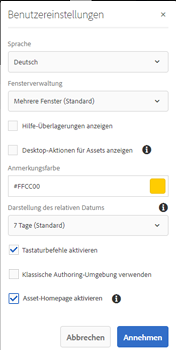

# AEM Assets-Startseitenerlebnis {#aem-assets-home-page-experience}

Passen Sie die AEM Assets-Startseite an, um Benutzern ein ansprechendes Erlebnis auf dem Willkommensbildschirm zu bieten, einschließlich einer Übersicht der letzten Aktivitäten rund um Assets.

Die Adobe Experience Manager (AEM) Assets-Startseite bietet ein ansprechendes und personalisiertes Willkommenserlebnis, einschließlich einer Übersicht der letzten Aktivitäten, wie z. B. kürzlich angezeigte oder hochgeladene Assets.

Die Assets-Startseite ist standardmäßig deaktiviert. Gehen Sie wie folgt vor, um sie zu aktivieren:

1. Um auf AEM Configuration Manager zuzugreifen, klicken Sie auf **[!UICONTROL Tools > Vorgang > Web Console]**.
1. Öffnen Sie den Dienst **Day CQ DAM Event Recorder** .
1. Wählen Sie **[!UICONTROL Aktivieren Sie diesen Dienst]**, um die Aktivitätsaufzeichnung zu aktivieren.

   

1. Wählen Sie in der Liste **Ereignistypen** die Ereignisse aus, die aufgezeichnet werden sollen, und speichern Sie die Änderungen.

   >[!CAUTION]
   >
   >Die Aktivierung der Optionen „Angezeigte Assets“, „Angezeigte Projekte“ und „Angezeigte Sammlungen“ erhöht die Anzahl der aufgezeichneten Ereignisse erheblich.

1. Öffnen Sie den Dienst **[!UICONTROL DAM Asset Home Page Feature Flag]** im Configuration Manager `https://[AEM_server]:[port]/system/console/configMgr`.
1. Wählen Sie die Option **[!UICONTROL isEnabled.name]** aus, um die Funktion &quot;Assets-Homepage&quot;zu aktivieren. Speichern Sie die Änderungen.

   

1. Öffnen Sie das Dialogfeld **[!UICONTROL Benutzereinstellungen]** und wählen Sie **[!UICONTROL Asset-Homepage aktivieren]** aus. Speichern Sie die Änderungen.

   

Navigieren Sie nach Aktivierung der Assets-Startseite von der Navigationsseite zur Assets-Benutzeroberfläche.

Tippen/klicken Sie auf **[!UICONTROL Klicken Sie hier , um Ihren Erlebnislink]** zu konfigurieren und Ihren Benutzernamen, Ihr Hintergrundbild und Ihr Profilbild hinzuzufügen.

Die Assets-Startseite enthält die folgenden Abschnitte:

* Begrüßungsabschnitt
* Widget-Abschnitt

**Begrüßungsabschnitt** 

Wenn Ihr Profil vorhanden ist, wird im Begrüßungsabschnitt eine Begrüßungsnachricht für Sie angezeigt. Darüber hinaus werden Ihr Profilbild und ein Willkommensbild angezeigt (sofern bereits konfiguriert).

Wenn Ihr Profil unvollständig ist, zeigt der Begrüßungsabschnitt eine generische Begrüßungsnachricht und einen Platzhalter für Ihr Profilbild an.

**Widget-Abschnitt** 

Dieser Abschnitt wird unter dem Begrüßungsabschnitt angezeigt und bietet fertige Widgets unter den folgenden Abschnitten:

* Aktivität
* Aktuell
* Entdecken

**Aktivität**: Unter diesem Abschnitt zeigt das Widget  **Meine** Aktivität die letzten Aktivitäten an, die der angemeldete Benutzer mit Assets ausgeführt hat (einschließlich Assets ohne Ausgabedarstellungen), z. B. Asset-Uploads, -Downloads, Asset-Erstellung, -Bearbeitungen, Kommentare, Anmerkungen und &quot;Teilen&quot;-Klicks.

**Zuletzt**: Das Widget  **Kürzlich** angezeigte Anzeigen unter diesem Abschnitt zeigt kürzlich aufgerufene Entitäten, auf die der angemeldete Benutzer zugegriffen hat, einschließlich Ordnern, Sammlungen und Projekten.

**Discover**: Das  **** Newwidget unter diesem Abschnitt zeigt die Assets und Ausgabedarstellungen an, die kürzlich in die AEM Assets-Instanz hochgeladen wurden.

Um die Bereinigung der Benutzeraktivitätsdaten zu aktivieren, aktivieren Sie den **DAM-Ereignisbereinigungsdienst** in Configuration Manager. Nachdem Sie den Dienst aktiviert haben, werden die Aktivitäten des angemeldeten Benutzers, die eine bestimmte Anzahl überschreiten, vom System gelöscht.

Der Begrüßungsbildschirm enthält einfache Navigationshilfen, z. B. Symbole in der Symbolleiste für das Zugreifen auf Ordner, Sammlungen und Kataloge.

>[!NOTE]
>
>Durch die Aktivierung der Day CQ DAM Event Recorder- und DAM Event Purge-Dienste werden Schreibvorgänge in JCR und die Suchindizierung erhöht, wodurch die Belastung des AEM-Servers deutlich erhöht wird. Die zusätzliche Last auf dem AEM-Server kann dessen Leistung beeinträchtigen.

>[!CAUTION]
>
>Das Erfassen, Filtern und Bereinigen von Benutzeraktivitäten für die Asset-Homepage erfordert Mehraufwand. Daher sollten Administratoren die Homepage für Zielbenutzer effektiv konfigurieren.
>
>Adobe empfiehlt Administratoren und Benutzern, die mit großen Datenmengen arbeiten, die Verwendung der Asset-Homepage-Funktion zu vermeiden, um einen Anstieg der Benutzeraktivitäten zu verhindern. Außerdem können Administratoren Aufzeichnungsaktivitäten von bestimmten Benutzern unterbinden, indem sie den **Day CQ DAM Event Recorder** vom Configuration Manager aus konfigurieren.
>
>Wenn Sie die Funktion verwenden, empfiehlt Adobe, dass Sie die Bereinigungsfrequenz auf der Grundlage der Serverlast planen.
