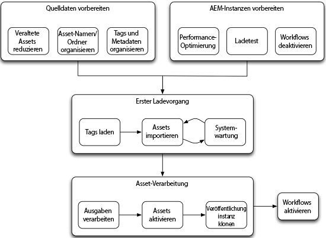

# Handbuch zur Assets-Migration {#assets-migration-guide}

Beim Migrieren von Assets nach AEM sind verschiedene Schritte zu berücksichtigen. Das Extrahieren von Assets und Metadaten aus ihrer aktuellen Startseite fällt nicht in den Geltungsbereich dieses Dokuments, da es bei den Implementierungen sehr unterschiedlich ist. Stattdessen wird in diesem Dokument beschrieben, wie Sie diese Assets in AEM einbinden, ihre Metadaten anwenden, Ausgabedarstellungen generieren und die Assets aktivieren oder veröffentlichen.

## Voraussetzungen {#prerequisites}

Bevor Sie einen der unten beschriebenen Schritte durchführen, lesen und implementieren Sie die Anleitungen unter [Tipps zur Leistungsoptimierung von Assets](performance-tuning-guidelines.md). Viele Schritte wie die Konfiguration der maximalen Anzahl gleichzeitiger Aufträge verbessern die Stabilität und Leistung des Servers unter Last. Andere Schritte, wie die Konfiguration des Dateidatenspeichers, sind nach dem Laden des Systems mit Assets schwierig durchzuführen.

>[!NOTE]
>
>Die folgenden Tools zur Asset-Migration sind nicht Teil von Adobe Experience Manager. Der Adobe-Support unterstützt diese Tools nicht.
>
>* ACS [!DNL Experience Manager] Tools-Tag-Maker
>* ACS [!DNL Experience Manager] Tools CSV Asset Importer
>* Bulk Workflow Manager von ACS Commons
>* Fast Action Manager von ACS Commons
>* Synthetic Workflow
>
>Hierbei handelt es sich um eine Open-Source-Software. Sie wird mit der [Apache v2-Lizenz](https://adobe-consulting-services.github.io/pages/license.html) abgedeckt. Um eine Frage zu stellen oder ein Problem zu melden, besuchen Sie die [GitHub-Probleme für ACS [!DNL Experience Manager] Instrumente](https://github.com/Adobe-Consulting-Services/acs-aem-commons/issues) und [ACS [!DNL Experience Manager] Commons](https://github.com/Adobe-Consulting-Services/acs-aem-tools/issues).

## Migrieren nach [!DNL Experience Manager] {#migrate-to-aem}

Die Migration von Assets nach [!DNL Experience Manager] erfolgt in mehreren Schritten und sollte als stufenweises Verfahren angesehen werden. Die Migrationsphasen lauten wie folgt:

1. Deaktivieren von Workflows.
1. Laden von Tags.
1. Aufnehmen von Assets.
1. Verarbeiten von Ausgabedarstellungen.
1. Aktivieren von Assets.
1. Aktivieren von Workflows.

### Deaktivieren von Workflows {#disable-workflows}

Deaktivieren Sie vor Beginn einer Migration die Starter für die `DAM Update Asset` Arbeitsablauf. Am besten nehmen Sie alle Assets in das System auf und führen dann die Workflows in Batches aus. Wenn Sie bereits aktiv sind, während die Migration stattfindet, können Sie diese Aktivitäten so planen, dass sie außerhalb der Arbeitszeiten ausgeführt werden.

### Laden von Tags {#load-tags}

Womöglich verfügen Sie bereits über eine Tag-Taxonomie für Ihre Bilder. Tools wie der CSV Asset Importer und die Metadatenprofilfunktionalität können dabei helfen, die Anwendung von Tags auf Assets zu automatisieren. Fügen Sie vor diesem die Tags in Experience Manager hinzu. Die [ACS [!DNL Experience Manager] Tools-Tag-Maker](https://adobe-consulting-services.github.io/acs-aem-tools/features/tag-maker/index.html) können Sie Tags mithilfe einer in das System geladenen Microsoft Excel-Tabelle ausfüllen.

### Aufnehmen von Assets {#ingest-assets}

Leistung und Stabilität sind wichtige Faktoren bei der Aufnahme von Assets in das System. Stellen Sie beim Laden einer Vielzahl von Daten in Experience Manager sicher, dass das System gut funktioniert. Dadurch wurde die zum Hinzufügen der Daten erforderliche Zeit minimiert und das System kann nicht überlastet werden. Dies verhindert Systemabstürze, insbesondere bei Systemen, die bereits in Produktion sind.

Es gibt zwei Herangehensweisen zum Laden von Assets in das System: ein Push-basierter Ansatz mit HTTP oder ein Pull-basierter Ansatz mit JCR-APIs.

#### Push über HTTP {#push-through-http}

Das Managed Services-Team von Adobe lädt Daten mit einem Tool namens Glutton in Kundenumgebungen. Glutton ist eine kleine Java-Anwendung, die alle Assets aus einem Ordner in ein anderes Verzeichnis in einem [!DNL Experience Manager] -Instanz. Statt Glutton können Sie auch Tools wie Perl-Skripts zum Posten der Assets in das Repository verwenden.

Der Push-basierte Ansatz mit HTTP hat zwei wesentliche Nachteile:

1. Senden Sie die Assets über HTTP an den Server. Dies ist mit einem gewissen (zeitlichen) Mehraufwand verbunden, sodass die Migration länger dauert.
1. Wenn Tags und benutzerdefinierte Metadaten auf die Assets angewendet werden müssen, erfordert dieser Ansatz einen zweiten benutzerdefinierten Prozess, der zum Anwenden dieser Metadaten auf die Assets durchgeführt werden muss (nach dem Asset-Import).

Der andere Ansatz zur Aufnahme von Assets sieht einen Pull der Assets aus dem lokalen Dateisystem vor. Kann jedoch kein externes Laufwerk bzw. keine Netzwerkfreigabe an den Server angebunden werden, um den Pull-basierten Ansatz durchzuführen, sollten die Assets am besten über HTTP gepostet werden.

#### Abrufen aus dem lokalen Dateisystem {#pull-from-the-local-file-system}

Die [ACS [!DNL Experience Manager] Tools CSV Asset Importer](https://adobe-consulting-services.github.io/acs-aem-tools/features/csv-asset-importer/index.html) Ruft Assets aus dem Dateisystem und Asset-Metadaten aus einer CSV-Datei für den Asset-Import ab. Die [!DNL Experience Manager] Die Asset Manager-API wird verwendet, um die Assets in das System zu importieren und die konfigurierten Metadateneigenschaften anzuwenden. Im Idealfall werden die Assets über eine Netzwerkdateibereitstellung oder über ein externes Laufwerk auf dem Server bereitgestellt.

Wenn Assets nicht über ein Netzwerk übertragen werden, verbessert sich die Gesamtleistung erheblich. Diese Methode ist normalerweise die effizienteste Methode zum Laden von Assets in das Repository. Darüber hinaus können Sie alle Assets und Metadaten in einem einzigen Schritt importieren, da das Tool die Metadatenerfassung unterstützt. Es ist kein anderer Schritt erforderlich, um die Metadaten anzuwenden, z. B. mit einem separaten Tool.

### Verarbeiten von Ausgabedarstellungen {#process-renditions}

Nachdem Sie die Assets in das System geladen haben, müssen Sie sie über den Workflow DAM-Update-Asset verarbeiten, um Metadaten zu extrahieren und Ausgabedarstellungen zu generieren. Vor diesem Schritt müssen Sie den Workflow DAM-Update-Asset duplizieren und an Ihre Anforderungen anpassen. Einige Schritte im Standard-Workflow sind für Sie möglicherweise nicht erforderlich, z. B. die Dynamic Media Classic-PTIFF-Generierung oder die InDesign-Serverintegration.

Nachdem Sie den Workflow entsprechend Ihren Anforderungen konfiguriert haben, haben Sie zwei Möglichkeiten, ihn auszuführen:

1. Die einfachste Herangehensweise bietet [Bulk Workflow Manager von ACS Commons](https://adobe-consulting-services.github.io/acs-aem-commons/features/bulk-workflow-manager.html). Mit diesem Tool können Sie eine Abfrage ausführen und die Ergebnisse der Abfrage durch einen Workflow verarbeiten. Darüber hinaus gibt es auch Optionen zum Festlegen von Stapelgrößen.
1. Sie können [Fast Action Manager von ACS Commons](https://adobe-consulting-services.github.io/acs-aem-commons/features/fast-action-manager.html) zusammen mit [Synthetic Workflows](https://adobe-consulting-services.github.io/acs-aem-commons/features/synthetic-workflow.html) verwenden. Dieser Ansatz erfordert zwar viel mehr Mitwirkung, Sie können jedoch den Verwaltungsaufwand für die [!DNL Experience Manager]-Workflow-Engine verringern und gleichzeitig die Verwendung von Server-Ressourcen optimieren. Darüber hinaus steigert der Fast Action Manager die Leistung durch die dynamische Überwachung der Serverressourcen und die Einschränkung der Systemlast. Beispielskripte wurden auf der Seite mit den ACS Commons-Funktionen bereitgestellt.

### Aktivieren von Assets {#activate-assets}

Bei Bereitstellungen mit einer Veröffentlichungsstufe müssen Sie die Assets für die Veröffentlichungsfarm aktivieren. Zwar empfiehlt Adobe die Ausführung von mehr als einer Veröffentlichungsinstanz, dennoch ist es am effizientesten, alle Assets in einer Veröffentlichungsinstanz zu replizieren und dann diese Instanz zu klonen. Wird eine große Anzahl von Assets nach Auslösen einer Strukturaktivierung aktiviert, müssen Sie ggf. eingreifen. Der Grund: Beim Auslösen von Aktivierungen werden Elemente der Sling-Auftrags-/Even-Warteschlange hinzugefügt. Bei einer Warteschlangengröße von mehr als ca. 40.000 Elementen wird die Verarbeitung deutlich langsamer. Wenn die Größe dieser Warteschlange die Zahl von 100.000 Elementen übersteigt, wird die Systemstabilität beeinträchtigt.

Um hier Abhilfe zu schaffen, können Sie [Fast Action Manager](https://adobe-consulting-services.github.io/acs-aem-commons/features/fast-action-manager.html) für die Asset-Verwaltung einsetzen. Dies funktioniert ohne Sling-Warteschlangen und sorgt für weniger Mehraufwand, während der Workload gedrosselt wird, um eine Überlastung des Servers zu vermeiden. Ein Beispiel für die Verwendung von FAM zur Replikationsverwaltung finden Sie auf der Dokumentationsseite für die Funktion.

Zu weiteren Optionen zum Übertragen von Assets in die Veröffentlichungsfarm gehören u. a. [vlt-rcp](https://jackrabbit.apache.org/filevault/rcp.html) und [oak-run](https://github.com/apache/jackrabbit-oak/tree/trunk/oak-run), die als Tools mit Jackrabbit bereitgestellt werden. Eine andere Möglichkeit ist zudem [Grabbit](https://github.com/TWCable/grabbit), ein Open-Source-Tool für Ihre [!DNL Experience Manager]-Infrastruktur, das schneller sein soll als vlt.

Jeder dieser Ansätze ist dahingehend eingeschränkt, dass die Assets in der Autoreninstanz nicht als aktiviert angezeigt werden. Um diese Assets mit dem korrekten Aktivierungsstatus zu kennzeichnen, müssen Sie ein Skript ausführen, damit die Assets als aktiviert markiert werden.

>[!NOTE]
>
>Adobe bietet weder Wartung noch Unterstützung für Grabbit.

### Klonen der Veröffentlichungsinstanz {#clone-publish}

Nach Aktivierung der Assets können Sie Ihre Veröffentlichungsinstanz klonen, um die zur Bereitstellung benötigte Anzahl an Kopien zu erstellen. Einen Server zu klonen, ist ein relativ unkomplizierter Vorgang. Dabei müssen jedoch einige wichtige Schritte berücksichtigt werden. So klonen Sie eine Veröffentlichungsinstanz:

1. Sichern Sie die Quellinstanz und den Datenspeicher.
1. Stellen Sie die Sicherung der Instanz und des Datenspeichers am Zielspeicherort wieder her. Die folgenden Schritte beziehen sich allesamt auf diese neue Instanz.
1. Führen Sie eine Dateisystemsuche unter durch. `crx-quickstart/launchpad/felix` für `sling.id`. Löschen Sie diese Datei.
1. Suchen und löschen Sie etwaig vorhandene `repository-XXX`-Dateien im Stammverzeichnis.
1. Bearbeiten Sie `crx-quickstart/install/org.apache.jackrabbit.oak.plugins.blob.datastore.FileDataStore.config` und `crx-quickstart/launchpad/config/org/apache/jackrabbit/oak/plugins/blob/datastore/FileDataStore.config`, um auf den Speicherort des Datenspeichers in der neuen Umgebung zu zeigen.
1. Starten Sie die Umgebung.
1. Aktualisieren Sie die Konfiguration aller Replikationsagenten auf Autorseite so, dass auf die korrekten Veröffentlichungsinstanzen verwiesen wird, bzw. die Agenten „Dispatcher leeren“ der neuen Instanz so, dass auf die korrekten Dispatcher für die neue Umgebung verwiesen wird.

### Aktivieren von Workflows {#enable-workflows}

Nach abgeschlossener Migration sollten die Starter für die Workflows „DAM-Update-Asset“ neu aktiviert werden, um die Ausgabegenerierung und Metadatenextraktion für die laufende, tagtägliche Systemnutzung zu unterstützen.

## Migrieren von Assets über [!DNL Experience Manager] Bereitstellungen {#migrate-between-aem-instances}

Obwohl es nicht so häufig vorkommt, müssen Sie manchmal große Datenmengen von einem [!DNL Experience Manager] Instanz an eine andere Instanz; Wenn Sie beispielsweise eine [!DNL Experience Manager] Aktualisierung, Aktualisierung Ihrer Hardware oder Migration zu einem neuen Rechenzentrum, beispielsweise mit einer AMS-Migration.

In diesem Fall sind die Assets schon mit Metadaten aufgefüllt und Ausgabedarstellungen sind bereits generiert. Sie können sich einfach darauf konzentrieren, Assets zwischen Instanzen zu verschieben. Bei der Migration zwischen [!DNL Experience Manager] -Instanzen führen Sie die folgenden Schritte aus:

1. Workflows deaktivieren: Da Sie Ausgabedarstellungen zusammen mit unseren Assets migrieren, möchten Sie die Workflow-Starter für DAM Update Asset deaktivieren.

1. Tags migrieren: Da bereits Tags in der Quelle geladen wurden [!DNL Experience Manager] -Instanz können Sie sie in einem Inhaltspaket erstellen und das Paket auf der Zielinstanz installieren.

1. Migrieren von Assets: Es werden zwei Tools zum Verschieben von Assets von einem [!DNL Experience Manager] Instanz zu einer anderen Instanz:

   * **Vault Remote Copy** oder `vlt rcp`ermöglicht Ihnen die Verwendung von vlt in einem Netzwerk. Nach Angabe eines Quell- und Zielverzeichnisses lädt vlt alle Repository-Daten von einer Instanz herunter und lädt diese in die andere Instanz. Die Dokumentation zum vlt rcp-Tool finden Sie unter [https://jackrabbit.apache.org/filevault/rcp.html](https://jackrabbit.apache.org/filevault/rcp.html)
   * **Grabbit** ist ein Open-Source-Tool zur Inhaltssynchronisierung, das von Time Warner Cable für die eigene [!DNL Experience Manager]-Implementierung entwickelt wurde. Durch die Nutzung kontinuierlicher Datenströme weist das Tool im Vergleich zu vlt rcp eine geringere Latenz auf. Darüber hinaus soll es zwei- bis zehnmal schneller sein als vlt rcp. Grabbit unterstützt zudem die alleinige Synchronisierung von Delta-Inhalten, sodass Änderungen nach erfolgreich abgeschlossener Erstmigration synchronisiert werden.

1. Aktivieren von Assets: Befolgen Sie die Anweisungen für [Aktivieren von Assets](#activate-assets) dokumentiert für die Erstmigration nach AEM.

1. Klonen der Veröffentlichungsinstanz: Wie bei einer neuen Migration ist es effizienter, eine einzelne Veröffentlichungsinstanz zu laden und zu klonen, als Inhalt auf beiden Knoten zu aktivieren. Siehe [Klonen von Veröffentlichungsinstanzen](#clone-publish).

1. Aktivieren von Workflows: Nachdem Sie die Migration abgeschlossen haben, aktivieren Sie die Starter für die DAM Update Asset-Workflows erneut, um die Ausgabegenerierung und Metadatenextraktion für die laufende, tagtägliche Systemnutzung zu unterstützen.
