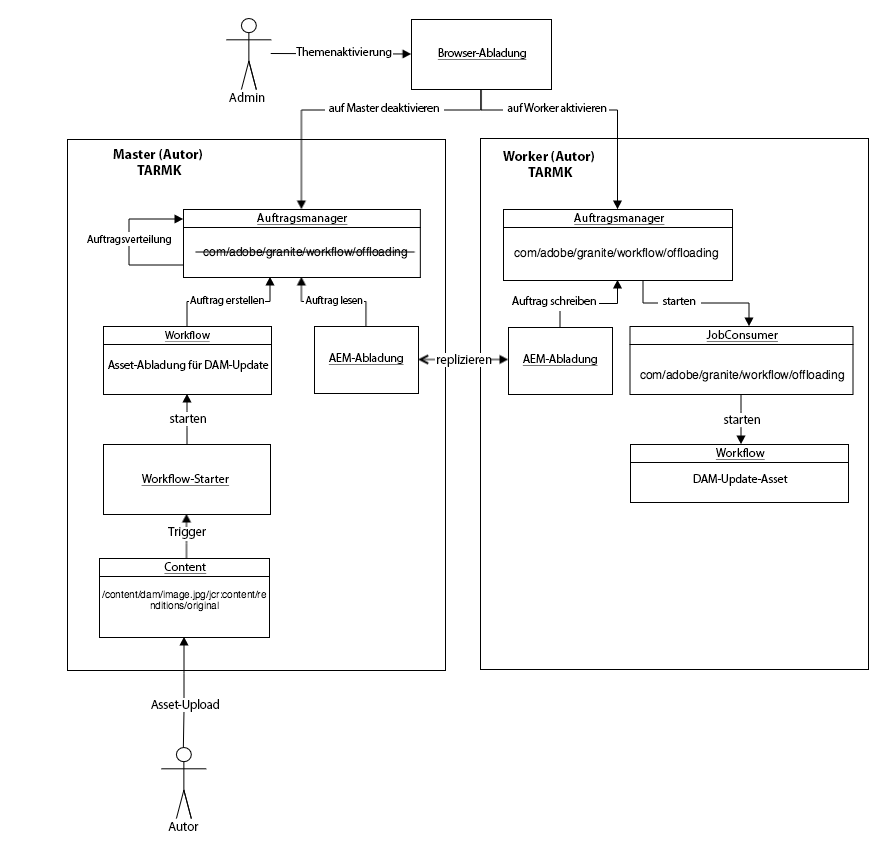
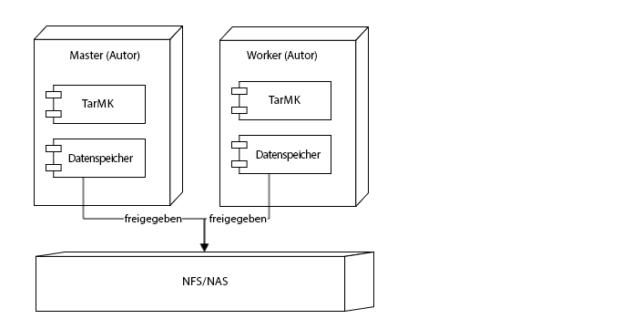

# Best Practices für die Assets-Abladung {#assets-offloading-best-practices}

>[!CAUTION]
>
>AEM 6.4 hat das Ende der erweiterten Unterstützung erreicht und diese Dokumentation wird nicht mehr aktualisiert. Weitere Informationen finden Sie in unserer [technische Unterstützung](https://helpx.adobe.com/de/support/programs/eol-matrix.html). Unterstützte Versionen suchen [here](https://experienceleague.adobe.com/docs/?lang=de).

>[!WARNING]
>
>Diese Funktion wird nicht mehr unterstützt. [!DNL Experience Manager] Ab 6.4 und wird entfernt in [!DNL Experience Manager] 6.5. Entsprechende Planung.

Die Verarbeitung großer Dateien und die Ausführung von Workflows in Adobe Experience Manager Assets können erhebliche CPU-, Speicher- und I/O-Ressourcen beanspruchen. Insbesondere die Größe von Assets, Workflows, die Anzahl der Benutzer und die Häufigkeit der Asset-Erfassung können sich auf die Gesamtleistung des Systems auswirken. Die ressourcenintensivsten Vorgänge sind Workflows zur Asset-Erfassung und -Replikation. Eine intensive Nutzung dieser Workflows auf einer einzelnen Authoring-Instanz kann die Authoring-Effizienz beeinträchtigen.

Das Abladen dieser Aufgaben auf dedizierte Worker-Instanzen kann CPU-, Speicher- und I/O-Overheads reduzieren. Im Allgemeinen besteht die Idee hinter der Abladung darin, Aufgaben, die intensive CPU-/Speicher-/IO-Ressourcen benötigen, an dedizierte Worker-Instanzen zu verteilen. Die folgenden Abschnitte enthalten empfohlene Anwendungsfälle für die Asset-Abladung.

## [!DNL Experience Manager Assets] Entladen {#aem-assets-offloading}

[!DNL Experience Manager] Assets implementiert eine native Asset-spezifische Workflow-Erweiterung für die Abladung. Sie basiert auf der generischen Workflow-Erweiterung, die das Abladungs-Framework bereitstellt, enthält jedoch zusätzliche Asset-spezifische Funktionen in der Implementierung. Ziel der Asset-Abladung ist es, den Workflow &quot;DAM-Update-Asset&quot;effizient für ein hochgeladenes Asset auszuführen. Die Asset-Abladung ermöglicht es Ihnen, die Aufnahme-Workflows besser zu steuern.

## [!DNL Experience Manager] Komponenten zum Abladen von Assets {#aem-assets-offloading-components}

Das folgende Diagramm zeigt die Hauptkomponenten im Asset-Abladeprozess:

### Workflow &quot;DAM-Update-Asset-Abladung&quot; {#dam-update-asset-offloading-workflow}

Der Workflow &quot;Asset-Abladung für DAM-Update&quot;wird auf dem primären (Autoren-)Server ausgeführt, auf den der Benutzer die Assets hochlädt. Dieser Workflow wird durch einen regulären Workflow-Starter ausgelöst. Anstatt das hochgeladene Asset zu verarbeiten, erstellt dieser Abladungs-Workflow einen neuen Auftrag unter Verwendung des Themas *com/adobe/granite/workflow/offloading*. Der Abladungs-Workflow fügt den Namen des Ziel-Workflows - in diesem Fall den Workflow DAM-Update-Asset - und den Pfad des Assets zur Payload des Auftrags hinzu. Nach Erstellung des Abladeauftrags wartet der Abladeworkflow auf der primären Instanz, bis der Abladeauftrag ausgeführt wurde.

### Job Manager {#job-manager}

Der Job Manager verteilt neue Aufträge an Worker-Instanzen. Bei der Erstellung des Verteilungsmechanismus ist es wichtig, die Themenaktivierung zu berücksichtigen. Aufträge können nur Instanzen zugewiesen werden, in denen das Thema des Auftrags aktiviert ist. Thema deaktivieren `com/adobe/granite/workflow/offloading` auf der primären Instanz und aktivieren Sie sie für den Worker, um sicherzustellen, dass der Auftrag dem Arbeitnehmer zugewiesen wird.

### [!DNL Experience Manager] Abladung {#aem-offloading}

Das Abladungs-Framework identifiziert Workflow-Abladeaufträge, die Worker-Instanzen zugewiesen sind, und verwendet die Replikation, um sie physisch zu übertragen, einschließlich ihrer Nutzlast (z. B. aufzunehmende Bilder) an Worker.

### Workflow-Abladung für Job Consumer {#workflow-offloading-job-consumer}

Sobald ein Job auf den Arbeitnehmer geschrieben wurde, ruft der Job Manager den Job Consumer auf, der für die *com/adobe/granite/workflow/offloading* Thema. Der Auftrags-Consumer führt dann den Workflow &quot;DAM-Update-Asset&quot;für das Asset aus.

## Sling-Topologie {#sling-topology}

Die Sling-Topologie-Gruppen [!DNL Experience Manager] -Instanzen und ermöglichen es ihnen, sich gegenseitig zu informieren, unabhängig von der zugrunde liegenden Persistenz. Mit diesem Merkmal der Sling-Topologie können Sie Topologien für nicht gruppierte, geclusterte und gemischte Szenarien erstellen. Eine Instanz kann Eigenschaften für die gesamte Topologie verfügbar machen. Das Framework bietet Rückrufe zum Überwachen von Änderungen in der Topologie (Instanzen und Eigenschaften). Die Sling-Topologie bildet die Grundlage für verteilte Sling-Aufträge.

### Sling-verteilte Aufträge {#sling-distributed-jobs}

Sling-verteilte Aufträge erleichtern die Verteilung von Aufträgen auf eine Reihe von Instanzen, die Mitglieder der Topologie sind. Sling-Aufträge basieren auf der Idee von Funktionen. Ein Auftrag wird durch sein Auftragsthema definiert. Um einen Auftrag auszuführen, muss eine Instanz einen Job Consumer für ein bestimmtes Auftragsthema bereitstellen. Das Auftragsthema ist der Hauptmotor für den Verteilungsmechanismus.

Aufträge werden nur an Instanzen verteilt, die einen Job Consumer für das Thema bereitstellen. Durch Aktivierung/Deaktivierung von Job Consumer in einer Instanz können Sie die Funktionen einer Instanz definieren und den Verteilungsmechanismus beeinflussen. Die verfügbaren Auftragskunden einer Instanz werden an die gesamte Topologie gesendet.

In diesem Zusammenhang bedeutet der Begriff &quot;Verteilung&quot;die Zuweisung eines Auftrags zu einer bestimmten Instanz, die einen Job Consumer bereitstellt. Die Zuweisung zu einer Instanz wird im Repository gespeichert. Anders ausgedrückt: Sling-verteilte Aufträge können standardmäßig jeder Instanz in der Topologie zugewiesen werden. Andere Aufträge können jedoch nur von Instanzen ausgeführt werden, die dasselbe Repository nutzen. Dies bedeutet, dass diese Aufträge nur von Instanzen ausgeführt werden können, die Teil desselben Clusters sind. Aufträge, die Instanzen eines anderen Clusters zugewiesen sind, werden nicht ausgeführt.

### Granite-Abladeframework {#granite-offloading-framework}

Das Granite-Abladeframework ergänzt die Sling-Auftragsverteilung, um Aufträge auszuführen, die Nicht-Cluster-Instanzen zugewiesen sind. Es führt keine Verteilung durch (Instanzzuweisung). Er identifiziert jedoch Sling-Aufträge, die an Nicht-Cluster-Instanzen verteilt wurden, und transportiert sie zur Ausführung an die Zielinstanz. Derzeit verwendet die Abladung die Replikation, um diesen Auftragstransfer durchzuführen. Um einen Auftrag auszuführen, definiert die Abladung die Eingabe und die Ausgabe, die dann mit dem Auftrag kombiniert werden, um die Auftrags-Payload zu erstellen.

Sling-verteilte Aufträge bieten das Auftrags- und Verteilungs-Framework. Die Granite-Abladung übernimmt nur den Transport für den Sonderfall, in dem Aufträge an Nicht-Cluster-Instanzen verteilt werden.

Zusätzlich zum Transport stellt das Abladungs-Framework eine Erweiterung für die Workflow-Engine bereit. Dadurch kann das Framework verteilte Aufträge im Rahmen eines Workflows erstellen und auf deren Abschluss warten, bevor der Workflow fortgesetzt wird. Es wird mithilfe der Workflow-API für externe Schritte aus der Workflow-Engine implementiert. Eine der Erweiterungen erleichtert die allgemeine Verteilung von Workflows. Die Verteilung einzelner Workflow-Schritte wird nicht unterstützt.

Das Abladungs-Framework verfügt außerdem über eine Benutzeroberfläche, über die die Aktivierung von Auftragsthemen über die gesamte Topologie hinweg visualisiert und gesteuert werden kann. Über die Benutzeroberfläche können Sie die Themenaktivierung von Sling-verteilten Aufträgen bequem konfigurieren. Sie können die Abladung auch ohne die Benutzeroberfläche einrichten.

## Allgemeine Leitlinien und Best Practices für die Asset-Abladung {#general-guidance-and-best-practices-for-asset-offloading}

Jede Implementierung ist einzigartig und daher gibt es keine universelle Abladekonfiguration. In den folgenden Abschnitten finden Sie Anleitungen und Best Practices zur Asset-Aufnahme-Abladung.

Die Asset-Abladung verursacht auch Mehrkosten für das System, einschließlich Betriebskosten. Wenn Probleme mit dem Laden der Asset-Aufnahme auftreten, empfiehlt Adobe, die Konfiguration zunächst ohne Abladung zu verbessern. Beachten Sie die folgenden Optionen, bevor Sie zur Asset-Abladung wechseln:

* Hardware vergrößern
* Optimieren von Workflows
* Verlaufs-Workflows verwenden
* Anzahl der für Workflows verwendeten Kerne begrenzen

Wenn Sie zu dem Schluss kommen, dass die Asset-Abladung für Sie ein geeigneter Ansatz ist, bietet Adobe die folgenden Anleitungen:

* Es wird eine TarMK-basierte Bereitstellung empfohlen
* Die Abladung von TarMK-basierten Assets ist nicht für eine umfassende horizontale Skalierung ausgelegt
* Sicherstellen, dass die Netzwerkleistung zwischen Autor und Mitarbeitern zufriedenstellend ist

### Empfohlene Asset-Abladebereitstellung {#recommended-assets-offloading-deployment}

Mit [!DNL Experience Manager] und Oak gibt es mehrere Bereitstellungsszenarien. Für die Assets-Abladung wird eine TarMK-basierte Bereitstellung mit einem freigegebenen Datenspeicher empfohlen. Im folgenden Diagramm wird die empfohlene Bereitstellung beschrieben:

Weitere Informationen zum Konfigurieren eines Datenspeichers finden Sie unter [Konfigurieren von Knotenspeichern und Datenspeichern in AEM](../sites-deploying/data-store-config.md).

### Deaktivieren der automatischen Agentenverwaltung {#turning-off-automatic-agent-management}

Adobe empfiehlt, die automatische Agentenverwaltung zu deaktivieren, da sie keine Binärdatei-lose Replikation unterstützt und bei der Einrichtung einer neuen Abladetopologie Verwirrung verursachen kann. Darüber hinaus unterstützt es nicht automatisch den Weiterleitungsreplikationsfluss, der für die Binärdatei-lose Replikation erforderlich ist.

1. Öffnen Sie Configuration Manager über die URL `http://localhost:4502/system/console/configMgr`.
1. Öffnen Sie die Konfiguration für `OffloadingAgentManager` (`http://localhost:4502/system/console/configMgr/com.adobe.granite.offloading.impl.transporter.OffloadingAgentManager`).
1. Deaktivieren Sie die automatische Agentenverwaltung.

### Vorwärtsreplikation verwenden {#using-forward-replication}

Standardmäßig nutzt der Abladetransport die Rückwärtsreplikation, um die abgeladenen Assets vom Worker an die primäre Instanz zurückzuziehen. Rückwärtsreplikationsagenten unterstützen keine Binärdatei-lose Replikation. Sie sollten die Abladung so konfigurieren, dass die Vorwärtsreplikation verwendet wird, um die abgeladenen Assets wieder vom Worker an die primäre Instanz zu übertragen.

1. Wenn Sie von der Standardkonfiguration mit Rückwärtsreplikation migrieren, deaktivieren oder löschen Sie alle Agenten mit dem Namen `offloading_outbox`&quot; und &quot; `offloading_reverse_*`&quot;auf Primär- und Worker, wobei &amp;ast; stellt die Sling-ID der Zielinstanz dar.
1. Erstellen Sie auf jedem Worker einen neuen Agenten für die Vorwärtsreplikation, der auf das primäre Element verweist. Das Verfahren entspricht dem Erstellen von Forward Agents von der primären zu der Worker-Aktivität. Siehe [Erstellen von Replikationsagenten für die Abladung](../sites-deploying/offloading.md#creating-replication-agents-for-offloading) für Anweisungen zum Einrichten von Replikationsagenten zur Abladung.
1. Öffnen Sie die Konfiguration für `OffloadingDefaultTransporter`  (`http://localhost:4502/system/console/configMgr/com.adobe.granite.offloading.impl.transporter.OffloadingDefaultTransporter`).
1. Wert der Eigenschaft ändern `default.transport.agent-to-master.prefix` von `offloading_reverse` nach `offloading`.

<!-- TBD: Make updates to the configuration for allow and block list after product updates are done.
TBD: Update the property in the last step when GRANITE-30586 is fixed.
-->

### Verwenden des freigegebenen Datenspeichers und der nicht binären Replikation zwischen Autor und Sekundären  {#using-shared-datastore-and-binary-less-replication-between-author-and-workers}

Die Verwendung der Binärdatei-losen Replikation wird empfohlen, um den Transportaufwand für die Asset-Abladung zu reduzieren. Informationen zum Einrichten der Binärdatei-losen Replikation für einen freigegebenen Datenspeicher finden Sie unter [Konfigurieren von Knotenspeichern und Datenspeichern in AEM](/help/sites-deploying/data-store-config.md). Das Verfahren unterscheidet sich nicht von der Abladung von Assets, außer dass es andere Replikationsagenten umfasst. Da die Binärdatei-lose Replikation nur mit Agenten für die Weiterreplikation funktioniert, sollten Sie auch die Vorwärtsreplikation für alle Abladeagenten verwenden.

### Deaktivieren von Transportpaketen {#turning-off-transport-packages}

Standardmäßig erstellt die Abladung ein Inhaltspaket, das den Abladeauftrag und die Auftragsnutzlast (das ursprüngliche Asset) enthält, und transportiert dieses einzelne Abladepaket mit einer einzigen Replikationsanforderung. Das Erstellen dieser Abladepakete ist bei der Verwendung der Binärdatei-losen Replikation kontraproduktiv, da Binärdateien beim Erstellen des Pakets erneut in das Paket serialisiert werden. Die Verwendung dieser Transportpakete kann deaktiviert werden, was dazu führt, dass der Abladeauftrag und die Payload in mehreren Replikationsanfragen übertragen werden, eine für jeden Payload-Eintrag. Auf diese Weise kann der Nutzen der Binärdatei-losen Replikation genutzt werden.

1. Öffnen Sie die Komponentenkonfiguration von *OffloadingDefaultTransporter* Komponente bei [http://localhost:4502/system/console/configMgr/com.adobe.granite.offloading.impl.transporter.OffloadingDefaultTransporter](http://localhost:4502/system/console/configMgr/com.adobe.granite.offloading.impl.transporter.OffloadingDefaultTransporter)
1. Eigenschaft deaktivieren *Replikationspaket (default.transport.contentpackage)*.

### Deaktivieren des Transports des Workflow-Modells {#disabling-the-transport-of-workflow-model}

Standardmäßig wird die *DAM-Update-Asset-Abladung* Abladungs-Workflow fügt das Workflow-Modell hinzu, um den Worker zur Auftrags-Payload aufzurufen. Da dieser Workflow dem vordefinierten *DAM-Update-Asset* -Modell können Sie diese zusätzliche Payload standardmäßig entfernen.

Wenn das Workflow-Modell in der Auftrags-Payload deaktiviert ist, stellen Sie sicher, dass Sie Änderungen mithilfe anderer Tools wie Package Manager an das referenzierte Workflow-Modell verteilen.

Um den Transport des Workflow-Modells zu deaktivieren, ändern Sie den Workflow &quot;Asset-Abladung für DAM-Update&quot;.

1. Öffnen Sie die Workflow-Konsole über [http://localhost:4502/libs/cq/workflow/content/console.html](http://localhost:4502/libs/cq/workflow/content/console.html).
1. Öffnen Sie die Registerkarte Modelle .
1. Öffnen Sie das Workflow-Modell DAM-Update-Asset-Abladung .
1. Öffnen Sie die Schritteigenschaften für den Schritt &quot;DAM-Workflow-Abladung&quot;.
1. Öffnen Sie die Registerkarte Argumente und deaktivieren Sie die Optionen Modell zur Eingabe hinzufügen und Modell zur Ausgabe hinzufügen .
1. Speichern Sie die Änderungen am Modell.

### Optimieren des Abrufintervalls {#optimizing-the-polling-interval}

Die Workflow-Abladung wird mithilfe eines externen Workflows auf der primären Instanz implementiert, der den Abschluss des abgeladenen Workflows auf dem Worker abfragt. Das standardmäßige Abrufintervall für die externen Workflow-Prozesse beträgt fünf Sekunden. Adobe empfiehlt, das Abrufintervall des Abladeschritts für Assets auf mindestens 15 Sekunden zu erhöhen, um den Abladeaufwand für die primäre Instanz zu reduzieren.

1. Öffnen Sie die Workflow-Konsole über [http://localhost:4502/libs/cq/workflow/content/console.html](http://localhost:4502/libs/cq/workflow/content/console.html).

1. Öffnen Sie die Registerkarte Modelle .
1. Öffnen Sie das Workflow-Modell DAM-Update-Asset-Abladung .
1. Öffnen Sie die Schritteigenschaften für den Schritt &quot;DAM-Workflow-Abladung&quot;.
1. Öffnen Sie die Registerkarte &quot;Commons&quot;und passen Sie den Wert der Eigenschaft &quot;Period&quot;an.
1. Speichern Sie die Änderungen am Modell.

## Weitere Ressourcen {#more-resources}

Dieses Dokument konzentriert sich auf die Asset-Abladung. Im Folgenden finden Sie eine zusätzliche Dokumentation zur Abladung:

* [Abladung von Aufträgen](/help/sites-deploying/offloading.md)
* [Assets-Workflow-Offloader](/help/sites-administering/workflow-offloader.md)
