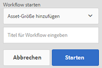
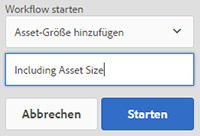
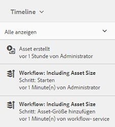
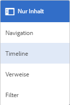

# Verarbeiten digitaler Assets {#process-assets}

[!DNL Adobe Experience Manager Assets] ermöglicht es Ihnen, auf vielerlei Weise Ihre digitalen Assets zu bearbeiten, um eine zuverlässige Asset-Verarbeitung zu ermöglichen. Sie können die verfügbaren Verarbeitungsmethoden verwenden oder die Methoden erweitern, um die End-to-End-Fertigstellung von Geschäftsprozessen mithilfe von Audits und Compliance von, Erkennung und Verteilung sowie grundlegender Vernunft Ihrer digitalen Assets sicherzustellen. Sie können all dies tun und dabei die erforderliche Skalierung und Anpassung erreichen.

## Grundlegendes zu Workflows {#understand-workflows}

Für die Asset-Verarbeitung verwendet [!DNL Experience Manager] Workflows. Workflows helfen bei der Automatisierung von Business-Logik oder Aktivitäten. Detaillierte Schritte zum Ausführen bestimmter Aufgaben werden standardmäßig bereitgestellt und Entwickler können eigene benutzerdefinierte Schritte erstellen. Diese Schritte können in einer logischen Reihenfolge kombiniert werden, um Workflows zu erstellen. Beispielsweise kann ein Workflow automatisch Wasserzeichen auf hochgeladene Bilder anwenden, die auf bestimmten Kriterien basieren, z. B. auf in das Bild eingebettete Metadaten, in den Ordner, in den es hochgeladen wird, Auflösung des Bildes usw. Ein weiteres Beispiel ist ein Workflow, der so konfiguriert wurde, dass Bilder auf Wasserzeichen gesetzt werden und gleichzeitig mehrere Asset-Management-Anforderungen erfüllt werden, z. B. das Hinzufügen von Metadaten, das Erstellen von Ausgabedarstellungen, das Hinzufügen intelligenter Tags für die Asset-Erkennung, das Veröffentlichen in einem Datenspeicher, das Festlegen von Berechtigungen für den Benutzerzugriff usw.

## In Experience Manager verfügbare Standard-Workflows {#default-workflows}

Standardmäßig werden alle hochgeladenen Assets mit dem Workflow [!UICONTROL DAM-Update-Asset] verarbeitet. Der Workflow wird für jedes hochgeladene Asset ausgeführt und führt grundlegende Aufgaben des Asset-Managements wie Generieren der Ausgabedarstellung, Zurückschreiben der Metadaten, Extrahieren von Seiten und Medien sowie Transkodieren durch.

Die standardmäßig verfügbaren Workflow-Modelle finden Sie unter [!UICONTROL Tools > Workflow > Modelle] in [!DNL Experience Manager].

*Abbildung: Einige der standardmäßigen Workflows, die in [!DNL Experience Manager].*

## Anwenden von Workflows auf Assets {#applying-workflows-to-assets}

Das Anwenden von Workflows auf digitale Assets entspricht dem Vorgehen bei den Seiten einer Website. Eine vollständige Anleitung zum Erstellen und Verwenden von Workflows finden Sie unter [Starten von Workflows](/help/sites-authoring/workflows-participating.md).

Nutzen Sie Workflows in digitalen Assets, um das Asset zu aktivieren oder Wasserzeichen zu erstellen. Viele Workflows für Assets werden automatisch aktiviert. Beispielsweise wird der Workflow, mit dem nach der Bearbeitung eines Bildes automatisch ein Ausgabeformat erstellt wird, automatisch aktiviert.

>[!NOTE]
>
>Wenn ein in der klassischen Benutzeroberfläche verfügbarer Workflow in der Touch-optimierten Benutzeroberfläche nicht verfügbar ist, z. B. [!UICONTROL Aktivierungsanfrage] und [!UICONTROL Deaktivieren anfordern], siehe [Workflow-Modelle erstellen](/help/sites-developing/workflows-models.md#make-workflow-models-available-in-touchui).

## Anwenden eines Workflows auf eine [!DNL Experience Manager] Asset {#apply-a-workflow-to-an-aem-asset}

<!-- 
TBD: Add animated GIF for these steps instead of all these screenshots.
-->

Gehen Sie wie folgt vor, um einen Workflow auf ein Asset anzuwenden:

1. Navigieren Sie zum Speicherort des Assets, für das Sie einen Workflow beginnen möchten, und klicken Sie auf das Asset, um die Asset-Seite zu öffnen.

1. Navigieren Sie zum Speicherort des Assets, für das Sie einen Workflow beginnen möchten, und klicken Sie auf das Asset, um die Asset-Seite zu öffnen. Wählen Sie **[!UICONTROL Zeitleiste]** aus dem Menü aus, um die Zeitleiste anzuzeigen.

   

1. Klicken Sie unten auf **[!UICONTROL Aktionen]**, um die Liste der Aktionen zu öffnen, die für das Asset verfügbar sind.

1. Klicken Sie in der Liste auf **[!UICONTROL Workflow starten]**.

1. Im **[!UICONTROL Workflow starten]** wählen Sie ein Workflow-Modell aus der Liste aus.

   

1. (Optional) Geben Sie einen Titel für den Workflow an, der für den Verweis auf die Workflow-Instanz verwendet werden kann.

   

1. Klicken **[!UICONTROL Starten]** Klicken Sie auf **[!UICONTROL Fortfahren]** im Dialogfeld zur Bestätigung. Jeder Schritt des Workflows wird in der Zeitleiste als ein Ereignis angezeigt.

   

## Anwenden eines Workflows auf mehrere Assets {#applying-a-workflow-to-multiple-assets}

1. Navigieren Sie in der Assets-Konsole zum Verzeichnis der Assets, für die Sie einen Workflow starten möchten, und wählen Sie die Assets aus. Wählen Sie **[!UICONTROL Zeitleiste]** aus dem Menü aus, um die Zeitleiste anzuzeigen.

   

1. Klicken Sie unten auf **[!UICONTROL Aktionen]**.

1. Klicken Sie auf **[!UICONTROL Workflow starten]**. Wählen Sie im Dialogfeld **[!UICONTROL Workflow starten]** ein Workflow-Modell aus der Liste aus.

   

1. (Optional) Geben Sie einen Titel für den Workflow an, der für den Verweis auf die Workflow-Instanz verwendet werden kann.

1. Klicken Sie auf **[!UICONTROL Starten]** und anschließend im Dialogfeld auf **[!UICONTROL Bestätigen]**. Der Workflow wird für alle Assets ausgeführt, die Sie ausgewählt haben.

## Anwenden eines Workflows auf mehrere Ordner {#applying-a-workflow-to-multiple-folders}

Die Vorgehensweise zum Anwenden eines Workflows auf mehrere Ordner ähnelt der Vorgehensweise beim Anwenden eines Workflows auf mehrere Assets. Wählen Sie die Ordner in der Assets-Konsole aus und führen Sie die Schritte 2 bis 7 des Verfahrens aus. [Anwenden eines Workflows auf mehrere Assets](assets-workflow.md#applying-a-workflow-to-multiple-assets).

## Anwenden eines Workflows auf eine Sammlung {#applying-a-workflow-to-a-collection}

Weitere Informationen zum Anwenden eines Workflows auf eine Sammlung finden Sie unter [Anwenden eines Workflows auf eine Sammlung](managing-collections-touch-ui.md#running-a-workflow-on-a-collection).

## Automatisches Starten eines Workflows zur bedingten Verarbeitung von Assets {#auto-execute-workflow-on-some-assets}

Admins können Workflows so konfigurieren, dass Assets basierend auf vordefinierten Bedingungen automatisch ausgeführt und verarbeitet werden. Die Funktion ist nützlich für Benutzer und Marketingexperten in Unternehmen, z. B. um einen benutzerdefinierten Workflow für bestimmte Ordner zu erstellen. Angenommen, alle Assets aus dem Foto-Shooting einer Agentur können mit einem Wasserzeichen versehen werden oder alle von einem Freiberufler hochgeladenen Assets können verarbeitet werden, um bestimmte Ausgabedarstellungen zu erstellen.

In einem Workflow-Modell können Benutzer einen Workflow-Starter erstellen, der ihn ausführt. Ein Workflow-Starter überwacht Änderungen im Content-Repository und führt den Workflow aus, wenn die vordefinierten Bedingungen erfüllt sind. Adminis können Marketing-Fachleuten Zugriff gewähren, damit sie Workflows erstellen und den Starter konfigurieren können. Benutzer können den Standard-Workflow [!UICONTROL DAM-Update-Asset] ändern, um die zusätzlichen Schritte hinzuzufügen, die zur Verarbeitung bestimmter Assets erforderlich sind. Der Workflow wird für alle neu hochgeladenen Assets ausgeführt. Verwenden Sie einen der folgenden Ansätze, um die Ausführung der zusätzlichen Schritte auf bestimmte Assets zu beschränken:

* Erstellen Sie eine Kopie des Workflows [!UICONTROL DAM-Update-Asset] und ändern Sie sie, um sie in einer bestimmten Ordnerhierarchie auszuführen. Dieser Ansatz ist für einige Ordner nützlich.
* Die zusätzlichen Verarbeitungsschritte können mit einer [ODER-Teilung](/help/sites-developing/workflows-step-ref.md#or-split) als bedingt anwendbar zu so vielen Ordnern wie erforderlich hinzugefügt werden.

## Best Practices und Einschränkungen {#best-practices-limitations-tips}

* Berücksichtigen Sie beim Entwickeln von Workflows Ihre Anforderungen für alle Arten von Ausgabedarstellungen. Wenn Sie der Meinung sind, dass eine Ausgabedarstellung in Zukunft nicht erforderlich sein wird, entfernen Sie den Erstellungsschritt aus dem Workflow. Ausgabedarstellungen können später nicht mehr stapelweise gelöscht werden. Unerwünschte Ausgabedarstellungen können nach längerer Nutzung von [!DNL Experience Manager] viel Speicherplatz beanspruchen. Bei einzelnen Assets können Sie Ausgabedarstellungen manuell aus der Benutzeroberfläche entfernen. Bei mehreren Assets können Sie [!DNL Experience Manager] so anpassen, dass entweder bestimmte Ausgabedarstellungen gelöscht oder die Assets gelöscht und die gelöschten Assets erneut hochgeladen werden.
* Standardmäßig umfasst der Workflow [!UICONTROL DAM-Update-Asset] einige Schritte zum Erstellen von Miniaturansichten und Web-Ausgabedarstellungen. Wenn standardmäßige Ausgabedarstellungen aus dem Workflow entfernt werden, wird die Benutzeroberfläche von [!DNL Assets] nicht ordnungsgemäß gerendert.

>[!MORELIKETHIS]
>
>* [Anwenden von und Teilnehmen an Workflows](/help/sites-authoring/workflows.md)
>* [Erstellen von Workflow-Modellen und Erweitern der Workflow-Funktionalität](/help/sites-developing/workflows.md)
>* [Methoden zum Ausführen von Workflows](/help/sites-administering/workflows-starting.md)
>* [Best Practices für Workflows](/help/sites-developing/workflows-best-practices.md)

