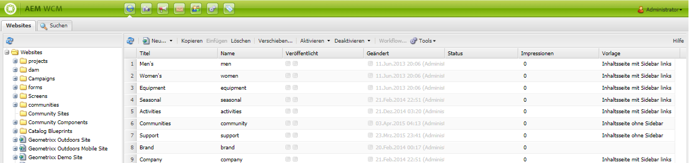
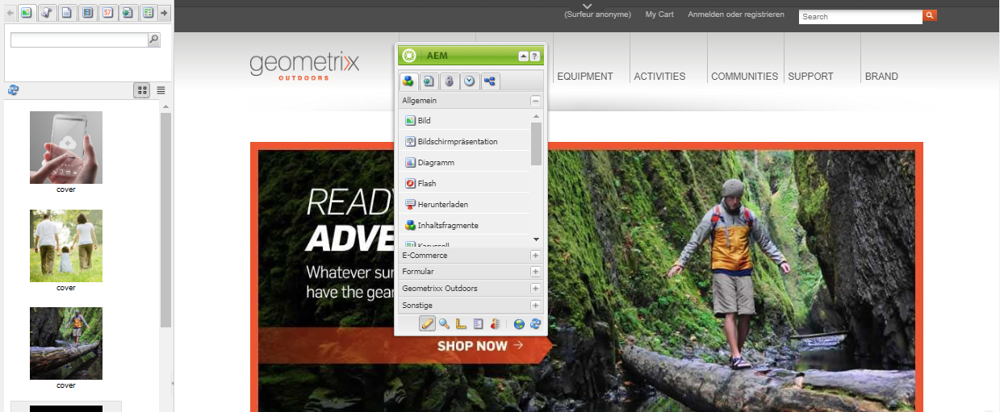

# Über [!DNL Adobe Experience Manager Assets] als DAM-Lösung {#about-assets}

>[!CAUTION]
>
>AEM 6.4 hat das Ende der erweiterten Unterstützung erreicht und diese Dokumentation wird nicht mehr aktualisiert. Weitere Informationen finden Sie in unserer [technische Unterstützung](https://helpx.adobe.com/de/support/programs/eol-matrix.html). Unterstützte Versionen suchen [here](https://experienceleague.adobe.com/docs/?lang=de).

[!DNL Assets] ist ein DAM-Tool (Digital Asset Management), das integraler Bestandteil von [!DNL Experience Manager] ist und Ihrem Unternehmen die Verwaltung und Verteilung digitaler Assets ermöglicht. Benutzende im Unternehmen können viele Arten von digitalen Assets verwalten, speichern und darauf zugreifen, z. B. Bilder, Videos, Dokumente, Audio-Clips, 3D-Dateien und Rich-Media-Dateien, die im Web, in gedruckten Dokumenten und für die digitale Verteilung verwendet werden können.

## Was ist Digital Asset Management? {#what-is-digital-asset-management}

[!DNL Assets] ermöglicht die unternehmensweite Frei- und Weitergabe der wichtigsten digitalen Assets einer Organisation. Benutzende in einer Organisation können digitale Assets wie Bilder, Grafiken, Audio- und Videodateien sowie Dokumente über eine Webschnittstelle (oder einen CIFS- oder WebDAV-Ordner) speichern, verwalten und aufrufen.

Die [!DNL Assets]-Funktionen von [!DNL Experience Manager] bieten Ihnen folgende Möglichkeiten:

* Hinzufügen und Freigeben von Bildern, Dokumenten, Audiodateien und Videodateien in einer Vielzahl von Dateiformaten.
* Verwalten von Assets durch Gruppierung nach Tags, Lightbox oder Bewertung (Favoriten). Hinzufügen von Anmerkungen zu Assets.
* Suchen Sie nach Assets, indem Sie nach Dateinamen, dem Volltext von Dokumenten und nach Daten, Dokumenttyp und Tags suchen.
* Hinzufügen oder Bearbeiten von Metadateninformationen für Assets. Metadaten werden automatisch mit dem entsprechenden Asset in einer Version zusammengefasst. Sie können Asset-Metadaten importieren und exportieren.
* Führen Sie Bildbearbeitungsfunktionen wie Skalierung und Hinzufügen von Bildfiltern durch. Importieren und exportieren Sie mehrere digitale Assets gleichzeitig mit einem WebDAV- oder CIFS-Ordner.
* Verwenden von Workflows und Benachrichtigungen, um die gemeinsame Verarbeitung und den gemeinsamen Download mehrerer Assets zu ermöglichen und Zugriffsrechte auf Assets zu verwalten.

### [!DNL Experience Manager Assets] ist mit [!DNL Experience Manager Sites] integriert {#aem-assets-fully-integrated-in-cq-wcm}

[!DNL Assets] ist vollständig mit [!DNL Sites] integriert und funktioniert nahtlos für alle Anwendungsfälle. Wenn Sie z. B. Web-Seiten erstellen, können [!DNL Sites]-Autoren können die digitalen Assets über den Content Finder suchen und verwenden. Die Benutzeroberfläche von [!DNL Assets] entspricht der von [!DNL Sites]. Ausführliche Informationen finden Sie unter [Übersicht über Sites](/help/sites-authoring/qg-page-authoring.md).

<!-- TBD: Update image for branding 

 

Assets managed within [!DNL Experience Manager] DAM can then be accessed via the content finder of WCM:

 -->

### Digital Asset Management im Vergleich zur Bildkomponente {#digital-asset-management-versus-image-component}

Um zu bestimmen, ob ein Bild in DAM-Repository bereitgestellt oder die Bildkomponente verwendet werden soll, ist der Bildlebenszyklus zu berücksichtigen:

* Wenn das Bild denselben Lebenszyklus hat wie die Seite, verwenden Sie die Bildkomponente.
* Wenn das Bild einen eigenen Lebenszyklus hat – beispielsweise, wenn Sie das Bild zweimal oder außerhalb von WCM verwenden –, verwenden Sie [!DNL Assets].

## Was sind digitale Assets? {#what-are-digital-assets}

Ein Asset ist ein digitales Dokument oder Bild bzw. eine digitale Video- oder Audiodatei (oder ein Teil davon), das bzw. die in verschiedenen Ausgabedarstellungen vorliegen und über Unter-Assets verfügen kann (beispielsweise Ebenen in einer Photoshop-Datei, Folien in einer PowerPoint-Datei, Seiten in einer PDF-Datei, Dateien in einem ZIP-Archiv).

Ein Asset ist im Wesentlichen eine Binärdatei sowie Metadaten, Ausgabeformate und Teil-Assets. Siehe [DAM-Leistungsleitfaden](https://experienceleague.adobe.com/docs/experience-manager-64/assets/administer/performance-tuning-guidelines.html?lang=de) für detaillierte Informationen.

>[!CAUTION]
>
>Das Hochladen bzw. Bearbeiten von sehr vielen Assets (insbesondere von Bildern) kann die Leistung Ihrer [!DNL Experience Manager]-Implementierung beeinträchtigen.

### [!DNL Experience Manager Assets] – Terminologie {#aem-assets-terminology}

Bei der Arbeit mit digitalen Assets in [!DNL Experience Manager] müssen Sie mit der folgenden Terminologie vertraut sein:

* **Sammlung**: Eine Sammlung von Assets, entweder auf Grundlage ihres physischen Speicherorts (Ordner), allgemeinen Eigenschaften (gespeicherter Suchordner) oder Benutzerauswahl (Lightbox-Ordner).

* **Metadaten**: [!DNL Assets] verfügen über Metadaten, darunter Autor, Ablaufdatum, DRM-Informationen (Digital Rights Management) usw. Metadaten sind unter der Zugangssteuerung zu finden. [!DNL Assets] unterstützt standardmäßig die folgenden allgemeinen Metadaten-Schemata:

   * Dublin Core: einschließlich Autor, Beschreibung, Datum, Betreff usw.
   * IPTC: einschließlich Ereignis, Modell, Standort usw.
   * WCM: einschließlich Seiteneigenschaften, [!UICONTROL Einschaltzeit] und [!UICONTROL Ausschaltzeit] usw.

* **Tagging**: [!DNL Assets] können mit Tags versehen und klassifiziert werden. Siehe [Organisieren von Assets](/help/assets/organize-assets.md).

* **Ausgabedarstellungen**: Eine Ausgabedarstellung ist die binäre Darstellung eines Assets. [!DNL Assets] verfügen stets über eine primäre Darstellung, nämlich die der hochgeladenen Datei. Sie können über eine beliebige Anzahl zusätzlicher Darstellungen verfügen, die erstellt werden, z. B. durch benutzerdefinierte Workflow-Schritte oder beim Hochladen eines Assets. Ausgabedarstellungen können eine andere Größe aufweisen, mit einer anderen Auflösung, mit einem hinzugefügten Wasserzeichen oder einem anderen geänderten Merkmal.

* **Versionen**: Bei der Versionierung wird eine Momentaufnahme von digitalen Assets zu einem bestimmten Zeitpunkt aufgezeichnet. Sie können frühere Versionen von Assets wiederherstellen. Siehe [Versionierung in  [!DNL Assets]](managing-assets-touch-ui.md#asset-versioning).

* **Unter-Assets**: Bei Unter-Assets handelt es sich um Assets, die zusammen ein Asset bilden, z. B. Ebenen in einer [!DNL Adobe Photoshop]-Datei oder Seiten in einer PDF-Datei. In [!DNL Assets] lassen sich Unter-Assets genau so wie normale Assets verwalten.

### Arbeiten mit digitalen Assets {#how-to-work-with-assets}

Sie führen eine Aktion für ein Asset oder eine Sammlung durch. Mit Aktionen können Assets, Sammlungen und Ausgabedarstellungen erstellt oder geändert werden. Viele der grundlegenden Aktionen, die Sie für Assets durchführen können – Hochladen, Löschen, Aktualisieren, Speichern von Unter-Assets –, lösen vorkonfigurierte Workflows aus. Diese sind in [!DNL Assets] automatisch aktiviert und werden in den Medien-Handlern für [!DNL Assets] detailliert beschrieben.

Folgende Aufgaben können Sie mit diesen vorkonfigurierten Workflows durchführen:

* Speichern von Assets in oder Löschen aus dem Repository.
* Extrahieren und Speichern von Metadaten der Assets. Die einzelnen Metadatenelemente werden als XMP gespeichert.
* Generieren von Ausgabedarstellungen und Miniaturansichten der Assets, einschließlich automatischer Skalierung und Zuschnitt, wo erforderlich.
* Transkodieren der Assets, sofern erforderlich. Beispielsweise werden Videos für Mobilgeräte und Verwendung im Netz mit 24 Bildern pro Sekunde transkodiert, für Downloads vorgesehene Videos hingegen mit 30 Bildern pro Sekunde. Audio für Mobilgeräte und Verwendung im Netz wird mit 128 Kbit/s transcodiert, Audio für den Download mit 192 Kbit/s.

Sie können Workflows natürlich auch manuell anwenden. Eine Liste der Standard-Workflows finden Sie unter [Medien-Handler in Assets](media-handlers.md).

## [!DNL Experience Manager Assets] und [!DNL Media Library] {#cq-dam-vs-cq-medialibrary}

Informationen zu den Unterschieden finden Sie unter [Assets und Media Library](medialibrary.md).

>[!MORELIKETHIS]
>
>* [Videoeinführung: Experience Manager Assets als modernes DAM-System](https://www.youtube.com/watch?v=PBwQqZgC-yo)

