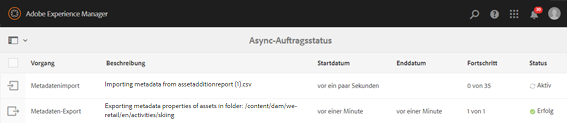
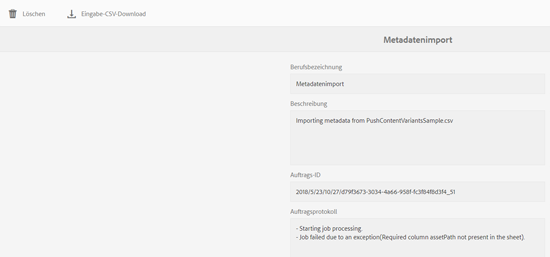

# Asynchrone Vorgänge {#asynchronous-operations}

Um negative Auswirkungen auf die Leistung zu reduzieren, verarbeitet [!DNL Adobe Experience Manger Assets] bestimmte langwierige und ressourcenintensive Asset-Vorgänge asynchron. Die asynchrone Verarbeitung umfasst die Aneinanderreihung mehrerer Aufgaben und schließlich deren serielle Ausführung, abhängig von der Verfügbarkeit von Systemressourcen. Zu diesen Vorgängen gehören u. a.:

* Löschen vieler Assets.
* Verschieben vieler Assets oder Assets mit vielen Verweisen.
* Exportieren und Importieren von Asset-Metadaten in großen Mengen.

Sie können den Status asynchroner Aufgaben auf der Seite **[!UICONTROL Async Job Status]** anzeigen.

>[!NOTE]
>
>Standardmäßig werden die Aufgaben [!DNL Assets] parallel ausgeführt. Wenn `N` die Anzahl der CPU-Kerne ist, können `N/2` Aufgaben standardmäßig parallel ausgeführt werden. Um benutzerdefinierte Einstellungen für die Aufgabenwarteschlange zu verwenden, ändern Sie die Konfiguration **[!UICONTROL Standardwarteschlange für asynchrone Vorgänge]** in der [!UICONTROL Web-Konsole]. Weitere Informationen finden Sie unter [Warteschlangenkonfigurationen](https://sling.apache.org/documentation/bundles/apache-sling-eventing-and-job-handling.html#queue-configurations).

## Überwachen des Status asynchroner Vorgänge {#monitoring-the-status-of-asynchronous-operations}

Wenn [!DNL Assets] einen Vorgang asynchron verarbeitet, erhalten Sie eine Benachrichtigung in Ihrem [!DNL Experience Manager] [Posteingang](/help/sites-authoring/inbox.md) und über eine E-Mail. Um den Status der asynchronen Vorgänge detailliert anzuzeigen, navigieren Sie zur Seite **[!UICONTROL Status asynchroner Aufträge]**.

1. Klicken Sie in der [!DNL Experience Manager]-Benutzeroberfläche auf **[!UICONTROL Vorgänge]** > **[!UICONTROL Aufträge]**.

1. Überprüfen Sie die Details für die Vorgänge auf der Seite **[!UICONTROL Status von asynchronen Aufträgen]**.

   

   Informationen zum Fortschritt eines Vorgangs finden Sie in der Spalte **[!UICONTROL Status]** . Abhängig vom Fortschritt wird eine der folgenden Statusmeldungen angezeigt:

   * **[!UICONTROL Aktiv]**: Der Vorgang wird verarbeitet.
   * **[!UICONTROL Erfolg]**: Der Vorgang wurde abgeschlossen.
   * **[!UICONTROL Fehler]******: Der Vorgang konnte nicht verarbeitet werden.
   * **[!UICONTROL Geplant]**: Die Verarbeitung des Vorgangs ist für einen späteren Zeitpunkt geplant.

1. Um einen aktiven Vorgang anzuhalten, wählen Sie ihn aus der Liste aus und klicken Sie in der Symbolleiste auf **[!UICONTROL Stopp]** .

1. Um zusätzliche Details anzuzeigen, z. B. eine Beschreibung und Protokolle, wählen Sie den Vorgang aus und klicken Sie in der Symbolleiste auf **[!UICONTROL Öffnen]**  . Die Aufgabendetailseite wird angezeigt.

   

1. Um den Vorgang aus der Liste zu löschen, wählen Sie die Option **[!UICONTROL Löschen]** in der Symbolleiste aus. Um die Details als CSV-Datei herunterzuladen, tippen/klicken Sie auf **[!UICONTROL Herunterladen]**.

   >[!NOTE]
   >
   >Sie können eine Aufgabe nicht löschen, wenn ihr Status aktiv oder in der Warteschlange ist.

## Bereinigen abgeschlossener Aufgaben {#purge-completed-tasks}

[!DNL Experience Manager Assets] führt täglich um 100 Stunden eine Bereinigungsaufgabe aus, um abgeschlossene asynchrone Aufgaben zu löschen, die älter als einen Tag sind.

<!-- TBD: Find out from the engineering team and mention the time zone of this 1:00 am task.
-->

Sie können den Zeitplan für die Bereinigungsaufgabe und die Dauer ändern, für die Details abgeschlossener Aufgaben beibehalten werden, bevor sie gelöscht werden. Sie können auch die maximale Anzahl abgeschlossener Aufgaben konfigurieren, für die die Details zu einem beliebigen Zeitpunkt beibehalten werden.

1. Klicken Sie in der [!DNL Experience Manager]-Benutzeroberfläche auf **[!UICONTROL Tools]** > **[!UICONTROL Vorgänge]** > **[!UICONTROL Web-Konsole]**.
1. Öffnen Sie die Aufgabe **[!UICONTROL Adobe CQ DAM Async Jobs Purge Scheduled]** .
1. Geben Sie den Schwellenwert für die Anzahl der Tage an, nach denen abgeschlossene Aufgaben gelöscht werden, sowie die maximale Anzahl von Aufgaben, für die Details im Verlauf beibehalten werden. Speichern Sie die Änderungen.

   

## Konfigurieren des Schwellenwerts für asynchrone Löschvorgänge {#configure-thresholds-for-asynchronous-delete-operations}

Wenn die Anzahl der zu löschenden Assets oder Ordner den festgelegten Schwellenwert überschreitet, wird der Löschvorgang asynchron ausgeführt.

1. Klicken Sie in der [!DNL Experience Manager]-Benutzeroberfläche auf **[!UICONTROL Tools]** > **[!UICONTROL Vorgänge]** > **[!UICONTROL Web-Konsole]**.
1. Öffnen Sie in der [!UICONTROL Web-Konsole] die Konfiguration **[!UICONTROL Async Delete Operation Job Processing]** .
1. Geben Sie im Feld **[!UICONTROL Schwellenwert für Assets]** die Schwellenwerte für das asynchrone Löschen von Assets, Ordnern oder Verweisen an. Speichern Sie die Änderungen.

   

## Konfigurieren des Schwellenwerts für asynchrone Verschiebevorgänge {#configure-thresholds-for-asynchronous-move-operations}

Wenn die Anzahl der zu verschiebenden Assets, Ordner oder Verweise den festgelegten Schwellenwert überschreitet, wird der Verschiebungsvorgang asynchron ausgeführt.

1. Klicken Sie in der [!DNL Experience Manager]-Benutzeroberfläche auf **[!UICONTROL Tools]** > **[!UICONTROL Vorgänge]** > **[!UICONTROL Web-Konsole]**.
1. Öffnen Sie in der [!UICONTROL Web-Konsole] die Konfiguration **[!UICONTROL Async Move Operation Job Processing]** .
1. Geben Sie im Feld **[!UICONTROL Schwellenwert für Assets/Verweise]** die Schwellenwerte für das asynchrone Verschieben von Assets, Ordnern oder Verweisen an. Speichern Sie die Änderungen.

   

>[!MORELIKETHIS]
>
>* [E-Mail in Experience Manager konfigurieren](/help/sites-administering/notification.md).
>* [Importieren und Exportieren von Asset-Metadaten in großen Mengen](/help/assets/metadata-import-export.md).

