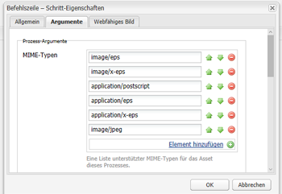
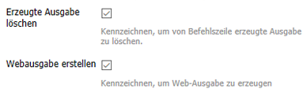
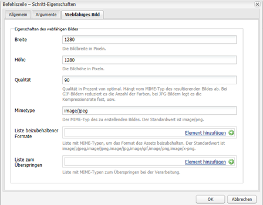
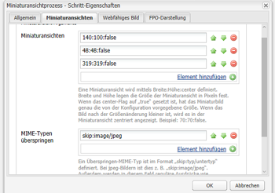
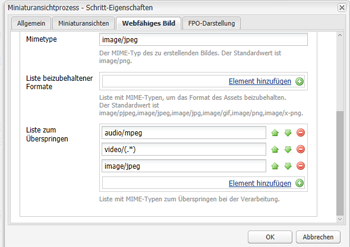

# Installieren und konfigurieren Sie ImageMagick, um mit AEM Assets arbeiten zu können.{#install-and-configure-imagemagick-to-work-with-aem-assets}

ImageMagick ist ein Software-Plug-in zum Erstellen, Bearbeiten, Erstellen oder Konvertieren von Bitmapbildern. Es kann Bilder in verschiedenen Formaten (über 200) lesen und schreiben, darunter PNG, JPEG, JPEG-2000, GIF, TIFF, DPX, EXR, WebP, Postscript, PDF und SVG. Verwenden Sie ImageMagick, um die Größe von Bildern zu ändern, Bilder zu kippen, zu spiegeln, zu drehen, zu verzerren, zuzuschneiden und umzuwandeln. Darüber hinaus können Sie mit ImageMagick die Bildfarben anpassen, verschiedene Spezialeffekte anwenden oder Text, Linien, Polygone, Ellipsen und Kurven zeichnen.

Verwenden Sie den Medien-Handler von Adobe Experience Manager (AEM) über die Befehlszeile, um Bilder mithilfe von ImageMagick zu verarbeiten. Unter [Best Practices für Assets-Dateiformate](assets-file-format-best-practices.md) finden Sie weitere Informationen zur Verwendung verschiedener Dateiformate mit ImageMagick. Unter [Von Assets unterstützte Formate](assets-formats.md) erfahren Sie mehr zu allen unterstützten Dateiformaten.

Um große Dateien mit ImageMagick zu verarbeiten, sollten Sie höhere Speicheranforderungen, potenzielle Änderungen an IM-Richtlinien und die Gesamtauswirkung auf die Leistung berücksichtigen. Die Speicheranforderungen hängen von verschiedenen Faktoren wie Auflösung, Bittiefe, Farbprofil und Dateiformat ab. Wenn Sie sehr große Dateien mit ImageMagick verarbeiten möchten, müssen Sie ein ordnungsgemäßes AEM-Server-Benchmark durchführen. Einige hilfreiche Ressourcen finden Sie weiter unten.

>[!NOTE]
>
>Wenn Sie AEM für Adobe Managed Services (AMS) verwenden, wenden Sie sich an den Kundendienst der Adobe, wenn Sie planen, viele große PSD- oder PSB-Dateien zu verarbeiten. Experience Manager verarbeitet möglicherweise keine PSB-Dateien mit sehr hoher Auflösung, die größer als 30000 x 23000 Pixel sind.

## Installieren von ImageMagick {#installing-imagemagick}

Es sind mehrere ImageMagick-Installationsdateien für verschiedene Betriebssysteme verfügbar. Verwenden Sie die entsprechende Version für Ihr Betriebssystem.

1. Laden Sie die entsprechenden [ImageMagick-Installationsdateien](https://www.imagemagick.org/script/download.php) für Ihr Betriebssystem herunter.
1. Um ImageMagick auf der Festplatte zu installieren, auf der der AEM-Server gehostet wird, starten Sie die Installationsdatei.

1. Legen Sie die Path-Umgebungsvariable auf das ImageMagick-Installationsverzeichnis fest.
1. Um zu überprüfen, ob die Installation erfolgreich war, führen Sie den Befehl `identify -version` aus.

## Einrichten eines Befehlszeilenprozessschritts {#set-up-the-command-line-process-step}

Sie können den Befehlszeilenprozesssschritt für Ihren jeweiligen Anwendungsfall einrichten. Führen Sie die folgenden Schritte aus, um jedes Mal, wenn Sie eine JPEG-Bilddatei zu `/content/dam` auf dem AEM Server hinzufügen, ein gedrehtes Bild und Miniaturansichten (140 x 100, 48 x 48, 319 x 319 und 1280 x 1280) zu generieren:

1. Rufen Sie auf dem AEM Server die Workflow-Konsole (`https://[aem_server]:[Port]/workflow`) auf und öffnen Sie das Workflow-Modell **[!UICONTROL DAM-Update-Asset]**.
1. Öffnen Sie im Workflow-Modell **[!UICONTROL DAM Update Asset]** den Schritt **[!UICONTROL EPS-Miniaturansichten (powered by ImageMagick)]**.
1. Fügen Sie auf der Registerkarte **[!UICONTROL Argumente]** `image/jpeg` der Liste **[!UICONTROL Mime-Typen]** hinzu.

   

1. Geben Sie im Feld **[!UICONTROL Befehle]** folgenden Befehl ein:

   `convert ./${filename} -flip ./${basename}.flipped.jpg`

1. Wählen Sie die Flags **[!UICONTROL Generierte Darstellung löschen]** und **[!UICONTROL Webwiedergabe erstellen]** aus.

   

1. Legen Sie auf der Registerkarte **[!UICONTROL Webfähiges Bild]** die Details für die Ausgabedarstellung mit 1280x1280 Pixel fest. Geben Sie außerdem i *mage/jpeg* im Feld **[!UICONTROL Mimetype]** an.

   

1. Tippen/klicken Sie auf **[!UICONTROL OK]**, um die Änderungen zu speichern.

   >[!NOTE]
   >
   >Der Befehl `convert` wird möglicherweise nicht mit bestimmten Windows-Versionen (z. B. Windows SE) ausgeführt, da er mit dem nativen Dienstprogramm `convert` in Konflikt steht, das Teil der Windows-Installation ist. Geben Sie in diesem Fall den vollständigen Pfad zum ImageMagick-Programm an. Geben Sie zum Beispiel Folgendes an:
   >
   >`"C:\Program Files\ImageMagick-6.8.9-Q16\convert.exe" -define jpeg:size=319x319 ./${filename} -thumbnail 319x319 cq5dam.thumbnail.319.319.png`

1. Öffnen Sie den Schritt **[!UICONTROL Prozessminiaturen]** und fügen Sie den MIME-Typ `image/jpeg` unter **[!UICONTROL MIME-Typen überspringen]** hinzu.

   

1. Fügen Sie auf der Registerkarte **[!UICONTROL Webfähiges Bild]** den MIME-Typ `image/jpeg` unter **[!UICONTROL Liste überspringen]** hinzu. Tippen/klicken Sie auf **[!UICONTROL OK]**, um die Änderungen zu speichern.

   

1. Speichern Sie den Workflow.
1. Um zu überprüfen, ob ImageMagick Bilder ordnungsgemäß verarbeiten kann, laden Sie ein .JPG-Bild in AEM Assets hoch. Stellen Sie sicher, ob dafür ein gekipptes Bild und die entsprechenden Ausgabedarstellungen generiert werden.

## Reduzieren von Sicherheitslücken {#mitigating-security-vulnerabilities}

Aus der Verwendung von ImageMagick für die Bearbeitung von Bildern resultieren mehrere Sicherheitslücken. Beispielsweise bringt die Verarbeitung von Bildern, die von Benutzern übermittelt wurden, das Risiko der Ferncodeausführung mit sich.

Darüber hinaus sind verschiedene Bildverarbeitungs-Plug-ins von der ImageMagick-Bibliothek abhängig, darunter PHP&#39;s Imagick, Ruby&#39;s Rmagick und Paperclip sowie Node.js&#39;s imagemagick.

Wenn Sie ImageMagick oder eine betroffene Bibliothek verwenden, empfiehlt Adobe, die bekannten Sicherheitslücken zu minimieren, indem Sie mindestens eine der folgenden Aufgaben ausführen (vorzugsweise beide):

1. Vergewissern Sie sich, dass alle Bilddateien mit den erwarteten [&quot;magischen Bytes&quot;](https://en.wikipedia.org/wiki/List_of_file_signatures) beginnen, die den unterstützten Bilddateitypen entsprechen, bevor Sie sie zur Verarbeitung an ImageMagick senden.
1. Verwenden Sie eine Richtliniendatei, um die verwundbaren ImageMagick-Codes zu deaktivieren. Die globale Richtlinie für ImageMagick finden Sie unter `/etc/ImageMagick`.

>[!MORELIKETHIS]
>
>* [Best Practices für die Verarbeitung verschiedener Dateiformate mit AEM Assets](assets-file-format-best-practices.md)
>* [Befehlszeilenoptionen für ImageMagick](https://www.imagemagick.org/script/command-line-options.php)
>* [Grundlegende und erweiterte Beispiele für die Nutzung von ImageMagick](https://www.imagemagick.org/Usage/)
>* [Assets-Leistungsoptimierung für ImageMagick](performance-tuning-guidelines.md)
>* [Vollständige Liste der von AEM Assets unterstützten Dateiformate](assets-formats.md)
>* [Dateiformate und Speicherbedarf von Bildern](https://www.scantips.com/basics1d.html)

