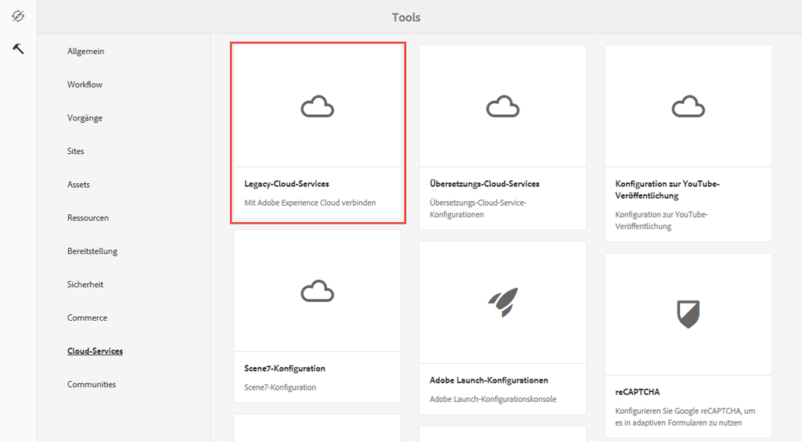
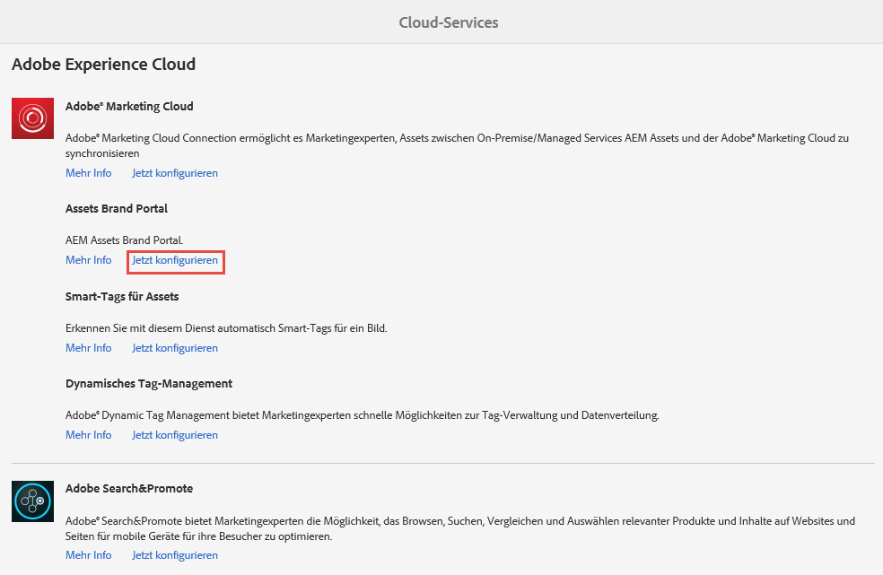
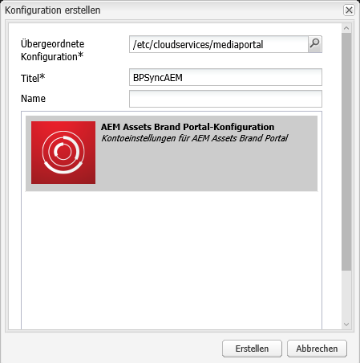
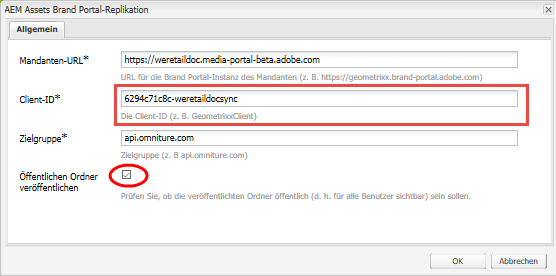
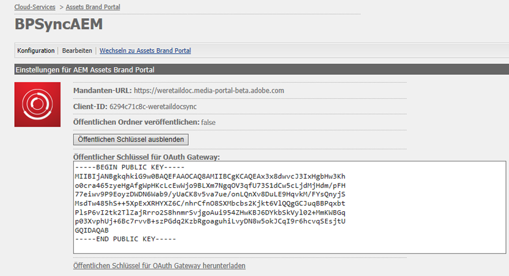
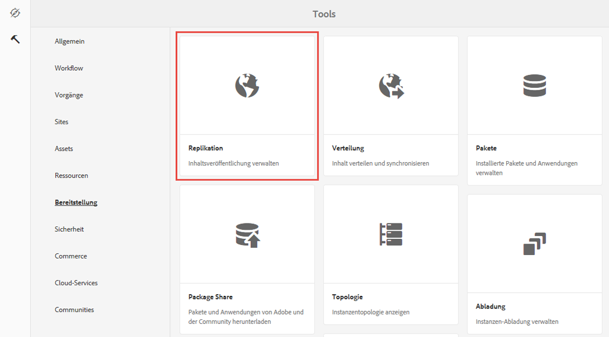
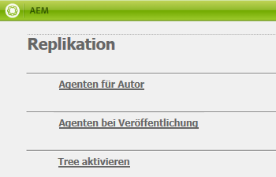
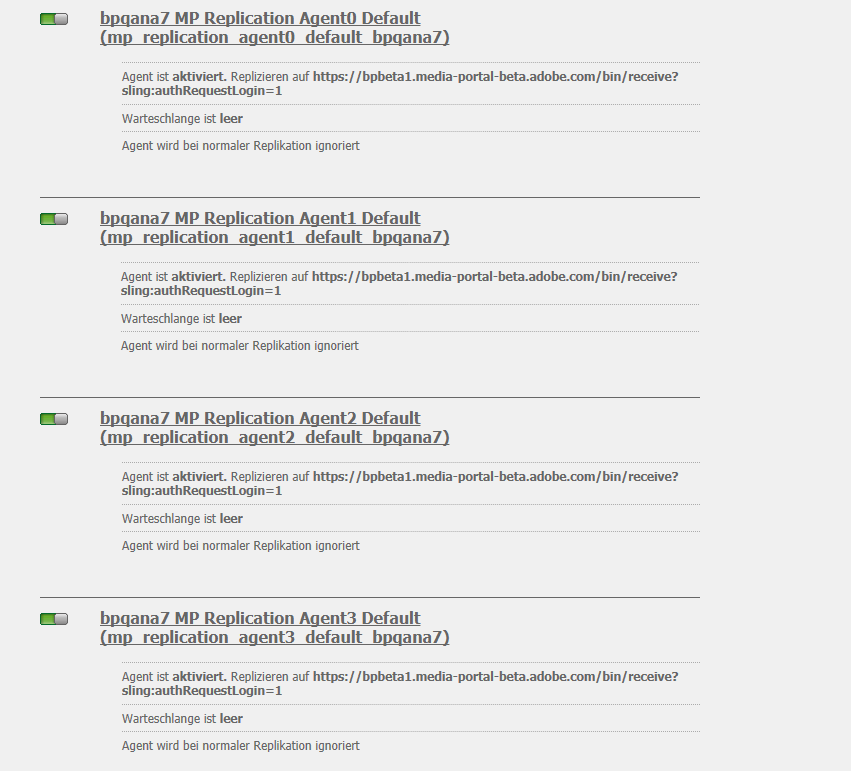

# Konfigurieren der Integration von AEM Assets mit Brand Portal {#configure-aem-assets-integration-with-brand-portal}

Erfahren Sie, wie AEM Assets mit Brand Portal integriert wird, um Assets und Sammlungen in Brand Portal zu veröffentlichen.

Wenn Sie Adobe Experience Manager (AEM) Asset Brand Portal-Kunde sind, können Sie AEM Assets in das Markenportal integrieren, um die Veröffentlichung von Assets im Markenportal zu aktivieren. Sie können diese Integration über die Adobe.io-Benutzeroberfläche einrichten.

> [!NHinweis]
>
>Adobe empfiehlt ein Upgrade auf AEM 6.4.1.0 oder höher, um sicherzustellen, dass AEM Assets Brand Portal mit AEM Assets integriert ist. Aufgrund einer Beschränkung in AEM 6.4 wird beim Konfigurieren der Integration mit Brand Portal ein Fehler ausgegeben und die Replikation scheitert.

Erstellen Sie zunächst im öffentlichen Gateway von Marketing Cloud eine Anwendung mit einem Authentifizierungsmechanismus. Als Nächstes erstellen Sie mithilfe der aus dem Gateway abgerufenen Anwendungs-ID ein Profil in Ihrer AEM Assets-Instanz.

Verwenden Sie diese Konfiguration, um Assets aus AEM Assets in Brand Portal zu veröffentlichen. Am Backend authentifiziert der AEM-Server Ihr Profil beim Gateway und integriert dann AEM Assets mit Brand Portal.

>[!NOTE]
>
>The UI for configuring oAuth integrations is hosted in [https://legacy-oauth.cloud.adobe.io/](https://legacy-oauth.cloud.adobe.io/), which was earlier hosted in [https://marketing.adobe.com/developer/](https://marketing.adobe.com/developer/).

## Erstellen von JWT-Anwendungen {#create-jwt-application}

1. Log in to [https://legacy-oauth.cloud.adobe.io/](https://legacy-oauth.cloud.adobe.io/) with your Adobe ID. Sie erreichen die Seite [!UICONTROL JWT-Anwendungen] .

   >[!NOTE]
   >
   >Sie können eine Anwendungs-ID nur erstellen, wenn Sie der Systemadministrator Ihrer Organisation sind. Mandant ist der technische Name für Ihr Unternehmen, der bei Adobe Marketing Cloud registriert ist.

2. Select **[!UICONTROL Add Application]** to create an application.
3. Geben Sie einen **[!UICONTROL Anwendungsnamen]** und eine optionale **[!UICONTROL Beschreibung]** an.
4. Wählen Sie aus der Liste **[!UICONTROL Organisation]** die Organisation aus, für die Sie die Assets synchronisieren möchten.
5. From the **[!UICONTROL Scope]** list, select **[!UICONTROL dam-read]**, **[!UICONTROL dam-sync]**, **[!UICONTROL dam-write]**, and **[!UICONTROL cc-share]**.
6. Klicken oder tippen Sie auf **[!UICONTROL Hinzufügen]**.  Daraufhin wird eine JWT-Dienstanwendung erstellt. Sie können die Anwendung bearbeiten und speichern.
7. Kopieren Sie die Anwendungs-ID, die für die neue Anwendung erstellt wird.

   >[!NOTE]
   >
   >Stellen Sie sicher, dass Sie nicht versehentlich die geheime Frage für die Anwendung statt der Anwendungs-ID kopieren.

## Erstellen neuer Cloud-Konfigurationen {#create-a-new-cloud-configuration}

1. Tippen/klicken Sie auf der Seite **[!UICONTROL Navigation]** Ihrer lokalen AEM Assets-Instanz links auf das Symbol **[!UICONTROL Tools]**.

   

2. Navigate to **[!UICONTROL Cloud Services > Legacy Cloud Services]**.

   

3. In the [!UICONTROL Cloud Services] page, locate the **[!UICONTROL Assets Brand Portal]** service under **[!UICONTROL Adobe Experience Cloud]**.

   

4. Tap/ click the **[!UICONTROL Configure now]** link below the service to display the [Create Configuration] dialog.
5. Geben Sie im Dialogfeld [!UICONTROL Konfiguration erstellen] einen Titel und einen Namen für die neue Konfiguration an und tippen/klicken Sie auf **[!UICONTROL Erstellen]**.

   

6. In the [!UICONTROL AEM Assets Brand Portal Replication] dialog, specify the URL of your organization in the [!UICONTROL Tenant URL] field.
7. Fügen Sie im Feld [!UICONTROL Client-ID] die Anwendungs-ID ein, die Sie am Ende des Vorgangs [Anwendung erstellen](#create-jwt-application) kopiert haben. Klicken Sie auf **[!UICONTROL OK]**.

   

8. To make the assets (published from AEM) publicly available to general users of Brand Portal, enable the **[!UICONTROL Public Folder Publish]** check box .

   >[!NOTE]
   >
   >Die Option **[!UICONTROL Veröffentlichung eines öffentlichen Ordners]** ist ab AEM-Version 6.3.2.1 verfügbar.

9. Tippen/klicken Sie auf der Seite [!UICONTROL Brand Portal-Konfiguration] auf **[!UICONTROL Öffentlichen Schlüssel anzeigen]**, um den für Ihre Instanz erstellten öffentlichen Schlüssel anzuzeigen.

   

   Alternatively, click **[!UICONTROL Download Public Key for OAuth Gateway]** to download the file containing the public key. Öffnen Sie dann die Datei, um den öffentlichen Schlüssel anzuzeigen.

## Aktivieren der Integration {#enable-integration}

1. Display the public key using one of the following methods mentioned in the last step of the procedure [Add a new configuration to Marketing Cloud](#create-a-new-cloud-configuration).

   * Klicken Sie auf die Schaltfläche **[!UICONTROL Öffentlichen Schlüssel anzeigen]**, um den Schlüssel anzuzeigen.
   * Öffnen Sie die heruntergeladene Datei, die den Schlüssel enthält.

2. Open the Marketing Cloud Developer Connection interface and click the application you created in [Create an application](#create-jwt-application).
3. Fügen Sie den öffentlichen Schlüssel in das Feld **[!UICONTROL Öffentlicher Schlüssel]** der Konfigurationsbenutzeroberfläche ein.
4. Tippen oder klicken Sie auf **[!UICONTROL Speichern]**. Eine Meldung bestätigt, dass die Anwendung aktualisiert wurde.

## Testen der Integration {#test-the-integration}

1. Klicken Sie in der **[!UICONTROL Navigationsseite]** Ihrer lokalen AEM Assets-Instanz links auf das Symbol **[!UICONTROL Tools]**.

   

2. Navigate to **[!UICONTROL Deployment > Replication]**.

   

3. In the [!UICONTROL Replication] page, tap/click **[!UICONTROL Agents on author]**.

   

4. Um die Verbindung zwischen AEM Author und Brand Portal zu überprüfen, öffnen Sie einen der vier Replikationsagenten und klicken Sie auf **[!UICONTROL Verbindung testen]**.

   >[!NOTE]
   >
   >Die Replizierungsagenten arbeiten parallel und teilen die Auftragsverteilung gleichmäßig, wodurch die Veröffentlichungsgeschwindigkeit um das Vierfache der Originalgeschwindigkeit steigt. Wenn der Cloud-Service konfiguriert wurde, sind keine zusätzlichen Konfigurationsschritte erforderlich, um die Replikationsagenten zu aktivieren. Sie werden standardmäßig aktiviert, um die parallele Veröffentlichung mehrerer Assets zu ermöglichen.

   >[!NOTE]
   >
   >Vermeiden Sie es, einen der Replikationsagenten zu deaktivieren, da dies dazu führen kann, dass die Replikation einiger Assets fehlschlägt.

   

5. Sehen Sie sich den unteren Bereich der Testergebnisse an, um zu prüfen, ob die Replikation erfolgreich war.

   

Nach erfolgreicher Replikation können Sie Assets, Ordner und Sammlungen im Brand Portal veröffentlichen. Weitere Details finden Sie unter:

* [Veröffentlichen von Assets und Ordnern in Brand Portal](brand-portal-publish-folder.md)
* [Veröffentlichen von Sammlungen in Brand Portal](brand-portal-publish-collection.md)

## Veröffentlichen von Assets in Brand Portal {#publish-assets-to-brand-portal}

Nach erfolgreicher Replikation können Sie Assets, Ordner und Sammlungen im Brand Portal veröffentlichen. Gehen Sie wie folgt vor, um Assets in Brand Portal zu veröffentlichen:

>[!NOTE]
>
>Adobe empfiehlt eine gestaffelte Veröffentlichung, vorzugsweise außerhalb der Spitzenzeiten, sodass die AEM-Autoreninstanz keine übermäßigen Ressourcen belegt.

1. Bewegen Sie in der Assets-Konsole den Mauszeiger auf die gewünschten Assets und wählen Sie aus den Schnellaktionen die Option **[!UICONTROL Veröffentlichen]** aus.

   Alternativ können Sie auch die Assets auswählen, die Sie in Brand Portal veröffentlichen möchten.

   

2. Um die Assets im Markenportal zu veröffentlichen, stehen zwei Optionen zur Verfügung:
   * [Assets sofort veröffentlichen](#publish-now)
   * [Assets später veröffentlichen](#publish-later)

### Assets jetzt veröffentlichen {#publish-now}

Um die ausgewählten Assets in Brand Portal zu veröffentlichen, führen Sie einen der folgenden Schritte aus:

* From the toolbar, select **[!UICONTROL Quick Publish]**. Then from the menu, select **[!UICONTROL Publish to Brand Portal]**.

* From the toolbar, select **[!UICONTROL Manage Publication]**.

   1. Then from the **[!UICONTROL Action]** select **[!UICONTROL Publish to Brand Portal]**, and from **[!UICONTROL Scheduling]** select **[!UICONTROL Now]**. Klicken oder tippen Sie auf **[!UICONTROL Weiter].**

   2. Within **[!UICONTROL Scope]**, confirm your selection and tap/ click **[!UICONTROL Publish to Brand Portal]**.

Eine Meldung erscheint, die besagt, dass die Assets zur Veröffentlichung in Brand Portal in die Warteschlange gestellt wurden. Melden Sie sich bei der Brand Portal-Benutzeroberfläche an, um die veröffentlichten Assets zu sehen.

### Assets später veröffentlichen {#publish-later}

So planen Sie die Veröffentlichung der Assets in Brand Portal zu einem späteren Zeitpunkt:

1. Once you have selected assets/ folders to publish, select **[!UICONTROL Manage Publication]** from the tool bar at the top.
2. On **[!UICONTROL Manage Publication]** page, select **[!UICONTROL Publish to Brand Portal]** from **[!UICONTROL Action]** and select **[!UICONTROL Later]** from **[!UICONTROL Scheduling]**.

   

3. Select an **[!UICONTROL Activation date]** and specify time. Klicken oder tippen Sie auf **[!UICONTROL Weiter]**.
4. Select an **[!UICONTROL Activation date]** and specify time. Klicken oder tippen Sie auf **[!UICONTROL Weiter]**.
5. Specify a Workflow title under **[!UICONTROL Workflows]**. Tap/ click **[!UICONTROL Publish Later]**.

   

Melden Sie sich jetzt beim Markenportal an, um zu sehen, ob die veröffentlichten Assets auf der Benutzeroberfläche des Markenportals verfügbar sind.

