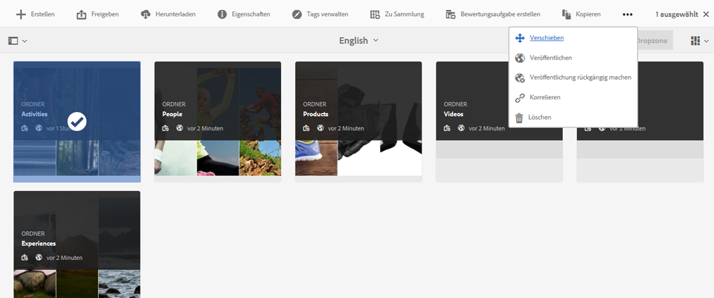
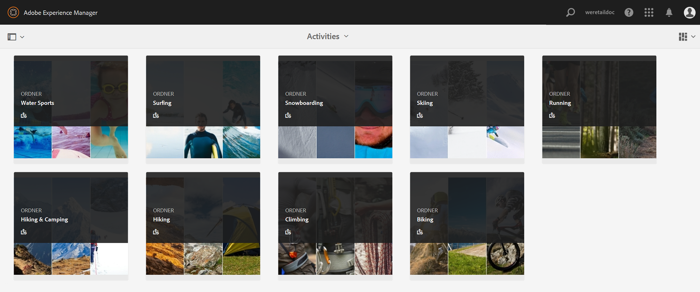

# Veröffentlichen von Assets in Brand Portal {#publish-assets-to-brand-portal}

Als Adobe Experience Manager Assets-Administrator können Sie Assets in der [!DNL Experience Manager Assets Brand Portal] Instanz (oder planen Sie den Veröffentlichungs-Workflow auf einen späteren Zeitpunkt) für Ihre Organisation. Sie müssen jedoch zunächst [!DNL Assets] mit [!DNL Brand Portal]. Weitere Informationen finden Sie unter [Konfigurieren [!DNL Assets] mit [!DNL Brand Portal]](configure-aem-assets-with-brand-portal.md).

Nachdem Sie ein Asset veröffentlicht haben, ist es für Benutzer in Brand Portal verfügbar.

Wenn Sie nachfolgende Änderungen am ursprünglichen Asset in [!DNL Assets], werden die Änderungen erst dann in Brand Portal übernommen, wenn Sie das Asset erneut veröffentlichen. Mit dieser Funktion wird sichergestellt, dass Änderungen im Rahmen der laufenden Bearbeitung nicht in Brand Portal verfügbar sind. Nur genehmigte, von einem Administrator veröffentlichte Änderungen sind in Brand Portal verfügbar.

Nach erfolgreicher Replikation können Sie Assets, Ordner und Sammlungen in [!DNL Brand Portal]. Gehen Sie wie folgt vor, um Assets in Brand Portal zu veröffentlichen:

>[!NOTE]
>
>Adobe empfiehlt eine gestaffelte Veröffentlichung, vorzugsweise außerhalb der Spitzenzeiten, sodass die [!DNL Experience Manager] Der Autor belegt keine überschüssigen Ressourcen.

1. Bewegen Sie in der Assets-Konsole den Mauszeiger auf die gewünschten Assets und wählen Sie aus den Schnellaktionen die Option **[!UICONTROL Veröffentlichen]** aus.

   Alternativ können Sie auch die Assets auswählen, die Sie in Brand Portal veröffentlichen möchten.

   

2. Um die Assets in Brand Portal zu veröffentlichen, stehen die folgenden beiden Optionen zur Verfügung:
   * [Sofortiges Veröffentlichen von Assets](#publish-now)
   * [Assets später veröffentlichen](#publish-later)

## Sofortiges Veröffentlichen von Assets {#publish-now}

Um die ausgewählten Assets in Brand Portal zu veröffentlichen, führen Sie einen der folgenden Schritte aus:

* Wählen Sie in der Symbolleiste **[!UICONTROL Quick Publish]** aus. Wählen Sie dann im Menü die Option **[!UICONTROL In Brand Portal veröffentlichen]**.

* Wählen Sie in der Symbolleiste **[!UICONTROL Veröffentlichung verwalten]** aus.

   1. Dann aus dem **[!UICONTROL Aktion]** select **[!UICONTROL In Brand Portal veröffentlichen]** und von **[!UICONTROL Planung]** select **[!UICONTROL Jetzt]**. Klicken oder tippen Sie auf **[!UICONTROL Weiter].**

   2. Within **[!UICONTROL Anwendungsbereich]**, bestätigen Sie Ihre Auswahl und tippen/klicken Sie auf **[!UICONTROL In Brand Portal veröffentlichen]**.

Eine Meldung erscheint, die besagt, dass die Assets zur Veröffentlichung in Brand Portal in die Warteschlange gestellt wurden. Melden Sie sich bei der Brand Portal-Benutzeroberfläche an, um die veröffentlichten Assets zu sehen.

## Assets später veröffentlichen {#publish-later}

So planen Sie die Veröffentlichung der Assets in Brand Portal zu einem späteren Zeitpunkt:

1. Nachdem Sie die Assets/Ordner zur Veröffentlichung ausgewählt haben, wählen Sie **[!UICONTROL Veröffentlichung verwalten]** aus der Symbolleiste am oberen Rand.
2. on **[!UICONTROL Veröffentlichung verwalten]** Seite, wählen Sie **[!UICONTROL In Brand Portal veröffentlichen]** von **[!UICONTROL Aktion]** und wählen Sie **[!UICONTROL Später]** von **[!UICONTROL Planung]**.

   

3. Wählen Sie ein **[!UICONTROL Aktivierungsdatum]** aus und geben Sie die Zeit an. Klicken oder tippen Sie auf **[!UICONTROL Weiter]**.
4. Wählen Sie ein **[!UICONTROL Aktivierungsdatum]** aus und geben Sie die Zeit an. Klicken oder tippen Sie auf **[!UICONTROL Weiter]**.
5. Geben Sie einen Workflow-Titel unter **[!UICONTROL Workflows]** an. Tippen/klicken Sie auf **[!UICONTROL Später veröffentlichen]**.

   

Melden Sie sich jetzt bei Brand Portal an, um zu sehen, ob die veröffentlichten Assets auf der Brand Portal-Benutzeroberfläche verfügbar sind.

