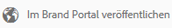
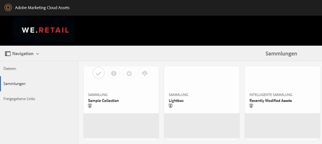
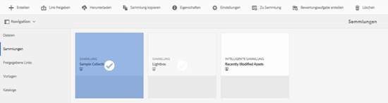
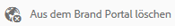

# Veröffentlichen von Sammlungen in Brand Portal {#publish-collections-to-brand-portal}

Als Adobe Experience Manager (AEM) Assets-Administrator können Sie für Ihre Organisation Sammlungen in der AEM Assets Brand Portal-Instanz veröffentlichen. Allerdings müssen Sie zunächst AEM Assets mit Brand Portal integrieren. Weitere Informationen finden Sie unter [Konfigurieren der von AEM Assets mit Brand Portal](configure-aem-assets-with-brand-portal.md).

Wenn Sie nachfolgende Änderungen an der ursprünglichen Sammlung in AEM Assets vornehmen, werden die Änderungen erst dann im Markenportal übernommen, wenn Sie die Sammlung erneut veröffentlichen. Mit dieser Eigenschaft wird sichergestellt, dass in der Arbeit befindliche Änderungen nicht im Markenportal verfügbar sind. Nur genehmigte, von einem Administrator veröffentlichte Änderungen sind in Brand Portal verfügbar.

>[!NOTE]
>
>Inhaltsfragmente können nicht in Brand Portal veröffentlicht werden. Wenn Sie also Inhaltsfragmente in AEM Author auswählen, ist die Aktion **[In Markenportal veröffentlichen]** nicht verfügbar.
>
>Wenn Sammlungen, die Inhaltsfragmente enthalten, über die AEM-Autoreninstanz in Brand Portal veröffentlicht werden, wird der gesamte Inhalt des Ordners mit Ausnahme der Inhaltsfragmente auf der Brand Portal-Oberfläche repliziert.

## Veröffentlichen einer Sammlung in Brand Portal {#publish-a-collection-to-brand-portal}

1. Tippen/klicken Sie in der Benutzeroberfläche von AEM Assets auf das AEM-Logo. Wechseln Sie dann zu **[!UICONTROL Assets > Sammlungen]** auf der Seite **[!UICONTROL Navigation]**.
2. Wählen Sie in der Konsole &quot;Sammlungen&quot;die Sammlung aus, die Sie im Markenportal veröffentlichen möchten.

   

3. Tippen/klicken Sie in der Symbolleiste auf **[!UICONTROL In Brand Portal veröffentlichen]**.

   

4. Klicken/tippen Sie im Bestätigungsdialog auf **[!UICONTROL Veröffentlichen]**.
5. Schließen Sie die Bestätigungsmeldung.
6. Melden Sie sich bei Brand Portal als Administrator an. Die veröffentlichte Sammlung steht in der Konsole „Sammlungen“ zur Verfügung.

   

## Veröffentlichung von Sammlungen rückgängig machen {#unpublish-collections}

Sie können die Veröffentlichung von Sammlungen rückgängig machen, die Sie von AEM Assets im Markenportal veröffentlichen. Nachdem Sie die Veröffentlichung der ursprünglichen Sammlung rückgängig gemacht haben, steht die Kopie nicht mehr für Markenportal-Benutzer zur Verfügung.

1. Wählen Sie über die Konsole „Sammlungen“ der AEM Assets-Instanz die Sammlung aus, deren Veröffentlichung rückgängig gemacht werden soll.

   

2. Klicken Sie in der Symbolleiste auf das Symbol **[!UICONTROL Entfernen aus dem Markenportal]**.

   

3. Klicken/tippen Sie im Dialog auf **[!UICONTROL Veröffentlichung rückgängig machen]**.
4. Schließen Sie die Bestätigungsmeldung. Die Sammlung wird aus der Brand Portal-Oberfläche entfernt.
