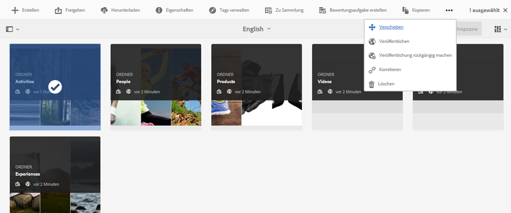
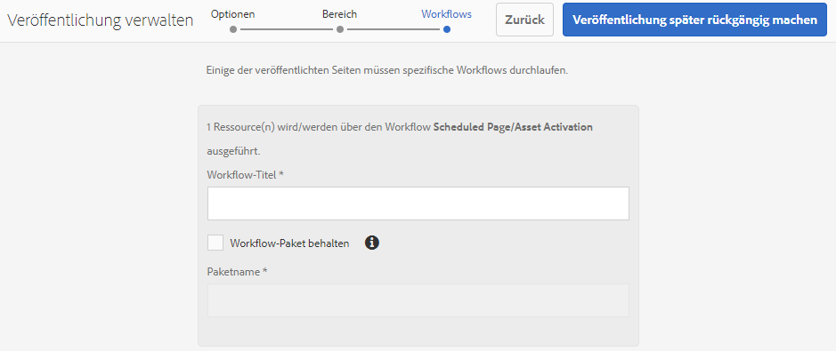
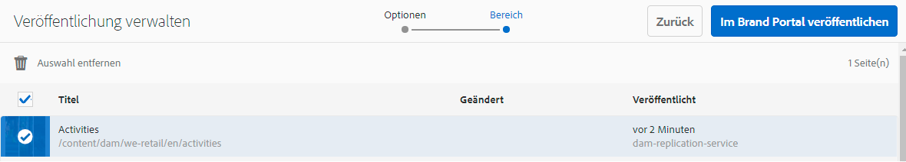
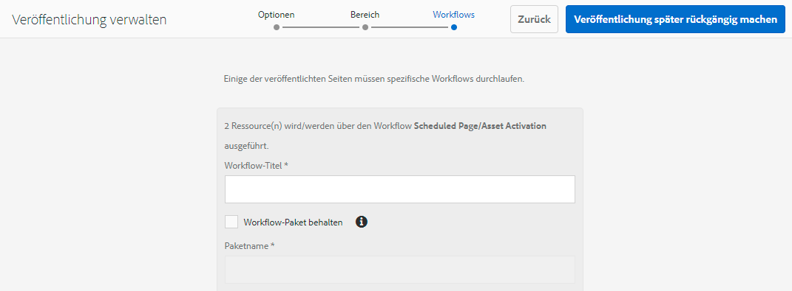

# Veröffentlichen von Ordnern in Brand Portal {#publish-folders-to-brand-portal}

Als Adobe Experience Manager Assets-Administrator können Sie Assets und Ordner in der [!DNL Experience Manager Assets Brand Portal] Instanz (oder planen Sie den Veröffentlichungs-Workflow auf einen späteren Zeitpunkt) für Ihre Organisation. Sie müssen jedoch zuerst integrieren [!DNL Experience Manager Assets] mit [!DNL Brand Portal]. Weitere Informationen finden Sie unter [Konfigurieren [!DNL Experience Manager Assets] mit Brand Portal](configure-aem-assets-with-brand-portal.md).

Nachdem Sie ein Asset oder einen Ordner veröffentlicht haben, ist es bzw. er in Brand Portal für Benutzer verfügbar.

Wenn Sie nachfolgende Änderungen am ursprünglichen Asset oder Ordner in [!DNL Assets], werden die Änderungen erst dann in Brand Portal übernommen, wenn Sie das Asset oder den Ordner erneut veröffentlichen. Mit dieser Funktion wird sichergestellt, dass Änderungen im Rahmen der laufenden Bearbeitung nicht in Brand Portal verfügbar sind. Nur genehmigte, von einem Administrator veröffentlichte Änderungen sind in Brand Portal verfügbar.

## Veröffentlichen von Ordnern in Brand Portal {#publish-folders-to-brand-portal-1}

1. Aus dem [!DNL Assets] -Benutzeroberfläche, bewegen Sie den Mauszeiger über den gewünschten Ordner und wählen Sie **[!UICONTROL Veröffentlichen]** aus den Schnellaktionen.

   Alternativ können Sie den gewünschten Ordner auswählen und den weiteren Schritten folgen.

   

2. **Ordner jetzt veröffentlichen**

   Um die ausgewählten Ordner in Brand Portal zu veröffentlichen, führen Sie einen der folgenden Schritte aus:

   * Wählen Sie in der Symbolleiste **[!UICONTROL Quick Publish]** aus. Wählen Sie dann im Menü die Option **[!UICONTROL In Brand Portal veröffentlichen]** aus.
   * Wählen Sie in der Symbolleiste **[!UICONTROL Veröffentlichung verwalten]** aus.

3. Wählen Sie dann unter **[!UICONTROL Aktion]** die Option **[!UICONTROL In Brand Portal veröffentlichen]** und unter **[!UICONTROL Zeitplan]** die Option **[!UICONTROL Jetzt]** aus. Tippen Sie auf **[!UICONTROL Weiter].**
4. Within **[!UICONTROL Anwendungsbereich]**, bestätigen Sie Ihre Auswahl und tippen Sie auf **[!UICONTROL In Brand Portal veröffentlichen]**.

   Eine Meldung erscheint, die besagt, dass der Ordner zur Veröffentlichung in Brand Portal in die Warteschlange gestellt wurde. Melden Sie sich bei der Brand Portal-Benutzeroberfläche an, um den veröffentlichten Ordner zu sehen.

   **Späteres Veröffentlichen von Ordnern**

   So planen Sie den Workflow zum Veröffentlichen von Asset-Ordnern in Brand Portal zu einem späteren Zeitpunkt:

   1. Sobald Sie die zu veröffentlichenden Assets/Ordner ausgewählt haben, wählen Sie oben in der Symbolleiste **[!UICONTROL Veröffentlichung verwalten]** aus.
   2. Wählen Sie auf der Seite **[!UICONTROL Veröffentlichung verwalten]** die Option **[!UICONTROL In Brand Portal veröffentlichen]** unter **[!UICONTROL Aktion]** und dann **[!UICONTROL Später]** unter **[!UICONTROL Zeitplan]** aus.

      

   3. Wählen Sie ein **[!UICONTROL Aktivierungsdatum]** aus und geben Sie die Zeit an. Tippen Sie auf **[!UICONTROL Weiter]**.
   4. Bestätigen Sie Ihre Auswahl unter **[!UICONTROL Umfang]**. Tippen Sie auf **[!UICONTROL Weiter]**.
   5. Geben Sie einen Workflow-Titel unter **[!UICONTROL Workflows]** an. Tippen **[!UICONTROL Später veröffentlichen]**.

      

## Veröffentlichung von Ordnern in Brand Portal rückgängig machen {#unpublish-folders-from-brand-portal}

Sie können jeden in Brand Portal veröffentlichten Asset-Ordner entfernen, indem Sie dessen Veröffentlichung in rückgängig machen. [!DNL Experience Manager] Autoreninstanz. Nachdem Sie die Veröffentlichung des ursprünglichen Ordners aufgehoben haben, ist dessen Kopie nicht mehr für Brand Portal-Benutzer verfügbar.

Sie können die Veröffentlichung der Ordner in Brand Portal sofort rückgängig machen oder diesen Vorgang für einen späteren Zeitpunkt planen. So machen Sie die Veröffentlichung von Assets/Ordnern in Brand Portal rückgängig:

1. Aus dem [!DNL Assets] -Benutzeroberfläche [!DNL Experience Manager]  Wählen Sie in der -Autoreninstanz den Ordner aus, dessen Veröffentlichung Sie rückgängig machen möchten.

   

2. Tippen/klicken Sie in der Symbolleiste auf **[!UICONTROL Veröffentlichung verwalten]**. 

3. **Veröffentlichung in Brand Portal jetzt rückgängig machen**

   So können Sie die Veröffentlichung des gewünschten Ordners in Brand Portal schnell rückgängig machen:

   1. on **[!UICONTROL Veröffentlichung verwalten]** Seite, von **[!UICONTROL Aktion]** select **[!UICONTROL Veröffentlichung in Brand Portal rückgängig machen]** und von **[!UICONTROL Planung]** select **[!UICONTROL Jetzt]**.
   2. Klicken oder tippen Sie auf **[!UICONTROL Weiter].**
   3. Within **[!UICONTROL Anwendungsbereich]**, bestätigen Sie Ihre Auswahl und tippen Sie auf **[!UICONTROL Veröffentlichung in Brand Portal rückgängig machen]**.

   

   **Späteres Rückgängigmachen der Veröffentlichung in Brand Portal**

   So können Sie die Veröffentlichung eines Ordners in Brand Portal zu einem späteren Zeitpunkt rückgängig machen:

   1. on **[!UICONTROL Veröffentlichung verwalten]** Seite, von **[!UICONTROL Aktion]** select **[!UICONTROL Veröffentlichung in Brand Portal rückgängig machen]** und von **[!UICONTROL Planung]** select **[!UICONTROL Später].**
   2. Wählen Sie ein **[!UICONTROL Aktivierungsdatum]** aus und geben Sie die Zeit an. Tippen Sie auf **[!UICONTROL Weiter]**.
   3. Within **[!UICONTROL Anwendungsbereich]**, bestätigen Sie Ihre Auswahl und tippen Sie auf **[!UICONTROL Nächste]**.
   4. Geben Sie eine **[!UICONTROL Workflow-Titel]** under **[!UICONTROL Workflows]**. Tippen **[!UICONTROL Veröffentlichung später rückgängig machen].**

      

>[!NOTE]
>
>Das Verfahren zum Veröffentlichen bzw. Aufheben der Veröffentlichung eines Assets in Brand Portal ähnelt dem entsprechenden Verfahren für einen Ordner.
