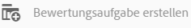
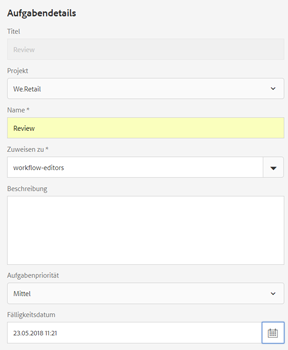
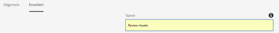
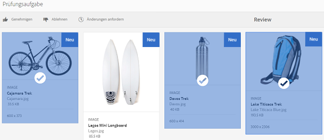
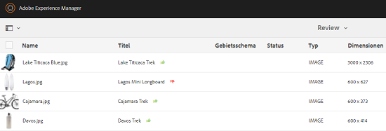
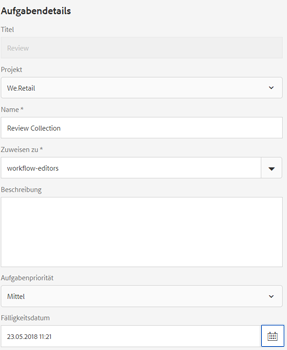
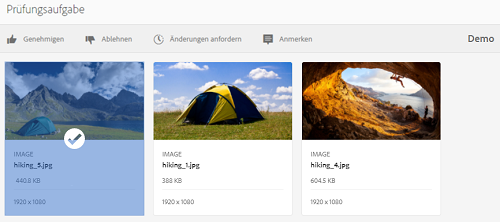
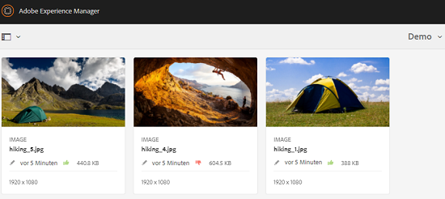
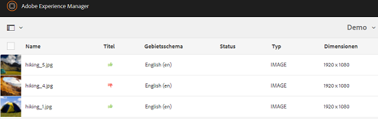

# Überprüfen von Ordner-Assets und Sammlungen {#review-folder-assets-and-collections}

>[!CAUTION]
>
>AEM 6.4 hat das Ende der erweiterten Unterstützung erreicht und diese Dokumentation wird nicht mehr aktualisiert. Weitere Informationen finden Sie in unserer [technische Unterstützung](https://helpx.adobe.com/de/support/programs/eol-matrix.html). Unterstützte Versionen suchen [here](https://experienceleague.adobe.com/docs/?lang=de).

Richten Sie Prüfungs-Workflows für Assets innerhalb eines Ordners oder einer Sammlung ein und geben Sie diese für Prüfer oder kreative Partner frei, um Feedback zu erhalten.

Mit Adobe Experience Manager Assets können Sie einen Ad-hoc-Prüfungs-Workflow für Assets in einem Ordner oder einer Sammlung einrichten und ihn für Prüfer oder kreative Partner freigeben, um Feedback einzuholen.

Sie können den Prüfungs-Workflow entweder mit einem Projekt verknüpfen oder eine unabhängige Prüfungsaufgabe erstellen.

Nachdem Sie die Assets freigegeben haben, können die Validierer sie genehmigen oder ablehnen. Benachrichtigungen werden in verschiedenen Phasen des Workflows gesendet, um die vorgesehenen Empfänger über den Abschluss verschiedener Aufgaben zu informieren. Wenn Sie beispielsweise einen Ordner oder eine Sammlung freigeben, erhält der Validierer eine Benachrichtigung, dass ein Ordner/eine Sammlung zur Überprüfung freigegeben wurde.

Nachdem der Überprüfer die Überprüfung abgeschlossen hat (Assets genehmigt oder ablehnt), erhalten Sie eine Benachrichtigung zum Abschluss der Überprüfung.

## Erstellen einer Prüfungsaufgabe für Ordner {#creating-a-review-task-for-folders}

1. Wählen Sie in der Assets-Benutzeroberfläche den Ordner aus, für den Sie eine Prüfungsaufgabe erstellen möchten.
1. Tippen/klicken Sie in der Symbolleiste auf **[!UICONTROL Prüfungsaufgabe erstellen]**, um die Seite **[!UICONTROL Prüfungsaufgabe]** zu öffnen. Wenn Sie das Symbol in der Symbolleiste nicht sehen können, tippen/klicken Sie auf **[!UICONTROL Mehr]** und wählen Sie dann das Symbol aus.

   

1. (Optional) Wählen Sie in der Liste **[!UICONTROL Projekt]** das Projekt aus, mit dem Sie die Prüfungsaufgabe verbinden möchten. Standardmäßig ist die Option **[!UICONTROL Ohne]** ausgewählt. Wenn Sie kein Projekt mit der Prüfungsaufgabe verknüpfen möchten, behalten Sie diese Auswahl bei.

   >[!NOTE]
   >
   >Nur die Projekte, für die Sie über Berechtigungen auf Editor-Ebene (oder höher) verfügen, sind in der **[!UICONTROL Projekte]** Liste.

1. Geben Sie einen Namen für die Prüfungsaufgabe ein und wählen Sie einen Genehmigenden aus der Liste **[!UICONTROL Zuweisen zu]** aus.

   >[!NOTE]
   >
   >Die Mitglieder/Gruppen des ausgewählten Projekts sind als Genehmigende in der Liste **[!UICONTROL Zuweisen zu]** verfügbar.

1. Geben Sie eine Beschreibung, die Aufgabenpriorität und das Fälligkeitsdatum für die Prüfungsaufgabe ein.

   

1. Geben Sie auf der Registerkarte „Erweitert“ eine Beschriftung ein, die zum Erstellen der URI verwendet werden soll.

   

1. Tippen/klicken Sie auf **[!UICONTROL Senden]** und dann auf **[!UICONTROL Fertig]**, um die Bestätigungsmeldung zu schließen. Eine Benachrichtigung für die neue Aufgabe wird an die genehmigende Person gesendet.
1. Anmelden bei [!DNL Experience Manager] Assets as a Approver und navigieren Sie zur Assets-Benutzeroberfläche. Um Assets zu genehmigen, klicken/tippen Sie auf das Symbol **[!UICONTROL Benachrichtigungen]** und wählen Sie die Prüfungsaufgabe aus der Liste aus.

   

1. Überprüfen Sie auf der Seite **[!UICONTROL Prüfungsaufgabe]** die Details der Prüfungsaufgabe und tippen/klicken Sie dann auf **[!UICONTROL Überprüfen]**.
1. Wählen Sie auf der Seite **[!UICONTROL Prüfungsaufgabe]** Assets aus und tippen/klicken Sie auf das Symbol **[!UICONTROL Genehmigen/Ablehnen]**, um die Assets je nach Bedarf zu genehmigen oder abzulehnen.

   

1. Tippen/klicken Sie in der Symbolleiste auf das Symbol **[!UICONTROL Fertig stellen]**. Geben Sie im Dialogfeld einen Kommentar ein und tippen/klicken Sie zur Bestätigung auf **[!UICONTROL Fertig stellen]**.
1. Navigieren Sie zur Assets-Benutzeroberfläche und öffnen Sie den Ordner. Die Symbole für den Genehmigungsstatus für die Assets werden sowohl in der Karten- als auch in der Listenansicht angezeigt.

   **Kartenansicht**

   

   **Listenansicht**

   

## Erstellen einer Prüfungsaufgabe für Sammlungen {#creating-a-review-task-for-collections}

1. Wählen Sie auf der Seite „Sammlungen“ die Sammlung aus, für die Sie eine Prüfungsaufgabe erstellen möchten.
1. Tippen/klicken Sie in der Symbolleiste auf **[!UICONTROL Prüfungsaufgabe erstellen]**, um die Seite **[!UICONTROL Prüfungsaufgabe]** zu öffnen. Wenn Sie das Symbol in der Symbolleiste nicht sehen können, tippen/klicken Sie auf **[!UICONTROL Mehr]** und wählen Sie dann das Symbol aus.

   

1. (Optional) Wählen Sie in der Liste **[!UICONTROL Projekt]** das Projekt aus, mit dem Sie die Prüfungsaufgabe verbinden möchten. Standardmäßig ist die Option **[!UICONTROL Ohne]** ausgewählt. Wenn Sie kein Projekt mit der Prüfungsaufgabe verknüpfen möchten, behalten Sie diese Auswahl bei.

   >[!NOTE]
   >
   >Nur die Projekte, für die Sie über Berechtigungen auf Editor-Ebene (oder höher) verfügen, sind in der **[!UICONTROL Projekte]** Liste.

1. Geben Sie einen Namen für die Prüfungsaufgabe ein und wählen Sie einen Genehmigenden aus der Liste **[!UICONTROL Zuweisen zu]** aus.

   >[!NOTE]
   >
   >Die Mitglieder/Gruppen des ausgewählten Projekts sind als Genehmigende in der Liste **[!UICONTROL Zuweisen zu]** verfügbar.

1. Geben Sie eine Beschreibung, die Aufgabenpriorität und das Fälligkeitsdatum für die Prüfungsaufgabe ein.

   

1. Tippen/klicken Sie auf **[!UICONTROL Senden]** und dann auf **[!UICONTROL Fertig]**, um die Bestätigungsmeldung zu schließen. Eine Benachrichtigung für die neue Aufgabe wird an die genehmigende Person gesendet.
1. Anmelden bei [!DNL Experience Manager] Assets as a Approver und navigieren Sie zur Konsole &quot;Assets&quot;. Um Assets zu genehmigen, tippen/klicken Sie auf das Symbol **[!UICONTROL Benachrichtigungen]** und wählen Sie die Prüfungsaufgabe aus der Liste aus.
1. Überprüfen Sie auf der Seite **[!UICONTROL Prüfungsaufgabe]** die Details der Prüfungsaufgabe und tippen/klicken Sie dann auf **[!UICONTROL Überprüfen]**.
1. Alle Assets in der Sammlung sind auf der Prüfungsseite sichtbar. Wählen Sie die Assets aus und tippen/klicken Sie auf das Symbol **[!UICONTROL Genehmigen/Ablehnen]**, um die Assets je nach Bedarf zu genehmigen bzw. abzulehnen.

   

1. Tippen/klicken Sie in der Symbolleiste auf das Symbol **[!UICONTROL Fertig stellen]**. Geben Sie im Dialogfeld einen Kommentar ein und tippen/klicken Sie zur Bestätigung auf **[!UICONTROL Fertig stellen]**.
1. Gehen Sie zur Konsole „Sammlungen“ und öffnen Sie die Sammlung. Die Symbole für den Genehmigungsstatus für die Assets werden sowohl in der Karten- als auch in der Listenansicht angezeigt.

   **Kartenansicht**

   

   **Listenansicht**

   
