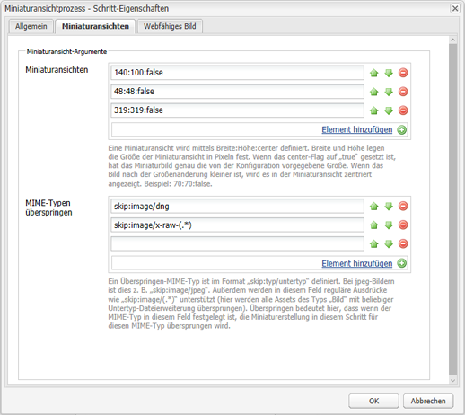
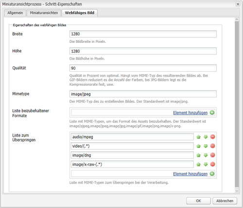
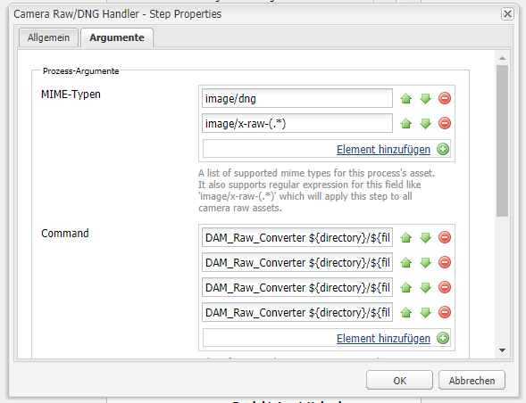
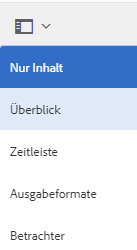
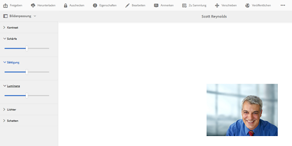

# Verwenden von Camera Raw zur Bildverarbeitung {#camera-raw-support}

Sie können die Camera Raw Unterstützung aktivieren, um Rohdateiformate wie CR2, NEF und RAF zu verarbeiten und die Bilder im JPEG-Format zu rendern. Die Funktion wird in Adobe Experience Manager Assets mit dem [Camera Raw Package](https://experience.adobe.com/#/downloads/content/software-distribution/en/aem.html?package=/content/software-distribution/en/details.html/content/dam/aem/public/adobe/packages/aem630/product/assets/aem-assets-cameraraw-pkg) über Softwareverteilung verfügbar.

>[!NOTE]
>
>Die Funktion unterstützt nur JPEG-Darstellungen. Es wird unter Windows 64 Bit, Mac OS und RHEL 7.x unterstützt.

Gehen Sie wie folgt vor, um die Camera Raw Unterstützung in Adobe Experience Manager Assets zu aktivieren:

1. Laden Sie die [Camera Raw Package](https://experience.adobe.com/#/downloads/content/software-distribution/en/aem.html?package=/content/software-distribution/en/details.html/content/dam/aem/public/adobe/packages/aem630/product/assets/aem-assets-cameraraw-pkg) über die Softwareverteilung.

1. Greife Sie auf `https://[aem_server]:[port]/workflow` zu. Öffnen Sie die **[!UICONTROL DAM-Update-Asset]** Arbeitsablauf.

1. Öffnen Sie die **[!UICONTROL Prozessminiaturansichten]** Schritt.

1. Stellen Sie die folgende Konfiguration in der **[!UICONTROL Miniaturen]** tab:

   * **[!UICONTROL Miniaturen]**: `140:100:false, 48:48:false, 319:319:false`
   * **[!UICONTROL MIME-Typen überspringen]**: `skip:image/dng, skip:image/x-raw-(.*)`

   

1. Im **[!UICONTROL Webfähiges Bild]** im **[!UICONTROL Liste überspringen]** Feld, geben Sie `audio/mpeg, video/(.*), image/dng, image/x-raw-(.*)`.

   

1. Fügen Sie im seitlichen Bedienfeld die **[!UICONTROL Camera Raw/DNG Handler]** Schritt unter dem **[!UICONTROL Erstellung von Miniaturansichten]** Schritt.

1. Im **[!UICONTROL Camera Raw/DNG Handler]** Fügen Sie im Schritt die folgende Konfiguration hinzu. **[!UICONTROL Argumente]** tab:

   * **[!UICONTROL MIME-Typen]**: `image/dng` und `image/x-raw-(.*)`
   * **[!UICONTROL Befehl]**:

      * `DAM_Raw_Converter ${directory}/${filename} ${directory} cq5dam.web.1280.1280.jpeg 1280 1280`
      * `DAM_Raw_Converter ${directory}/${filename} ${directory} cq5dam.thumbnail.319.319.jpeg 319 319`
      * `DAM_Raw_Converter ${directory}/${filename} ${directory} cq5dam.thumbnail.140.100.jpeg 140 100`
      * `DAM_Raw_Converter ${directory}/${filename} ${directory} cq5dam.thumbnail.48.48.jpeg 48 48`

   

1. Klicken Sie auf **[!UICONTROL Speichern]**.

>[!NOTE]
>
>Stellen Sie sicher, dass die oben aufgeführte Konfiguration mit der Konfiguration **** Beispiel-DAM-Update-Asset mit Schritt für Camera RAW- und DNG-Handling übereinstimmt.

Sie können jetzt Kamera-Rohdateien in [!DNL Experience Manager] Assets. Nachdem Sie das Camera Raw Paket installiert und den erforderlichen Workflow konfiguriert haben, **[!UICONTROL Bildanpassung]** in der Liste der Seitenfenster angezeigt.

*Abbildung: Optionen im Seitenbereich*

*Abbildung: Verwenden Sie die Option, um Ihre Bilder geringfügig zu bearbeiten.*

Nach Speichern der Änderungen in einem Camera Raw-Bild wird die neue Darstellung `AdjustedPreview.jpg` für das Bild erstellt. Für andere Bildtypen als Camera Raw werden die Änderungen in allen Darstellungen übernommen.

## Best Practices, bekannte Probleme und Einschränkungen {#best-practices}

Für die Funktionalität gelten folgende Einschränkungen:

* Die Funktion unterstützt nur JPEG-Darstellungen. Sie wird unter 64-Bit Windows, macOS und RHEL 7.x unterstützt.
* Metadaten-Writeback wird für RAW- und DNG-Formate nicht unterstützt.
* Für die Camera Raw-Bibliothek gelten Beschränkungen bei der gleichzeitig verarbeiteten Gesamtanzahl von Pixel. Derzeit kann es eine maximale Größe von 65000 Pixel auf der langen Seite einer Datei oder 512 MP verarbeiten, je nachdem, welches Kriterium zuerst erfüllt wird.
