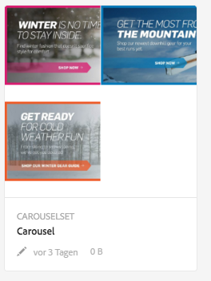
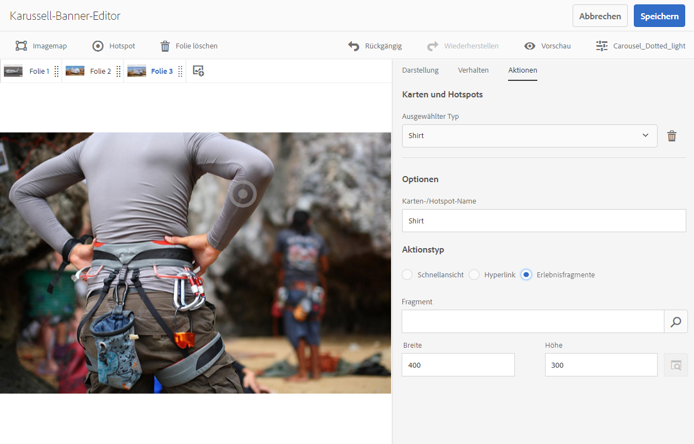
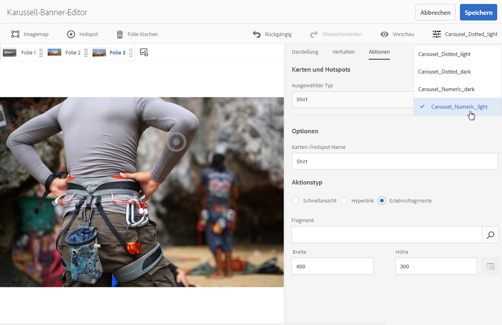

# Karussellbanner {#carousel-banners}

>[!CAUTION]
>
>AEM 6.4 hat das Ende der erweiterten Unterstützung erreicht und diese Dokumentation wird nicht mehr aktualisiert. Weitere Informationen finden Sie in unserer [technische Unterstützung](https://helpx.adobe.com/de/support/programs/eol-matrix.html). Unterstützte Versionen suchen [here](https://experienceleague.adobe.com/docs/?lang=de).

Karussellbanner ermöglichen es Marketingexperten, die Konversion zu fördern, indem sie einfach interaktive drehbare Werbeinhalte erstellen und auf jedem Bildschirm bereitstellen.

Das Erstellen und Ändern von Inhalten in Werbebannern kann zeitaufwendig sein und Ihre Fähigkeit einschränken, neue Inhalte schnell zu veröffentlichen oder zielgerichteter zu gestalten. Mit Karussellbannern können Sie sich schnell drehende Banner erstellen oder ändern, Interaktivität wie Hotspots, die mit Produktdetails oder zugehörigen Ressourcen verlinken, hinzufügen und auf jedem Bildschirm bereitstellen. So können Sie neue Werbeinhalte schneller auf den Markt bringen.

Karussellbanner sind Banner, die durch die Bezeichnung **CAROUSELSET** gekennzeichnet sind:

Auf Ihrer Website kann ein Karussellbanner wie folgt aussehen:

Hier können Sie durch die Bilder navigieren (durch Klicken auf die Zahlen). Zusätzlich drehen sich die Folien automatisch basierend auf einem Intervall, das Sie anpassen können. Bilder, die Sie im Karussellbanner hinzufügen, unterstützen sowohl Hotspots als auch Imagemaps, über die Benutzer auf einen Hyperlink tippen oder zu ihm navigieren oder auf ein Schnellansichtsfenster zugreifen können.

In diesem Beispiel hat der Benutzer auf eine Imagemap geklickt oder getippt und das Schnellansichtsfenster für Handschuhe aufgerufen:

## Video zur Erstellung von Karussellbannern {#watch-how-carousel-banners-are-created}

Sehen Sie sich eine exemplarische Vorgehensweise (10 Minuten und 33 Sekunden) zur [Erstellung von Karussellbannern](https://s7d5.scene7.com/s7viewers/html5/VideoViewer.html?videoserverurl=https://s7d5.scene7.com/is/content/&amp;emailurl=https://s7d5.scene7.com/s7/emailFriend&amp;serverUrl=https://s7d5.scene7.com/is/image/&amp;config=Scene7SharedAssets/Universal_HTML5_Video_social&amp;contenturl=https://s7d5.scene7.com/skins/&amp;asset=S7tutorials/InteractiveCarouselBanner) an. Sie erfahren außerdem, wie eine Vorschau auf Karussellbannern angezeigt wird und wie diese bearbeitet und bereitgestellt werden.

>[!NOTE]
>
>Benutzer, die keine Administratoren sind, müssen der Gruppe **dam-users** hinzugefügt werden, damit sie Karussellbanner erstellen oder bearbeiten können. Sollten Sie Schwierigkeiten beim Erstellen oder Bearbeiten haben, wenden Sie sich an Ihren Systemadministrator, der Sie zum **dam-users** hinzugefügt.

## Schnellstart: Karussellbanner {#quick-start-carousel-banners}

So schaffen Sie einen schnellen Einstieg:

1. [Ermitteln Sie Hotspot- und Imagemap-Variablen](#identifying-hotspot-and-image-map-variables) (nur für Kunden, die AEM Assets und Dynamic Media verwenden).

   Ermitteln Sie zunächst die von der vorhandenen Schnellansichtsimplementierung verwendeten dynamischen Variablen, damit Sie Hotspots und Imagemap-Daten während der Erstellung von Karussellbannern in AEM Assets korrekt eingeben können.

   >[!NOTE]
   >
   >Wenn Sie AEM Sites- oder E-Commerce-Kunde sind, können Sie die integrierte Funktion verwenden, um zu Produktseiten zu navigieren und die vorhandene SKU im Produktkatalog zu suchen. Sie müssen keine Hotspot- oder Imagemap-Variablen manuell eingeben. Weitere Informationen finden Sie unter [Einrichten von E-Commerce](/help/sites-administering/generic.md).
   >
   >Wenn Sie AEM Assets- und Dynamic Media-Kunde sind, geben Sie Daten für Hotspots und Imagemaps manuell ein und integrieren dann die veröffentlichte URL oder den Einbettungscode in Ihr Drittanbieter-Content-Management-System.

1. Optional: [Erstellen Sie eine Viewer-Vorgabe für Karussellsets](managing-viewer-presets.md) bei Bedarf.

   Wenn Sie ein Administrator sind, können Sie das Verhalten und das Erscheinungsbild des Karussells anpassen, indem Sie eine eigene Karussell-Viewer-Vorgabe erstellen. Der größte Vorteil besteht darin, dass diese benutzerdefinierte Viewer-Vorgabe für mehrere Karussells wiederverwendet werden kann. Benutzer haben jedoch auch die Möglichkeit, das Verhalten und das Erscheinungsbild des Karussells direkt bei der Erstellung anzupassen. Dies ist der bevorzugte Ansatz, wenn Sie ein spezifisches Design für ein bestimmtes Karussell wünschen.

1. [Laden Sie ein Bildbanner hoch](#uploading-image-banners).

   Laden Sie Bildbanner hoch, die interaktiv sein sollen.

1. [Erstellen Sie ein Karussellset](#creating-carousel-sets).

   In Karussellsets navigieren Benutzer durch Bannerbilder und tippen auf Hotspots oder Imagemaps, um auf relevante Inhalte zuzugreifen.

   Um ein Karussellset in Assets zu erstellen, tippen Sie auf **[!UICONTROL Erstellen]** und wählen Sie dann **[!UICONTROL Karussellsets]**. Fügen Sie den Folien dann Assets hinzu und tippen Sie auf **[!UICONTROL Speichern]**. Sie können das Erscheinungsbild und Verhalten des Karussells auch direkt im Editor bearbeiten.

1. [Fügen Sie Hotspots oder Imagemaps in einem Bildbanner hinzu.](#adding-hotspots-or-image-maps-to-an-image-banner)

   Fügen Sie einem Bildbanner mindestens einen Hotspot oder eine Imagemap hinzu und weisen Sie allen von ihnen eine Aktion wie einen Link, eine Schnellansicht oder ein Experience Fragment zu. Nachdem Sie Hotspots oder Imagemaps hinzugefügt haben, schließen Sie diese Aufgabe ab, indem Sie das Karussellset veröffentlichen. Durch das Veröffentlichen wird der Einbettungs-Code erstellt, den Sie kopieren und auf die Landingpage Ihrer Website anwenden können.

   Siehe [(Optional) Anzeigen einer Vorschau für Karussellbanner](#optional-previewing-carousel-banners) - Optional. Bei Bedarf können Sie eine Darstellung des Karussellsets anzeigen und dessen Interaktivität testen.

1. [Veröffentlichen von Karussellbannern.](#publishing-carousel-banners)

   Sie veröffentlichen ein Karussellset wie jedes andere Asset. Navigieren Sie in Assets zum Karussellset, wählen Sie es aus und tippen oder tippen Sie auf **[!UICONTROL Veröffentlichen]**. Durch Veröffentlichen eines Karussellsets wird die URL und die Einbettungszeichenfolge aktiviert.

1. Führen Sie einen der folgenden Schritte aus:

   * [Hinzufügen eines Karussellbanner zu einer Website-Seite](#adding-a-carousel-banner-to-your-website-page) Sie können die Karussellbanner-URL oder den Einbettungs-Code hinzufügen, die oder den Sie auf die Website-Seite kopiert haben.

      * [Integrieren Sie das Karussellbanner in eine Schnellansicht.](#integrating-the-carousel-banner-with-an-existing-quickview) Wenn Sie ein Drittanbieter-Web-Content-Management-System verwenden, müssen Sie das neue Karussellbanner in die vorhandene Schnellansichtsimplementierung auf Ihrer Website integrieren.
   * [Fügen Sie Ihrer Website ein Karussellbanner in AEM hinzu.](adding-dynamic-media-assets-to-pages.md) Wenn Sie AEM Sites-Kunde sind, können Sie das Karussellset direkt zur Seite in AEM hinzufügen, indem Sie die interaktive Medienkomponente verwenden.

Informationen zum Bearbeiten von Karussellsets finden Sie unter [Bearbeiten von Karussellsets](#editing-carousel-sets). Darüber hinaus können Sie [Eigenschaften von Karussellsets](/help/assets/managing-assets-touch-ui.md#editing-properties) anzeigen und bearbeiten.

## Ermitteln von Hotspot- und Imagemap-Variablen {#identifying-hotspot-and-image-map-variables}

Ermitteln Sie zunächst die dynamischen Variablen, die von der vorhandenen Schnellansichtsimplementierung verwendet werden, damit Sie Hotspots oder Imagemap-Daten beim Erstellen von Karussellsets in AEM Assets korrekt eingeben können.

Wenn Sie einem Bannerbild in AEM Assets Hotspots oder Imagemaps hinzufügen, müssen Sie jedem Hotspot oder jeder Imagemap eine SKU und optional zusätzliche Variablen zuweisen. Mithilfe dieser Variablen werden Hotspots oder Imagemaps später Schnellansichtsinhalten zugeordnet.

>[!NOTE]
>
>Wenn Sie AEM Sites- und/oder E-Commerce-AEM sind, überspringen Sie diesen Schritt. Sie müssen keine Hotspot- oder Imagemap-Variablen manuell ermitteln. Sie können die Integration mit E-Commerce für die Produktintegration verwenden. Siehe Informationen über das [Einrichten von E-Commerce](/help/sites-administering/generic.md). Darüber hinaus können Sie die interaktive Komponente verwenden und sie zu Ihrer Web-Seite hinzufügen.
>
>Wenn Sie AEM Assets- oder Media-Kunde sind, veröffentlichen Sie die URL oder den Einbettungscode und integrieren Sie ihn dann in Ihr Drittanbieter-Content-Management-System und identifizieren Sie Hotspots und Imagemaps manuell.

Es ist wichtig, die Anzahl und den Typ der Variablen, denen Hotspot- oder Imagemap-Daten zugewiesen werden sollen, korrekt zu ermitteln. Jeder Hotspot bzw. jede Imagemap, der/die einem Bannerbild hinzugefügt wird, muss genügend Informationen enthalten, um das Produkt im vorhandenen Backend-System eindeutig zu identifizieren. Gleichzeitig sollte jeder Hotspot oder jede Imagemap nicht mehr Daten enthalten, als erforderlich sind. Der Grund dafür ist, dass der Dateneingabeprozess dadurch zu komplex und die laufende Hotspot- oder Imagemap-Verwaltung fehleranfälliger würde.

Es gibt verschiedene Möglichkeiten, einen Variablensatz für Hotspot- oder Imagemap-Daten zu identifizieren.

Manchmal ist es ausreichend, IT-Experten zu konsultieren, die für die vorhandene Schnellansichtsimplementierung verantwortlich sind. Diese kennen wahrscheinlich den Mindestsatz an Daten, der zum Ermitteln der Schnellansicht im System erforderlich ist. In den meisten Fällen ist es jedoch auch möglich, einfach das vorhandene Verhalten des Frontend-Codes zu analysieren.

Die meisten Schnellansichtsimplementierungen verwenden das folgende Paradigma:

* Benutzer aktiviert ein Benutzeroberflächenelement auf der Website. Beispiel: Klicken auf eine **[!UICONTROL Schnellansicht]** Schaltfläche.
* Die Website sendet eine Ajax-Anfrage an das Backend, um bei Bedarf die Schnellansichtsdaten oder -inhalte zu laden.
* Die Schnellansichtsdaten werden in den Inhalt übersetzt, um für das Rendern auf der Web-Seite vorbereitet zu werden.
* Schließlich zeigt der Frontend-Code diesen Inhalt visuell auf dem Bildschirm an.

Dann werden unterschiedliche Bereiche der vorhandenen Website besucht, auf denen die Schnellansichtsfunktion implementiert wird, die Schnellansicht wird ausgelöst und die Ajax-URL, die durch die Web-Seite zum Laden der Schnellansichtsdaten oder -inhalte gesendet wurde, wird erfasst.

Normalerweise müssen Sie keine speziellen Debugging-Tools verwenden. Moderne Webbrowser verfügen über Web-Inspektoren, die dafür ausreichend sind. Im Folgenden finden Sie einige Beispiele für Webbrowser, die Web-Inspektoren beinhalten:

* Um alle ausgehenden HTTP-Anforderungen in Google Chrome anzuzeigen, drücken Sie F12 (Windows) oder Befehlstaste+Wahltaste+I (Mac), um den Bereich für Entwicklertools zu öffnen, und tippen Sie dann auf das Symbol **[!UICONTROL Netzwerk]** Registerkarte.
* In Firefox können Sie das Firebug-Plug-in aktivieren, indem Sie F12 (Windows) bzw. Befehlstaste + Wahltaste + I (Mac) drücken und die Registerkarte „Netz“ öffnen, oder Sie öffnen die Registerkarte „Netzwerk“ im integrierten Inspektor-Tool.

Wenn die Netzwerküberwachung im Browser aktiviert ist, lösen Sie die Schnellansicht auf der Seite aus.

Suchen Sie nun die Schnellansichts-Ajax-URL im Netzwerkprotokoll und kopieren Sie die aufgezeichnete URL für die zukünftige Analyse. In den meisten Fällen werden beim Auslösen der Schnellansicht zahlreiche Anfragen an den Server gesendet. In der Regel ist die Schnellansichts-Ajax-URL die erste URL in der Liste. Sie weist einen Teil oder Pfad mit einer komplexen Abfragezeichenfolge auf und ihr MIME-Typ lautet entweder `text/xml`, `text/html` oder `text/javascript`.

Während dieses Prozesses ist es wichtig, verschiedene Bereiche Ihrer Website mit verschiedenen Produktkategorien und -typen zu besuchen. Der Grund dafür ist, dass Schnellansichts-URLs möglicherweise Teile aufweisen, die für eine bestimmte Website-Kategorie häufig vorkommen, sich aber nur ändern, wenn Sie einen anderen Bereich der Website besuchen.

Im einfachsten Fall ist der einzige variable Teil der Schnellansichts-URL die Produkt-SKU. In diesem Fall ist der SKU-Wert der einzige Datenteil, den Sie benötigen, um dem Bannerbild Hotspots oder Imagemaps hinzuzufügen.

In komplexen Fällen hat die Schnellansichts-URL allerdings mehrere verschiedene Elemente zusätzlich zur SKU, wie Kategorie-ID, Farb-Code, Größen-Code usw. In diesen Fällen ist jedes Element eine separate Variable in der Hotspot- oder Imagemap-Datendefinition innerhalb der Karussellbanner-Funktion.

Im Folgenden finden Sie einige Beispiele für Schnellansichts-URLs und die resultierenden Hotspot- oder Imagemap-Variablen:

<table> 
 <tbody> 
  <tr> 
   <td>Einzelne SKU, befindet sich in der Abfragezeichenfolge.</td> 
   <td>
Die aufgezeichneten Schnellansichts-URLs enthalten Folgendes:
 
    <ul> 
     <li>
<code>https://server/json?productId=866558&amp;source=100</code>
 </li> 
     <li>
<code>https://server/json?productId=1196184&amp;source=100</code>
 </li> 
     <li>
<code>https://server/json?productId=1081492&amp;source=100</code>
 </li> 
     <li>
<code>https://server/json?productId=1898294&amp;source=100</code>
 </li> 
    </ul> 
Der einzige variable Teil der URL ist der Wert des Abfrageparameters <code>productId=</code> und es ist offensichtlich ein SKU-Wert. Daher müssen Sie nur die SKU-Felder der Hotspots oder Imagemaps ausfüllen mit Werten wie <code>866558,</code> <code>1196184,</code> <code>1081492,</code> <code>1898294.</code>
 </td> 
  </tr> 
  <tr> 
   <td>Einzelne SKU, befindet sich im URL-Pfad.</td> 
   <td>
Die aufgezeichneten Schnellansichts-URLs enthalten Folgendes:
 
    <ul> 
     <li>
<code>https://server/product/6422350843</code>
 </li> 
     <li>
<code>https://server/product/1607745002</code>
 </li> 
     <li>
<code>https://server/product/0086724882</code>
 </li> 
    </ul> 
Der variable Teil befindet sich im letzten Abschnitt des Pfads und wird zum SKU-Wert der Hotspots/Imagemaps:<strong><code>6422350843</code>, <code>1607745002,</code> </strong><code>0086724882.</code>
 </td> 
  </tr> 
  <tr> 
   <td>SKU und Kategorie-ID in der Abfragezeichenfolge.</td> 
   <td>
Die aufgezeichneten Schnellansichts-URLs enthalten Folgendes:
 
    <ul> 
     <li>
<code>https://server/quickView/product/?category=1100004&amp;prodId=305466</code>
 </li> 
     <li>
<code>https://server/quickView/product/?category=1100004&amp;prodId=310181</code>
 </li> 
     <li>
<code>https://server/quickView/product/?category=1740148&amp;prodId=308706</code>
 </li> 
    </ul> 
In diesem Fall liegen zwei abweichende Teile in der URL vor. Die SKU wird im Parameter <code>prodId</code> gespeichert, während die Kategorie-ID im Parameter <code>category=</code> gespeichert wird.
 
Bei den Hotspot- oder Imagemap-Definitionen selbst handelt es sich um Paare. Also einen SKU-Wert und eine zusätzliche Variable mit dem Namen <code>categoryId</code>. Die resultierenden Paare lauten wie folgt:
 
    <ul> 
     <li>
Die SKU lautet <strong><code>305466</code></strong> und <code>categoryId</code> lautet <code>1100004</code>.
 </li> 
     <li>
Die SKU lautet <strong><code>310181</code></strong> und <code>categoryId</code> lautet <strong><code>1100004</code></strong>.
 </li> 
     <li>
Die SKU lautet <strong><code>308706</code></strong> und <code>categoryId</code> lautet <strong><code>1740148</code></strong>.
 </li> 
    </ul> </td> 
  </tr> 
 </tbody> 
</table>

## Hochladen von Bildbannern {#uploading-image-banners}

Wenn Sie bereits die Bilder hochgeladen haben, die Sie verwenden möchten, fahren Sie mit dem nächsten Schritt [Erstellen von Karussellsets](#creating-carousel-sets) fort. Beachten Sie, dass die im Karussell verwendeten Bilder nach dem Aktivieren von Dynamic Media hochgeladen werden müssen.

Informationen zum Hochladen von Bildbannern finden Sie unter [Hochladen von Assets](managing-assets-touch-ui.md).

## Erstellen von Karussellsets {#creating-carousel-sets}

>[!NOTE]
>
>Benutzer, die keine Administratoren sind, müssen der Gruppe **[!UICONTROL dam-users]** hinzugefügt werden, damit sie Karussellbanner erstellen oder bearbeiten können. Sollten Sie Schwierigkeiten beim Erstellen oder Bearbeiten haben, wenden Sie sich an Ihren Systemadministrator, der Sie zum **dam-users** hinzugefügt.

**So erstellen Sie ein Karussellset**:

1. Navigieren Sie in Assets zu dem Ordner, in dem Sie das Karussellset erstellen möchten, und tippen Sie auf **[!UICONTROL Erstellen > Karussellset]**.
1. Im **[!UICONTROL Karussellbanner-Editor]** Seite, tippen Sie auf **[!UICONTROL Tippen, um den Asset-Selektor zu öffnen]** , um das Bild für die erste Folie auszuwählen.

   Im **[!UICONTROL Karussellbanner-Editor]** -Seite, führen Sie einen der folgenden Schritte aus:

   * Tippen Sie oben links auf **[!UICONTROL Folie hinzufügen]**.
   * Tippen Sie in der Mitte der Seite auf **[!UICONTROL Tippen, um die Asset-Auswahl zu öffnen]**.

   Tippen Sie zur Auswahl von Assets, die Sie in das Karussellset aufnehmen möchten. Die ausgewählten Assets sind mit einem Häkchen versehen. Wenn Sie fertig sind, tippen Sie oben rechts auf der Seite auf **[!UICONTROL Auswählen]**.

   Mit dem Asset-Selektor können Sie nach Assets suchen, indem Sie ein Keyword eingeben und auf **[!UICONTROL Eingabe]** tippen. Sie können auch Filter anwenden, um Ihre Suchergebnisse genauer abzustimmen. Sie können nach Pfad, Sammlung, Dateityp und Tag filtern. Wählen Sie den Filter und tippen Sie in der Symbolleiste auf das Symbol **[!UICONTROL Filter]**. Ändern Sie die Ansicht, indem Sie auf die **[!UICONTROL Ansicht]** Symbol und Auswahl **[!UICONTROL Spaltenansicht]**, **[!UICONTROL Kartenansicht]** oder **[!UICONTROL Listenansicht]**.

   Weitere Informationen finden Sie unter [Arbeiten mit Selektoren](working-with-selectors.md).

1. Fügen Sie weitere Folien hinzu, bis Sie alle gewünschten Bilder für das Karussellset ausgewählt haben.
1. (Optional) Führen Sie einen der folgenden Schritte aus:

   * Ziehen Sie bei Bedarf Folien, um Bilder in der Set-Liste neu anzuordnen.
   * Um ein Bild zu löschen, wählen Sie es aus und tippen Sie in der Symbolleiste auf **[!UICONTROL Folie löschen]**.
   * Um eine Vorgabe anzuwenden, tippen Sie oben rechts auf die Dropdown-Liste mit den Vorgaben. Wählen Sie anschließend eine Vorgabe aus, um sie auf das ganze Set anzuwenden.

   Um eine Folie zu löschen, tippen Sie auf die Folie und dann auf **[!UICONTROL Folie löschen]** in der Symbolleiste. Um eine Folie zu verschieben, tippen Sie auf das Symbol &quot;Neu anordnen&quot;, halten Sie die Maustaste gedrückt und bewegen Sie sie an die gewünschte Position.

1. Nachdem Sie die Bilder in den Folien hinzugefügt haben, können Sie einen Hotspot, eine Imagemap oder beides in die Bilder einfügen. Siehe [Hinzufügen von Hotspots oder Imagemaps](#adding-hotspots-or-image-maps-to-an-image-banner).
1. Sie können das visuelle Design und das Verhalten von Karussellsets ändern, indem Sie auf die Registerkarten „Verhalten“ und „Darstellung“ tippen oder klicken und Anpassungen am Aussehen des Karussellbanners oder am Verhalten bestimmter Komponenten vornehmen. Weitere Informationen zum Verwenden des Viewer-Editors finden Sie unter [Verwalten von Viewer-Vorgaben](viewer-presets.md).

   >[!NOTE]
   >
   >Bei Karussellbannern können Sie Folgendes anpassen:
   >* Dauer der Anzeige eines Bildes. Standardmäßig wird jedes Bild 9 Sekunden lang angezeigt.
   >* Animation. Standardmäßig ist jede Folienübergänge eine Überblendung. Sie können dies in eine Folienübergang ändern.
   >* Stil der Schaltflächen. Benutzer können durch die Banner drehen, indem sie auf jeden Punkt oder jede Zahl tippen. Sie können ändern, wo die Anzeigenschaltflächen angezeigt werden (und ob es sich um numerische Schaltflächen oder gepunktete Schaltflächen handelt) und wie groß sie sind.
   >* Ändern Sie den Hervorhebungsstil einer Imagemap oder des Symbols für Hotspots.
   >* Bevor Sie eine Viewer-Vorgabe bearbeiten, wählen Sie den Stil aus, auf dem die Vorgabe basieren soll. Wenn Sie diese Auswahl nicht treffen, wenn Sie mit dem Bearbeiten der Viewer-Vorgabe beginnen, werden alle Ihre Änderungen verworfen, wenn Sie eine andere Vorgabe festlegen..

   Sie können auch eine Vorschau des Karussellbanners anzeigen. Siehe [(Optional) Anzeigen einer Vorschau für Karussellbanner](#optional-previewing-carousel-banners).

1. Tippen Sie auf **[!UICONTROL Speichern]**, wenn Sie fertig sind.

## Hinzufügen von Hotspots oder Imagemaps in einem Bildbanner {#adding-hotspots-or-image-maps-to-an-image-banner}

Sie können einem Banner mithilfe des Karussellset-Editors Hotspots oder Imagemaps hinzufügen.

Wenn Sie Hotspots oder Imagemaps hinzufügen, können Sie sie als Popup-Anzeige für Schnellansichten, als Hyperlink oder als Experience Fragment definieren.

Weitere Informationen finden Sie unter [Experience Fragments](/help/sites-authoring/experience-fragments.md).

>[!NOTE]
>
>Beachten Sie, dass die Tools zur Freigabe in Social Media im Karussellbanner nicht unterstützt werden, wenn Sie den Viewer in ein Experience Fragment einbetten. Um dies zu vermeiden, können Sie Viewer-Vorgaben verwenden oder erstellen, die keine Tools zur Freigabe in Social Media aufweisen. Mit diesen Viewer-Vorgaben können Sie sie erfolgreich in Experience Fragments einbetten.

Vergessen Sie nicht, Ihre Arbeit zu speichern, wenn Sie einem Bild Hotspots oder Imagemaps hinzufügen. **[!UICONTROL Die Optionen „Rückgängig“ und „Wiederholen“ in der Nähe der oberen rechten Ecke der Seite werden während der aktuellen Erstellungs-/Bearbeitungssitzung unterstützt.]******

Wenn Sie die Erstellung des Karussellbanners abgeschlossen haben, können Sie optional **[!UICONTROL Vorschau]** um eine Darstellung anzuzeigen, wie das Karussellbanner Kunden angezeigt wird.

Siehe [(Optional) Anzeigen einer Vorschau für Karussellbanner](#optional-previewing-carousel-banners).

>[!NOTE]
>
>Wenn Sie einem Bild in einem [Interaktives Bild](interactive-images.md) Bei einem Karussellbanner werden die Hotspot-Informationen unabhängig davon, ob es sich um ein interaktives Bild oder ein Karussellbanner handelt, am selben Metadatenspeicherort gespeichert - relativ zum Speicherort des Bildes. Diese Funktion bedeutet, dass Sie dasselbe Bild zusammen mit den definierten Hotspot-Daten in beiden Viewern einfach wiederverwenden können.
>
>Beachten Sie jedoch, dass Karussellbanner Imagemaps auf Bildern unterstützen, die auch Hotspots enthalten können. Bei interaktiven Bildern wird dies dagegen nicht unterstützt. Beachten Sie dies, wenn Sie ein interaktives Bild oder ein Karussellbanner erstellen möchten, das dasselbe Bild verwendet. Sie können interaktive Bilder und Karussellbanner erstellen, indem Sie stattdessen separate Kopien desselben Bildes verwenden.

>[!NOTE]
>
>Wenn Sie interaktive Bilder mit Hotspots bearbeiten, um das Bild zu beschneiden, werden die Hotspots entfernt.

**So fügen Sie einem Bildbanner Hotspots hinzu**:

1. Gehen Sie in Assets zu dem Karussellset, das interaktiv werden soll.
1. Wählen Sie das Karussellset aus und tippen Sie auf **[!UICONTROL Bearbeiten]**.
1. Wählen Sie im Karussell-Viewer-Editor die Folie aus, die Sie interaktiv machen möchten.
1. Tippen Sie in der Nähe der linken oberen Ecke der Seite auf **[!UICONTROL Hotspot]** oder **[!UICONTROL Imagemap]**.
1. Führen Sie einen der folgenden Schritte aus:

   * Für Hotspots: Tippen Sie im Bild auf eine Stelle, an der der Hotspot angezeigt werden soll.
   * Für Imagemaps: Tippen Sie im Bild auf und ziehen Sie dann von oben links nach unten rechts, um den Imagemap-Bereich zu erstellen. Sie können die Größe der Imagemap anpassen, indem Sie die Ecken ziehen.

   Ziehen Sie den Hotspot oder die Imagemap ggf. an eine neue Position. Fügen Sie weitere Hotspots oder Imagemaps nach Bedarf hinzu.

   Um einen Hotspot oder eine Image Map zu löschen, tippen Sie auf die Registerkarte **[!UICONTROL Aktionen]**. Wählen Sie unter der Überschrift **[!UICONTROL Maps und Hotspots]** aus dem Dropdown-Menü **[!UICONTROL Ausgewählter Typ]** den Namen des Hotspots oder der Landkarte aus, den/die Sie entfernen möchten. Tippen Sie auf das **[!UICONTROL Papierkorb]**-Symbol neben dem Menü und dann auf **[!UICONTROL Löschen]**.

1. Geben Sie im Textfeld Name den Namen des Hotspots oder der Imagemap ein. Dieser Name wird auch in der Dropdown-Liste **[!UICONTROL Karten und Hotspots]** angezeigt. Wenn Sie einen Namen angeben, können Sie den Hotspot oder die Imagemap einfach erkennen, sollten Sie später Änderungen vornehmen.
1. Führen Sie einen der folgenden Schritte auf der Registerkarte **[!UICONTROL Aktion]** aus:

   * Tippen Sie auf **[!UICONTROL Schnellansicht]**.

      * Wenn Sie AEM Sites- und E-Commerce-Kunde sind, tippen Sie auf das **[!UICONTROL Produktauswahl]** Symbol (Lupe), um die **[!UICONTROL Produkt auswählen]** Seite. Tippen Sie auf das Produkt, das Sie verwenden möchten, und tippen Sie dann oben rechts auf der Seite auf das Häkchen, um zum **[!UICONTROL Karussellbanner-Editor]**.
      * Wenn Sie kein AEM Sites- oder E-Commerce-Kunde sind, gehen Sie wie folgt vor:

         * Lesen Sie [Ermitteln von Hotspot-Variablen](#identifying-hotspot-and-image-map-variables), da Sie diese Variablen ggf. definieren müssen.
         * Geben Sie anschließend manuell den SKU-Wert ein. Im **[!UICONTROL SKU-Wert]** in das Textfeld die SKU (Stock Keeping Unit, Bestandseinheit) des Produkts ein. Hierbei handelt es sich um eine eindeutige Kennung für jedes von Ihnen angebotene Produkt oder jeden von Ihnen angebotenen Dienst. Der variable Teil der Schnellansichtsvorlage wird automatisch mit dem eingegebenen SKU-Wert ausgefüllt, sodass das System den Hotspot, auf den getippt wird, mit der Schnellansicht einer bestimmten SKU verbinden kann.
         * (Optional) Wenn andere Variablen in der Schnellansicht vorhanden sind, die Sie verwenden müssen, um ein Produkt weitergehend zu identifizieren, tippen Sie auf **[!UICONTROL Generische Variable hinzufügen]**. Geben Sie im Textfeld eine zusätzliche Variable an. Beispielsweise ist `category=Mens` eine hinzugefügte Variable.
         * Weitere Informationen finden Sie unter [Arbeiten mit Selektoren](working-with-selectors.md).
   * Tippen Sie auf **[!UICONTROL Hyperlink]**.

      * Wenn Sie AEM Sites-Kunde sind, tippen Sie auf die **[!UICONTROL Site-Selektor]** Symbol (Ordner), um zu einer URL zu navigieren.

         >[!NOTE]
         >Die URL-basierte Verknüpfungsmethode ist nicht möglich, wenn Ihr interaktiver Inhalt über Links mit relativen URLs verfügt, insbesondere über Links zu Seiten in AEM Sites.

      * Wenn Sie ein eigenständiger Kunde sind, finden Sie im **[!UICONTROL HREF]** Textfeld den vollständigen URL-Pfad zu einer verknüpften Webseite angeben.

         Vergessen Sie nicht anzugeben, ob der Link auf einer neuen Browser-Registerkarte (empfohlener Standard) oder auf derselben Registerkarte geöffnet werden soll.

         Weitere Informationen finden Sie unter [Arbeiten mit Selektoren](working-with-selectors.md).
   * Tippen Sie auf **[!UICONTROL Experience Fragment]**.

      * Wenn Sie AEM Sites-Kunde sind, tippen Sie auf die **[!UICONTROL Suche]** (Lupe), um die Seite Experience Fragment zu öffnen. Tippen Sie auf das Experience Fragment, das Sie verwenden möchten, und dann auf **[!UICONTROL Auswählen]** in der rechten oberen Ecke der Seite, um zur Seite &quot;Hotspot-Verwaltung&quot;zurückzukehren.

         Weitere Informationen finden Sie unter [Experience Fragments](/help/sites-authoring/experience-fragments.md).

         **Hinweis**: Beachten Sie, dass die Tools zur Freigabe in Social Media im Karussellbanner nicht unterstützt werden, wenn Sie den Viewer in ein Experience Fragment einbetten. Um dies zu vermeiden, können Sie Viewer-Vorgaben verwenden oder erstellen, die keine Tools zur Freigabe in Social Media aufweisen. Mit diesen Viewer-Vorgaben können Sie sie erfolgreich in Experience Fragments einbetten.

      * Legen Sie die Breite und Höhe des Experience Fragment fest, so wie es im Banner angezeigt werden soll.

   

   Sie können auch eine Vorschau des Karussellbanners anzeigen. Siehe [(Optional) Anzeigen einer Vorschau für Karussellbanner](#optional-previewing-carousel-banners).

1. Tippen Sie auf **[!UICONTROL Speichern]**.
1. Veröffentlichen Sie das Karussellset. Durch das Veröffentlichen wird der Einbettungs-Code oder die URL erstellt, den/die Sie auf der Web-Seite verwenden können. Wenn Sie ein AEM Sites-Kunde sind, können Sie Ihrer Web-Seite das Karussellset direkt hinzufügen.

   Siehe [Veröffentlichen von Assets](publishing-dynamicmedia-assets.md).

   Siehe [Hinzufügen eines Karussellsets zur Landingpage Ihrer Website](#adding-a-carousel-banner-to-your-website-page).

## Bearbeiten von Karussellsets {#editing-carousel-sets}

>[!NOTE]
>
>Benutzer, die keine Administratoren sind, müssen der Gruppe **[!UICONTROL dam-users]** hinzugefügt werden, damit sie Karussellbanner erstellen oder bearbeiten können. Sollten Sie Schwierigkeiten beim Erstellen oder Bearbeiten haben, wenden Sie sich an Ihren Systemadministrator, der Sie zum **[!UICONTROL dam-users]** hinzugefügt.

Sie können mehrere Bearbeitungsaufgaben für Karussellsets ausführen, z. B.:

* einem Karussellset Folien hinzufügen. Siehe auch [Arbeiten mit Selektoren](working-with-selectors.md).
* die Anordnung der Folien im Karussellset ändern.
* Assets im Karussellset löschen
* Viewer-Vorgaben anwenden.
* das Karussellset löschen.
* Hotspots und Imagemaps hinzufügen oder bearbeiten. Siehe auch [Arbeiten mit Selektoren](working-with-selectors.md).

Wenn Sie interaktive Bilder mit Hotspots bearbeiten und das Bild beschneiden, werden die Hotspots entfernt.

**So bearbeiten Sie ein Karussellset**:

1. Führen Sie einen der folgenden Schritte aus:

   * Bewegen Sie den Mauszeiger über ein Karussellset-Asset und tippen Sie dann auf **[!UICONTROL Bearbeiten]** (Bleistiftsymbol).
   * Bewegen Sie den Mauszeiger über ein Karussellset-Asset und tippen Sie auf **[!UICONTROL Auswählen]** (Häkchensymbol) und tippen Sie dann auf **[!UICONTROL Bearbeiten]** in der Symbolleiste.
   * Tippen Sie auf ein Karussell-Asset und dann links oben auf der Seite auf **[!UICONTROL Bearbeiten]** (Bleistiftsymbol).

1. Um das Karussellset zu bearbeiten, führen Sie einen der folgenden Schritte aus:

   * Um eine Folie hinzuzufügen, tippen Sie auf **[!UICONTROL Folie hinzufügen]** und navigieren Sie dann zu dem Asset, das Sie der Folie hinzufügen möchten, und tippen Sie auf das Häkchen.
   * Um die Folien neu anzuordnen, ziehen Sie eine Folie an eine neue Position (wählen Sie das Symbol für die Neuanordnung aus, um Elemente zu verschieben).
   * Um einen Hotspot oder eine Imagemap hinzuzufügen, tippen Sie auf die Hotspot- oder Imagemap-Symbole und lesen Sie [Hinzufügen von Hotspots und Imagemaps](#adding-hotspots-or-image-maps-to-an-image-banner).
   * Um das Erscheinungsbild und das Verhalten des Karussellsets zu bearbeiten, tippen Sie auf die Registerkarte **[!UICONTROL Erscheinungsbild]** oder **[!UICONTROL Verhalten]** und legen Sie dann die gewünschten Optionen fest.
   * Um Hotspots oder Imagemaps zu bearbeiten, wählen Sie auf der entsprechenden Folie einen Hotspot oder eine Imagemap aus und nehmen Sie die erforderlichen Änderungen unter dem **[!UICONTROL Aktionen]** Registerkarte.
   * Um eine Folie zu löschen, wählen Sie sie aus und tippen Sie auf **[!UICONTROL Folie löschen]** in der Symbolleiste.
   * Um eine Vorgabe anzuwenden, tippen Sie oben rechts auf der Seite auf die Dropdownliste &quot;Vorgabe&quot;und wählen Sie dann eine Viewer-Vorgabe aus.
   * Um ein ganzes Karussellset zu löschen, navigieren Sie zum Karussellset, wählen Sie es aus und tippen Sie auf **[!UICONTROL Löschen]**.

## (Optional) Anzeigen einer Vorschau für Karussellbanner {#optional-previewing-carousel-banners}

Sie können **[!UICONTROL Vorschau]** um zu sehen, wie das Karussellbanner für Kunden aussehen wird, und um die Hotspots und Imagemaps für Karussellbanner zu testen, um sicherzustellen, dass sie sich wie erwartet verhalten.

Wenn das Karussellbanner Ihren Vorstellungen entspricht, können Sie es veröffentlichen.

* Siehe [Einbetten des Video- oder Bild-Viewers auf einer Web-Seite](embed-code.md).
* Siehe [Verknüpfen von URLs mit einer Web-Anwendung](linking-urls-to-yourwebapplication.md). Beachten Sie, dass die URL-basierte Verknüpfungsmethode nicht möglich ist, wenn Ihr interaktiver Inhalt über Links mit relativen URLs verfügt, insbesondere über Links zu Seiten in AEM Sites.
* Siehe [Hinzufügen von Dynamic Media-Assets zu Seiten](adding-dynamic-media-assets-to-pages.md).

Um eine Vorschau für ein Karussellbanner anzuzeigen, verwenden Sie entweder den Karusselleditor (bevorzugte Methode) oder die **[!UICONTROL Viewer]**-Liste.

**So erstellen Sie eine Vorschau von Karussellbannern**:

1. In **[!UICONTROL Assets]**, navigieren Sie zu einem vorhandenen Karussellbanner, das Sie erstellt haben, und tippen Sie auf , um es zu öffnen.
1. Tippen Sie auf **[!UICONTROL Bearbeiten]**.
1. Wählen Sie in der Viewer-Vorgabenliste in der rechten Ecke der Symbolleiste einen Viewer aus, um eine Vorschau des Karussellbanners anzuzeigen.

   

1. Tippen Sie auf **[!UICONTROL Vorschau]**.
1. Tippen Sie auf die Hotspots oder Imagemaps im Bild, um die verbundenen Aktionen zu prüfen.

**So zeigen Sie eine Vorschau für Karussellbanner über die Viewer-Liste an**:

1. In **[!UICONTROL Assets]**, navigieren Sie zu einem vorhandenen Karussellbanner, das Sie erstellt haben, und tippen Sie auf , um es zu öffnen.
1. In der linken oberen Ecke des **[!UICONTROL Vorschau]** Seite, tippen Sie auf **[!UICONTROL Inhalt]** Symbol.
1. Tippen Sie in der **[!UICONTROL Viewer]**-Liste im Bedienfeld links auf der Seite auf den Namen der Viewer-Vorgabe für Karussellbanner, die Sie verwenden möchten.
1. Tippen Sie auf die Hotspots oder Imagemaps im Bild, um die verbundenen Aktionen zu prüfen.

## Veröffentlichen von Karussellbannern {#publishing-carousel-banners}

Sie müssen das Karussell veröffentlichen, um es verwenden zu können. Durch Veröffentlichen eines Karussellsets werden die URL und der Einbettungs-Code aktiviert. Außerdem wird das Karussell in der Dynamic Media-Cloud veröffentlicht, die für skalierbare und leistungsfähige Bereitstellung in ein CDN integriert ist.

Wenn Sie ein vorhandenes interaktives Bild mit Hotspots für Ihr Karussellbanner verwenden, müssen Sie das interaktive Bild separat veröffentlichen, nachdem Sie das Karussellbanner veröffentlicht haben.

Wenn Sie ein bereits vorhandenes und veröffentlichtes interaktives Bild ändern, das Sie in einem Karussellbanner verwenden, müssen Sie das interaktive Bild veröffentlichen, bevor die Änderungen im Karussellbanner sichtbar werden.

Unter [Veröffentlichen von Dynamic Media-Assets](publishing-dynamicmedia-assets.md) finden sie Informationen zum Veröffentlichen von Karussellbannern.

## Hinzufügen eines Karussellbanners zu Ihrer Website {#adding-a-carousel-banner-to-your-website-page}

Nachdem Sie Bannerbilder hochgeladen haben, um ein Karussell zu erstellen, dem Banner Hotspots und/oder Imagemaps hinzugefügt und das Karussellset veröffentlicht haben, können Sie es jetzt einer vorhandenen Website hinzufügen.

Wenn Sie AEM Sites-Kunde sind, können Sie das Karussellbanner direkt Ihrer Seite hinzufügen, indem Sie die interaktive Medienkomponente auf die Seite ziehen. Siehe [Hinzufügen von Dynamic Media-Assets zu Seiten](adding-dynamic-media-assets-to-pages.md).

Wenn Sie jedoch nur AEM Assets verwenden, können Sie das Karussellbanner manuell der Landingpage Ihrer Website hinzufügen, wie im folgenden Abschnitt beschrieben.

1. Kopieren Sie den Einbettungs-Code des veröffentlichten Karussellsets.

   Siehe [Einbetten des Video- oder Bild-Viewers auf einer Web-Seite](embed-code.md).

1. Fügen Sie den Einbettungs-Code, den Sie aus AEM Assets kopiert haben, auf Ihrer Web-Seite ein.

   Der kopierte Einbettungs-Code ist responsiv und sollte sich automatisch an den Einbettungsbereich der Seite anpassen.

## Integrieren des Karussellbanners in eine Schnellansicht {#integrating-the-carousel-banner-with-an-existing-quickview}

Diese Aufgabe gilt nur, wenn Sie nur AEM Assets-Einzelkunde sind.

Der letzte Schritt in diesem Prozess ist die Integration des Karussellbanners in eine vorhandene Schnellansichtsimplementierung auf Ihrer Website. Jede Schnellansichtsimplementierung ist einzigartig. Daher ist ein spezifischer Ansatz erforderlich, wofür höchstwahrscheinlich die Unterstützung eines Frontend-IT-Mitarbeiters nötig ist.

Die vorhandene Schnellansichtsimplementierung stellt normalerweise eine Kette von untereinander verknüpften Aktionen dar, die auf der Web-Seite in der folgenden Reihenfolge stattfinden:

1. Ein Benutzer löst ein Element auf der Benutzeroberfläche Ihrer Website aus.
1. Der Frontend-Code ruft anhand des in Schritt 1 ausgelösten Benutzeroberflächenelements eine Schnellansichts-URL auf.
1. Der Frontend-Code sendet mithilfe der in Schritt 2 abgerufenen URL eine Ajax-Anfrage.
1. Die Backend-Logik gibt dem Frontend-Code die entsprechenden Schnellansichtsdaten oder -inhalte zurück.
1. Der Frontend-Code lädt die Schnellansichtsdaten oder -inhalte.
1. Optional wandelt der Frontend-Code die geladenen Schnellansichtsdaten in eine HTML-Darstellung um.
1. Der Frontend-Code zeigt ein modales Dialogfeld an und rendert den HTML-Inhalt auf dem Bildschirm für den Endbenutzer.

Diese Aufrufe stellen möglicherweise keine unabhängigen öffentlichen API-Aufrufe dar, die durch die Web-Seitenlogik in einem beliebigen Schritt aufgerufen werden können. Vielmehr handelt es sich um einen verketteten Aufruf, in dem der jeweils nächste Schritte in der letzten Phase (Callback) des vorherigen Schritts ausgeblendet ist.

Während das Karussellbanner Schritt 1 und teilweise Schritt 2 ersetzt, wenn ein Benutzer auf einen Hotspot oder eine Imagemap im Karussellbanner klickt, wird diese Benutzerinteraktion vom Viewer verarbeitet. Der Viewer gibt ein Ereignis an die Web-Seite zurück, das die gesamten Hotspot- oder Imagemap-Daten enthält, die zuvor hinzugefügt wurden.

In einem solchen Ereignis-Handler nimmt der Frontend-Code Folgendes vor:

* Listet ein Ereignis auf, das vom Karussellbanner ausgegeben wird.
* Er erstellt eine Schnellansichts-URL anhand der Hotspot- oder Imagemap-Daten.
* Er löst den Schnellansichts-Ladevorgang vom Backend aus und rendert die Schnellansicht auf dem Bildschirm, um sie anzuzeigen.

Der von AEM Assets zurückgegebene Einbettungs-Code verfügt über einen einsatzbereiten Ereignis-Handler, der auskommentiert ist.

Daher ist es nur erforderlich, die Auskommentierung des Codes aufzuheben und den Platzhalter-Handler-Text durch den Code zu ersetzen, der für die bestimmte Web-Seite spezifisch ist.

Der Prozess der Erstellung der Schnellansichts-URL ist im Wesentlichen das Gegenteil des Prozesses, der zur Identifizierung der zuvor erläuterten Hotspot- und Imagemap-Variablen verwendet wird.

Siehe [Ermitteln von Hotspot- und Imagemap-Variablen](#identifying-hotspot-and-image-map-variables).

Der letzte Schritt besteht darin, die Schnellansichts-URL auszulösen, und für das Aktivieren des Schnellansichtsbereichs ist höchstwahrscheinlich die Unterstützung eines Frontend-IT-Mitarbeiters aus Ihrer IT-Abteilung erforderlich. Er verfügt am ehesten über das entsprechende Fachwissen, um die Schnellansichtsimplementierung aus dem entsprechenden Schritt entsprechend auszulösen, um über eine einsatzbereite Schnellansichts-URL zu verfügen.

## Verwenden von Schnellansichten zum Erstellen benutzerdefinierter Popups {#using-quickviews-to-create-custom-pop-ups}

Siehe [Popups mithilfe von benutzerspezifischen Schnellansichten erstellen](custom-pop-ups.md).
