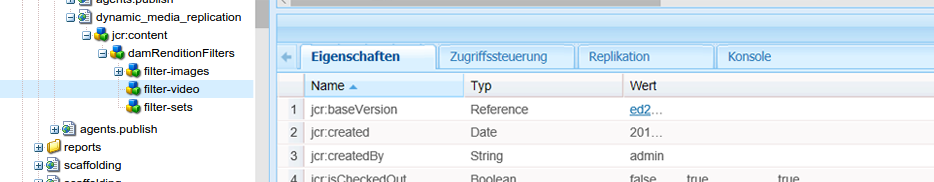
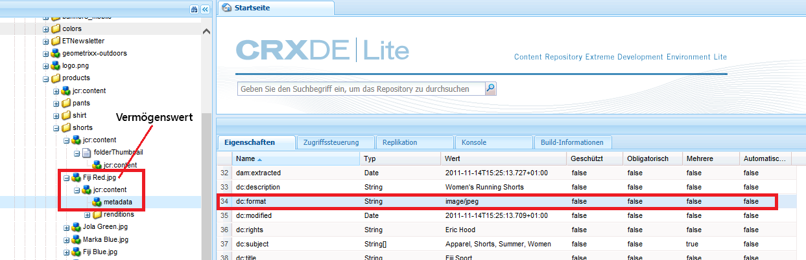

# Konfigurieren von Dynamic Media – Scene7-Modus {#configuring-dynamic-media-scene-mode}

>[!CAUTION]
>
>AEM 6.4 hat das Ende der erweiterten Unterstützung erreicht und diese Dokumentation wird nicht mehr aktualisiert. Weitere Informationen finden Sie in unserer [technische Unterstützung](https://helpx.adobe.com/de/support/programs/eol-matrix.html). Unterstützte Versionen suchen [here](https://experienceleague.adobe.com/docs/?lang=de).

Wenn Sie Adobe Experience Manager für verschiedene Umgebungen (wie Entwicklung, Staging und Live-Produktion) verwenden, müssen Sie Dynamic Media-Cloud Services für jede Umgebung konfigurieren.

## Architekturgrafik des Dynamic Media-Scene7-Modus {#architecture-diagram-of-dynamic-media-scene-mode}

Im folgenden Architekturdiagramm wird beschrieben, wie der Dynamic Media - Scene7 -Modus funktioniert.

Mit der neuen Architektur ist Experience Manager für primäre Assets und Synchronisierungen mit Dynamic Media für die Verarbeitung und Veröffentlichung von Assets verantwortlich:

1. Wenn das primäre Asset in Experience Manager hochgeladen wird, wird es in Dynamic Media repliziert. Ab diesem Punkt übernimmt Dynamic Media die gesamte Asset-Verarbeitung und die Erstellung von Ausgabedarstellungen, z. B. Videokodierung und dynamische Varianten eines Bilds.
1. Nachdem die Ausgabedarstellungen generiert wurden, kann Experience Manager sicher auf die Remote-Dynamic Media-Ausgabedarstellungen zugreifen und eine Vorschau davon anzeigen (es werden keine Binärdateien an die Experience Manager-Instanz zurückgesendet).
1. Nachdem der Inhalt bereit zur Genehmigung und Veröffentlichung ist, wird der Dynamic Media-Service ausgelöst und pusht Inhalt an Bereitstellungs-Server und Cache-Inhalt in das CDN.


## Aktivieren von Dynamic Media im Scene7-Modus {#enabling-dynamic-media-in-scene-mode}

[Dynamic Media ist standardmäßig deaktiviert. ](https://www.adobe.com/marketing-cloud/enterprise-content-management/dynamic-media.html) Funktionen für Dynamic Media müssen für die Nutzung aktiviert werden.

>[!WARNING]
>
>Der Dynamic Media-Scene7-Modus ist *nur für die Experience Manager-Autoreninstanz*. Konfigurieren Sie daher `runmode=dynamicmedia_scene7`in der Experience Manager-Autoreninstanz, *not* die Experience Manager-Veröffentlichungsinstanz.

Um Dynamic Media zu aktivieren, müssen Sie Experience Manager mit dem `dynamicmedia_scene7` Führen Sie den Ausführungsmodus über die Befehlszeile aus, indem Sie Folgendes in ein Terminal-Fenster eingeben (als Beispielanschluss wird 4502 verwendet):

```shell
java -Xms4096m -Xmx4096m -Doak.queryLimitInMemory=500000 -Doak.queryLimitReads=500000 -jar cq-quickstart-6.4.0.jar -gui -r author,dynamicmedia_scene7 -p 4502
```

## (Optional) Migration von Dynamic Media-Vorgaben und -Konfigurationen von 6.3 auf 6.4 ohne Ausfallzeit {#optional-migrating-dynamic-media-presets-and-configurations-from-to-zero-downtime}

Wenn Sie ein Upgrade von Experience Manager Dynamic Media von 6.3 auf 6.4 durchführen (wozu auch Bereitstellungen ohne Ausfallzeiten gehören), führen Sie den folgenden curl-Befehl aus, um alle Vorgaben und Konfigurationen von zu migrieren `/etc` nach `/conf` in der CRXDE Lite.

>[!NOTE]
>
>Wenn Sie Ihre Experience Manager-Instanz im Kompatibilitätsmodus ausführen - d. h., Sie haben das Kompatibilitätspaket installiert - müssen Sie diese Befehle nicht ausführen.

So migrieren Sie Ihre benutzerdefinierten Vorgaben und Konfigurationen aus `/etc` nach `/conf`, führen Sie den folgenden Linux® curl-Befehl aus:

`curl -u admin:admin http://localhost:4502/libs/settings/dam/dm/presets.migratedmcontent.json`

Bei allen Upgrades mit oder ohne Kompatibilitätspaket können Sie die standardmäßig vorhandenen Viewer-Vorgaben kopieren, indem Sie den folgenden Befehl ausführen:

`curl -u admin:admin http://localhost:4502/libs/settings/dam/dm/presets/viewer.pushviewerpresets`

## (Optional) Installieren von Feature Pack 18912 für die Massenmigration von Assets {#installing-feature-pack}

Mit dem Feature Pack 18912 können Sie Assets entweder per FTP in großen Mengen importieren oder Assets aus dem Dynamic Media-Hybridmodus oder Dynamic Media Classic in den Dynamic Media-Scene7-Modus auf Experience Manager migrieren. Es ist verfügbar unter Adobe Professional Services.

Siehe [Installieren von Feature Pack 18912 für die Massenmigration von Assets](bulk-ingest-migrate.md) für weitere Informationen.

## Konfigurieren von Dynamic Media Cloud Services {#configuring-dynamic-media-cloud-services}

Ändern Sie das Kennwort, bevor Sie Dynamic Media-Cloud Services konfigurieren. Nachdem Sie Ihre Bereitstellungs-E-Mail mit Dynamic Media-Anmeldeinformationen erhalten haben, müssen Sie [Anmelden](https://experienceleague.adobe.com/docs/dynamic-media-classic/using/intro/dynamic-media-classic-desktop-app.html?lang=de#system-requirements-dmc-app) zum Dynamic Media Classic-Desktop-Programm, um Ihr Kennwort zu ändern. Das Kennwort aus der Bereitstellungs-E-Mail wird systemseitig erstellt und ist nur als temporäres Kennwort vorgesehen. Sie müssen das Kennwort aktualisieren, damit Dynamic Media Cloud Service mit den richtigen Anmeldedaten eingerichtet wird.

>[!NOTE]
>
>Standardmäßig lautet der Konfigurationspfad für Cloud Services . `/content/dam`. Jeder andere Konfigurationspfad wird vom Dynamic Media-Scene7-Modus nicht unterstützt.

**So konfigurieren Sie Dynamic Media Cloud Services:**

1. Tippen Sie in Ihrer Experience Manager-Autoreninstanz auf das Experience Manager-Logo, um auf die globale Navigationskonsole zuzugreifen. Tippen Sie dann auf das Symbol &quot;Tools&quot;und dann auf **[!UICONTROL Cloud Services]** > **[!UICONTROL Dynamic Media-Konfiguration]**.
1. Tippen Sie auf der Seite &quot;Dynamic Media Configuration Browser&quot;im linken Bereich auf **[!UICONTROL global]** und tippen **[!UICONTROL Erstellen]**. Tippen oder wählen Sie nicht das Ordnersymbol links neben [!UICONTROL global].
1. Im [!UICONTROL Dynamic Media-Konfiguration erstellen] -Seite, geben Sie einen Titel, die E-Mail-Adresse des Dynamic Media-Kontos und ein Kennwort ein. Wählen Sie Ihre Region aus. Diese Informationen erhalten Sie nach Adobe in Ihrer Bereitstellungs-E-Mail. Wenden Sie sich an den Kunden-Support von Adobe, falls Sie diese E-Mail nicht erhalten haben.

   Tippen **[!UICONTROL Verbindung zu Dynamic Media herstellen]**.

   >[!NOTE]
   >
   >Nachdem Sie Ihre Bereitstellungs-E-Mail mit Dynamic Media-Anmeldeinformationen erhalten haben, öffnen Sie die [Dynamic Media Classic-Desktop-Applikation](https://experienceleague.adobe.com/docs/dynamic-media-classic/using/getting-started/signing-out.html?lang=de#getting-started)und melden Sie sich dann bei Ihrem Unternehmenskonto an, um Ihr Kennwort zu ändern. Das Kennwort aus der Bereitstellungs-E-Mail wird systemseitig erstellt und ist nur als temporäres Kennwort vorgesehen. Sie müssen das Kennwort aktualisieren, damit der Dynamic Media-Cloud Service mit den richtigen Anmeldeinformationen eingerichtet wird.

1. Wenn die Verbindung erfolgreich hergestellt wurde, können Sie auch Folgendes festlegen:

   * **[!UICONTROL Unternehmen]**: der Name des Dynamic Media-Kontos.

      >[!IMPORTANT]
      >
      >In einer Instanz von Experience Manager wird nur eine Dynamic Media-Konfiguration in Cloud Services unterstützt. Fügen Sie nicht mehr als eine Konfiguration hinzu. Mehrere Dynamic Media-Konfigurationen auf einer Experience Manager-Instanz werden *nicht* unterstützt oder von Adobe empfohlen.<!-- CQDOC-19579 and CQDOC-19612 -->
   * **[!UICONTROL Firmen-Stammordnerpfad]** - Pfad des Stammordners Ihres Unternehmens.
   * **[!UICONTROL Veröffentlichen von Assets]** - die Option **[!UICONTROL Sofort]** bedeutet, dass das System beim Hochladen von Assets die Assets aufnimmt und die URL/Einbettung sofort bereitstellt. Zum Veröffentlichen von Assets ist kein Benutzereingriff erforderlich. Die Option **[!UICONTROL Bei Aktivierung]** bedeutet, dass Sie das Asset zuerst explizit veröffentlichen müssen, bevor eine URL/ein Link zur Einbettung bereitgestellt wird.
   * **[!UICONTROL Sicherer Vorschau-Server]** – bietet Ihnen die Möglichkeit, den URL-Pfad zu Ihrem Vorschau-Server für sichere Ausgaben anzugeben. Nachdem die Ausgabedarstellungen generiert wurden, kann Experience Manager sicher auf die Remote-Dynamic Media-Ausgabedarstellungen zugreifen und eine Vorschau davon anzeigen (es werden keine Binärdateien an die Experience Manager-Instanz zurückgesendet).

      Sofern Sie keine gesonderte Vereinbarung zum Verwenden des eigenen Unternehmensservers oder eines speziellen Servers getroffen haben, empfiehlt Adobe die Verwendung der Standardeinstellung.
   >[!NOTE]
   >
   >Die Versionierung in DMS7 wird nicht unterstützt. Eine verzögerte Aktivierung gilt nur, wenn auf der Seite „Konfiguration von Dynamic Media bearbeiten“ die Option **[!UICONTROL Assets veröffentlichen]** auf **[!UICONTROL Bei Aktivierung]** eingestellt ist, und erst dann, wenn das Asset zum ersten Mal aktiviert wird.
   >
   >Wenn ein Asset aktiviert wurde, werden alle Aktualisierungen automatisch live in der S7-Bereitstellung übernommen.

   

1. Tippen Sie auf **[!UICONTROL Speichern]**.
1. Um eine sichere Vorschau von Dynamic Media-Inhalten zu erhalten, bevor sie veröffentlicht werden, müssen Sie die Experience Manager-Autoreninstanz &quot;neu&quot;auf die Zulassungsliste gesetzt haben, um eine Verbindung mit Dynamic Media herzustellen:

   * Öffnen Sie das [Dynamic Media Classic-Desktop-Programm](https://experienceleague.adobe.com/docs/dynamic-media-classic/using/getting-started/signing-out.html?lang=de#getting-started) und melden Sie sich bei Ihrem Konto an. Ihre Benutzer- und Anmeldedaten haben Sie zum Zeitpunkt der Bereitstellung von Adobe erhalten. Wenn Ihnen die Informationen nicht vorliegen, wenden Sie sich an den technischen Support.
   * Tippen Sie in der Navigationsleiste oben rechts auf der Seite auf **[!UICONTROL Einrichtung]** > **[!UICONTROL Anwendungseinstellungen]** > **[!UICONTROL Veröffentlichungseinstellungen]** > **[!UICONTROL Image-Server]**.
   * Wählen Sie auf der Seite „Veröffentlichung zum Image-Server“ in der Dropdown-Liste „Veröffentlichungskontext“ die Option **[!UICONTROL Image-Serving testen]**.
   * Tippen Sie für den Client-Adressfilter auf **[!UICONTROL Hinzufügen]**.
   * Aktivieren Sie das Kontrollkästchen, um die Adresse zu aktivieren. Geben Sie die IP-Adresse der Experience Manager-Autoreninstanz (nicht die Dispatcher-IP) ein.
   * Tippen Sie auf **[!UICONTROL Speichern]**.

Sie haben nun die Grundkonfiguration abgeschlossen und können Dynamic Media im Scene7-Modus verwenden.

Wenn Sie Ihre Konfiguration weiter anpassen möchten, können Sie optional eine der Aufgaben unter [(Optional) Konfigurieren der erweiterten Einstellungen im Modus Dynamic Media - Scene7](#optional-configuring-advanced-settings-in-dynamic-media-scene-mode).

## (Optional) Konfigurieren der erweiterten Einstellungen im Modus Dynamic Media - Scene7 {#optional-configuring-advanced-settings-in-dynamic-media-scene-mode}

Wenn Sie die Konfiguration weiter anpassen und Dynamic Media – Scene7-Modus einrichten oder die Leistung optimieren möchten, können Sie eine oder mehrere der folgenden optionalen Aufgaben durchführen:

* [(Optional) Einrichtung und Konfiguration der Einstellungen des Dynamic Media-Scene7-Modus](#optional-setup-and-configuration-of-dynamic-media-scene-mode-settings-p)

* [(Optional) Steigern der Leistung von Dynamic Media im Scene7-Modus](#optional-tuning-the-performance-of-dynamic-media-scene-mode)
* [(Optional) Filtern von Assets für die Replikation](#optional-filtering-assets-for-replication)

### (Optional) Einrichtung und Konfiguration der Einstellungen des Dynamic Media-Scene7-Modus</p> {#optional-setup-and-configuration-of-dynamic-media-scene-mode-settings-p}

Wenn Sie **dynamicmedia_scene7** -Ausführungsmodus verwenden Sie die Dynamic Media Classic-Benutzeroberfläche, um Ihre Dynamic Media-Einstellungen zu ändern.

Bei einigen der oben genannten Aufgaben müssen Sie das [Dynamic Media Classic-Desktop-Programm](https://experienceleague.adobe.com/docs/dynamic-media-classic/using/getting-started/signing-out.html?lang=de#getting-started) öffnen und sich dann bei Ihrem Konto anmelden.

Einrichtungs- und Konfigurationsaufgaben sind:

* [Veröffentlichungseinrichtung für Bild-Server](#publishing-setup-for-image-server)
* [Konfigurieren der allgemeinen Programmeinstellungen](#configuring-application-general-settings)
* [Konfigurieren des Farb-Managements](#configuring-color-management)
* [Bearbeiten von MIME-Typen für unterstützte Formate](#editing-mime-types-for-supported-formats)
* [Hinzufügen von MIME-Typen für nicht unterstützte Formate](#adding-mime-types-for-unsupported-formats)
* [Erstellen von Stapelsatzvorgaben zum automatischen Erzeugen von Bild- und Rotationssets](#creating-batch-set-presets-to-auto-generate-image-sets-and-spin-sets)

#### Veröffentlichungseinrichtung für Bild-Server {#publishing-setup-for-image-server}

Mit den Veröffentlichungseinstellungen wird festgelegt, wie Assets standardmäßig von Dynamic Media bereitgestellt werden. Wenn keine Einstellung festgelegt wird, stellt Dynamic Media ein Asset gemäß den Standardeinstellungen unter „Veröffentlichungseinstellungen“ bereit. Beispiel: Bei der Anfrage, ein Bild bereitzustellen, das kein Auflösungsattribut enthält, wird ein Bild mit der Einstellung „Standardobjektauflösung“ bereitgestellt.

So konfigurieren Sie die Veröffentlichungseinstellungen: Tippen Sie in Dynamic Media Classic auf **[!UICONTROL Einrichtung]** > **[!UICONTROL Anwendungseinstellungen]** > **[!UICONTROL Veröffentlichungseinstellungen]** > **[!UICONTROL Image-Server]**.

Auf dem Bildschirm „Image-Server“ werden Standardeinstellungen für das Bereitstellen von Bildern festgelegt. In der Benutzeroberfläche finden Sie eine Beschreibung der einzelnen Einstellungen.

* **[!UICONTROL Anfrage-Attribute]**: Mit diesen Einstellungen werden Einschränkungen für die Bilder festgelegt, die über den Server bereitgestellt werden können.
* **[!UICONTROL Standardattribute für Anfragen]**: Diese Einstellungen beziehen sich auf die standardmäßige Darstellung von Bildern.
* **[!UICONTROL Allgemeine Attribute für Miniaturen]**: Diese Einstellungen beziehen sich auf die standardmäßige Darstellung von Miniaturbildern.
* **[!UICONTROL Standardeinstellungen für Katalogfelder]**: Diese Einstellungen beziehen sich auf die Auflösung und den Standardtyp für Miniaturen von Bildern.
* **[!UICONTROL Farbverwaltungsattribute]**: Mit diesen Einstellungen wird festgelegt, welche ICC-Farbprofile verwendet werden.
* **[!UICONTROL Kompatibilitätsattribute]**: Diese Einstellung ermöglicht die Behandlung von Anfangs- und Endabsätzen in Textebenen wie in Version 3.6, um die Abwärtskompatibilität zu gewährleisten.
* **[!UICONTROL Lokalisierungsunterstützung]**: Mit diesen Einstellungen können mehrere Gebietsschemaattribute verwaltet werden. Außerdem kann damit eine Zeichenfolge der Gebietsschemakarte angegeben werden, damit Sie festlegen können, welche Sprachen für die verschiedenen QuickInfos in Viewern unterstützt werden sollen. Weitere Informationen zur Einrichtung der Lokalisierungsunterstützung finden Sie unter [Wichtige Überlegungen bei der Implementierung der Lokalisierungsunterstützung](https://experienceleague.adobe.com/docs/dynamic-media-classic/using/setup/publish-setup.html#image-server).

#### Konfigurieren der allgemeinen Programmeinstellungen {#configuring-application-general-settings}

So öffnen Sie die [!UICONTROL Allgemeine Programmeinstellungen] Seite, tippen Sie in der globalen Navigationsleiste von Dynamic Media Classic auf **[!UICONTROL Einrichtung]** > **[!UICONTROL Anwendungseinstellungen]** > **[!UICONTROL Allgemeine Einstellungen]**.

**[!UICONTROL Server]**: Bei der Kontobereitstellung stellt Dynamic Media automatisch die zugeordneten Server für Ihr Unternehmen bereit. Diese Server werden verwendet, um URL-Zeichenfolgen für Ihre Website und Programme zu erstellen. Diese URL-Aufrufe gelten spezifisch für Ihr Konto. Ändern Sie keinen der Servernamen, es sei denn, dies wird vom Experience Manager-Support ausdrücklich angewiesen.

**[!UICONTROL Bilder überschreiben]**: Dynamic Media lässt zwei Dateien mit denselben Namen nicht zu. Die URL-ID (Dateiname ohne Erweiterung) eines Elements muss jeweils eindeutig sein. Diese Optionen legen fest, wie Ersatz-Assets hochgeladen werden, d. h. ob sie das Original ersetzen oder doppelt vorhanden sind. Duplizierte Assets werden durch Anhängen von „-1“ umbenannt („chair.tif“ wird beispielsweise zu „chair-1.tif“). Diese Optionen gelten für Assets, die in einen anderen Ordner als das Original hochgeladen werden, oder Assets mit einer anderen Dateinamenerweiterung als das Original (z. B. JPG, TIF oder PNG).

* **[!UICONTROL Im aktuellen Ordner Bilder mit demselben Namen und derselben Erweiterung überschreiben]**: Diese Option stellt die strengste Ersetzungsregel dar. Das Ersatzbild muss in den Ordner des Originalbilds hochgeladen werden und dieselbe Dateierweiterung haben wie das Originalbild. Wenn diese Anforderungen nicht erfüllt sind, wird ein Duplikat erstellt.

>[!NOTE]
>
>Um die Konsistenz mit dem Experience Manager sicherzustellen, wählen Sie **[!UICONTROL Im aktuellen Ordner Bilder mit demselben Namen und derselben Erweiterung überschreiben]**.

* **[!UICONTROL In belieb. Ordner Assets mit ident. Namen/Erweiterung überschreiben]** - Erfordert, dass das Ersatzbild dieselbe Dateierweiterung wie das Originalbild hat (z. B. `chair.jpg` ersetzt `chair.jpg` und nicht `chair.tif`). Sie können das Ersatzbild jedoch in einen anderen Ordner hochladen als den, in dem sich das Original befindet. Das hochgeladene Bild bleibt dann im neuen Ordner; die Datei befindet sich also nicht mehr am ursprünglichen Speicherort..
* **[!UICONTROL In belieb. Ordner Assets mit ident. Namen unabh. von Erweit. überschreiben]**: Diese Option stellt die am wenigsten einschränkende Ersetzungsregel dar. Sie können ein Ersatzbild in einen anderen Ordner hochladen als den, in dem sich das Originalbild befindet, und eine Datei mit einer anderen Dateierweiterung verwenden, um die Originaldatei zu ersetzen. Wenn sich die Originaldatei in einem anderen Ordner befindet, bleibt das Ersatzbild in dem neuen Ordner, in den es hochgeladen wurde.

**[!UICONTROL Standardfarbprofile]**: Zusätzliche Informationen finden Sie unter [Konfigurieren des Farb-Managements](#configuring-color-management).

>[!NOTE]
>
>Standardmäßig zeigt das System 15 Ausgabedarstellungen an, wenn Sie **[!UICONTROL Ausgabedarstellungen]** auswählen, und 15 Viewer-Voreinstellungen, wenn Sie in der Detailansicht des Assets **[!UICONTROL Viewer]** auswählen. Sie können diese Grenze erhöhen. Siehe [Erhöhen der Anzahl angezeigter Bildvorgaben](managing-image-presets.md#increasing-or-decreasing-the-number-of-image-presets-that-display) oder [Erhöhen der Anzahl angezeigter Viewer-Vorgaben](managing-viewer-presets.md#increasing-the-number-of-viewer-presets-that-display).

#### Konfigurieren des Farb-Managements {#configuring-color-management}

Beim Farb-Management für Dynamic Media können Sie die Farben von Assets korrigieren. Bei der Farbkorrektur behalten übernommene Assets ihren Farbraum (RGB, CMYK, Grau) und das eingebettete Farbprofil bei. Wenn Sie eine dynamische Ausgabedarstellung anfordern, wird die Bildfarbe gemäß dem Zielfarbraum korrigiert, indem eine CMYK-, RGB- oder Grau-Ausgabe verwendet wird. Siehe [Konfigurieren von Bildvorgaben](managing-image-presets.md).

**So konfigurieren Sie die Standardfarbeigenschaften, damit die Farbkorrektur beim Anfordern von Bildern aktiviert ist:**

1. Öffnen Sie das [Dynamic Media Classic-Desktop-Programm](https://experienceleague.adobe.com/docs/dynamic-media-classic/using/getting-started/signing-out.html?lang=de#getting-started) und melden Sie sich mit den Anmeldedaten, die Sie zum Zeitpunkt der Bereitstellung erhalten haben, bei Ihrem Konto an. Navigieren Sie zu **[!UICONTROL Einrichtung]** > **[!UICONTROL Anwendungseinstellungen]**.
1. Erweitern Sie den Bereich **[!UICONTROL Veröffentlichungseinstellungen]** und wählen Sie **[!UICONTROL Image-Server]**. Legen Sie **[!UICONTROL Veröffentlichungskontext]** beim Festlegen von Standardwerten für Veröffentlichungsinstanzen auf **[!UICONTROL Image Serving]** fest.
1. Scrollen Sie zu der Eigenschaft, die Sie ändern müssen. Beispiel: eine Eigenschaft im **[!UICONTROL Farbverwaltungsattribute]** Bereich.

   Sie können die folgenden Farbkorrektureigenschaften festlegen:

   * [!UICONTROL CMYK-Standardfarbraum]: Name des standardmäßigen CMYK-Farbprofils
   * [!UICONTROL Graustufen-Standardfarbraum]: Name des standardmäßigen Grau-Farbprofils
   * [!UICONTROL RGB-Standardfarbraum]: Name des standardmäßigen RGB-Farbprofils
   * [!UICONTROL Rendering Intent für Farbumwandlung]: Gibt die Render-Priorität an. Die zulässigen Werte sind `perceptual`, `relative` `colometric`, `saturation`und `absolute colometric`. Adobe empfiehlt `relative` als Standard.

1. Tippen Sie auf **[!UICONTROL Speichern]**.

So können Sie beispielsweise den **[!UICONTROL RGB-Standardfarbraum]** auf `sRGB` und den **[!UICONTROL CMYK-Standardfarbraum]** auf `WebCoated` festlegen.

Dies hat folgende Auswirkungen:

* Die Farbkorrektur für RGB- und CMYK-Bilder wird aktiviert.
* Für RGB-Bilder ohne Farbprofil wird angenommen, dass sie sich im Farbraum `sRGB` befinden.
* Für CMYK-Bilder ohne Farbprofil wird angenommen, dass sie sich im Farbraum `WebCoated` befinden.
* Dynamische Ausgabedarstellungen, die eine RGB-Ausgabe zurückgeben, geben sie im `sRGB` Farbraum.
* Dynamische Ausgabeformate, die eine CMYK-Ausgabe zurückgeben, geben sie im `WebCoated` Farbraum.

#### Bearbeiten von MIME-Typen für unterstützte Formate {#editing-mime-types-for-supported-formats}

Sie können festlegen, welche Asset-Typen von Dynamic Media verarbeitet werden, und erweiterte Asset-Verarbeitungsparameter anpassen. Beispielsweise können Sie Asset-Verarbeitungsparameter für folgende Aktionen festlegen:

* Konvertieren eines Adobe PDF-Dokuments in ein E-Katalog-Asset
* Konvertieren eines Adobe Photoshop-Dokuments (.PSD) in ein Bannervorlagen-Asset für Personalisierung
* Rastern einer Adobe Illustrator- (.AI) oder Adobe Photoshop Encapsulated PostScript®-Datei (.EPS)
* [Videoprofile](/help/assets/video-profiles.md) und [Bilddarstellungsprofile](/help/assets/image-profiles.md) können jeweils zum Definieren der Verarbeitung von Videos und Bildern verwendet werden.

Informationen hierzu finden Sie unter [Hochladen von Assets](managing-assets-touch-ui.md#uploading-assets).

**So bearbeiten Sie MIME-Typen für unterstützte Formate:**

1. Tippen Sie in Experience Manager auf das Experience Manager-Logo, um auf die globale Navigationskonsole zuzugreifen, und tippen Sie dann auf die **[!UICONTROL Instrumente]** (Hammer) und navigieren Sie zu **[!UICONTROL Allgemein]** > **[!UICONTROL CRXDE Lite]**.
1. Navigieren Sie in der linken Leiste zu:

   `/conf/global/settings/cloudconfigs/dmscene7/jcr:content/mimeTypes`

   

1. Unter dem `mimeTypes` Ordner, wählen Sie einen MIME-Typ aus.
1. Im rechten unteren Bereich der Seite „CRXDE Lite“:

   * Doppelklicken Sie auf das Feld **[!UICONTROL Aktiviert]**. Alle Asset-MIME-Typen sind standardmäßig aktiviert (auf **[!UICONTROL true]** festgelegt). Dies bedeutet, dass die Assets zur Verarbeitung mit Dynamic Media synchronisiert werden. Wenn Sie diesen Asset-MIME-Typ von der Verarbeitung ausschließen möchten, ändern Sie diese Einstellung in **[!UICONTROL false]**.
   * Doppelklicken Sie auf **[!UICONTROL jobParam]**, um das zugehörige Textfeld zu öffnen. Unter [Unterstützte MIME-Typen](assets-formats.md#supported-mime-types) finden Sie eine Liste mit zulässigen Werten für Verarbeitungsparameter, die Sie für einen bestimmten MIME-Typ verwenden können.

1. Führen Sie einen der folgenden Schritte aus:

   * Wiederholen Sie die Schritte 3 bis 4, um weitere MIME-Typen zu bearbeiten.
   * Tippen Sie in der Menüleiste der Seite &quot;CRXDE Lite&quot;auf **[!UICONTROL Alle speichern]**.

1. Tippen Sie oben links auf der Seite auf **[!UICONTROL CRXDE Lite]** , um zum Experience Manager zurückzukehren.

#### Hinzufügen benutzerdefinierter MIME-Typen für nicht unterstützte Formate {#adding-custom-mime-types-for-unsupported-formats}

Sie können in Experience Manager Assets benutzerdefinierte MIME-Typen für nicht unterstützte Formate hinzufügen. Um sicherzustellen, dass keine neuen Knoten, die Sie in CRXDE Lite hinzufügen, vom Experience Manager gelöscht werden, verschieben Sie den MIME-Typ vor **[!UICONTROL image_]** und der aktivierte Wert auf **[!UICONTROL false]**.

**So fügen Sie benutzerspezifische MIME-Typen für nicht unterstützte Formate hinzu:**

1. Klicken Sie in Experience Manager auf **[!UICONTROL Instrumente]** > **[!UICONTROL Aktivitäten]** > **[!UICONTROL Web-Konsole]**.

   

1. Auf der Seite **[!UICONTROL Adobe Experience Manager-Web-Konsolen-Konfiguration]** wird eine neue Browser-Registerkarte geöffnet.

   

1. Scrollen Sie auf der Seite nach unten zum Namen **[!UICONTROL Adobe CQ Scene7 Asset MIME type Service]**. Tippen Sie rechts neben dem Namen auf **[!UICONTROL Konfigurationswerte bearbeiten]** (Bleistiftsymbol).

   

1. Klicken Sie auf der Seite **[!UICONTROL Adobe CQ Scene7 Asset MIME type Service]** auf ein beliebiges Pluszeichen `+`. Die Position in der Tabelle, an der Sie auf das Pluszeichen klicken, um den neuen MIME-Typ hinzuzufügen, ist unerheblich.

   

1. Geben Sie `DWG=image/vnd.dwg` in das leere Textfeld ein, das Sie soeben hinzugefügt haben.

   Das Beispiel `DWG=image/vnd.dwg` dient nur zu Veranschaulichungszwecken. Der hier hinzugefügte MIME-Typ kann ein beliebiges anderes nicht unterstütztes Format sein.

   

1. Klicken Sie in der rechten unteren Ecke der Seite auf **[!UICONTROL Speichern]**.

   An dieser Stelle können Sie die Registerkarte des Browsers schließen, auf der die Seite „Adobe Experience Manager-Web-Konsolen-Konfiguration“ geöffnet ist.

1. Kehren Sie zur Browser-Registerkarte zurück, in der sich Ihre geöffnete Experience Manager-Konsole befindet.

1. Klicken Sie in Experience Manager auf **[!UICONTROL Instrumente]** > **[!UICONTROL Allgemein]** > **[!UICONTROL CRXDE Lite]**.

   

1. Navigieren Sie in der linken Leiste zu:

   `conf/global/settings/cloudconfigs/dmscene7/jcr:content/mimeTypes`

1. MIME-Typ ziehen `image_vnd.dwg` und legen Sie sie direkt darüber ab `image_` im Baum.

   

1. Mit dem MIME-Typ `image_vnd.dwg` weiterhin in der Struktur ausgewählt ist, aus dem **[!UICONTROL Eigenschaften]** im **[!UICONTROL enabled]** Zeile, unter der **[!UICONTROL Wert]** Spaltenüberschrift, doppelklicken Sie auf den Wert, um die **[!UICONTROL Wert]** Dropdown-Liste.

1. Geben Sie `false` in das Feld ein (oder wählen Sie `false` aus der Dropdown-Liste).

   

1. Klicken Sie in der oberen linken Ecke der Seite „CRXDE Lite“ auf **[!UICONTROL Alle speichern]**.

#### Erstellen von Stapelsatzvorgaben zum automatischen Erzeugen von Bild- und Rotationssets {#creating-batch-set-presets-to-auto-generate-image-sets-and-spin-sets}

Verwenden Sie Stapelsatzvorgaben, um die Erstellung von Bildsätzen oder Rotationssets während des Hochladens von Assets in Dynamic Media zu automatisieren.

Definieren Sie zuerst die Namenskonvention für die Gruppierung von Assets in einem Satz. Anschließend können Sie eine Stapelsatzvorgabe erstellen, bei der es sich um einen eindeutig benannten, in sich geschlossenen Satz von Anweisungen handelt, die definieren, wie der Satz mit Bildern erstellt wird, die den definierten Benennungskonventionen im Vorgabenrezept entsprechen.

Wenn Sie Dateien hochladen, erstellt Dynamic Media automatisch einen Satz mit allen Dateien, die den definierten Benennungsregeln in den aktiven Vorgaben entsprechen.

**Standardbenennung konfigurieren**

Erstellen Sie eine Standardbenennungskonvention zur Verwendung in einem beliebigen Stapelsatzvorgaben-Rezept. Die in der Definition der Stapelsatzvorgabe ausgewählte Standardbenennungskonvention ist wahrscheinlich alles, was Ihr Unternehmen zum Generieren von Stapelsätzen benötigt. Eine Stapelsatzvorgabe wird erstellt, damit die von Ihnen definierte Standardbenennungskonvention verwendet wird. Sie können so viele Stapelsatzvorgaben mit alternativen, benutzerdefinierten Benennungskonventionen erstellen, die für einen bestimmten Inhaltssatz erforderlich sind, wenn eine Ausnahme von der unternehmensdefinierten Standardbenennung vorliegt.

Die Einrichtung einer Standardbenennungskonvention ist zwar nicht erforderlich, um die Funktionen von Stapelsatzvorgaben zu verwenden, Sie können sie aber verwenden, um so viele Elemente Ihrer Benennungsregel zu definieren, die in einem Satz gruppiert werden sollen. Auf diese Weise kann die Erstellung von Stapelsätzen optimiert werden.

Als Alternative können Sie **[!UICONTROL Code anzeigen]** ohne verfügbare Formularfelder verwenden. In dieser Ansicht erstellen Sie die Definitionen Ihrer Namenskonvention vollständig unter Verwendung von regulären Ausdrücken.

Zwei Elemente stehen zur Definition zur Verfügung: **[!UICONTROL Übereinstimmung]** und **[!UICONTROL Basisname]**. Mit diesen Feldern können Sie alle Elemente einer Benennungskonvention definieren und den Teil der Konvention identifizieren, der zum Benennen des Satzes verwendet wird, der diese Elemente enthält. Die individuelle Namenskonvention eines Unternehmens kann für jedes dieser Elemente eine oder mehrere Definitionszeilen verwenden. Verwenden Sie so viele Zeilen für Ihre eindeutige Definition und gruppieren Sie sie in separate Elemente. Beispiel: Hauptbild, Farbelement, Element &quot;Alternative Ansicht&quot;und Element &quot;Muster&quot;.

**So konfigurieren Sie die Standardbenennung:**

1. Öffnen Sie das [Dynamic Media Classic-Desktop-Programm](https://experienceleague.adobe.com/docs/dynamic-media-classic/using/getting-started/signing-out.html?lang=de#getting-started) und melden Sie sich bei Ihrem Konto an.

   Ihre Benutzer- und Anmeldedaten haben Sie zum Zeitpunkt der Bereitstellung von Adobe erhalten. Wenn Ihnen die Informationen nicht vorliegen, wenden Sie sich an den technischen Support.

1. Tippen Sie in der Navigationsleiste im oberen Seitenbereich auf **[!UICONTROL Einrichtung]** > **[!UICONTROL Anwendungseinstellungen]** > **[!UICONTROL Stapelsatzvorgaben]** > **[!UICONTROL Standardbenennung]**.
1. Wählen Sie **[!UICONTROL Formular anzeigen]** oder **[!UICONTROL Code anzeigen]**, um die gewünschte Ansicht festzulegen, und geben Sie Informationen zu den einzelnen Elementen ein.

   Sie können das Kontrollkästchen **[!UICONTROL Code anzeigen]** aktivieren, um die Erstellung des regelmäßigen Ausdruckswerts neben Ihren Formularauswahlen anzuzeigen. Sie können diese Werte nach Bedarf eingeben oder ändern. Dies hilft Ihnen bei der Definition der Elemente der Benennungsdefinition, falls Sie aus irgendeinem Grund durch die Formularansicht eingeschränkt werden. Wenn Ihre Werte in der Formularansicht nicht analysiert werden können, werden die Formularfelder inaktiv.

   >[!NOTE]
   >
   >Bei deaktivierten Formularfeldern erfolgt keine Überprüfung, ob Ihre regelmäßigen Ausdrücke korrekt sind. Ergebnisse des regelmäßigen Ausdrucks, den Sie für jedes Element erstellen, werden nach der Zeile „Ergebnis“ angezeigt. Der vollständige reguläre Ausdruck wird unten auf der Seite angezeigt.

1. Erweitern Sie jedes Element nach Bedarf und geben Sie die gewünschten Benennungskonventionen ein.
1. Führen Sie bei Bedarf einen der folgenden Schritte aus:

   * Tippen Sie auf **[!UICONTROL Hinzufügen]**, um eine weitere Benennungsregel für ein Element hinzuzufügen.
   * Tippen Sie auf **[!UICONTROL Entfernen]**, um eine Benennungsregel für ein Element zu löschen.

1. Führen Sie einen der folgenden Schritte aus:

   * Tippen Sie auf **[!UICONTROL Speichern unter]** und geben Sie einen Namen für die Vorgabe ein.
   * Wenn Sie eine vorhandene Vorgabe bearbeiten, tippen Sie auf **[!UICONTROL Speichern]**.

**Erstellen einer Stapelsatzvorgabe**

Dynamic Media verwendet Stapelsatzvorgaben, um Assets für die Anzeige in Viewern in Bildsätzen (alternative Bilder, Farboptionen, 360°-Drehung) zu organisieren. Die Stapelsatzvorgaben werden automatisch zusammen mit den Asset-Upload-Prozessen in Dynamic Media ausgeführt.

Sie können Ihre Stapelsatzvorgaben erstellen, bearbeiten und verwalten. Es gibt zwei Formen von Definitionen für Stapelsatzvorgaben: eine für eine von Ihnen eingerichtete Standardbenennungsregel und eine für benutzerdefinierte Namenskonventionen, die Sie spontan erstellen.

Sie können zum Definieren einer Stapelsatzvorgabe entweder die Formularfeldmethode oder die Codemethode verwenden, die Ihnen die Verwendung regelmäßiger Ausdrücke ermöglicht. Wie bei der Standardbenennung können Sie [!UICONTROL Code anzeigen] gleichzeitig definieren Sie in der [!UICONTROL Formularansicht] und verwenden Sie reguläre Ausdrücke, um Ihre Definitionen zu erstellen. Alternativ können Sie die Auswahl einer Ansicht aufheben, um die eine oder die andere ausschließlich zu verwenden.

**So erstellen Sie eine Stapelsatzvorgabe:**

1. Öffnen Sie das [Dynamic Media Classic-Desktop-Programm](https://experienceleague.adobe.com/docs/dynamic-media-classic/using/getting-started/signing-out.html?lang=de#getting-started) und melden Sie sich bei Ihrem Konto an.

   Ihre Benutzer- und Anmeldedaten haben Sie zum Zeitpunkt der Bereitstellung von Adobe erhalten. Wenn Ihnen die Informationen nicht vorliegen, wenden Sie sich an den technischen Support.

1. Tippen Sie in der Navigationsleiste im oberen Seitenbereich auf **[!UICONTROL Einrichtung]** > **[!UICONTROL Anwendungseinstellungen]** > **[!UICONTROL Stapelsatzvorgaben]** > **[!UICONTROL Stapelsatzvorgabe]**.

   [!UICONTROL Formular anzeigen][!UICONTROL , wie oben rechts auf der Detailseite festgelegt, ist die Standardansicht.]

1. Tippen Sie im Bereich &quot;Vorgabenliste&quot;auf **[!UICONTROL Hinzufügen]** , um die Definitionsfelder im **[!UICONTROL Details]** auf der rechten Seite des Bildschirms angezeigt.
1. Im **[!UICONTROL Details]** -Bedienfeld in der **[!UICONTROL Vorgabenname]** -Feld einen Namen für die Vorgabe eingeben.
1. Im **[!UICONTROL Stapelsatztyp]** Dropdown-Menü einen Vorgabetyp auswählen.
1. Führen Sie einen der folgenden Schritte aus:

   * Wenn Sie eine standardmäßige Namenskonvention verwenden, die Sie zuvor unter **[!UICONTROL Anwendungseinstellungen]** > **[!UICONTROL Stapelsatzvorgaben]** > **[!UICONTROL Standardbenennung]**, erweitern **[!UICONTROL Asset-Benennungskonventionen]** und dann im **[!UICONTROL Dateibenennung]** Dropdown-Liste, tippen Sie auf **[!UICONTROL Standard]**.
   * Um beim Einrichten der Vorgabe eine neue Benennungsregel zu definieren, **[!UICONTROL Asset-Benennungskonventionen]** und dann im **[!UICONTROL Dateibenennung]** Dropdown-Liste, tippen Sie auf **[!UICONTROL Benutzerdefiniert]**.

1. Für [!UICONTROL Sequenzreihenfolge], definieren Sie die Reihenfolge, in der Bilder angezeigt werden, nachdem der Satz in Dynamic Media gruppiert wurde.

   Die Assets werden standardmäßig in alphanumerischer Reihenfolge angeordnet. Sie können jedoch eine kommagetrennte Liste mit regulären Ausdrücken verwenden, um die Reihenfolge zu definieren.

1. Für **[!UICONTROL Set Naming]** und **[!UICONTROL Erstellungskonvention]**, geben Sie das Suffix oder Präfix für den Basisnamen an, den Sie in der Variablen **[!UICONTROL Asset-Namenskonvention]**. Legen Sie außerdem fest, wo der Satz in der Dynamic Media-Ordnerstruktur erstellt werden soll.

   Wenn Sie eine große Anzahl von Sets definieren, trennen Sie diese von den Ordnern, die die Assets selbst enthalten. Erstellen Sie zum Beispiel einen Ordner „Bildsets“ und legen Sie die generierten Sätze hier ab.

1. Im **[!UICONTROL Details]** Bedienfeld, tippen Sie **[!UICONTROL Speichern]**.
1. Tippen Sie neben dem neuen Vorgabenamen auf **[!UICONTROL Aktiv]**.

   Durch das Aktivieren dieser Vorgabe wird sichergestellt, dass beim Hochladen von Assets in Dynamic Media die Stapelsatzvorgabe zur Erstellung des Satzes angewendet wird.

**Erstellen einer Stapelsatzvorgabe für die automatische Erstellung eines 2D-Rotationssets**

Sie können den Stapelsatztyp **[!UICONTROL Multiachsen-Rotationsset]** verwenden, um ein „Rezept“ zu erstellen, das die Erstellung von 2D-Rotations-Sets automatisiert. Für die Gruppierung von Bildern werden die regulären Ausdrücke „Zeile“ und „Spalte“ verwendet, sodass die Bild-Assets im multidimensionalen Array korrekt an der entsprechenden Position ausgerichtet werden. Es gibt keine Mindest- oder Maximalzahl an Reihen und Spalten, die in einem Multiachsen-Rotationsset vorhanden sein müssen.

Beispiel: Sie möchten ein Multiachsen-Rotationsset mit dem Namen `spin-2dspin` erstellen. Sie haben einen Satz von Rotationsset-Bildern, die drei Zeilen mit 12 Bildern pro Zeile enthalten. Die Bilder haben folgende Namen:

```
spin-01-01 
 spin-01-02 
 … 
 spin-01-12 
 spin-02-01 
 … 
 spin-03-12
```

Mit diesen Informationen [!UICONTROL Stapelsatztyp] Rezept kann wie folgt erstellt werden:


Die Gruppierung für den Teil des freigegebenen Asset-Namens des Rotationssets wird dem Feld **[!UICONTROL Übereinstimmung]** hinzugefügt (wie hervorgehoben). Der variable Teil des Asset-Namens, der die Zeile und Spalte enthält, wird den Feldern **[!UICONTROL Zeile]** bzw. **[!UICONTROL Spalte]** hinzugefügt.

Wenn das Rotationsset hochgeladen und veröffentlicht wird, aktivieren Sie den Namen des 2D-Rotationssets-Rezepts, das unter **[!UICONTROL Stapelsatzvorgaben]** im **[!UICONTROL Upload-Auftragsoptionen]** Dialogfeld.

**So erstellen Sie eine Stapelsatzvorgabe für die automatische Erstellung eines 2D-Rotations-Sets:**

1. Öffnen Sie das [Dynamic Media Classic-Desktop-Programm](https://experienceleague.adobe.com/docs/dynamic-media-classic/using/getting-started/signing-out.html?lang=de#getting-started) und melden Sie sich bei Ihrem Konto an.

   Ihre Benutzer- und Anmeldedaten haben Sie zum Zeitpunkt der Bereitstellung von Adobe erhalten. Wenn Ihnen die Informationen nicht vorliegen, wenden Sie sich an den technischen Support.

1. Tippen Sie in der Navigationsleiste im oberen Seitenbereich auf **[!UICONTROL Einrichtung]** > **[!UICONTROL Anwendungseinstellungen]** > **[!UICONTROL Stapelsatzvorgaben]** > **[!UICONTROL Stapelsatzvorgabe]**.

   [!UICONTROL Formular anzeigen][!UICONTROL , wie oben rechts auf der Detailseite festgelegt, ist die Standardansicht.]

1. Im **[!UICONTROL Vorgabenliste]** Bedienfeld, tippen Sie **[!UICONTROL Hinzufügen]** , um die Definitionsfelder im **[!UICONTROL Details]** auf der rechten Seite des Bildschirms angezeigt.
1. Im **[!UICONTROL Details]** -Bedienfeld in der [!UICONTROL Vorgabenname] -Feld einen Namen für die Vorgabe eingeben.
1. Im **[!UICONTROL Stapelsatztyp]** Dropdown-Menü auswählen **[!UICONTROL Asset-Set]**.
1. Im **[!UICONTROL Untertyp]** Dropdown-Liste auswählen **[!UICONTROL Multiachsen-Rotationsset]**.
1. Erweitern **[!UICONTROL Asset-Benennungskonventionen]** und dann im **[!UICONTROL Dateibenennung]** Dropdown-Liste, tippen Sie auf **[!UICONTROL Benutzerdefiniert]**.
1. Verwenden Sie die Attribute **[!UICONTROL Übereinstimmung]** und optional **[!UICONTROL Basisname]**, um einen regulären Ausdruck für die Benennung von Bild-Assets zu definieren, aus denen die Gruppierung besteht.

   Der reguläre Ausdruck &quot;tatsächliche Übereinstimmung&quot;könnte beispielsweise wie folgt aussehen:

   `(w+)-w+-w+`

1. Erweitern Sie **[!UICONTROL Zeilen-/Spaltenposition]** und definieren Sie anschließend den Namen des Formats für die Position des Bild-Assets innerhalb des 2D-Rotationsset-Arrays.

   Verwenden Sie die Klammer, um die Zeilen- oder Spaltenposition im Dateinamen einzufügen.

   Der reguläre Ausdruck für Ihre Zeile könnte beispielsweise wie folgt aussehen:

   `\w+-R([0-9]+)-\w+`

   oder

   `\w+-(\d+)-\w+`

   Der reguläre Ausdruck Ihrer Spalte könnte wie folgt aussehen:

   `\w+-\w+-C([0-9]+)`

   oder

   `\w+-\w+-C(\d+)`

   Beachten Sie, dass diese Ausdrücke nur zu Demonstrationszwecken dienen. Sie können reguläre Ausdrücke Ihren Bedürfnissen entsprechend erstellen.

   >[!NOTE]
   >
   >Wenn die Kombination aus regulären Ausdrücken für Zeile und Spalte die Position des Assets im multidimensionalen Rotationsset-Array nicht bestimmen kann, wird dieses Asset nicht zum Satz hinzugefügt und ein Fehler wird protokolliert.

1. Für **[!UICONTROL Set Naming]** und **[!UICONTROL Erstellungskonvention]**, geben Sie das Suffix oder Präfix für den Basisnamen an, den Sie in der Variablen **[!UICONTROL Asset-Namenskonvention]**.

   Definieren Sie außerdem, wo das Rotationsset in der Dynamic Media Classic-Ordnerstruktur erstellt wird.

   Wenn Sie eine große Anzahl von Sets definieren, trennen Sie diese von den Ordnern, die die Assets selbst enthalten. Dazu erstellen Sie beispielsweise einen Ordner namens „Rotationssets“ und weisen die Anwendung an, generierte Sätze hier abzulegen.

1. Im **[!UICONTROL Details]** Bedienfeld, tippen Sie **[!UICONTROL Speichern]**.
1. Tippen Sie neben dem neuen Vorgabenamen auf **[!UICONTROL Aktiv]**.

   Durch das Aktivieren dieser Vorgabe wird sichergestellt, dass beim Hochladen von Assets in Dynamic Media die Stapelsatzvorgabe zur Erstellung des Satzes angewendet wird.

### (Optional) Steigern der Leistung von Dynamic Media im Scene7-Modus {#optional-tuning-the-performance-of-dynamic-media-scene-mode}

Für die reibungslose Ausführung von Dynamic Media mit dem Scene7-Modus empfiehlt Adobe die folgenden Maßnahmen zur Optimierung der Synchronisierungsleistung/-skalierbarkeit:

* Aktualisieren der vordefinierten Auftragsparameter zur Verarbeitung verschiedener Dateiformate.
* Aktualisieren der vordefinierten Warteschlangen-Workerthreads des Granite-Workflows (Video-Assets).
* Aktualisieren der vordefinierten Warteschlangen-Workerthreads des Granite-Verlaufs-Workflows (Bilder und Nicht-Video-Assets).
* Aktualisieren der maximalen Upload-Verbindungen mit dem Dynamic Media Classic-Server.

#### Aktualisieren der vordefinierten Auftragsparameter zur Verarbeitung verschiedener Dateiformate.

Beim Hochladen von Dateien können Sie die Auftragsparameter für eine schnellere Verarbeitung anpassen. Wenn Sie beispielsweise PSD-Dateien hochladen, diese jedoch nicht als Vorlagen verarbeiten möchten, können Sie die Ebenenextraktion auf „false“ (falsch/aus) setzen. In diesem Fall wird der angepasste Vorgangsparameter wie folgt angezeigt: `process=None&createTemplate=false`.

Wenn Sie die Vorlagenerstellung aktivieren möchten, verwenden Sie die folgenden Parameter: `process=MaintainLayers&layerNaming=AppendName&createTemplate=true`.

<!-- REMOVED BASED ON CQDOC-17657 You can tune job parameters for faster processing when you upload files. For example, if you are uploading PSD files, but do not want to process them as templates, you can set layer extraction to false (off). In such case, the tuned job parameter would appear as `process=None&createTemplate=false`. -->

Adobe empfiehlt die Verwendung der folgenden „angepassten“ Auftragsparameter für PDF-, PostScript®- und PSD-Dateien:

<!-- OLD PDF JOB PARAMETERS `pdfprocess=Rasterize&resolution=150&colorspace=Auto&pdfbrochure=false&keywords=false&links=false` -->

<!-- OLD POSTSCRIPT JOB PARAMETERS `psprocess=Rasterize&psresolution=150&pscolorspace=Auto&psalpha=false&psextractsearchwords=false&aiprocess=Rasterize&airesolution=150&aicolorspace=Auto&aialpha=false` -->

| Dateityp | Empfohlene Auftragsparameter |
| ---| ---|
| PDF | `pdfprocess=Thumbnail&resolution=150&colorspace=Auto&pdfbrochure=false&keywords=false&links=false` |
| PostScript® | `psprocess=Rasterize&psresolution=150&pscolorspace=Auto&psalpha=false&psextractsearchwords=false&aiprocess=Thumbnail&airesolution=150&aicolorspace=Auto&aialpha=false` |
| PSD | `process=None&layerNaming=AppendName&anchor=Center&createTemplate=false&extractText=false&extendLayers=false` |

<!-- CQDOC-17657 for PSD entry in table above -->

Um einen dieser Parameter zu aktualisieren, führen Sie die Schritte unter [Unterstützung von MIME-typbasierten Assets/Dynamic Media Classic-Upload-Auftragsparametern](/help/sites-administering/scene7.md#enabling-mime-type-based-assets-scene-upload-job-parameter-support) aus.

#### Aktualisieren der Verlaufs-Workflow-Warteschlange von Granite {#updating-the-granite-transient-workflow-queue}

Die Übergangs-Workflow-Warteschlange von Granite wird für den Workflow **[!UICONTROL DAM-Update-Asset]** verwendet. In Dynamic Media wird sie für die Bildaufnahme und -verarbeitung genutzt.

**So aktualisieren Sie die Verlaufs-Workflow-Warteschlange von Granite:**

1. Gehen Sie zu [https://&lt;Server>/system/console/configMgr](http://localhost:4502/system/console/configMgr) und suchen Sie nach **[!UICONTROL Warteschlange: Warteschlange für die Granite-Übergangs-Workflows]**.

   >[!NOTE]
   >
   >Anstelle einer direkten URL ist eine Textsuche erforderlich, da die OSGi-PID dynamisch generiert wird.

1. Ändern Sie im Feld **[!UICONTROL Maximale Anzahl an parallelen Aufträgen]** die Zahl in den gewünschten Wert.

   Sie können **[!UICONTROL Maximale Anzahl an parallelen Aufträgen]** erhöhen, um das Hochladen von Dateien zu Dynamic Media angemessen zu unterstützen. Der genaue Wert hängt von der Hardware-Kapazität ab. In bestimmten Fällen, z. B. bei der ersten Migration oder einem einmaligen Massen-Upload, können Sie einen großen Wert verwenden. Beachten Sie jedoch, dass die Verwendung eines großen Werts (z. B. die doppelte Anzahl an Kernen) negative Auswirkungen auf andere gleichzeitige Aktivitäten haben kann. Daher sollten Sie den Wert basierend auf Ihrem jeweiligen Anwendungsfall testen und anpassen.

<!--    By default, the maximum number of parallel jobs depends on the number of available CPU cores. For example, on a 4-core server, it assigns 2 worker threads. (A value between 0.0 and 1.0 is ratio based, or any numbers greater than 1 will assign the number of worker threads.)

   Adobe recommends that 32 **[!UICONTROL Maximum Parallel Jobs]** be configured to adequately support heavy upload of files to Dynamic Media Classic. -->


1. Tippen Sie auf **[!UICONTROL Speichern]**.

#### Aktualisieren der Granite-Workflow-Warteschlange {#updating-the-granite-workflow-queue}

Die Granite-Workflow-Warteschlange wird für Workflows ohne Übergang verwendet. In Dynamic Media dient sie zum Verarbeiten von Videos mit dem Workflow **[!UICONTROL Dynamic Media-Videokodierung]**.

**So aktualisieren Sie die Granite-Workflow-Warteschlange:**

1. Navigieren Sie zu `https://<server>/system/console/configMgr` und suchen Sie nach **[!UICONTROL Warteschlange: Granite-Workflow-Warteschlange]**.

   >[!NOTE]
   >
   >Anstelle einer direkten URL ist eine Textsuche erforderlich, da die OSGi-PID dynamisch generiert wird.

1. Ändern Sie im Feld **[!UICONTROL Maximale Anzahl an parallelen Aufträgen]** die Zahl in den gewünschten Wert.

   Die maximale Anzahl der parallelen Aufträge hängt standardmäßig von der Anzahl der verfügbaren CPU-Kerne ab. Auf einem Server mit 4 Kernen werden z. B. zwei Workerthreads zugewiesen. (Ein Wert zwischen 0,0 und 1,0 ist verhältnisbasiert, alle Zahlen über eins weisen die Anzahl der Workerthreads zu.)

   In den meisten Fällen ist die Standardeinstellung 0,5 ausreichend.

   

1. Tippen Sie auf **[!UICONTROL Speichern]**.

#### Aktualisieren der Scene7-Upload-Verbindung {#updating-the-scene-upload-connection}

Die Einstellung Scene7-Upload-Verbindung synchronisiert Experience Manager Assets mit Dynamic Media Classic-Servern.

**So aktualisieren Sie die Scene7-Upload-Verbindung:**

1. Navigieren Sie zu `https://<server>/system/console/configMgr/com.day.cq.dam.scene7.impl.Scene7UploadServiceImpl`
1. Ändern Sie im Feld [!UICONTROL Anzahl der Verbindungen] und/oder im Feld [!UICONTROL Zeitüberschreitung bei aktiven Aufträgen] den Wert in die gewünschte Anzahl.

   Mit der Einstellung **[!UICONTROL Anzahl der Verbindungen]** wird die maximale Anzahl von HTTP-Verbindungen gesteuert, die für den Upload von Experience Manager zu Dynamic Media zulässig ist; in der Regel ist der vordefinierte Wert von zehn Verbindungen ausreichend.

   Die Einstellung **[!UICONTROL Zeitüberschreitung bei aktiven Aufträgen]** legt die Wartezeit für hochgeladene Dynamic Media-Assets bis zur Veröffentlichung auf dem Übermittlungs-Server fest. Dieser Wert beträgt standardmäßig 2.100 Sekunden oder 35 Minuten.

   In den meisten Fällen ist die Einstellung „2100“ausreichend.

   

1. Tippen Sie auf **[!UICONTROL Speichern]**.

### (Optional) Filtern von Assets für die Replikation {#optional-filtering-assets-for-replication}

In Nicht-Dynamic Media-Implementierungen replizieren Sie *all* Assets (sowohl Bilder als auch Videos) aus Ihrer Experience Manager-Autorenumgebung in den Experience Manager-Veröffentlichungsknoten. Dieser Workflow ist erforderlich, weil von den Experience Manager-Veröffentlichungs-Servern auch die Assets bereitgestellt werden.

Da Assets jedoch in Dynamic Media-Bereitstellungen über den Cloud Service bereitgestellt werden, müssen diese Assets nicht auf Experience Manager-Veröffentlichungsknoten repliziert werden. Bei einem Workflow für die „hybride Veröffentlichung“ dieser Art werden zusätzliche Speicherkosten und längere Verarbeitungsdauern für das Replizieren der Assets vermieden. Andere Inhalte, wie z. B. Seiten der Site, werden weiterhin von den Veröffentlichungsknoten des Experience Managers bereitgestellt.

Die Filter bieten Ihnen die Möglichkeit, *exclude* Assets nicht auf den Veröffentlichungsknoten des Experience Managers repliziert werden.

#### Verwenden von Asset-Standardfiltern für die Replikation {#using-default-asset-filters-for-replication}

Wenn Sie Dynamic Media für die Bildbearbeitung, für Videos oder beides verwenden, können Sie die von Adobe bereitgestellten Standardfilter unverändert verwenden. Folgende Filter sind standardmäßig aktiviert:

<table> 
 <tbody> 
  <tr> 
   <td> </td> 
   <td><strong>Filter</strong></td> 
   <td><strong>Mimetype</strong></td> 
   <td><strong>Ausgabedarstellungen</strong></td> 
  </tr> 
  <tr> 
   <td>Dynamic Media-Bildbereitstellung</td> 
   <td><p>filter-images</p> <p>filter-sets</p> <p> </p> </td> 
   <td><p>Beginnt mit <strong>image/</strong></p> <p>Enthält <strong>application/</strong> und endet mit <strong>set</strong>.</p> </td> 
   <td>Die vorkonfigurierten „filter-images“ (gilt für einzelne Bilder, einschließlich interaktiver Bilder) und „filter-sets“ (gilt für Rotationssets, Bildsets, gemischte Medien-Sets und Karussellsets) werden: 
    <ul> 
     <li>Das Originalbild und statische Bildausgabefdarstellungen werden von der Replikation ausgeschlossen.</li> 
    </ul> </td> 
  </tr> 
  <tr> 
   <td>Dynamic Media-Videobereitstellung</td> 
   <td>filter-video</td> 
   <td>Beginnt mit <strong>video/</strong></td> 
   <td>Das vorkonfigurierte „filter-video“ wird: 
    <ul> 
     <li>Das Originalvideo und statische Miniaturausgabedarstellungen werden von der Replikation ausgeschlossen.<br /> <br /> </li> 
    </ul> </td> 
  </tr> 
 </tbody> 
</table>

>[!NOTE]
>
>Filter gelten für MIME-Typen und können nicht pfadspezifisch sein.

#### Anpassen von Asset-Filtern für die Replikation {#customizing-asset-filters-for-replication}

1. Tippen Sie in Experience Manager auf das Experience Manager-Logo, um auf die globale Navigationskonsole zuzugreifen, und tippen Sie dann auf die **[!UICONTROL Instrumente]** und navigieren Sie zu **[!UICONTROL Allgemein]** > **[!UICONTROL CRXDE Lite]**.
1. Navigieren Sie in der Ordnerstruktur auf der linken Seite zu `/etc/replication/agents.author/publish/jcr:content/damRenditionFilters`, um die Filter anzuzeigen.

   

1. Zum Definieren des MIME-Typs für den Filter können Sie den MIME-Typ wie folgt ermitteln:

   Erweitern Sie in der linken Leiste **[!UICONTROL content]** > **[!UICONTROL dam]** > **[!UICONTROL &lt;`locate_your_asset`>]** > **[!UICONTROL jcr:content]** > **[!UICONTROL Metadaten]** und suchen Sie dann in der Tabelle rechts nach **[!UICONTROL dc:format]**.

   Die folgende Grafik ist ein Beispiel für den Pfad eines Assets zu dc:format.

   

   Beachten Sie Folgendes: Das `dc:format` für das Asset `Fiji Red.jpg` lautet `image/jpeg`.

   Damit dieser Filter für alle Bilder gilt, müssen Sie den Wert unabhängig vom Format auf `image/*` festlegen. Hierbei ist `*`* ein regulärer Ausdruck, der auf alle Bilder beliebigen Formats angewendet wird.

   Wenn der Filter nur für Bilder vom Typ JPEG gelten soll, geben Sie den Wert `image/jpeg` ein.

1. Definieren Sie, welche Ausgabedarstellungen Sie in die Replikation einbeziehen bzw. davon ausschließen möchten.

   Sie können die folgenden Zeichen verwenden, um einen Filtervorgang für die Replikation durchzuführen:

   <table> 
    <tbody> 
    <tr> 
    <td><strong>Zu verwendendes Zeichen</strong></td> 
    <td><strong>Filtern von Assets für die Replikation</strong></td> 
    </tr> 
    <tr> 
    <td>*</td> 
    <td>Platzhalterzeichen<br /> </td> 
    </tr> 
    <tr> 
    <td>+</td> 
    <td>Schließt Assets in die Replikation ein.</td> 
    </tr> 
    <tr> 
    <td>-</td> 
    <td>Schließt Assets aus der Replikation aus.</td> 
    </tr> 
    </tbody> 
   </table>

   Navigieren Sie zu **content/dam/&lt;`locate your asset`>/jcr:content/renditions**.

   Die folgende Grafik ist ein Beispiel für die Ausgabedarstellungen eines Assets.

   

   Wenn Sie nur das Original replizieren möchten, geben Sie `+original` ein.
