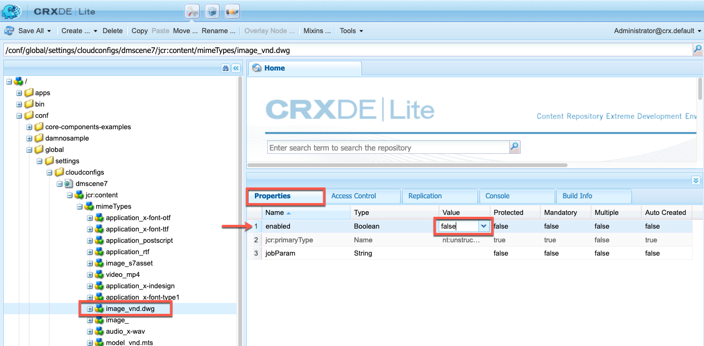

# Konfigurieren von Dynamic Media – Scene7-Modus {#configuring-dynamic-media-scene-mode}

Wenn Sie Adobe Experience Manager für unterschiedliche Umgebungen eingerichtet haben (z. B. je eine Instanz für die Entwicklung, das Staging und die Live-Produktion), müssen Sie Dynamic Media Cloud Services für jede Umgebung konfigurieren.

## Architekturgrafik von Dynamic Media – Scene7-Modus {#architecture-diagram-of-dynamic-media-scene-mode}

Die folgende Architekturgrafik beschreibt die Funktionsweise von Dynamic Media – Scene7-Modus.

Mit der neuen Architektur ist AEM für Master-Assets und Synchronisierungen mit Dynamic Media für die Verarbeitung und Veröffentlichung von Assets zuständig:

1. Wenn das Master-Asset in AEM hochgeladen wurde, wird es in Dynamic Media repliziert. Ab diesem Punkt übernimmt Dynamic Media die gesamte Asset-Verarbeitung und Ausgabenerstellung, z. B. Videokodierung und dynamische Varianten eines Bilds.
1. Nachdem die Ausgaben erstellt wurden, kann AEM sicher auf die Dynamic Media-Remote-Ausgaben zugreifen und eine Vorschau dafür anzeigen (es werden keine Binärdateien an die AEM-Instanz zurückgesendet).
1. Nachdem der Inhalt bereit zur Genehmigung und Veröffentlichung ist, wird der Dynamic Media-Service ausgelöst und pusht Inhalt an Bereitstellungs-Server und Cache-Inhalt in das CDN.


## Aktivieren von Dynamic Media im Scene7-Modus {#enabling-dynamic-media-in-scene-mode}

[Dynamic Media ist standardmäßig deaktiviert. ](https://www.adobe.com/de/solutions/web-experience-management/dynamic-media.html) Funktionen für dynamische Medien müssen für die Nutzung aktiviert werden.

>[HINWEIS]
>
> Dynamische Medien - Der Scene7-Modus ist nur für die AEM-Autoreninstanz verfügbar. Daher müssen Sie `runmode=dynamicmedia_scene7`die AEM Author-Instanz konfigurieren, nicht die AEM Publish-Instanz.

To enable Dynamic Media, you must startup AEM using the `dynamicmedia_scene7` runmode from the command line by entering the folllowing in a terminal window (example port used is 4502):

```shell
java -Xms4096m -Xmx4096m -Doak.queryLimitInMemory=500000 -Doak.queryLimitReads=500000 -jar cq-quickstart-6.4.0.jar -gui -r author,dynamicmedia_scene7 -p 4502
```

## (Optional) Migration von Dynamic Media-Vorgaben und -Konfigurationen von 6.3 zu 6.4 ohne Ausfallzeit {#optional-migrating-dynamic-media-presets-and-configurations-from-to-zero-downtime}

If you are upgrading AEM Dynamic Media from 6.3 to 6.4 (which now includes the ability for zero downtime deployments), you are required to run the following curl command to migrate all your presets and configurations from `/etc` to `/conf` in CRXDE Lite.

>[HINWEIS]
>
>Wenn Sie Ihre AEM-Instanz im Kompatibilitätsmodus ausführen, d. h. die Kompatibilität installiert ist, müssen Sie diese Befehle nicht ausführen.

To migrate your custom presets and configurations from `/etc` to `/conf`, run the following Linux curl command:

`curl -u admin:admin http://localhost:4502/libs/settings/dam/dm/presets.migratedmcontent.json`

Bei allen Upgrades, ob mit oder ohne Kompatibilitätspaket, können Sie mit dem folgenden Befehl die standardmäßigen Benutzer-Vorgaben kopieren:

`curl -u admin:admin http://localhost:4502/libs/settings/dam/dm/presets/viewer.pushviewerpresets`

## (Optional) Installing feature pack 18912 for bulk asset migration {#installing-feature-pack}

Mit dem Feature Pack 18912 können Sie Assets per FTP stapelweise erfassen oder Assets aus dem Modus &quot;Dynamische Medien - Hybrid&quot;oder &quot;Dynamische Medien - Classic&quot;in den Modus &quot;Dynamische Medien - Scene7&quot;in AEM migrieren. Es ist über Adobe Professional Services verfügbar.

Weitere Informationen finden Sie unter [Installieren von Feature Pack 18912 für die Massenmigration](bulk-ingest-migrate.md) von Assets.

## Konfigurieren von Dynamic Media Cloud Services {#configuring-dynamic-media-cloud-services}

Ändern Sie das Kennwort, bevor Sie Dynamische Media Cloud-Dienste konfigurieren. After you receive your provisioning email with Dynamic Media credentials, you must [log in](https://www.adobe.com/marketing-cloud/experience-manager/scene7-login.html) to Dynamic Media Classic to change your password. Das Kennwort aus der Bereitstellungs-E-Mail wird systemseitig erstellt und ist nur als temporäres Kennwort vorgesehen. Sie müssen das Kennwort aktualisieren, damit der Dynamic Media-Cloud-Service mit den richtigen Anmeldedaten eingerichtet wird.

>[!NOTE]
>
>Standardmäßig lautet der Konfigurationspfad für Cloud Services `/content/dam`. Andere Konfigurationspfade werden nicht vom Modus &quot;Dynamische Medien - Scene7&quot;unterstützt.

So konfigurieren Sie dynamische Media Cloud-Dienste:

1. In AEM, tap the AEM logo to access the global navigation console and tap the Tools icon, then tap **[!UICONTROL Cloud Services > Dynamic Media Configuration]**.
1. On the Dynamic Media Configuration Browser page, in the left pane, tap **[!UICONTROL global]** and tap **[!UICONTROL Create]**. Tippen Sie nicht auf das Ordnersymbol links neben [!UICONTROL global]oder wählen Sie es aus.
1. On the [!UICONTROL Create Dynamic Media Configuration] page, enter a title, the Dynamic Media account email address, password, then select your region. Diese Informationen erhalten Sie in der Bereitstellungs-E-Mail von Adobe. Wenden Sie sich an den Support, wenn Sie diese Meldung nicht erhalten haben.

   Tap **[!UICONTROL Connect to Dynamic Media]**.

   >[!NOTE]
   >
   >Nachdem Sie Ihre Bereitstellungs-E-Mail mit Anmeldeinformationen für Dynamic Media erhalten haben, [melden Sie sich](https://www.adobe.com/marketing-cloud/experience-manager/scene7-login.html) bei Dynamic Media an, um Ihr Kennwort zu ändern. Das Kennwort aus der Bereitstellungs-E-Mail wird systemseitig erstellt und ist nur als temporäres Kennwort vorgesehen. Das Aktualisieren des Kennworts ist wichtig, damit der Dynamic Media-Cloud-Service mit den richtigen Anmeldedaten eingerichtet wird.

1. Wenn die Verbindung hergestellt wurde, können Sie auch folgende Einstellungen festlegen:

   * **[!UICONTROL Unternehmen]** – der Name des Dynamic Media-Kontos. Sie können mehrere Dynamic Media-Konten für verschiedene Untermarken, Abteilungen oder verschiedene Staging-/Produktionsumgebungen erstellen.
   * **[!UICONTROL Firmen-Root-Ordnerpfad]**
   * **[!UICONTROL Veröffentlichung von Assets]** – Die Option **[!UICONTROL Sofort]** bedeutet, dass das System hochgeladene Assets aufnimmt und umgehend die URL/den Link zur Einbettung bereitstellt. Zum Veröffentlichen von Assets ist kein Benutzereingriff erforderlich. Die Option **[!UICONTROL Bei Aktivierung]** bedeutet, dass Sie das Asset zuerst explizit veröffentlichen müssen, bevor eine URL/ein Link zur Einbettung bereitgestellt wird.
   * **[!UICONTROL Sicherer Vorschau-Server]** – bietet Ihnen die Möglichkeit, den URL-Pfad zu Ihrem Vorschau-Server für sichere Ausgaben anzugeben. Das heißt, dass AEM sicher auf die Dynamic Media-Remote-Ausgaben zugreifen und eine Vorschau dafür anzeigen kann, nachdem die Ausgaben erstellt wurden (es werden keine Binärdateien an die AEM-Instanz zurückgesendet).

      Adobe empfiehlt, die Standardeinstellung zu verwenden, es sei denn, Sie haben eine besondere Anordnung zur Verwendung des Servers Ihrer eigenen Firma oder eines Spezialservers.
   >[!NOTE]
   >
   >Die Versionierung wird in DMS7 nicht unterstützt. Eine verzögerte Aktivierung gilt nur, wenn auf der Seite „Konfiguration dynamischer Medien bearbeiten“ die Option **[!UICONTROL Assets veröffentlichen]** auf **[!UICONTROL Bei Aktivierung]** eingestellt ist, und erst dann, wenn das Asset zum ersten Mal aktiviert wird.
   >
   >Wenn ein Asset aktiviert wurde, werden alle Aktualisierungen automatisch live in der S7-Bereitstellung übernommen.

   

1. Tippen Sie auf **[!UICONTROL Speichern]**.
1. Für eine sichere Vorschau von Dynamic Media-Inhalt vor dessen Veröffentlichung müssen Sie die AEM-Autoreninstanz der Whitelist hinzufügen, um eine Verbindung mit Dynamic Media herzustellen:

   * Melden Sie sich bei Ihrem Dynamic Media Classic-Konto an: [https://www.adobe.com/marketing-cloud/experience-manager/scene7-login.html](https://www.adobe.com/marketing-cloud/experience-manager/scene7-login.html). Ihre Anmeldedaten haben Sie zum Zeitpunkt der Bereitstellung von Adobe erhalten. Wenn Ihnen die Informationen nicht vorliegen, wenden Sie sich an den technischen Support.
   * On the navigation bar near the top right of the page, tap **[!UICONTROL Setup > Application Setup > Publish Setup > Image Server]**.
   * Wählen Sie auf der Seite „Veröffentlichung zum Image-Server“ in der Dropdown-Liste „Veröffentlichungskontext“ die Option **[!UICONTROL Image-Serving testen]**.
   * Tippen Sie für den Client-Adressfilter auf **[!UICONTROL Hinzufügen]**.
   * Aktivieren Sie das Kontrollkästchen, um die Adresse zu aktivieren, und geben Sie dann die IP-Adresse der AEM-Autoreninstanz (nicht die Dispatcher-IP) ein.
   * Tippen Sie auf **[!UICONTROL Speichern]**.

Sie haben nun die Grundkonfiguration abgeschlossen und können Dynamic Media im Scene7-Modus verwenden.

Wenn Sie Ihre Konfiguration weiter anpassen möchten, können Sie auch eine der Aufgaben unter [(Optional) Konfigurieren der erweiterten Einstellungen in Dynamic Media – Scene7-Modus](#optional-configuring-advanced-settings-in-dynamic-media-scene-mode) abschließen.

## (Optional) Konfigurieren der erweiterten Einstellungen in Dynamic Media – Scene7-Modus {#optional-configuring-advanced-settings-in-dynamic-media-scene-mode}

Wenn Sie die Konfiguration weiter anpassen und Dynamic Media – Scene7-Modus einrichten oder die Leistung optimieren möchten, können Sie eine oder mehrere der folgenden optionalen Aufgaben durchführen:

* [(Optional) Einrichtung und Konfiguration der Einstellungen von Dynamic Media – Scene7-Modus](#optional-setup-and-configuration-of-dynamic-media-scene-mode-settings-p)

* [(Optional) Steigern der Leistung von Dynamic Media – Scene7-Modus](#optional-tuning-the-performance-of-dynamic-media-scene-mode) 
* [(Optional) Filtern von Assets für die Replizierung](#optional-filtering-assets-for-replication)

### (Optional) Einrichtung und Konfiguration der Einstellungen von Dynamic Media – Scene7-Modus</p> {#optional-setup-and-configuration-of-dynamic-media-scene-mode-settings-p}

When you are in run mode **dynamicmedia_scene7**, you use the Dynamic Media Classic (Scene7) user interface to make changes to your Dynamic Media settings.

Some of the tasks above require that you log into Dynamic Media Classic here: [https://www.adobe.com/marketing-cloud/experience-manager/scene7-login.html](https://www.adobe.com/marketing-cloud/experience-manager/scene7-login.html)

Die Aufgaben für die Einrichtung und Konfiguration sind:

* [Veröffentlichungseinstellungen für Image-Server](#publishing-setup-for-image-server)
* [Konfigurieren der allgemeinen Anwendungseinstellungen](#configuring-application-general-settings)
* [Konfigurieren des Farb-Managements](#configuring-color-management)
* [Konfigurieren der Asset-Verarbeitung](#configuring-asset-processing)
* [Hinzufügen benutzerdefinierter MIME-Typen für nicht unterstützte Formate](#adding-custom-mime-types-for-unsupported-formats)
* [Erstellen von Stapelsatzvorgaben zum automatischen Erzeugen von Bild- und Rotationssets](#creating-batch-set-presets-to-auto-generate-image-sets-and-spin-sets)

#### Veröffentlichungseinstellungen für Image-Server     {#publishing-setup-for-image-server}

Mit den Veröffentlichungseinstellungen wird festgelegt, wie Assets standardmäßig von Dynamic Media bereitgestellt werden. Wenn keine Einstellung festgelegt wird, stellt Dynamic Media ein Asset gemäß den Standardeinstellungen unter „Veröffentlichungseinstellungen“ bereit. Beispiel: Bei der Anforderung, ein Bild bereitzustellen, das kein Auflösungsattribut enthält, wird ein Bild mit der Einstellung „Standardobjektauflösung“ bereitgestellt.

To configure Publish Setup: in Dynamic Media Classic, tap **[!UICONTROL Setup > Application Setup > Publish Setup > Image Server]**.

Auf dem Bildschirm „Image-Server“ werden Standardeinstellungen für das Bereitstellen von Bildern festgelegt. Eine Beschreibung der einzelnen Einstellungen finden Sie in der Benutzeroberfläche.

* **[!UICONTROL Anfrage-Attribute]**: Mit diesen Einstellungen werden Einschränkungen für die Bilder festgelegt, die über den Server bereitgestellt werden können.
* **[!UICONTROL Standardattribute für Anfragen]**: Diese Einstellungen beziehen sich auf die standardmäßige Darstellung von Bildern.
* **[!UICONTROL Allgemeine Attribute für Miniaturansichten]**: Diese Einstellungen beziehen sich auf die standardmäßige Darstellung von Miniaturbildern.
* **[!UICONTROL Standardeinstellungen für Katalogfelder]**: Diese Einstellungen beziehen sich auf die Auflösung und den Standardtyp für Miniaturansichten von Bildern.
* **[!UICONTROL Farbverwaltungsattribute]**: Mit diesen Einstellungen wird festgelegt, welche ICC-Farbprofile verwendet werden.
* **[!UICONTROL Kompatibilitätsattribute]**: Diese Einstellung ermöglicht die Behandlung von Anfangs- und Endabsätzen in Textebenen wie in Version 3.6, um die Abwärtskompatibilität zu gewährleisten.
* **[!UICONTROL Lokalisierungsunterstützung]**: Mit diesen Einstellungen können mehrere Gebietsschemaattribute verwaltet werden. Außerdem kann damit eine Zeichenfolge der Gebietsschemakarte angegeben werden, damit Sie festlegen können, welche Sprachen für die verschiedenen QuickInfos in Viewern unterstützt werden sollen. For more information about setting up Localization Support, see [Considerations when setting up localization of assets](https://help.adobe.com/de_DE/scene7/using/WS997f1dc4cb0179f034e07dc31412799d19a-8000.html).

#### Konfigurieren der allgemeinen Anwendungseinstellungen {#configuring-application-general-settings}

To open the [!UICONTROL Application General Settings] page, in Dynamic Media Classic Global Navigation bar, tap **[!UICONTROL Setup > Application Setup > General Settings]**.

**[!UICONTROL Server]**: Bei der Kontobereitstellung stellt Dynamic Media automatisch die zugeordneten Server für Ihr Unternehmen bereit. Diese Server werden verwendet, um URL-Zeichenfolgen für Ihre Website und Anwendungen zu erstellen. Diese URL-Aufrufe gelten spezifisch für Ihr Konto. Ändern Sie keine Server-Namen, sofern Sie nicht vom AEM-Support ausdrücklich dazu angewiesen werden.

**[!UICONTROL Bilder überschreiben]**: Dynamic Media lässt zwei Dateien mit denselben Namen nicht zu. Die URL-ID (Dateiname ohne Erweiterung) eines Elements muss jeweils eindeutig sein. Diese Optionen legen fest, wie Ersatz-Assets hochgeladen werden, d. h. ob sie das Original ersetzen oder doppelt vorhanden sind. Duplizierte Assets werden durch Anhängen von „-1“ umbenannt („chair.tif“ wird beispielsweise zu „chair-1.tif“). Diese Optionen gelten für Assets, die in einen anderen Ordner als das Original hochgeladen werden, oder Assets mit einer anderen Dateinamenerweiterung als das Original (z. B. JPG, TIF oder PNG).

* **[!UICONTROL Im aktuellen Ordner Bilder mit demselben Namen und derselben Erweiterung überschreiben]**: Diese Option stellt die strengste Ersetzungsregel dar. Das Ersatzbild muss in den Ordner des Originalbilds hochgeladen werden und dieselbe Dateierweiterung haben wie das Originalbild. Werden diese Anforderungen nicht erfüllt, wird ein Duplikat geschaffen.

>[!NOTE]
>
>To maintain consistency with AEM, select **[!UICONTROL Overwrite in current folder, same base image name/extension]**.

* **[!UICONTROL In jedem Ordner überschreiben, Name/Erweiterung]** des Basisassets - Erfordert, dass das Ersatzbild dieselbe Dateinamenerweiterung wie das Originalbild hat (z. B. `chair.jpg` ersetzt `chair.jpg` und nicht `chair.tif`). Sie können das Ersatzbild jedoch in einen anderen Ordner hochladen als den, in dem sich das Original befindet. Das hochgeladene Bild bleibt dann im neuen Ordner; die Datei befindet sich also nicht mehr am ursprünglichen Speicherort..
* **[!UICONTROL In belieb. Ordner Assets mit ident. Namen unabh. von Erweit. überschreiben]**: Diese Option stellt die am wenigsten einschränkende Ersetzungsregel dar. Sie können ein Ersatzbild in einen anderen Ordner hochladen als den, in dem sich das Originalbild befindet, und eine Datei mit einer anderen Dateierweiterung verwenden, um die Originaldatei zu ersetzen. Wenn sich die Originaldatei in einem anderen Ordner befindet, bleibt das Ersatzbild in dem neuen Ordner, in den es hochgeladen wurde.

**[!UICONTROL Standardfarbprofile]**: Zusätzliche Informationen finden Sie unter [Konfigurieren des Farb-Managements](#configuring-color-management).

>[!NOTE]
>
>Standardmäßig zeigt das System 15 Ausgabedarstellungen an, wenn Sie **[!UICONTROL Ausgabedarstellungen]** auswählen, und 15 Viewer-Voreinstellungen, wenn Sie in der Detailansicht des Assets **[!UICONTROL Viewer]** auswählen. Sie können diese Grenze erhöhen. See [Increasing the number of image presets that display](managing-image-presets.md#increasing-or-decreasing-the-number-of-image-presets-that-display) or [Increasing the number of viewer presets that display](managing-viewer-presets.md#increasing-the-number-of-viewer-presets-that-display).

#### Konfigurieren des Farb-Managements {#configuring-color-management}

Beim Farb-Management für Dynamic Media können Sie die Farben von Assets korrigieren. Bei der Farbkorrektur behalten übernommene Assets ihren Farbraum (RGB, CMYK, Grau) und das eingebettete Farbprofil bei. Wenn Sie eine dynamische Ausgabe anfordern, wird die Bildfarbe gemäß dem Zielfarbraum korrigiert, indem eine CMYK-, RGB- oder Grau-Ausgabe verwendet wird. Siehe [Konfigurieren von Bildvorgaben](managing-image-presets.md).

So konfigurieren Sie die Standardfarbeigenschaften, damit die Farbkorrektur beim Anfordern von Bildern aktiviert ist:

1. [Melden Sie sich](https://www.adobe.com/marketing-cloud/experience-manager/scene7-login.html) mit den Anmeldeinformationen, die Sie bei der Bereitstellung erhalten haben, bei Dynamic Media Classic an. Navigieren Sie zu **[!UICONTROL Einrichtung > Anwendungseinstellungen]**.
1. Erweitern Sie den Bereich **[!UICONTROL Veröffentlichungseinstellungen]** und wählen Sie **[!UICONTROL Image-Server]**. Legen Sie **[!UICONTROL Veröffentlichungskontext]** beim Festlegen von Standardwerten für Veröffentlichungsinstanzen auf **[!UICONTROL Image Serving]** fest.
1. Navigieren Sie zu der Eigenschaft, die Sie ändern müssen, z. B. einer Eigenschaft im Bereich **[!UICONTROL Farbverwaltungsattribute]**.

   Sie können die folgenden Farbkorrektureigenschaften festlegen:

   * [!UICONTROL CMYK-Standardfarbraum]: Name des standardmäßigen CMYK-Farbprofils
   * [!UICONTROL Graustufen-Standardfarbraum]: Name des standardmäßigen Grau-Farbprofils
   * [!UICONTROL RGB-Standardfarbraum]: Name des standardmäßigen RGB-Farbprofils
   * [!UICONTROL Rendering Intent für Farbumwandlung]: Gibt die Render-Priorität an. Die zulässigen Werte sind `perceptual`, `relative``colometric`, `saturation`und `absolute colometric`. Adobe recommends `relative` as the default.

1. Tippen Sie auf **[!UICONTROL Speichern]**.

So können Sie beispielsweise den **[!UICONTROL RGB-Standardfarbraum]** auf `sRGB` und den **[!UICONTROL CMYK-Standardfarbraum]** auf `WebCoated` festlegen.

Dies hat folgende Auswirkungen:

* Die Farbkorrektur für RGB- und CMYK-Bilder wird aktiviert.
* Für RGB-Bilder ohne Farbprofil wird angenommen, dass sie sich im Farbraum `sRGB` befinden.
* Für CMYK-Bilder ohne Farbprofil wird angenommen, dass sie sich im Farbraum `WebCoated` befinden.
* Dynamic renditions that return RGB output, will return it in the `sRGB` color space.
* Für dynamische Wiedergaben, bei denen eine CMYK-Ausgabe zurückgegeben wird, erfolgt dies im Farbraum `WebCoated`.

#### Konfigurieren der Asset-Verarbeitung {#configuring-asset-processing}

Sie können festlegen, welche Asset-Typen von Dynamic Media verarbeitet werden, und erweiterte Asset-Verarbeitungsparameter anpassen. Beispielsweise können Sie Asset-Verarbeitungsparameter für folgende Aktionen festlegen:

* Konvertieren eines Adobe PDF-Dokuments in ein E-Katalog-Asset
* Konvertieren eines Adobe Photoshop-Dokuments (.PSD) in ein Bannervorlagen-Asset für Personalisierung
* Rastern einer Adobe Illustrator- (.AI) oder Adobe Photoshop Encapsulated Postscript-Datei (.EPS)

>[HINWEIS]
>
>Mit Video-Profilen und Imaging-Profilen können Sie die Verarbeitung von Videos bzw. Bildern definieren.

Siehe [Hochladen von Assets](managing-assets-touch-ui.md#uploading-assets).

**So konfigurieren Sie die Asset-Verarbeitung**:

1. In AEM, tap the AEM logo to access the global navigation console, then tap the **[!UICONTROL Tools]** (hammer) icon and navigate to **[!UICONTROL General > CRXDE Lite]**.
1. Navigieren Sie in der linken Leiste zu:

   `/conf/global/settings/cloudconfigs/dmscene7/jcr:content/mimeTypes`

   

1. Under the `mimeTypes` folder, select a mime type.
1. Im rechten unteren Bereich der Seite „CRXDE Lite“:

   * Doppelklicken Sie auf das Feld **[!UICONTROL Aktiviert]**. Alle Asset-MIME-Typen sind standardmäßig aktiviert (auf **[!UICONTROL true]** festgelegt). Dies bedeutet, dass die Assets zur Verarbeitung mit Dynamic Media synchronisiert werden. Wenn Sie diesen Asset-MIME-Typ von der Verarbeitung ausschließen möchten, ändern Sie diese Einstellung in **[!UICONTROL false]**.
   * Doppelklicken Sie auf **[!UICONTROL jobParam]**, um das zugehörige Textfeld zu öffnen. Unter [Unterstützte MIME-Typen](assets-formats.md#supported-mime-types) finden Sie eine Liste mit zulässigen Werten für Verarbeitungsparameter, die Sie für einen bestimmten MIME-Typ verwenden können.

1. Führen Sie einen der folgenden Schritte aus:

   * Wiederholen Sie die Schritte 3–4, um weitere MIME-Typen zu bearbeiten.
   * On the menu bar of the CRXDE Lite page, tap **[!UICONTROL Save All]**.

1. Tippen Sie links oben auf der Seite auf **[!UICONTROL CRXDE Lite]**, um zu AEM zurückzukehren.

#### Hinzufügen benutzerdefinierter MIME-Typen für nicht unterstützte Formate {#adding-custom-mime-types-for-unsupported-formats}

Sie können in AEM Assets benutzerdefinierte MIME-Typen für nicht unterstützte Formate hinzufügen. To ensure that any new node you add in CRXDE Lite is not deleted by AEM, you must ensure that you move the MIME type before **[!UICONTROL image_]** and its enabled value is set to **[!UICONTROL false]**.

**So fügen Sie benutzerspezifische MIME-Typen für nicht unterstützte Formate hinzu**:

1. From AEM, click **[!UICONTROL Tools > Operations > Web Console]**.

   

1. Auf der Seite **[!UICONTROL Adobe Experience Manager-Web-Konsolen-Konfiguration]** wird eine neue Browser-Registerkarte geöffnet.

   

1. On the page, scroll down to the name **[!UICONTROL Adobe CQ Scene7 Asset MIME type Service]**. To the right of the name, tap **[!UICONTROL Edit the configuration values]** (pencil icon).

   

1. Klicken Sie auf der Seite **[!UICONTROL Adobe CQ Scene7 Asset MIME type Service]** auf ein beliebiges Pluszeichen `+`. Die Position in der Tabelle, an der Sie auf das Pluszeichen klicken, um den neuen MIME-Typ hinzuzufügen, ist unerheblich.

   

1. Geben Sie `DWG=image/vnd.dwg` in das leere Textfeld ein, das Sie soeben hinzugefügt haben.

   Beachten Sie, dass das Beispiel `DWG=image/vnd.dwg` nur zu Veranschaulichungszwecken dient. Der hier hinzugefügte MIME-Typ kann ein beliebiges anderes nicht unterstütztes Format sein.

   

1. In the lower-right corner of the page, click **[!UICONTROL Save]**.

   An dieser Stelle können Sie die Registerkarte des Browsers schließen, auf der die Seite „Adobe Experience Manager-Web-Konsolen-Konfiguration“ geöffnet ist.

1. Kehren Sie zur Browser-Registerkarte zurück, in der sich Ihre geöffnete AEM-Konsole befindet.

1. From AEM, click **[!UICONTROL Tools > General > CRXDE Lite]**.

   

1. Navigieren Sie in der linken Leiste zu:

   `conf/global/settings/cloudconfigs/dmscene7/jcr:content/mimeTypes`

1. Ziehen Sie den Mime-Typ `image_vnd.dwg` und legen Sie ihn direkt über `image_` der Struktur ab.

   

1. With the mime type `image_vnd.dwg` still selected in the tree, from the **[!UICONTROL Properties]** tab, in the **[!UICONTROL enabled]** row, under the **[!UICONTROL Value]** column header, double-click the value to open the **[!UICONTROL Value]** drop-down list.

1. Geben Sie `false` in das Feld ein (oder wählen Sie `false` aus der Dropdown-Liste).

   

1. Klicken Sie in der oberen linken Ecke der Seite „CRXDE Lite“ auf **[!UICONTROL Alle speichern]**.

#### Erstellen von Stapelsatzvorgaben zum automatischen Erzeugen von Bild- und Rotationssets {#creating-batch-set-presets-to-auto-generate-image-sets-and-spin-sets}

Verwenden Sie Stapelsatzvorgaben, um die Erstellung von Bildsätzen oder Rotationssets während des Hochladens von Assets in Dynamic Media zu automatisieren.

Definieren Sie zuerst die Benennungskonvention für die Gruppierung von Assets in einem Satz. Anschließend können Sie eine Stapelsatzvorgabe erstellen. Dabei handelt es sich um einen eindeutig benannten, in sich abgeschlossenen Satz von Anweisungen, der festlegt, wie der Satz unter Verwendung von Bildern erstellt wird, die den im Vorgabenrezept definierten Benennungsregeln entsprechen.

Wenn Sie Dateien hochladen, erstellt Dynamic Media automatisch einen Satz mit allen Dateien, die den definierten Benennungsregeln in den aktiven Vorgaben entsprechen.

**Konfigurieren der Standardbenennung**

Erstellen Sie eine Standardbenennungskonvention zur Verwendung in einem beliebigen Stapelsatzvorgaben-Rezept. Die in der Definition der Stapelsatzvorgabe ausgewählte Standardbenennungsregel ist möglicherweise alles, was Ihr Unternehmen zur Stapelgenerierung von Sätzen benötigt. Eine Stapelsatzvorgabe wird erstellt, damit die von Ihnen definierte Standardbenennungskonvention verwendet wird. Sie können so viele Stapelsatzvorgaben mit alternativen, benutzerdefinierten Benennungskonventionen erstellen, wie für einen bestimmten Satz von Inhalten notwendig sind, sofern eine Ausnahme für die unternehmensspezifische Standardbenennung vorhanden ist.

Die Einrichtung einer Standardbenennungskonvention ist keine Voraussetzung für die Nutzung der Stapelsatzvorgabenfunktion. Es hat sich jedoch bewährt, mithilfe der Standardbenennungskonvention so viele Elemente Ihrer Benennungskonvention zu definieren, wie Sie in einem Satz gruppieren möchten, um die Stapelsatzerstellung zu optimieren.

Hinweis: Als Alternative können Sie **[!UICONTROL Code anzeigen]** ohne verfügbare Formularfelder verwenden. In dieser Ansicht erstellen Sie die Definitionen Ihrer Benennungskonvention vollständig unter Verwendung von regulären Ausdrücken.

Two elements are available for definition, **[!UICONTROL Match]** and **[!UICONTROL Base Name]**. Mit diesen Feldern können Sie alle Elemente einer Benennungskonvention definieren und den Teil der Konvention identifizieren, der zum Benennen des Satzes verwendet wird, der diese Elemente enthält. Für die individuelle Benennungskonvention eines Unternehmens können eine oder mehrere Zeilen der Definition für jedes dieser Elemente verwendet werden. Sie können für Ihre eindeutige Definition so viele Zeilen wie erforderlich verwenden und sie zu eindeutigen Elementen gruppieren, beispielsweise Elementen für Hauptbild, Farbe, alternative Ansicht und Muster.

**So konfigurieren Sie die Standardbenennung:**

1. Log on to your Dynamic Media Classic (Scene7) account: [www.adobe.com/marketing-cloud/experience-manager/scene7-login.html](https://www.adobe.com/marketing-cloud/experience-manager/scene7-login.html)

   Ihre Anmeldedaten haben Sie zum Zeitpunkt der Bereitstellung von Adobe erhalten. Wenn Ihnen die Informationen nicht vorliegen, wenden Sie sich an den technischen Support.

1. Tippen Sie in der Navigationsleiste im oberen Seitenbereich auf **[!UICONTROL Einrichtung > Anwendungseinstellungen > Stapelsatzvorgaben > Standardbenennung].**
1. Wählen Sie **[!UICONTROL Formular anzeigen]** oder **[!UICONTROL Code anzeigen]**, um die gewünschte Ansicht festzulegen, und geben Sie Informationen zu den einzelnen Elementen ein.

   Sie können das Kontrollkästchen **[!UICONTROL Code anzeigen]** aktivieren, um die Erstellung des regelmäßigen Ausdruckswerts neben Ihren Formularauswahlen anzuzeigen. Sie können diese Werte nach Bedarf eingeben oder ändern. Dies hilft Ihnen bei der Definition der Elemente der Benennungsdefinition, falls Sie aus irgendeinem Grund durch die Formularansicht eingeschränkt werden. Falls Ihre Werte in der Formularansicht nicht analysiert werden können, werden die Formularfelder inaktiv.

   >[!NOTE]
   >
   >Bei deaktivierten Formularfeldern erfolgt keine Überprüfung, ob Ihre regelmäßigen Ausdrücke korrekt sind. Ergebnisse des regelmäßigen Ausdrucks, den Sie für jedes Element erstellen, werden nach der Zeile „Ergebnis“ angezeigt. Der vollständige regelmäßige Ausdruck wird am unteren Seitenrand angezeigt.

1. Erweitern Sie die Elemente bei Bedarf und geben Sie die zu verwendenden Benennungsregeln ein.
1. Führen Sie ggf. einen der folgenden Schritte aus:

   * Tippen Sie auf **[!UICONTROL Hinzufügen]**, um eine weitere Benennungsregel für ein Element hinzuzufügen.
   * Tippen Sie auf **[!UICONTROL Entfernen]**, um eine Benennungsregel für ein Element zu löschen.

1. Führen Sie einen der folgenden Schritte aus:

   * Tippen Sie auf **[!UICONTROL Speichern unter]** und geben Sie einen Namen für die Vorgabe ein.
   * Wenn Sie eine vorhandene Vorgabe bearbeiten, tippen Sie auf **[!UICONTROL Speichern]**.

**Erstellen einer Stapelsatzvorgabe**

Dynamic Media verwendet Stapelsatzvorgaben, um Assets für die Anzeige in Viewern in Bildsätzen (alternative Bilder, Farboptionen, 360°-Drehung) zu organisieren. Die Stapelsatzvorgaben werden automatisch parallel zu den Asset-Uploadprozessen in Dynamic Media ausgeführt.

Sie können Ihre Stapelsatzvorgaben erstellen, bearbeiten und verwalten. Es gibt zwei Formen von Definitionen für Stapelsatzvorgaben, eine für eine von Ihnen eingerichtete Standardbenennungskonvention und eine für benutzerdefinierte Standardbenennungskonventionen, die Sie spontan erstellen.

Sie können zum Definieren einer Stapelsatzvorgabe entweder die Formularfeldmethode oder die Codemethode verwenden, die Ihnen die Verwendung regelmäßiger Ausdrücke ermöglicht. As in Default Naming, you can choose [!UICONTROL View Code] at the same time you are defining in the [!UICONTROL Form View] and use regular expressions to build your definitions. Als Alternative können Sie eine der Ansichten deaktivieren, um die andere ausschließlich zu verwenden.

**So erstellen Sie eine Stapelsatzvorgabe:**

1. Log on to your Dynamic Media Classic (Scene7) account: [www.adobe.com/marketing-cloud/experience-manager/scene7-login.html](https://www.adobe.com/marketing-cloud/experience-manager/scene7-login.html)

   Ihre Anmeldedaten haben Sie zum Zeitpunkt der Bereitstellung von Adobe erhalten. Wenn Ihnen die Informationen nicht vorliegen, wenden Sie sich an den technischen Support.

1. Tippen Sie in der Navigationsleiste im oberen Seitenbereich auf **[!UICONTROL Einrichtung > Anwendungseinstellungen > Stapelsatzvorgaben > Stapelsatzvorgabe].**

   Hinweis: [!UICONTROL Formular anzeigen], wie oben rechts auf der Detailseite festgelegt, ist die Standardansicht.

1. Tippen Sie im Bereich „Vorgabenliste“ auf **[!UICONTROL Hinzufügen]**, um die Definitionsfelder im Detailbereich auf der rechten Seite des Bildschirms zu aktivieren.****
1. In the **[!UICONTROL Details]** panel, in the **[!UICONTROL Preset Name]** field, type a name for the preset.
1. In the **[!UICONTROL Batch Set Type]** drop-down menu, select a preset type.
1. Führen Sie einen der folgenden Schritte aus:

   * Wenn Sie eine standardmäßige Benennungskonvention verwenden, die Sie zuvor unter **[!UICONTROL Anwendungseinstellungen > Stapelsatzvorgaben > Standardbenennung]** eingerichtet haben, erweitern Sie **[!UICONTROL Asset-Benennungsregeln]****** und klicken Sie anschließend in der Dropdown-Liste auf **[!UICONTROL Standard]**.
   * To define a new naming convention as you set up the preset, **[!UICONTROL Asset Naming Conventions]**, and then in the **[!UICONTROL File Naming]** drop-down list, tap **[!UICONTROL Custom]**.

1. For [!UICONTROL Sequence order], define the order in which images are displayed after the set is grouped together in Dynamic Media.

   Die Assets werden standardmäßig in alphanumerischer Reihenfolge angeordnet. Sie können jedoch auch eine durch Kommas getrennte Liste mit regulären Ausdrücken verwenden, um die Reihenfolge anzupassen.

1. For **[!UICONTROL Set Naming]** and **[!UICONTROL Creation Convention]**, specify the suffix or prefix to the base name you defined in the **[!UICONTROL Asset Naming Convention]**. Legen Sie außerdem fest, wo der Satz in der Dynamic Media-Ordnerstruktur erstellt werden soll.

   Falls Sie eine große Anzahl von Sätzen definieren, sollten Sie diese von den Ordnern, die die Assets selbst enthalten, getrennt halten. Dazu können Sie beispielsweise einen Ordner namens „Bildsätze“ erstellen und die Anwendung anweisen, generierte Sätze hier abzulegen.

1. In the **[!UICONTROL Details]** panel, tap **[!UICONTROL Save]**.
1. Tippen Sie neben dem neuen Vorgabenamen auf **[!UICONTROL Aktiv]**.

   Durch das Aktivieren dieser Vorgabe wird sichergestellt, dass beim Hochladen von Assets in Dynamic Media die Stapelsatzvorgabe zur Erstellung des Satzes angewendet wird.

**Erstellen einer Stapelsatzvorgabe für die automatische Erstellung eines 2D-Rotationssets**

Sie können den Stapelsatztyp **[!UICONTROL Multiachsen-Rotationsset]** verwenden, um ein „Rezept“ zu erstellen, das die Erstellung von 2D-Rotationssets automatisiert. Für die Gruppierung von Bildern werden die regulären Ausdrücke „Zeile“ und „Spalte“ verwendet, sodass die Bild-Assets im multidimensionalen Array korrekt an der entsprechenden Position ausgerichtet werden. Es gibt keine Mindest- oder Maximalzahl an Reihen und Spalten, die in einem Multiachsen-Rotationsset vorhanden sein müssen.

Beispiel: Sie möchten ein Multiachsen-Rotations-Set mit dem Namen `spin-2dspin` erstellen. Sie haben einen Satz von Rotationsset-Bildern, die drei Zeilen mit 12 Bildern pro Zeile enthalten. Die Bilder haben die folgenden Namen:

```
spin-01-01 
 spin-01-02 
 … 
 spin-01-12 
 spin-02-01 
 … 
 spin-03-12
```

With this information, your [!UICONTROL Batch Set Type] recipe might be created as follows:


Die Gruppierung für den Teil des gemeinsamen Asset-Namens des Rotationssets wird dem Feld **[!UICONTROL Übereinstimmung]** hinzugefügt (wie hervorgehoben). Der variable Teil des Asset-Namens, der die Zeile und Spalte enthält, wird den Feldern **[!UICONTROL Zeile]** bzw. **[!UICONTROL Spalte]** hinzugefügt.

When the Spin Set is uploaded and published, you activate the name of the 2D Spin Set recipe that is listed under **[!UICONTROL Batch Set Presets]** in the **[!UICONTROL Upload Job Options]** dialog box.

**So erstellen Sie eine Stapelsatzvorgabe für die automatische Erstellung eines 2D-Rotationssets:**

1. Melden Sie sich bei Ihrem Dynamic Media Classic-Konto (Scene7) an: [https://www.adobe.com/marketing-cloud/experience-manager/scene7-login.html](https://www.adobe.com/marketing-cloud/experience-manager/scene7-login.html)

   Ihre Anmeldedaten haben Sie zum Zeitpunkt der Bereitstellung von Adobe erhalten. Wenn Ihnen die Informationen nicht vorliegen, wenden Sie sich an den technischen Support.

1. Tippen Sie in der Navigationsleiste im oberen Seitenbereich auf **[!UICONTROL Einrichtung > Anwendungseinstellungen > Stapelsatzvorgaben > Stapelsatzvorgabe]**.

   Hinweis: [!UICONTROL Formular anzeigen], wie oben rechts auf der Detailseite festgelegt, ist die Standardansicht.

1. In the **[!UICONTROL Preset List]** panel, tap **[!UICONTROL Add]** to activate the definition fields in the **[!UICONTROL Details]** panel on the right hand side of the screen.
1. In the **[!UICONTROL Details]** panel, in the [!UICONTROL Preset Name[!UICONTROL field, type a name for the preset.
1. In the **[!UICONTROL Batch Set Type]** drop-down menu, select **[!UICONTROL Asset Set]**.
1. In the **[!UICONTROL Sub Type]** drop-down list, select **[!UICONTROL Multi-Axis Spin Set]**.
1. Expand **[!UICONTROL Asset Naming Conventions]**, and then in the **[!UICONTROL File Naming]** drop-down list, tap **[!UICONTROL Custom]**.
1. Verwenden Sie die Attribute **[!UICONTROL Übereinstimmung]** und optional **[!UICONTROL Basisname]**, um einen regulären Ausdruck für die Benennung von Bild-Assets zu definieren, aus denen die Gruppierung besteht.

   Ein regulärer Ausdruck für eine genaue Übereinstimmung könnte z. B. wie folgt aussehen:

   `(w+)-w+-w+`

1. Erweitern Sie **[!UICONTROL Zeilen-/Spaltenposition]** und definieren Sie anschließend den Namen des Formats für die Position des Bild-Assets innerhalb des 2D-Rotationsset-Arrays.

   Setzen Sie die Zeilen- oder Spaltenposition im Dateinamen in Klammern.

   Ein regulärer Ausdruck für die Zeile könnte z. B. wie folgt aussehen:

   `\w+-R([0-9]+)-\w+`

    oder

   `\w+-(\d+)-\w+`

   Ein regulärer Ausdruck für die Spalte könnte wie folgt aussehen:

   `\w+-\w+-C([0-9]+)`

    oder

   `\w+-\w+-C(\d+)`

   Beachten Sie, dass dies nur Beispiele sind. Sie können reguläre Ausdrücke Ihren Bedürfnissen entsprechend erstellen.

   >[!NOTE]
   >
   >Wenn anhand der Kombination aus regulärem Ausdruck für Zeile und Spalte diese Position des Assets innerhalb des multidimensionalen Rotationsset-Arrays nicht ermittelt werden kann, wird das Asset dem Satz nicht hinzugefügt und ein Fehler wird protokolliert.

1. For **[!UICONTROL Set Naming]** and **[!UICONTROL Creation Convention]**, specify the suffix or prefix to the base name you defined in the **[!UICONTROL Asset Naming Convention]**.

   Legen Sie außerdem fest, wo das Rotationsset in der Dynamic Media Classic-Ordnerstruktur erstellt werden soll.

   Falls Sie eine große Anzahl von Sätzen definieren, sollten Sie diese von den Ordnern, die die Assets selbst enthalten, getrennt halten. Dazu erstellen Sie beispielsweise einen Ordner namens „Rotationssets“ und weisen die Anwendung an, generierte Sätze hier abzulegen.

1. In the **[!UICONTROL Details]** panel, tap **[!UICONTROL Save]**.
1. Tippen Sie neben dem neuen Vorgabenamen auf **[!UICONTROL Aktiv]**.

   Durch das Aktivieren dieser Vorgabe wird sichergestellt, dass beim Hochladen von Assets in Dynamic Media die Stapelsatzvorgabe zur Erstellung des Satzes angewendet wird.

### (Optional) Steigern der Leistung von Dynamic Media – Scene7-Modus {#optional-tuning-the-performance-of-dynamic-media-scene-mode}

Damit der Modus &quot;Dynamische Medien - Scene7&quot;reibungslos ausgeführt werden kann, empfiehlt Adobe die folgenden Tipps zur Synchronisierungsleistung/Skalierbarkeit:

* Aktualisieren der vordefinierten Auftragsparameter zur Verarbeitung verschiedener Dateiformate.
* Aktualisieren des vordefinierten Granite-Arbeitsablaufs (Video-Assets) für die Warteschlange von Arbeitsthreads.
* Aktualisieren des vordefinierten Granite-Arbeitsablaufs für transiente Arbeitsabläufe (Bilder und Nicht-Video-Assets) in der Warteschlange für Arbeitsabläufe.
* Aktualisieren der maximalen Upload-Verbindungen auf den Server von Dynamic Media Classic.

#### Aktualisieren der vordefinierten Auftragsparameter für die Verarbeitung verschiedener Dateiformate

Sie können Auftragsparameter für eine schnellere Verarbeitung einstellen, wenn Sie Dateien hochladen. Wenn Sie beispielsweise PSD-Dateien hochladen, diese aber nicht als Vorlagen verarbeiten möchten, können Sie die Ebenendatei auf &quot;false&quot;(Aus) setzen. In diesem Fall würde der Parameter für den angepassten Auftrag wie `process=None&createTemplate=false`folgt angezeigt werden.

Adobe empfiehlt die Verwendung der folgenden &quot;angepassten&quot;Auftragsparameter für PDF-, PostScript- und PSD-Dateien:

| Dateityp | Empfohlene Auftragsparameter |
| ---| ---|
| PDF | `pdfprocess=Rasterize&resolution=150&colorspace=Auto&pdfbrochure=false&keywords=false&links=false` |
| PostScript | `psprocess=Rasterize&psresolution=150&pscolorspace=Auto&psalpha=false&psextractsearchwords=false&aiprocess=Rasterize&airesolution=150&aicolorspace=Auto&aialpha=false` |
| PSD | `process=None&layerNaming=Layername&anchor=Center&createTemplate=false&extractText=false&extendLayers=false` |

Um einen dieser Parameter zu aktualisieren, führen Sie die Schritte unter [Aktivieren der Unterstützung](#enabling-mime-type-based-assets-scene-upload-job-parameter-support)von MIME-typbasierten Assets/Dynamic Media Classic-Upload-Auftragsparametern aus.

#### Aktualisieren der Verlaufs-Workflow-Warteschlange von Granite {#updating-the-granite-transient-workflow-queue}

Die Transit-Workflow-Warteschlange von Granite wird für den Workflow **[!UICONTROL DAM-Update-Asset]** verwendet. In Dynamic Media wird sie für die Bildaufnahme und -verarbeitung genutzt.

**So aktualisieren Sie die Verlaufs-Workflow-Warteschlange von Granite**:

1. Navigieren Sie zu [https://&lt;Server>/system/console/configMgr](http://localhost:4502/system/console/configMgr) und suchen Sie nach **[!UICONTROL Warteschlange: Warteschlange für die Granite-Übergangs-Workflows]**.

   >[!NOTE]
   >
   >Anstelle einer direkten URL ist eine Textsuche erforderlich, da die OSGi-PID dynamisch generiert wird.

1. Ändern Sie im Feld **[!UICONTROL Maximale Anzahl an parallelen Aufträgen]** die Zahl in den gewünschten Wert.

   Die maximale Anzahl der parallelen Aufträge hängt standardmäßig von der Anzahl der verfügbaren CPU-Kerne ab. Auf einem Server mit 4 Kernen werden z. B. 2 Workerthreads zugewiesen. (Ein Wert zwischen 0,0 und 1,0 ist verhältnisbasiert, alle Zahlen über 1 weisen die Anzahl der Workerthreads zu.)

   Adobe recommends that 32 **[!UICONTROL Maximum Parallel Jobs]** be configured to adequately support heavy upload of files to Dynamic Media Classic.

   

1. Tippen Sie auf **[!UICONTROL Speichern]**.

#### Aktualisieren der Granite-Workflow-Warteschlange {#updating-the-granite-workflow-queue}

Die Granite-Workflow-Warteschlange wird für Workflows ohne Verlauf verwendet. In Dynamic Media dient sie zum Verarbeiten von Videos mit dem Workflow **[!UICONTROL Dynamic Media-Videokodierung]**.

**So aktualisieren Sie die Granite-Workflow-Warteschlange:**

1. Navigieren Sie zu `https://<server>/system/console/configMgr` und suchen Sie nach **[!UICONTROL Warteschlange: Granite-Workflow-Warteschlange]**.

   >[!NOTE]
   >
   >Anstelle einer direkten URL ist eine Textsuche erforderlich, da die OSGi-PID dynamisch generiert wird.

1. Ändern Sie im Feld **[!UICONTROL Maximale Anzahl an parallelen Aufträgen]** die Zahl in den gewünschten Wert.

   Die maximale Anzahl der parallelen Aufträge hängt standardmäßig von der Anzahl der verfügbaren CPU-Kerne ab. Auf einem Server mit 4 Kernen werden z. B. 2 Workerthreads zugewiesen. (Ein Wert zwischen 0,0 und 1,0 ist verhältnisbasiert, alle Zahlen über 1 weisen die Anzahl der Workerthreads zu.)

   In den meisten Fällen ist die Standardeinstellung 0,5 ausreichend.

   

1. Tippen Sie auf **[!UICONTROL Speichern]**.

#### Aktualisieren der Scene7-Upload-Verbindung {#updating-the-scene-upload-connection}

Die Einstellung der Upload-Verbindung (Scene 7) synchronisiert AEM-Assets mit Dynamic Media Classic-Servern.

**So aktualisieren Sie die Scene7-Upload-Verbindung:**

1. Navigieren Sie zu `https://<server>/system/console/configMgr/com.day.cq.dam.scene7.impl.Scene7UploadServiceImpl`
1. Ändern Sie im Feld [!UICONTROL Anzahl der Verbindungen] und/oder im Feld [!UICONTROL Zeitüberschreitung bei aktiven Aufträgen] den Wert in die gewünschte Anzahl.

   Mit der Einstellung **[!UICONTROL Anzahl der Verbindungen]** wird die maximale Anzahl von HTTP-Verbindungen gesteuert, die für den Upload von AEM zu Dynamic Media zulässig ist; in der Regel ist der vordefinierte Wert von 10 Verbindungen ausreichend.

   Die Einstellung **[!UICONTROL Zeitüberschreitung bei aktiven Aufträgen]** legt die Wartezeit für hochgeladene Dynamic Media-Assets bis zur Veröffentlichung auf dem Übermittlungs-Server fest. Dieser Wert beträgt standardmäßig 2.100 Sekunden oder 35 Minuten.

   In den meisten Fällen ist die Einstellung „2100“ausreichend.

   

1. Tippen Sie auf **[!UICONTROL Speichern]**.

### (Optional) Filtern von Assets für die Replizierung {#optional-filtering-assets-for-replication}

In Bereitstellungen für nicht dynamische Medien replizieren Sie *alle *Elemente (sowohl Bilder als auch Videos) aus Ihrer AEM-Autorendatei in den AEM-Veröffentlichungsknoten. Dieser Arbeitsablauf ist erforderlich, da die AEM-Veröffentlichungsserver auch die Assets bereitstellen.

Da Assets jedoch über den Cloud-Dienst bereitgestellt werden, müssen diese Assets in Bereitstellungen für dynamische Medien nicht an AEM-Veröffentlichungsknoten repliziert werden. Ein solcher Arbeitsablauf für &quot;Hybrid-Veröffentlichung&quot;vermeidet zusätzliche Kosten für die Datenspeicherung und längere Verarbeitungszeiten für die Replizierung von Assets. Andere Inhalte, z. B. Webseiten in Sites, werden weiterhin über die AEM-Veröffentlichungsknoten bereitgestellt.

Mit den Filtern können Sie Assets von der Replikation auf dem AEM-Veröffentlichungsknoten *ausschließen*.

#### Verwenden von Asset-Standardfiltern für die Replikation {#using-default-asset-filters-for-replication}

Wenn Sie dynamische Medien für Bildbearbeitung und/oder Video verwenden, können Sie die standardmäßigen Filter verwenden, die wir Ihnen zur Verfügung stellen. Folgende Filter sind standardmäßig aktiviert:

<table> 
 <tbody> 
  <tr> 
   <td> </td> 
   <td><strong>Filter</strong></td> 
   <td><strong>Mimetype</strong></td> 
   <td><strong>Ausgabeformate</strong></td> 
  </tr> 
  <tr> 
   <td>Dynamic Media Image Versand</td> 
   <td><p>filter-images</p> <p>filter-sets</p> <p> </p> </td> 
   <td><p>Beginn mit <strong>image/</strong></p> <p>Enthält <strong>Anwendung/</strong> und endet mit dem <strong>Satz</strong>.</p> </td> 
   <td>Die vordefinierten "Filterbilder"(gilt für Einzelbilder, einschließlich interaktiver Bilder) und "Filtersätze"(gilt für Rotationssets, Bildsätze, gemischte Mediensets und Karussell-Sets) werden wie folgt ausgeführt: 
    <ul> 
     <li>Das Originalbild und statische Bildausgabeformate werden von der Replikation ausgeschlossen.</li> 
    </ul> </td> 
  </tr> 
  <tr> 
   <td>Video-Versand für dynamische Medien</td> 
   <td>filter-video</td> 
   <td>Beginn mit <strong>Video/</strong></td> 
   <td>Das vordefinierte "filter-video" wird: 
    <ul> 
     <li>Schließen Sie die Originaldarstellungen für Videos und statische Miniaturansichten von der Replikation aus.<br /> <br /> </li> 
    </ul> </td> 
  </tr> 
 </tbody> 
</table>

>[!NOTE]
>
>Filter gelten für MIME-Typen und können nicht pfadspezifisch sein.

#### Anpassen von Asset-Filtern für die Replikation {#customizing-asset-filters-for-replication}

1. In AEM, tap the AEM logo to access the global navigation console and tap the **[!UICONTROL Tools]** icon and navigate to **[!UICONTROL General > CRXDE Lite]**.
1. In the left folder tree, navigate to `/etc/replication/agents.author/publish/jcr:content/damRenditionFilters` to review the filters.

   

1. Zum Definieren des MIME-Typs für den Filter können Sie den MIME-Typ wie folgt ermitteln:

   In the left rail, expand **[!UICONTROL content > dam > &lt;`locate_your_asset`> > jcr:content > metadata]**, and then in the table, locate **[!UICONTROL dc:format]**.

   Die folgende Grafik ist ein Beispiel für den Pfad eines Assets zu „dc:format“.

   

   Notice that the `dc:format` for the asset `Fiji Red.jpg` is `image/jpeg`.

   To have this filter apply to all images, regardless of their format, set the value to `image/*` where `*` is a regular expression that is applied to all images of any format.

   To have the filter apply only to images of the type JPEG, enter a value of `image/jpeg`.

1. Definieren Sie, welche Darstellungen Sie von der Replizierung ausschließen möchten.

   Sie können die folgenden Zeichen verwenden, um einen Filtervorgang für die Replikation durchzuführen:

   <table> 
    <tbody> 
    <tr> 
    <td><strong>Zu verwendendes Zeichen</strong></td> 
    <td><strong>So werden Assets für die Replizierung Filter</strong></td> 
    </tr> 
    <tr> 
    <td>*</td> 
    <td>Platzhalterzeichen<br /> </td> 
    </tr> 
    <tr> 
    <td>+</td> 
    <td>Umfasst Elemente für die Replikation.</td> 
    </tr> 
    <tr> 
    <td>-</td> 
    <td>Schließt Assets von der Replikation aus.</td> 
    </tr> 
    </tbody> 
   </table>

   Navigieren Sie zu **content/dam/&lt;`locate your asset`>/jcr:content/renditions**.

   Die folgende Grafik ist ein Beispiel für die Wiedergabeformate eines Assets.

   

   If you only wanted to replicate the original, then you would enter `+original`.

