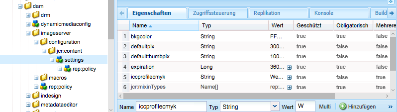

# Konfigurieren von Dynamic Media - Hybridmodus {#configuring-dynamic-media-hybrid-mode}

>[!CAUTION]
>
>AEM 6.4 hat das Ende der erweiterten Unterstützung erreicht und diese Dokumentation wird nicht mehr aktualisiert. Weitere Informationen finden Sie in unserer [technische Unterstützung](https://helpx.adobe.com/de/support/programs/eol-matrix.html). Unterstützte Versionen suchen [here](https://experienceleague.adobe.com/docs/?lang=de).

Dynamic Media - Hybrid muss aktiviert und für die Verwendung konfiguriert werden. Je nach Anwendungsfall verfügt Dynamic Media über mehrere [unterstützte Konfigurationen](#supported-dynamic-media-configurations).

>[!NOTE]
>
>Informationen zum Konfigurieren und Ausführen von Dynamic Media im Scene7-Ausführungsmodus finden Sie unter [Konfigurieren von Dynamic Media - Scene7-Modus](config-dms7.md).
>
>Wenn Sie Dynamic Media im Hybrid-Ausführungsmodus konfigurieren und ausführen möchten, befolgen Sie die Anweisungen auf dieser Seite.

Informieren Sie sich über die Verwendung von [Videos](video.md) in Dynamic Media.

Wenn Sie Adobe Experience Manager für unterschiedliche Umgebungen eingerichtet haben (z. B. je eine Instanz für die Entwicklung, das Staging und die Live-Produktion), müssen Sie Dynamic Media Cloud Services für jede Umgebung konfigurieren.

Wenn Sie Probleme mit Ihrer Dynamic Media-Konfiguration haben, sollten Sie die für dynamische Medien spezifischen Protokolldateien anzeigen. Diese werden automatisch installiert, wenn Sie Dynamic Media aktivieren:

* `s7access.log`
* `ImageServing.log`

Sie werden in [Überwachen und Verwalten der AEM-Instanz](/help/sites-deploying/monitoring-and-maintaining.md).

Die hybride Veröffentlichung und Bereitstellung ist eine Kernfunktion der Erweiterung Dynamic Media für Adobe Experience Manager. Mit der Hybrid-Veröffentlichung können Sie Dynamic Media-Assets wie Bilder, Sets und Videos aus der Cloud und nicht aus den AEM Veröffentlichungsknoten bereitstellen.

Andere Inhalte wie Dynamic Media-Viewer, Site-Seiten und statische Inhalte werden weiterhin von den AEM Veröffentlichungsknoten bereitgestellt.

Wenn Sie Kunde von Dynamic Media sind, ist es erforderlich, dass Sie die hybride Bereitstellung als Bereitstellungsmechanismus für die gesamten Dynamic Media-Inhalte verwenden.

## Hybride Veröffentlichungsarchitektur für Videos {#hybrid-publishing-architecture-for-videos}


## Hybride Veröffentlichungsarchitektur für Bilder {#hybrid-publishing-architecture-for-images}


## Unterstützte Dynamic Media-Konfigurationen {#supported-dynamic-media-configurations}

Die folgenden Konfigurationsaufgaben beziehen sich auf die folgenden Begriffe:

| **Begriff** | **Dynamic Media aktiviert** | **Beschreibung** |
|---|---|---|
| AEM Autorenknoten | Weißes Häkchen in einem grünen Kreis | Der Autorknoten, den Sie On-Premise oder über Managed Services bereitstellen. |
| Veröffentlichungsknoten AEM | Weißes „X“ in einem roten Quadrat. | Der Veröffentlichungsknoten, den Sie On-Premise oder über Managed Services bereitstellen. |
| Veröffentlichungsknoten des Bilddienstes | Weißes Häkchen in einem grünen Kreis. | Der Veröffentlichungsknoten, den Sie in von Adobe verwalteten Datenzentren ausführen. Bezieht sich auf die Bilddienst-URL. |

Sie können Dynamic Media nur für die Bildbearbeitung, nur für Videos oder sowohl für die Bildbearbeitung als auch für Videos implementieren. Informationen zum Konfigurieren von Dynamic Media für Ihr spezifisches Szenario finden Sie in der folgenden Tabelle.

<table> 
 <tbody> 
  <tr> 
   <td><strong>Szenario</strong></td> 
   <td><strong>Funktionsweise</strong></td> 
   <td><strong>Konfigurationsschritte</strong></td> 
  </tr> 
  <tr> 
   <td>NUR Bilder in der Produktion bereitstellen</td> 
   <td>Bilder werden über Server in den weltweiten Rechenzentren von Adobe bereitgestellt und dann von einem CDN zwischengespeichert, um eine skalierbare Leistung und globale Reichweite zu erzielen.</td> 
   <td> 
    <ol> 
     <li>AEM <strong>author</strong> Knoten, <a href="#enabling-dynamic-media">dynamische Medien aktivieren</a>.</li> 
     <li>Bildbearbeitung konfigurieren <a href="#configuring-dynamic-media-cloud-services">Dynamic Media Cloud Services</a>.</li> 
     <li><a href="#configuring-image-replication">Konfigurieren Sie die Bildreplikation</a>.</li> 
     <li><a href="#replicating-catalog-settings">Replizieren Sie die Katalogeinstellungen</a>.</li> 
     <li><a href="#replicating-viewer-presets">Replizieren Sie die Viewer-Vorgaben</a>.</li> 
     <li><a href="#using-default-asset-filters-for-replication">Verwenden Sie die Asset-Standardfilter für die Replikation</a>.</li> 
     <li><a href="#configuring-dynamic-media-image-server-settings">Konfigurieren Sie Bild-Server-Einstellungen für Dynamic Media</a>.</li> 
     <li><a href="#delivering-assets">Stellen Sie Assets bereit</a>.</li> 
    </ol> </td> 
  </tr> 
  <tr> 
   <td>NUR Bilder vor der Produktion bereitstellen (Entwicklung, QE, Staging usw.)</td> 
   <td>Bilder werden über den AEM Veröffentlichungsknoten bereitgestellt. Da in diesem Fall nur wenig Traffic verfügbar ist, müssen keine Bilder an das Rechenzentrum von Adobe gesendet werden. Ein weiterer Vorteil besteht darin, dass dies eine sichere Vorschau von Inhalten vor dem Start der Produktion ermöglicht</td> 
   <td> 
    <ol> 
     <li>AEM <strong>author</strong> Knoten, <a href="#enabling-dynamic-media">dynamische Medien aktivieren</a>.</li> 
     <li>Bei AEM <strong>publish</strong> Knoten, <a href="#enabling-dynamic-media">dynamische Medien aktivieren</a>.</li> 
     <li><a href="#replicating-viewer-presets">Replizieren Sie die Viewer-Vorgaben</a>.</li> 
     <li>Einrichten <a href="#setting-up-asset-filters-for-imaging-in-non-production-deployments">Asset-Filter für Nicht-Produktions-Bilder</a>.</li> 
     <li><a href="#configuring-dynamic-media-image-server-settings">Konfigurieren Sie Dynamic Media-Bildserver-Einstellungen.</a></li> 
     <li><a href="#delivering-assets">Stellen Sie Assets bereit.</a></li> 
    </ol> </td> 
  </tr> 
  <tr> 
   <td>NUR Videos in beliebigen Umgebungen bereitstellen (Produktion, Entwicklung, QE, Staging usw.)</td> 
   <td>Videos werden vom CDN für skalierbare Leistung und eine globale Reichweite bereitgestellt und zwischengespeichert. Das Videobild (Miniaturansicht des Videos, das vor dem Start der Wiedergabe angezeigt wird) wird von der AEM Veröffentlichungsinstanz bereitgestellt.</td> 
   <td> 
    <ol> 
     <li>AEM <strong>author</strong> Knoten, <a href="#enabling-dynamic-media">dynamische Medien aktivieren</a>.</li> 
     <li>AEM <strong>publish</strong> Knoten, <a href="#enabling-dynamic-media">dynamische Medien aktivieren</a> (Die Veröffentlichungsinstanz stellt das Videobild bereit und stellt Metadaten für die Videowiedergabe bereit).</li> 
     <li>Video konfigurieren in <a href="#configuring-dynamic-media-cloud-services">Dynamic Media-Cloud Services.</a></li> 
     <li><a href="#replicating-viewer-presets">Replizieren Sie die Viewer-Vorgaben</a>.</li> 
     <li>Einrichten <a href="#setting-up-asset-filters-for-video-only-deployments">Asset-Filter für "Nur Video"</a>.</li> 
     <li><a href="#delivering-assets">Stellen Sie Assets bereit.</a></li> 
    </ol> </td> 
  </tr> 
  <tr> 
   <td>Bereitstellen VON SOWOHL Bildern als auch Videos in der Produktion</td> 
   <td><p>Videos werden vom CDN für skalierbare Leistung und eine globale Reichweite bereitgestellt und zwischengespeichert. Bilder und Videobilder werden über Server in den weltweiten Rechenzentren von Adobe bereitgestellt und dann von einem CDN zwischengespeichert, um eine skalierbare Leistung und globale Reichweite zu erzielen.</p> <p>Informationen zum Einrichten von Bildern oder Videos in der Vorproduktion finden Sie in den vorherigen Abschnitten. </p> </td> 
   <td> 
    <ol> 
     <li>AEM <strong>author</strong> Knoten, <a href="#enabling-dynamic-media">dynamische Medien aktivieren</a>.</li> 
     <li>Video konfigurieren in <a href="#configuring-dynamic-media-cloud-services">Dynamic Media-Cloud Services.</a></li> 
     <li>Bildbearbeitung konfigurieren <a href="#configuring-dynamic-media-cloud-services">Dynamic Media-Cloud Services.</a></li> 
     <li><a href="#configuring-image-replication">Konfigurieren Sie die Bildreplikation</a>.</li> 
     <li><a href="#replicating-catalog-settings">Replizieren Sie die Katalogeinstellungen</a>.</li> 
     <li><a href="#replicating-viewer-presets">Replizieren Sie die Viewer-Vorgaben</a>.</li> 
     <li><a href="#using-default-asset-filters-for-replication">Verwenden Sie Asset-Standardfilter für die Replikation.</a></li> 
     <li><a href="#configuring-dynamic-media-image-server-settings">Konfigurieren Sie Dynamic Media-Bildserver-Einstellungen.</a></li> 
     <li><a href="#delivering-assets">Stellen Sie Assets bereit.</a></li> 
    </ol> </td> 
  </tr> 
 </tbody> 
</table>

## Aktivieren von Dynamic Media {#enabling-dynamic-media}

[Dynamische Medien](https://www.adobe.com/de/solutions/web-experience-management/dynamic-media.html) ist standardmäßig deaktiviert. Um die Funktionen von Dynamic Media nutzen zu können, müssen Sie Dynamic Media mithilfe der **[!UICONTROL dynamicmedia]** den Ausführungsmodus ausführen, wie Sie es beispielsweise tun würden **[!UICONTROL publish]** Ausführungsmodus. Prüfen Sie vor dem Aktivieren die [technischen Anforderungen](/help/sites-deploying/technical-requirements.md#requirements-for-aem-dynamic-media-add-on).

>[!NOTE]
>
>Die Aktivierung von Dynamic Media über den Ausführungsmodus ersetzt die Funktionalität in AEM 6.1 und AEM 6.0, in der Sie dynamische Medien aktiviert haben, indem Sie die **[!UICONTROL dynamicMediaEnabled]** Markierung auf **[!UICONTROL true]**. Dieses Flag hat keine Funktionalität in AEM 6.2 und höher. Außerdem müssen Sie den Schnellstart nicht neu starten, um dynamische Medien zu aktivieren.

Durch die Aktivierung von Dynamic Media sind die Dynamic Media-Funktionen in der Benutzeroberfläche verfügbar und jedes hochgeladene Bild-Asset erhält einen `cqdam.pyramid.tiff` Ausgabedarstellung, die für die schnelle Bereitstellung dynamischer Bildausgabeformate verwendet wird. Diese PTIFF-Dateien bieten erhebliche Vorteile, z. B.: 1) die Möglichkeit, nur ein einziges Übergeordnetes Bild zu verwalten und unendliche Ausgabeformate ohne zusätzlichen Speicher zu generieren und 2) die Möglichkeit, interaktive Visualisierungen wie Zoom, Schwenken, Drehen usw. zu verwenden.

Wenn Sie Dynamic Media Classic in AEM verwenden möchten, sollten Sie Dynamic Media nur aktivieren, wenn Sie eine [spezifisches Szenario](/help/sites-administering/scene7.md#aem-scene-integration-versus-dynamic-media). Dynamic Media ist deaktiviert, es sei denn, Sie aktivieren Dynamic Media über den Ausführungsmodus.

Um dynamische Medien zu aktivieren, müssen Sie den Ausführungsmodus für dynamische Medien entweder über die Befehlszeile oder über den Namen der Schnellstart-Datei aktivieren.

**So aktivieren Sie dynamische Medien**:

1. In der Befehlszeile haben Sie nach dem Starten des Schnellstartvorgangs die folgenden Möglichkeiten:

   * Hinzufügen **[!UICONTROL -r dynamicmedia]** an das Ende der Befehlszeile beim Starten der JAR-Datei.

   ```shell
   java -Xmx4096m -Doak.queryLimitInMemory=500000 -Doak.queryLimitReads=500000 -jar cq-quickstart-6.4.0.jar -r dynamicmedia
   ```

   Wenn Sie in s7delivery veröffentlichen, müssen Sie auch die folgenden trustStore-Argumente einbeziehen:

   ```shell
   -Djavax.net.ssl.trustStore=<absoluteFilePath>/customerTrustStoreFileName>
   
    -Djavax.net.ssl.trustStorePassword=<passwordForTrustStoreFile>
   ```

1. Anfrage `http://localhost:4502/is/image` und stellen Sie sicher, dass Image Server jetzt ausgeführt wird.

   >[!NOTE]
   >
   >Informationen zur Fehlerbehebung bei Problemen mit Dynamic Media finden Sie in den folgenden Protokollen im **[!UICONTROL crx-quickstart/logs/]** directory:
   >
   >* ImageServer-&lt;PortId>-&lt;yyyy>&lt;mm>&lt;dd>.log – Das ImageServer-Protokoll enthält Statistiken und Analyseinformationen, die zum Analysieren des Verhaltens des internen ImageServer-Prozesses verwendet werden.

      Beispiel für einen Image-Server-Protokolldateinamen: `ImageServer-57346-2019-07-25.log`
   * s7access-&lt;yyyy>&lt;mm>&lt;dd>.log - Im s7access-Protokoll werden alle Anfragen aufgezeichnet, die über `/is/image` und `/is/content` an Dynamic Media gesendet werden.
   Diese Protokolle werden nur verwendet, wenn Dynamic Media aktiviert ist. Sie sind nicht im **VollHerunterladen** -Paket, das aus der **[!UICONTROL system/console/status-Bundlelist]** Seite; Wenn Sie den Kundensupport aufrufen, wenn Sie ein Dynamic Media-Problem haben, hängen Sie beide Protokolle an das Problem an.

### Wenn Sie AEM auf einen anderen Port oder Kontextpfad installiert haben ... {#if-you-installed-aem-to-a-different-port-or-context-path}

Wenn Sie [AEM an einen Anwendungsserver](/help/sites-deploying/application-server-install.md) und Dynamic Media aktiviert ist, müssen Sie die **self** Domäne im Externalizer. Andernfalls funktioniert die Erstellung von Miniaturansichten für Assets nicht ordnungsgemäß für Dynamic Media-Assets.

Wenn Sie Quickstart außerdem an einem anderen Port oder Kontextpfad ausführen, müssen Sie auch die **self** Domäne.

Wenn Dynamic Media aktiviert ist, werden die statischen Miniaturansicht-Ausgabedarstellungen für Bild-Assets mit Dynamic Media generiert. Damit die Erstellung von Miniaturansichten für dynamische Medien ordnungsgemäß funktioniert, muss AEM eine URL-Anfrage an sich selbst richten und sowohl die Portnummer als auch den Kontextpfad kennen.

AEM:

* Die **self** Domäne in [Externalizer](/help/sites-developing/externalizer.md) wird verwendet, um sowohl die Portnummer als auch den Kontextpfad abzurufen.
* Wenn nicht **self** -Domäne konfiguriert ist, werden die Portnummer und der Kontextpfad vom Jetty-HTTP-Dienst abgerufen.

In einer AEM QuickStart-WAR-Bereitstellung können die Portnummer und der Kontextpfad nicht abgeleitet werden. Daher müssen Sie eine **self** Domäne. Siehe [Externalizer-Dokumentation](/help/sites-developing/externalizer.md) zur Konfiguration der **self** Domäne.

>[!NOTE]
In einer [AEM eigenständige Schnellstart-Bereitstellung](/help/sites-deploying/deploy.md), **self** Die Domäne muss im Allgemeinen nicht konfiguriert werden, da die Portnummer und der Kontextpfad automatisch konfiguriert werden können. Wenn jedoch alle Netzwerkschnittstellen deaktiviert sind, müssen Sie die **self** Domäne.

## Deaktivieren von Dynamic Media  {#disabling-dynamic-media}

Dynamische Medien sind standardmäßig nicht aktiviert. Wenn Sie Dynamic Media jedoch bereits aktiviert haben, können Sie es zu einem späteren Zeitpunkt deaktivieren.

Um dynamische Medien zu deaktivieren, nachdem Sie sie aktiviert haben, entfernen Sie die **[!UICONTROL -r dynamicmedia]** Ausführungsmodus-Flag.

**So deaktivieren Sie Dynamic Media nach der Aktivierung**:

1. In der Befehlszeile haben Sie nach dem Starten des Schnellstartvorgangs die beiden folgenden Möglichkeiten:

   * Nicht hinzufügen `-r dynamicmedia` zur Befehlszeile beim Starten der JAR-Datei.

   ```shell
   java -Xmx4096m -Doak.queryLimitInMemory=500000 -Doak.queryLimitReads=500000 -jar cq-quickstart-6.4.0.jar
   ```

1. Fragen Sie `http://localhost:4502/is/image` an. Sie erhalten eine Nachricht, dass Dynamic Media deaktiviert wurde.

   >[!NOTE]
   Wenn der Dynamic Media-Ausführungsmodus deaktiviert wurde, wird der Workflow-Schritt zum Generieren der Ausgabedarstellungsformats `qdam.pyramid.tiff` automatisch übersprungen. Dadurch werden auch die Unterstützung für dynamische Ausgabedarstellungen und andere Dynamic Media-Funktionen deaktiviert.
   Beachten Sie außerdem, dass beim Deaktivieren des Dynamic Media-Ausführungsmodus nach dem Konfigurieren des AEM-Servers alle Assets, die unter diesem Ausführungsmodus hochgeladen wurden, jetzt ungültig sind.

## (Optional) Migration von Dynamic Media-Vorgaben und -Konfigurationen von 6.3 auf 6.4 ohne Ausfallzeiten {#optional-migrating-dynamic-media-presets-and-configurations-from-to-zero-downtime}

Wenn Sie ein Upgrade AEM Dynamic Media von 6.3 auf 6.4 durchführen, was jetzt die Möglichkeit bietet, keine Ausfallzeiten (auch Opt-in-Implementierungen genannt) zu verursachen, müssen Sie den folgenden curl-Befehl ausführen, um alle Vorgaben und Konfigurationen von zu migrieren `/etc` nach `/conf` in der CRXDE Lite.

**Hinweis**: Wenn Sie Ihre AEM-Instanz im Kompatibilitätsmodus ausführen (d. h., Sie haben die Kompatibilität installiert), müssen Sie diese Befehle nicht ausführen.

So migrieren Sie Ihre benutzerdefinierten Vorgaben und Konfigurationen aus `/etc` nach `/conf`, führen Sie den folgenden Linux-curl-Befehl aus:

`curl -u admin:admin http://localhost:4502/libs/settings/dam/dm/presets.migratedmcontent.json`

Bei allen Upgrades mit oder ohne Kompatibilitätspaket können Sie die standardmäßig vorhandenen Viewer-Vorgaben kopieren, indem Sie den folgenden Befehl ausführen:

`curl -u admin:admin http://localhost:4502/libs/settings/dam/dm/presets/viewer.pushviewerpresets`

## Konfigurieren der Bildreplikation {#configuring-image-replication}

Die Dynamic Media-Bildbereitstellung funktioniert durch die Veröffentlichung von Bild-Assets, einschließlich Videominiaturen, aus der AEM-Autoreninstanz und die Replikation dieser Assets auf den On-Demand-Replikationsdienst der Adobe (die Replikationsdienst-URL). Die Assets werden dann über den Service für die On-Demand-Bildbereitstellung (Bildservice-URL) bereitgestellt.

Sie müssen Folgendes tun:

1. [Einrichten der Authentifizierung](#setting-up-authentication)
1. [Konfigurieren des Replikationsagenten](#configuring-the-replication-agent)

Der Replikationsagent veröffentlicht Dynamic Media-Assets, z. B. Bilder, Videometadaten und Sätze, für den von Adobe gehosteten Bilddienst. Der Replikationsagent ist nicht standardmäßig aktiviert.

Nachdem Sie den Replikationsagenten konfiguriert haben, müssen Sie [validieren und testen, ob die Einrichtung erfolgreich war](#validating-the-replication-agent-for-dynamic-media). In diesem Abschnitt werden diese Vorgehensweisen beschrieben.

>[!NOTE]
Die standardmäßige Speicherbegrenzung für die PTIFF-Erstellung beträgt 3 GB für alle Workflows. Sie können beispielsweise ein Bild verarbeiten, für das 3 GB Arbeitsspeicher erforderlich sind, während andere Workflows angehalten werden, oder 10 Bilder parallel verarbeiten, die jeweils 300 MB Arbeitsspeicher benötigen.
Die Speicherbegrenzung ist konfigurierbar und sollte an die Verfügbarkeit der Systemressourcen und den Typ des verarbeiteten Bildinhalts angepasst werden. Wenn Sie viele sehr große Assets haben und genügend Speicher im System haben, können Sie diese Grenze erhöhen, um sicherzustellen, dass die Bilder parallel verarbeitet werden.
Ein Bild, das mehr als die maximale Speicherbegrenzung erfordert, wird abgelehnt.
Navigieren Sie zum Ändern der Speicherbegrenzung für die PTIFF-Erstellung zu **[!UICONTROL Tools > Vorgänge > Web-Konsole > Adobe CQ Scene7 PTiffManager]** und ändern Sie den Wert `maxMemory`.

### Einrichten der Authentifizierung {#setting-up-authentication}

Sie müssen die Replikationsauthentifizierung für die Autoreninstanz einrichten, um Bilder für den Dynamic Media-Bildbereitstellungsdienst zu replizieren. Rufen Sie dazu einen KeyStore ab und speichern Sie ihn dann im **[!UICONTROL dynamic-media-replication]** und konfigurieren Sie sie. Ihr Unternehmensadministrator sollte während des Bereitstellungsprozesses eine Begrüßungs-E-Mail mit der KeyStore-Datei und den erforderlichen Anmeldeinformationen erhalten haben. Wenn Sie diese nicht erhalten haben, wenden Sie sich an den Support.

**Gehen Sie wie folgt vor, um die Authentifizierung einzurichten**:

1. Wenden Sie sich an den Support, wenn Sie noch nicht über eine KeyStore-Datei und ein Kennwort verfügen. Dies ist Teil der Bereitstellung und verknüpft die Schlüssel mit Ihrem Konto.
1. Tippen Sie AEM auf das AEM Logo, um auf die globale Navigationskonsole zuzugreifen, und tippen Sie dann auf **[!UICONTROL Tools > Sicherheit > Benutzer]**.
1. Navigieren Sie auf der Seite &quot;Benutzerverwaltung&quot;zur **[!UICONTROL dynamic-media-replication]** Benutzer und tippen Sie dann zum Öffnen auf .

   

1. Tippen Sie auf der Seite Benutzereinstellungen für dynamic-media-replication bearbeiten auf die **[!UICONTROL Keystore]** Registerkarte und tippen Sie dann auf **[!UICONTROL KeyStore erstellen]**.

   

1. Geben Sie im Dialogfeld **[!UICONTROL Zugangskennwort für KeyStore festlegen]** ein Kennwort ein und bestätigen Sie es.

   >[!NOTE]
   Merken Sie sich das von Ihnen eingegebene Kennwort. Sie müssen sie erneut eingeben, wenn Sie die **[!UICONTROL Replikationsagent]** später.

   

1. Erweitern Sie auf der Seite **[!UICONTROL Benutzereinstellungen für dynamic-media-replication bearbeiten]** den Bereich **[!UICONTROL Privaten Schlüssel aus KeyStore-Datei hinzufügen]** und fügen Sie Folgendes ein (siehe folgende Abbildungen):

   * Im **[!UICONTROL Neuer Alias]** Geben Sie den Namen eines Alias ein, den Sie später in der Replikationskonfiguration verwenden werden. Beispiel: **Replikation**.
   * Tippen **[!UICONTROL KeyStore-Datei]**. Navigieren Sie zur KeyStore-Datei, die Sie nach Adobe erhalten haben, wählen Sie sie aus und tippen Sie auf **[!UICONTROL Öffnen]**.
   * Geben Sie im Feld **[!UICONTROL Kennwort für KeyStore-Datei]** das Kennwort für die KeyStore-Datei ein. Dies ist _not_ das KeyStore-Kennwort, das Sie in Schritt 5 erstellt haben, aber die KeyStore-Adobe für das Kennwort für die Datei ist, die in der Begrüßungs-E-Mail bereitgestellt wird, die Sie während der Bereitstellung erhalten haben. Wenden Sie sich an dien Kunden-Support von Adobe, um Ihr Kennwort zu erhalten (falls noch nicht vorhanden).
   * Im **[!UICONTROL Passwort für privaten Schlüssel]** Geben Sie das Kennwort des privaten Schlüssels ein (es kann sich um dasselbe Kennwort für den privaten Schlüssel handeln, das im vorherigen Schritt bereitgestellt wurde). Das Kennwort für den privaten Schlüssel ist in der Begrüßungs-E-Mail von Adobe enthalten, die während der Bereitstellung an Sie gesendet wird. Nehmen Sie Kontakt mit dem Kunden-Support von Adobe auf, falls Sie kein Kennwort für den privaten Schlüssel erhalten haben.
   * Geben Sie im Feld **[!UICONTROL Alias für privaten Schlüssel]** den Alias für den privaten Schlüssel ein, z. B. `companyname-alias`. Der Alias für den privaten Schlüssel ist in der Begrüßungs-E-Mail von Adobe enthalten, die während der Bereitstellung an Sie gesendet wird. Nehmen Sie Kontakt mit dem Kunden-Support von Adobe auf, falls Sie keinen Alias für den privaten Schlüssel erhalten haben.

   

1. Tippen **[!UICONTROL Speichern und schließen]** , um Ihre Änderungen an diesem Benutzer zu speichern.

   Als Nächstes müssen Sie [den Replikationsagenten konfigurieren.](#configuring-the-replication-agent)

### Konfigurieren des Replikationsagenten {#configuring-the-replication-agent}

1. Tippen Sie AEM auf das AEM Logo, um auf die globale Navigationskonsole zuzugreifen, und tippen Sie dann auf **[!UICONTROL Tools > Bereitstellung > Replikation > Agenten für Autor]**.
1. Tippen Sie auf der Seite &quot;Agenten für Autor&quot;auf **[!UICONTROL Dynamic Media Hybrid-Bildreplikation (s7delivery)]**.
1. Tippen Sie auf **[!UICONTROL Bearbeiten]**.
1. Tippen Sie auf **[!UICONTROL Einstellungen]** und geben Sie Folgendes ein:

   * **[!UICONTROL Aktiviert]**: Markieren Sie dieses Kontrollkästchen, um den Replikationsagenten zu aktivieren.
   * **[!UICONTROL Region]**: Legen Sie die passende Region fest: Nordamerika, Europa oder Asien.
   * **[!UICONTROL Mandanten-ID]**: Dieser Wert ist der Name Ihres Unternehmens bzw. Mandanten, von dem der Replikationsdienst veröffentlicht wird. Dieser Wert ist die Mandanten-ID aus der Begrüßungs-E-Mail von Adobe, die Sie während der Bereitstellung erhalten haben. Wenden Sie sich an den Support von Adobe , wenn Sie diese nicht erhalten haben.
   * **[!UICONTROL Key Store Alias]** - Dieser Wert entspricht dem Wert für &quot;Neuer Alias&quot;, der beim Generieren des Schlüssels in [Einrichten der Authentifizierung](#setting-up-authentication); Beispiel: `replication`. (Siehe Schritt 7 unter [Einrichten der Authentifizierung](#setting-up-authentication).)
   * **[!UICONTROL Key Store Password]** - Dies ist das KeyStore-Kennwort, das erstellt wurde, als Sie auf **[!UICONTROL KeyStore erstellen]**. Dieses Kennwort wird nicht von Adobe bereitgestellt. Siehe Schritt 5 von [Einrichten der Authentifizierung](#setting-up-authentication).

   In der folgenden Abbildung ist der Replikationsagent mit Beispieldaten dargestellt:

   

1. Tippen Sie auf **[!UICONTROL OK]**.

### Überprüfen des Replikationsagenten für Dynamic Media {#validating-the-replication-agent-for-dynamic-media}

Gehen Sie wie folgt vor, um den Replikationsagenten auf dynamische Medien zu überprüfen:

Tippen **[!UICONTROL Verbindung testen]**. Die Beispielausgabe lautet wie folgt:

```shell
11.03.2016 10:57:55 - Transferring content for ReplicationAction{type=TEST, path[0]='/content/dam', time=1457722675402, userId='admin', revision='null'}
11.03.2016 10:57:55 - * Auth User: replication-receiver
11.03.2016 10:57:55 - * HTTP Version: 1.1
11.03.2016 10:57:55 - * Using OAuth 2.0 Authorization Grants
11.03.2016 10:57:55 - * OAuth 2.0 User: dynamic-media-replication
11.03.2016 10:57:55 - * OAuth 2.0 Token: '*****' initialized
11.03.2016 10:57:55 - Publishing: POST[https://replicate-na.assetsadobe.com:8580/is-publish/publish-receiver?Cmd=Test&RootId=xfpuu-6613]
11.03.2016 10:57:55 - Publish response: OK[]
11.03.2016 10:57:55 - Transfer succeeded in 141 ms for ReplicationAction{type=TEST, path[0]='/content/dam', time=1457722675402, userId='admin', revision='null'}
-------------------------------------------------------------------------------------------------------------------------------
Replication test succeeded
```

>[!NOTE]
Sie können dies auch überprüfen, indem Sie einen der folgenden Schritte ausführen:
* Überprüfen Sie die Replikationsprotokolle, um sicherzustellen, dass das Asset repliziert wird.
* Veröffentlichen Sie ein Bild. Tippen Sie auf das Bild und wählen Sie **[!UICONTROL Viewer]** im Dropdown-Menü. Wählen Sie eine Viewer-Vorgabe aus und tippen Sie dann auf **[!UICONTROL URL]** und kopieren Sie die URL und fügen Sie sie in den Browser ein, um sicherzustellen, dass das Bild angezeigt wird.


### Durchführen der Fehlerbehebung für die Authentifizierung {#troubleshooting-authentication}

Beim Einrichten der Authentifizierung treten bei den Lösungen möglicherweise einige Probleme auf. Stellen Sie vor der Überprüfung sicher, dass Sie die Replikation eingerichtet haben.

#### Problem: HTTP-Status-Code 401 mit der Meldung „Authorization Required“ (Autorisierung erforderlich) {#problem-http-status-code-with-message-authorization-required}

Dieses Problem kann auftreten, wenn der KeyStore für den Benutzer `dynamic-media-replication` nicht eingerichtet wurde.

```shell
Replication test to s7delivery:https://s7bern.macromedia.com:8580/is-publish/
17.06.2016 18:54:43 - Transferring content for ReplicationAction{type=TEST, path[0]='/content/dam', time=1466214883309, userId='admin', revision='null'}
17.06.2016 18:54:43 - * Auth User: replication-receiver
17.06.2016 18:54:43 - * HTTP Version: 1.1
17.06.2016 18:54:43 - * Using OAuth 2.0 Authorization Grants
17.06.2016 18:54:43 - * OAuth 2.0 User: dynamic-media-replication
17.06.2016 18:54:43 - No OAuth token available. OAuth not initialized
17.06.2016 18:54:43 - * Using Client Auth SSL alias - replication-alias *
17.06.2016 18:54:43 - Publishing: POST[https://<localhost>:8580/is-publish//publish-receiver?Cmd=Test&RootId=brough]
17.06.2016 18:54:43 - Transfer failed for ReplicationAction{type=TEST, path[0]='/content/dam', time=1466214883309, userId='admin', revision='null'}. java.io.IOException: Failed to execute request
'https://<localhost>:8580/is-publish//publish-receiver?Cmd=Test&RootId=brough':
 Server returned status code 401 with message: Authorization required.
17.06.2016 18:54:43 - Error while replicating: com.day.cq.replication.ReplicationException: Transfer failed for ReplicationAction{type=TEST, path[0]='/content/dam', time=1466214883309,
 userId='admin', revision='null'}. java.io.IOException: Failed to execute request
'https://<localhost>:8580/is-publish//publish-receiver?Cmd=Test&RootId=brough':
 Server returned status code 401 with message: Authorization required.
```

**Lösung**: Stellen Sie sicher, dass die `KeyStore` gespeichert in **[!UICONTROL dynamic-media-replication]** und das richtige Kennwort erhalten.

#### Problem: Schlüssel kann nicht entschlüsselt werden – Daten können nicht entschlüsselt werden {#problem-could-not-decrypt-key-could-not-decrypt-data}

```xml
Replication test to s7delivery:https://<localhost>:8580/is-publish/
17.06.2016 19:00:16 - Transferring content for ReplicationAction{type=TEST, path[0]='/content/dam', time=1466215216662, userId='admin', revision='null'}
17.06.2016 19:00:16 - * Auth User: replication-receiver
17.06.2016 19:00:16 - * HTTP Version: 1.1
17.06.2016 19:00:16 - * Using OAuth 2.0 Authorization Grants
17.06.2016 19:00:16 - * OAuth 2.0 User: dynamic-media-replication
17.06.2016 19:00:16 - No OAuth token available. OAuth not initialized
17.06.2016 19:00:16 - * Using Client Auth SSL alias - replication-alias *
17.06.2016 19:00:16 - Transfer failed for ReplicationAction{type=TEST, path[0]='/content/dam', time=1466215216662, userId='admin', revision='null'}. java.lang.SecurityException: java.security.UnrecoverableKeyException: Could not decrypt key: Could not decrypt data.
```

**Lösung**: Überprüfen Sie das Kennwort. Das im Replikationsagenten gespeicherte Kennwort entspricht nicht dem Kennwort, das zum Erstellen eines Keystore verwendet wurde.

#### Problem: InvalidAlgorithmParameterException {#problem-invalidalgorithmparameterexception}

Dieses Problem wird durch einen Konfigurationsfehler in Ihrer AEM-Autoreninstanz verursacht. Der Java-Prozess im Autor erhält nicht die richtige `javax.net.ssl.trustStore`. Dieser Fehler wird im Replikationsprotokoll angezeigt:

```shell
14.04.2016 09:37:43 - Transfer failed for ReplicationAction{type=TEST, path[0]='/content/dam', time=1460651862089, userId='admin', revision='null'}. java.io.IOException: Failed to execute request 'https://<localhost>:8580/is-publish/publish-receiver?Cmd=Test&RootId=rbrough-osx2': java.lang.RuntimeException: Unexpected error: java.security.InvalidAlgorithmParameterException: the trustAnchors parameter must be non-empty
14.04.2016 09:37:43 - Error while replicating: com.day.cq.replication.ReplicationException: Transfer failed for ReplicationAction{type=TEST, path[0]='/content/dam', time=1460651862089, userId='admin', revision='null'}. java.io.IOException: Failed to execute request 'https://<localhost>:8580/is-publish/publish-receiver?Cmd=Test&RootId=rbrough-osx2': java.lang.RuntimeException: Unexpected error: java.security.InvalidAlgorithmParameterException: the trustAnchors parameter must be non-empty
```

Oder das Fehlerprotokoll:

```shell
07.25.2019 12:00:59.893 *ERROR* [sling-threadpool-db2763bb-bc50-4bb5-bb64-10a09f432712-(apache-sling-job-thread-pool)-90-com_day_cq_replication_job_s7delivery(com/day/cq/replication/job/s7delivery)] com.day.cq.replication.Agent.s7delivery.queue Error during processing of replication.
 
java.io.IOException: Failed to execute request 'https://replicate-na.assetsadobe.com:8580/is-publish/publish-receiver?Cmd=Test&RootId=rbrough-osx': java.lang.RuntimeException: Unexpected error: java.security.InvalidAlgorithmParameterException: the trustAnchors parameter must be non-empty
        at com.scene7.is.catalog.service.publish.atomic.PublishingServiceHttp.executePost(PublishingServiceHttp.scala:195)
```

**Lösung**: Stellen Sie sicher, dass der Java-Prozess in der AEM-Autoreninstanz über die Systemeigenschaft verfügt. **-Djavax.net.ssl.trustStore=** auf einen gültigen TrustStore gesetzt.

#### Problem: KeyStore ist entweder nicht eingerichtet oder nicht initialisiert {#problem-keystore-is-either-not-set-up-or-it-is-not-initialized}

Dieses Problem kann durch einen Hotfix oder ein Feature Pack verursacht werden, das die **[!UICONTROL dynamic-media-user]** oder **[!UICONTROL keystore]** Knoten.

Beispiel für Replikationsprotokoll:

```shell
Replication test to s7delivery:https://replicate-na.assetsadobe.com/is-publish
02.08.2016 14:37:44 - Transferring content for ReplicationAction{type=TEST, path[0]='/content/dam', time=1470173864834, userId='admin', revision='null'}
02.08.2016 14:37:44 - * Auth User: replication-receiver
02.08.2016 14:37:44 - * HTTP Version: 1.1
02.08.2016 14:37:44 - * Using OAuth 2.0 Authorization Grants
02.08.2016 14:37:44 - * OAuth 2.0 User: dynamic-media-replication
02.08.2016 14:37:44 - Transfer failed for ReplicationAction{type=TEST, path[0]='/content/dam', time=1470173864834, userId='admin', revision='null'}. com.adobe.granite.keystore.KeyStoreNotInitialisedException: Uninitialised key store for user dynamic-media-replication
```

**Lösung**:

1. Navigieren Sie zum **[!UICONTROL Benutzerverwaltung]** Seite:

   `localhost:4502/libs/granite/security/content/useradmin.html`
1. Im **[!UICONTROL Benutzerverwaltung]** Seite, navigieren Sie zur **[!UICONTROL dynamic-media-replication]** Benutzer und tippen Sie dann zum Öffnen auf .
1. Tippen Sie auf **[!UICONTROL KeyStore]** Registerkarte. Wenn die Variable **[!UICONTROL KeyStore erstellen]** angezeigt, müssen Sie die Schritte unter [Einrichten der Authentifizierung](#setting-up-authentication) früher.
1. Wenn Sie die **[!UICONTROL KeyStore]** einrichten, müssen Sie möglicherweise [Konfigurieren des Replikationsagenten](config-dynamic.md#configuring-the-replication-agent) auch wieder.

   Konfigurieren Sie den s7delivery-Replikationsagenten neu.

   `localhost:4502/etc/replication/agents.author/s7delivery.html`

1. Tippen **[!UICONTROL Verbindung testen]** , um zu überprüfen, ob die Konfiguration gültig ist.

#### Problem: Für den Veröffentlichungsagenten wird SSL anstelle von OAuth verwendet {#problem-publish-agent-is-using-ssl-instead-of-oauth}

Dieses Problem kann durch einen Hotfix oder ein Feature Pack verursacht werden, das nicht ordnungsgemäß installiert oder die Einstellungen überschrieben hat.

Beispiel für ein Replikationsprotokoll:

```shell
01.08.2016 18:42:59 - Transferring content for ReplicationAction{type=TEST, path[0]='/content/dam', time=1470073379634, userId='admin', revision='null'}
01.08.2016 18:42:59 - * Auth User: replication-receiver
01.08.2016 18:42:59 - * HTTP Version: 1.1
01.08.2016 18:42:59 - * Using Client Auth SSL alias - replication-receiver *
01.08.2016 18:42:59 - Publishing: POST[https://replicate-eu.assetsadobe2.com:443/is-publish/publish-receiver?Cmd=Test&RootId=altayerstaging]
01.08.2016 18:42:59 - Transfer failed for ReplicationAction{type=TEST, path[0]='/content/dam', time=1470073379634, userId='admin', revision='null'}. java.io.IOException: Failed to execute request 'https://replicate-eu.assetsadobe2.com:443/is-publish/publish-receiver?Cmd=Test&RootId=rbroughstaging': Server returned status code 401 with message: Authorization required.
01.08.2016 18:42:59 - Error while replicating: com.day.cq.replication.ReplicationException: Transfer failed for ReplicationAction{type=TEST, path[0]='/content/dam', time=1470073379634, userId='admin', revision='null'}. java.io.IOException: Failed to execute request 'https://replicate-eu.assetsadobe2.com:443/is-publish/publish-receiver?Cmd=Test&RootId=rbroughstaging': Server returned status code 401 with message: Authorization required.
```

**Lösung:**

1. Tippen Sie in AEM auf **[!UICONTROL Tools > Allgemein > CRXDE Lite]**.

   `localhost:4502/crx/de/index.jsp`

1. Navigieren Sie zum **[!UICONTROL s7delivery-Replikationsagent]** Knoten.

   `localhost:4502/crx/de/index.jsp#/etc/replication/agents.author/s7delivery/jcr:content`

1. Fügen Sie diese Einstellung dem Replikationsagenten hinzu (boolescher Wert mit der Einstellung **[!UICONTROL True]**):

   `enableOauth=true`

1. Tippen Sie in der oberen linken Ecke der Seite auf **[!UICONTROL Alle speichern]**.

### Konfiguration testen {#testing-your-configuration}

Adobe empfiehlt, für die Konfiguration einen umfassenden Test durchzuführen.

Stellen Sie sicher, dass Sie vor Beginn dieses Tests bereits Folgendes durchgeführt haben:

* Bildvorgaben hinzugefügt.
* Konfigurieren **Dynamic Media-Konfiguration (vor 6.3)** under **[!UICONTROL Cloud Services]**. Die Bilddienst-URL ist für diesen Test erforderlich.

Gehen Sie wie folgt vor, um die Konfiguration zu testen:

1. Laden Sie ein Bild-Asset hoch. (Tippen Sie in Assets auf **[!UICONTROL Erstellen > Dateien]** und wählen Sie die Datei aus.)
1. Warten Sie, bis der Workflow abgeschlossen ist.
1. Veröffentlichen Sie das Bild-Asset. (Wählen Sie das Asset aus und tippen Sie auf **[!UICONTROL Quick Publish]**.
1. Gehen Sie zu den Ausgabedarstellungen für dieses Bild, indem Sie das Bild öffnen und auf **[!UICONTROL Ausgabedarstellungen]** klicken bzw. tippen.

   

1. Wählen Sie eine beliebige dynamische Ausgabedarstellung aus.
1. Tippen **[!UICONTROL URL]** , um die URL für dieses Asset abzurufen.
1. Navigieren Sie zur ausgewählten URL und überprüfen Sie, ob sich das Bild wie erwartet verhält.

Eine andere Möglichkeit, zu testen, ob Ihre Assets bereitgestellt wurden, besteht darin, &quot;req=exists&quot;an Ihre URL anzuhängen.

## Konfigurieren von Dynamic Media Cloud Services {#configuring-dynamic-media-cloud-services}

Der Dynamic Media Cloud-Dienst bietet Unterstützung für Cloud-Services wie hybride Veröffentlichung und Bereitstellung von Bildern und Videos, Videoanalyse und Videokodierung.

Im Rahmen der Konfiguration müssen Sie eine Registrierungs-ID, eine Videodienst-URL, eine Bilddienst-URL, eine Replikationsdienst-URL eingeben und die Authentifizierung einrichten. Sie sollten alle diese Informationen im Rahmen des Kontobereitstellungsprozesses erhalten haben. Wenn Sie diese Informationen nicht erhalten haben, wenden Sie sich an Ihren Adobe Experience Manager-Administrator oder an den technischen Support der Adobe, um die Informationen zu erhalten.

>[!NOTE]
Stellen Sie vor dem Einrichten des Dynamic Media Cloud Service sicher, dass Sie Ihre Veröffentlichungsinstanz eingerichtet haben. Außerdem müssen Sie die Replikation einrichten, bevor Sie Dynamic Media Cloud Service konfigurieren.

**Konfigurieren von Dynamic Media-Cloud-Services**:

1. Tippen Sie in AEM auf das AEM -Logo, um auf die globale Navigationskonsole zuzugreifen, und tippen Sie auf **[!UICONTROL Tools > Cloud Services > Dynamic Media-Konfiguration (vor 6.3)]**.
1. Im **[!UICONTROL Dynamic Media-Konfigurationsbrowser]** Seite, im linken Bereich wählen Sie **[!UICONTROL global]** und tippen Sie dann auf **[!UICONTROL Erstellen]**.
1. Im **[!UICONTROL Dynamic Media-Konfiguration erstellen]** im Dialogfeld **[!UICONTROL Titel]** -Feld einen Titel eingeben.
1. Wenn Sie Dynamic Media für Video konfigurieren,

   * Geben Sie im Feld **[!UICONTROL Registrierungs-ID]** Ihre Registrierungs-ID ein.
   * Im **[!UICONTROL Videodienst-URL]** Geben Sie die Videodienst-URL für das Dynamic Media Gateway ein.

1. Wenn Sie Dynamic Media für die Bildbearbeitung konfigurieren, finden Sie im Abschnitt **[!UICONTROL Bilddienst-URL]** Geben Sie die Bilddienst-URL für das Dynamic Media Gateway ein.
1. Tippen **[!UICONTROL Speichern]** , um zur Seite Dynamic Media Configuration Browser zurückzukehren.
1. Tippen Sie auf das AEM Logo, um auf die globale Navigationskonsole zuzugreifen.

## Konfigurieren von Videoberichten {#configuring-video-reporting}

Sie können Videoberichte für mehrere Installationen von AEM im Hybridmodus von Dynamic Media konfigurieren.

**Verwendung:** Zum Zeitpunkt der Konfiguration **[!UICONTROL Dynamic Media-Konfiguration (vor 6.3)]**, werden zahlreiche Funktionen gestartet, einschließlich Videoberichte. Die Konfiguration erstellt eine Report Suite in einem regionalen Analytics-Unternehmen Wenn Sie mehrere Autorenknoten konfigurieren, erstellen Sie für jeden Knoten eine separate Report Suite. Daher sind die Berichtsdaten bei den Installationen inkonsistent. Wenn außerdem jeder Autorknoten auf denselben Hybrid-Veröffentlichungsserver verweist, ändert die letzte Autoreninstallation die Ziel-Report Suite für alle Videoberichte. Dieses Problem führt zur Überlastung des Analysesystems mit zu vielen Report Suites.

**Erste Schritte:** Konfigurieren Sie Videoberichte, indem Sie die folgenden drei Aufgaben ausführen.

1. Erstellen Sie eine [!DNL Video Analytics] Vorgabenpaket nach der Konfiguration **[!UICONTROL Dynamic Media-Konfiguration (vor 6.3)]** auf dem ersten Autorknoten. Diese Aufgabe ist wichtig, da sie einer neuen Konfiguration die weitere Verwendung derselben Report Suite ermöglicht.
1. Installieren Sie die [!DNL Video Analytics] Vorgabenpaket an beliebige ***new*** Autorenknoten ***before*** Sie konfigurieren die Dynamic Media-Konfiguration (vor 6.3).

1. Überprüfen und debuggen Sie die Paketinstallation.

### Erstellen einer [!DNL Video Analytics] Vorgabenpaket nach der Konfiguration des ersten Autorenknotens {#creating-a-video-analytics-preset-package-after-configuring-the-first-author-node}

Wenn Sie diese Aufgabe abgeschlossen haben, verfügen Sie über eine Paketdatei, die die Variable [!DNL Video Analytics] Vorgaben. Diese Vorgaben enthalten eine Report Suite, den Tracking-Server, den Tracking-Namespace und die Organisations-ID des Marketing Cloud, sofern verfügbar.

1. Falls noch nicht geschehen, konfigurieren Sie **[!UICONTROL Dynamic Media-Konfiguration (vor 6.3)]**.
1. (Optional) Zeigen Sie die **[!UICONTROL Report Suite-ID]** (Sie müssen Zugriff auf JCR haben). Während Sie die **[!UICONTROL Report Suite-ID]** nicht erforderlich ist, wird die Validierung vereinfacht.
1. Erstellen Sie ein Paket mit **[!UICONTROL Package Manager]**.
1. Bearbeiten Sie das Paket, um einen Filter einzuschließen.

   AEM: `/conf/global/settings/dam/dm/presets/analytics/jcr:content/userdata`

1. Erstellen Sie das Paket.
1. Herunterladen oder Freigeben [!DNL Video Analytics] voreingestelltes Paket, damit es für nachfolgende neue Autorknoten freigegeben werden kann.

### Installieren der [!DNL Video Analytics] voreingestelltes Paket vor der Konfiguration zusätzlicher Autorknoten {#installing-the-video-analytics-preset-package-before-you-configure-additional-author-nodes}

Stellen Sie sicher, dass Sie diese Aufgabe ausführen _before_ konfigurieren Sie **[!UICONTROL Dynamic Media-Konfiguration (vor 6.3)]**. Andernfalls wird eine weitere nicht verwendete Report Suite erstellt. Darüber hinaus wird die Datenerfassung nicht optimiert, auch wenn Videoberichte weiterhin korrekt funktionieren.

Stellen Sie sicher, dass die Variable [!DNL Video Analytics] Auf das voreingestellte Paket aus dem ersten Autorenknoten kann auf dem neuen Autorknoten zugegriffen werden.

1. Hochladen der [!DNL Video Analytics] Vorgabenpaket, das Sie zuvor erstellt haben **[!UICONTROL Package Manager]**.
1. Installieren Sie die [!DNL Video Analytics] voreingestelltes Paket.
1. Konfigurieren **[!UICONTROL Dynamic Media-Konfiguration (vor 6.3)]**.

### Überprüfen und Debuggen der Paketinstallation {#verifying-and-debugging-the-package-installation}

1. Führen Sie einen der folgenden Schritte aus, um die Paketinstallation zu überprüfen und bei Bedarf zu debuggen:

   * **Überprüfen Sie die [!DNL Video Analytics] über JCR vorgeben**
So überprüfen Sie die [!DNL Video Analytics] über das JCR vorgestellt werden, müssen Sie Zugriff auf **[!UICONTROL CRXDE Lite]**.

      AEM - in **[!UICONTROL CRXDE Lite]**, navigieren Sie zu `/conf/global/settings/dam/dm/presets/analytics/jcr:content/userdata  `

      Das ist `http://localhost:4502/crx/de/index.jsp#/conf/global/settings/dam/dm/presets/analytics/jcr%3Acontent/userdata`

      Wenn Sie keinen Zugriff auf **[!UICONTROL CRXDE Lite]** auf dem Autorknoten können Sie die Vorgabe über den Veröffentlichungsserver überprüfen.

   * **Überprüfen Sie die [!DNL Video Analytics] Vorgabe über den Image-Server**

      Sie können die [!DNL Video Analytics] Direkte Vorgabe durch Erstellen eines Image-Servers `req=userdata` -Anfrage.

      Um beispielsweise die [!DNL Video Analytics] -Vorgabe auf dem Autorknoten festlegen, können Sie die folgende Anfrage stellen:

      `http://localhost:4502/is/image/conf/global/settings/dam/dm/presets/analytics?req=userdata`

      Um die Vorgabe auf Veröffentlichungsservern zu überprüfen, können Sie eine ähnliche direkte Anfrage an den Veröffentlichungsserver richten. Die Antworten sind auf dem Autor- und Veröffentlichungsknoten identisch. Die Antwort sieht ähnlich wie die folgende aus:

      ```
      marketingCloudOrgId=0FC4E86B573F99CC7F000101
       reportSuite=aemaem6397618-2018-05-23
       trackingNamespace=aemvideodal
       trackingServer=aemvideodal.d2.sc.omtrdc.net
      ```

   * **Überprüfen Sie die [!DNL Video Analytics] Vorgabe über das Videoberichterstellungswerkzeug in AEM**

      Tippen **[!UICONTROL Tools > Assets > Videoberichte]** `http://localhost:4502/mnt/overlay/dam/gui/content/s7dam/videoreports/videoreport.html`

      Wenn die folgende Fehlermeldung angezeigt wird, ist die Report Suite zwar verfügbar, aber nicht ausgefüllt. Dieser Fehler ist korrekt und erwünscht, wenn es sich um eine Neuinstallation handelt, bevor das System Daten erfasst hat.

      
   Um Berichtsdaten zu generieren, laden Sie ein Video hoch und veröffentlichen Sie es. Verwendung **[!UICONTROL URL kopieren]** und führen Sie das Video mindestens einmal aus.

   Beachten Sie, dass es bis zu 12 Stunden dauern kann, bis die Berichtsdaten aus der Verwendung des Video-Viewers ausgefüllt werden.

   Wenn ein Fehler vorliegt und die Report Suite nicht ordnungsgemäß festlegt wurde, wird der folgende Warnhinweis angezeigt.

   

   Dieser Fehler wird auch angezeigt, wenn die Videoberichterstellung vor der Konfiguration ausgeführt wird **[!UICONTROL Dynamic Media-Konfiguration (vor 6.3)]** Dienste.

### Fehlerbehebung für die Konfiguration der Videoberichte {#troubleshooting-the-video-reporting-configuration}

* Während der Installation treten manchmal Timeouts bei Verbindungen zum Analytics-API-Server auf. Bei der Installation wird 20-mal versucht, die Verbindung wiederherzustellen. In diesem Fall werden in der Protokolldatei mehrere Fehler aufgezeichnet. Suchen Sie nach `SiteCatalystReportService`.
* Nicht installieren [!DNL Video Analytics] Das voreingestellte Paket kann zuerst zur Erstellung einer neuen Report Suite führen.
* Aktualisieren Sie von AEM 6.3 auf AEM 6.4 oder AEM 6.4.1 und konfigurieren Sie dann **[!UICONTROL Dynamic Media-Konfiguration (vor 6.3)]** erstellt weiterhin eine Report Suite. Dieses Problem ist bekannt und wird voraussichtlich für AEM 6.4.2 behoben.

### Über die [!DNL Video Analytics] preset {#about-the-video-analytics-preset}

Die [!DNL Video Analytics] Voreinstellung - manchmal auch einfach als Analysevorgabe bezeichnet - wird in Dynamic Media neben den Viewer-Vorgaben gespeichert. Sie entspricht im Wesentlichen einer Viewer-Vorgabe, enthält jedoch Informationen zur Konfiguration von AppMeasurement- und Video Heartbeat-Berichten.

Die Eigenschaften der Vorgabe lauten wie folgt:

* **[!UICONTROL reportSuite]**
* **[!UICONTROL trackingServer]**
* **[!UICONTROL trackingNamespace]**
* **[!UICONTROL marketingCloudOrgId]** (in älteren AEM nicht vorhanden)

AEM 6.4 und neuere Versionen speichern diese Vorgabe unter `/conf/global/settings/dam/dm/presets/analytics/jcr:content/userdata`

## Replizieren von Katalogeinstellungen {#replicating-catalog-settings}

Sie müssen Ihre eigenen Standardkatalogeinstellungen als Teil des Einrichtungsprozesses über JCR veröffentlichen. Gehen Sie wie folgt vor, um die Katalogeinstellungen zu replizieren:

1. Führen Sie in einem Terminal-Fenster Folgendes aus:

   `curl -u admin:admin localhost:4502/libs/settings/dam/dm/presets/viewer.pushviewerpresets`

1. Navigieren Sie in AEM zum folgenden Speicherort unter **[!UICONTROL CRXDE Lite]** (Administratorberechtigungen erforderlich):

   `https://<server>:<port>/crx/de/index.jsp#/conf/global/settings/dam/dm/imageserver/`

1. Tippen Sie auf **[!UICONTROL Replikation]** Registerkarte.
1. Tippen **[!UICONTROL Replizieren]**.

## Replizieren von Viewer-Vorgaben {#replicating-viewer-presets}

Zum Bereitstellen eines Assets mit einer Viewer-Vorgabe müssen Sie die Viewer-Vorgabe replizieren bzw. veröffentlichen. (Alle Viewer-Vorgaben müssen aktiviert sein. _und_ repliziert, um die URL oder den Einbettungscode für ein Asset zu erhalten.) Siehe [Veröffentlichen von Viewer-Vorgaben](managing-viewer-presets.md#publishing-viewer-presets) für weitere Informationen.

>[!NOTE]
Standardmäßig zeigt das System bei Auswahl von **[!UICONTROL Ausgabeformate]** und eine Vielzahl von Viewer-Vorgaben, wenn Sie **[!UICONTROL Viewer]** in der Detailansicht des Assets. Sie können die angezeigte Anzahl erhöhen oder verringern. Siehe [Erhöhen der Anzahl angezeigter Bildvorgaben](/help/assets/managing-image-presets.md#increasing-or-decreasing-the-number-of-image-presets-that-display) oder [Erhöhen der Anzahl angezeigter Viewer-Vorgaben](/help/assets/managing-viewer-presets.md#increasing-the-number-of-viewer-presets-that-display).

## Filtern von Assets für die Replikation {#filtering-assets-for-replication}

In Nicht-Dynamic Media-Implementierungen replizieren Sie _all_ Assets (sowohl Bilder als auch Videos) aus Ihrer AEM Autorenumgebung in den Veröffentlichungsknoten AEM. Dieser Workflow ist erforderlich, da die AEM Veröffentlichungsserver auch die Assets bereitstellen.

Da Assets jedoch in Dynamic Media-Implementierungen über die Cloud bereitgestellt werden, müssen diese Assets nicht auf Veröffentlichungsknoten repliziert AEM. Bei einem Workflow für die „hybride Veröffentlichung“ dieser Art werden zusätzliche Speicherkosten und längere Verarbeitungsdauern für das Replizieren der Assets vermieden. Andere Inhalte wie Dynamic Media-Viewer, Site-Seiten und statische Inhalte werden weiterhin von den AEM Veröffentlichungsknoten bereitgestellt.

Zusätzlich zu den Assets werden auch die folgenden anderen Elemente repliziert:

* Dynamic Media-Bereitstellungskonfiguration: `/conf/global/settings/dam/dm/imageserver/configuration/jcr:content/settings`
* Bildvorgaben: `/conf/global/settings/dam/dm/presets/macros`
* Viewer-Vorgaben: `/conf/global/settings/dam/dm/presets/viewer`

Die Filter bieten Ihnen die Möglichkeit, _exclude_ Assets nicht auf den Veröffentlichungsknoten AEM repliziert werden.

### Verwenden von Asset-Standardfiltern für die Replikation {#using-default-asset-filters-for-replication}

Wenn Sie Dynamic Media für 1) Bildbearbeitung in der Produktion verwenden _oder_ 2) Bildbearbeitung und Video, dann können Sie die Standardfilter verwenden, die wir bereitstellen. Folgende Filter sind standardmäßig aktiviert:

<table> 
 <tbody> 
  <tr> 
   <td> </td> 
   <td><strong>Filter</strong></td> 
   <td><strong>Mimetype</strong></td> 
   <td><strong>Ausgabedarstellungen</strong></td> 
  </tr> 
  <tr> 
   <td>Dynamic Media-Bildbereitstellung</td> 
   <td><p>filter-images</p> <p>filter-sets</p> <p> </p> </td> 
   <td><p>Beginnt mit <strong>image/</strong></p> <p>Enthält <strong>application/</strong> und endet mit <strong>set</strong>.</p> </td> 
   <td>Die vorkonfigurierten „filter-images“ (gilt für einzelne Bilder, einschließlich interaktiver Bilder) und „filter-sets“ (gilt für Rotationssets, Bildsets, gemischte Medien-Sets und Karussellsets) werden: 
    <ul> 
     <li>PTIFF-Bilder und Metadaten für die Replikation enthalten (Beliebige Ausgabedarstellung, die mit <strong>cqdam</strong> beginnt).</li> 
     <li>Das Originalbild und statische Bildausgabefdarstellungen werden von der Replikation ausgeschlossen.</li> 
    </ul> </td> 
  </tr> 
  <tr> 
   <td>Dynamic Media-Videobereitstellung</td> 
   <td>filter-video</td> 
   <td>Beginnt mit <strong>video/</strong></td> 
   <td>Das vorkonfigurierte „filter-video“ wird: 
    <ul> 
     <li>Proxy-Videoausgabedarstellungen, Videominiatur-/Posterbild, Metadaten (sowohl bei übergeordneten Video- als auch Videoausgabedarstellungen) für die Replikation enthalten (Beliebige Ausgabedarstellung, die mit <strong>cqdam</strong> beginnt).</li> 
     <li>Das Originalvideo und statische Miniaturausgabedarstellungen werden von der Replikation ausgeschlossen.<br /> <br /> <strong>Hinweis:</strong> Die Proxy-Videoausgabedarstellungen enthalten keine Binärdateien, sondern es handelt sich lediglich um Knoteneigenschaften. Dies hat daher keine Auswirkung auf die Repositorygröße des Herausgebers.</li> 
    </ul> </td> 
  </tr> 
  <tr> 
   <td>Dynamic Media Classic-Integration</td> 
   <td><p>filter-images</p> <p>filter-sets</p> <p>filter-video</p> </td> 
   <td><p>Beginnt mit <strong>image/</strong></p> <p>Enthält <strong>application/</strong> und endet mit <strong>set</strong>.</p> <p>Beginnt mit <strong>video/</strong></p> </td> 
   <td><p>Sie konfigurieren den Transport-URI so, dass er auf Ihren AEM Veröffentlichungsserver verweist, anstatt auf die Adobe Dynamic Media Cloud-Replikationsdienst-URL. Durch die Einrichtung dieses Filters kann Dynamic Media Classic Assets anstelle der AEM Veröffentlichungsinstanz bereitstellen.</p> <p>Die vorkonfigurierten „filter-images“, „filter-sets“ und „filter-video“ werden:</p> 
    <ul> 
     <li>PTIFF-Bilder, Proxy-Videoausgabedarstellungen und Metadaten für die Replikation enthalten. Da sie jedoch nicht im JCR für diejenigen vorhanden sind, die AEM - Dynamic Media Classic-Integration -, hat es effektiv nichts.</li> 
     <li>Das Originalbild, statische Bildausgabedarstellungen, das Originalvideo und statische Miniaturausgabedarstellungen werden aus der Replikation ausgeschlossen. Stattdessen stellt Dynamic Media Classic Bild- und Video-Assets bereit.</li> 
    </ul> </td> 
  </tr> 
 </tbody> 
</table>

>[!NOTE]
Filter gelten für MIME-Typen und können nicht pfadspezifisch sein.

### Einrichten von Asset-Filtern für reine Videobereitstellungen {#setting-up-asset-filters-for-video-only-deployments}

Wenn Sie Dynamic Media ausschließlich für Videos nutzen, können Sie mit diesen Schritten Asset-Filter für die Replikation einrichten:

1. Tippen Sie in AEM auf das AEM -Logo, um auf die globale Navigationskonsole zuzugreifen, und tippen Sie auf **[!UICONTROL Tools > Bereitstellung > Replikation > Agenten für Autor]**.
1. Tippen Sie auf der Seite &quot;Agenten für Autor&quot;auf **[!UICONTROL Standardagent (publish)]**.
1. Tippen Sie auf **[!UICONTROL Bearbeiten]**.
1. Markieren Sie im Dialogfeld **[!UICONTROL Agenteneinstellungen]** auf der Registerkarte [!UICONTROL Einstellungen] die Option **[!UICONTROL Aktiviert]**, um den Agenten zu aktivieren.
1. Tippen Sie auf **[!UICONTROL OK]**.
1. Tippen Sie in AEM auf **[!UICONTROL Tools > Allgemein > CRXDE Lite]**.
1. Navigieren Sie in der Ordnerstruktur auf der linken Seite zu `/etc/replication/agents.author/dynamic_media_replication/jcr:content/damRenditionFilters`.
1. Suchen [!UICONTROL filter-video], klicken Sie mit der rechten Maustaste darauf und wählen Sie **[!UICONTROL Kopieren]**.
1. Navigieren Sie in der Ordnerstruktur auf der linken Seite zu `/etc/replication/agents.author/publish`.
1. Suchen [!UICONTROL jcr:content], klicken Sie mit der rechten Maustaste darauf und wählen Sie **[!UICONTROL Einfügen]**.

Dadurch wird die AEM Veröffentlichungsinstanz eingerichtet, um das Videobild sowie die für die Wiedergabe erforderlichen Videometadaten bereitzustellen, während das Video selbst vom Dynamic Media Cloud Service bereitgestellt wird. Der Filter schließt auch die Original-Video- und statischen Miniaturansichten, die in der Veröffentlichungsinstanz nicht benötigt werden, von der Replikation aus.

### Einrichten von Asset-Filtern für die Bildbearbeitung in Nicht-Produktions-Bereitstellungen {#setting-up-asset-filters-for-imaging-in-non-production-deployments}

Wenn Sie Dynamic Media für die Bilddarstellung in Bereitstellungen außerhalb der Produktion nutzen, können Sie mit diesen Schritten Asset-Filter für die Replikation einrichten:

1. Tippen Sie in AEM auf das AEM -Logo, um auf die globale Navigationskonsole zuzugreifen, und tippen Sie auf **[!UICONTROL Tools > Bereitstellung > Replikation > Agenten für Autor]**.
1. Tippen Sie auf der Seite &quot;Agenten für Autor&quot;auf **[!UICONTROL Standardagent (publish)]**.
1. Tippen Sie auf **[!UICONTROL Bearbeiten]**.
1. Markieren Sie im Dialogfeld **[!UICONTROL Agenteneinstellungen]** auf der Registerkarte **[!UICONTROL Einstellungen]** die Option **[!UICONTROL Aktiviert]**, um den Agenten zu aktivieren.
1. Tippen Sie auf **[!UICONTROL OK]**.
1. Tippen Sie in AEM auf **[!UICONTROL Tools > Allgemein > CRXDE Lite]**.
1. Navigieren Sie in der Ordnerstruktur auf der linken Seite zu `/etc/replication/agents.author/dynamic_media_replication/jcr:content/damRenditionFilters`.

   

1. Suchen **[!UICONTROL filter-images]**, klicken Sie mit der rechten Maustaste darauf und wählen Sie **[!UICONTROL Kopieren]**.
1. Navigieren Sie in der Ordnerstruktur auf der linken Seite zu `/etc/replication/agents.author/publish`.
1. Suchen **[!UICONTROL jcr:content]**, klicken Sie mit der rechten Maustaste darauf und wählen Sie **[!UICONTROL Erstellen > Knoten erstellen]**. Geben Sie den Namen `damRenditionFilters` des Typs `nt:unstructured` ein.
1. Suchen [!UICONTROL `damRenditionFilters`], klicken Sie mit der rechten Maustaste darauf und wählen Sie **[!UICONTROL Einfügen]**.

Dadurch wird die AEM Veröffentlichungsinstanz eingerichtet, um die Bilder für Ihre Nicht-Produktionsumgebung bereitzustellen. Der Filter schließt auch das Originalbild und statische Ausgabeformate, die in der Veröffentlichungsinstanz nicht benötigt werden, von der Replikation aus.

>[!NOTE]
Wenn ein Autor viele verschiedene Filter enthält, muss jedem Agenten ein anderer Benutzer zugewiesen werden. Der Granite-Code erzwingt ein Einfilter-pro-Benutzer-Modell. Für jeden eingerichteten Filter muss ein anderer Benutzer vorhanden sein.
Wenn Sie mehr als einen Filter auf einem Server verwenden, z. B. einen Filter für die zu veröffentlichende Replikation und einen zweiten Filter für die s7delivery, müssen Sie sicherstellen, dass diese beiden Filter unterschiedliche **userId** , die ihnen im **[!UICONTROL jcr:content]** Knoten. Sehen Sie sich das folgende Bild an:


### Anpassen von Asset-Filtern für die Replikation {#customizing-asset-filters-for-replication}

So passen Sie optional Asset-Filter für die Replikation an:

1. Tippen Sie in AEM auf das AEM -Logo, um auf die globale Navigationskonsole zuzugreifen, und tippen Sie auf **[!UICONTROL Tools > Allgemein > CRXDE Lite]**.
1. Navigieren Sie in der Ordnerstruktur auf der linken Seite zu `/etc/replication/agents.author/dynamic_media_replication/jcr:content/damRenditionFilters`, um die Filter anzuzeigen.

   

1. Zum Definieren des MIME-Typs für den Filter können Sie den MIME-Typ wie folgt ermitteln:

   Erweitern Sie in der linken Leiste **[!UICONTROL content > dam > &lt;`locate_your_asset`> > jcr:content > metadata]** und suchen Sie dann in der Tabelle nach `dc:format`.

   Die folgende Grafik ist ein Beispiel für den Pfad eines Assets zu `dc:format`.

   

   Beachten Sie Folgendes: Das `dc:format` für das Asset `Fiji Red.jpg` lautet `image/jpeg`.

   Damit dieser Filter für alle Bilder gilt, müssen Sie den Wert unabhängig vom Format auf `image/*` festlegen. Hierbei ist `*`* ein regulärer Ausdruck, der auf alle Bilder beliebigen Formats angewendet wird.

   Wenn der Filter nur für Bilder vom Typ JPEG gelten soll, geben Sie den Wert `image/jpeg` ein.

1. Definieren Sie, welche Ausgabedarstellungen Sie in die Replikation einbeziehen bzw. davon ausschließen möchten.

   Sie können die folgenden Zeichen verwenden, um einen Filtervorgang für die Replikation durchzuführen:

<table> 
 <tbody> 
  <tr> 
   <td><strong>Zu verwendendes Zeichen</strong></td> 
   <td><strong>Filtern von Assets für die Replikation</strong></td> 
  </tr> 
  <tr> 
   <td>*</td> 
   <td>Platzhalterzeichen<br /> </td> 
  </tr> 
  <tr> 
   <td>+</td> 
   <td>Schließt Assets in die Replikation ein.</td> 
  </tr> 
  <tr> 
   <td>-</td> 
   <td>Schließt Assets aus der Replikation aus.</td> 
  </tr> 
 </tbody> 
</table>

Navigieren Sie zu `content/dam/<locate_your_asset>/jcr:content/renditions`.

Die folgende Grafik ist ein Beispiel für die Ausgabedarstellungen eines Assets.


Wenn Sie unter Verwendung des obigen Beispiels nur PTIFF (Pyramid TIFF) replizieren möchten, geben Sie `+cqdam,*` ein, um alle Ausgabedarstellungen einzubeziehen, die mit `cqdam` beginnen. Im Beispiel lautet diese Ausgabedarstellung `cqdam.pyramid.tiff`.

Wenn Sie nur das Original replizieren möchten, geben Sie `+original` ein.

## Konfigurieren von Dynamic Media Image Server-Einstellungen {#configuring-dynamic-media-image-server-settings}

Das Konfigurieren des Dynamic Media Image-Servers umfasst die Bearbeitung des Adobe CQ Scene7 ImageServer-Bundles und des Adobe CQ Scene7 PlatformServer-Bundles.

>[!NOTE]
Dynamic Media funktioniert vorkonfiguriert [nach der Aktivierung](#enabling-dynamic-media). Sie können Ihre Installation jedoch optional anpassen, indem Sie Dynamic Media Image Server so konfigurieren, dass bestimmte Spezifikationen oder Anforderungen erfüllt werden.

**Voraussetzung**: _Vorher_ Wenn Sie Dynamic Media Image Server konfigurieren, stellen Sie sicher, dass Ihre Windows-VM eine Installation der Microsoft Visual C++-Bibliotheken enthält. Diese Bibliotheken werden benötigt, um den Dynamic Media-Bildserver auszuführen. Sie können [Laden Sie hier das Microsoft Visual C++ 2010 Redistributable Package (x64) herunter.](https://www.microsoft.com/de-de/download/details.aspx?id=26999).

**So konfigurieren Sie die Einstellungen für den Dynamic Media-Bildserver**:

1. Tippen Sie in der linken oberen Ecke von AEM auf **[!UICONTROL Adobe Experience Manager]** , um auf die globale Navigationskonsole zuzugreifen, und tippen Sie dann auf **[!UICONTROL Tools > Vorgänge > Web-Konsole]**.
1. Im **[!UICONTROL Konfiguration der Adobe Experience Manager-Web-Konsole]** Seite, tippen Sie auf **[!UICONTROL OSGi > Konfiguration]** , um alle Pakete aufzulisten, die derzeit in AEM ausgeführt werden.

   Die Dynamic Media-Server für die Bereitstellung sind in der Liste unter den folgenden Namen angegeben:

   * **[!UICONTROL Adobe CQ Scene7 ImageServer]**
   * **[!UICONTROL Adobe CQ Scene7 PlatformServer]**

1. In der Liste der Bundles, rechts von **[!UICONTROL Adobe CQ Scene7 ImageServer]** Tippen Sie auf die **[!UICONTROL Bearbeiten]** Symbol.
1. Im **[!UICONTROL Adobe CQ Scene7 ImageServer]** legen Sie die folgenden Konfigurationswerte fest:

   >[!NOTE]
   In den meisten Fällen müssen die Standardwerte nicht geändert werden. Wenn Sie jedoch die Standardwerte ändern, müssen Sie das Bundle neu starten, damit die Änderungen wirksam werden.

<table> 
 <tbody> 
  <tr> 
   <td><strong>Eigenschaft</strong></td> 
   <td><strong>Standardwert</strong></td> 
   <td><strong>Beschreibung</strong></td> 
  </tr> 
  <tr> 
   <td>TcpPort.name</td> 
   <td><code><em>empty</em></code></td> 
   <td>Portnummer für die Kommunikation mit dem ImageServer-Prozess. Der freie Port wird standardmäßig automatisch erkannt.</td> 
  </tr> 
  <tr> 
   <td>AllowRemoteAccess.name</td> 
   <td><code><em>empty</em></code></td> 
   <td><p>Der Remotezugriff auf den ImageServer-Prozess wird zugelassen bzw. nicht zugelassen. Bei „false“ lauscht der Bildserver nur über „localhost“.</p> <p>Die standardmäßigen Externalizer-Einstellungen, die auf den localhost verweisen, müssen die tatsächliche Domäne oder IP-Adresse der jeweiligen VM-Instanz angeben. Der Grund dafür ist, dass der localhost möglicherweise auf das übergeordnete System der VM verweist.</p> <p>Domänen oder IP-Adressen für die VM müssen möglicherweise über einen Host-Dateieintrag verfügen, damit sie sich selbst auflösen können.</p> </td> 
  </tr> 
  <tr> 
   <td>MaxRenderRgnPixels</td> 
   <td>16 MPixels</td> 
   <td>Maximale Größe in Megapixel, die gerendert wird.</td> 
  </tr> 
  <tr> 
   <td>MaxMessageSize</td> 
   <td>16 MBytes</td> 
   <td>Maximale Nachrichtengröße in MB, die bereitgestellt wird.</td> 
  </tr> 
  <tr> 
   <td>RandomAccessUrlTimeout</td> 
   <td>20</td> 
   <td>Zeitüberschreitungswert für die Dauer in Sekunden, die der ImageServer auf die Antwort des JCR auf eine Bereichskachelanforderung wartet.</td> 
  </tr> 
  <tr> 
   <td>WorkerThreads</td> 
   <td>10</td> 
   <td>Anzahl der Workerthreads.</td> 
  </tr> 
 </tbody> 
</table>

1. Tippen Sie auf **[!UICONTROL Speichern]**.
1. In der Liste der Bundles, rechts von **[!UICONTROL Adobe CQ Scene7 PlatformServer]** Tippen Sie auf die **[!UICONTROL Bearbeiten]** Symbol.
1. Im **[!UICONTROL Adobe CQ Scene7 PlatformServer]** festlegen, legen Sie die folgenden Standardwertoptionen fest:

   >[!NOTE]
   Der Dynamic Media-Bildserver verwendet einen eigenen Datenträgercache für das Zwischenspeichern von Antworten. Der AEM HTTP-Cache und der Dispatcher können nicht zum Zwischenspeichern von Antworten vom Dynamic Media Image Server verwendet werden.

   | **Eigenschaft** | **Standardwert** | **Beschreibung** |
   |---|---|---|
   | **[!UICONTROL Cache aktiviert]** | Aktiviert | Gibt an, ob der Antwort-Cache aktiviert ist. |
   | **[!UICONTROL Cache-Stämme]** | cache | Ein oder mehrere Pfade zu den Cache-Ordnern für Antworten. Relative Pfade werden für den internen Ordner des s7imaging-Bundles aufgelöst. |
   | **[!UICONTROL Maximale Cachegröße]** | 200000000 | Maximale Größe des Antwort-Cache in Byte. |
   | **[!UICONTROL Maximale Cache-Einträge]** | 100000 | Gibt die maximale Anzahl von Einträgen an, die im Cache zulässig ist. |

### Standardeinstellungen des Manifests {#default-manifest-settings}

Mit dem Standardmanifest können Sie die Standardwerte konfigurieren, die zum Generieren der Antworten für die Dynamic Media-Bereitstellung verwendet werden. Sie können die Qualität (JPEG-Qualität, Auflösung, Resampling-Modus), das Caching (Ablauf) anpassen und das Rendern von zu großen Bildern verhindern (defaultpix, defaultthumbpix, maxpix).

Der Speicherort der Standardmanifest-Konfiguration wird aus dem Standardwert für **[!UICONTROL Catalog root]** des **[!UICONTROL Adobe CQ Scene7 PlatformServer]**-Bundles übernommen. Standardmäßig befindet sich dieser Wert unter dem folgenden Pfad in **[!UICONTROL Tools > Allgemein > CRXDE Lite]**:

`/conf/global/settings/dam/dm/imageserver/`


Sie können die Werte der Eigenschaften wie in der folgenden Tabelle beschrieben ändern, indem Sie neue Werte eingeben.

Wenn Sie alle Änderungen am Standardmanifest vorgenommen haben, tippen Sie oben links auf der Seite auf **[!UICONTROL Alle speichern]**.

Tippen Sie unbedingt auf die **[!UICONTROL Zugriffssteuerung]** -Tab (rechts neben dem **[!UICONTROL Eigenschaften]** Registerkarte) und legen Sie dann die Zugriffssteuerungsberechtigungen auf `jcr:read` für alle und Benutzer von dynamic-media-replication.


Tabelle mit Manifesteinstellungen und deren Standardwerte:

<table> 
 <tbody> 
  <tr> 
   <td><strong>Eigenschaft</strong></td> 
   <td><strong>Standardwert</strong></td> 
   <td><strong>Beschreibung</strong></td> 
  </tr> 
  <tr> 
   <td>bkgcolor</td> 
   <td>FFFFFF</td> 
   <td><p>Standard-Hintergrundfarbe. RGB-Wert, mit dem alle Bereiche des Antwortbildes gefüllt werden, die keine Bilddaten enthalten.</p> <p>Siehe auch <a href="https://experienceleague.adobe.com/docs/dynamic-media-developer-resources/image-serving-api/image-serving-api/attributes/r-bkgcolor.html?lang=de">BkgColor</a> in der Image-Serving-API.</p> </td> 
  </tr> 
  <tr> 
   <td>defaultpix</td> 
   <td>300,300</td> 
   <td><p>Standard-Ansichtsgröße. Der Server schränkt Antwortbilder so ein, dass sie nicht größer als diese Breite und Höhe sind, wenn die Anforderung die Anzeigegröße nicht explizit mit wid=, hei= oder scl= angibt.</p> <p>Wird als zwei ganze Zahlen angegeben (0 oder höher), die durch ein Komma getrennt sind. Breite und Höhe in Pixel. Einer oder beide Werte können auf 0 gesetzt werden, damit sie nicht eingeschränkt werden. Gilt nicht für verschachtelte oder eingebettete Anforderungen.</p> <p>Siehe auch <a href="https://experienceleague.adobe.com/docs/dynamic-media-developer-resources/image-serving-api/image-serving-api/attributes/r-defaultpix.html?lang=de">DefaultPix</a> in der Image-Serving-API.</p> <p>Normalerweise verwenden Sie aber eine Viewer-Vorgabe oder Bildvorgabe, um das Asset bereitzustellen. „defaultpix“ gilt nur für ein Asset, für das keine Viewer-Vorgabe oder Bildvorgabe verwendet wird.</p> </td> 
  </tr> 
  <tr> 
   <td>defaultthumbpix</td> 
   <td>100,100</td> 
   <td><p>Standardgröße für Miniaturansichten. Wird anstelle von attribute::DefaultPix für Miniaturanfragen verwendet (req=tmb).</p> <p>Der Server schränkt Antwortbilder so ein, dass sie nicht größer als diese Breite und Höhe sind. Wenn in einer Miniaturanfrage (req=tmb) die Größe nicht explizit angegeben wird, wird die Anzeigegröße nicht explizit mit wid=, hei= oder scl= angegeben.</p> <p>Wird als zwei ganze Zahlen angegeben (0 oder höher), die durch ein Komma getrennt sind. Breite und Höhe in Pixel. Einer oder beide Werte können auf 0 gesetzt werden, damit sie nicht eingeschränkt werden. </p> <p>Gilt nicht für verschachtelte oder eingebettete Anforderungen.</p> <p>Siehe auch <a href="https://experienceleague.adobe.com/docs/dynamic-media-developer-resources/image-serving-api/image-serving-api/attributes/r-defaultthumbpix.html?lang=de">DefaultThumbPix</a> in der Image-Serving-API. </p> </td> 
  </tr> 
  <tr> 
   <td>Gültigkeit</td> 
   <td>36000000</td> 
   <td><p>Standardmäßige Client-Cache-Zeit für die Live-Schaltung. Bietet ein standardmäßiges Ablaufintervall für den Fall, dass ein bestimmter Katalogdatensatz keinen gültigen Katalogwert enthält::Expiration -Wert.</p> <p>Reelle Zahl, 0 oder höher. Anzahl der Millisekunden bis zum Ablauf seit der Generierung der Antwortdaten. Auf 0 setzen, damit das Antwortbild immer sofort abläuft, wodurch das Client-Caching effektiv deaktiviert wird. Dieser Wert ist standardmäßig auf zehn Stunden festgelegt. Dies bedeutet, dass es bei der Veröffentlichung eines neuen Bildes zehn Stunden dauert, bis das alte Bild aus dem Cache des Benutzers entfernt wird. Wenden Sie sich an den Kunden-Support, wenn der Cache früher geleert werden soll.</p> <p>Siehe auch <a href="https://experienceleague.adobe.com/docs/dynamic-media-developer-resources/image-serving-api/image-serving-api/attributes/r-expiration.html?lang=de">Expiration</a> in der Image-Serving-API.</p> </td> 
  </tr> 
  <tr> 
   <td>jpegquality</td> 
   <td>80</td> 
   <td><p>Standardmäßige JPEG-Kodierungsattribute. Legt die Standardattribute von JPEG-Antwortbildern fest.</p> <p>Ganze Zahl und Flag, getrennt durch ein Komma. Der erste Wert liegt im Bereich 1 bis 100 und definiert die Qualität. Der zweite Wert kann 0 für normales Verhalten oder 1 für die Deaktivierung der RGB-Chromatizitäts-Downsampling sein, die normalerweise von JPEG-Kodierern verwendet wird.</p> <p>Siehe auch <a href="https://experienceleague.adobe.com/docs/dynamic-media-developer-resources/image-serving-api/image-serving-api/attributes/r-jpegquality.html?lang=de">JpegQuality</a> in der Image-Serving-API.</p> </td> 
  </tr> 
  <tr> 
   <td>maxpix</td> 
   <td>2000,2000</td> 
   <td><p>Maximale Größe des Antwortbildes. Maximale Breite und Höhe des Antwortbilds, das an den Client zurückgegeben wird.</p> <p>Der Server gibt einen Fehler zurück, wenn eine Anfrage zu einem Antwortbild führt, dessen Breite oder Höhe den Wert von „attribute::MaxPix“ übersteigt.</p> <p>Siehe auch <a href="https://experienceleague.adobe.com/docs/dynamic-media-developer-resources/image-serving-api/image-serving-api/attributes/r-maxpix.html?lang=de">MaxPix</a> in der Image-Serving-API.</p> </td> 
  </tr> 
  <tr> 
   <td>resmode</td> 
   <td>SCHARF2</td> 
   <td><p>Standard-Resampling-Modus. Gibt die standardmäßigen Resampling- und Interpolationsattribute an, die für die Skalierung von Bilddaten verwendet werden sollen.</p> <p>Wird verwendet, wenn resMode= in einer Anforderung nicht angegeben ist.</p> <p>Zulässige Werte sind BILIN, BICUB oder SHARP2.</p> <p>Enum. Legen Sie 2 für bilin, 3 für bicub oder 4 für den Interpolationsmodus für scharf2 fest. Verwenden Sie für die besten Ergebnisse die Zeichenfolge 2.</p> <p>Siehe auch <a href="https://experienceleague.adobe.com/docs/dynamic-media-developer-resources/image-serving-api/image-serving-api/attributes/r-is-cat-resmode.html?lang=de">ResMode</a> in der Image-Serving-API.</p> </td> 
  </tr> 
  <tr> 
   <td>resolution</td> 
   <td>72</td> 
   <td><p>Standardobjektauflösung. Stellt eine standardmäßige Objektauflösung bereit, falls ein bestimmter Katalogdatensatz keinen gültigen Katalogwert enthält::Resolution .</p> <p>Reelle Zahl, größer als 0. In der Regel als Pixel pro Zoll angegeben, kann aber auch in anderen Einheiten, z. B. Pixel pro Meter, verwendet werden.</p> <p>Siehe auch <a href="https://experienceleague.adobe.com/docs/dynamic-media-developer-resources/image-serving-api/image-serving-api/attributes/r-resolution.html">Resolution</a> in der Image-Serving-API.</p> </td> 
  </tr> 
  <tr> 
   <td>thumbnailtime</td> 
   <td>1%,11%,21%,31%,41%,51%,61%,71%,81%,91%</td> 
   <td>Diese Werte stellen eine Momentaufnahme der Videowiedergabezeit dar und werden an <a href="https://encoding.com/">encoding.com</a> übergeben. Siehe <a href="/help/assets/video.md#about-video-thumbnails">Über Videominiaturen</a> für weitere Informationen.</td> 
  </tr> 
 </tbody> 
</table>

## Konfigurieren des Farb-Managements für Dynamic Media {#configuring-dynamic-media-color-management}

Mit dem Farbmanagement für dynamische Medien können Sie für die Vorschau korrekte Assets farblich markieren.

Bei der Farbkorrektur behalten aufgenommene Assets ihren Farbraum (RGB, CMYK, Grau) und das eingebettete Farbprofil in der generierten Pyramid TIFF-Ausgabedarstellung bei. Wenn Sie eine dynamische Ausgabedarstellung anfordern, wird die Bildfarbe gemäß dem Zielfarbraum korrigiert. Sie konfigurieren das Ausgabefarbprofil in den Veröffentlichungseinstellungen für dynamische Medien im JCR.

Das Farbmanagement der Adobe verwendet ICC-Profile, ein vom International Color Consortium (ICC) definiertes Format.

Sie können das Farbmanagement für dynamische Medien konfigurieren und Bildvorgaben mithilfe der CMYK-, RGB- oder Graustufen-Ausgabe konfigurieren. Siehe [Konfigurieren von Bildvorgaben](managing-image-presets.md).

Erweiterte Anwendungsfälle können eine manuelle Konfiguration verwenden **[!UICONTROL icc=]** -Modifikator zum expliziten Auswählen eines Ausgabefarbprofils:

* **[!UICONTROL icc]** - [Profil der Ausgabefarben.](https://experienceleague.adobe.com/docs/dynamic-media-developer-resources/image-serving-api/image-serving-api/http-protocol-reference/command-reference/r-icc.html?lang=de)

* **[!UICONTROL iccEmbed]** - [Farbprofil einbetten.](https://experienceleague.adobe.com/docs/dynamic-media-developer-resources/image-serving-api/image-serving-api/http-protocol-reference/command-reference/r-iccembed.html?lang=de)

>[!NOTE]
Der Standardsatz mit Farbprofilen für Adoben ist nur verfügbar, wenn Sie über [Feature Pack 12445 von Software Distribution](https://experience.adobe.com/#/downloads/content/software-distribution/en/aem.html?package=/content/software-distribution/en/details.html/content/dam/aem/public/adobe/packages/cq630/featurepack/cq-6.3.0-featurepack-12445) installiert. Alle Feature Packs und Service Packs sind über [Software Distribution](https://experience.adobe.com/#/downloads/content/software-distribution/en/aem.html) verfügbar. Feature Pack 12445 bietet die Adobe-Farbprofile.

### Installieren von Feature Pack 12445 {#installing-feature-pack}

Sie müssen Feature Pack 12445 installieren, um die Farbverwaltungsfunktionen für dynamische Medien verwenden zu können.

**Gehen Sie wie folgt vor, um das Feature Pack 12445 zu installieren**:

1. Navigieren Sie zu [Softwareverteilung](https://experience.adobe.com/#/downloads/content/software-distribution/en/aem.html) und herunterladen `cq-6.3.0-featurepack-12445`.

   Weitere Informationen zur Verwendung von Paketen in [!DNL Adobe Experience Manager] finden Sie unter [Arbeiten mit Paketen](/help/sites-administering/package-manager.md).

1. Installieren Sie das Feature Pack.

### Konfigurieren der Standardfarbprofile {#configuring-the-default-color-profiles}

Nachdem Sie das Feature Pack installiert haben, müssen Sie die entsprechenden Standardfarbprofile konfigurieren, um die Farbkorrektur zu aktivieren, wenn Sie RGB- oder CMYK-Bilddaten anfordern.

**Gehen Sie wie folgt vor, um die Standardfarbprofile zu konfigurieren**:

1. Gehen sie in **[!UICONTROL Tools > Allgemein > CRXDE Lite]** zum Ordner `/conf/global/settings/dam/dm/imageserver/configuration/settings`, der die Standardfarbprofile von Adobe enthält.

   

1. Fügen Sie eine Farbkorrektureigenschaft hinzu, indem Sie zum unteren Rand des **[!UICONTROL Eigenschaften]** und geben Sie den Eigenschaftsnamen, den Typ und den Wert manuell ein, die in den folgenden Tabellen beschrieben werden. Tippen Sie nach Eingabe der Werte auf **[!UICONTROL Hinzufügen]** und dann **[!UICONTROL Alle speichern]** , um Ihre Werte zu speichern.

   Die Farbkorrektureigenschaften werden im Abschnitt **[!UICONTROL Farbkorrektureigenschaften]** Tabelle. Werte, die Sie Farbkorrektureigenschaften zuweisen können, befinden sich im **[!UICONTROL Farbprofil]** Tabelle.

   Fügen Sie beispielsweise unter **[!UICONTROL Name]** den Namen `iccprofilecmyk` hinzu, wählen Sie bei **[!UICONTROL Typ]** die Option `String` und fügen Sie `WebCoated` als **[!UICONTROL Wert]** ein. Tippen **[!UICONTROL Hinzufügen]**, dann **[!UICONTROL Alle speichern]** , um Ihre Werte zu speichern.

   

   **Tabelle „Farbkorrektureigenschaften“**

   <table> 
    <tbody> 
      <tr> 
      <td><strong>Eigenschaft</strong></td> 
      <td><strong>Typ</strong></td> 
      <td><strong>Standard</strong></td> 
      <td><strong>Beschreibung</strong></td> 
      </tr> 
      <tr> 
      <td><a href="https://experienceleague.adobe.com/docs/dynamic-media-developer-resources/image-serving-api/image-serving-api/attributes/r-iccprofilergb.html?lang=de">iccprofilergb</a></td> 
      <td>Zeichenfolge</td> 
      <td>&lt;empty&gt;</td> 
      <td>Name des standardmäßigen RGB-Profils.</td> 
      </tr> 
      <tr> 
      <td><a href="https://experienceleague.adobe.com/docs/dynamic-media-developer-resources/image-serving-api/image-serving-api/attributes/r-iccprofilecmyk.html?lang=de">iccprofilecmyk</a></td> 
      <td>Zeichenfolge</td> 
      <td>&lt;empty&gt;</td> 
      <td>Name des standardmäßigen CMYK-Farbprofils.</td> 
      </tr> 
      <tr> 
      <td><a href="https://experienceleague.adobe.com/docs/dynamic-media-developer-resources/image-serving-api/image-serving-api/attributes/r-iccprofilegray.html?lang=de">iccprofilegray</a></td> 
      <td>Zeichenfolge</td> 
      <td>&lt;empty&gt;</td> 
      <td>Name des standardmäßigen grauen Farbprofils.</td> 
      </tr> 
      <tr> 
      <td><a href="https://experienceleague.adobe.com/docs/dynamic-media-developer-resources/image-serving-api/image-serving-api/attributes/r-iccprofilesrcrgb.html?lang=de">iccprofilesrcrgb</a></td> 
      <td>Zeichenfolge</td> 
      <td>&lt;empty&gt;</td> 
      <td>Name des standardmäßigen RGB-Farbprofils, das für RGB-Bilder ohne eingebettetes Farbprofil verwendet wird.</td> 
      </tr> 
      <tr> 
      <td><a href="https://experienceleague.adobe.com/docs/dynamic-media-developer-resources/image-serving-api/image-serving-api/attributes/r-iccprofilesrccmyk.html?lang=de">iccprofilesrccmyk</a></td> 
      <td>Zeichenfolge</td> 
      <td>&lt;empty&gt;</td> 
      <td>Name des standardmäßigen CMYK-Farbprofils, das für CMYK-Bilder ohne eingebettetes Farbprofil verwendet wird.</td> 
      </tr> 
      <tr> 
      <td><a href="https://experienceleague.adobe.com/docs/dynamic-media-developer-resources/image-serving-api/image-serving-api/attributes/r-iccprofilesrcgray.html?lang=de">iccprofilesrcgray</a></td> 
      <td>Zeichenfolge</td> 
      <td>&lt;empty&gt;</td> 
      <td>Name des standardmäßigen Farbprofils für Grau, das für CMYK-Bilder ohne eingebettetes Farbprofil verwendet wird.</td> 
      </tr> 
      <tr> 
      <td><a href="https://experienceleague.adobe.com/docs/dynamic-media-developer-resources/image-serving-api/image-serving-api/attributes/r-iccblackpointcompensation.html?lang=de">iccblackpointpayment</a></td> 
      <td>Boolesch</td> 
      <td>True</td> 
      <td>Gibt an, ob während der Farbkorrektur eine Schwarzpunktersatzkompensation vorgenommen werden soll. Adobe empfiehlt dies.</td> 
      </tr> 
      <tr> 
      <td><a href="https://experienceleague.adobe.com/docs/dynamic-media-developer-resources/image-serving-api/image-serving-api/attributes/r-iccdither.html?lang=de">iccdither</a></td> 
      <td>Boolesch</td> 
      <td>False</td> 
      <td>Gibt an, ob während der Farbkorrektur Dithering durchgeführt werden soll.</td> 
      </tr> 
      <tr> 
      <td><a href="https://experienceleague.adobe.com/docs/dynamic-media-developer-resources/image-serving-api/image-serving-api/attributes/r-iccrenderintent.html?lang=de">iccrenderintent</a></td> 
      <td>Zeichenfolge</td> 
      <td>relative</td> 
      <td><p>Gibt die Rendering-Absicht an. Zulässige Werte sind: <strong>wahrnehmungsorientiert, relativ, Sättigung, absolut. </strong><i></i>Adobe empfiehlt <strong>relativ</strong><i></i> als Standard.</p> </td> 
      </tr> 
    </tbody> 
    </table>

   >[!NOTE]
   Bei Eigenschaftsnamen wird zwischen Groß- und Kleinschreibung unterschieden.

   **Farbprofiltabelle**

   Die folgenden Farbprofile werden installiert:

   <table> 
    <tbody> 
      <tr> 
      <th><p>Name</p> </th> 
      <th><p>Farbraum</p> </th> 
      <th><p>Beschreibung</p> </th> 
      </tr> 
      <tr> 
      <td>AdobeRGB</td> 
      <td>RGB</td> 
      <td>Adobe RGB (1998)</td> 
      </tr> 
      <tr> 
      <td>AppleRGB</td> 
      <td>RGB</td> 
      <td>Apple RGB</td> 
      </tr> 
      <tr> 
      <td>CIERGB</td> 
      <td>RGB</td> 
      <td>CIE-RGB</td> 
      </tr> 
      <tr> 
      <td>CoatedFogra27</td> 
      <td>CMYK</td> 
      <td>Coated FOGRA27 (ISO 12647-2:2004)</td> 
      </tr> 
      <tr> 
      <td>CoatedFogra39</td> 
      <td>CMYK</td> 
      <td>Coated FOGRA39 (ISO 12647-2:2004)</td> 
      </tr> 
      <tr> 
      <td>CoatedGraCol</td> 
      <td>CMYK</td> 
      <td>Coated GRACoL 2006 (ISO 12647-2:2004)</td> 
      </tr> 
      <tr> 
      <td>ColorMatchRGB</td> 
      <td>RGB</td> 
      <td>ColorMatch-RGB</td> 
      </tr> 
      <tr> 
      <td>EuropeISOCoated</td> 
      <td>CMYK</td> 
      <td>Europe ISO Coated FOGRA27</td> 
      </tr> 
      <tr> 
      <td>EuroscaleCoated</td> 
      <td>CMYK</td> 
      <td>Euroscale Coated v2</td> 
      </tr> 
      <tr> 
      <td>EuroscaleUncoated</td> 
      <td>CMYK</td> 
      <td>Euroscale Unbeschichtv2</td> 
      </tr> 
      <tr> 
      <td>JapanColorCoated</td> 
      <td>CMYK</td> 
      <td>Japan Color 2001 Coated</td> 
      </tr> 
      <tr> 
      <td>JapanColorNewspaper</td> 
      <td>CMYK</td> 
      <td>Japan Color 2002 Newspaper</td> 
      </tr> 
      <tr> 
      <td>JapanColorUncoated</td> 
      <td>CMYK</td> 
      <td>Japan Color 2001 Uncoated</td> 
      </tr> 
      <tr> 
      <td>JapanColorWebCoated</td> 
      <td>CMYK</td> 
      <td>Japan Color 2003 Web Coated</td> 
      </tr> 
      <tr> 
      <td>JapanWebCoated</td> 
      <td>CMYK</td> 
      <td>Japan Web Coated (Ad)</td> 
      </tr> 
      <tr> 
      <td>NewsprintSNAP2007</td> 
      <td>CMYK</td> 
      <td>US Newsprint (SNAP 2007)</td> 
      </tr> 
      <tr> 
      <td>NTSC</td> 
      <td>RGB</td> 
      <td>NTSC (1953)</td> 
      </tr> 
      <tr> 
      <td>PAL</td> 
      <td>RGB</td> 
      <td>PAL/SECAM</td> 
      </tr> 
      <tr> 
      <td>ProPhoto</td> 
      <td>RGB</td> 
      <td>ProPhoto RGB</td> 
      </tr> 
      <tr> 
      <td>PS4Default</td> 
      <td>CMYK</td> 
      <td>Photoshop 4 Standard CMYK</td> 
      </tr> 
      <tr> 
      <td>PS5Default</td> 
      <td>CMYK</td> 
      <td>Photoshop 5 Standard CMYK</td> 
      </tr> 
      <tr> 
      <td>SheetfedCoated</td> 
      <td>CMYK</td> 
      <td>U.S. Sheetfed Coated v2</td> 
      </tr> 
      <tr> 
      <td>SheetfedUncoated</td> 
      <td>CMYK</td> 
      <td>U.S. Sheetfed Uncoated v2</td> 
      </tr> 
      <tr> 
      <td>SMPTE</td> 
      <td>RGB</td> 
      <td>SMPTE-C</td> 
      </tr> 
      <tr> 
      <td>sRGB</td> 
      <td>RGB</td> 
      <td>sRGB IEC61966-2.1</td> 
      </tr> 
      <tr> 
      <td>UncoatedFogra29</td> 
      <td>CMYK</td> 
      <td>Uncoated FOGRA29 (ISO 12647-2:2004)</td> 
      </tr> 
      <tr> 
      <td>WebCoated</td> 
      <td>CMYK</td> 
      <td>U.S. Web Coated (SWOP) v2</td> 
      </tr> 
      <tr> 
      <td>WebCoatedFogra28</td> 
      <td>CMYK</td> 
      <td>Web Coated FOGRA28 (ISO 12647-2:2004)</td> 
      </tr> 
      <tr> 
      <td>WebCoatedGrade3</td> 
      <td>CMYK</td> 
      <td>Web Coated SWOP 2006 Grade 3 Paper</td> 
      </tr> 
      <tr> 
      <td>WebCoatedGrade5</td> 
      <td>CMYK</td> 
      <td>Web Coated SWOP 2006 Grade 5 Paper</td> 
      </tr> 
      <tr> 
      <td>WebUncoated</td> 
      <td>CMYK</td> 
      <td>U.S. Web Uncoated v2</td> 
      </tr> 
      <tr> 
      <td>WideGamutRGB</td> 
      <td>RGB</td> 
      <td>Wide Gamut RGB</td> 
      </tr> 
    </tbody> 
    </table>

1. Tippen Sie auf **[!UICONTROL Alle speichern]**.

Sie können beispielsweise **[!UICONTROL iccprofilergb]** nach `sRGB`und **[!UICONTROL iccprofilecmyk]** nach `WebCoated`. Dies hat folgende Auswirkungen:

* Die Farbkorrektur für RGB- und CMYK-Bilder wird aktiviert.
* Für RGB-Bilder ohne Farbprofil wird angenommen, dass sie sich im Farbraum `sRGB` befinden.
* Für CMYK-Bilder ohne Farbprofil wird angenommen, dass sie sich im Farbraum `WebCoated` befinden.
* Für dynamische Ausgabedarstellungen, bei denen eine RGB-Ausgabe zurückgegeben wird, erfolgt dies im Farbraum `sRGB`.
* Für dynamische Ausgabedarstellungen, bei denen eine CMYK-Ausgabe zurückgegeben wird, erfolgt dies im Farbraum `WebCoated`.

## Bereitstellen von Assets {#delivering-assets}

Nachdem Sie alle obigen Aufgaben abgeschlossen haben, werden aktivierte Dynamic Media-Assets über den Bild- oder Videodienst bereitgestellt. In AEM wird diese Fähigkeit in einem **[!UICONTROL Bild-URL kopieren]**, **[!UICONTROL Viewer-URL kopieren]**, **[!UICONTROL Einbetten von Viewer-Code]** und im WCM.

Siehe [Bereitstellen von Assets mit Dynamic Media](delivering-dynamic-media-assets.md).

<table> 
 <tbody> 
  <tr> 
   <td><strong>Aktion</strong></td> 
   <td><strong>Ergebnis</strong></td> 
  </tr> 
  <tr> 
   <td>Kopieren einer Bild-URL</td> 
   <td><p>Das Dialogfeld zum Kopieren einer URL zeigt eine URL ähnlich der folgenden an (URL dient nur zur Veranschaulichung):</p> <p><code>https://IMAGESERVICEPUBLISHNODE/is/image/content/dam/path/to/Image.jpg?$preset$</code></p> <p>Hier verweist <code>IMAGESERVICEPUBLISHNODE</code> auf die Bilddienst-URL.</p> <p>Siehe auch <a href="/help/assets/delivering-dynamic-media-assets.md">Bereitstellen von Dynamic Media Assets</a>.</p> </td> 
  </tr> 
  <tr> 
   <td>Kopieren einer Viewer-URL</td> 
   <td><p>Das Dialogfeld zum Kopieren einer URL zeigt eine URL ähnlich der folgenden an (URL dient nur zur Veranschaulichung):</p> <p><code>https://PUBLISHNODE/etc/dam/viewers/s7viewers/html5/BasicZoomViewer.html?asset=/content/dam/path/to/Image.jpg&amp;config=/conf/global/settings/dam/dm/presets/viewer/Zoom_dark&amp;serverUrl=https://IMAGESERVICEPUBLISHNODE/is/image/&amp;contentRoot=%2F</code></p> <p>Wo <code>PUBLISHNODE</code> verweist auf den regulären AEM Veröffentlichungsknoten und <code>IMAGESERVICEPUBLISHNODE</code> verweist auf die Bilddienst-URL.</p> <p>Siehe auch <a href="/help/assets/delivering-dynamic-media-assets.md">Bereitstellen von Dynamic Media Assets</a>.</p> </td> 
  </tr> 
  <tr> 
   <td>Kopieren des Einbettungscodes eines Viewers</td> 
   <td><p>Im Dialogfeld zum Einbetten von Code wird ein Codeschnipsel wie der folgende angezeigt (Codeschnipsel dient nur zur Veranschaulichung):</p> <p><code class="code">&lt;style type="text/css"&gt;
       #s7basiczoom_div.s7basiczoomviewer{
       width:100%;
       height:auto;
       }
       &lt;/style&gt;
       &lt;script
       type="text/javascript" src="https://PUBLISHNODE/etc/dam/viewers/s7viewers/html5/js/BasicZoomViewer.js"&gt;&lt;/script&gt;
       &lt;div id="s7basiczoom_div"&gt;&lt;/div&gt;
       &lt;script type="text/javascript"&gt;
       var s7basiczoomviewer = new s7viewers.BasicZoomViewer({
       "containerId" : "s7basiczoom_div",
       "params" : {
       "serverurl" : "https://IMAGESERVICEPUBLISHNODE/is/image/",
       "contenturl" : "https://PUBLISHNODE/",
       "config" : "/conf/global/settings/dam/dm/presets/viewer/Zoom_dark",
       "asset" : "/content/dam/path/to/Image.jpg" }
       }).init();
       &lt;/script&gt;</code></p> <p>Wo <code>PUBLISHNODE</code> verweist auf den regulären AEM Veröffentlichungsknoten und <code>IMAGESERVICEPUBLISHNODE</code> verweist auf die Bilddienst-URL.</p> <p>Siehe auch <a href="/help/assets/delivering-dynamic-media-assets.md">Bereitstellen von Dynamic Media Assets</a>.</p> </td> 
  </tr> 
 </tbody> 
</table>

### Komponenten von Dynamic Media und interaktiven Medien für WCM {#wcm-dynamic-media-and-interactive-media-components}

Auf WCM-Seiten mit Verweisen auf Komponenten von Dynamic Media und interaktiven Medien wird auf den Service für die Bereitstellung verwiesen.
