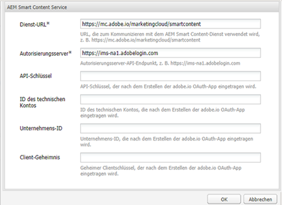
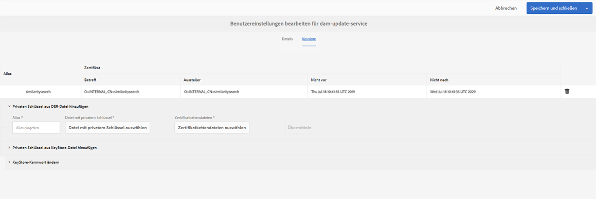
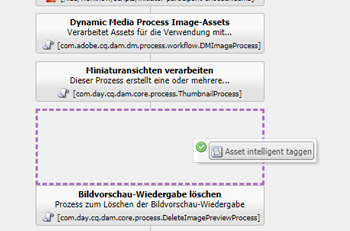
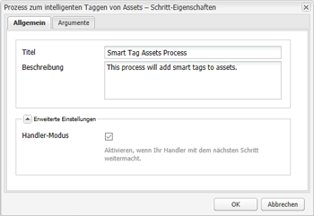
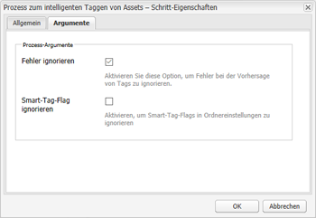
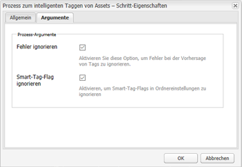

# Asset-Tags mit dem Smart Content Service {#configure-asset-tagging-using-the-smart-content-service} konfigurieren

Sie können [!DNL Adobe Experience Manager] mit dem Smart Content Service integrieren, indem Sie [!DNL Adobe Developer Console] verwenden. Verwenden Sie diese Konfiguration, um von [!DNL Experience Manager] aus auf den Smart Content Service zuzugreifen.

Der Artikel beschreibt die folgenden Hauptaufgaben, die zum Konfigurieren des Smart Content Service erforderlich sind. Am Backend authentifiziert der Server [!DNL Experience Manager] Ihre Dienstberechtigungen mit dem [!DNL Adobe Developer Console] Gateway, bevor Sie Ihre Anforderung an den Smart Content Service weiterleiten.

1. [Erstellen Sie in eine Konfiguration für den Smart Content Service, um einen öffentlichen Schlüssel zu erstellen. ](#obtain-public-certificate)[!DNL Experience Manager] [Erlangen Sie ein öffentliches Zertifikat](#obtain-public-certificate) für die OAuth-Integration.

1. [Erstellen Sie eine Integration in der Adobe Developer Console](#create-adobe-i-o-integration) und laden Sie den generierten öffentlichen Schlüssel hoch.

1. [Konfigurieren Sie Ihre ](#configure-smart-content-service) Bereitstellung mithilfe des API-Schlüssels und anderer Anmeldeinformationen von  [!DNL Adobe Developer Console].

1. [Testen Sie die Konfiguration](#validate-the-configuration).

1. Optional können Sie [das automatische Tagging beim Hochladen von Assets aktivieren](#enable-smart-tagging-in-the-update-asset-workflow-optional).

## Voraussetzungen {#prerequisites}

Bevor Sie den Smart Content Service verwenden, stellen Sie Folgendes sicher, um eine Integration auf [!DNL Adobe Developer Console] zu erstellen:

* Es ist ein Adobe ID-Konto mit Administratorrechten für die Organisation vorhanden.

* Der Smart Content ist für Ihre Organisation aktiviert.

Um erweiterte Smart-Tags zu aktivieren, installieren Sie zusätzlich zu den oben stehenden auch das neueste [Experience Manager-Service Pack](https://helpx.adobe.com/experience-manager/aem-releases-updates.html).

## Konfiguration des Smart Content Service erstellen, um das öffentliche Zertifikat {#obtain-public-certificate} zu erhalten

Mit einem öffentlichen Zertifikat können Sie Ihr Profil auf [!DNL Adobe Developer Console] authentifizieren.

1. Rufen Sie in der [!DNL Experience Manager]-Benutzeroberfläche **[!UICONTROL Tools]** > **[!UICONTROL Cloud Services]** > **[!UICONTROL Ältere Cloud Services]** auf.

1. Klicken Sie auf der Seite &quot;Cloud Services&quot;unter **[!UICONTROL Assets Smart Tags]** auf **[!UICONTROL Jetzt konfigurieren]**.

1. Geben Sie im Dialogfeld **[!UICONTROL Konfiguration erstellen]** einen Titel und einen Namen für die Smart-Tags-Konfiguration ein. Klicken Sie auf **[!UICONTROL Erstellen]**.

1. Verwenden Sie im Dialogfeld **[!UICONTROL AEM Smart Content Service]** die folgenden Werte:

   **[!UICONTROL Dienst-URL]**: `https://mc.adobe.io/marketingcloud/smartcontent`

   **[!UICONTROL Autorisierungsserver]**: `https://ims-na1.adobelogin.com`

   Lassen Sie die anderen Felder vorerst leer (Werte werden später bereitgestellt). Klicken Sie auf **[!UICONTROL OK]**.

   

   *Abbildung: Dialogfeld &quot;Smart Content Service&quot;zum Bereitstellen der URL des Inhaltsdienstes*

   >[!NOTE]
   >
   >Die als [!UICONTROL Dienst-URL] bereitgestellte URL kann nicht über den Browser aufgerufen werden und erzeugt einen 404-Fehler. Die Konfiguration funktioniert mit demselben Wert des Parameters [!UICONTROL Dienst-URL]. Der Gesamtplan für den Dienststatus und die Wartung finden Sie unter [https://status.adobe.com](https://status.adobe.com).

1. Klicken Sie auf **[!UICONTROL Öffentliches Zertifikat für OAuth-Integration herunterladen]** und laden Sie die Datei für das öffentliche Zertifikat `AEM-SmartTags.crt` herunter.

   

   *Abbildung: Einstellungen für den intelligenten Tag-Dienst*

### Konfigurieren, wenn ein Zertifikat abläuft {#certrenew}

Nach Ablauf eines Zertifikats wird es nicht mehr als vertrauenswürdig eingestuft. Sie können ein abgelaufenes Zertifikat nicht verlängern. Um ein neues Zertifikat hinzuzufügen, führen Sie diese Schritte aus.

1. Melden Sie sich bei Ihrer [!DNL Experience Manager]-Implementierung als Administrator an. Klicken Sie auf **[!UICONTROL Tools]** > **[!UICONTROL Sicherheit]** > **[!UICONTROL Benutzer]**.

1. Suchen und finden Sie **[!UICONTROL dam-update-service]**-Benutzer und klicken Sie darauf. Klicken Sie auf die Registerkarte **[!UICONTROL Keystore]**.

1. Löschen Sie den vorhandenen **[!UICONTROL similaritysearch]**-Keystore mit dem abgelaufenen Zertifikat. Klicken Sie auf **[!UICONTROL Speichern und schließen]**.

   

   *Abbildung: Löschen des vorhandenen Eintrags `similaritysearch` in Keystore, um ein neues Sicherheitszertifikat hinzuzufügen.*

1. Navigieren Sie zu **[!UICONTROL Werkzeuge]** > **[!UICONTROL Cloud Services]** > **[!UICONTROL Legacy-Cloud Services]**. Klicken Sie auf **[!UICONTROL Asset-Smart-Tags]** > **[!UICONTROL Konfiguration anzeigen]** > **[!UICONTROL Verfügbare Konfigurationen]**. Klicken Sie auf die gewünschte Konfiguration.

1. Um ein öffentliches Zertifikat herunterzuladen, klicken Sie auf **[!UICONTROL Öffentliches Zertifikat für OAuth-Integration herunterladen]**.

1. Rufen Sie [https://console.adobe.io](https://console.adobe.io) auf und navigieren Sie zu den vorhandenen Smart Content Services auf der Seite **[!UICONTROL Integrationen]**. Laden Sie das neue Zertifikat hoch. Weitere Informationen finden Sie in den Anweisungen unter [Adobe Developer Console-Integration erstellen](#create-adobe-i-o-integration).

## Adobe Developer Console-Integration {#create-adobe-i-o-integration} erstellen

Um Smart Content Service-APIs zu verwenden, erstellen Sie eine Integration in Adobe Developer Console, um [!UICONTROL API-Schlüssel] (generiert im Feld [!UICONTROL CLIENT-ID] der Adobe Developer Console-Integration), [!UICONTROL TECHNISCHE KONTO-ID], [!UICONTROL Organisations-ID] und [!UICONTROL und  zu erhalten. CLIENT SECRET] für [!UICONTROL Assets Smart Tagging Service Settings] der Cloud-Konfiguration in [!DNL Experience Manager].

1. Rufen Sie [https://console.adobe.io](https://console.adobe.io/) in einem Browser auf. Wählen Sie das entsprechende Konto aus und vergewissern Sie sich, dass die zugehörige Organisationsrolle „Systemadministrator“ ist.

1. Erstellen Sie ein Projekt mit einem beliebigen Namen. Klicken Sie auf **[!UICONTROL API hinzufügen]**.

1. Wählen Sie auf der Seite **[!UICONTROL Hinzufügen eine API]** **[!UICONTROL Experience Cloud]** und dann **[!UICONTROL Smart Content]**. Klicken Sie auf **[!UICONTROL Weiter]**.

1. Wählen Sie **[!UICONTROL Öffentlichen Schlüssel hochladen]** aus. Stellen Sie die von [!DNL Experience Manager] heruntergeladenen Zertifikatdatei bereit. Die Meldung [!UICONTROL Öffentliche(r) Schlüssel erfolgreich hochgeladen] wird angezeigt. Klicken Sie auf **[!UICONTROL Weiter]**.

   Die Seite [!UICONTROL Neue Dienstkonto (JWT)-Anmeldedaten erstellen] zeigt den öffentlichen Schlusselle für das Dienstkonto an, das Sie gerade konfiguriert haben.

1. Klicken Sie auf **[!UICONTROL Weiter]**.

1. Wählen Sie auf der Seite **[!UICONTROL Produktprofile auswählen]** die Option **[!UICONTROL Smart Content Services]** aus. Klicken Sie auf **[!UICONTROL Konfigurierte API speichern]**.

   Auf einer Seite werden weitere Informationen zur Konfiguration angezeigt. Lassen Sie diese Seite geöffnet, um diese Werte in [!UICONTROL Assets Smart Tagging Service Settings] der Cloud-Konfiguration in [!DNL Experience Manager] zu kopieren und hinzuzufügen, um Smarttags zu konfigurieren.

   

   *Abbildung: Integrationsdetails in der Adobe Developer Console*

## Konfigurieren des Smart Content Service {#configure-smart-content-service}

Verwenden Sie zum Konfigurieren der Integration die Werte der Felder [!UICONTROL TECHNISCHE KONTO-ID], [!UICONTROL ORGANISATIONS-ID], [!UICONTROL CLIENT-SECRET] und [!UICONTROL CLIENT-ID] aus der Adobe Developer Console. Das Erstellen einer Smart-Tags-Cloud-Konfiguration ermöglicht die Authentifizierung von API-Anforderungen aus der [!DNL Experience Manager]-Bereitstellung.

1. Navigieren Sie in [!DNL Experience Manager] zu **[!UICONTROL Tools > Cloud Service > Ältere Cloud Services]**, um die Konsole [!UICONTROL Cloud Services] zu öffnen.

1. Öffnen Sie unter den **[!UICONTROL Smart-Tags für Assets]** die oben erstellte Konfiguration. Klicken Sie auf der Seite mit den Serviceeinstellungen auf **[!UICONTROL Bearbeiten]**.

1. Verwenden Sie im Dialogfeld **[!UICONTROL AEM Smart Content Service]** die vorausgefüllten Werte für die Felder **[!UICONTROL Service-URL]** und **[!UICONTROL Autorisierungsserver]**.

1. Kopieren Sie für die Felder [!UICONTROL API-Schlüssel], [!UICONTROL Technische Konto-ID], [!UICONTROL Organisations-ID] und [!UICONTROL Clientgeheimnis] die folgenden Werte, die in [Adobe Developer Console integration](#create-adobe-i-o-integration) generiert wurden, und verwenden Sie sie.

   | [!UICONTROL Diensteinstellungen für Smart-Tagging in Assets] | [!DNL Adobe Developer Console] Integrationsfelder |
   |--- |--- |
   | [!UICONTROL API-Schlüssel] | [!UICONTROL CLIENT-ID] |
   | [!UICONTROL ID des technischen Kontos] | [!UICONTROL TECHNISCHE KONTO-ID] |
   | [!UICONTROL Unternehmens-ID] | [!UICONTROL Organisations-ID] |
   | [!UICONTROL Client-Geheimnis] | [!UICONTROL CLIENT SECRET] |

## Überprüfen der Konfiguration {#validate-the-configuration}

Nachdem Sie die Konfiguration abgeschlossen haben, verwenden Sie eine JMX MBean, um die Konfiguration zu validieren. Führen Sie zum Überprüfen die folgenden Schritte aus.

1. Greifen Sie auf Ihren [!DNL Experience Manager]-Server unter `https://[aem_server]:[port]` zu.

1. Öffnen Sie unter **[!UICONTROL Tools > Vorgänge > Web-Konsole]** die OSGi-Konsole. Klicken Sie auf **[!UICONTROL Haupt > JMX]**.

1. Klicken Sie auf **[!UICONTROL com.day.cq.dam.similaritysearch.internal.impl]**. Es wird **[!UICONTROL Ähnliche Suche Verschiedene Aufgaben]** geöffnet.

1. Klicken Sie auf **[!UICONTROL validateConfigs()]**. Klicken Sie im Dialogfeld **[!UICONTROL Konfigurationen überprüfen]** auf **[!UICONTROL Aufrufen]**.

   Die Überprüfungsergebnisse werden im gleichen Dialogfeld angezeigt.

## Aktivieren Sie intelligentes Tagging im DAM Update Asset-Arbeitsablauf (Optional) {#enable-smart-tagging-in-the-update-asset-workflow-optional}

1. Gehen Sie in [!DNL Experience Manager] zu **[!UICONTROL Tools]** > **[!UICONTROL Workflow]** > **[!UICONTROL Modelle]**.

1. Wählen Sie auf der Seite **[!UICONTROL Workflow-Modelle]** das Workflow-Modell **[!UICONTROL DAM Update Asset]** aus.

1. Klicken Sie in der Symbolleiste auf **[!UICONTROL Bearbeiten]**.

1. Erweitern Sie das Seitenbedienfeld, um die Schritte anzuzeigen. Ziehen Sie den Schritt **[!UICONTROL Asset intelligent taggen]**, der im Abschnitt „DAM-Workflow“ verfügbar ist, und platzieren Sie ihn nach dem Schritt **[!UICONTROL Prozessminiaturansichten]**.

   

   *Abbildung: Schritt zum Hinzufügen von Smart-Tag-Assets nach dem Schritt „Miniaturansichten verarbeiten“ im Workflow „DAM-Update-Asset“.*

1. Öffnen Sie den Schritt im Bearbeitungsmodus. Stellen Sie unter **[!UICONTROL Erweiterte Einstellungen]** sicher, dass die Option **[!UICONTROL Handler-Erweiterung]** ausgewählt ist.

   

   *Abbildung: DAM-Arbeitsablauf zum Aktualisieren von Assets konfigurieren und Schritt zum Hinzufügen von Smarttags*

1. Wählen Sie auf der Registerkarte **[!UICONTROL Argumente]** die Option **[!UICONTROL Fehler ignorieren]**, wenn der Workflow auch dann abgeschlossen werden soll, falls der automatische Tag-Schritt fehlschlägt.

   

   *Abbildung: DAM-Arbeitsablauf zum Aktualisieren von Assets konfigurieren, um einen Schritt zum intelligenten Tag hinzuzufügen und Handler-Modus auszuwählen*

   Um Assets unabhängig davon mit Tags zu versehen, ob die Smart-Tagging-Funktion für Ordner aktiviert ist, wählen Sie **[!UICONTROL Smart-Tag-Markierung ignorieren]** aus.

   

   *Abbildung: Konfigurieren Sie den Arbeitsablauf für DAM-Aktualisierung für Assets, um einen Schritt für intelligente Tags hinzuzufügen, und wählen Sie &quot;Smart-Tag-Flag ignorieren&quot;*

1. Klicken Sie auf **[!UICONTROL OK]**, um den Prozessschritt zu schließen, und speichern Sie dann den Workflow.

>[!MORELIKETHIS]
>
>* [Verwaltung intelligenter Tags](managing-smart-tags.md)
>* [Übersicht und Schulung von Smart-Tags](enhanced-smart-tags.md)
>* [Richtlinien und Regeln zur Schulung des intelligenten Inhaltsdienstes](smart-tags-training-guidelines.md)

