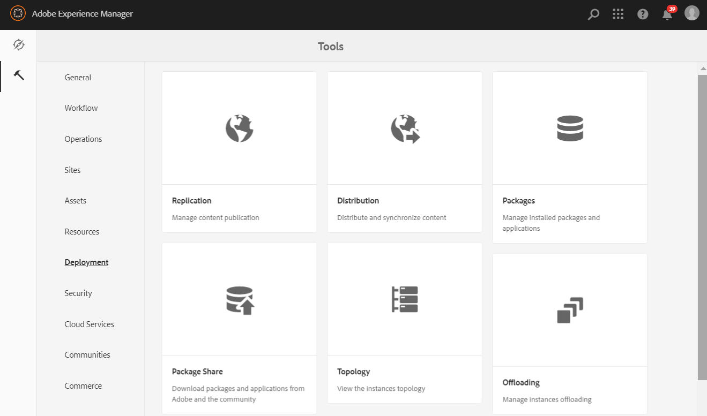

# Konfigurieren von AEM Assets mit Brand Portal {#configure-integration-64}

Adobe Experience Manager (AEM) Assets werden mit dem Markenportal über [!DNL Adobe I/O] konfiguriert, das ein IMS-Token zur Autorisierung Ihres Markenportals-Mandanten erhält.

>[!NOTE]
>
>Die Konfiguration von AEM Assets mit Markenportal über [!DNL Adobe I/O] wird auf AEM 6.4.8.0 und höher unterstützt.
>
>Zuvor wurde Brand Portal über das alte OAuth-Gateway in der klassischen Benutzeroberfläche konfiguriert. Das Gateway ruft mithilfe des JWT-Token-Austauschs ein IMS-Zugriffstoken zur Autorisierung ab.

>[!TIP]
>
>***Nur für Bestandskunden***
>
>Es wird empfohlen, weiterhin die vorhandene alte OAuth-Gateway-Konfiguration zu verwenden. Falls Probleme mit der alten OAuth-Gateway-Konfiguration auftreten, löschen Sie die vorhandene Konfiguration und erstellen Sie eine neue Konfiguration über [!DNL Adobe I/O].

In dieser Hilfe werden die folgenden zwei Anwendungsfälle beschrieben:

* [Neue Konfiguration](#configure-new-integration-64): Wenn Sie ein neuer Brand Portal-Benutzer sind und Ihre AEM Assets-Autoreninstanz mit Brand Portal konfigurieren möchten, können Sie eine neue Konfiguration für erstellen  [!DNL Adobe I/O].
* [Upgrade-Konfiguration](#upgrade-integration-64): Wenn Sie ein bestehender Brand Portal-Benutzer mit Ihrer AEM Assets-Autoreninstanz sind, die mit Brand Portal auf älterem OAuth Gateway konfiguriert wurde, sollten Sie die vorhandenen Konfigurationen löschen und eine neue Konfiguration erstellen  [!DNL Adobe I/O].

Benutzer dieser Hilfe sollten mit den folgenden Technologien vertraut sein:

* Installieren, Konfigurieren und Verwalten von Adobe Experience Manager- und AEM-Paketen

* Verwenden von Linux- und Microsoft Windows-Betriebssystemen

## Voraussetzungen {#prerequisites}

Sie benötigen Folgendes, um AEM Assets mit Brand Portal zu konfigurieren:

* Eine betriebsbereite AEM Assets-Autoreninstanz mit dem neuesten Service Pack.
* Brand Portal-Mandanten-URL
* Ein Benutzer mit Systemadministrator-Berechtigungen für die IMS-Organisation des Brand Portal-Mandanten

[Herunterladen und Installieren von AEM 6.4](#aemquickstart)

[Herunterladen und Installieren des neuesten AEM Service Packs](#servicepack)

### Laden Sie AEM 6.4 {#aemquickstart} herunter und installieren Sie es

Es wird empfohlen, AEM 6.4 zu verwenden, um eine AEM Autoreninstanz einzurichten. Wenn Sie AEM nicht eingerichtet haben, laden Sie es von den folgenden Speicherorten herunter:

* Wenn Sie bereits AEM sind, laden Sie AEM 6.4 von der [Adobe Licensing Website](http://licensing.adobe.com) herunter.

* Wenn Sie Partner der Adobe sind, verwenden Sie [Adobe Partner Training Programm](https://adobe.allegiancetech.com/cgi-bin/qwebcorporate.dll?idx=82357Q), um AEM 6.4 anzufordern.

Anweisungen zum Einrichten einer AEM- Autoreninstanz finden Sie nach dem Herunterladen von AEM unter [Bereitstellen und Verwalten](https://helpx.adobe.com/de/experience-manager/6-4/sites/deploying/using/deploy.html#defaultlocalinstall).

### Herunterladen und Installieren des neuesten AEM Service Packs{#servicepack}

Ausführliche Anweisungen finden Sie unter

* [Versionshinweise zum AEM 6.4 Service Pack](https://helpx.adobe.com/de/experience-manager/6-4/release-notes/sp-release-notes.html)

**Wenden Sie sich** an den Kundendienst, wenn Sie das neueste AEM oder Service Pack nicht finden können.

## Erstellen der Konfiguration {#configure-new-integration-64}

Führen Sie die folgenden Schritte in der aufgeführten Reihenfolge durch, wenn Sie AEM Assets zum ersten Mal mit dem Markenportal konfigurieren:

1. [Abrufen eines öffentlichen Zertifikats](#public-certificate)
1. [Integration  [!DNL Adobe I/O] von](#createnewintegration)
1. [Erstellen der Konfiguration des IMS-Kontos](#create-ims-account-configuration)
1. [Konfigurieren von Cloud Service](#configure-the-cloud-service)
1. [Testen der Konfiguration](#test-integration)

>[!NOTE]
>
>Eine AEM Assets-Autoreninstanz darf nur mit einem Markenportal-Mandanten konfiguriert werden.

### Erstellen der IMS-Konfiguration {#create-ims-configuration}

Die IMS-Konfiguration authentifiziert Ihren Brand Portal-Mandanten mit der Autoreninstanz von AEM Assets.

Die IMS-Konfiguration umfasst zwei Schritte:

* [Abrufen eines öffentlichen Zertifikats](#public-certificate)
* [Erstellen der Konfiguration des IMS-Kontos](#create-ims-account-configuration)

### Abrufen eines öffentlichen Zertifikats {#public-certificate}

Mit dem öffentlichen Zertifikat können Sie Ihr Profil auf [!DNL Adobe I/O] authentifizieren.

1. Bei Ihrer AEM Assets-Autoreninstanz anmelden
Standard-URL: http:// localhost:4502/aem/start.html
1. Navigieren Sie im Bereich **Tools**  zu **[!UICONTROL Security]** > **[!UICONTROL Adobe IMS Configurations]**.

   

1. Die Seite für Adobe IMS-Konfigurationen wird geöffnet.

   Klicken Sie auf **[!UICONTROL Erstellen]**.

   Dies führt Sie zur Seite **[!UICONTROL Adobe IMS Technical Account Configuration]**.

1. Standardmäßig wird die Registerkarte **Zertifikat** geöffnet.

   Wählen Sie in **Cloud-Lösung** die Option **[!UICONTROL Adobe Brand Portal]** aus.

1. Markieren Sie das Kontrollkästchen **[!UICONTROL Neues Zertifikat]** erstellen und geben Sie einen **Alias** für das Zertifikat an. Der Alias dient als Name des Dialogfelds.

1. Klicken Sie auf **[!UICONTROL Zertifikat erstellen]**. Ein Dialogfeld wird angezeigt. Klicken Sie auf **[!UICONTROL OK]**, um das öffentliche Zertifikat zu generieren.

   

1. Klicken Sie auf **[!UICONTROL Öffentlichen Schlüssel herunterladen]** und speichern Sie die Zertifikatdatei *AEM-Adobe-IMS.crt* auf Ihrem Computer. Die Zertifikatdatei wird für [create [!DNL Adobe I/O] integration](#createnewintegration) verwendet.

   

1. Klicken Sie auf **[!UICONTROL Weiter]**.

   Um auf der Registerkarte **Konto** das Adobe IMS-Konto zu erstellen, benötigen Sie die Integrationsdetails. Lassen Sie diese Seite vorerst offen.

   Öffnen Sie eine neue Registerkarte und [Create [!DNL Adobe I/O] integration](#createnewintegration), um die Integrationsdetails für IMS-Kontokonfigurationen abzurufen.

### [!DNL Adobe I/O] Integration {#createnewintegration} erstellen

[!DNL Adobe I/O] Integration generiert API Key, Client Secret und Payload (JWT), was für die Einrichtung der IMS-Kontokonfigurationen erforderlich ist.

1. Melden Sie sich bei der [!DNL Adobe I/O]-Konsole mit Systemadministratorberechtigungen bei der IMS-Organisation des Markenportal-Mieters an.

   Standard-URL: [https://console.adobe.io/](https://console.adobe.io/)

1. Klicken Sie auf **[!UICONTROL Integration erstellen]**.

1. Wählen Sie **[!UICONTROL Auf API zugreifen]** aus und klicken Sie auf **[!UICONTROL Weiter]**.

   

1. Eine neue Integrationsseite wird geöffnet.

   Wählen Sie Ihre Organisation aus der Dropdown-Liste aus.

   Wählen Sie in **[!UICONTROL Experience Cloud]** den Eintrag **[!UICONTROL AEM Brand Portal]** aus und klicken Sie auf **[!UICONTROL Weiter]**.

   Wenn die Option „Brand Portal“ für Sie deaktiviert ist, stellen Sie sicher, dass Sie die richtige Organisation aus dem Dropdown-Feld über der Option **[!UICONTROL Adobe Services]** ausgewählt haben. Wenn Sie Ihre Organisation nicht kennen, wenden Sie sich an Ihren Administrator.

   

1. Geben Sie einen Namen und eine Beschreibung für die Integration an. Klicken Sie auf **[!UICONTROL Eine Datei von Ihrem Computer auswählen]** und laden Sie die `AEM-Adobe-IMS.crt`-Datei hoch, die im Abschnitt [Öffentliche Zertifikate erhalten](#public-certificate) heruntergeladen wurde.

1. Wählen Sie das Profil Ihrer Organisation aus.

   Sie können auch das Standardprofil **[!UICONTROL Assets Brand Portal]** auswählen und auf **[!UICONTROL Integration erstellen]** klicken. Die Integration wird erstellt.

1. Klicken Sie auf **[!UICONTROL Weiter zu Integrationsdetails]**, um die Integrationsinformationen anzuzeigen.

   Kopieren Sie den **[!UICONTROL API-Schlüssel]**.

   Klicken Sie auf **[!UICONTROL Client-Geheimnis abrufen]** und kopieren Sie den Client-Geheimnisschlüssel.

   

1. Navigieren Sie zur Registerkarte **[!UICONTROL JWT]** und kopieren Sie die **[!UICONTROL JWT-Payload]**.

   API-Schlüssel, Client-Geheimnisschlüssel und JWT-Payload-Informationen werden verwendet, um eine IMS-Kontokonfiguration zu erstellen.

### Erstellen der Konfiguration des IMS-Kontos {#create-ims-account-configuration}

Stellen Sie sicher, dass Sie die folgenden Schritte ausgeführt haben:

* [Abrufen eines öffentlichen Zertifikats](#public-certificate)
* [Integration  [!DNL Adobe I/O] von](#createnewintegration)

**Schritte zum Erstellen der Konfiguration des IMS-Kontos:**

1. Öffnen Sie die Seite „IMS-Konfiguration“, Registerkarte **[!UICONTROL Konten]**. Sie haben die Seite am Ende des Abschnitts [Abrufen eines öffentlichen Zertifikats](#public-certificate) geöffnet gelassen.

1. Geben Sie einen **[!UICONTROL Titel]** für das IMS-Konto an.

   Geben Sie in **[!UICONTROL Autorisierungsserver]** die URL ein: [https://ims-na1.adobelogin.com/](https://ims-na1.adobelogin.com/)

   Fügen Sie den API-Schlüssel, den geheimen Clientschlüssel und die JWT-Nutzlast ein, die Sie am Ende von [Create [!DNL Adobe I/O] integration](#createnewintegration) kopiert haben.

   Klicken Sie auf **[!UICONTROL Erstellen]**.

   Die Integration wird erstellt.

   

1. Wählen Sie die IMS-Konfiguration aus und klicken Sie auf **[!UICONTROL Systemdiagnose]**. Das folgende Dialogfeld wird angezeigt.

   Klicken Sie auf **[!UICONTROL Prüfen]**. Bei erfolgreicher Verbindung wird die Meldung *Token erfolgreich abgerufen* angezeigt.

   

>[!CAUTION]
>
>Sie dürfen nur eine IMS-Konfiguration haben. Erstellen Sie nicht mehrere IMS-Konfigurationen.
>
>Vergewissern Sie sich, dass die IMS-Konfiguration die Konsistenzprüfung besteht. Wenn die Konfiguration die Konsistenzprüfung nicht besteht, ist sie ungültig. Sie müssen sie löschen und eine neue gültige Konfiguration erstellen.

### Konfigurieren von Cloud Service {#configure-the-cloud-service}

Führen Sie die folgenden Schritte aus, um eine Cloud Service-Konfiguration für Brand Portal zu erstellen:

1. Bei Ihrer AEM Assets-Autoreninstanz anmelden

   Standard-URL: http:// localhost:4502/aem/start.html
1. Navigieren Sie im Bereich **Tools**  zu **[!UICONTROL Cloud Services >> AEM Markenportal]**.

   Die Seite zur Brand Portal-Konfiguration wird geöffnet.

1. Klicken Sie auf **[!UICONTROL Erstellen]**.

1. Geben Sie einen **[!UICONTROL Titel]** für die Konfiguration ein.

   Wählen Sie die im Schritt erstellte IMS-Konfiguration aus und [erstellen Sie die IMS-Kontokonfiguration](#create-ims-account-configuration).

   Geben Sie in **[!UICONTROL Dienst-URL]** Ihre Brand Portal-Mandanten-URL ein.

   

1. Klicken Sie auf **[!UICONTROL Speichern und schließen]**. Die Cloud-Konfiguration wird erstellt. Ihre AEM Assets-Autoreninstanz ist jetzt mit dem Markenportal-Mandanten integriert.

### Testen der Konfiguration {#test-integration}

1. Bei Ihrer AEM Assets-Autoreninstanz anmelden

   Standard-URL: http:// localhost:4502/aem/start.html

1. Navigieren Sie im Bereich **Tools**  zu **[!UICONTROL Bereitstellung >> Replikation]**.

   

1. Die Replikationsseite wird geöffnet.

   Klicken Sie auf **[!UICONTROL Agenten bei Autor]**.

   

1. Für jeden Mandanten werden vier Replizierungsagenten erstellt.

   Suchen Sie die Replizierungsagenten Ihres Markenportal-Mandanten.

   Klicken Sie auf die Replizierungsagenten-URL.

   

   >[!NOTE]
   >
   >Die Replizierungsagenten arbeiten parallel und teilen die Auftragsverteilung gleichmäßig, wodurch die Veröffentlichungsgeschwindigkeit um das Vierfache der Originalgeschwindigkeit steigt. Wenn der Cloud-Service konfiguriert wurde, sind keine zusätzlichen Konfigurationsschritte erforderlich, um die Replikationsagenten zu aktivieren. Sie werden standardmäßig aktiviert, um die parallele Veröffentlichung mehrerer Assets zu ermöglichen.

1. Um die Verbindung zwischen AEM Assets-Autor und Markenportal zu überprüfen, klicken Sie auf **[!UICONTROL Verbindung testen]**.

   

1. Sehen Sie sich den unteren Bereich der Testergebnisse an, um zu prüfen, ob die Replikation erfolgreich war.

   

1. Überprüfen Sie die Testergebnisse für alle vier Replizierungsagenten einzeln.

   >[!NOTE]
   >
   >Vermeiden Sie es, einen der Replikationsagenten zu deaktivieren, da dies dazu führen kann, dass die Replikation einiger Assets fehlschlägt.
   >
   >Stellen Sie sicher, dass alle vier Replizierungsagenten so konfiguriert sind, dass kein Timeout-Fehler auftritt. Siehe [Fehlerbehebung bei Problemen beim parallelen Veröffentlichen im Markenportal](https://docs.adobe.com/content/help/en/experience-manager-brand-portal/using/publish/troubleshoot-parallel-publishing.html#connection-timeout).

Markenportal wurde erfolgreich mit Ihrer AEM Assets-Autoreninstanz konfiguriert. Sie haben nun die folgenden Möglichkeiten:

* [Veröffentlichen von Assets aus AEM Assets in Brand Portal](../assets/brand-portal-publish-assets.md)
* [Veröffentlichen von Ordnern aus AEM Assets in Brand Portal](../assets/brand-portal-publish-folder.md)
* [Veröffentlichen von Sammlungen aus AEM Assets in Brand Portal](../assets/brand-portal-publish-collection.md)
* [Konfigurieren Sie Asset ](https://docs.adobe.com/content/help/de-DE/experience-manager-brand-portal/using/asset-sourcing-in-brand-portal/brand-portal-asset-sourcing.html) Sourcingening, damit die Benutzer des Markenportals Elemente in AEM Assets hinzufügen und veröffentlichen können.

## Upgrade der Konfiguration {#upgrade-integration-64}

Führen Sie die folgenden Schritte in der aufgeführten Reihenfolge aus, um vorhandene Konfigurationen zu aktualisieren:
1. [Ausführen von Aufträgen überprüfen](#verify-jobs)
1. [Vorhandene Konfigurationen löschen](#delete-existing-configuration)
1. [Konfiguration erstellen](#configure-new-integration-64)

### Überprüfen laufender Aufträge {#verify-jobs}

Stellen Sie sicher, dass auf Ihrer AEM Assets-Autoreninstanz kein Veröffentlichungsauftrag ausgeführt wird, bevor Sie Änderungen vornehmen. Dazu können Sie alle vier Replizierungsagenten überprüfen und sicherstellen, dass die Warteschlange ideal/leer ist.

1. Bei Ihrer AEM Assets-Autoreninstanz anmelden

   Standard-URL: http:// localhost:4502/aem/start.html

1. Navigieren Sie im Bereich **Tools**  zu **[!UICONTROL Bereitstellung >> Replikation]**.

1. Die Replikationsseite wird geöffnet.

   Klicken Sie auf **[!UICONTROL Agenten bei Autor]**.

   

1. Suchen Sie die Replizierungsagenten Ihres Markenportal-Mandanten.

   Stellen Sie sicher, dass die **Warteschlange für alle Replizierungsagenten Idle** lautet. Es ist kein Veröffentlichungsauftrag aktiv.

   

### Vorhandene Konfigurationen {#delete-existing-configuration} löschen

Sie müssen beim Löschen der vorhandenen Liste die folgende Prüfung ausführen.
* Alle vier Replizierungsagenten löschen
* Cloud-Dienst löschen
* MAC-Benutzer löschen

Führen Sie die folgenden Schritte aus, um die vorhandene Konfiguration zu löschen:

1. Melden Sie sich bei Ihrer AEM Assets-Autoreninstanz an und öffnen Sie CRX Lite als Administrator.

   Standard-URL: http:// localhost:4502/crx/de/index.jsp

1. Navigieren Sie zu `/etc/replications/agents.author` und löschen Sie alle vier Replizierungsagenten Ihres Markenportal-Mandanten.

   

1. Navigieren Sie zu `/etc/cloudservices/mediaportal` und löschen Sie **Cloud Service configuration**.

   

1. Navigieren Sie zu `/home/users/mac` und löschen Sie den **MAC-Benutzer** Ihres Markenportal-Mieters.

   

Sie können jetzt [Konfiguration](#configure-new-integration-64) in Ihrer AEM 6.4 Autoreninstanz unter [!DNL Adobe I/O] erstellen.

<!--
   Comment Type: draft

   <li> </li>
   -->

<!--
   Comment Type: draft

   <li>Step text</li>
   -->

Nach erfolgreicher Replikation können Sie Assets, Ordner und Sammlungen im Brand Portal veröffentlichen. Weitere Details finden Sie unter:

* [Veröffentlichen von Assets in Brand Portal](brand-portal-publish-assets.md)
* [Veröffentlichen von Assets und Ordnern in Brand Portal](brand-portal-publish-folder.md)
* [Veröffentlichen von Sammlungen in Brand Portal](brand-portal-publish-collection.md)
