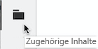

# Zugehörige Inhalte {#associated-content}

>[!CAUTION]
>
>AEM 6.4 hat das Ende der erweiterten Unterstützung erreicht und diese Dokumentation wird nicht mehr aktualisiert. Weitere Informationen finden Sie in unserer [technische Unterstützung](https://helpx.adobe.com/de/support/programs/eol-matrix.html). Unterstützte Versionen suchen [here](https://experienceleague.adobe.com/docs/?lang=de).

>[!CAUTION]
>
>Einige Inhaltsfragmentfunktionen erfordern die Anwendung von [AEM 6.4 Service Pack 2 (6.4.2.0 oder höher)](/help/release-notes/sp-release-notes.md).

Zugehörige Inhalte stellen die Verbindung bereit, mit der Assets für ein Fragment verwendet werden können (falls gewünscht), wenn sie einer Inhaltsseite hinzugefügt werden. Dies bietet Ihnen mehr Flexibilität, wenn es darum geht, [eine Reihe von Assets bereitzustellen, auf die bei der Verwendung des Inhaltsfragments auf einer Seite zugegriffen werden soll](/help/sites-authoring/content-fragments.md#using-associated-content). Darüber hinaus wird so der Zeitaufwand für die Suche nach dem passenden Asset reduziert.

## Hinzufügen von zugehörigen Inhalten {#adding-associated-content}

>[!NOTE]
>
>Es gibt verschiedene Methoden, um [visuelle Assets (z. B. Bilder)](content-fragments.md#fragments-with-visual-assets) einem Fragment und/oder einer Seite hinzuzufügen.

Um zugehörige Inhalte zu verknüpfen, müssen zunächst [Medien-Assets zu einer Sammlung hinzugefügt werden](managing-collections-touch-ui.md#adding-assets-to-a-collection). Danach können Sie:

1. Öffnen Sie das Fragment und wählen Sie im seitlichen Bedienfeld **[!UICONTROL Zugehörige Inhalte]** aus.

   

1. Wählen Sie **[!UICONTROL Inhalt zuordnen]** oder **[!UICONTROL Sammlung zuordnen]** (je nachdem, ob Sammlungen bereits verknüpft wurden oder nicht).
1. Wählen Sie die erforderliche Sammlung aus.

   Optional können Sie das eigentliche Fragment zur ausgewählten Sammlung hinzufügen. Dies hilft bei der Nachverfolgung.

   

1. Bestätigen Sie (mit dem Häkchen). Die Sammlung wird als verknüpft aufgeführt.

   

## Bearbeiten zugehöriger Inhalte {#editing-associated-content}

Nachdem Sie eine Sammlung zugewiesen haben, können Sie Folgendes tun:

* **Entfernen** den Verband.
* **Hinzufügen von Assets** in die Sammlung ein.
* Wählen Sie ein Asset für weitere Aktionen aus.
* Bearbeiten Sie das Asset.
