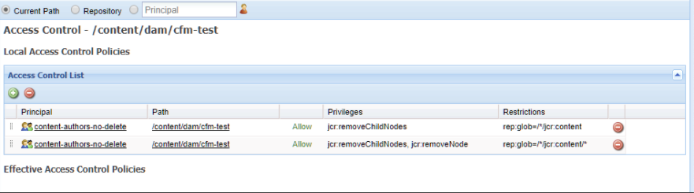

# Inhaltsfragmente – Überlegungen zum Löschen {#content-fragments-delete-considerations}

>[!CAUTION]
>
>AEM 6.4 hat das Ende der erweiterten Unterstützung erreicht und diese Dokumentation wird nicht mehr aktualisiert. Weitere Informationen finden Sie in unserer [technische Unterstützung](https://helpx.adobe.com/de/support/programs/eol-matrix.html). Unterstützte Versionen suchen [here](https://experienceleague.adobe.com/docs/?lang=de).

>[!CAUTION]
>
>Einige Inhaltsfragmentfunktionen erfordern die Anwendung von [AEM 6.4 Service Pack 2 (6.4.2.0 oder höher)](/help/release-notes/sp-release-notes.md).

## Berechtigungen – Löschen oder nicht löschen {#permissions-delete-or-not-delete}

Die Möglichkeit, Inhalt zu löschen, ist wirkungsvoll, muss aber mit Bedacht verwendet werden, da viele Branchen die Erteilung dieser Berechtigungen einschränken und kontrollieren müssen.

Im Hinblick auf Löschberechtigungen müssen Inhaltsfragmente auf zwei Ebenen betrachtet werden:

1. **Das Inhaltsfragment als einzelne Entität.**

   * **Nutzungsszenario:** Ein Benutzer, der ein Inhaltsfragment bearbeiten oder aktualisieren und **ein ganzes Fragment löschen muss**.
   * **Berechtigungen**: Die Berechtigung zum [Löschen](/help/sites-administering/security.md#actions) kann [über die Benutzer- und/oder Gruppenverwaltung zugewiesen](/help/sites-administering/security.md#managing-permissions) werden.

1. **Die verschiedenen Unterentitäten, die ein Inhaltsfragment bilden. Z. B. Varianten, Unterknoten.**

   Die grundlegende Funktionsweise des Inhaltsfragment-Editors erfordert, dass solche temporären Unterelemente gelöscht werden können. Beispielsweise wenn Varianten bearbeitet oder Metadaten oder verknüpfte Inhalte verwaltet werden.

   * **Nutzungsszenario:** Ein Benutzer, der ein Inhaltsfragment bearbeiten oder aktualisieren muss, **aber kein ganzes Fragment löschen darf**.
   * **Berechtigungen:** Siehe [Nur für Editor-Funktionen erforderliche Berechtigungen](content-fragments-delete.md#permissions-required-for-editor-functionality-only).

>[!NOTE]
>
>Wenn ein Benutzer über keine [Löschen](/help/sites-administering/security.md#actions) -Berechtigungen verwenden, wird der Inhaltsfragment-Editor in *schreibgeschützt* -Modus.

>[!NOTE]
>
>Siehe auch [Prüfen von Benutzerverwaltungsvorgängen in AEM](/help/sites-administering/audit-user-management-operations.md).

## Nur für Editor-Funktionen erforderliche Berechtigungen {#permissions-required-for-editor-functionality-only}

Benutzer, die ein Fragment bearbeiten oder aktualisieren müssen, **aber keine kompletten Fragmente löschen dürfen**, benötigen bestimmte Berechtigungen, da die grundlegende Funktionsweise des Inhaltsfragmente-Editors erfordert, dass diese temporären Unterelemente gelöscht werden können.

Beispielsweise wenn Varianten bearbeitet oder Metadaten oder verknüpfte Inhalte verwaltet werden.

>[!NOTE]
>
>Die zum Bearbeiten/Aktualisieren eines Inhaltsfragments erforderlichen Löschberechtigungen sind in der Löschberechtigung enthalten [zugewiesen über Benutzer- und/oder Gruppenverwaltung](/help/sites-administering/security.md#managing-permissions).

Die zum Bearbeiten oder Aktualisieren eines Fragments benötigten Rechte müssen auf den Knoten, der das Fragment enthält, oder einen entsprechenden übergeordneten Knoten angewendet werden (auf allen Ebenen unter `/content/dam`). Wenn sie einem übergeordneten Knoten zugewiesen sind, werden die Berechtigungen auf alle Knoten in diesem Zweig angewendet.

Beispiel: ein Ordner, der alle Inhaltsfragmente enthält, z. B.:

* `/content/dam/contentfragments`

>[!CAUTION]
>
>Die Berechtigungen können auch auf `/content/dam` festgelegt werden, weil hier alle Inhaltsfragmente gespeichert werden.
>
>Diese Aktion wendet jedoch dieselben Löschberechtigungen auf *all* auch andere Asset-Typen.

Die Berechtigungsvoraussetzung, die es einem bestimmten Benutzer und/oder einer bestimmten Gruppe gestattet, ein Inhaltsfragment zu bearbeiten/zu aktualisieren, ist:

>[!NOTE]
>
>Diese Liste zeigt alle erforderlichen Berechtigungen, nicht nur die Berechtigungen zum Löschen.

* Für die Inhaltsfragmentknoten oder -ordner:

   * `jcr:addChildNodes`, `jcr:modifyProperties`

* Für den `jcr:content`-Knoten aller Inhaltsfragmente:

   * `jcr:addChildNodes`, `jcr:modifyProperties` und `jcr:removeChildNodes`

* Für alle Knoten unter `jcr:content` aller Inhaltsfragmente:

   * `jcr:addChildNodes`, `jcr:modifyProperties` und `jcr:removeChildNodes`, `jcr:removeNode`

Diese Berechtigungen zum `remove` müssen [mit Zugriffssteuerungslisten in CRXDE Lite verwaltet werden](/help/sites-administering/user-group-ac-admin.md#access-right-management).

Die Berechtigungen zum `add` und `modify` können ebenfalls in CRXDE Lite oder über die User Management-Konsole verwaltet werden.

Beispielsweise die Definition der Berechtigungen zum `remove` für eine Gruppe `content-authors-no-delete`:

