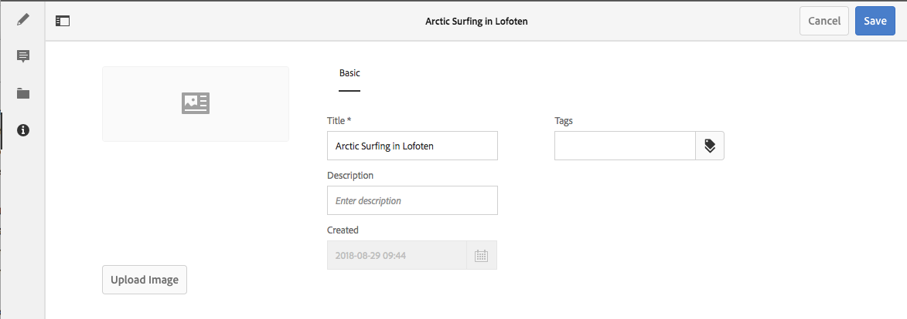

# Metadaten – Fragmenteigenschaften {#metadata-fragment-properties}

>[!CAUTION]
>
>Einige Inhaltsfragmentfunktionen erfordern die Anwendung von [AEM 6.4 Service Pack 2 (6.4.2.0) oder höher](/help/release-notes/sp-release-notes.md).

## Bearbeiten von Eigenschaften/Metadaten {#editing-properties-meta-data}

Sie können die Metadaten (Eigenschaften) für das Inhaltsfragment anzeigen und bearbeiten:

1. Navigieren Sie in der Konsole **[!UICONTROL Assets]** zum Speicherort des Inhaltsfragments.
1. Führen Sie einen der folgenden Schritte durch:

   * Wählen Sie [Eigenschaften anzeigen aus, um das Dialogfeld zu öffnen](managing-assets-touch-ui.md#editing-properties). Sobald es zur Anzeige geöffnet wurde, können Sie auch Bearbeitungen vornehmen.
   * Öffnen Sie das [Inhaltsfragment zum Bearbeiten](content-fragments-managing.md#opening-the-fragment-editor) und wählen Sie anschließend im seitlichen Bedienfeld **[!UICONTROL Metadaten]** aus.

   

1. Auf der Registerkarte **[!UICONTROL Allgemein]** können Sie die folgenden Optionen anzeigen oder bearbeiten:

   * Miniaturansicht, für die Sie ein **Bild hochladen** können
   * **Titel**
   * **Beschreibung**
   * **Tags**
   * Erstellt (nur Anzeige)
   
