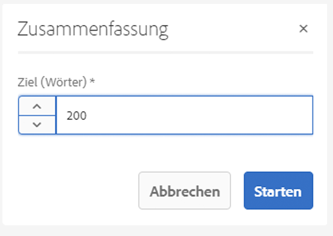

# Varianten – Erstellen von Fragmentinhalten {#variations-authoring-fragment-content}

>[!CAUTION]
>
>Einige Inhaltsfragmentfunktionen erfordern die Anwendung von [AEM 6.4 Service Pack 2 (6.4.2.0) oder höher](../release-notes/sp-release-notes.md).

[Varianten](content-fragments.md#constituent-parts-of-a-content-fragment) sind eine wichtige Funktion für Inhaltsfragmente, da sie Ihnen die Möglichkeit bieten, Kopien des primären Inhalts zu erstellen und zu bearbeiten und diese für bestimmte Kanäle und/oder Szenarien zu verwenden.

In der Registerkarte **Varianten** haben Sie folgende Möglichkeiten:

* [Eingeben des Inhalts](#authoring-your-content) für das Fragment
* [Erstellen und Verwalten von Varianten](#managing-variations) des **primären** Inhalts

Ausführen einer Vielzahl weiterer Aktionen abhängig vom bearbeiteten Datentyp; z. B.:

* [Einfügen von visuellen Assets in Ihr Fragment](#inserting-assets-into-your-fragment) (Bilder)
* Auswählen zwischen [Rich-Text](#rich-text), [Nur Text](#plain-text) und [Markdown](#markdown) für die Bearbeitung

* [Inhalt hochladen](#uploading-content)

* [Anzeigen von Schlüsselstatistiken](#viewing-key-statistics) (über mehrzeiligen Text)
* [Zusammenfassen von Text](#summarizing-text)

* [Synchronisieren von Varianten mit dem primären Inhalt](#synchronizing-with-master)

>[!CAUTION]
>
>Nachdem ein Fragment veröffentlicht und/oder referenziert wurde, zeigt AEM eine Warnmeldung an, wenn ein Autor das Fragment erneut zur Bearbeitung öffnet. Dies dient als Hinweis darauf, dass am Fragment vorgenommene Änderungen sich auch auf die referenzierten Seiten auswirken.

## Verfassen Ihres Inhalts {#authoring-your-content}

Wenn Sie Ihr Inhaltsfragment zur Bearbeitung öffnen, wird die Registerkarte **Varianten** standardmäßig geöffnet. Hier können Sie den Inhalt bearbeiten, und zwar den der primären Version sowie sämtlicher Varianten. Sie haben folgende Möglichkeiten:

* Nehmen Sie Ihre Änderungen direkt in der Registerkarte **Varianten** vor
* Öffnen Sie den [Vollbild-Editor](#full-screen-editor), um:

   * das [Format](#formats) auszuwählen
   * weitere Bearbeitungsoptionen anzuzeigen ([Rich-Text](#rich-text)-Format)
   * auf eine Reihe von [Aktionen](#actions)zuzugreifen

Beispiel:

* Bearbeiten eines einfachen Fragments

   Ein einfaches Fragment besteht aus einem mehrzeiligen Textfeld (visuelle Assets können über den Vollbild-Editor hinzugefügt werden).

   

* Bearbeiten eines Fragments mit strukturiertem Inhalt

   Ein strukturiertes Fragment enthält verschiedene Felder mit verschiedenen Datentypen, die im Inhaltsmodell definiert wurden. Für alle mehrzeiligen Felder ist der [Vollbild-Editor](#full-screen-editor) verfügbar.

   

### Vollbild-Editor {#full-screen-editor}

Wenn Sie ein mehrzeiliges Textfeld bearbeiten, können Sie den Vollbild-Editor öffnen: 

Der Vollbild-Editor bietet Folgendes:

* Zugriff auf verschiedene [Aktionen](#actions)
* Je nach [Format](#formats) weitere Formatierungsoptionen ([Rich-Text](#rich-text))

### Aktionen  {#actions}

Die folgenden Aktionen sind ebenfalls verfügbar (für sämtliche [Formate](#formats)), wenn der Vollbild-Editor (d. h. mehrzeiliger Text) geöffnet ist:

* Wählen Sie das [Format](#formats) ([Rich Text](#rich-text), [Nur Text](#plain-text), [Markdown](#markdown)).
* [Textstatistiken anzeigen](#viewing-key-statistics)
* [Inhalt hochladen](#uploading-content)
* [Mit primärer Version synchronisieren](#synchronizing-with-master) (beim Bearbeiten einer Variante)
* [Zusammenfassen von Text](#summarizing-text)
* [Text kommentieren](content-fragments-variations.md#annotating-a-content-fragment)

* [Einfügen von visuellen Assets in Ihr Fragment](#inserting-assets-into-your-fragment) (Bilder)

### Formate {#formats}

Die Optionen für das Bearbeiten von mehrzeiligem Text hängen vom ausgewählten Format ab:

* [Rich-Text](#rich-text)
* [Nur Text](#plain-text)
* [Markdown](#markdown)

Das Format kann im Vollbild-Editor ausgewählt werden.

### Rich-Text {#rich-text}

Die Rich-Text-Bearbeitung ermöglicht folgende Formatierungen:

* Fett
* Kursiv
* Unterstrichen
* Ausrichtung: links, zentriert, rechts
* Stichpunktliste
* Nummerierte Liste
* Einzug: erhöhen, vermindern
* Erstellen/Aufheben von Hyperlinks
* Öffnen Sie den Vollbild-Editor, in dem die folgenden Formatierungsoptionen zur Verfügung stehen:

   * Einfügen von Text aus Word
   * Einfügen einer Tabelle
   * Absatzformat: Absatz, Überschrift 1/2/3
   * [Einfügen visueller Assets](#inserting-assets-into-your-fragment)
   * Suchen
   * Suchen/Ersetzen
   * Rechtschreibprüfung
   * [Anmerkungen](content-fragments-variations.md#annotating-a-content-fragment)

Die [Aktionen](#actions) sind ebenfalls über den Vollbild-Editor verfügbar.

### Nur Text {#plain-text}

Nur Text ermöglicht die schnelle Eingabe von Inhalt ohne Formatierungs- oder Markdown-Informationen. Für weitere [Aktionen](#actions) können Sie auch den Vollbild-Editor öffnen.

>[!CAUTION]
>
>Wenn Sie **Nur Text** auswählen, gehen möglicherweise alle Formatierungen, Markierungen und/oder Assets verloren, die Sie in **Rich-Text** oder **Markdown** eingefügt haben.

### Markdown {#markdown}

>[!NOTE]
>
>Umfassende Informationen hierzu finden Sie in der [Markdown](content-fragments-markdown.md)-Dokumentation.

Auf diese Weise können Sie Ihren Text mithilfe von Markdowns formatieren. Sie können Folgendes definieren:

* Überschriften
* Absätze und Zeilenumbrüche
* Links
* Bilder
* Blockzitate
* Listen
* Hervorhebungen
* Code-Blöcke
* Umgekehrter Schrägstrich als Escape-Zeichen

Für weitere [Aktionen](#actions) können Sie auch den Vollbild-Editor öffnen.

>[!CAUTION]
>
>Wenn Sie zwischen **Rich-Text** und **Markdown** umschalten, treten möglicherweise unerwartete Effekte mit Blockzitaten und Code-Blöcken auf, da diese beiden Formate unterschiedlich verarbeitet werden.

### Anzeigen von Schlüsselstatistiken {#viewing-key-statistics}

Wenn der Vollbild-Editor geöffnet ist, zeigt die Aktion **Textstatistik** eine Reihe von Informationen über den Text an. Beispiel:

### Hochladen von Inhalt {#uploading-content}

Um die Erstellung von Inhaltsfragmenten zu vereinfachen, können Sie Text hochladen, der in einem externen Editor vorbereitet wurde, und ihn direkt in das Fragment einfügen.

### Zusammenfassung von Text {#summarizing-text}

Mithilfe der Zusammenfassung von Text können Benutzer die Länge des Textes auf eine vordefinierte Anzahl von Wörtern verringern, während die wichtigen Punkte und die allgemeine Bedeutung beibehalten werden.

>[!NOTE]
>
>Auf einer technischeren Stufe behält das System die Sätze bei, die in Übereinstimmung mit bestimmten Algorithmen das *beste Verhältnis von Informationsdichte und Eindeutigkeit* bieten.

>[!CAUTION]
>
>Das Inhaltsfragment muss einen gültigen Sprachordner als Vorgänger haben, der verwendet wird, um das zu verwendende Sprachmodell zu bestimmen.
>
>Beispiel: `en/` wie im folgenden Pfad:
>
>`/content/dam/my-brand/en/path-down/my-content-fragment`

>[!CAUTION]
>
>Englisch ist standardmäßig verfügbar.
>
>Andere Sprachen sind als Sprachmodellpakete über Software Distribution verfügbar:
>
>* [Französisch (fr) aus Softwareverteilung](https://experience.adobe.com/#/downloads/content/software-distribution/en/aem.html?package=/content/software-distribution/en/details.html/content/dam/aem/public/adobe/packages/cq630/product/smartcontent-model-fr)
>* [Deutsch (de) aus Softwareverteilung](https://experience.adobe.com/#/downloads/content/software-distribution/en/aem.html?package=/content/software-distribution/en/details.html/content/dam/aem/public/adobe/packages/cq630/product/smartcontent-model-de)
>* [Italienisch (it) von Software Distribution](https://experience.adobe.com/#/downloads/content/software-distribution/en/aem.html?package=/content/software-distribution/en/details.html/content/dam/aem/public/adobe/packages/cq630/product/smartcontent-model-it)
>* [Spanisch (es) aus Softwareverteilung](https://experience.adobe.com/#/downloads/content/software-distribution/en/aem.html?package=/content/software-distribution/en/details.html/content/dam/aem/public/adobe/packages/cq630/product/smartcontent-model-es)

>

1. Wählen Sie **[!UICONTROL Primäre Version]** oder die erforderliche Variante aus.
1. Öffnen Sie den Vollbild-Editor.

1. Wählen Sie in der Symbolleiste die Option **[!UICONTROL Text zusammenfassen]** aus.

   

1. Geben Sie den Zielwert der Wörter an und wählen Sie **[!UICONTROL Starten]**:
1. Der Originaltext wird neben der vorgeschlagenen Zusammenfassung angezeigt:

   * Zu beseitigende Sätze werden rot und durchgestrichen hervorgehoben.
   * Klicken Sie auf einen beliebigen hervorgehobenen Satz, um ihn im zusammengefassten Inhalt zu behalten.
   * Klicken Sie auf einen beliebigen nicht hervorgehobenen Satz, um ihn zu beseitigen.

   

1. Wählen Sie **[!UICONTROL Zusammenfassen]** aus, um die Änderungen zu bestätigen.

### Anmerkungen zu Inhaltsfragmenten {#annotating-a-content-fragment}

So fügen Sie Anmerkungen zu Fragmenten hinzu:

1. Wählen Sie **[!UICONTROL Primäre Version]** oder die erforderliche Variante aus.
1. Öffnen Sie den Vollbild-Editor.
1. Wählen Sie Text aus. Das Symbol **[!UICONTROL Anmerken]** wird verfügbar.

   

1. Ein Dialogfeld wird geöffnet. Hier können Sie Ihre Anmerkungen eingeben.

1. Schließen Sie den Editor im Vollbildmodus und **[!UICONTROL speichern]** Sie das Fragment.

### Anzeigen, Bearbeiten und Löschen von Anmerkungen {#viewing-editing-deleting-annotations}

Anmerkungen:

* Werden sowohl im Vollbildmodus als auch im Normalmodus des Editors als hervorgehobener Text angezeigt. Die vollständigen Details einer Anmerkung können dann angezeigt, bearbeitet und/oder gelöscht werden, indem Sie auf den hervorgehobenen Text klicken. Dann wird das Dialogfeld erneut geöffnet.

   >[!NOTE]
   >
   >Eine Dropdown-Liste wird angezeigt, wenn mehrere Anmerkungen auf einen Textausschnitt angewendet wurden.

* Wenn Sie den gesamten Text löschen, auf den die Anmerkung angewendet wurde, wird der Kommentar ebenfalls gelöscht.

* Kann durch das Auswählen der Registerkarte **[!UICONTROL Anmerkungen]** im Fragment-Editor aufgeführt und gelöscht werden.

   

* Kann in der [Zeitleiste](https://helpx.adobe.com/experience-manager/6-3/assets/using/content-fragments-managing.html#timeline-for-content-fragments) für das ausgewählte Fragment angezeigt und gelöscht werden.

### Einfügen von Assets in das Fragment {#inserting-assets-into-your-fragment}

Um die Erstellung von Inhaltsfragmenten zu vereinfachen, können Sie [Assets](managing-assets-touch-ui.md) (Bilder) direkt zum Fragment hinzufügen.

Sie werden der Absatzreihe des Fragments ohne jede Formatierung hinzugefügt. Die Formatierung kann erfolgen, wenn das [Fragment auf einer Seite verwendet/referenziert wird](/help/sites-authoring/content-fragments.md).

>[!CAUTION]
>
>Diese Assets können auf einer referenzierenden Seite nicht verschoben oder gelöscht werden, sondern nur im Fragment-Editor.
>
>Allerdings muss die Formatierung eines Assets (z. B. Größe) über den [Seiteneditor](/help/sites-authoring/content-fragments.md) erfolgen. Die Darstellung des Assets im Fragment-Editor dient lediglich der Erstellung des Inhaltsflusses.

>[!NOTE]
>
>Es gibt verschiedene Methoden, um [Bilder](content-fragments.md#fragments-with-visual-assets) zu einem Fragment und/oder einer Seite hinzuzufügen.

1. Positionieren Sie den Cursor über der Position, an der Sie das Bild hinzufügen möchten.
1. Öffnen Sie das Suchdialogfeld mithilfe der Schaltfläche **[!UICONTROL Asset einfügen]**.

   

1. In diesem Dialogfeld haben Sie folgende Möglichkeiten:

   * Navigieren zum gewünschten Asset in DAM
   * Suchen nach dem Asset in DAM

   Nachdem Sie das gewünschte Asset gefunden haben, wählen Sie es aus, indem Sie auf die Miniaturansicht klicken.

1. Verwenden Sie **[!UICONTROL Auswahl]**, um das Asset dem Absatzsystem Ihres Content Fragments am aktuellen Speicherort hinzuzufügen.

   >[!CAUTION]
   >
   >Wenn Sie nach dem Hinzufügen eines Assets das Format ändern in:
   >
   >* **Klartext:** Das Asset geht im Fragment vollständig verloren.
   >* **Markdown:** Das Asset wird nicht angezeigt, ist aber immer noch vorhanden, wenn Sie zu **Rich Text** zurückkehren.

## Verwalten von Varianten   {#managing-variations}

### Variante erstellen {#creating-a-variation}

Varianten ermöglichen die Abänderung von **primärem** Inhalt für einen bestimmten Zweck (sofern notwendig).

So erstellen Sie eine neue Variante:

1. Öffnen Sie Ihr Fragment und stellen Sie sicher, dass das seitliche Bedienfeld sichtbar ist.
1. Wählen Sie im seitlichen Bedienfeld in der Symbolleiste die Option **[!UICONTROL Varianten]** aus.
1. Wählen Sie **[!UICONTROL Variante erstellen]** aus.
1. Daraufhin wird ein Dialogfeld geöffnet, in dem der **[!UICONTROL Titel]** und die **[!UICONTROL Beschreibung]** für die neue Variante angegeben werden.
1. Wählen Sie **[!UICONTROL Hinzufügen]** aus. Das Fragment **[!UICONTROL Primäre Version]** wird in die neue Variante kopiert, die nun zur [Bearbeitung](#editing-a-variation) geöffnet ist.

   >[!NOTE]
   >
   >Wenn eine neue Variante erstellt wird, wird immer die **Primäre Version** kopiert, nicht die gerade geöffnete Variante.

### Bearbeiten einer Variante   {#editing-a-variation}

Sie können nach einer der folgenden Aktionen Änderungen am Inhalt der Variante vornehmen:

* [Erstellen einer Variante](#creating-a-variation).
* Öffnen eines vorhandenen Fragments und Auswahl der gewünschten Variante aus dem seitlichen Bedienfeld.

### Umbenennen einer Variante {#renaming-a-variation}

So benennen Sie eine vorhandene Variante um:

1. Öffnen Sie das Fragment und wählen Sie über den Seitenbereich die Option **[!UICONTROL Varianten]** aus.
1. Wählen Sie die gewünschte Variante aus.
1. Wählen Sie im Dropdown-Menü **[!UICONTROL Aktionen]** die Option **[!UICONTROL Umbenennen]** aus.

1. Geben Sie im Dialogfeld den neuen **[!UICONTROL Titel]** und/oder die **[!UICONTROL Beschreibung]** ein.

1. Bestätigen Sie die Aktion **[!UICONTROL Umbenennen]**.

>[!NOTE]
>
>Dies wirkt sich nur auf den **Namen** der Variante aus.

### Löschen einer Variante {#deleting-a-variation}

So löschen Sie eine vorhandene Variante:

1. Öffnen Sie das Fragment und wählen Sie über den Seitenbereich die Option **[!UICONTROL Varianten]** aus.
1. Wählen Sie die gewünschte Variante aus.
1. Wählen Sie im Dropdown-Menü **[!UICONTROL Aktionen]** die Option **[!UICONTROL Löschen]** aus.

1. Bestätigen Sie im Dialogfeld die Aktion **[!UICONTROL Löschen]**.

>[!NOTE]
>
>**Primäre Version** kann nicht gelöscht werden.

### Mit primärer Version synchronisieren {#synchronizing-with-master}

**Primäre Version** ist ein wesentlicher Bestandteil eines Inhaltsfragments und enthält die primäre Version des Inhalts, während die Varianten einzelne aktualisierte und maßgeschneiderten Versionen des Inhalts enthalten. Wenn die primäre Version aktualisiert wird, können diese Änderungen auch für die Varianten relevant sein und müssen daher auf diese übertragen werden.

Beim Bearbeiten einer Variante haben Sie Zugriff auf die Aktion zur Synchronisierung des aktuellen Elements der Variante mit der primären Version. Dadurch können Sie an der primären Version vorgenommene Änderungen automatisch in die entsprechende Variante kopieren.

>[!CAUTION]
>
>Die Synchronisierung ist nur verfügbar, um Änderungen *von der **primären Version**in die Variante* zu kopieren.
>
>Es wird nur das aktuelle Element der Variante synchronisiert.
>
>Die Synchronisierung funktioniert nur mit Datentypen mit **mehrzeiligem Text**.
>
>Es ist nicht möglich, Änderungen *von einer Variante auf die **primäre Version*** zu übertragen.

1. Öffnen Sie das Inhaltsfragment im Fragment-Editor. Stellen Sie sicher, dass die **primäre Version** bearbeitet wurde.
2. Es gibt folgende Möglichkeiten, eine bestimmte Variante sowie die entsprechende Synchronisierung auszuwählen:

   * über den Dropdown-Selektor **Aktionen** – **Aktuelles Element mit primärer Version synchronisieren**
   * über die Symbolleiste des Vollbild-Editors – **Mit Master synchronisieren**

3. Master und Variante werden nebeneinander angezeigt:

   * Grün zeigt an, dass Inhalt (zur Variante) hinzugefügt  wurde
   * Rot zeigt an, dass Inhalt entfernt wurde (aus der Variante)

   

4. Wählen Sie **[!UICONTROL Synchronisieren]**. Die Variante wird dann aktualisiert und angezeigt.
