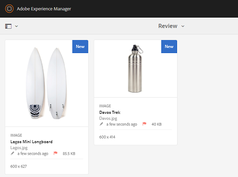
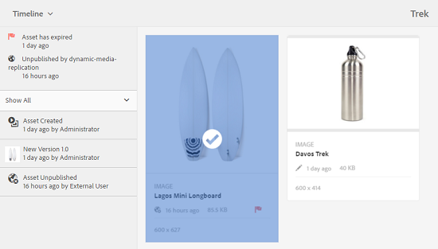
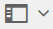
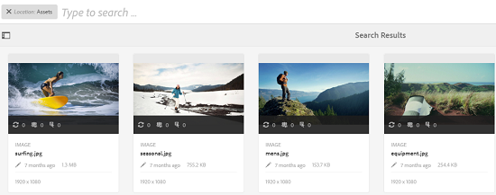
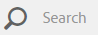
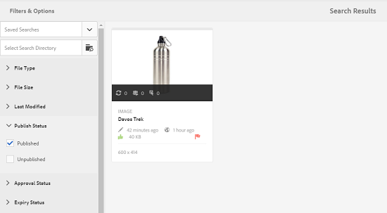
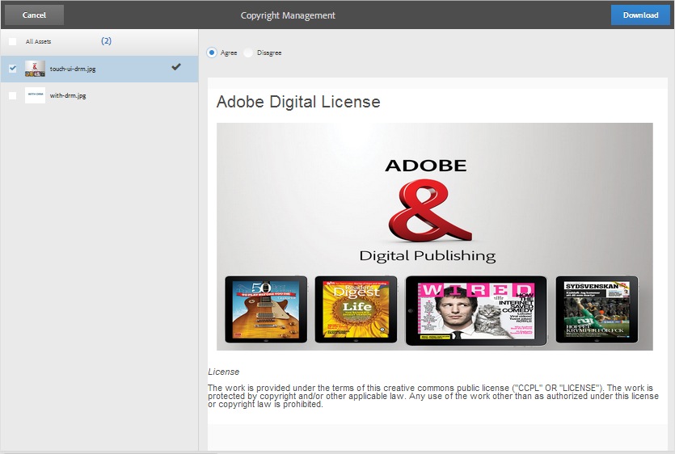

# Digital Rights Management für Assets {#digital-rights-management-in-assets}

Digitale Assets sind oftmals mit einer Lizenz verbunden, in der die Bedingungen und die Nutzungsdauer festgelegt sind. Da [!DNL Adobe Experience Manager Assets] vollständig mit der [!DNL Experience Manager]-Plattform integriert ist, können Sie Asset-Ablaufinformationen und -Status effizient verwalten. Sie können Lizenzinformationen mit Assets verknüpfen.

## Asset-Ablauf {#asset-expiration}

Der Asset-Ablauf ist eine effektive Möglichkeit zum Durchsetzen von Lizenzanforderungen für Assets. Wenn ein veröffentlichtes Asset abläuft, wird seine Veröffentlichung aufgehoben und damit die Möglichkeit einer Lizenzverletzung unterbunden. Ein Benutzer ohne Administratorrechte kann ein abgelaufenes Asset weder bearbeiten, kopieren, verschieben, veröffentlichen noch herunterladen.

Sie können den Ablaufstatus eines Assets im [!DNL Assets] in der Karten- und Listenansicht.

*Abbildung: In der Kartenansicht zeigt eine Markierung auf der Karte das abgelaufene Asset an.*

*Abbildung: In der Listenansicht wird die [!UICONTROL Status] -Spalte zeigt die [!UICONTROL Abgelaufen] Banner.*

Sie können den Ablaufstatus eines Assets im [!UICONTROL Timeline] in der linken Leiste.

>[!NOTE]
>
>Das Ablaufdatum eines Assets wird für Benutzer in verschiedenen Zeitzonen unterschiedlich angezeigt.

Sie können den Ablaufstatus von Assets auch im **[!UICONTROL Verweise]** Leiste. Hier werden der Asset-Ablaufstatus und die Beziehungen zwischen ebenenübergreifenden Assets und referenzierten Teil-Assets, Sammlungen und Projekten verwaltet.

1. Navigieren Sie zu dem Asset, für das Sie referenzierende Web-Seiten und ebenenübergreifende Assets anzeigen möchten.
1. Wählen Sie das Asset aus und klicken Sie auf das [!DNL Experience Manager]-Logo.

   

1. Wählen Sie im Menü **[!UICONTROL Verweise]** aus.

   

   Für abgelaufene Assets zeigt die Leiste „Verweise“ im oberen Bereich den Ablaufstatus **[!UICONTROL Asset ist abgelaufen]** an.

   

   Sofern das Asset abgelaufene Teil-Assets aufweist, zeigt die Leiste „Verweise“ den Status **[!UICONTROL Asset enthält abgelaufene Teil-Assets]** an.

   

### Suchen nach abgelaufenen Assets {#search-expired-assets}

Sie können im Suchfeld nach abgelaufenen Assets einschließlich abgelaufener Teil-Assets suchen.

1. Klicken Sie in der [!DNL Assets]-Konsole in der Symbolleiste auf **[!UICONTROL Suchen]**, um das Omnisearch-Feld anzuzeigen.

   

1. Betätigen Sie bei in das Omnisearch-Feld gesetztem Cursor die Eingabetaste, um die Seite mit den Suchergebnissen anzuzeigen.

   

1. Klicken [!DNL Experience Manager] -Logo, um das Suchfeld anzuzeigen.

   

1. Klicken Sie auf **[!UICONTROL Gültigkeitsstatus]** -Option, um sie zu erweitern.

   

1. Auswählen **[!UICONTROL Abgelaufen]**. Die abgelaufenen Assets werden in den Suchergebnissen angezeigt.

   

Bei Auswahl der Option **[!UICONTROL Abgelaufen]** zeigt die [!DNL Assets]-Konsole nur die abgelaufenen Assets und Teil-Assets an, auf die von ebenenübergreifenden Assets verwiesen wird. Die ebenenübergreifenden Assets, die auf abgelaufene Teil-Assets verweisen, werden nicht sofort nach Ablauf eines Teil-Assets angezeigt. Stattdessen werden sie angezeigt, nachdem [!DNL Experience Manager] bei der nächsten Ausführung des Planers erkennt, dass sie auf abgelaufene Teil-Assets verweisen.

Wenn Sie das Ablaufdatum eines veröffentlichten Assets in ein Datum ändern, das vor dem aktuellen Planungszyklus liegt, erkennt die Planung das Asset bei der nächsten Ausführung als abgelaufenes Asset und spiegelt dementsprechend seinen Status wider.

Wenn eine Störung oder ein Fehler verhindert, dass die Planung abgelaufene Assets im aktuellen Zyklus erkennt, untersucht die Planung diese Assets im nächsten Zyklus erneut und erkennt dann, dass sie abgelaufen sind.

Damit die [!DNL Assets]-Konsole die verweisenden ebenenübergreifenden Assets neben den abgelaufenen Teil-Assets anzeigt, konfigurieren Sie in [!DNL Experience Manager] Configuration Manager einen Workflow für **[!UICONTROL Adobe CQ DAM-Ablaufbenachrichtigungen]**.

1. Öffnen Sie [!DNL Experience Manager] Configuration Manager.
1. Wählen Sie **[!UICONTROL Adobe CQ DAM-Ablaufbenachrichtigung]** aus. Standardmäßig wird **[!UICONTROL Zeitbasierter Planer]** ausgewählt, womit ein Auftrag geplant wird, der zu einem bestimmten Zeitpunkt prüft, ob ein Asset abgelaufene Teil-Assets aufweist. Nach Abschluss des Auftrags werden Assets mit abgelaufenen Teil-Assets und verwiesenen Assets in den Suchergebnissen als abgelaufen angezeigt.

   

1. Um den Auftrag regelmäßig auszuführen, löschen Sie das Feld **[!UICONTROL Regel für zeitbasierten Planer]** und ändern Sie die Dauer in Sekunden im Feld **[!UICONTROL Periodischer Planer]**. Beispiel: Der Beispielausdruck „0 0 0 &amp;ast; &amp;ast; ?“ löst den Auftrag um 00:00 Uhr aus.
1. Wählen Sie **[!UICONTROL E-Mail senden]** aus, um bei Ablauf von Assets E-Mails zu erhalten.

   >[!NOTE]
   >
   >Nur der Ersteller des Assets (die Person, die ein bestimmtes Asset in [!DNL Assets]) eine E-Mail erhält, wenn das Asset abläuft. Siehe [Konfigurieren von E-Mail-Benachrichtigungen](/help/sites-administering/notification.md) für weitere Details zur Konfiguration von E-Mail-Benachrichtigungen insgesamt [!DNL Experience Manager] Ebene.

1. Geben Sie im Feld **[!UICONTROL Vorabbenachrichtigung in Sekunden]** den Zeitpunkt in Sekunden vor dem Ablauf eines Assets an, zu dem Sie über den bevorstehenden Ablauf benachrichtigt werden möchten. Wenn Sie ein Administrator oder der Ersteller des Assets sind, werden Sie vor Ablauf des Assets darüber informiert, dass das Asset nach dem angegebenen Zeitraum ablaufen wird.

   Nachdem das Asset abgelaufen ist, erhalten Sie eine weitere Benachrichtigung, die den Ablauf bestätigt. Außerdem werden die abgelaufenen Assets deaktiviert.

1. Klicken Sie auf **[!UICONTROL Speichern]**.

## Asset-Status {#asset-states}

Die [!DNL Assets]-Konsole kann verschiedene Status für Assets anzeigen. Abhängig vom aktuellen Status eines bestimmten Assets zeigt die zugehörige Kartenansicht eine Beschreibung des Zustands an, z. B. „Abgelaufen“, „Veröffentlicht“, „Genehmigt“, „Abgelehnt“ usw.

1. Wählen Sie in der [!DNL Assets]-Benutzeroberfläche ein Asset aus.

   

1. Klicken Sie in der Symbolleiste auf **[!UICONTROL Veröffentlichen]**. Falls Sie das Symbol **Veröffentlichen** in der Symbolleiste nicht sehen, klicken Sie dort auf **[!UICONTROL Mehr]** und suchen Sie nach der Option **[!UICONTROL Veröffentlichen]**.

   

1. Wählen Sie im Menü **[!UICONTROL Veröffentlichen]** aus und schließen Sie danach das Bestätigungsdialogfeld.
1. Beenden Sie den Auswahlmodus. Der Veröffentlichungsstatus des Assets wird in der Kartenansicht im unteren Bereich der Miniatur des Assets angezeigt. In der Listenansicht zeigt die Spalte „Veröffentlicht“ die Zeit an, zu der das Asset veröffentlicht wurde.

   

1. Um die Seite mit den Asset-Details anzuzeigen, wählen Sie in der [!DNL Assets]-Benutzeroberfläche ein Asset aus und klicken Sie auf **[!UICONTROL Eigenschaften]**.

   

1. Geben Sie auf der Registerkarte Erweitert ein Ablaufdatum für das Asset im Feld **[!UICONTROL Ablaufdatum]** an.

   

   *Abbildung: [!UICONTROL Erweitert] Registerkarte im Asset [!UICONTROL Eigenschaften] Seite, um den Asset-Ablauf festzulegen.*

1. Klicken Sie auf **[!UICONTROL Speichern]** und dann auf **[!UICONTROL Schließen]**, um die Asset-Konsole anzuzeigen.
1. Der Veröffentlichungsstatus des Assets weist in der Kartenansicht im unteren Bereich der Miniatur darauf hin, dass das Asset abgelaufen ist. In der Listenansicht wird der Status des Assets als **[!UICONTROL Abgelaufen]** angegeben.

   

1. Wählen Sie in der [!DNL Assets]-Konsole einen Ordner aus und erstellen Sie eine Prüfungsaufgabe für den Ordner.
1. Prüfen und bestätigen Sie das Asset in der Prüfungsaufgabe (bzw. lehnen Sie es ab) und klicken Sie auf **[!UICONTROL Fertig]**.
1. Navigieren Sie zu dem Ordner, für den Sie die Prüfungsaufgabe erstellt haben. Der Status des Assets, das Sie bestätigt oder abgelehnt haben, wird unten in der Kartenansicht angezeigt. In der Listenansicht werden Bestätigungs- und Ablaufstatus in entsprechenden Spalten angezeigt.

   

1. Um nach Assets auf Grundlage ihres Status zu suchen, klicken Sie auf **[!UICONTROL Suchen]**, um die Omnisearch-Leiste anzuzeigen.

   

1. Drücken Sie die Eingabetaste und klicken Sie auf [!DNL Experience Manager], um das Suchbedienfeld anzuzeigen.
1. Klicken Sie im Suchbedienfeld auf **[!UICONTROL Veröffentlichungsstatus]** und wählen Sie **[!UICONTROL Veröffentlicht]** aus, um in [!DNL Assets] nach veröffentlichten Assets zu suchen.

   

1. Klicken Sie auf **[!UICONTROL Genehmigungsstatus]** und danach auf die entsprechende Option, um nach bestätigten oder abgelehnten Assets zu suchen.

   

1. Um nach Assets auf Grundlage ihres Ablaufstatus zu suchen, wählen Sie im Suchfeld **[!UICONTROL Gültigkeitsstatus]** und danach die entsprechende Option aus.

   

1. Sie können auch auf Grundlage einer Kombination von Statusangaben mit verschiedenen Suchfacetten nach Assets suchen. Sie können beispielsweise nach veröffentlichten Assets suchen, die in einer Prüfungsaufgabe bestätigt wurden und noch nicht abgelaufen sind, indem Sie die entsprechenden Optionen in den Suchfacetten auswählen.

   

## Digital Rights Management in [!DNL Assets] {#digital-rights-management-in-assets-1}

Diese Funktion setzt die Annahme der Lizenzvereinbarung zwingend voraus. Erst nach diesem Schritt können lizenzierte Assets von [!DNL Adobe Experience Manager Assets] heruntergeladen werden.

Wenn Sie ein geschütztes Asset auswählen und auf **[!UICONTROL Herunterladen]** klicken, werden Sie auf die Lizenzseite weitergeleitet, um die Lizenzvereinbarung anzunehmen. Wenn Sie die Lizenzvereinbarung nicht annehmen, steht die Option **[!UICONTROL Herunterladen]** nicht zur Verfügung.

Falls die Auswahl mehrere geschützte Assets enthält, wählen Sie jeweils eines aus, nehmen Sie die Lizenzvereinbarung an und fahren Sie mit dem Herunterladen des Assets fort.

Ein Asset gilt als geschützt, wenn eine der folgenden Bedingungen erfüllt ist:

* Die `xmpRights:WebStatement`-Metadateneigenschaft des Assets verweist auf den Pfad der Seite, die die Lizenzvereinbarung für das Asset enthält.
* Beim Wert der `adobe_dam:restrictions`-Metadateneigenschaft des Assets handelt es sich um unformatierten HTML-Code, der die Lizenzvereinbarung angibt.

>[!NOTE]
>
>Der Speicherort `/etc/dam/drm/licenses`, der in den früheren Versionen von [!DNL Experience Manager] zum Speichern von Lizenzen verwendet wurde, wird nicht mehr unterstützt.
>
>Wenn Sie Lizenzseiten erstellen oder bearbeiten bzw. aus früheren [!DNL Experience Manager]-Versionen portieren möchten, speichern Sie diese unter `/apps/settings/dam/drm/licenses` oder `/conf/&ast;/settings/dam/drm/licenses`.

### Herunterladen von DRM-geschützten Assets {#downloading-drm-assets}

1. Wählen Sie die gewünschten Assets in der Kartenansicht aus und klicken Sie auf **[!UICONTROL Herunterladen]**.
1. Wählen Sie auf der Seite **[!UICONTROL Copyright-Management]** das Asset aus, das Sie herunterladen möchten.
1. Wählen Sie im [!UICONTROL Lizenzfenster] die Option **[!UICONTROL Zustimmen]** aus. Neben dem Asset erscheint ein Häkchen. Klicken Sie auf die Option **[!UICONTROL Herunterladen]**.

   >[!NOTE]
   >
   >Die Option **[!UICONTROL Herunterladen]** ist nur dann verfügbar, wenn Sie der Lizenzvereinbarung für ein geschütztes Asset zustimmen. Wenn Ihre Auswahl jedoch sowohl geschützte als auch ungeschützte Assets umfasst, werden nur die geschützten Assets im Bereich aufgelistet und die Option **[!UICONTROL Herunterladen]** ist aktiviert, um die ungeschützten Assets herunterzuladen. Sie können mehrere Lizenzvereinbarungen für verschiedene geschützte Assets gleichzeitig akzeptieren, indem Sie die Assets in der Liste auswählen und anschließend auf **[!UICONTROL Zustimmen]** klicken.

   

1. Klicken Sie im Dialogfeld auf **[!UICONTROL Herunterladen]**, um das Asset oder seine Ausgabedarstellungen herunterzuladen.
