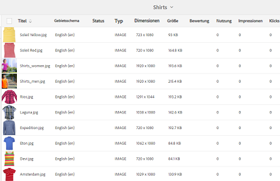
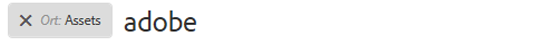
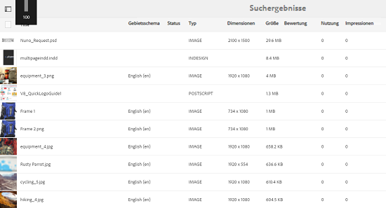
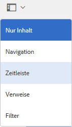
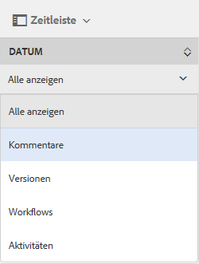
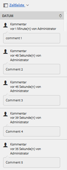

# Optimierte Sortierung von Assets in [!DNL Experience Manager] {#enhanced-sorting-of-assets-in-aem}

Erfahren Sie mehr [!DNL Experience Manager] Assets stellt eine serverseitige Sortierung bereit, um Ordner-Assets oder Suchabfragen auf einmal zu sortieren, anstatt sie in Stapeln auf der Clientseite zu sortieren.

Die Suchfunktion von Adobe Experience Manager Assets wurde verbessert, um eine große Anzahl von Assets in der Ordnerlistenansicht und den Suchergebnisseiten effizient zu sortieren. Timeline-Einträge können ebenfalls sortiert werden. 

[!DNL Experience Manager] Assets setzt auf eine serverseitige Sortierung, um alle Assets (unabhängig von ihrer Größe) in einem Ordner oder in einer Suchabfrage in einem Schritt und nicht stapelweise auf Clientseite zu sortieren.  Auf diese Weise können per Prefetch abgerufene Ergebnisse schnell in der Benutzeroberfläche angezeigt werden. Der Sortiervorgang wird hierdurch responsiver und schneller. 

## Sortieren von Assets in der Listenansicht {#sorting-assets-in-list-view}

[!DNL Experience Manager]Mit Assets können Sie Ordner-Assets basierend auf den folgenden Feldern sortieren: 

* Gebietsschema
* Status
* Typ
* Größe
* Bewertung
* Änderungsdatum 
* Veröffentlichungsdatum 
* Nutzung
* Klicks
* Impressionen
* Ausgecheckt

1. Navigieren Sie zu einem Ordner, der eine große Anzahl von Assets enthält. 
1. Klicken/tippen Sie auf das Layoutsymbol und wechseln Sie in die Listenansicht.

   

1. Klicken/tippen Sie auf das Sortiersymbol neben einer beliebigen Spaltenüberschrift in der Asset-Liste.

   

   Die Liste der Assets wird auf Basis der Feldwerte sortiert. 

   

>[!NOTE]
>
>So sortieren Sie die Werte im `Name` oder `Title`Spalten, Überlagerung `/libs/dam/gui/content/commons/availablecolumns` und ändern Sie den Wert von `sortable` nach `True`.

## Sortieren von Assets in Suchergebnissen {#sorting-assets-in-search-results}

Sie können die Suchergebnisse basierend auf den folgenden Feldern sortieren: 

* Titel
* Status
* Typ
* Größe
* Änderungsdatum 
* Veröffentlichungsdatum 

1. Suchen Sie anhand der gewünschten Kriterien über das OmniSearch-Feld nach Assets. 

   

1. Klicken/tippen Sie auf das Layoutsymbol und wechseln Sie in die Listenansicht. Wenn die Suchergebnisse bereits in der Listenansicht angezeigt werden, können Sie diesen Schritt überspringen. 
1. Klicken/tippen Sie auf das Sortiersymbol neben einer beliebigen Spaltenüberschrift in der Asset-Liste. Die Liste der Assets wird auf Basis der Feldwerte sortiert. 

   

## Sortieren von Assets in der Timeline {#sorting-assets-in-timeline}

[!DNL Assets]Mit können Sie Timeline-Einträge chronologisch sortieren, wie z. B. Anmerkungen, Versionen, Workflows und Aktivitäten. 

1. Wählen Sie über die Assets-Benutzeroberfläche ein Asset aus, für das die Timeline angezeigt werden soll. 
1. Klicken/tippen Sie auf das GlobalNav-Symbol und wählen Sie **[!UICONTROL Timeline]** aus.

   

1. Wählen Sie in der Timeline einen Eintrag in der Liste aus.  Wählen Sie beispielsweise **[!UICONTROL Kommentare]** , um die Liste der mit dem Asset verknüpften Anmerkungen anzuzeigen.

   

1. Klicken/tippen Sie auf das **[!UICONTROL Sortiersymbol]** neben der Bezeichnung **[!UICONTROL Datum]**. Abhängig von Ihrer Auswahl werden die Anmerkungen chronologisch in der Reihenfolge aufgeführt, in der sie dem Asset hinzugefügt wurden. 

   
