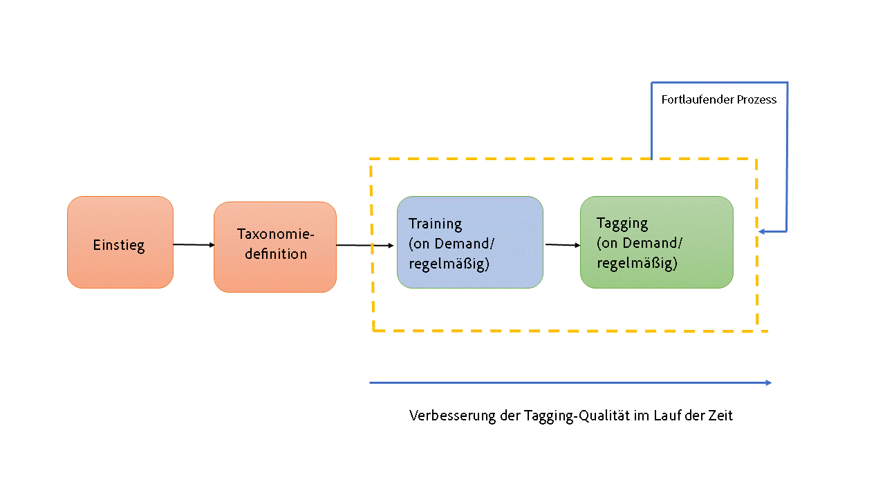
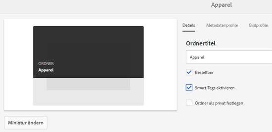
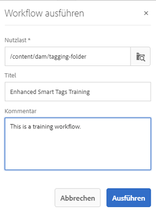
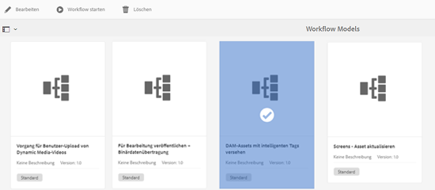
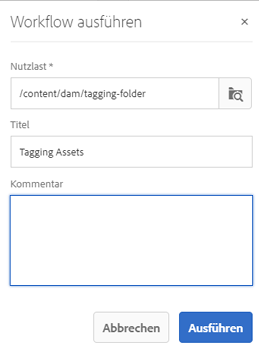
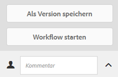

# Optimierte Smart-Tags {#enhanced-smart-tags}

## Überblick über optimierte Smart-Tags {#overview-of-enhanced-smart-tags}

Organisationen, die mit digitalen Assets arbeiten, verwenden zunehmend taxonomiegesteuertes Vokabular in Asset-Metadaten. Im Grunde umfasst dieses eine Liste von Schlüsselbegriffen, die Mitarbeiter, Partner und Kunden häufig verwenden, um sich auf digitale Assets einer bestimmten Klasse zu beziehen und nach diesen zu suchen. Das Tagging mit einem taxonomiegesteuerten Vokabular stellt sicher, dass diese Begriffe im Rahmen von Tag-basierten Suchen einfach identifiziert und abgerufen werden können.

Verglichen mit dem Vokabular natürlicher Sprachen hilft das Tagging digitaler Assets anhand einer Geschäftstaxonomie dabei, sie am Geschäft eines Unternehmens auszurichten, und stellt dabei sicher, dass nur die relevantesten Assets bei der Suche angezeigt werden.

So könnte beispielsweise ein Automobilhersteller Bilder von Autos mit Tags versehen, die die Modellnamen darstellen, sodass nur relevante Bilder angezeigt werden, wenn für das Erstellen einer Werbekampagne nach verschiedenen Modellen gesucht wird.

Damit der Smart Content Service die richtigen Tags anwendet, müssen Sie ihn darauf trainieren, Ihre Taxonomie zu erkennen. Um den Dienst zu trainieren, müssen Sie zunächst einen Satz von Assets sowie Tags kuratieren, die diese Assets bestmöglich beschreiben. Wenden Sie diese Tags auf die Assets an und führen Sie einen Trainings-Workflow aus, damit der Dienst lernen kann.

Sobald ein Tag trainiert wurde und bereit ist, kann der Dienst dieses Tag über einen Tagging-Workflow auf Assets anwenden.

Im Hintergrund verwendet der Smart Content Service das KI-Framework von Adobe Sensei, um seinen Bilderkennungsalgorithmus auf Ihre Tag-Struktur und Ihre Unternehmenstaxonomie zu trainieren. Diese Content-Intelligenz wird dann verwendet, um relevante Tags auf einen anderen Satz von Assets anzuwenden.

Smart Content Service ist ein Cloud-Service, der auf [!DNL Adobe I/O] gehostet wird. Um sie in Adobe Experience Manager (AEM) zu verwenden, muss der Systemadministrator Ihre AEM-Instanz mit [!DNL Adobe I/O] integrieren.

Die wichtigsten Schritte beim Verwenden des Smart Content Service sind:

* Einstieg
* Überprüfung von Assets und Tags (Taxonomiedefinition)
* Training des Smart Content Service
* Automatisches Tagging

## Voraussetzungen {#prerequisites}

Bevor Sie den Smart Content Service verwenden können, stellen Sie Folgendes sicher, um eine Integration in [!DNL Adobe I/O] zu erstellen:

* Es ist ein Adobe ID-Konto mit Administratorrechten für die Organisation vorhanden.
* Der Smart Content Service ist für Ihre Organisation aktiviert.

## Einstieg {#onboarding}

Der Smart Content Service kann als Add-on zu AEM erworben werden. Nach dem Kauf wird eine E-Mail an den Administrator Ihres Unternehmens mit einem Link zu [!DNL Adobe I/O] gesendet.

Der Administrator kann über diesen Link den Smart Content Service in AEM integrieren. Weitere Informationen zum Integrieren des Dienstes mit AEM Assets finden Sie im Abschnitt [Konfigurieren von Smart-Tags](config-smart-tagging.md).

Der Einstieg ist abgeschlossen, wenn der Administrator den Dienst konfiguriert und Benutzer in AEM hinzufügt.

>[!NOTE]
>
>Wenn Sie AEM 6.3 oder frühere Version verwenden und einen automatischen Tagging-Dienst für Ihre Assets benötigen, finden Sie weitere Informationen unter [Smart-Tags](https://helpx.adobe.com/experience-manager/6-3/assets/using/touch-ui-smart-tags.html). Smart-Tags verwenden nicht die KI-Funktionen und sind weniger genau als die Funktion für optimiertes Smart-Tagging.

## Überprüfen von Assets und Tags {#reviewing-assets-and-tags}

Nach der Einrichtung sollten Sie zunächst einen Satz von Tags definieren, die diese Bilder im Kontext Ihres Geschäftsfeldes bestmöglich beschreiben.

Stellen Sie dann einen Satz mit Bildern zusammen, die Ihr Produkt bestmöglich für eine bestimmte Geschäftsanforderung darstellen. Stellen Sie sicher, dass die Assets in Ihrem Satz den [Richtlinien für das Trainieren des Smart Content Service](smart-tags-training-guidelines.md) entsprechen.

Fügen Sie die Assets einem Ordner hinzu und wenden Sie die Tags über die Eigenschaftsseite auf die einzelnen Assets an. Führen Sie anschließend den Trainings-Workflow für diesen Ordner aus. Mit dem Asset-Satz kann der Smart Content Service mithilfe Ihrer Taxonomiedefinitionen mehr Assets effektiv trainieren.

>[!NOTE]
>
>1. Das Training ist ein unwiderruflicher Vorgang. Adobe empfiehlt Ihnen, die Tags im Asset-Satz zu überprüfen, bevor Sie den Smart Content Service mit den Tags trainieren.
>1. Lesen Sie die [Trainings-Richtlinien für Smart Content Service](smart-tags-training-guidelines.md) , bevor Sie mit dem Training für ein Tag beginnen.
>1. Adobe empfiehlt Ihnen, mindestens zwei unterschiedliche Tags zu verwenden, wenn Sie den Smart Content Service zum ersten Mal trainieren.

>

## Training des Smart Content Service  {#training-the-smart-content-service}

Damit der Smart Content Service die Taxonomie Ihres Unternehmens erkennen kann, sollten Sie den Dienst auf einen Asset-Satz ausführen, der bereits für Ihr Unternehmen relevante Tags enthält. Nach dem Training kann der Dienst dieselbe Taxonomie auf einen ähnlichen Satz von Assets anwenden.

Sie können den Dienst mehrfach trainieren, um die Fähigkeit, relevante Tags anzuwenden, zu verbessern. Führen Sie nach jedem Trainingszyklus einen Tagging-Workflow aus und überprüfen Sie, ob Ihre Assets mit den richtigen Tags versehen wurden.

Sie können den Smart Content Service regelmäßig oder je nach Anforderung trainieren.

>[!NOTE]
>
>Der Trainings-Workflow wird nur für Ordner ausgeführt.

### Regelmäßiges Trainieren  {#periodic-training}

Sie können festlegen, dass der Smart Content Service regelmäßig mit den Assets und zugewiesenen Tags in einem Ordner trainiert wird. Öffnen Sie die Eigenschaftenseite Ihres Asset-Ordners, wählen Sie **[!UICONTROL Smart-Tags aktivieren]** auf der Registerkarte **[!UICONTROL Details]** aus und speichern Sie die Änderungen.

Wenn Sie diese Option für einen Ordner auswählt haben, führt AEM automatisch einen Trainings-Workflow aus, um den Smart Content Service mit den Assets im Ordner und deren Tags zu trainieren. Standardmäßig wird der Trainings-Workflow jede Woche samstags um 00:30 Uhr ausgeführt.

### Training bei Bedarf  {#on-demand-training}

Sie können den Smart Content Service über die Workflow-Konsole trainieren, wann immer es erforderlich ist.

1. Tippen oder klicken Sie auf das AEM-Logo und navigieren Sie zu **[!UICONTROL Tools > Workflow > Modelle]**.
1. Wählen Sie auf der Seite **[!UICONTROL Workflowmodelle]** den Workflow für das **[!UICONTROL Smart-Tags-Training]** aus und tippen/klicken Sie dann in der Symbolleiste auf **[!UICONTROL Workflow starten]**.
1. Suchen Sie im Dialogfeld **[!UICONTROL Workflow ausführen]** nach dem Payload-Ordner, der die mit Tags versehenen Assets für das Trainieren des Diensts enthält.
1. Geben Sie einen Titel für den Workflow ein und fügen Sie einen Kommentar hinzu. Tippen/klicken Sie anschließend auf **[!UICONTROL Ausführen]**. Die Assets und Tags werden für das Training übermittelt.

   

>[!NOTE]
>
>Sobald die Assets in einem Ordner für die Schulung verarbeitet wurden, werden nur die geänderten Assets in nachfolgenden Schulungszyklen verarbeitet.

### Anzeigen von Trainingsberichten {#viewing-training-reports}

Um sicherzustellen, dass der Smart Content Service auf Ihre Tags im Asset-Trainingssatz trainiert ist, überprüfen Sie den Bericht zum Trainings-Workflow über die Berichte-Konsole.

1. Tippen/klicken Sie auf das AEM-Logo und navigieren Sie zu **[!UICONTROL Tools > Assets > Berichte]**.
1. Tippen/Klicken Sie auf der Seite **[!UICONTROL Asset-Berichte]** auf **[!UICONTROL Erstellen]**.
1. Wählen Sie den Bericht **[!UICONTROL Smart-Tags-Training]** aus und tippen/klicken Sie dann in der Symbolleiste auf **[!UICONTROL Weiter]**.
1. Geben Sie einen Titel und eine Beschreibung für den Bericht an. Lassen Sie unter **[!UICONTROL Berichtplanen]** die Option **[!UICONTROL Jetzt]** aktiviert. Wenn Sie den Bericht für einen späteren Zeitpunkt planen möchten, wählen Sie **[!UICONTROL Später]** und geben Sie ein Datum und eine Uhrzeit an. Tippen/Klicken Sie dann in der Symbolleiste auf **[!UICONTROL Erstellen]**.
1. Wählen Sie auf der Seite **[!UICONTROL Asset-Berichte]** den erstellten Bericht aus. Um den Bericht anzuzeigen, tippen/klicken Sie in der Symbolleiste auf das Symbol **[!UICONTROL Ansicht]**.
1. Prüfen Sie die Details des Berichts.

   Der Bericht zeigt den Trainings-Status der von Ihnen trainierten Tags an. Grün gibt in der Spalte **[!UICONTROL Trainingsstatus]** an, dass der Smart Content Service für das Tag trainiert wird. Gelb bedeutet, dass der Service für ein bestimmtes Tag nicht vollständig trainiert ist. Fügen Sie in diesem Fall weitere Bilder mit dem jeweiligen Tag hinzu und führen Sie den Trainings-Workflow aus, um den Service vollständig für das Tag zu trainieren.

   Wenn Ihre Tags nicht im Bericht angezeigt werden, führen Sie den Trainings-Workflow für diese Tags erneut aus.

1. Um den Bericht herunterzuladen, wählen Sie ihn aus der Liste aus und tippen/klicken Sie auf das Symbol **[!UICONTROL Herunterladen]** in der Symbolleiste. Der Bericht wird als Excel-Datei heruntergeladen.

## Automatisches Tagging von Assets  {#tagging-assets-automatically}

Wenn Sie den Smart Content Service trainiert haben, können Sie den Tagging-Workflow starten, um automatisch passende Tags auf einen anderen Satz ähnlicher Assets anzuwenden.

Sie können den Tagging-Workflow periodisch oder nur bei Bedarf ausführen.

>[!NOTE]
>
>Der Tagging-Workflow wird sowohl für Assets als auch für Ordner ausgeführt.

### Periodisches Tagging  {#periodic-tagging}

Sie können bestimmen, dass der Smart Content Service Assets in einem Ordner regelmäßig mit Tags versehen soll. Öffnen Sie die Eigenschaftenseite Ihres Asset-Ordners, wählen Sie **[!UICONTROL Smart-Tags aktivieren]** auf der Registerkarte **[!UICONTROL Details]** aus und speichern Sie die Änderungen.

Sobald diese Option für einen Ordner ausgewählt ist, markiert der Smart Content Service die Assets automatisch im Ordner. Standardmäßig wird der Tagging-Workflow täglich um 12:00 Uhr ausgeführt.

### Tagging bei Bedarf {#on-demand-tagging}

Sie können den Tagging-Workflow wie folgt aktivieren, um Ihre Assets sofort mit Tags zu versehen:

* Workflow-Konsole
* Zeitleiste

>[!NOTE]
>
>Wenn Sie den Tagging-Workflow über die Timeline ausführen, können Sie Tags gleichzeitig auf maximal 15 Assets anwenden.

#### Kennzeichnen von Assets über die Workflow-Konsole  {#tagging-assets-from-the-workflow-console}

1. Tippen oder klicken Sie auf das AEM-Logo und navigieren Sie zu **[!UICONTROL Tools > Workflow > Modelle]**.
1. Wählen Sie auf der Seite **[!UICONTROL Workflowmodelle]** den Workflow **[!UICONTROL DAM Smart Tags Assets]** aus und tippen/klicken Sie dann in der Symbolleiste auf **[!UICONTROL Workflow starten]**.

   

1. Suchen Sie im Dialogfeld **[!UICONTROL Workflow ausführen]** den Payload-Ordner mit den Assets, auf die Sie automatisch Tags anwenden möchten.
1. Geben Sie einen Titel für den Workflow und optional einen Kommentar an. Tippen/klicken Sie anschließend auf **[!UICONTROL Ausführen]**.

   

   Navigieren Sie zum Asset-Ordner und prüfen Sie die Tags, um sicherzustellen, dass der Smart Content Service Ihre Assets ordnungsgemäß mit Tags versehen hat. Weitere Informationen finden Sie unter [Verwalten von Smart-Tags](managing-smart-tags.md).

#### Tagging von Assets über die Timeline {#tagging-assets-from-the-timeline}

1. Wählen Sie über die Assets-Benutzeroberfläche den Ordner mit Assets bzw. bestimmte Assets aus, auf die Sie Smart-Tags anwenden möchten.
1. Tippen/klicken Sie auf das GlobalNav-Symbol und öffnen Sie die Timeline.
1. Tippen/klicken Sie auf den Pfeil unten und anschließend auf **[!UICONTROL Workflow starten]**.

   

1. Wählen Sie den Workflow **[!UICONTROL DAM Smart-Tag-Assets]** aus und geben Sie einen Titel für den Workflow an.
1. Tippen/klicken Sie auf **[!UICONTROL Start]**. Der Workflow wendet Ihre Tags auf Assets an. Navigieren Sie zum Asset-Ordner und prüfen Sie die Tags, um sicherzustellen, dass der Smart Content Service Ihre Assets ordnungsgemäß mit Tags versehen hat. Weitere Informationen finden Sie unter [Verwalten von Smart-Tags](managing-smart-tags.md).

>[!NOTE]
>
>In zukünftigen Tagging-Zyklen werden nur geänderte Assets mit neu trainierten Tags versehen.
>
>Allerdings werden auch unveränderte Assets mit Tags versehen, wenn das Intervall zwischen dem letzten und dem aktuellen Tagging-Zyklus für den Tagging-Workflow 24 Stunden überschreitet.
>
>Bei periodischen Tagging-Workflows werden unveränderte Assets mit Tags versehen, wenn die Lücke 6 Monate überschreitet.
