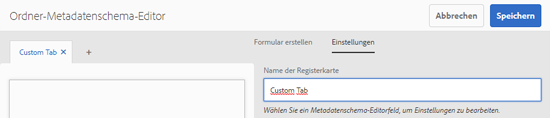
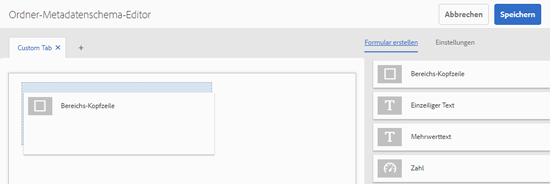
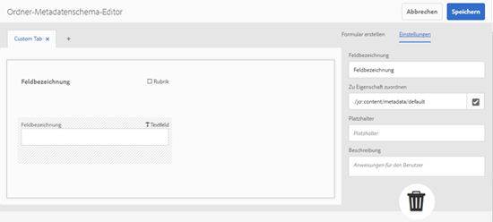
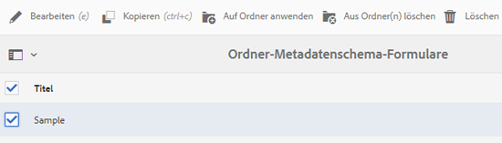
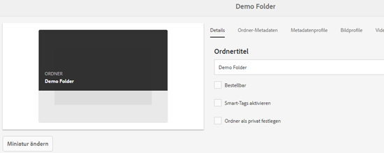
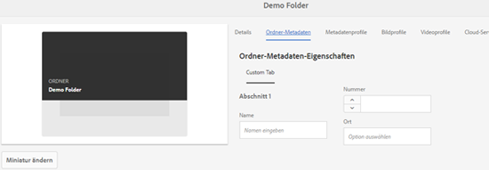
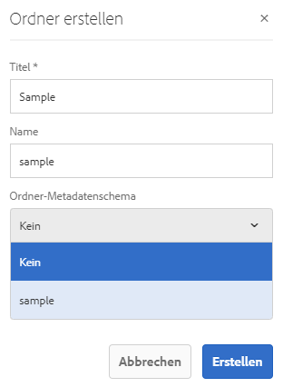

# Ordner-Metadatenschema {#folder-metadata-schema}

>[!CAUTION]
>
>AEM 6.4 hat das Ende der erweiterten Unterstützung erreicht und diese Dokumentation wird nicht mehr aktualisiert. Weitere Informationen finden Sie in unserer [technische Unterstützung](https://helpx.adobe.com/de/support/programs/eol-matrix.html). Unterstützte Versionen suchen [here](https://experienceleague.adobe.com/docs/?lang=de).

In diesem Artikel wird beschrieben, wie Sie ein Metadatenschema für Asset-Ordner in [!DNL Experience Manager] Assets.

Mit Adobe Experience Manager Assets können Sie Metadatenschemata für Asset-Ordner erstellen, die das Layout und die Metadaten definieren, die auf den Seiten mit Ordnereigenschaften angezeigt werden.

>[!NOTE]
>
>Diese Funktion erfordert [!DNL Experience Manager] 6.4 mit mindestens Service Pack 2 bereitgestellt. Für [!DNL Experience Manager] 6.4 Service Pack-Details, siehe diese [Versionshinweise](/help/release-notes/sp-release-notes.md).

## Hinzufügen von Ordner-Metadatenschema-Formularen {#add-a-folder-metadata-schema-form}

Verwenden Sie den Editor für Metadatenschema-Formulare, um Metadatenschemata für Ordner zu erstellen und zu bearbeiten.

1. Tippen/klicken Sie auf das [!DNL Experience Manager]-Logo und gehen Sie zu **[!UICONTROL Tools]** > **[!UICONTROL Assets]** > **[!UICONTROL Ordner-Metadatenschemata]**.
1. Tippen/klicken Sie auf der Seite „Ordner-Metadatenschema-Formulare“ auf **[!UICONTROL Erstellen]**.
1. Geben Sie einen Namen für das Formular an und tippen/klicken Sie auf **[!UICONTROL Erstellen]**. Das neue Schemaformular wird auf der Seite Schemaformulare aufgeführt.

## Bearbeiten von Ordner-Metadatenschema-Formularen {#edit-folder-metadata-schema-forms}

Sie können ein neu hinzugefügtes oder vorhandenes Metadatenschema-Formular bearbeiten, das Folgendes enthält:

* Registerkarten
* Formularelemente in Registerkarten.

Sie können diese Formularelemente einem Feld innerhalb eines Metdatenknotens im CRX-Repository zuordnen bzw. dafür konfigurieren. Sie können dem Metadatenschema-Formular neue Registerkarten oder Formularelemente hinzufügen.

1. Wählen Sie auf der Seite „Schemaformulare“ das erstellte Formular aus und tippen/klicken Sie in der Symbolleiste auf das Symbol **[!UICONTROL Bearbeiten]**.
1. Tippen/klicken Sie auf der Seite „Ordner-Metadatenschema-Editor“ auf das Symbol **[!UICONTROL +]**, um eine Registerkarte zum Formular hinzuzufügen. Um die Registerkarte umzubenennen, tippen/klicken Sie auf den Standardnamen und geben Sie unter **[!UICONTROL Einstellungen]** den neuen Namen an.

   

   Um weitere Registerkarten hinzuzufügen, tippen/klicken Sie erneut auf das Symbol **[!UICONTROL +]**. Tippen/klicken Sie auf **[!UICONTROL X]**, um eine Registerkarte zu löschen.

1. Fügen Sie in der aktiven Registerkarte eine oder mehrere Komponenten von der Registerkarte **[!UICONTROL Formular erstellen]** hinzu.

   

   Wenn Sie mehrere Registerkarten erstellen, tippen/klicken Sie auf eine Registerkarte, um Komponenten hinzuzufügen.

1. Um eine Komponente zu konfigurieren, wählen Sie diese aus und ändern Sie ihre Eigenschaften auf der Registerkarte **[!UICONTROL Einstellungen]**.

   Löschen Sie ggf. eine Komponente über die Registerkarte **[!UICONTROL Einstellungen]**.

   

1. Tippen/klicken Sie in der Symbolleiste auf **[!UICONTROL Speichern]**, um die Änderungen zu speichern.

### Komponenten zum Erstellen von Formularen {#components-to-build-forms}

Die Registerkarte **[!UICONTROL Formular erstellen]** enthält Formularelemente, die Sie im Ordner-Metadatenschema-Formular verwenden. Die Registerkarte **[!UICONTROL Einstellungen]** enthält die Attribute für jedes Element, das Sie auf der Registerkarte **[!UICONTROL Formular erstellen]** auswählen. Im Folgenden finden Sie eine Liste der auf der Registerkarte **[!UICONTROL Formular erstellen]** verfügbaren Elemente:

| Komponentenname | Beschreibung |
|---|---|
| [!UICONTROL Bereichs-Kopfzeile] | Fügen Sie eine Abschnittsüberschrift für eine Liste allgemeiner Komponenten hinzu. |
| [!UICONTROL Einzeilentext] | Fügen Sie eine einzeilige Texteigenschaft hinzu. Diese wird als Zeichenfolge gespeichert. |
| [!UICONTROL Mehrfachwerttext] | Fügen Sie eine Texteigenschaft mit mehreren Werten hinzu. Diese wird als Zeichenfolgen-Array gespeichert. |
| [!UICONTROL Zahl] | Fügen Sie eine Zahlenkomponente hinzu. |
| [!UICONTROL Datum] | Fügen Sie eine Datumskomponente hinzu. |
| [!UICONTROL Dropdown] | Fügen Sie eine Dropdown-Liste hinzu. |
| [!UICONTROL Standard-Tags] | Fügen Sie ein Tag hinzu. |
| [!UICONTROL Ausgeblendetes Feld] | Fügen Sie ein ausgeblendetes Feld hinzu. Dieses wird beim Speichern des Assets als POST-Parameter gesendet. |

### Bearbeiten von Formularelementen {#editing-form-items}

Um die Eigenschaften von Formularelementen zu bearbeiten, tippen/klicken Sie auf die Komponente und bearbeiten Sie folgende Eigenschaften auf der Registerkarte **[!UICONTROL Einstellungen]**.

**[!UICONTROL Feldbezeichnung]**: Der Name der Metadateneigenschaft, der auf der Eigenschaftenseite des Assets angezeigt wird.

**[!UICONTROL Zu Eigenschaft zuordnen]**: Diese Eigenschaft gibt den relativen Pfad des Ordnerknotens im CRX-Repository an, wo das Element gespeichert ist. Er beginnt mit &quot;**./**&quot;, was angibt, dass sich der Pfad unter dem Knoten des Ordners befindet.

Im Folgenden finden Sie die gültigen Werte für diese Eigenschaft:

* `./jcr:content/metadata/dc:title`: Speichert den Wert im Metadatenknoten des Ordners als Eigenschaft `dc:title`.

* `./jcr:created`: Zeigt die Eigenschaft „JCR“ im Knoten des Ordners an. Wenn Sie diese Eigenschaften in CRXDE konfigurieren, empfiehlt Adobe, dass Sie sie mit „Bearbeitung deaktivieren“ markieren, da sie geschützt sind. Andernfalls tritt der Fehler `Asset(s) failed to modify` auf, wenn Sie die Eigenschaften des Assets speichern.

Um zu gewährleisten, dass die Komponente ordnungsgemäß im Metadatenschema-Formular angezeigt wird, fügen Sie dem Eigenschaftenpfad keine Leerzeichen hinzu.

**[!UICONTROL JSON-Pfad]**: Verwenden Sie diese Eigenschaft, um den Pfad der JSON-Datei anzugeben, in der Sie Schlüssel-Wert-Paare für Optionen speichern.

**[!UICONTROL Platzhalter]**: Verwenden Sie diese Eigenschaft, um relevanten Platzhaltertext für die Metadateneigenschaft anzugeben.

**[!UICONTROL Wahlen]**: Mit dieser Eigenschaft legen Sie Optionen in einer Liste fest.

**[!UICONTROL Beschreibung]**: Mit dieser Eigenschaft können Sie eine kurze Beschreibung für die Metadatenkomponente hinzufügen.

**[!UICONTROL Klasse]**: Objektklasse, mit der die Eigenschaft verknüpft ist.

## Löschen von Ordner-Metadatenschema-Formularen {#delete-folder-metadata-schema-forms}

Sie können Ordner-Metadatenschema-Formulare über die Seite „Ordner-Metadatenschema-Formulare“ löschen. Um ein Formular zu löschen, wählen Sie es aus und tippen/klicken Sie in der Symbolleiste auf das Löschsymbol.

## Zuweisen eines Ordner-Metadatenschemas {#assign-a-folder-metadata-schema}

Sie können ein Ordner-Metadatenschema über die Seite „Ordner-Metadatenschema-Formulare“ oder bei der Ordnererstellung einem Ordner zuordnen.

Wenn Sie ein Metadatenschema für einen Ordner konfigurieren, wird der Pfad in der Eigenschaft `folderMetadataSchema` des Ordnerknotens unter */jcr:content* gespeichert.

### Zuweisen eines Schemas über die Seite „Ordner-Metadatenschema“ {#assign-to-a-schema-from-the-folder-metadata-schema-page}

1. Tippen/klicken Sie auf das [!DNL Experience Manager]-Logo und gehen Sie zu **[!UICONTROL Tools]** > **[!UICONTROL Assets]** > **[!UICONTROL Ordner-Metadatenschemata]**.
1. Wählen Sie auf der Seite „Ordner-Metadatenschema-Formulare“ das Schemaformular aus, das Sie auf einen Ordner anwenden möchten.
1. Tippen/klicken Sie in der Symbolleiste auf **[!UICONTROL Auf Ordner anwenden]**.

1. Wählen Sie den Ordner aus, auf den Sie das Schema anwenden möchten, und klicken/tippen Sie auf **[!UICONTROL Anwenden]**. Wenn bereits ein Metadatenschema auf den Ordner angewendet wurde, wird eine Warnung dazu angezeigt, dass das bestehende Schema überschrieben wird. Tippen/klicken Sie auf **[!UICONTROL Überschreiben]**.
1. Öffnen Sie die Metadateneigenschaften für den Ordner, auf den Sie das Schema angewendet haben.

   

   Um die Felder der Ordnermetadaten anzuzeigen, tippen/klicken Sie auf die Registerkarte **[!UICONTROL Ordnermetadaten]**.

   

### Zuweisen eines Schemas bei der Ordnererstellung {#assign-a-schema-when-creating-a-folder}

Sie können beim Erstellen eines Ordners ein Ordner-Metadatenschema zuweisen. Wenn mindestens ein Ordner-Metadatenschema im System vorhanden ist, wird eine zusätzliche Liste im **[!UICONTROL Ordner erstellen]** angezeigt. Sie können das gewünschte Schema auswählen. Standardmäßig ist kein Schema ausgewählt.

1. Tippen/klicken Sie in der Symbolleiste der [!DNL Assets]-Benutzeroberfläche auf **[!UICONTROL Erstellen]**.
1. Geben Sie einen Titel und einen Namen für den Ordner an.
1. Wählen Sie in der Liste Ordner-Metadatenschema das gewünschte Schema aus. Tippen/klicken Sie dann auf **[!UICONTROL Erstellen]**.

   

1. Öffnen Sie die Metadateneigenschaften für den Ordner, auf den Sie das Schema angewendet haben.
1. Um die Felder der Ordnermetadaten anzuzeigen, tippen/klicken Sie auf die Registerkarte **[!UICONTROL Ordnermetadaten]**.

## Verwenden des Ordner-Metadatenschemas {#use-the-folder-metadata-schema}

Öffnen Sie die Eigenschaften für einen Ordner, der mit einem Ordner-Metadatenschema konfiguriert wurde. Hierdurch wird die Registerkarte **[!UICONTROL Ordnermetadaten]** auf der Seite mit den Ordnereigenschaften angezeigt. Um das Ordner-Metadatenschema-Formular anzuzeigen, wählen Sie diese Registerkarte aus.

Geben Sie Metadatenwerte in die verschiedenen Felder ein und tippen/klicken Sie auf **[!UICONTROL Speichern]**, um die Werte zu speichern. Die angegebenen Werte werden im Ordnerknoten im CRX-Repository gespeichert.

