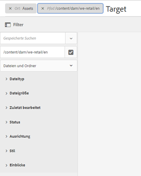
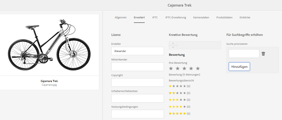
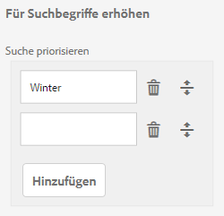

# GQL-Volltextsuche {#gql-full-text-search}

Lernen Sie die Funktion zur GQL-Volltextsuche in AEM Assets kennen. Mit dieser Funktion können Sie basierend auf speziellen Metadaten, wie Titel, Beschreibung und Erstellername nach Assets suchen.

Mit der Funktion zur GQL-Volltextsuche können Sie basierend auf speziellen Metadaten, wie Titel, Beschreibung, Ersteller usw., nach Assets suchen.

Um nach einem Asset zu suchen, das auf seinen Metadaten (z. B. &quot;title&quot;) basiert, geben Sie im Suchfeld das Metadatenstichwort gefolgt von seinem Wert an. Die Funktion zur GQL-Volltextsuche ruft nur die Assets ab, deren Metadaten exakt mit dem eingegebenen Wert übereinstimmen.

Beispiel: Führen Sie diese Schritte aus, um nach Assets mit dem Titel „Target“ zu suchen:

## Suchen nach Assets {#searching-assets}

1. Klicken Sie in der Symbolleiste der Benutzeroberfläche &quot;Assets&quot;auf das Symbol **[!UICONTROL Suchen]** oder tippen Sie darauf, um das Feld &quot;Omniture&quot;anzuzeigen.

   

1. Drücken Sie die Eingabetaste, während sich der Cursor im OmniSearch-Feld befindet.
1. Klicken oder tippen Sie auf das GlobalNav-Symbol, um das Bedienfeld **[!UICONTROL Filter]** anzuzeigen.
1. Geben Sie im OmniSearch-Feld den Wert „Ziel“ an. Um Ihre Suche auf einen bestimmten Ordner zu beschränken, klicken oder tippen Sie auf das Symbol „Durchsuchen“ im Bedienfeld „Filter“ und wählen Sie den Ordner aus. In diesem Fall wird die Übereinstimmung nur innerhalb des Ordners und in den untergeordneten Ordner gesucht.

   >[!NOTE]
   >
   >Sie können auch eine Volltextsuche für den Ordner durchführen. In diesem Fall müssen Sie einen nicht leeren Suchbegriff für die Volltextsuche angeben.

   

1. Drücken Sie **[!UICONTROL die Eingabetaste]**. Die AEM Assets-Benutzeroberfläche zeigt nur die Assets an, deren Titel exakt mit &quot;Zielgruppe&quot;übereinstimmen.

Mit der Volltextsuche-Funktion für GQL können Sie Assets auf der Grundlage folgender Elemente suchen:

* Komplexe Abfrage, bei der die für mehrere Metadatenfelder (Eigenschaften) angegebenen Werte über einen Und-Vorgang kombiniert werden
* Mehrere Werte für ein einzelnes Metadatenfeld
* Übereinstimmende Teilzeichenfolgen

Mit der Volltextsuche-Funktion für GQL können Sie anhand der folgenden Metadateneigenschaften nach Assets suchen. Bei den Namen der Eigenschaften (z. B. Autor, Titel usw.) und den Werten wird zwischen Groß- und Kleinschreibung unterschieden.

>[!NOTE]
>
>Die GQL-Volltextsuche funktioniert nur mit Volltexteigenschaften.

| Property | Suchformat (Facet-Wert) |
|---|---|
| [!UICONTROL Titel] | title:John |
| [!UICONTROL Ersteller] | creator:John |
| [!UICONTROL Mitarbeiter] | contributor:John |
| [!UICONTROL Standort] | location:India |
| [!UICONTROL Beschreibung] | description:&quot;Sample Image&quot; |
| [!UICONTROL Erstellungswerkzeug] | creatortool:„Adobe Photoshop 7.0“ |
| [!UICONTROL Urheberrechtsbesitzer] | copyrightowner:&quot;Adobe Systems&quot; |
| [!UICONTROL Mitarbeiter] | Mitarbeiter:John |
| [!UICONTROL Nutzungsbedingungen] | usageterms:„CopyRights Reserved“ |
| [!UICONTROL Erstellt] | created:YYYY-MM-DDTHH:MM:SS.000+05:30.YYYY-MM-DDTHH:MM:SS.000+05:30 |
| [!UICONTROL Ablaufdatum] | expires:YYYY-MM-DDTHH:MM:SS.000+05:30.YYYY-MM-DDTHH:MM:SS.000+05:30 |
| [!UICONTROL Einschaltzeit] | ontime:YYYY-MM-DDTHH:MM:SS.000+05:30..YYYY-MM-DDTHH:MM:SS.000+05:30 |
| [!UICONTROL Ausschaltzeit] | offtime:YYYY-MM-DDTHH:MM:SS.000+05:30..YYYY-MM-DDTHH:MM:SS.000+05:30 |
| [!UICONTROL Zeitraum]  (läuft dateontime ab, offtime) | facet field : lowerbound.upperbound |
| [!UICONTROL Pfad] | /content/dam/&lt;Ordnername> |
| [!UICONTROL PDF-Titel] | pdftitle:„Adobe Document“ |
| [!UICONTROL Betreff] | subject:„Training“ |
| [!UICONTROL Tags] | tags:„Location And Travel“ |
| [!UICONTROL Typ] | type:&quot;image\png&quot; |
| [!UICONTROL Bildbreite] | width:lowerbound.upperbound |
| [!UICONTROL Bildhöhe] | height:lowerbound.upperbound |
| [!UICONTROL Person] | person:John |

Im Folgenden finden Sie einige Beispiele für Suchformate für komplexe Abfragen:

* So zeigen Sie alle Assets mit mehreren Facettenfeldern an (wie: title=John Doe und creator tool = Adobe Photoshop):

tiltle:&quot;John Doe&quot;-Creatortool: Adobe&amp;ast;

* So zeigen Sie alle Assets an, wenn der Facettenwert nicht ein einzelnes Wort, sondern ein Satz ist (wie: title=Scott Reynolds)

title:„Scott Reynolds“

* So zeigen Sie alle Assets mit mehreren Werten für eine einzelne Eigenschaft an (wie: title=Scott Reynolds oder John Doe)

title:„Scott Reynolds“ OR „John Doe“

* So zeigen Sie Assets an, deren Eigenschaftswerte mit einer bestimmten Zeichenfolge beginnen (wie: title ist Scott Reynolds)

title:&quot;Scott&quot;

* So zeigen Sie Assets an, deren Eigenschaftswerte mit einer bestimmten Zeichenfolge enden (wie: title ist Scott Reynolds)

title:&quot;Reynolds&quot;

* So zeigen Sie Assets mit einem Eigenschaftswert an, der eine bestimmte Zeichenfolge enthält (wie: title=Basel Meeting Room)

Titel:&quot;Sitzung&quot;;

* So zeigen Sie Assets an, die eine bestimmte Zeichenfolge enthalten und einen bestimmten Eigenschaftswert aufweisen (wie die Suche nach der Zeichenfolge „Adobe“ in Assets mit title=John Doe)

&amp;ast;Adobe&amp;ast; title:&quot;John Doe &quot;OR title:&quot;John Doe&quot; &amp;ast;Adobe&amp;ast;

>[!NOTE]
>
>Die Eigenschaften „path“, „limit“, „size“ und „orderby“ können nicht über ODER mit einer anderen Eigenschaft verknüpft werden.
>
>Das Keyword für eine von einem Benutzer erstellte Eigenschaft ist ihre Feldbeschriftung im Eigenschafteneditor in Kleinbuchstaben und ohne Leerzeichen.

>[!NOTE]
>
>Wenn Sie eine JCR-Abfrage schreiben, um nur Unter-Assets zu suchen, werden die referenzierten Assets ebenfalls zusammen mit den übereinstimmenden Unter-Assets angezeigt.

Die Volltextsuche unterstützt auch Operatoren wie -, ^ usw. Um diese Buchstaben als alphabetische Zeichenfolgen zu suchen, setzen Sie den Suchausdruck in doppelte Anführungszeichen. Verwenden Sie z. B. „Notebook - Schönheit“ statt Notebook - Schönheit.

## Optimieren der Suche {#boosting-search}

Sie können die Relevanz von Keywords für bestimmte Assets verbessern, um die auf Keywords basierenden Suchen zu optimieren. D. h. die Bilder, für die Sie bestimmte Keywords festlegen, erscheinen bei der Suche nach diesen Keywords oben in den Suchergebnissen.

1. Öffnen Sie in der Assets-Benutzeroberfläche die Eigenschaftenseite für das Asset, für das Sie einen Suchbegriff festlegen möchten.
1. Wechseln Sie zur Registerkarte **[!UICONTROL Erweitert]** und klicken/tippen Sie auf die Option **[!UICONTROL Hinzufügen]** unter **[!UICONTROL Für Suchbegriffe erhöhen]**.

   

1. Geben Sie im Feld **[!UICONTROL Suche priorisieren]** ein Keyword ein, für den Sie die Bildsuche optimieren möchten, und klicken oder tippen Sie anschließend auf **[!UICONTROL Hinzufügen]**. Geben Sie bei Bedarf mehrere Suchbegriffe auf die gleiche Weise an.

   

1. Klicken/tippen Sie auf **[!UICONTROL Speichern und schließen]**.
1. Suchen Sie mithilfe des OmniSearch-Feldes nach dem Suchbegriff. Das Asset, für das Sie dieses Schlüsselwort festgelegt haben, befindet sich unter den oberen Suchergebnissen.