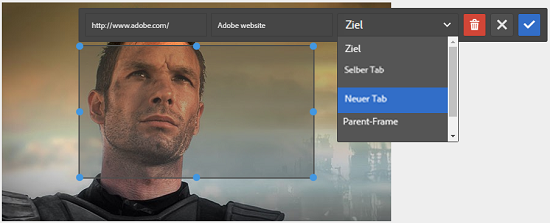
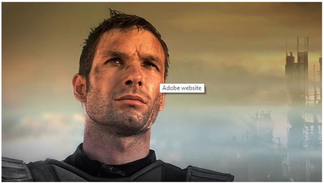

# Hinzufügen von Imagemaps {#adding-image-maps}

Erfahren Sie, wie Sie Bild-Assets per Hyperlink verbundene Imagemaps hinzufügen können.

Mit Imagemaps können Sie einen oder mehrere Hyperlinkbereiche hinzufügen, die genau so wie andere Hyperlinks funktionieren.

1. Führen Sie einen der folgenden Schritte aus, um **[!UICONTROL Bild-Editor für Bearbeitung im Kontext]** zu öffnen:

   * Tippen Sie mithilfe von Schnellaktionen auf das Symbol **[!UICONTROL Bearbeiten]** , das auf einem Asset in der Ansicht **[!UICONTROL Karte]** angezeigt wird. Wählen Sie in der Listenansicht das Asset aus und tippen Sie in der Symbolleiste auf das Symbol **Bearbeiten** .

      >[!NOTE]
      >
      >Schnellaktionen sind in der Ansicht **[!UICONTROL Liste]** nicht verfügbar.

   * Wählen Sie in der Ansicht **[!UICONTROL Karte]** oder **[!UICONTROL Liste]** das Asset aus und tippen Sie in der Symbolleiste auf das Symbol **[!UICONTROL Bearbeiten]** .
   * Tippen Sie auf der Asset-Seite auf das Symbol **[!UICONTROL Bearbeiten]** .

      

1. Um eine Imagemap einzufügen, tippen Sie in der Symbolleiste auf das Symbol **[!UICONTROL Map starten]** .

   

1. Wählen Sie die Form der Imagemap aus. Der Hotspot der ausgewählten Form wird auf das Bild gelegt.

   

1. Tippen Sie auf den Hotspot und geben Sie die URL und den Alternativtext ein. Geben Sie in der Liste **[!UICONTROL Target]** an, wo die Imagemap angezeigt werden soll, z. B. auf derselben Registerkarte, auf einer neuen Registerkarte oder in einem iFrame. Geben Sie beispielsweise `https://www.adobe.com` als URL, `Adobe website` als ALT-Text ein und geben Sie **[!UICONTROL Neue Registerkarte]** aus der Liste **[!UICONTROL Target]** an, damit die Imagemap auf einer neuen Registerkarte geöffnet wird.

   

1. Tippen Sie auf das Symbol **[!UICONTROL Bestätigen]** und dann auf das Symbol **[!UICONTROL Beenden]** in der Symbolleiste, um die Änderungen zu speichern.

   

   Um die Imagemap zu löschen, tippen Sie auf den Hotspot und dann auf das Symbol **[!UICONTROL Löschen]**.

   

1. Um die Imagemap anzuzeigen, navigieren Sie zur Asset-Detailseite und bewegen Sie den Cursor über das Bild.

   

   Wenn die Dynamic Media-Option aktiviert ist, navigieren Sie zum Asset-Editor und tippen Sie auf das Symbol **[!UICONTROL Map]** , um alle angewendeten Imagemaps anzuzeigen.
