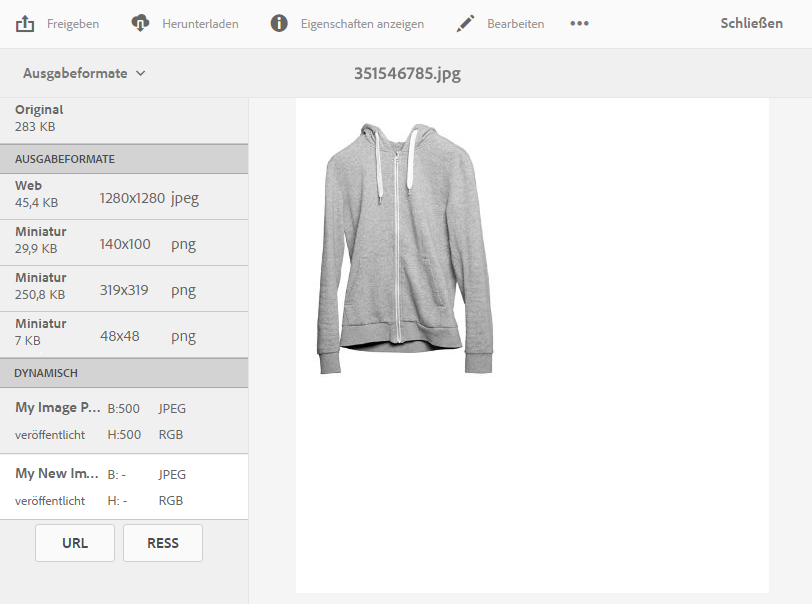

# Anwenden von Dynamic Media-Bildvorgaben {#applying-image-presets}

>[!CAUTION]
>
>AEM 6.4 hat das Ende der erweiterten Unterstützung erreicht und diese Dokumentation wird nicht mehr aktualisiert. Weitere Informationen finden Sie in unserer [technische Unterstützung](https://helpx.adobe.com/de/support/programs/eol-matrix.html). Unterstützte Versionen suchen [here](https://experienceleague.adobe.com/docs/?lang=de).

Anhand von Bildvorgaben kann Assets Bilder mit unterschiedlichen Größen, Formaten oder Bildeigenschaften dynamisch bereitstellen. Sie können beim Exportieren von Bildern eine Vorgabe auswählen, die auch Bilder entsprechend den Spezifikationen des Administrators umformatiert.

Darüber hinaus können Sie eine responsive Bildvorgabe auswählen (nach der Auswahl durch die Schaltfläche **[!UICONTROL RESS]** gekennzeichnet).

In diesem Abschnitt wird die Verwendung von Bildvorgaben beschrieben. [Admins können Bildvorgaben erstellen und konfigurieren](managing-image-presets.md).

>[!NOTE]
>
>Die intelligente Bildbearbeitung arbeitet mit bestehenden Bildvorgaben und reduziert im letzten Moment abhängig vom Browser oder der Geschwindigkeit der Netzverbindung die Größe der Bilddatei intelligent noch weiter. Weitere Informationen finden Sie unter [Intelligente Bildbearbeitung](imaging-faq.md).

Sie können jederzeit bei der Vorschau eines Bildes eine Bildvorgabe darauf anwenden.

**So wenden Sie Dynamic Media-Bildvorgaben an**:

1. Öffnen Sie das Asset und tippen Sie in der linken Leiste auf das Dropdown-Menü und anschließend auf **[!UICONTROL Ausgabedarstellungen]**.

   >[!NOTE]
   >
   >* Statische Ausgabeformate werden in der oberen Hälfte des Bereichs angezeigt. Dynamische Ausgabedarstellungen werden in der unteren Hälfte angezeigt. Bei dynamischen Ausgabedarstellungen (und nur bei diesen) können Sie das Bild mit der URL anzeigen. Die Schaltfläche **[!UICONTROL URL]** wird nur angezeigt, wenn Sie eine dynamische Ausgabedarstellung auswählen. Die **[!UICONTROL RESS]** nur angezeigt, wenn Sie eine responsive Bildvorgabe auswählen.
   >
   >* Das System zeigt mehrere Ausgabedarstellungen, wenn Sie **[!UICONTROL Ausgabedarstellungen]** in der Detailansicht eines Assets auswählen. Sie können die Anzahl der angezeigten Vorgaben erhöhen. Siehe [Erhöhung der Anzahl der angezeigten Bildvorgaben](managing-image-presets.md#increasing-or-decreasing-the-number-of-image-presets-that-display).

   

1. Führen Sie einen der folgenden Schritte aus:

   * Wählen Sie eine dynamische Ausgabedarstellung aus, um eine Vorschau der Bildvorgabe anzuzeigen.
   * Tippen Sie auf **[!UICONTROL URL]**, **[!UICONTROL Einbetten]** oder **[!UICONTROL RESS]**, um das Popup-Fenster anzuzeigen.

   >[!NOTE]
   >
   >Wenn das Asset *und* die Bildvorgabe noch nicht veröffentlicht wurden, ist die Schaltfläche **[!UICONTROL URL]** (bzw. die Schaltflächen **[!UICONTROL URL]** und **[!UICONTROL RESS]**, falls zutreffend) nicht verfügbar.
   >
   >Beachten Sie auch, dass Bildvorgaben automatisch auf einem -Server für Dynamic Media veröffentlicht werden.
