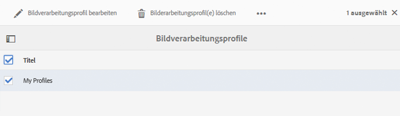
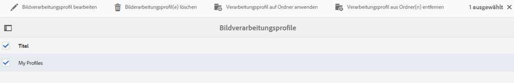
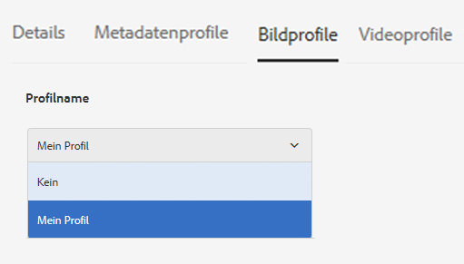
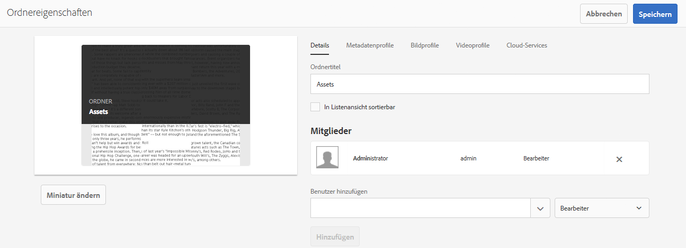
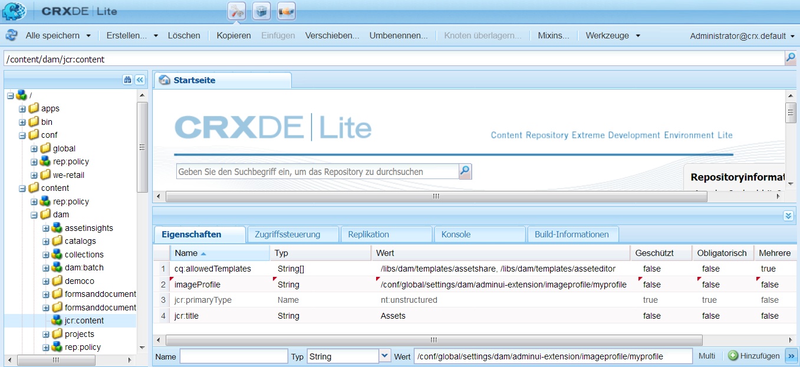
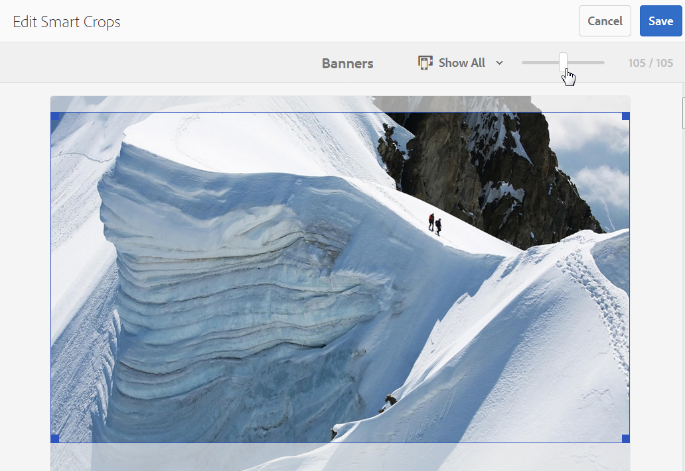

# Dynamic Media-Bildprofile {#image-profiles}

Wenn Sie Bilder hochladen, können Sie das Bild nach dem Hochladen automatisch zuschneiden, indem Sie ein neues Bildprofil auf den Ordner anwenden.

>[!NOTE]
>
>Smartes Zuschneiden ist nur im Scene7-Modus von Dynamic Media verfügbar.

>[!IMPORTANT]
>
>Bildprofile können nicht auf PDF-, animierte GIF- oder INDD-Dateien (Adobe InDesign) angewendet werden.

## Optionen für das Zuschneiden {#crop-options}

Wenn Sie smartes Zuschneiden für Bilder implementieren, empfiehlt Adobe die folgende Best Practice und erzwingt die folgende Beschränkung:

| Begrenzungstyp | Best Practice | Erzwungene Begrenzung |
| --- | --- | --- |
| Anzahl der smarten Zuschnitte pro Bild | 5 | 100 |

Siehe auch [Dynamic Media-Beschränkungen](/help/assets/limitations.md).

<!-- CQDOC-16069 for paragraph directly below -->

Die Koordinaten für das smarte Zuschneiden hängen vom Seitenverhältnis ab. Das heißt, dass bei jeder Einstellung für smartes Zuschneiden in einem Bildprofil dasselbe Seitenverhältnis an Dynamic Media gesendet wird, wenn das Seitenverhältnis für die hinzugefügten Dimensionen im Bildprofil dasselbe ist. Daher empfiehlt Adobe, denselben Zuschnittbereich zu verwenden. Dadurch werden die im Bildprofil verwendeten verschiedenen Abmessungen nicht beeinträchtigt.

Jeder von Ihnen erstellte smarte Zuschnitt erfordert zusätzliche Verarbeitungsschritte. Das Hinzufügen von mehr als fünf Seitenverhältnissen für das smarte Zuschneiden kann beispielsweise zu einer langsamen Aufnahmerate für Assets führen. Dies kann auch zu einer erhöhten Belastung der Systeme führen. Da Sie smartes Zuschneiden auf Ordnerebene anwenden können, empfiehlt Adobe, es *nur* dort anzuwenden, wo es benötigt werden.

**Richtlinien zum Definieren von smartem Zuschneiden in einem Bildprofil**
Um die Verwendung von smartem Zuschneiden unter Kontrolle zu halten und die Verarbeitungszeit und Lagerung von Kulturen zu optimieren, empfiehlt Adobe die folgenden Richtlinien und Tipps:

* Für Bild-Assets, auf die ein smartes Zuschneiden angewendet wird, muss mindestens 50 x 50 Pixel groß sein. &lt;!-- CQDOC-20087>
* Ein Bildprofil, das doppelte smarte Zuschnittdimensionen enthält, ist nicht zulässig. &lt;!-- CQDOC-20087>
* Duplizierte Bildprofile mit Namen, für die Optionen für das smarte Zuschneiden festgelegt sind, sind nicht zulässig. &lt;!-- CQDOC-20087>
* Erstellen Sie seitenweise Bildprofile/Asset-Typ für bestimmte Ordner und Unterordner anstelle eines gemeinsamen Smart-Zuschnitt-Profils, das auf alle Ordner oder Assets angewendet wird.
* Ein Bildprofil, das Sie auf Unterordner anwenden, überschreibt ein Bildprofil, das auf den Ordner angewendet wird.
* Idealerweise sollten Sie pro Bild 10 bis 15 smarte Zuschnitte haben, um das Bildschirmverhältnis und die Verarbeitungszeit zu optimieren.
<!-- * Avoid creating duplicate smart crop profiles that have the same width and height values. 
* Name smart crops based on crop dimensions, not on end usage. Doing so helps to optimize for duplicates where a single dimension is used on multiple pages.-->

Es stehen für das Zuschneiden zwei Optionen zur Auswahl. Sie können auch die Erstellung von Farb- und Bildmustern automatisieren oder einen zugeschnittenen Inhalt über Zielauflösungen hinweg beibehalten.

>[!IMPORTANT]
>
>• Adobe empfiehlt, alle erzeugten Zuschnitte und Farbfelder zu überprüfen, um sicherzustellen, dass sie für Ihre Marke und Ihre Werte angemessen und relevant sind.
• Das CMYK-Bildformat wird beim smarten Zuschneiden nicht unterstützt.

<table> 
 <tbody> 
  <tr> 
   <td><strong>Option</strong></td> 
   <td><strong>Wann ist sie einzusetzen?</strong></td> 
   <td><strong>Beschreibung</strong></td> 
  </tr> 
  <tr> 
   <td>Pixel-Zuschnitt</td> 
   <td>Nur Massenzuschnitt von Bildern basierend auf Dimensionen.</td> 
   <td>
Um diese Option zu verwenden, wählen Sie aus dem Dropdown-Menü „Zuschnittsoptionen“ <strong>Pixelzuschnitt</strong> aus.
 
 Um ein Bild an den Seiten zuzuschneiden, geben Sie die Anzahl der Pixel ein, die von einer Seite oder jeder Seite des Bildes abgeschnitten werden sollen. Wieviel von dem Bild abgeschnitten wird, hängt von der ppi-Einstellung (Pixel pro Zoll) in der Bilddatei ab.
 
Ein Bildprofil-Pixelzuschnitt wird wie folgt gerendert:  
 
    <ul> 
     <li>Werte: oben, unten, links und rechts.</li> 
     <li>Der Wert für links ist 0,0. Von dort aus wird der Pixelzuschnitt berechnet.</li> 
     <li>Startpunkt des Zuschnitts: Links ist X und oben ist Y</li> 
     <li>Horizontale Berechnung: Horizontale Pixelabmessungen des Originalbilds abzüglich des Werts für links und dann abzüglich des Werts für rechts.</li> 
     <li>Vertikale Berechnung: Die vertikale Pixel-Höhe abzüglich des Werts für oben und dann abzüglich des Werts für unten.</li> 
    </ul> 
Beispiel: Sie haben ein Bild in der Größe 4000 x 3000 Pixel. Sie verwenden folgende Werte: Oben = 250, Unten = 500, Links = 300, Rechts = 700.
 
Schneiden Sie von oben links (300, 250) aus mit dem Füllraum (4000-300-700, 3000-250-500 oder 3000,2250).
 </td> 
  </tr> 
  <tr> 
   <td>Smartes Zuschneiden</td> 
   <td>Massenzuschnitt von Bildern basierend auf ihrem visuellen Fokus.</td> 
   <td>
Smartes Zuschneiden nutzt die Möglichkeiten künstlicher Intelligenz in Adobe Sensei, um den Massenzuschnitt von Bildern schnell zu automatisieren. Smartes Zuschneiden erkennt automatisch den Fokus in jedem Bild und schneidet es entsprechend zu, um das Bildmotiv richtig zu erfassen – unabhängig von der Bildschirmgröße.
 
Um smartes Zuschneiden zu verwenden, wählen Sie aus der Dropdown-Liste „Zuschnittsoptionen“ die Option <strong>Smartes Zuschneiden</strong> aus und aktivieren Sie „Responsive Bildbeschneidung“.
 
Die standardmäßigen Breakpoint-Größen für „Groß“, „Mittel“ und „Klein“ decken in der Regel alle Größen ab, in denen Bilder auf Smartphones, Tablets, Computern und in Bannern verwendet werden. Sie können die Standardnamen „Groß“, „Mittel“ und „Klein“ beliebig anpassen.
 
Um weitere Breakpoints hinzuzufügen, klicken Sie auf <strong>Zuschnitt hinzufügen</strong>. Wenn Sie einen Zuschnitt löschen möchten, klicken Sie auf das Papierkorb-Symbol.
 </td> 
  </tr> 
  <tr> 
   <td>Farb- und Bildmuster</td> 
   <td>Massenweise Erstellung von Bildmustern für die einzelnen Bilder.</td> 
   <td>
<strong>Hinweis:</strong> Smarte Muster werden in Dynamic Media Classic nicht unterstützt.
 
Erkennen und generieren Sie automatisch hochwertige Bildmuster aus Produktbildern, die Farbe oder Textur zeigen.
 
Um Farb- und Bildmuster zu verwenden, wählen Sie aus der Dropdown-Liste „Zuschnittsoptionen“ <strong>Smartes Zuschneiden</strong> aus und aktivieren Sie die Funktion „Farb- und Bildmuster“. Geben Sie in die Textfelder Breite und Höhe einen Wert in Pixel ein.
 
Zwar sind alle Bildzuschnitte über die Leiste „Ausgabedarstellungen“ verfügbar, jedoch können Farb- und Bildmuster nur über die Funktion „URL kopieren“ verwendet werden. Es ist erforderlich, dass Sie Ihre eigene Anzeigekomponente verwenden, um das Muster auf Ihrer Site zu rendern. (Hiervon ausgenommen sind Karussellbanner. Dynamic Media bietet die Anzeigekomponente für in entsprechenden Bannern verwendete Farb-/Bildmuster.)
 
<strong>Verwendung von Bildmustern</strong>
 
Die URL für Bildmuster ist einfach:
 
<code>/is/image/company/&lt;asset_name&gt;:Swatch</code>
 
wobei <code>:Swatch</code> an die Asset-Anfrage angehängt wird.
 
<strong>Verwendung von Farbmustern</strong>
 
Um Farbmuster zu verwenden, stellen Sie wie folgt eine <code>req=userdata</code>-Anfrage:
 
<code>/is/image/&lt;company_name&gt;/&lt;swatch_asset_name&gt;:Swatch?req=userdata</code>
 
Folgendes ist beispielsweise ein Farbmuster-Asset in Dynamic Media Classic:
 
<code>https://my.company.com:8080/is/image/DemoCo/Sleek:Swatch</code>
 
Die entsprechende <code>req=userdata</code>-URL für das Farbmuster-Asset lautet:
 
<code>https://my.company.com:8080/is/image/DemoCo/Sleek:Swatch?req=userdata</code>
 
Die <code>req=userdata</code>-Antwort sieht wie folgt aus:
 
<code class="code">SmartCropDef=Swatch
       SmartCropHeight=200.0
       SmartCropRect=0.421671,0.389815,0.0848564,0.0592593,200,200
       SmartCropType=Swatch
       SmartCropWidth=200.0
       SmartSwatchColor=0xA56DB2</code>
 
Sie können wie in den folgenden URL-Beispielen auch eine <code>req=userdata</code>-Antwort im XML- oder JSON-Format anfordern:
 
<code>https://my.company.com:8080/is/image/DemoCo/Sleek:Swatch?req=userdata,xml</code>

<code>SmartSwatchColor</code>

</td></tr></tbody></table>

## Unschärfemaske {#unsharp-mask}

Sie verwenden **Unschärfemaske** , um einen Scharfzeichnungsfiltereffekt für das endgültige heruntergesampelte Bild zu optimieren. Sie können die Intensität des Effekts, den Radius des Effekts (gemessen in Pixel) und einen Schwellenwert für den Kontrast festlegen, der ignoriert werden soll. Dieser Effekt verwendet dieselben Optionen wie der Adobe Photoshop-Filter &quot;Unschärfemaske&quot;.

>[!NOTE]
Die Unschärfemaske wird nur auf herunterskalierte Ausgabedarstellungen im PTIFF (Pyramiden-TIFF) angewendet, die mehr als 50 % heruntergesampelt sind. Das bedeutet, dass die größten Ausgabedarstellungen im PTIFF nicht von der Unschärfemaske betroffen sind, während kleinere Ausgabedarstellungen wie Miniaturansichten geändert werden (und die Unschärfemaske anzeigen).

In **Unschärfemaske** sind die folgenden Filteroptionen verfügbar:

<table> 
 <tbody> 
  <tr> 
   <td><strong>Option</strong></td> 
   <td><strong>Beschreibung</strong></td> 
  </tr> 
  <tr> 
   <td>Stärke</td> 
   <td>Steuert den auf die Kantenpixel angewendeten Kontrastwert. Der Standardwert ist 1,75. Bei hochauflösenden Bildern können Sie ihn auf bis zu 5 erhöhen. Der Wert dient hierbei als ein Maß für die Filterintensität. Bereich: 0-5.</td> 
  </tr> 
  <tr> 
   <td>Radius</td> 
   <td>Bestimmt die Anzahl der Pixel um die Kantenpixel, auf die sich die Scharfzeichnung auswirkt. Bei hochauflösenden Bildern geben Sie einen Wert zwischen 1 und 2 ein. Bei einem niedrigen Wert werden lediglich die Kantenpixel scharfgezeichnet, bei einem hohen Wert werden mehr Pixel scharfgezeichnet. Der korrekte Wert hängt von der Bildgröße ab. Der Standardwert ist 0,2.  Bereich: 0-250.</td> 
  </tr> 
  <tr> 
   <td>Schwelle</td> 
   <td>
Bestimmt den Kontrastbereich, der bei der Anwendung des Filters „Unschärfemaske“ ignoriert werden soll. In anderen Worten: Die Option bestimmt, wie stark sich die scharfgezeichneten Pixel vom Umgebungsbereich unterscheiden müssen, damit sie als Kantenpixel eingestuft und scharfgezeichnet werden. Um Rauschen zu vermeiden, experimentieren Sie mit Werten zwischen 0 und 255.
 </td> 
  </tr> 
 </tbody> 
</table>

Das Scharfzeichnen wird unter [Scharfzeichnen von Bildern](/help/assets/assets/sharpening_images.pdf) beschrieben.

## Erstellen von Dynamic Media-Bildprofilen {#creating-image-profiles}

Informationen zur Definition von erweiterten Verarbeitungsparametern für andere Asset-Typen finden Sie unter [Konfigurieren der Asset-Verarbeitung](config-dms7.md#configuring-asset-processing).

**So erstellen Sie Bildprofile für Dynamic Media**:

1. Tippen Sie auf das AEM-Logo und navigieren Sie zu **[!UICONTROL Tools > Assets > Bildprofile]**.
1. Tippen **[!UICONTROL Erstellen]** , um ein Bildprofil hinzuzufügen.
1. Geben Sie einen Profilnamen und Werte für Unschärfemasken, Zuschneiden oder Farb-/Bildmuster (oder beides) an.

   Es empfiehlt sich, einen Profilnamen auszuwählen, der den Zweck des Profils beschreibt. Wenn Sie z. B. ein Profil erstellen möchten, das nur Farbmuster generiert - bei dem &quot;Smartes Zuschneiden&quot;deaktiviert ist und &quot;Farb- und Bildmuster&quot;aktiviert ist -, können Sie den Profilnamen &quot;Smarte Farbmuster&quot;verwenden.

   Siehe auch Optionen für [Smartes Zuschneiden und smarte Farb-/Bildmuster](#crop-options) sowie [Unscharf maskieren](#unsharp-mask).

   

1. Tippen Sie auf **[!UICONTROL Speichern]**. Das neu erstellte Profil wird in der Liste der verfügbaren Profile angezeigt.

## Bearbeiten oder Löschen von Bildprofilen für Dynamic Media {#editing-or-deleting-image-profiles}

1. Tippen Sie auf das AEM-Logo und navigieren Sie zu **[!UICONTROL Tools > Assets > Bildprofile]**.
1. Wählen Sie das Bildprofil aus, das Sie bearbeiten oder entfernen möchten. Wählen Sie **[!UICONTROL Bildverarbeitungsprofil bearbeiten]** aus, um es zu bearbeiten. Wählen Sie **[!UICONTROL Bildverarbeitungsprofil löschen]** aus, um es zu entfernen.

   

1. Wenn Sie das Profil bearbeitet haben, speichern Sie die Änderungen. Wenn Sie das Profil löschen, bestätigen Sie, dass Sie es entfernen möchten.

## Anwenden eines Dynamic Media-Bildprofils auf Ordner {#applying-an-image-profile-to-folders}

Wenn Sie ein Bildprofil einem Ordner zuweisen, übernehmen automatisch alle Unterordner das Profil vom übergeordneten Ordner. Dieser Workflow bedeutet, dass Sie einem Ordner nur ein Bildprofil zuweisen können. Daher sollten Sie die Ordnerstruktur sorgfältig planen, in der Sie Assets hochladen, speichern, verwenden und archivieren.

Wenn Sie einem Ordner ein anderes Bildprofil zugewiesen haben, überschreibt das neue das vorherige Profil. Die zuvor vorhandenen Ordner-Assets verbleiben unverändert. Das neue Profil wird auf die Assets angewendet, die dem Ordner später hinzugefügt werden.

Ordner, denen ein Profil zugewiesen ist, werden in der Benutzeroberfläche durch den Namen des Profils angezeigt, der auf der Karte angezeigt wird.

Wenn Sie einem vorhandenen Bildprofil smarte Zuschnitte hinzufügen, müssen Sie die [Workflow &quot;DAM-Update-Asset&quot;](assets-workflow.md) , wenn Sie Zuschnitte für vorhandene Assets in Ihrem Asset-Repository erstellen möchten.

Sie können Bildprofile auf bestimmte Ordner oder global auf alle Assets anwenden.

### Anwenden von Dynamic Media-Bildprofilen auf bestimmte Ordner {#applying-image-profiles-to-specific-folders}

Sie können im Menü **[!UICONTROL Tools]** oder, wenn Sie sich im Ordner befinden, über **[!UICONTROL Eigenschaften]** ein Bildprofil auf einen Ordner anwenden. In diesem Abschnitt wird beschrieben, wie Sie Bildprofile auf beide Arten auf Ordner anwenden.

Ordner, denen bereits ein Profil zugewiesen ist, werden durch die Anzeige des Profilnamens direkt unter dem Ordnernamen gekennzeichnet.

#### Anwenden von Dynamic Media-Bildprofilen auf Ordner über die Benutzeroberfläche „Profile“  {#applying-image-profiles-to-folders-from-profiles-user-interface}

1. Tippen Sie auf das AEM-Logo und navigieren Sie zu **[!UICONTROL Tools > Assets > Bildprofile]**.
1. Wählen Sie ein Bildprofil aus, das Sie auf einen oder mehrere Ordner anwenden möchten.

   

1. Tippen Sie auf **[!UICONTROL Verarbeitungsprofil auf Ordner anwenden]** und wählen Sie mindestens einen Ordner aus, den Sie verwenden möchten, um neu hochgeladene Assets zu empfangen. Tippen oder klicken Sie anschließend auf **[!UICONTROL Anwenden]**. Ordner, denen bereits ein Profil zugewiesen ist, werden durch die Anzeige des Profilnamens direkt unter dem Ordnernamen gekennzeichnet.

#### Anwenden von Dynamic Media-Bildprofilen auf Ordner über „Eigenschaften“  {#applying-image-profiles-to-folders-from-properties}

1. Tippen Sie auf das AEM und navigieren Sie zu **[!UICONTROL Assets]**. Navigieren Sie dann zum übergeordneten Ordner des Ordners, auf den Sie ein Bildprofil anwenden möchten.
1. Tippen Sie im Ordner auf das Kontrollkästchen, um es zu aktivieren, und tippen Sie anschließend auf **[!UICONTROL Eigenschaften]**.
1. Tippen Sie auf die Registerkarte **[!UICONTROL Bildprofile]**. Wählen Sie in der Dropdown-Liste **[!UICONTROL Profilname]** das gewünschte Profil aus und klicken Sie auf **[!UICONTROL Speichern und schließen]**. Ordner, denen bereits ein Profil zugewiesen ist, werden durch die Anzeige des Profilnamens direkt unter dem Ordnernamen gekennzeichnet.

   

### Globales Anwenden eines Dynamic Media-Bildprofils {#applying-an-image-profile-globally}

Sie können ein Profil nicht nur auf einen Ordner anwenden, sondern auch global anwenden, sodass auf alle Inhalte, die in einen beliebigen Ordner in AEM Assets hochgeladen werden, das ausgewählte Profil angewendet wird.

**So wenden Sie ein Dynamic Media-Bildprofil global an**:

1. Führen Sie einen der folgenden Schritte aus:

   * Navigieren Sie zu **https://&lt;aem server=&quot;&quot;>/mnt/overlay/dam/gui/content/assets/foldersharewizard.html/content/dam** und wenden Sie das entsprechende Profil an und tippen Sie auf **Speichern**.

      

   * Navigieren Sie in CRXDE Lite zum folgenden Knoten: `/content/dam/jcr:content`.

      Fügen Sie die Eigenschaft `imageProfile:/conf/global/settings/dam/adminui-extension/imageprofile/<name of image profile>` hinzu und tippen Sie auf **[!UICONTROL Alle speichern]**.

      

## Bearbeiten von smarten Zuschnitten oder smarten Farb-/Bildmustern eines einzelnen Bildes {#editing-the-smart-crop-or-smart-swatch-of-a-single-image}

>[!NOTE]
Smartes Zuschneiden ist nur im Scene7-Modus von Dynamic Media verfügbar.

Sie können das Zuschnittsfenster eines Bildes manuell neu ausrichten oder die Größe ändern, um den Fokus präziser zu bestimmen.

Nachdem Sie einen smarten Zuschnitt bearbeitet und gespeichert haben, wird die Änderung überall dort angewendet, wo Sie den Zuschnitt für bestimmte Bilder verwenden.

Sie können einen smarten Zuschnitt erneut ausführen, um die zusätzlichen Zuschnitte ggf. erneut zu generieren.

Siehe auch [Bearbeiten von smarten Zuschnitten oder smarten Farb-/Bildmustern mehrerer Bilder](#editing-the-smart-crop-or-smart-swatch-of-multiple-images).

**So bearbeiten Sie smarte Zuschnitte oder smarte Farb-/Bildmuster eines einzelnen Bildes**:

1. Tippen Sie auf das AEM-Logo und navigieren Sie zu **[!UICONTROL Assets]** und dann zu dem Ordner, auf den das Bildprofil „Smartes Zuschneiden“ oder „Smartes Farb-/Bildmuster“ angewendet wurde.
1. Öffnen Sie den Inhalt, indem Sie auf den Ordner tippen.
1. Tippen Sie auf das Bild mit dem smarten Zuschneiden oder smarten Farb-/Bildmuster, das Sie anpassen möchten.
1. Tippen Sie in der Symbolleiste auf **[!UICONTROL Smartes Zuschneiden]**.

1. Führen Sie einen der folgenden Schritte aus:

   * Ziehen Sie den Schieberegler in der oberen rechten Ecke der Seite nach links oder rechts, um die Bildanzeige zu erweitern oder zu reduzieren.
   * Ziehen Sie im Bild eine Ecke, um die Größe des sichtbaren Bereichs des Zuschnitts oder Farb-/Bildmusters anzupassen.
   * Ziehen Sie das Feld bzw. Farb-/Bildmuster im Bild an eine neue Position. Sie können nur Bildmuster bearbeiten. Farbmuster sind statisch.
   * Tippen Sie über dem Bild auf **[!UICONTROL Wiederherstellen]**, um all Ihre Änderungen rückgängig zu machen und den ursprünglichen Zuschnitt bzw. das Farb-/Bildmuster wiederherzustellen.

1. Tippen Sie in der oberen rechten Ecke der Seite auf **[!UICONTROL Speichern]** und anschließend auf **[!UICONTROL Schließen]**, um zum Asset-Ordner zurückzukehren.

## Bearbeiten von smarten Zuschnitten oder smarten Farb-/Bildmustern mehrerer Bilder {#editing-the-smart-crop-or-smart-swatch-of-multiple-images}

Nachdem Sie ein Bildprofil (mit der Funktion „Smartes Zuschneiden“) auf einen Ordner angewendet haben, wird der Zuschnitt auf alle Bilder in diesem Ordner angewendet. Sie können das Zuschnittsfenster in mehreren Bildern *manuell* neu ausrichten oder die Größe verändern, um den Fokus präziser zu bestimmen.

Nachdem Sie einen smarten Zuschnitt bearbeitet und gespeichert haben, wird die Änderung überall dort angewendet, wo Sie den Zuschnitt für bestimmte Bilder verwenden.

Sie können einen smarten Zuschnitt erneut ausführen, um die zusätzlichen Zuschnitte ggf. erneut zu generieren.

**So bearbeiten Sie smarte Zuschnitte oder smarte Farb-/Bildmuster mehrerer Bilder**:

1. Tippen Sie auf das AEM-Logo und navigieren Sie zu **[!UICONTROL Assets]** und dann zu einem Ordner, auf den das Bildprofil „Smartes Zuschneiden“ oder „Smartes Farb-/Bildmuster“ angewendet wurde.
1. Tippen Sie beim entsprechenden Ordner auf das Symbol **[!UICONTROL Mehr Aktionen]** (...) und anschließend auf **[!UICONTROL Smartes Zuschneiden]**.

1. Führen Sie auf der Seite **[!UICONTROL Smartes Zuschneiden bearbeiten]** eine der folgenden Aktionen durch:

   * Passen Sie die Anzeigegröße von Bildern auf der Seite an.

      Ziehen Sie den Schieberegler rechts neben der Dropdown-Liste mit Breakpoint-Namen nach links oder rechts, um den sichtbaren Bildbereich anzupassen.

      

   * Filtern Sie die Liste sichtbarer Bilder basierend auf Breakpoint-Namen. Im unten stehenden Beispiel werden die Bilder nach dem Breakpoint-Namen „Mittel“ gefiltert.

      Wählen Sie aus der Dropdown-Liste in der oberen rechten Ecke der Seite einen Breakpoint-Namen aus, um zu filtern, welche Bilder Ihnen angezeigt werden. (Siehe Abbildung oben.)

      

   * Passen Sie die Größe des Zuschnittsfeldes an. Führen Sie einen der folgenden Schritte aus:

      * Wenn das Bild nur über einen smarten Zuschnitt oder ein smartes Farb-/Bildmuster verfügt, ziehen Sie im Bild die Ecke des Zuschnittsfeldes, um die Größe des sichtbaren Bereichs des Zuschnitts anzupassen.
      * Wenn das Bild sowohl über einen smarten Zuschnitt als auch über ein smartes Farb-/Bildmuster verfügt, ziehen Sie im Bild die Ecke des Zuschnittsfeldes, um die Größe des sichtbaren Bereichs des Zuschnitts anzupassen. Oder tippen oder klicken Sie auf das smarte Bildmuster unter dem Bild (Farbmuster sind statisch) und ziehen Sie die Ecke des Zuschnittsfeldes, um die Größe des sichtbaren Bereichs des Bildmusters anzupassen.

      

   * Verschieben Sie das smarte Zuschnittsfeld. Führen Sie einen der folgenden Schritte aus:

      * Wenn das Bild nur über einen smarten Zuschnitt oder ein smartes Farb-/Bildmuster verfügt, ziehen Sie das Zuschnittsfeld im Bild an eine neue Position.
      * Wenn das Bild sowohl über einen smarten Zuschnitt als auch über ein smartes Farb-/Bildmuster verfügt, ziehen Sie das Zuschnittsfeld im Bild an eine neue Position. Tippen Sie alternativ auf das smarte Bildmuster unter dem Bild (Farbmuster sind statisch) und ziehen Sie dann das smarte Zuschnittsfeld an eine neue Position.

      

   * Machen Sie all Ihre Änderungen rückgängig und stellen Sie den ursprünglichen smarten Zuschnitt bzw. das smarte Farb-/Bildmuster wieder her (gilt nur für die aktuelle Bearbeitungssitzung).

      Tippen Sie über dem Bild auf **[!UICONTROL Wiederherstellen]**.

      

1. Tippen Sie oben rechts auf **[!UICONTROL Speichern]**. Tippen Sie anschließend auf **[!UICONTROL Schließen]**, um zum Asset-Ordner zurückzukehren.

## Entfernen eines Bildprofils aus Ordnern {#removing-an-image-profile-from-folders}

Wenn Sie ein Bildprofil aus einem Ordner entfernen, erben automatisch alle Unterordner das Entfernen des Profils aus dem übergeordneten Ordner. Die Verarbeitung der Dateien, die in den Ordnern stattgefunden hat, verbleibt jedoch intakt.

Sie können im Menü **[!UICONTROL Tools]** oder, wenn Sie sich im Ordner befinden, über **[!UICONTROL Eigenschaften]** ein Bildprofil aus einem Ordner entfernen. In diesem Abschnitt werden die beiden Möglichkeiten beschrieben, wie Sie Bildprofile aus Ordnern entfernen können.

### Entfernen von Dynamic Media-Bildprofilen aus Ordnern über die Benutzeroberfläche „Profile“  {#removing-image-profiles-from-folders-via-profiles-user-interface}

1. Tippen Sie auf das AEM-Logo und navigieren Sie zu **[!UICONTROL Tools > Assets > Bildprofile]**.
1. Wählen Sie ein Bildprofil aus, das Sie aus einem Ordner oder mehreren Ordnern entfernen möchten.
1. Tippen Sie auf **[!UICONTROL Verarbeitungsprofil aus Ordner(n) entfernen]** und wählen Sie einen oder mehrere Ordner aus, aus denen das Profil entfernt werden soll. Tippen Sie dann auf **[!UICONTROL Entfernen]**.

   Sie können überprüfen, ob das Bildprofil nicht länger auf einen Ordner angewendet wird, da der Name in diesem Fall nicht mehr unter dem Ordner angezeigt wird.

### Entfernen von Dynamic Media-Bildprofilen aus Ordnern über „Eigenschaften“  {#removing-image-profiles-from-folders-via-properties}

1. Tippen Sie auf das AEM-Logo und navigieren Sie zu **[!UICONTROL Assets]** und dann zu dem Ordner, aus dem Sie ein Bildprofil entfernen möchten.
1. Tippen Sie im Ordner auf das Kontrollkästchen, um es zu aktivieren, und tippen Sie anschließend auf **[!UICONTROL Eigenschaften]**.
1. Wählen Sie die Registerkarte **[!UICONTROL Bildprofile]**.
1. Wählen Sie in der Dropdown-Liste **[!UICONTROL Profilname]** die Option **[!UICONTROL Kein]** aus und klicken Sie dann auf **[!UICONTROL Speichern und schließen]**.

   Ordner, denen bereits ein Profil zugewiesen ist, werden durch die Anzeige des Profilnamens direkt unter dem Ordnernamen gekennzeichnet.
