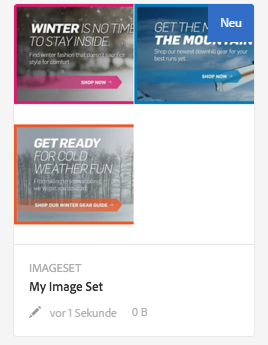
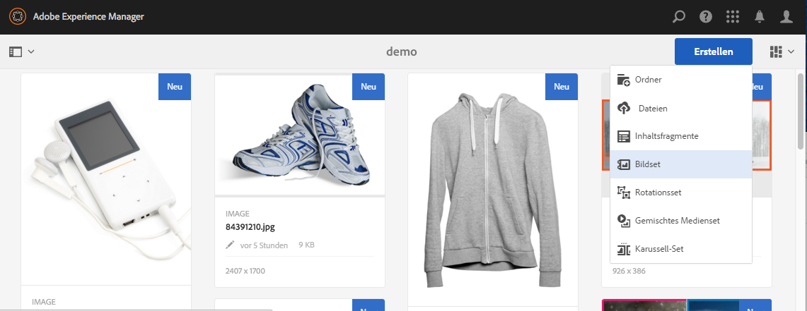
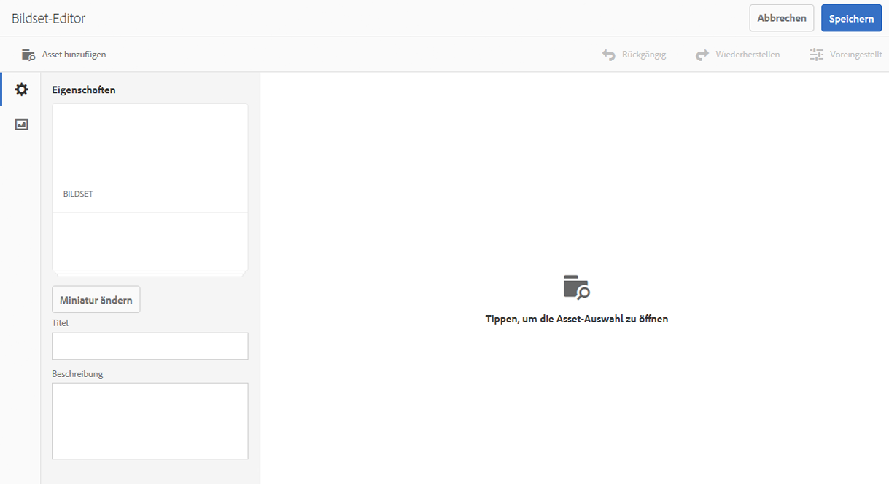
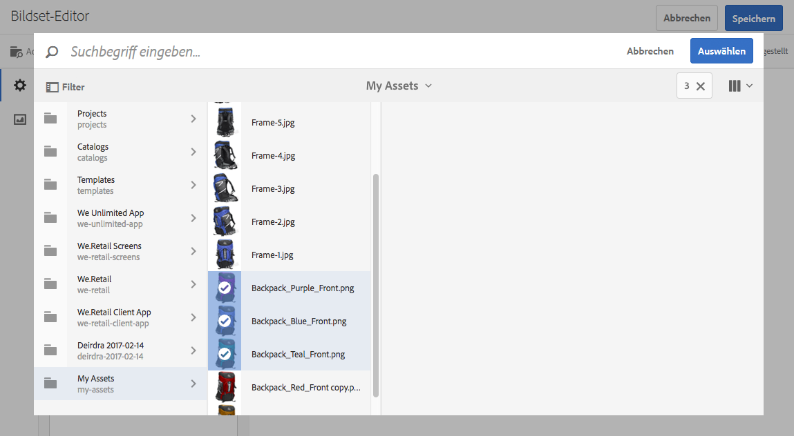
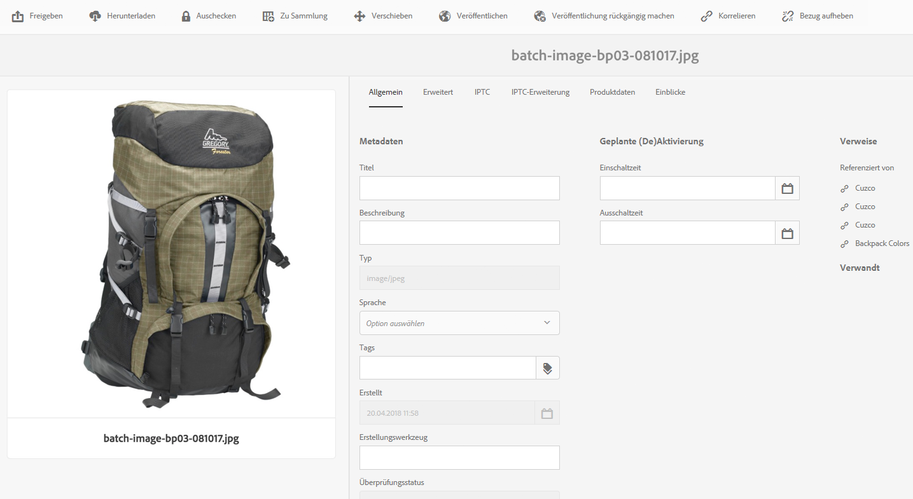

# Bildsets {#image-sets}

Über Bildsets erhalten Benutzer ein integriertes Anzeigeerlebnis, bei dem sie unterschiedliche Ansichten eines Elements durch Klicken auf eine Miniaturansicht anzeigen können. Mit Bildsets können Sie alternative Ansichten eines Elements darstellen. Dabei enthält der Viewer Zoomtools, mit denen Bilder genauer betrachtet werden können.

Bildsets werden durch ein Banner mit dem Wort **[!UICONTROL BILDSET]** gekennzeichnet. Darüber hinaus wird bei veröffentlichten Bildsets das Veröffentlichungsdatum (durch das **[!UICONTROL Welt]**-Symbol gekennzeichnet) zusammen mit dem Datum der letzten Änderung (durch das **[!UICONTROL Bleistift]**-Symbol gekennzeichnet) im Banner angezeigt.

Innerhalb des Bildsets können Sie auch Muster erstellen, indem Sie ein Bildset erstellen und Miniaturansichten hinzufügen.

Dies ist besonders nützlich, wenn Sie einen Artikel in einer anderen Farbe, einem anderen Muster oder mit anderer Endverarbeitung darstellen möchten. Um ein Bildset mit Farbmustern zu erstellen, benötigen Sie ein Bild für alle Farben, Muster oder Endverarbeitungen, die den Benutzern dargestellt werden sollen. Außerdem benötigen Sie eine Farb-, Muster- oder Endverarbeitungsvorlage für alle Farben, Muster oder Endverarbeitungen.

Beispiel: Sie möchten Bilder von Kappen darstellen, deren Schirme unterschiedliche Farben aufweisen: rot, grün und blau. In diesem Fall benötigen Sie drei Aufnahmen der gleichen Kappe. Sie brauchen eine Aufnahme mit einem roten Schirm, eine mit einem grünen Schirm und eine mit einem blauen Schirm. Außerdem brauchen Sie ein rotes, grünes und blaues Farbmuster. Die Farbmuster dienen als Miniaturansichten, auf die Benutzer im Musterset-Viewer klicken, um die Kappe mit rotem, grünem oder blauem Schirm anzuzeigen.

>[!NOTE]
>
>Weitere Informationen zur Assets-Benutzeroberfläche finden Sie unter [Verwalten von Assets mit der Touch-Benutzeroberfläche](managing-assets-touch-ui.md).

## Schnellstart: Bildsets  {#quick-start-image-sets}

So schaffen Sie einen schnellen Einstieg:

1. [Laden Sie Ihre Primärbilder für mehrere Ansichten hoch.](#uploading-assets-in-image-sets)

   Laden Sie zunächst die Bilder für die Bildsets hoch. Berücksichtigen Sie den Zoom bei der Auswahl von Bildern, da Benutzer Bilder im Bildset-Viewer einzoomen können. Achten Sie darauf, dass die längste Seite der Bilder mindestens 2.000 Pixel hat, um optimale Zoom-Details zu erzielen. Mit Dynamic Media können Bilder mit einer Auflösung von jeweils bis zu 25 Megapixel gerendert werden. Sie können beispielsweise ein Bild mit 5000 x 5000 Megapixel oder eine beliebige andere Größenkombination mit bis zu 25 Megapixel verwenden.

   AEM Assets unterstützt zahlreiche Bilddateiformate, empfohlen werden aber verlustfreie TIFF-, PNG- und EPS-Bilder.

1. [Erstellen Sie Bildsets.](#creating-image-sets)

   In Bildsets klicken Benutzer im Bildset-Viewer auf Miniaturansichten.

   Um einen Bildsatz in Assets zu erstellen, tippen Sie auf **[!UICONTROL Erstellen > Bildsätze]**. Fügen Sie dann Bilder hinzu und tippen Sie auf **[!UICONTROL Speichern]**.

   Sie können Bildsets auch automatisch über [Stapelsatzvorgaben](/help/assets/config-dms7.md#creating-batch-set-presets-to-auto-generate-image-sets-and-spin-sets) erstellen.

   **Wichtig** — Stapelsätze werden vom IPS (Image Production System) im Rahmen der Asset-Erfassung erstellt und sind nur im Dynamic Media - Scene7-Modus verfügbar.

   Siehe [Vorbereiten von Bildset-Assets auf das Hochladen und Hochladen von Dateien](#uploading-assets-in-image-sets).

   Siehe [Arbeiten mit Selektoren](working-with-selectors.md).

1. Fügen Sie nach Bedarf [Bildset-Viewer-Vorgaben](managing-viewer-presets.md) hinzu.

   Administratoren können Bild **[!UICONTROL Viewer-Vorgaben festlegen]** erstellen oder ändern. Wählen Sie zum Anzeigen Ihres Bildsets mit einer Viewer-Vorgabe das Bildset und links in der Leiste in der Dropdown-Liste die Option **[!UICONTROL Viewer]**.

   Um Viewer-Vorgaben zu erstellen oder zu bearbeiten, wählen Sie **[!UICONTROL Tools > Assets > Viewer-Vorgaben]**.

1. (Optional) [Anzeigen von Bildsets](image-sets.md#viewing-image-sets), die mit Stapelsatzvorgaben erstellt wurden.
1. [Zeigen Sie Bildsets in einer Vorschau an.](previewing-assets.md)

   Wählen Sie das Bildset aus, um dessen Vorschau anzuzeigen. Tippen Sie auf die Miniaturansicht-Symbole, um den Bildsatz im ausgewählten Viewer zu überprüfen. Sie können verschiedene Viewer aus dem Menü **[!UICONTROL Viewer]** wählen, das Sie links in der Leiste über die Dropdown-Liste aufrufen können.

1. [Veröffentlichen Sie Bildsets.](publishing-dynamicmedia-assets.md)

   Beim Veröffentlichen eines Bildsets wird die URL- und Einbettungszeichenfolge aktiviert. Darüber hinaus müssen Sie alle [benutzerdefinierten Viewer-Vorgaben veröffentlichen](managing-viewer-presets.md), die Sie erstellt haben. Standardmäßig vorhandene Viewer-Vorgaben sind bereits veröffentlicht.

1. [Verknüpfen Sie URLs mit einer Web-Anwendung](linking-urls-to-yourwebapplication.md) oder [betten Sie den Video- oder Bild-Viewer ein](embed-code.md).

   AEM Assets erstellt URL-Aufrufe für Bildsets und aktiviert diese, nachdem Sie die Bildsets veröffentlicht haben. Sie können diese URLs während der Asset-Vorschau kopieren. Sie können sie alternativ in Ihre Website einbetten.

   Wählen Sie das Bildset und dann im Dropdown-Menü links die Option **[!UICONTROL Viewer]**.

   Siehe [Verknüpfen von Bildsets mit Web-Seiten](linking-urls-to-yourwebapplication.md) und [Einbetten des Video- oder Bild-Viewers](embed-code.md).

Informationen zum Bearbeiten von Bildsets finden Sie unter [Bearbeiten von Bildsets](#editing-image-sets). Darüber hinaus können Sie [Eigenschaften von Bildsets](managing-assets-touch-ui.md#editing-properties) anzeigen und bearbeiten.

Wenn Sie beim Erstellen von Sets Probleme haben, lesen Sie den Abschnitt zu Bildern und Sets unter [Problembehandlung in Dynamic Media – Scene7-Modus](troubleshoot-dms7.md#images-and-sets).

## Hochladen von Assets in Bildsätzen {#uploading-assets-in-image-sets}

Laden Sie zunächst die Bilder für die Bildsets hoch. Berücksichtigen Sie den Zoom bei der Auswahl von Bildern, da Benutzer Bilder im Bildset-Viewer einzoomen können. Achten Sie darauf, dass die längste Seite der Bilder mindestens 2.000 Pixel hat. Bildsets unterstützen zahlreiche Bilddateiformate, empfohlen werden aber verlustfreie TIFF-, PNG- und EPS-Bilder.

Sie laden Bilder für Bild­Sets genauso wie [alle anderen Assets in Assets](managing-assets-touch-ui.md#uploading-assets) hoch.

### Vorbereiten von Bildset-Assets auf das Hochladen {#preparing-image-set-assets-for-upload}

Bevor Sie Bildsets erstellen, achten Sie darauf, dass die Bilder die richtige Größe und das richtige Format aufweisen.

Um ein Bildset mit mehreren Ansichten zu erstellen, benötigen Sie Bilder, die einen Artikel aus unterschiedlichen Blickwinkeln zeigen oder unterschiedliche Aspekte desselben Artikels darstellen. Ziel ist es, die wichtigen Merkmale eines Artikels so hervorzuheben, dass Benutzer einen umfassen Einblick in das Aussehen oder die Funktion des Gegenstands erhalten.

Stellen Sie sicher, dass die Bilder in Bildsets mindestens 2.000 Pixel in der größten Abmessung aufweisen, da Benutzer sie einzoomen können. Assets unterstützt zahlreiche Bilddateiformate, empfohlen werden aber verlustfreie TIFF-, PNG- und EPS-Bilder.

>[!NOTE]
>
>Wenn Sie außerdem Miniaturansichten verwenden, um Produktmuster anzuzeigen, müssen Sie Folgendes ausführen:
>
>Sie benötigen Vignetten oder unterschiedliche Aufnahmen desselben Bildes, in denen dieses in verschiedenen Farben, Mustern oder Endverarbeitungen dargestellt wird. Außerdem benötigen Sie Miniaturansichtsdateien, die den verschiedenen Farben, Mustern oder Endverarbeitungen entsprechen. Um beispielsweise Miniaturansichten in einem Bildset zu präsentieren, die eine Jacke in Schwarz, Braun und Grün anzeigen, benötigen Sie:
>
>* eine schwarze, braune und grüne Aufnahme der Jacke,
>* eine schwarze, braune und grüne Miniaturansicht

>

## Erstellen von Bildsets   {#creating-image-sets}

Sie können Bildsätze über die Benutzeroberfläche oder über die API erstellen. In diesem Abschnitt wird das Erstellen von Bildsätzen in der Benutzeroberfläche beschrieben.

>[!NOTE]
>
>Sie können Bildsets auch automatisch über [Stapelsatzvorgaben](/help/assets/config-dms7.md#creating-batch-set-presets-to-auto-generate-image-sets-and-spin-sets) erstellen.

**Wichtig:** Stapelsätze werden vom IPS (Image Production System) im Rahmen der Asset-Aufnahme erstellt und sind nur im Scene7-Modus von Dynamic Media verfügbar.

Assets, die Sie Ihrem Set hinzufügen, werden automatisch in alphanumerischer Reihenfolge hinzugefügt. Sie können die Assets manuell neu anordnen oder sortieren, nachdem sie hinzugefügt wurden.

>[!NOTE]
>
>Bildsätze werden nicht für Assets unterstützt, deren Dateiname `,` (Komma) enthält.

**So erstellen Sie ein Bildset**:

1. Navigieren Sie unter **Assets** zu der Stelle, an der Sie einen Bildsatz erstellen möchten, tippen Sie auf **[!UICONTROL Erstellen]** und wählen Sie **[!UICONTROL Bildsatz]**. Sie können das Set auch in einem Ordner erstellen, der die gewünschten Assets enthält.

   

1. Geben Sie auf der Seite &quot;Bildsatz-Editor&quot;im Feld **[!UICONTROL Titel]** einen Namen für den Bildsatz ein. Der Name wird im Banner über dem Bildset angezeigt. Geben Sie optional eine Beschreibung ein.

   

   >[!NOTE]
   >
   >Beim Erstellen des Bildsets können Sie die Miniaturansicht des Bildsets ändern oder zulassen, dass AEM die Miniaturansicht anhand der Assets im Bildset automatisch auswählt. Um eine Miniaturansicht auszuwählen, tippen Sie auf **[!UICONTROL Miniaturansicht ändern]** und wählen Sie ein beliebiges Bild aus (Sie können auch zu anderen Ordnern navigieren, um nach Bildern zu suchen). Wenn Sie eine Miniaturansicht ausgewählt haben und dann festlegen möchten, dass AEM eine aus dem Bildset generiert, **[!UICONTROL wählen Sie  Zu automatischer Miniatur wechseln]**.

1. Nehmen Sie eine der folgenden Aktionen vor:

   * Tippen Sie in der linken oberen Ecke der Seite **[!UICONTROL Bildsatz-Editor]** auf **[!UICONTROL Hinzufügen Asset]**.
   * Tippen Sie in der Mitte der Seite **[!UICONTROL Bildsatzeditor]** auf **[!UICONTROL Tippen, um die Asset-Auswahl]** zu öffnen.

   Tippen Sie auf , um Assets auszuwählen, die Sie in Ihren Bildsatz aufnehmen möchten. Die ausgewählten Assets sind mit einem Häkchen versehen. Wenn Sie die Assets ausgewählt haben, tippen Sie auf **[!UICONTROL Auswählen]**.

   Mit dem Asset-Selektor können Sie nach Assets suchen, indem Sie ein Keyword eingeben und auf **[!UICONTROL Eingabe]** tippen. Sie können auch Filter anwenden, um Ihre Suchergebnisse genauer abzustimmen. Sie können nach Pfad, Sammlung, Dateityp und Tag filtern. Wählen Sie den Filter und tippen Sie in der Symbolleiste auf das Symbol **[!UICONTROL Filter]**. Ändern Sie die Ansicht, indem Sie auf das Symbol **[!UICONTROL Ansicht]** tippen und **[!UICONTROL Ansicht]**, **[!UICONTROL Ansicht]** oder **[!UICONTROL Liste-Ansicht]** auswählen.

   Siehe [Arbeiten mit Selektoren](working-with-selectors.md).

   

1. Assets, die Sie Ihrem Set hinzufügen, werden automatisch in alphanumerischer Reihenfolge hinzugefügt. Sie können die Assets nach dem Hinzufügen manuell neu anordnen oder sortieren.

   Ziehen Sie bei Bedarf das Symbol **[!UICONTROL Neu anordnen]** eines Assets nach rechts neben den Dateinamen des Assets, um die Liste neu anzuordnen.

   

   Wenn Sie eine Miniaturansicht oder ein Farbfeld ändern möchten, tippen Sie neben dem Bild auf das Symbol **[!UICONTROL Miniaturansicht]** und navigieren Sie zur gewünschten Miniaturansicht bzw. zum gewünschten Farbfeld. Wenn Sie alle Bilder ausgewählt haben, tippen Sie auf **[!UICONTROL Speichern]**.

1. (Optional) Führen Sie einen der folgenden Schritte aus:

   * Um ein Bild zu löschen, wählen Sie das Bild aus und tippen Sie dann auf **[!UICONTROL Asset]** löschen.
   * Wenn Sie eine Vorgabe anwenden möchten, tippen Sie oben rechts auf **[!UICONTROL Voreingestellt]**. Wählen Sie anschließend eine Vorgabe aus, um sie auf alle Elemente gleichzeitig anzuwenden.

1. Tippen Sie auf **[!UICONTROL Speichern]**. Das neu erstellte Bildset wird in dem Ordner angezeigt, in dem es erstellt wurde.

## Anzeigen von Bildsets   {#viewing-image-sets}

Sie können Bildsets entweder in der Benutzeroberfläche oder automatisch über [Stapelsatzvorgaben](/help/assets/config-dms7.md#creating-batch-set-presets-to-auto-generate-image-sets-and-spin-sets) erstellen.

**Wichtig** — Stapelsätze werden vom IPS  [Image Production ] System als Teil der Asset-Erfassung erstellt und sind nur im Dynamic Media - Scene7-Modus verfügbar.)

Mit Stapelsatzvorgaben erstellte Sets werden jedoch *nicht* in der Benutzeroberfläche angezeigt. Sie können diese Sets auf drei verschiedene Arten anzeigen. (Diese Methoden sind auch verfügbar, wenn Sie die Bildsets in der Benutzeroberfläche erstellt haben.)

* Beim Öffnen der Eigenschaften eines einzelnen Assets. Die Eigenschaften zeigen an, zu welchen Sets das ausgewählte Asset gehört (unter **[!UICONTROL Mitglied von Sets]**). Tippen Sie auf den Namen des Sets, um den gesamten Satz anzuzeigen.

   

* Von einem zugehörigen Bild eines beliebigen Sets. Wählen Sie das Menü **[!UICONTROL Sets]** aus, um die Sets anzuzeigen, denen das Asset angehört.

   

* In der Suche können Sie **[!UICONTROL Filter]** auswählen, dann **[!UICONTROL Dynamic Media]** erweitern und **[!UICONTROL Sätze]** auswählen.

   Die Suche gibt als Ergebnis Sets zurück, die in der Benutzeroberfläche manuell oder mit Stapelsatzvorgaben automatisch erstellt wurden. Im Gegensatz zu AEM-Suchen, die mit dem Suchkriterium „Enthält“ durchgeführt werden, wird die Suchabfrage für automatisierte Sets mithilfe des Suchkriteriums „Beginnt mit“ durchgeführt. Automatisierte Sets können nur durchsucht werden, wenn der Filter auf **[!UICONTROL Sets]** eingestellt ist.

   

>[!NOTE]
>
>Sets können über die Benutzeroberfläche angezeigt werden, wie unter [Bearbeiten von Bildsets](#editing-image-sets) beschrieben.

## Bearbeiten von Bildsets   {#editing-image-sets}

Sie können mehrere Bearbeitungsaufgaben für Bildsets ausführen, z. B. die folgenden:

* Fügen Sie dem Bildset Bilder hinzu.
* Ordnen Sie Bilder im Bildset neu an.
* Löschen Sie Assets im Bildset.
* Wenden Sie Viewer-Vorgaben an.
* Löschen Sie das Bildset.

**So bearbeiten Sie Bildsets**:

1. Führen Sie einen der folgenden Schritte aus:

   * Zeigen Sie mit der Maus auf ein Bildset-Asset und tippen Sie auf **[!UICONTROL Bearbeiten]** (Bleistiftsymbol).
   * Zeigen Sie mit der Maus auf ein Bildset-Asset und tippen Sie auf **[!UICONTROL Auswählen]** (Häkchensymbol) und dann auf **[!UICONTROL Bearbeiten]** in der Symbolleiste.
   * Tippen Sie auf ein Bildset-Asset und dann auf **[!UICONTROL Bearbeiten]** (Bleistiftsymbol) in der Symbolleiste.

1. Führen Sie eine der folgenden Aktionen aus, um die Bilder im Bildset zu bearbeiten:

   * Ziehen Sie ein Bild, wenn Sie ein Asset an einer neuen Position anordnen möchten (zum Verschieben von Elementen wählen Sie das Symbol zum Neuanordnen).
   * Um Elemente in auf- oder absteigender Reihenfolge zu sortieren, tippen Sie auf die Spaltenüberschrift.
   * Um ein Asset hinzuzufügen oder ein vorhandenes Asset zu aktualisieren, tippen Sie auf das Element **[!UICONTROL Hinzufügen]**. Navigieren Sie zu einem Asset, wählen Sie es aus und tippen Sie oben rechts auf **[!UICONTROL Auswählen]**.

   >[!NOTE]
   >Wenn Sie das in AEM als Miniaturansicht verwendete Bild löschen und durch ein anderes ersetzen, wird das Original-Asset weiterhin angezeigt.

   * Um ein Asset zu löschen, wählen Sie es aus und tippen Sie dann auf **[!UICONTROL Asset]** löschen.
   * Um eine Vorgabe anzuwenden, tippen Sie oben rechts auf der Seite auf **[!UICONTROL Vorgabe]** und wählen Sie eine Viewer-Vorgabe aus.
   * Um eine Miniaturansicht hinzuzufügen oder zu ändern, wählen Sie die Miniaturansicht rechts neben dem Asset. Navigieren Sie zur neuen Miniaturansicht oder zum neuen Farbmuster-Asset, wählen Sie es aus und tippen Sie dann auf **[!UICONTROL Auswählen]**.
   * Um ein ganzes Bildset zu löschen, navigieren Sie zum Bildset, wählen Sie es aus und klicken Sie auf **[!UICONTROL Löschen]**.

   >[!NOTE]
   >
   >Sie können die Bilder in einem Bildset bearbeiten, indem Sie zu diesem Set navigieren, in der linken Seitenleiste auf **[!UICONTROL Mitglieder des Sets]** tippen und dann auf das Bleistiftsymbol eines einzelnen Assets tippen, um das Bearbeitungsfenster zu öffnen.****

1. Tippen Sie auf **[!UICONTROL Speichern]**, wenn Sie die Bearbeitung abgeschlossen haben.

## Anzeigen von Bildsets in einer Vorschau   {#previewing-image-sets}

Weitere Informationen finden Sie im Abschnitt [Asset-Vorschau](previewing-assets.md).

## Veröffentlichen von Bildsets   {#publishing-image-sets}

Siehe [Veröffentlichen von Assets](publishing-dynamicmedia-assets.md).
