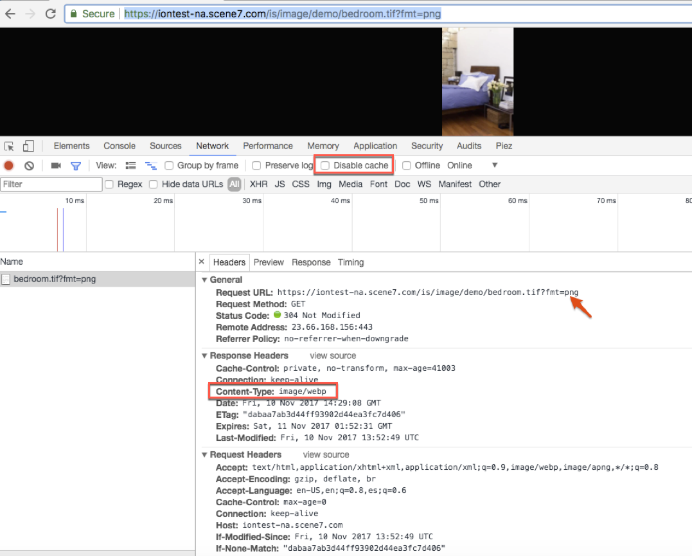

# Intelligente Bildbearbeitung {#smart-imaging}

## Was ist die intelligente Bildbearbeitung? {#what-is-smart-imaging}

Die Technologie der intelligenten Bildbearbeitung nutzt die AI-Funktionen von Adobe Sensei und arbeitet mit vorhandenen &quot;Bildvorgaben&quot;zusammen, um die Leistung bei der Bildbereitstellung zu verbessern, indem Bildformat, -größe und -qualität basierend auf den Funktionen des Client-Browsers automatisch optimiert werden.

>[!NOTE]
>
>Für diese Funktion müssen Sie das im Lieferumfang von Adobe Experience Manager Dynamic Media enthaltene vorkonfigurierte CDN (Content Delivery Network) verwenden. Andere benutzerdefinierte CDN werden von dieser Funktion nicht unterstützt.

Die intelligente Bildbearbeitung profitiert auch von der zusätzlichen Leistungssteigerung durch die vollständige Integration mit dem erstklassigem Premium-CDN-Dienst von Adobe. Dieser Dienst ermittelt die optimale Internet-Route zwischen Servern, Netzwerken und Peering-Punkten. Er findet die Route mit der niedrigsten Latenz und der niedrigsten Paketverlustrate, anstatt die Standardroute im Internet zu verwenden.

Die folgenden Beispiele für Bild-Assets veranschaulichen die Optimierungen durch die intelligente Bildbearbeitung:

| Bild (URL) | Miniatur | Größe  (JPEG) | Größe (WebP)  (mit intelligenter Bildbearbeitung) | Reduzierung in % |
|---|---|---|---|---|
| [Bild 1](https://techsupport.scene7.com/is/image/TechSupport/SmartImaging_6?hei=500&amp;fmt=jpg&amp;qlt=85&amp;resmode=bisharp&amp;op_usm=5,0.125,5,0) |  | 73,75 KB | 45,92 KB | 38 % |
| [Bild 2](https://techsupport.scene7.com/is/image/TechSupport/SmartImaging_3?hei=500&amp;fmt=jpg&amp;qlt=85&amp;resmode=bisharp&amp;op_usm=5,0.125,5,0) |  | 191 KB | 70,66 KB | 63 % |
| [Bild 3](https://techsupport.scene7.com/is/image/TechSupport/SmartImaging_2?hei=500&amp;fmt=jpg&amp;qlt=85&amp;resmode=bisharp&amp;op_usm=5,0.125,5,0) |  | 96,64 KB | 39,44 KB | 59 % |
| [Bild 4](https://techsupport.scene7.com/is/image/TechSupport/SmartImaging_1?hei=500&amp;qlt=85&amp;resmode=bisharp&amp;op_usm=5,0.125,5,0) |  | 315,80 KB | 178,19 KB | 44 % |
|  |  |  |  | Durchschnitt = 51 % |

Ähnlich wie oben führte Adobe auch einen Test mit 7009 URLs von Live-Kundensites durch. Die Dateigrößenoptimierung von JPEG-Bildern konnte im Durchschnitt um 38 % gesteigert werden. Durch die Konvertierung von PNG-Dateien in das WebP-Format konnte die Dateigrößenoptimierung durchschnittlich um 31 % gesteigert werden. Diese Optimierung ist dank der Funktionen der intelligenten Bildbearbeitung möglich.

Im mobilen Internet werden Probleme durch zwei Faktoren noch verstärkt:

* Große Auswahl an Geräten mit unterschiedlichen Formfaktoren und hochauflösenden Displays
* Eingeschränkte Netzwerkbandbreite

Bei Bildern geht es darum, so effizient wie möglich die beste Bildqualität zu erzielen.

### Informationen zur Optimierung des Gerätepixelverhältnisses {#dpr}

Das Gerätepixelverhältnis (Device Pixel Ratio, DPR), auch als CSS-Pixelverhältnis bezeichnet, ist das Verhältnis zwischen den physischen Pixeln und logischen Pixeln eines Geräts. Insbesondere mit dem Aufkommen von Retina-Bildschirmen nimmt die Pixelauflösung moderner Mobilgeräte stetig zu.

Durch Aktivierung der Optimierung des Gerätepixelverhältnisses wird das Bild in der nativen Bildschirmauflösung gerendert, sodass es gestochen scharf erscheint.

Beim Aktivieren der DPR-Konfiguration für die intelligente Bildbearbeitung wird das angeforderte Bild automatisch basierend auf der Pixeldichte des Displays angepasst, von dem die Anforderung stammt. Derzeit stammt die Display-Pixeldichte aus den CDN-Kopfzeilenwerten von Akamai.

| Zulässige Werte in der URL eines Bilds | Beschreibung |
|---|---|
| `dpr=off` | Deaktivieren Sie die DPR-Optimierung auf Ebene der einzelnen Bild-URLs. |
| `dpr=on,dprValue` | Überschreiben Sie den von der intelligenten Bildbearbeitung erkannten DPR-Wert mit einem benutzerdefinierten Wert (wie von einer beliebigen Client-seitigen Logik oder auf andere Weise erkannt). Der zulässige Wert für `dprValue` ist eine beliebige Zahl, die größer ist als 0. Die angegebenen Werte 1,5, 2 oder 3 sind typisch. |

>[!NOTE]
>
>* Sie können `dpr=on,dprValue` auch dann verwenden, wenn die DPR-Einstellung auf Unternehmensebene deaktiviert ist.
>* Aufgrund der DPR-Optimierung wird die MaxPix-Breite immer erkannt, wenn das resultierende Bild größer ist als die Dynamic Media-Einstellung für MaxPix, indem das Seitenverhältnis des Bilds beibehalten wird.

| Angeforderte Bildgröße | DPR-Wert | Bereitgestellte Bildgröße |
|---|---|---|
| 816 x 500 | 1 | 816 x 500 |
| 816 x 500 | 2 | 1632 x 1000 |

### Über die Optimierung der Netzwerkbandbreite {#network-bandwidth-optimization}

Beim Aktivieren der Netzwerkbandbreite wird die Bildqualität automatisch an die tatsächliche Netzwerkbandbreite angepasst. Bei geringer Netzwerkbandbreite wird die DPR-Optimierung automatisch deaktiviert, auch wenn sie bereits aktiviert ist.

Falls gewünscht, kann Ihr Unternehmen die Optimierung der Netzwerkbandbreite auf individueller Bildebene deaktivieren, indem `network=off` an die URL des Bilds angehängt wird.

| Zulässiger Wert in der URL eines Bilds | Beschreibung |
|---|---|
| `network=off` | Deaktiviert die Netzwerkoptimierung auf Ebene der einzelnen Bild-URLs. |

>[!NOTE]
>
>Die Werte für das Gerätepixelverhältnis und die Netzwerkbandbreite basieren auf den erkannten Client-seitigen Werten des im Bundle enthaltene CDN. Diese Werte sind mitunter ungenau. Beispielsweise wird für iPhone 5 mit DPR = 2 und iPhone 12 mit DPR = 3 DPR = 2 angezeigt. Bei Geräten mit hoher Auflösung ist es jedoch besser, DPR=2 zu senden als DPR=1. In Kürze verfügbar: Adobe arbeitet mit Client-seitigem Code, um das DPR von Endanwendern genau zu bestimmen.

## Was sind die Hauptvorteile der intelligenten Bildbearbeitung? {#what-are-the-key-benefits-of-smart-imaging}

Bilder verursachen den Großteil der Ladezeit einer Seite. Jede Leistungsverbesserung führt daher zu höheren Konversionsraten, einer längeren Besuchszeit auf der Site und niedrigeren Absprungraten.

Verbesserungen der neuesten Version der intelligenten Bildbearbeitung:

* Das Google SEO-Ranking für Web-Seiten mit der neuesten intelligenten Bildbearbeitung wurde verbessert.
* Stellt optimierte Inhalte sofort (zur Laufzeit) bereit.
* Verwendet Adobe Sensei-Technologie zur Konvertierung gemäß der in der Bildanforderung angegebenen Qualität (qlt).
* Die intelligente Bildbearbeitung kann mithilfe des URL-Parameters „bfc“ deaktiviert werden.
* TTL (Time To Live)-unabhängig. Zuvor war eine TTL von mindestens 12 Stunden erforderlich, damit die intelligente Bildbearbeitung funktioniert.
* Zuvor wurden sowohl das Originalbild als auch abgeleitete Bilder zwischengespeichert. Ein zweistufiger Prozess war erforderlich, um den Cache ungültig zu machen. In der neusten Version der intelligenten Bildbearbeitung werden nur die Ableitungen zwischengespeichert, was einen einstufigen Cache-Invalidierungsprozess ermöglicht.
* Kunden, die benutzerdefinierte Kopfzeilen in ihrem Regelsatz verwenden, profitieren von der neuesten intelligenten Bildbearbeitung, da diese Kopfzeilen im Gegensatz zur vorherigen Version der intelligenten Bildbearbeitung nicht blockiert werden. Beispielsweise „Timing Allow Origin“ oder „X-Robot“, wie unter [Hinzufügen einer benutzerdefinierten Kopfzeile zu Bildantworten | Dynamic Media Classic](https://helpx.adobe.com/de/experience-manager/scene7/kb/base/scene7-rulesets/add-custom-header-val-image.html) vorgeschlagen, profitieren von der neuesten Version der intelligenten Bildbearbeitung.

## Ist intelligente Bildbearbeitung mit irgendwelchen Lizenzierungskosten verbunden? {#are-there-any-licensing-costs-associated-with-smart-imaging}

Nein. Die intelligente Bildbearbeitung ist in Ihrer bestehenden Lizenz von Dynamic Media Classic oder Adobe Experience Manager - Dynamic Media (On-Premise, AMS und Experience Manager as a Cloud Service) enthalten.

>[!NOTE]
>
>Die intelligente Bildbearbeitung ist nicht für Dynamic Media-Hybrid-Kunden verfügbar.

## Wie funktioniert die intelligente Bildbearbeitung? {#how-does-smart-imaging-work}

Wenn ein Bild von einem Verbraucher angefordert wird, überprüft die intelligente Bildbearbeitung die Benutzermerkmale und führt basierend auf dem verwendeten Browser eine Konvertierung in das passende Bildformat durch. Diese Formatkonvertierungen werden so durchgeführt, dass die visuelle Wiedergabetreue nicht beeinträchtigt wird. Die intelligente Bildbearbeitung konvertiert Bilder basierend auf den Browser-Funktionen auf folgende Weise automatisch in verschiedene Formate.

<!--   * Safari 14.0 +
    * Safari 14 only with iOS 14.0 and above and macOS BigSur and above -->

* Automatische Konvertierung in WebP für die folgenden Browser:
   * Chrome
   * Firefox
   * Microsoft® Edge
   * Safari (iOS, macOS, iPadOS), bereitgestellte Browser- und Betriebssystemversionen unterstützen WebP
   * Android™
   * Opera
* Unterstützung älterer Browser:

   | Browser | Browser/OS-Version | Format |
   | --- | --- | --- |
   | Safari | Früher als iOS/iPad 14.0 oder macOS BigSur | JPEG2000 |
   | Edge | Früher als 18 | JPEGXR |
   | Internet Explorer | 9+ | JPEGXR |
* Bereitstellung des ursprünglich angeforderten Bildformats für Browser, die diese Formate nicht unterstützen.

Wenn die Originalbildgröße kleiner ist als die von der intelligente Bildbearbeitung erzeugte, wird das Originalbild bereitgestellt.

## Welche Bildformate werden unterstützt? {#what-image-formats-are-supported}

Die folgenden Bildformate werden für die intelligente Bildbearbeitung unterstützt:

* JPEG
* PNG

<!-- CQDOC-15846 For any other format mentioned in a URL, you should explicity turn off Smart Imaging.  Append modifier `bfc=off` to the URL for file formats other than JPEG and PNG. You can accomplish this by using either one of the following methods:

* Use a ruleset if the `fmt` modifier is mentioned in the URL. 
* Append in URL modifiers field of the presets concerned.

Adobe is working on a permanent fix that does not require you to append `bfc=off` for `fmt !=JPEG` or `fmt !=PNG`. This topic will be updated after the fix is delivered. -->

## Wie funktioniert die intelligente Bildbearbeitung bei vorhandenen und bereits verwendeten Bildvorgaben? {#how-does-smart-imaging-work-with-our-existing-image-presets-that-are-already-in-use}

Die intelligente Bildbearbeitung funktioniert mit Ihren vorhandenen &quot;Bildvorgaben&quot;und berücksichtigt alle Bildeinstellungen außer der Qualität (`qlt`) und Format (`fmt`), wenn das angeforderte Dateiformat JPEG oder PNG ist. Bei der Formatkonvertierung behält die Adobe die vollständige Wiedergabetreue bei, die durch Ihre Bildvorgabeneinstellungen, jedoch mit einer kleineren Dateigröße definiert ist. Wenn die Originalbildgröße kleiner ist als die von der intelligente Bildbearbeitung erzeugte, wird das Originalbild bereitgestellt.

<!-- CQDOC-15846 In addition, if your image presets are used to return `fmt !=JPEG` or `fmt !=PNG`, be sure append `bfc=off` in the preset modifier field to return the requested file format. -->

## Muss ich für die intelligente Bildbearbeitung URLs bzw. Bildvorgaben ändern oder neuen Code auf meiner Site bereitstellen? {#will-i-have-to-change-any-urls-image-presets-or-deploy-any-new-code-on-my-site-for-smart-imaging}

Intelligente Bildbearbeitung funktioniert nahtlos mit Ihren vorhandenen Bild-URLs und Bildvorgaben, wenn Sie die intelligente Bildbearbeitung für Ihre vorhandenen benutzerdefinierten Domain konfigurieren. Darüber hinaus müssen Sie bei der intelligenten Bildbearbeitung keinen Code auf Ihrer Website hinzufügen, um den Browser eines Benutzers zu erkennen. Es wird alles automatisch verarbeitet.

Falls Sie eine neue benutzerdefinierte Domain für die Verwendung der intelligenten Bildbearbeitung konfigurieren müssen, müssen die URLs aktualisiert werden, um diese benutzerdefinierte Domain widerzuspiegeln.

<!-- CQDOC-15846 As mentioned earlier, Smart Imaging supports only JPEG and PNG image formats. For other formats, you need to append the `bfc=off` modifier to the URL as described earlier. -->

Informationen zu den Voraussetzungen für die intelligente Bildbearbeitung finden Sie unter [Bin ich zur Verwendung der intelligenten Bildbearbeitung berechtigt?](#am-i-eligible-to-use-smart-imaging)

## Funktioniert die intelligente Bildbearbeitung mit HTTPS? Und mit HTTP/2? {#does-smart-imaging-working-with-https-how-about-http}

Die intelligente Bildbearbeitung funktioniert bei Bildern, die über HTTP, HTTPS oder HTTP/2 bereitgestellt wurden.

## Bin ich zur Verwendung der intelligenten Bildbearbeitung berechtigt? {#am-i-eligible-to-use-smart-imaging}

Um die intelligente Bildbearbeitung nutzen zu können, muss Dynamic Media Classic bzw. Dynamic Media im Experience Manager-Account Ihres Unternehmens die folgenden Voraussetzungen erfüllen:

* Sie verwenden das im Adobe-Bundle enthaltene CDN (Content Delivery Network) im Rahmen Ihrer Lizenz.
* Sie verwenden eine dedizierte Domain (z. B. `images.company.com` oder `mycompany.scene7.com`), keine generische Domain (z. B. `s7d1.scene7.com`, `s7d2.scene7.com` oder `s7d13.scene7.com`).

Um Ihre Domains zu suchen, melden Sie sich bei dem Konto bzw. den Konten Ihres Unternehmens an.

Tippen **[!UICONTROL Einrichtung]** > **[!UICONTROL Anwendungseinstellungen]** > **[!UICONTROL Allgemeine Einstellungen]**. Suchen Sie nach dem Feld **[!UICONTROL Veröffentlichungs-Server-Name]**. Wenn Sie derzeit eine generische Domain verwenden, können Sie im Zuge dieser Umstellung einen Wechsel zu Ihrer eigenen benutzerdefinierten Domain beantragen. Reichen Sie dazu ein technisches Support-Ticket ein.

Für Ihre erste anwenderdefinierte Domain fallen mit einer Dynamic Media-Lizenz keine zusätzlichen Kosten an.

## Wie kann ich die intelligente Bildbearbeitung für mein Konto aktivieren? {#what-is-the-process-for-enabling-smart-imaging-for-my-account}

Die intelligente Bildbearbeitung wird nicht automatisch aktiviert. Sie müssen eine entsprechende Anfrage stellen.

Standardmäßig ist die DPR- und Netzwerkoptimierung für ein Dynamic Media-Unternehmenskonto deaktiviert. Wenn Sie eine oder beide dieser vordefinierten Verbesserungen aktivieren möchten, erstellen Sie einen Support-Fall wie unten beschrieben.

<!-- NOW AVAILABLE IN ALL THREE REGIONS AS OF AUGUST 2. 2021. SEE CQDOC- 17915 The release schedule for Smart Imaging DPR and network optimization is as follows:

| Region | Target date |
|---|---|
| North America | Live |
| Europe, Middle East, Africa | 13 Aug 2021 |
| Asia-Pacific | 22 Jul 2021 | -->

1. [Verwenden Sie die Admin Console, um einen Support-Fall zu erstellen.](https://helpx.adobe.com/de/enterprise/using/support-for-experience-cloud.html)
1. Geben Sie in Ihrem Support-Fall die folgenden Informationen an:

   1. Name des Hauptansprechpartners, E-Mail, Telefon.
   1. Alle Domänen, die für intelligente Bildbearbeitung aktiviert werden sollen (d. h.`mages.company.com` oder `mycompany.scene7.com`).

      Öffnen Sie das [Dynamic Media Classic-Desktop-Programm](https://experienceleague.adobe.com/docs/dynamic-media-classic/using/getting-started/signing-out.html?lang=de#getting-started) und melden Sie sich bei Ihrem Unternehmenskonto an, um Ihre Domains zu finden.

      Klicken Sie auf **[!UICONTROL Einstellungen]** > **[!UICONTROL Anwendungseinstellungen]** > **[!UICONTROL Allgemeine Einstellungen]**.

      Suchen Sie nach dem Feld **[!UICONTROL Veröffentlichungs-Server-Name]**.
   1. Vergewissern Sie sich, dass Sie CDN über Adobe und nicht verwaltet mit einer direkten Beziehung nutzen.
   1. Vergewissern Sie sich, dass Sie eine dedizierte Domain wie `images.company.com` oder `mycompany.scene7.com` und nicht eine generische Domain wie `s7d1.scene7.com`, `s7d2.scene7.com` oder `s7d13.scene7.com` verwenden.

      Öffnen Sie das [Dynamic Media Classic-Desktop-Programm](https://experienceleague.adobe.com/docs/dynamic-media-classic/using/getting-started/signing-out.html#getting-started) und melden Sie sich bei Ihrem Unternehmenskonto an, um Ihre Domains zu finden.

      Klicken Sie auf **[!UICONTROL Einstellungen]** > **[!UICONTROL Anwendungseinstellungen]** > **[!UICONTROL Allgemeine Einstellungen]**.

      Suchen Sie nach dem Feld **[!UICONTROL Veröffentlichungs-Server-Name]**. Wenn Sie derzeit eine generische Dynamic Media Classic-Domain verwenden, können Sie im Zuge dieser Umstellung einen Wechsel zu Ihrer eigenen benutzerdefinierten Domain beantragen.
   1. Geben Sie an, ob Sie auch die intelligente Bildbearbeitung über HTTP/2 benötigen.

1. Der Adobe-Support fügt Sie basierend auf der Reihenfolge, in der Anfragen gesendet wurden, zur Warteliste für Kunden mit intelligenter Bildbearbeitung hinzu.
1. Wenn Adobe für die Bearbeitung Ihrer Anfrage bereit ist, unterstützen Sie Support-Mitarbeiter bei der Koordination und Festlegung eines Zieldatums.
1. **Optional**: Sie haben die Möglichkeit, die intelligente Bildbearbeitung in der Staging-Phase zu testen, bevor Adobe die neue Funktion an die Produktion weitergibt.
1. Sie werden nach Abschluss durch den Support benachrichtigt.
1. Zur maximalen Leistungsverbesserung der intelligenten Bildbearbeitung empfiehlt Adobe eine Time-to-Live (TTL)-Einstellung von mindestens 24 Stunden. Die TTL-Einstellung definiert, wie lange Assets vom CDN-Service im Cache gespeichert werden. So ändern Sie diese Einstellung:

   1. Wenn Sie Dynamic Media Classic verwenden, klicken Sie auf **[!UICONTROL Einrichtung]** > **[!UICONTROL Anwendungseinstellungen]** > **[!UICONTROL Veröffentlichungseinstellungen]** > **[!UICONTROL Image-Server]**. Stellen Sie den Wert **[!UICONTROL Standardeinstellung für Time-To-Live des Client-Cache]** auf mindestens 24 ein.
   1. Wenn Sie Dynamic Media verwenden, befolgen Sie [diese Anweisungen](config-dynamic.md). Stellen Sie den Wert **[!UICONTROL Gültigkeit]** auf mindestens 24 Stunden ein.

## Wann wird mein Konto voraussichtlich für die intelligente Bildbearbeitung aktiviert? {#when-can-i-expect-my-account-to-be-enabled-with-smart-imaging}

Die Anfragen werden in der Reihenfolge ihres Eingangs beim technischen Support gemäß Warteliste bearbeitet.

>[!NOTE]
>
>Die Vorlaufzeit kann lang sein, da zum Aktivieren der Funktion „Intelligente Bildbearbeitung“ der Cache von Adobe gelöscht werden muss. Daher kann nur jeweils eine geringe Anzahl von Kunden gleichzeitig umgestellt werden.

## Welche Risiken bestehen bei der Umstellung auf die intelligente Bildbearbeitung? {#what-are-the-risks-with-switching-over-to-use-smart-imaging}

Es besteht kein Risiko für eine Kunden-Web-Seite. Durch die Umstellung auf intelligente Bildbearbeitung wird der Cache im CDN jedoch gelöscht, da auf eine neue Dynamic Media Classic- oder Dynamic Media-Konfiguration auf dem Experience Manager umgestellt werden muss.

Zu Beginn der Übergangsphase werden die nicht im Cache gespeicherten Bilder direkt an die ursprünglichen Server von Adobe übertragen, bis der Cache neu aufgebaut wurde. Daher plant Adobe, einige Kundenübergänge gleichzeitig zu verarbeiten, damit beim Abrufen von Anforderungen aus der Adobe eine annehmbare Leistung erzielt wird. Bei den meisten Kunden ist der CDN-Cache innerhalb von 1 bis 2 Tagen vollständig neu aufgebaut.

## Wie kann ich feststellen, ob die intelligente Bildbearbeitung erwartungsgemäß funktioniert?  {#how-can-i-verify-whether-smart-imaging-is-working-as-expected}

1. Laden Sie nach der Konfiguration Ihres Kontos mit intelligenter Bildbearbeitung eine Dynamic Media Classic/Dynamic Media-Bild-URL in den Browser.
1. Öffnen Sie den Chrome-Entwicklerbereich, indem Sie im Browser auf **[!UICONTROL Anzeigen]** > **[!UICONTROL Entwickler]** > **[!UICONTROL Entwickler-Tools]** klicken.  Selbstverständlich können Sie auch ein anderes Browser-Entwickler-Tool Ihrer Wahl verwenden.

1. Stellen Sie sicher, dass der Cache deaktiviert ist, wenn die Entwicklertools geöffnet sind.

   * Navigieren Sie unter Windows® zum Bereich mit den Entwickler-Tools und wählen Sie **[!UICONTROL Cache deaktivieren (während DevTools geöffnet ist)]** aktivieren.
   * Gehen Sie unter Mac im Entwicklerbereich zur Registerkarte **[!UICONTROL Netzwerk]** und wählen Sie die Option **[!UICONTROL Cache deaktivieren]** aus.

1. Sie werden feststellen, dass der Content-Typ in das entsprechende Format umgewandelt wird. Der folgende Screenshot zeigt ein PNG-Bild, das in Chrome dynamisch ins WebP-Format konvertiert wird.
1. Wiederholen Sie diesen Test auf verschiedenen Browsern und bei unterschiedlichen Benutzerbedingungen.

>[!NOTE]
>
>Nicht alle Bilder werden konvertiert. Die intelligente Bildbearbeitung entscheidet, ob die Konvertierung die Leistung verbessert. In einigen Fällen, in denen kein Leistungsgewinn erwartet wird oder das Format nicht JPEG oder PNG ist, wird das Bild nicht konvertiert.

## Kann die intelligente Bildbearbeitung für eine beliebige Anfrage deaktiviert werden? {#turning-off-smart-imaging}

Ja. Sie können die intelligente Bildbearbeitung deaktivieren, indem Sie den Modifikator `bfc=off` zur URL hinzufügen.

## Kann ich anfordern, dass die DPR- und Netzwerkoptimierung auf Unternehmensebene deaktiviert werden? {#dpr-companylevel-turnoff}

Ja. Um die DPR- und Netzwerkoptimierung in Ihrem Unternehmen zu deaktivieren, erstellen Sie einen Support-Fall, wie zuvor in diesem Thema beschrieben.

## Welche „Optimierungen“ sind verfügbar? Gibt es Einstellungen oder Verhaltensweisen, die definiert werden können? (#tuning-settings)

Derzeit können Sie die intelligente Bildbearbeitung optional aktivieren oder deaktivieren. Es stehen keine weiteren Optimierungen zur Verfügung.

## Wenn die intelligente Bildbearbeitung die Qualitätseinstellungen verwaltet, müssen dann Mindest- und Höchstwerte festgelegt werden? Ist es zum Beispiel möglich, eine Qualität „nicht kleiner als 60“ und „nicht größer als 80“ festzulegen? (#minimum-maximum)

Diese Funktionalität gibt es in der aktuellen intelligenten Bildbearbeitung nicht.

## Manchmal wird ein JPEG-Bild anstelle eines WebP-Bildes an Chrome zurückgegeben. Vorteile (#jpeg-webp)

Die intelligente Bildbearbeitung entscheidet, ob die Konvertierung vorteilhaft ist. Das neue Bild wird nur dann zurückgegeben, wenn die Konvertierung zu einer kleineren Dateigröße mit vergleichbarer Qualität führt.

## Wie funktioniert die DPR-Optimierung für die intelligente Bildbearbeitung mit Adobe Experience Manager Sites-Komponenten und Dynamic Media-Viewern?

* Adobe Experience Manager Sites-Kernkomponenten sind standardmäßig für die DPR-Optimierung konfiguriert. Um übergroße Bilder aufgrund der Server-seitigen DPR-Optimierung der intelligenten Bildbearbeitung zu vermeiden, wird den Dynamic Media-Bildern von Adobe Experience Manager Sites-Kernkomponenten immer `dpr=off` hinzugefügt.
* Wenn die Foundation-Komponente von Dynamic Media standardmäßig für die DPR-Optimierung konfiguriert ist, um zu verhindern, dass Bilder aufgrund der DPR-Optimierung für die Server-seitige intelligente Bildbearbeitung übergroß werden, wird den Bildern der Foundation-Komponente von Dynamic Media immer `dpr=off` hinzugefügt. Selbst wenn Kunden die DPR-Optimierung in der Foundation-Komponente von Dynamic Media deaktivieren, greift das DPR für die Server-seitige intelligente Bildbearbeitung nicht. Kurz gesagt, in der Foundation-Komponente von Dynamic Media wird die DPR-Optimierung nur auf Basis der Einstellungen auf Komponentenebene wirksam.
* Jede Viewer-seitige DPR-Optimierung arbeitet mit der Server-seitigen DPR-Optimierung für die intelligente Bildbearbeitung zusammen, wobei keine übergroßen Bilder entstehen. Mit anderen Worten: Egal, wo das DPR vom Viewer verarbeitet wird, etwa nur in der Hauptansicht in einem Zoom-fähigen Viewer, werden die DPR-Werte für die Server-seitige intelligente Bildbearbeitung nicht ausgelöst. Des Weiteren wird der Server-seitige DPR-Wert für die intelligente Bildbearbeitung ausgelöst, wenn Viewer-Elemente, wie z. B. Farbfelder und Miniaturen, nicht über eine DPR-Verarbeitung verfügen.

>[!MORELIKETHIS]
>
>* [Bildoptimierung mit Bildformaten der nächsten Generation, WebP und AVIF.](https://medium.com/adobetech/image-optimisation-with-next-gen-image-formats-webp-and-avif-248c75afacc4)
>

