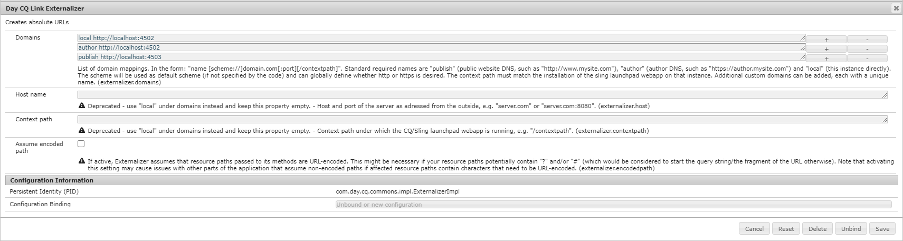

# Integrieren von AEM Assets mit Adobe InDesign Server {#integrating-aem-assets-with-indesign-server}

Adobe Experience Manager (AEM) Assets nutzt:

* Einen Proxy für den Lastenausgleich bei der Verarbeitung bestimmter Aufgaben. Ein Proxy ist eine AEM-Instanz, die mit einem Proxy Worker kommuniziert, um eine bestimmte Aufgabe zu erfüllen, sowie mit anderen AEM-Instanzen, um das Ergebnis bereitzustellen.
* Einen Proxy Worker zum Definieren und Verwalten einer bestimmten Aufgabe.

Diese können eine Vielzahl von Aufgaben abdecken; Beispielsweise die Verwendung einer Adobe InDesign Server zur Verarbeitung von Dateien.

Um Dateien, die Sie mit Adobe InDesign erstellt haben, vollständig in AEM Assets zu laden, wird ein Proxy verwendet. Dieser verwendet einen Proxy Worker für die Kommunikation mit Adobe InDesign Server, wo [Skripte](https://www.adobe.com/devnet/indesign/documentation.html#idscripting) ausgeführt werden, um Metadaten zu extrahieren und verschiedene Ausgabeformate für AEM Assets zu generieren. Der Proxy Worker ermöglicht die bidirektionale Kommunikation zwischen InDesign Server und den AEM-Instanzen in einer Cloud-Konfiguration.

>[!NOTE]
>
>Adobe InDesign wird in Form von zwei Produkten angeboten:
>
>* [InDesign](https://www.adobe.com/de/products/indesign.html)\
   >  Damit können Sie Seiten-Layouts für den Druck bzw. die digitale Distribution entwerfen.
   >
   >
* [InDesign Server](https://www.adobe.com/de/products/indesignserver.html)\
   >  Diese Engine ermöglicht die programmgesteuerte automatisierte Erstellung von Dokumenten, die auf denen basieren, die Sie mit InDesign entworfen haben. Die Engine fungiert als Dienst, der eine Schnittstelle seiner [ExtendScript](https://www.adobe.com/devnet/scripting.html)-Engine bereitstellt.\
   >  Die Skripte werden in ExtendScript geschrieben, das JavaScript ähnelt. Weitere Informationen zu InDesign-Skripten finden Sie unter [https://www.adobe.com/devnet/indesign/documentation.html#idscripting](https://www.adobe.com/devnet/indesign/documentation.html#idscripting).

>

## So funktioniert die Extraktion {#how-the-extraction-works}

Die InDesign Server kann in AEM Assets integriert werden, sodass mit InDesign ( `.indd`) erstellte Dateien hochgeladen, Ausgabeformate generiert, *alle* Medien extrahiert (z. B. Video) und als Assets gespeichert werden können:

>[!NOTE]
>
>Frühere Versionen von AEM konnten XMP und die Miniaturansicht extrahieren, während jetzt alle Medien extrahiert werden können.

1. Laden Sie Ihre `.indd`-Datei in AEM Assets hoch.
1. Ein Framework sendet Befehlsskripte via SOAP (Simple Object Access Protocol) an InDesign Server.

   Dieses Befehlsskript führt folgende Aktionen aus:

   * Rufen Sie die Datei `.indd` ab.
   * Führt InDesign Server-Befehle aus:

      * Struktur, Text und alle Mediendateien werden extrahiert.
      * PDF- und JPG-Ausgabeformate werden generiert.
      * HTML- und IDML-Ausgabeformate werden generiert.
   * Veröffentlicht die resultierenden Dateien wieder in AEM Assets.

   >[!NOTE]
   >
   >IDML ist ein XML-Format, das *alle Funktionen* der InDesign-Datei rendert. Es wird als komprimiertes Paket mithilfe der [ZIP-Komprimierung](https://www.techterms.com/definition/zip) gespeichert.
   >
   >Weitere Informationen finden Sie unter [Adobe InDesign Interchange Formats INX and IDML](https://www.peachpit.com/articles/article.aspx?p=1381880&amp;seqNum=8) .

   >[!CAUTION]
   >
   >Wenn die InDesign Server nicht installiert oder nicht konfiguriert ist, können Sie dennoch eine `.indd`-Datei in AEM hochladen. Die generierten Ausgabedarstellungen sind jedoch auf `png` und `jpeg` beschränkt, Sie können `html`, `idml` oder die Seitenausgabeformate nicht generieren.

1. Nach der Extraktion und Ausgabegenerierung:

   * Die Struktur wird auf einer `cq:Page` repliziert (Ausgabetyp).
   * Der extrahierte Text und die Dateien werden in AEM Assets gespeichert.
   * Alle Ausgabeformate werden in AEM Assets im Asset selbst gespeichert.

## Integrieren von InDesign Server in AEM   {#integrating-the-indesign-server-with-aem}

Um InDesign Server für die Verwendung mit AEM Assets zu integrieren und nach der Konfiguration des Proxys müssen Sie folgende Schritte durchführen:

1. [Installieren Sie InDesign Server](#installing-the-indesign-server).
1. Falls erforderlich, [konfigurieren Sie den AEM Assets-Workflow](#configuring-the-aem-assets-workflow).

   Dies ist nur dann notwendig, wenn die Standardwerte für Ihre Instanz nicht geeignet sind.

1. Konfigurieren Sie einen [Proxy Worker für InDesign Server](#configuring-the-proxy-worker-for-indesign-server).

### Installieren von InDesign Server   {#installing-the-indesign-server}

Um InDesign Server für die Verwendung mit AEM zu installieren und zu starten, gehen Sie wie folgt vor:

1. Laden Sie Adobe InDesign Server herunter und installieren Sie ihn.

   >[!NOTE]
   >
   >InDesign Server (CS6 und höher).

1. Bei Bedarf können Sie die Konfiguration Ihrer InDesign Server-Instanz anpassen.

1. Starten Sie den Server über die Befehlszeile:

   `<*ids-installation-dir*>/InDesignServer.com -port 8080`

   Dadurch wird der Server mit dem SOAP-Plug-in gestartet, das Port 8080 abhört. Alle Protokollmeldungen und Ausgaben werden direkt im Befehlsfenster angezeigt.

   >[!NOTE]
   >
   >Wenn Sie die Ausgabemeldungen in einer Datei speichern möchten, müssen Sie dazu eine Umleitung verwenden, z. B. unter Windows:
   >
   >`<ids-installation-dir>/InDesignServer.com -port 8080 > ~/temp/INDD-logfile.txt 2>&1`

### Konfigurieren des AEM Assets-Workflows {#configuring-the-aem-assets-workflow}

AEM Assets verfügt über einen vorkonfigurierten Workflow **DAM Update Asset**, der mehrere Prozessschritte speziell für InDesign umfasst:

* [Extrahierung von Medien](#media-extraction)
* [Extrahierung von Seiten  ](#page-extraction)

Dieser Workflow wird mit Standardwerten konfiguriert, die für Ihr Setup in den verschiedenen Autoreninstanzen angepasst werden können. (Dies ist ein Standard-Workflow. Deshalb finden Sie weitere Information unter [Bearbeiten eines Workflows](/help/sites-developing/workflows-models.md#configuring-a-workflow-step).) Wenn Sie die Standardwerte (einschließlich SOAP-Port) verwenden, ist keine Konfiguration erforderlich.

Nach Abschluss des Setups löst das Hochladen von InDesign-Dateien in AEM Assets (mithilfe einer der üblichen Methoden) den Workflow für die Verarbeitung des Assets und Vorbereitung der verschiedenen Ausgabeformate aus. Testen Sie Ihre Konfiguration, indem Sie eine `.indd`-Datei in AEM Assets hochladen und auf diese Weise überprüfen, ob IDS verschiedene Ausgabeformate unter `<*your_asset*>.indd/Renditions` erstellt. 

#### Extrahierung von Medien {#media-extraction}

Dieser Schritt steuert die Extraktion von Medien aus der Datei `.indd` .

Anpassungen können Sie im Schritt **[!UICONTROL Extrahierung von Medien]** auf der Registerkarte **[!UICONTROL Argumente]** vornehmen.

Argumente und Skriptpfade zum Extrahieren von Medien

* **ExtendScript-Bibliothek**: Dies ist eine einfache HTTP-GET/Post-Methodenbibliothek, die von anderen Skripten benötigt wird.

* **Skripten erweitern**: Hier können Sie unterschiedliche Skriptkombinationen angeben. Wenn Ihre eigenen Skripte auf InDesign Server ausgeführt werden sollen, speichern Sie die Skripte unter `/apps/settings/dam/indesign/scripts`.

   Weitere Informationen zu InDesign-Skripten finden Sie unter [https://www.adobe.com/devnet/indesign/documentation.html#idscripting](https://www.adobe.com/devnet/indesign/documentation.html#idscripting).

>[!CAUTION]
>
>Ändern Sie nicht die ExtendScript-Bibliothek. Die Bibliothek bietet die HTTP-Funktionalität, die für die Kommunikation mit Sling erforderlich ist. Diese Einstellung gibt die Bibliothek an, die zur Verwendung an die Adobe InDesign Server gesendet werden soll.

Das Skript `ThumbnailExport.jsx`, das vom Workflow-Schritt &quot;Extrahierung von Medien&quot;ausgeführt wird, generiert eine Miniaturansicht im JPG-Format. Dieses Ausgabeformat wird vom Workflow-Schritt „Miniaturansichten verarbeiten“ dazu verwendet, die für AEM erforderlichen statischen Ausgabeformate zu rendern.

Sie können den Workflow-Schritt „Miniaturansichten verarbeiten“ so konfigurieren, dass statische Darstellungen in verschiedenen Größen generiert werden. Stellen Sie sicher, dass Sie die Voreinstellungen nicht entfernen, da sie für die AEM Assets-Benutzeroberfläche erforderlich sind. Abschließend entfernt der Workflow-Schritt „Bildvorschau-Wiedergabe löschen“ die JPG-Miniaturansicht, da sie nicht mehr benötigt wird.

#### Extrahierung von Seiten   {#page-extraction}

Dabei wird eine AEM-Seite aus den extrahierten Elementen erstellt. Das Extrahieren von Daten aus einem Ausgabeformat (aktuell HTML oder IDML) erfolgt mithilfe eines Extrahierungshandlers. Diese Daten werden verwendet, um eine Seite mit PageBuilder zu erstellen.

Anpassungen können Sie im Schritt **[!UICONTROL Extrahierung von Seiten]** auf der Registerkarte **Argumente** vornehmen.

* **Seitenextraktions-Handler**: Wählen Sie aus der Dropdown-Liste den Handler aus, den Sie verwenden möchten. Ein Extrahierungs-Handler arbeitet mit einem bestimmten Ausgabeformat, das mit einem entsprechenden `RenditionPicker` ausgewählt wird (siehe `ExtractionHandler`-API). Standardmäßig ist der IDML-Export-Extraktions-Handler verfügbar. Sie funktioniert mit der im Schritt MediaExtract generierten `IDML`-Ausgabedarstellung.

* **Seitenname**: Geben Sie den Namen an, den Sie der resultierenden Seite zuweisen möchten. Wenn Sie das Feld leer lassen, wird als Name „Seite“ gewählt (oder eine Ableitung, falls „Seite“ bereits vorhanden ist).

* **Seitentitel**: Geben Sie den Titel an, den Sie der resultierenden Seite zuweisen möchten.

* **Stammverzeichnis der Seite**: Der Pfad zum Stammverzeichnis der resultierenden Seite. Wenn Sie das Feld leer lassen, wird der Knoten mit den Ausgabeformaten des Assets verwendet.

* **Seitenvorlage**: Die Vorlage, die beim Generieren der resultierenden Seite verwendet werden soll.

* **Seitendesign**: Der Seitenentwurf, der beim Generieren der resultierenden Seite verwendet werden soll.

### Konfigurieren von Proxy Worker für InDesign Server {#configuring-the-proxy-worker-for-indesign-server}

>[!NOTE]
>
>Der Worker befindet sich in der Proxy-Instanz.

1. Erweitern Sie in der Tools-Konsole im linken Bereich den Eintrag **[!UICONTROL Cloud-Service-Konfigurationen]**. Anschließend erweitern Sie den Eintrag **[!UICONTROL Cloud-Proxy-Konfiguration]**.

1. Doppelklicken Sie auf den **[!UICONTROL IDS-Worker]**, um ihn für die Konfiguration zu öffnen.

1. Klicken Sie auf **[!UICONTROL Bearbeiten]**, um das Konfigurationsdialogfeld zu öffnen und die erforderlichen Einstellungen vorzunehmen:

   

   * **IDS-Pool**: Die SOAP-Endpunkte, die für die Kommunikation mit der InDesign Server verwendet werden sollen. Sie können Elemente nach Bedarf hinzufügen, entfernen und ordnen.

1. Klicken Sie zum Speichern auf **[!UICONTROL OK]**.

### Konfigurieren von Day CQ Link Externalizer  {#configuring-day-cq-link-externalizer}

Wenn sich die InDesign Server und AEM auf unterschiedlichen Hosts befinden oder eine oder beide dieser Anwendungen nicht an Standardanschlüssen funktionieren, konfigurieren Sie **Day CQ Link Externalizer**, um den Hostnamen, Port und Inhaltspfad für die InDesign Server festzulegen.

1. Greifen Sie auf Configuration Manager über die URL `https://[AEM_server]:[port]/system/console/configMgr` zu.
1. Suchen Sie die Konfiguration **[!UICONTROL Day CQ Link Externalizer]**. Klicken Sie auf **[!UICONTROL Bearbeiten]** , um zu öffnen.
1. Mithilfe der Einstellungen von Link Externalizer können Sie absolute URLs für die [!DNL Experience Manager] -Implementierung und für [!DNL InDesign Server] erstellen. Verwenden Sie das Feld **[!UICONTROL Domains]** , um den Hostnamen und den Kontextpfad für [!DNL Adobe InDesign Server] anzugeben. Befolgen Sie die Anweisungen auf dem Bildschirm. Klicken Sie auf **[!UICONTROL Speichern]**.

   

### Aktivieren der parallelen Auftragsverarbeitung für InDesign Server {#enabling-parallel-job-processing-for-indesign-server}

Sie können jetzt die parallele Auftragsverarbeitung für IDS aktivieren.

Dazu müssen Sie zunächst die maximale Anzahl der parallelen Aufträge (`x`) festlegen, die ein InDesign Server verarbeiten kann:

* Auf einem einzelnen Mehrprozessor-Computer ist die Anzahl der parallelen Aufträge (x), die ein InDesign Server verarbeiten kann, um eins kleiner als die Anzahl der Prozessoren, die IDS ausführen.
* Wenn Sie IDS auf mehreren Computern ausführen, müssen Sie von der Gesamtanzahl der verfügbaren Prozessoren (auf allen Computern) die Gesamtanzahl der Computer abziehen.

So konfigurieren Sie die Anzahl der parallelen IDS-Aufträge:

1. Öffnen Sie die Registerkarte **[!UICONTROL Konfigurationen]** der Felix-Konsole. Beispiel:  

   `http://localhost:4502/system/console/configMgr`

1. Wählen Sie die IDS-Verarbeitungsschlange unter:

   `Apache Sling Job Queue Configuration`

1. Satz:

   * **[!UICONTROL Typ]** - `Parallel`
   * **[!UICONTROL Maximal parallel ausführbare Aufträge]** –`<*x*>` (Berechnung siehe oben)

1. Speichern Sie diese Änderungen.
1. Aktivieren Sie das Kontrollkästchen `enable.multisession.name` unter `com.day.cq.dam.ids.impl.IDSJobProcessor.name configuration`, um die Unterstützung für mehrere Sitzungen für Adobe CS6 und höher zu aktivieren.
1. Erstellen Sie einen [Pool von &lt; `*x*>` IDS-Sekundären, indem Sie SOAP-Endpunkte zur IDS-Worker-Konfiguration](#configuring-the-proxy-worker-for-indesign-server) hinzufügen.

   Wenn mehrere Computer InDesign Server ausführen, fügen Sie SOAP-Endpunkte (Anzahl der Prozessoren pro Computer -1) für jeden Computer hinzu.

   >[!NOTE]
   >
   >Wenn Sie mit einem Pool von Mitarbeitern arbeiten, können Sie die Blockierungsliste von IDS-Arbeitern aktivieren.
   >
   >Dazu aktivieren Sie das Kontrollkästchen „enable.retry.name“ unter der Konfiguration `com.day.cq.dam.ids.impl.IDSJobProcessor.name`, die Wiederholungen von IDS-Aufträgen ermöglicht.
   >
   >Legen Sie in der Konfiguration `com.day.cq.dam.ids.impl.IDSPoolImpl.name` außerdem einen positiven Wert für den Parameter `max.errors.to.blacklist` fest, der die Anzahl der Auftragswiederholungen steuert, bevor ein IDS aus der Auftrags-Handler-Liste ausgeschlossen wird.
   >
   >Standardmäßig wird der IDS-Worker nach der konfigurierbaren (`retry.interval.to.whitelist.name`) Zeit in Minuten erneut validiert. Wenn der Worker online gefunden wird, wird er aus der Blockierungsliste entfernt.

<!-- TBD: Make updates to configurations for allow and block list after product updates are done. See CQ-4298427.
-->

## Unterstützung für Adobe InDesign Server 10.0 oder höher aktivieren {#enabling-support-for-indesign-server-or-higher}

Führen Sie für InDesign Server 10.0 oder höher die folgenden Schritte durch, um Unterstützung für Mehrfachsitzungen zu aktivieren.

1. Öffnen Sie den Configuration Manager über Ihre [!DNL Assets]-Instanz `https://[aem_server]:[port]/system/console/configMgr`.
1. Bearbeiten Sie die Konfiguration `com.day.cq.dam.ids.impl.IDSJobProcessor.name`.
1. Wählen Sie die Option **[!UICONTROL ids.cc.enable]** und klicken Sie auf **[!UICONTROL Save]**.

>[!NOTE]
>
>Verwenden Sie für die Integration von [!DNL InDesign Server] mit [!DNL Assets] einen Multicore-Prozessor, da die für die Integration erforderliche Sitzungsunterstützungsfunktion auf einzelnen Kernsystemen nicht unterstützt wird.

## Experience Manager-Anmeldedaten konfigurieren {#configure-aem-credentials}

Sie können die standardmäßigen Administratorberechtigungen (Benutzername und Kennwort) für den Zugriff auf den InDesign-Server von Ihrer AEM-Instanz aus ändern, ohne die Integration mit dem Adobe InDesign-Server zu unterbrechen.

1. Wechseln zu `/etc/cloudservices/proxy.html`.
1. Geben Sie in diesem Dialogfeld den neuen Benutzernamen und das Kennwort ein.
1. Speichern Sie die Anmeldedaten.
