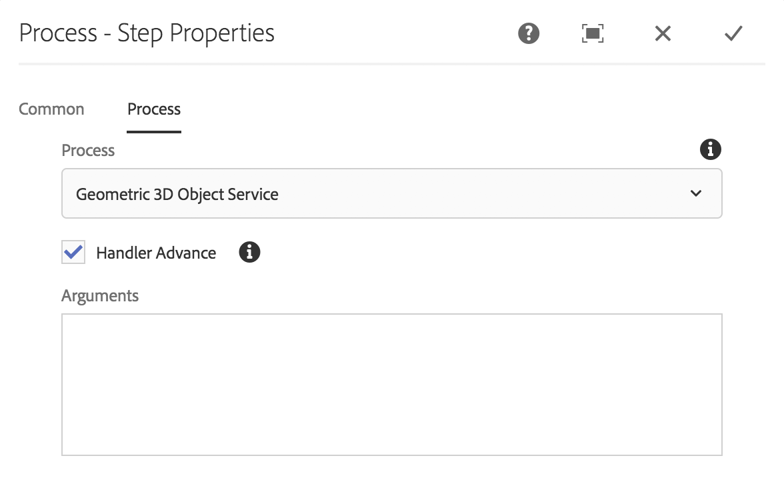
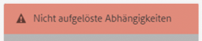
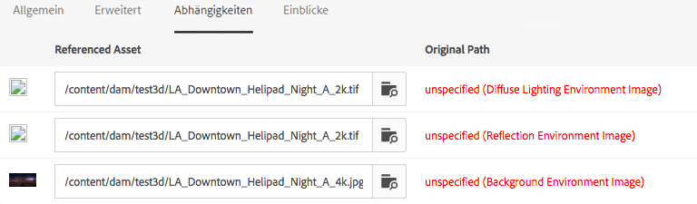
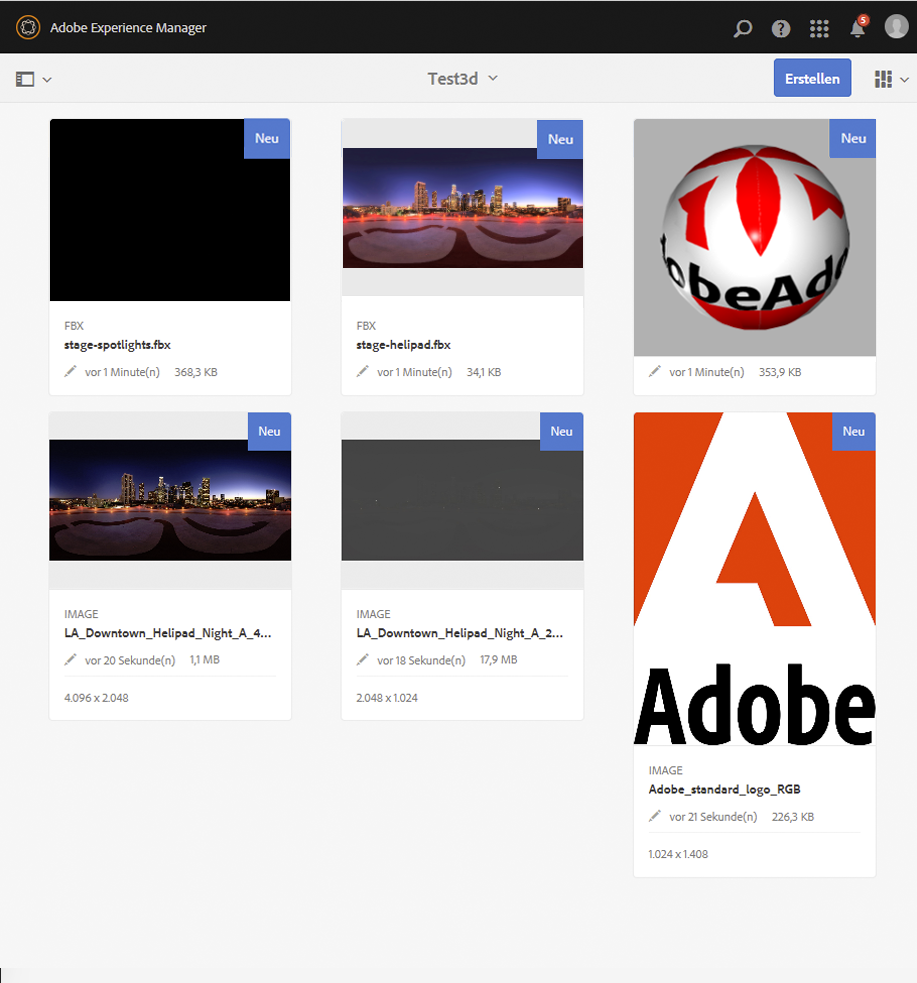
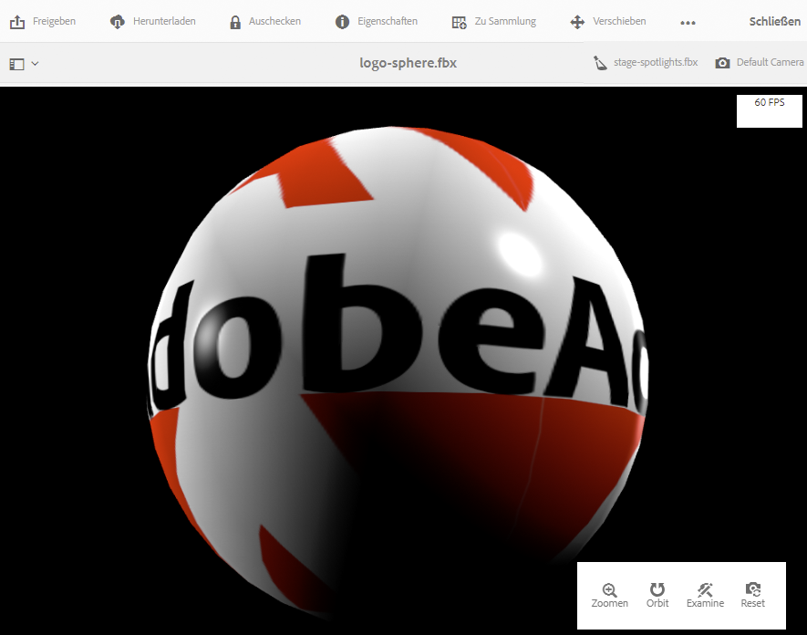
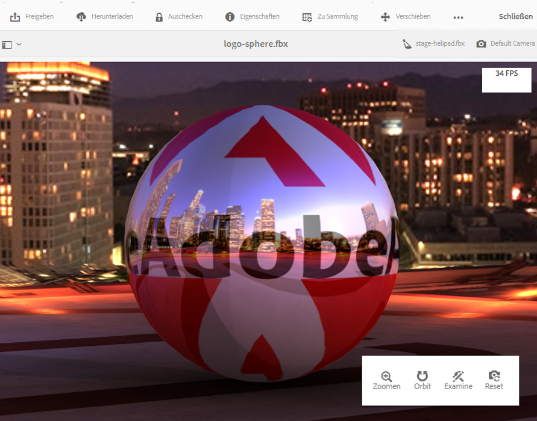

# Installieren und Konfigurieren von AEM 3D {#installing-and-configuring-aem-d}

>[!IMPORTANT]
>
>AEM 3D in AEM 6.4 wird nicht mehr unterstützt. Adobe empfiehlt, die Funktion für 3D-Elemente in [AEM als Cloud Service](https://experienceleague.adobe.com/docs/experience-manager-cloud-service/assets/dynamicmedia/assets-3d.html#dynamicmedia) oder [AEM 6.5.3 oder höher zu verwenden.](https://experienceleague.adobe.com/docs/experience-manager-65/assets/dynamic/assets-3d.html#dynamic)

Die Installation und Konfiguration von AEM 3D (Version 3.0) umfasst Folgendes:

1. Installation der Autodesk® FBX® SDK-Bibliothek.
1. Herunterladen und Installieren des nativen 3D-Code-Pakets
1. Konfigurieren des 3D-Asset-Aufnahme-Workflows und Neustarten von AEM
1. Validieren der Einstellungen von AEM 3D

Siehe auch [Arbeiten mit 3D-Assets](assets-3d.md).

Siehe auch [Versionshinweise für AEM 3D-Assets](/help/release-notes/aem3d-release-notes.md) für Voraussetzungen, unterstützte Browser und andere wichtige Versionshinweise.

Siehe auch [Arbeiten mit der 3D-Sites-Komponente](using-the-3d-sites-component.md).

>[!NOTE]
>
>Vergewissern Sie sich vor dem Herunterladen und Installieren des 3D-Pakets, dass alle erforderlichen AEM erfolgreich installiert wurden. Siehe [Versionshinweise zu AEM 3D.](install-config-3d.md)

## Installieren der Autodesk FBX SDK-Bibliothek {#installing-the-autodesk-fbx-sdk-library}

Der native AEM 3D-Code benötigt die Autodesk FBX-Bibliothek, um das FBX-Dateiformat unterstützen zu können. (Adobe kann diese Bibliothek derzeit nicht verteilen.)

Siehe auch [Erweiterte Konfigurationseinstellungen](advanced-config-3d.md).

1. Melden Sie sich bei dem Host an, auf dem AEM installiert ist.

   * Wenn es sich dabei um ein Windows Server-System handelt, melden Sie sich beim Server als Administrator an.
   * Wenn es sich um einen Mac oder einen Windows-Desktop handelt, stellen Sie sicher, dass Sie über Administratorberechtigungen verfügen.

1. Laden Sie die für Ihr Betriebssystem passende **FBX SDK-Version 2016.1.2** herunter

   * **Windows**

      [https://download.autodesk.com/us/fbx_release_older/2016.1.2/fbx20161_2_fbxsdk_vs2010_win.exe](https://download.autodesk.com/us/fbx_release_older/2016.1.2/fbx20161_2_fbxsdk_vs2010_win.exe)

   * **OS X**

      [https://download.autodesk.com/us/fbx_release_older/2016.1.2/fbx20161_2_fbxsdk_clang_mac.pkg.tgz](https://download.autodesk.com/us/fbx_release_older/2016.1.2/fbx20161_2_fbxsdk_clang_mac.pkg.tgz)

   * **Linux**

      [https://download.autodesk.com/us/fbx_release_older/2016.1.2/fbx20161_2_fbxsdk_linux.tar.gz](https://download.autodesk.com/us/fbx_release_older/2016.1.2/fbx20161_2_fbxsdk_linux.tar.gz)

1. Installieren Sie das FBX-SDK:

   * Windows. Installieren Sie auf demselben Laufwerk, auf dem sich AEM befindet.
   * Mac. Installieren Sie es auf derselben Partition wie AEM.
   * Linux. Extrahieren Sie das heruntergeladene Paket und befolgen Sie die Anweisungen in `<yourFBXSDKpath>/Install_FbxFileSdk.txt`. Installieren Sie das SDK auf `/usr`.

## Herunterladen und Installieren des nativen 3D-Code-Pakets {#downloading-and-installing-the-native-d-code-package}

>[!NOTE]
>
>Bevor Sie mit der Installation und Konfiguration von AEM 3D fortfahren, empfiehlt Adobe, dass Sie alle entsprechenden Service Packs und andere zugehörige Feature Packs bereitstellen. Siehe [Versionshinweise zu AEM 3D](/help/release-notes/aem3d-release-notes.md).

Siehe auch [Erweiterte Konfigurationseinstellungen](advanced-config-3d.md).

**So installieren Sie das native 3D-Codepaket**:

1. Führen Sie einen der folgenden Schritte aus:

   * Wenn es sich dabei um ein Windows Server-System handelt, melden Sie sich bei dem Server als Administrator an.
   * Wenn es sich um einen Mac- oder Windows-Desktop handelt, stellen Sie sicher, dass Sie über Administratorrechte verfügen.

1. Stellen Sie sicher, dass Sie einen unterstützten Browser verwenden, der auf AEM zugreifen kann.

   Siehe [Systemanforderungen](/help/release-notes/aem3d-release-notes.md#system-requirements).

1. Zugriff auf [Software Distribution Portal](https://experience.adobe.com/#/downloads/content/software-distribution/en/aem.html). Suchen Sie Version 3.0.1 des `AEM-6.4-DynamicMedia-3D` Feature Packs und laden Sie es herunter.

1. Klicken Sie in AEM auf **[!UICONTROL Tools > Administration > Bereitstellung > Paketmanager]**.

1. Laden Sie das heruntergeladene Feature Pack zu AEM hoch. Suchen Sie es und klicken Sie auf **[!UICONTROL Installieren]**.

1. Erweitern Sie im Dialogfeld **[!UICONTROL Paket installieren]** die Erweiterten Einstellungen **und setzen Sie**[!UICONTROL  Zugriffskontrolle Handling ]**auf** Zusammenführen **.**
1. Klicken Sie auf **[!UICONTROL Installieren]**, um die Installation des Pakets zu starten.

   Die Datei `sample-3D-content.zip` wird im Stammordner **[!UICONTROL Assets]** abgelegt. Weitere Informationen finden Sie unter [Validieren der Einstellungen von AEM 3D](#validating-the-setup-of-aem-d).

## Konfigurieren des 3D-Asset-Aufnahme-Workflows und Neustarten von AEM {#configuring-the-d-asset-ingestion-workflow-and-restarting-aem}

**So konfigurieren Sie den Workflow zur 3D-Asset-Aufnahme**:

1. Klicken Sie in AEM auf das AEM Logo, um auf die globale Navigationskonsole zuzugreifen, und klicken Sie dann auf das Symbol **[!UICONTROL Tools]** und navigieren Sie zu **[!UICONTROL Workflow > Modelle]**.
1. Bewegen Sie den Mauszeiger auf der Seite **[!UICONTROL Workflow-Modelle]** über den Workflow **[!UICONTROL DAM-Update-Asset]** und wählen Sie das Kontrollkästchen aus, wenn es angezeigt wird.

1. Klicken Sie in der Symbolleiste auf **[!UICONTROL Bearbeiten]**.
1. Klicken Sie im Bildschirm **[!UICONTROL DAM Update Asset]** im schwebenden Bedienfeld AEM auf das Symbol **[!UICONTROL Plus]** rechts neben Workflow, um die Liste zu erweitern. Wählen Sie in der Liste den Eintrag **[!UICONTROL Prozessschritt]** aus.
1. Ziehen Sie **[!UICONTROL Prozessschritt]** und legen Sie ihn in den Workflow ein, kurz vor der Komponente **[!UICONTROL DAM Update Asset Workflow Complete]** am Ende des Workflows.

   

1. Doppelklicken Sie auf den neu hinzugefügten Prozessschritt.
1. Geben Sie im Dialogfeld **[!UICONTROL Schritt-Eigenschaften]** unter der Registerkarte **[!UICONTROL Allgemein]** im Feld **[!UICONTROL Titel]** eine geeignete Beschreibung für den Prozess ein, z. B. `Process 3D content`.
1. Klicken Sie auf die Registerkarte **[!UICONTROL Verarbeitung]**.

1. Wählen Sie im Dropdownmenü **[!UICONTROL Prozess]** die Option **[!UICONTROL Geometrischer 3D-Objektdienst]** und aktivieren Sie dann das Kontrollkästchen **[!UICONTROL Handler-Modus]**.

   

1. Klicken Sie in der rechten oberen Ecke des Dialogfelds auf das Häkchensymbol, um zur Seite &quot;DAM-Update-Asset&quot;zurückzukehren.
1. Klicken Sie in der rechten oberen Ecke der Seite **[!UICONTROL DAM-Update-Asset]** auf **[!UICONTROL Synchronisieren]**, um das bearbeitete Workflow-Modell zu speichern.
1. Starten Sie AEM neu.

   Nach dem Neustart können Sie 3D-Inhalte hochladen und AEM verarbeiten.

   Fahren Sie mit [Validieren der Einstellungen von AEM 3D](#validating-the-setup-of-aem-d) fort.

## Validieren der Einstellungen von AEM 3D  {#validating-the-setup-of-aem-d}

1. Klicken Sie in AEM auf **[!UICONTROL Tools > Assets]**, laden Sie dann die Datei `sample-3D-content.zip` herunter und entpacken Sie die heruntergeladene Datei. (Sie können `sample-3D-content.zip` in AEM löschen.)

   Stellen Sie sicher, dass Sie sich in der **[!UICONTROL Kartenansicht]** befinden, um Feedback zum Hochladen und Verarbeiten in den verbleibenden Schritten anzuzeigen.

1. Erstellen Sie einen Ordner mit dem Namen `test3d`, um Testinhalte zu erhalten.
1. Laden Sie alle Dateien von `sample-3D-content/images` in den Ordner `test3d` hoch.
1. Warten Sie, bis das Hochladen und die Verarbeitung abgeschlossen sind. Möglicherweise müssen Sie den Browser aktualisieren.

   Laden Sie die drei `.fbx`-Dateien von `sample-3D-content/` in den Ordner `test3d` hoch.

   Laden Sie die MA-Modelldateien noch nicht hoch.

1. Kontrollieren Sie in der Kartenansicht die Meldungsbanner, die auf den 3D-Asset-Karten angezeigt werden.

   Jedes Asset durchläuft mehrere Verarbeitungsschritte. Wenn die Vorschau **[!UICONTROL Erstellen ...Nach Abschluss des Verarbeitungsschritts]** wird die Karte mit einem Miniaturbild aktualisiert. Wenn die abschließende Verarbeitung abgeschlossen ist, wird das Banner durch den Hinweis **[!UICONTROL NEU]** ersetzt.

   >[!NOTE]
   >
   >Rechnen Sie während der 3D-Verarbeitung mit sehr hoher Prozessorauslastung. Je nach verfügbarer CPU-Kapazität dauert es möglicherweise eine beträchtliche Zeit, bis die gesamte Verarbeitung abgeschlossen ist.

   

1. Im Folgenden erfahren Sie, wie Sie Dateiabhängigkeiten beheben können.

   Klicken Sie im Banner **[!UICONTROL Ungelöste Abhängigkeiten]** für die Karte `stage-helipad.fbx` auf das Symbol **[!UICONTROL Ausrufezeichen]**, um zu den Eigenschaften des Assets zu navigieren und die Registerkarte **Abhängigkeiten** zu öffnen.

   

1. Klicken Sie auf das Symbol **[!UICONTROL Ordner/Vergrößerungsglas]** rechts neben dem Dateinamen, um den Asset-Browser zu öffnen und die Abhängigkeiten wie folgt aufzulösen:

   

1. Klicken Sie auf **[!UICONTROL Speichern]** und **[!UICONTROL Schließen]**, um die Verarbeitung des Assets abzuschließen und zur **[!UICONTROL Ansicht]** zurückzukehren.
1. Nach Abschluss der Verarbeitung sehen Sie unter **[!UICONTROL Ansicht]** Folgendes:

   

1. Klicken Sie auf der Seite &quot;test3d&quot;auf die Karte `logo-sphere.fbx`, um das Modell in **[!UICONTROL Detail-Ansicht]** zu öffnen.

   Klicken Sie auf der Seite „logo-sphere.fbx“ oben rechts auf das Symbol „Stage Spotlight“, um das Dropdown-Menü zu öffnen, und wählen Sie dann `stage-spotlights.fbx` aus.

   

1. Wählen Sie in der Dropdown-Liste **[!UICONTROL Stage Spotlight]** `stage-helipad.fbx` aus.

   Passen Sie die Ansicht mit der linken Maustaste an. Der Hintergrund und die Modellbeleuchtung verändern sich, um die neue Auswahl anzuzeigen.

   

## Konfigurieren der Unterstützung für Adobe Dimension-Assets {#configuring-support-for-adobe-dimension-assets}

>[!NOTE]
>
>Diese Aufgabe ist optional.

Sie können optional die Unterstützung in AEM 3D für Adobe Dimension-Assets konfigurieren.

Sie müssen einen externen Konvertierungsdienst konfigurieren, um die Erfassung, Vorschau und Veröffentlichung von Adobe Dimension 3D-Assets in AEM zuzulassen. Der Dienst konvertiert das proprietäre Adobe Dimension (`.dn`)-Format in eine Variante von glTF (formatiert als `.glb`-Datei), die mit dem Dn-Asset als Darstellung gespeichert wird. Die Darstellung `.glb` wird für die webbasierte Anzeige des 3D-Assets in AEM Assets, Sites und Bildschirmen verwendet und kann auch für Anwendungen von Drittanbietern heruntergeladen werden.

>[!NOTE]
>
>Der Konvertierungsdienst wird von der Adobe in Amazon AWS gehostet. Nach der ordnungsgemäßen Konfiguration des Dienstes werden `.dn`-Dateien, die in AEM hochgeladen werden, durch temporäre Datenspeicherung in Amazon S3 sicher in den Konvertierungsdienst kopiert. Das Konversionsergebnis wird über eine temporäre S3-Datenspeicherung zurück auf AEM übertragen. Alle Überweisungen und Datenspeicherung sind gesichert. Außerdem bleiben die Inhalte in S3 und der Konvertierungsdienst nur kurz (normalerweise höchstens wenige Minuten) erhalten.

**So konfigurieren Sie den Suoport für Adobe Dimension-Assets**:

1. Wenden Sie sich an Ihren Adobe AEM Kundenbetreuer, Bereitstellungsexperten oder Supportmitarbeiter, um Anmeldeinformationen für **AEM3D-Dienste** anzufordern.

   >[!NOTE]
   >
   >Für jedes Unternehmen ist unabhängig von der Anzahl AEM Instanzen, auf denen die Anmeldeinformationen installiert sind, nur ein Satz Anmeldeinformationen erforderlich.

1. Vergewissern Sie sich, dass Sie die folgenden Informationen erhalten haben:

   * accountId
   * customerId
   * password
   * identityPoolId
   * userPoolId
   * clientId

1. Melden Sie sich als Administrator bei Ihrer AEM Autoreninstanz an, in der die Anmeldeinformationen installiert werden sollen, und öffnen Sie dann **[!UICONTROL CRXDE Lite]**.
1. Konfigurieren Sie die neuen Anmeldeinformationen wie folgt in CRXDE Lite:

   1. Navigieren Sie zu `/libs/settings/dam/v3D/services/dncr` und legen Sie die `clientId`-Eigenschaft auf den neuen Wert fest.
   1. Navigieren Sie zu `/libs/settings/dam/v3D/services/aws` und stellen Sie die Eigenschaften `accountId`, `customerId`, `identityPoolId` und `userPoolId` auf die neuen Werte ein.
   1. Laden Sie den neuen Kennwortwert in die Eigenschaft `encryptedPassword`. Dieser Wert wird automatisch verschlüsselt, wenn Sie auf **[!UICONTROL Alle speichern]** tippen.
   1. Tippen Sie auf **[!UICONTROL Alle speichern]**, laden Sie die Seite neu und überprüfen Sie dann, ob die `encryptedPassword`-Eigenschaft eine andere Zeichenfolge enthält, die von geschweiften Klammern eingeschlossen ist. Dieses Erscheinungsbild zeigt an, dass das Kennwort korrekt verschlüsselt und sicher ist.

1. Geben Sie das Format der Konvertierungswiedergabe `.glb` an, indem Sie folgende Schritte in **[!UICONTROL CRXDE Lite]** ausführen:

   1. Navigieren Sie zu `/libs/settings/dam/v3D/services/dncr` in **[!UICONTROL CRXDE Lite]**.
   1. Legen Sie die Eigenschaft `outputFormat` entweder auf `Dn` oder auf `generic` fest.

      Wenn `Dn` eingestellt ist, enthält die `.glb`-Konvertierung für die Anzeige von Dn-Assets in AEM spezielle Erweiterungen wie IBL-Beleuchtung. Die konvertierte .glb-Darstellung wird jedoch in Drittanbieteranwendungen möglicherweise nicht gut dargestellt.

      Bei Festlegung auf `generic` ist die Darstellung `.glb` generisch ohne Adobe-spezifische Erweiterungen. Diese Einstellung ermöglicht die Verwendung in Anwendungen von Drittanbietern, während die Anzeige mit dem AEM 3D-Viewer visuell suboptimal ist.

1. Aktivieren Sie das DN-Dateiformat, indem Sie folgende Schritte in **[!UICONTROL CRXDE Lite]** durchführen:

   1. Navigieren Sie zu `/libs/settings/dam/v3D/assetTypes/Dn`.
   1. Legen Sie die Eigenschaft `Enabled` auf true fest.

1. Validieren Sie die Konfiguration wie folgt:

   1. Öffnen Sie AEM Assets.
   1. Laden Sie `logo_sphere.dn` in den Ordner `test3d` hoch. Die Datei befindet sich in `sample-3D-content/models`.

      Beachten Sie, dass `sample-3D-content.zip` zuvor zum Überprüfen der grundlegenden 3D-Funktionen heruntergeladen wurde.
   1. Kehren Sie zur Ansicht **[!UICONTROL Karte]** zurück und sehen Sie sich das Meldungsbanner an, das auf dem hochgeladenen Asset angezeigt wird. Das Format **[!UICONTROL Konvertieren...]**-Banner wird angezeigt, während der Konvertierungsprozess läuft.
   1. Nachdem die Verarbeitung abgeschlossen ist, öffnen Sie das Asset in der Ansicht **[!UICONTROL Detail]**, um sicherzustellen, dass das konvertierte Asset korrekt angezeigt wird und die Navigationssteuerelemente des Viewers verwendet werden können.

   

   Wenn nach 10-15 Minuten im DN-Asset in der **[!UICONTROL Card-Ansicht]** ein &quot;Verarbeitungsfehler&quot;angezeigt wird, ist die Konvertierung fehlgeschlagen.

   In diesem Fall können Sie die Konvertierung wie folgt beheben:

   * Löschen Sie das Asset und laden Sie es dann erneut hoch.
   * Vergewissern Sie sich, dass Sie alle Konfigurationsparameter in **[!UICONTROL CRXDE Lite]** korrekt eingestellt haben.
   * Vergewissern Sie sich, dass keine Firewall den Zugriff auf den Konvertierungsdienst und AWS-Endpunkte blockiert.
