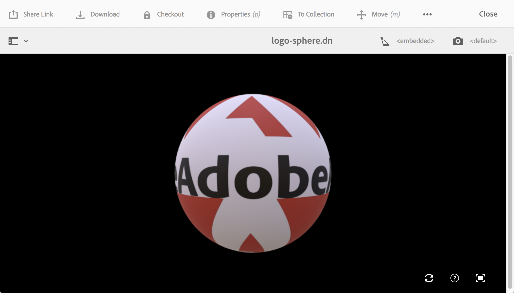

# Installieren und Konfigurieren von AEM 3D {#installing-and-configuring-aem-d}

Die Installation und Konfiguration von AEM 3D (Version 3.0) umfasst Folgendes:

1. Installation der Autodesk® FBX® SDK-Bibliothek.
1. Herunterladen und Installieren des nativen 3D-Code-Pakets
1. Konfigurieren des 3D-Asset-Aufnahme-Workflows und Neustarten von AEM
1. Validieren der Einstellungen von AEM 3D

Siehe auch [Arbeiten mit 3D-Assets](assets-3d.md).

Siehe auch [Versionshinweise für AEM 3D-Assets](/help/release-notes/aem3d-release-notes.md) für Voraussetzungen, unterstützte Browser und andere wichtige Versionshinweise.

Siehe auch [Arbeiten mit der 3D-Sites-Komponente](using-the-3d-sites-component.md).

>[!NOTE]
>
>Vergewissern Sie sich vor dem Herunterladen und Installieren des 3D-Pakets, dass alle erforderlichen AEM-Pakete erfolgreich installiert wurden. Siehe [Versionshinweise zu AEM 3D.](install-config-3d.md)

## Installieren der Autodesk FBX SDK-Bibliothek {#installing-the-autodesk-fbx-sdk-library}

Der native AEM 3D-Code benötigt die Autodesk FBX-Bibliothek, um das FBX-Dateiformat unterstützen zu können. (Adobe kann diese Bibliothek derzeit nicht verteilen.)

Siehe auch [Erweiterte Konfigurationseinstellungen](advanced-config-3d.md).

1. Melden Sie sich bei dem Host an, auf dem AEM installiert ist.

   * Wenn es sich dabei um ein Windows Server-System handelt, melden Sie sich beim Server als Administrator an.
   * Wenn es sich um einen Mac oder einen Windows-Desktop handelt, stellen Sie sicher, dass Sie über Administratorberechtigungen verfügen.

1. Laden Sie die für Ihr Betriebssystem passende **FBX SDK-Version 2016.1.2** herunter

   * **Windows**

      [https://download.autodesk.com/us/fbx_release_older/2016.1.2/fbx20161_2_fbxsdk_vs2010_win.exe](https://download.autodesk.com/us/fbx_release_older/2016.1.2/fbx20161_2_fbxsdk_vs2010_win.exe)

   * **OS X**

      [https://download.autodesk.com/us/fbx_release_older/2016.1.2/fbx20161_2_fbxsdk_clang_mac.pkg.tgz](https://download.autodesk.com/us/fbx_release_older/2016.1.2/fbx20161_2_fbxsdk_clang_mac.pkg.tgz)

   * **Linux**

      [https://download.autodesk.com/us/fbx_release_older/2016.1.2/fbx20161_2_fbxsdk_linux.tar.gz](https://download.autodesk.com/us/fbx_release_older/2016.1.2/fbx20161_2_fbxsdk_linux.tar.gz)

1. Installieren Sie das FBX-SDK:

   * Windows. Installieren Sie auf demselben Laufwerk, auf dem sich AEM befindet.
   * Mac. Installieren Sie es auf derselben Partition wie AEM.
   * Linux. Extract the downloaded package and follow the instructions in `<yourFBXSDKpath>/Install_FbxFileSdk.txt`. Install the SDK to `/usr`.

## Herunterladen und Installieren des nativen 3D-Code-Pakets {#downloading-and-installing-the-native-d-code-package}

>[!NOTE]
>
>Bevor Sie mit der Installation und Konfiguration von AEM 3D fortfahren, empfiehlt Adobe, dass Sie alle entsprechenden Service Packs und andere zugehörige Feature Packs bereitstellen. Siehe [Versionshinweise zu AEM 3D](/help/release-notes/aem3d-release-notes.md).

Siehe auch [Erweiterte Konfigurationseinstellungen](advanced-config-3d.md).

**So installieren Sie das native 3D-Codepaket**:

1. Führen Sie einen der folgenden Schritte aus:

   * Wenn es sich dabei um ein Windows Server-System handelt, melden Sie sich bei dem Server als Administrator an.
   * Wenn es sich um einen Mac- oder Windows-Desktop handelt, stellen Sie sicher, dass Sie über Administratorrechte verfügen.

1. Stellen Sie sicher, dass Sie einen unterstützten Browser verwenden, der auf AEM zugreifen kann.

   Siehe [Systemanforderungen](/help/release-notes/aem3d-release-notes.md#system-requirements).

1. Zugriff auf [Software Distribution Portal](https://experience.adobe.com/#/downloads/content/software-distribution/en/aem.html). Suchen Sie Version 3.0.1 des `AEM-6.4-DynamicMedia-3D` Feature Packs und laden Sie es herunter.

1. Klicken Sie in AEM auf **[!UICONTROL Tools > Administration > Bereitstellung > Paketmanager]**.

1. Laden Sie das heruntergeladene Feature Pack auf AEM hoch. Suchen Sie es und klicken Sie auf **[!UICONTROL Installieren]**.

1. In the **[!UICONTROL Install Package]** dialog box, expand **Advanced Settings**, then set **[!UICONTROL Access Control Handling]** to **Merge**.
1. Klicken Sie auf **[!UICONTROL Installieren]**, um die Installation des Pakets zu starten.

   The file `sample-3D-content.zip` is placed in the **[!UICONTROL Assets]** root folder. Weitere Informationen finden Sie unter [Validieren der Einstellungen von AEM 3D](#validating-the-setup-of-aem-d).

## Konfigurieren des 3D-Asset-Aufnahme-Workflows und Neustarten von AEM {#configuring-the-d-asset-ingestion-workflow-and-restarting-aem}

**So konfigurieren Sie den Workflow zur 3D-Asset-Aufnahme**:

1. In AEM, click the AEM logo to access the global navigation console, then click the **[!UICONTROL Tools]** icon and navigate to **[!UICONTROL Workflow > Models]**.
1. On the **[!UICONTROL Workflow Models]** page, hover over the **[!UICONTROL DAM Update Asset]** workflow, and when the check mark appears, select it.

1. Klicken Sie in der Symbolleiste auf **[!UICONTROL Bearbeiten]**.
1. On the **[!UICONTROL DAM Update Asset]** screen, in the AEM floating panel, click the **[!UICONTROL Plus]** icon to the right of Workflow to expand the list. Wählen Sie in der Liste den Eintrag **[!UICONTROL Prozessschritt]** aus.
1. Ziehen Sie den **[!UICONTROL Prozessschritt]** und legen Sie ihn im Workflow ab, bevor die Komponente **[!UICONTROL DAM Update Asset Workflow Complete]** am Ende des Workflows hinzugefügt wird.

   

1. Doppelklicken Sie auf den neu hinzugefügten Prozessschritt.
1. In the **[!UICONTROL Step Properties]** dialog box, under the **[!UICONTROL Common]** tab, in the **[!UICONTROL Title]** field, enter a suitable description for the process such as `Process 3D content`.
1. Klicken Sie auf die Registerkarte **[!UICONTROL Verarbeitung]**.

1. From the **[!UICONTROL Process]** drop-down menu, select **[!UICONTROL Geometric 3D Object Service]**, then select the **[!UICONTROL Handler Advance]** check box.

   

1. Klicken Sie in der rechten oberen Ecke des Dialogfelds auf das Häkchensymbol, um zur Seite &quot;DAM-Update-Asset&quot;zurückzukehren.
1. Klicken Sie in der rechten oberen Ecke der Seite **[!UICONTROL DAM Update Asset]** auf **[!UICONTROL Synchronisieren]** , um das bearbeitete Workflow-Modell zu speichern.
1. Starten Sie AEM neu.

   Nach dem Neustart können Sie 3D-Inhalte hochladen und von AEM verarbeiten lassen.

   Fahren Sie mit [Validieren der Einstellungen von AEM 3D](#validating-the-setup-of-aem-d) fort.

## Validieren der Einstellungen von AEM 3D {#validating-the-setup-of-aem-d}

1. Klicken Sie in AEM auf **[!UICONTROL Tools > Assets]**, laden Sie dann die Datei `sample-3D-content.zip` herunter und entpacken Sie die heruntergeladene Datei. (Sie können jetzt `sample-3D-content.zip` in AEM löschen.)

   Stellen Sie sicher, dass Sie sich in der **[!UICONTROL Kartenansicht]** befinden, um Feedback zum Hochladen und Verarbeiten in den verbleibenden Schritten anzuzeigen.

1. Create a folder named `test3d` to receive test content.
1. Upload all files from `sample-3D-content/images` to the `test3d` folder.
1. Warten Sie, bis das Hochladen und die Verarbeitung abgeschlossen sind. Möglicherweise müssen Sie den Browser aktualisieren.

   Upload the three `.fbx` files from `sample-3D-content/` to the `test3d` folder.

   Laden Sie die MA-Modelldateien noch nicht hoch.

1. Kontrollieren Sie in der Kartenansicht die Meldungsbanner, die auf den 3D-Asset-Karten angezeigt werden.

   Jedes Asset durchläuft mehrere Verarbeitungsschritte. When the **[!UICONTROL Creating Preview...]** processing step completes, the card is updated with a thumbnail image. Wenn die abschließende Verarbeitung abgeschlossen ist, wird das Banner durch den Hinweis **[!UICONTROL NEU]** ersetzt.

   >[!NOTE]
   >
   >Rechnen Sie während der 3D-Verarbeitung mit sehr hoher Prozessorauslastung. Je nach verfügbarer CPU-Kapazität dauert es möglicherweise eine beträchtliche Zeit, bis die gesamte Verarbeitung abgeschlossen ist.

   

1. Im Folgenden erfahren Sie, wie Sie Dateiabhängigkeiten beheben können.

   On the **[!UICONTROL Unresolved Dependencies]** banner for the `stage-helipad.fbx` card, click the **[!UICONTROL Exclamation Point]** icon to navigate to the asset&#39;s properties and open the **Dependencies** tab.

   

1. Click the **[!UICONTROL Folder/Magnifying Glass]** icon to the right of the file name to open the asset browser and resolve the dependencies as follows:

   

1. Click **[!UICONTROL Save]** and **[!UICONTROL Close]** to finish processing the asset and return to the **[!UICONTROL Card View]**, respectively.
1. When processing is complete, you see the following in **[!UICONTROL Card View]**:

   

1. On the test3d page, click the `logo-sphere.fbx` card to open the model in **[!UICONTROL Detail View]**.

   Klicken Sie auf der Seite „logo-sphere.fbx“ oben rechts auf das Symbol „Stage Spotlight“, um das Dropdown-Menü zu öffnen, und wählen Sie dann `stage-spotlights.fbx` aus.

   

1. From the **[!UICONTROL Stage Spotlight]** drop-down list, select `stage-helipad.fbx`.

   Passen Sie die Ansicht mit der linken Maustaste an. Der Hintergrund und die Modellbeleuchtung verändern sich, um die neue Auswahl anzuzeigen.

   

## Konfigurieren der Unterstützung für Adobe Dimension-Assets {#configuring-support-for-adobe-dimension-assets}

>[!NOTE]
>
>Diese Aufgabe ist optional.

Sie können optional die Unterstützung in AEM 3D für Adobe Dimension-Assets konfigurieren.

Sie müssen einen externen Konvertierungsdienst konfigurieren, um die Erfassung, Vorschau und Veröffentlichung von Adobe Dimension 3D-Assets in AEM zuzulassen. Der Dienst konvertiert vom proprietären Adobe Dimension-Format (`.dn`) in eine Variante von glTF (als `.glb` Datei formatiert), die mit dem DN-Asset als Darstellung gespeichert wird. Die `.glb` Darstellung wird für die webbasierte Anzeige des 3D-Assets in AEM Assets, Sites und Bildschirmen verwendet und steht auch zum Herunterladen für Anwendungen von Drittanbietern zur Verfügung.

>[!NOTE]
>
>Der Konvertierungsdienst wird von Adobe in Amazon AWS gehostet. Nach der ordnungsgemäßen Konfiguration des Dienstes werden die auf AEM hochgeladenen `.dn` Dateien dann sicher in den Konvertierungsdienst kopiert, indem in Amazon S3 eine temporäre Datenspeicherung verwendet wird. Das Konversionsergebnis wird über eine temporäre S3-Datenspeicherung zurück auf AEM übertragen. Alle Überweisungen und Datenspeicherung sind gesichert. Außerdem bleiben die Inhalte in S3 und der Konvertierungsdienst nur kurz (normalerweise höchstens wenige Minuten) erhalten.

**So konfigurieren Sie die Unterstützung für Adobe Dimension-Assets**:

1. Wenden Sie sich an Ihren Adobe AEM-Kundenbetreuer, Bereitstellungsexperten oder Supportmitarbeiter, um Anmeldeinformationen für **AEM3D-Dienste** anzufordern.

   >[!NOTE]
   >
   >Für jedes Unternehmen ist unabhängig von der Anzahl der AEM-Instanzen, auf denen die Anmeldeinformationen installiert sind, nur ein Satz Anmeldeinformationen erforderlich.

1. Vergewissern Sie sich, dass Sie die folgenden Informationen erhalten haben:

   * accountId
   * customerId
   * password
   * identityPoolId
   * userPoolId
   * clientId

1. Melden Sie sich als Administrator bei Ihrer AEM-Autoreninstanz an, in der die Anmeldeinformationen installiert werden sollen, und öffnen Sie dann **[!UICONTROL CRXDE Lite]**.
1. Konfigurieren Sie die neuen Anmeldeinformationen wie folgt in CRXDE Lite:

   1. Navigieren Sie zu `/libs/settings/dam/v3D/services/dncr` und legen Sie die `clientId` Eigenschaft auf den neuen Wert fest.
   1. Navigieren Sie zu `/libs/settings/dam/v3D/services/aws` den neuen Werten und legen Sie die `accountId`, `customerId`, `identityPoolId`und `userPoolId` Eigenschaften fest.
   1. Laden Sie den neuen Kennwortwert in die `encryptedPassword` Eigenschaft. Dieser Wert wird automatisch verschlüsselt, wenn Sie auf Alle **[!UICONTROL speichern]** tippen.
   1. Tippen Sie auf Alle **[!UICONTROL speichern]**, laden Sie die Seite neu und überprüfen Sie dann, ob die `encryptedPassword` Eigenschaft eine andere Zeichenfolge enthält, die von geschweiften Klammern eingeschlossen ist. Dieses Erscheinungsbild zeigt an, dass das Kennwort korrekt verschlüsselt und sicher ist.

1. Geben Sie das Format der `.glb` Konvertierungswiedergabe an, indem Sie Folgendes in **[!UICONTROL CRXDE Lite]** ausführen:

   1. Navigieren Sie zu `/libs/settings/dam/v3D/services/dncr` in **[!UICONTROL CRXDE Lite]**.
   1. Legen Sie für die `outputFormat` Eigenschaft entweder `Dn` oder `generic`fest.

      Bei Festlegung auf `Dn`, umfasst die `.glb` Konvertierung Adobe-spezifische Erweiterungen, wie z. B. IBL-Beleuchtung, um die beste Qualität bei der Anzeige von Dn-Assets in AEM zu gewährleisten. Die konvertierte .glb-Darstellung wird jedoch in Drittanbieteranwendungen möglicherweise nicht gut dargestellt.

      Bei Festlegung auf `generic`ist die `.glb` Darstellung generisch ohne Adobe-spezifische Erweiterungen. Diese Einstellung ermöglicht die Verwendung in Anwendungen von Drittanbietern, während die Anzeige mit dem AEM 3D-Viewer visuell nicht optimal ist.

1. Aktivieren Sie das Dn-Dateiformat, indem Sie Folgendes in **[!UICONTROL CRXDE Lite]** ausführen:

   1. Navigieren Sie zu `/libs/settings/dam/v3D/assetTypes/Dn`.
   1. Set the `Enabled` property to true.

1. Validieren Sie die Konfiguration wie folgt:

   1. Öffnen Sie AEM Assets.
   1. In `logo_sphere.dn` den `test3d` Ordner hochladen. Die Datei befindet sich in `sample-3D-content/models`.

      Beachten Sie, dass `sample-3D-content.zip` zuvor zum Überprüfen der grundlegenden 3D-Funktionen heruntergeladen wurde.
   1. Return to the **[!UICONTROL Card View]** and observe the message banner shown on the uploaded asset. Das **[!UICONTROL Konvertierungsformat...]** Banner wird angezeigt, während der Konvertierungsprozess läuft.
   1. Nachdem die Verarbeitung abgeschlossen ist, öffnen Sie das Asset in der **[!UICONTROL Detail-Ansicht]** , um sicherzustellen, dass das konvertierte Asset korrekt angezeigt wird und die Navigationssteuerelemente des Viewers verwendet werden können.

   

   Wenn nach 10-15 Minuten ein &quot;Verarbeitungsfehler&quot;auf dem DN-Asset in der **[!UICONTROL Card-Ansicht]** angezeigt wird, ist die Konvertierung fehlgeschlagen.

   In diesem Fall können Sie die Konvertierung wie folgt beheben:

   * Löschen Sie das Asset und laden Sie es dann erneut hoch.
   * Vergewissern Sie sich, dass Sie alle Konfigurationsparameter in **[!UICONTROL CRXDE Lite]** korrekt eingestellt haben.
   * Vergewissern Sie sich, dass keine Firewall den Zugriff auf den Konvertierungsdienst und AWS-Endpunkte blockiert.
