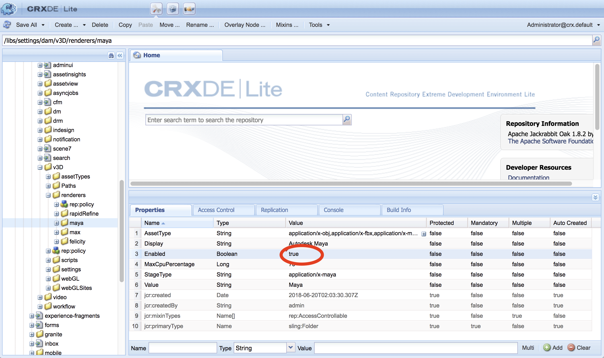
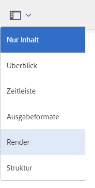

# Integration von AEM 3D mit Autodesk Maya {#integrating-aem-d-with-autodesk-maya}

>[!NOTE]
>
>Diese Aufgabe ist optional und nur unter Windows verfügbar.

Sie können optional AEM 3D mit Autodesk® Maya® Software integrieren, um die Unterstützung für native Maya-Dateien (`.MA` und `.MB`) zu aktivieren und 3D-Assets in AEM mit jedem verfügbaren Maya-Renderer wiederzugeben.

*Diese Integration gilt nur* für Windows.

Bei der Integration von Autodesk Maya müssen Sie Autodesk Maya installieren und konfigurieren, den Pfad zum Ordner mit den Maya-Programmdateien hinzufügen, Maya für Aufnahme und Rendering aktivieren und die Integration testen.

Siehe [Erweiterte Konfigurationseinstellungen](advanced-config-3d.md).

Siehe auch [Integration von AEM 3D mit AutoDesk 3ds Max](integrating-aem-3d-with-autodesk-3ds-max.md).

**So integrieren Sie Autodesk Maya in AEM 3D**:

1. Installieren Sie die Autodesk Maya 2016-Software auf denselben Servern, auf denen AEM gehostet wird.

   Vergewissern Sie sich nach der Installation, dass Sie Maya öffnen sowie verwenden können und keine Lizenzprobleme auftreten.

   >[!NOTE]
   >
   >AEM verwendet nur das Befehlszeilen-Rendering-Tool von Maya (`render.exe`). Mit einer einzelnen Maya-Netzwerklizenz können bis zu fünf Server gleichzeitig Maya-Inhalte verarbeiten oder rendern.

1. Aktivieren Sie in Maya das Autodesk FBX® Plug-In.
1. Installieren Sie das MentalRay-Render-Plug-in oder einen anderen gewünschten Renderer.

   Nach der Installation sollten Sie sicherstellen, dass MentalRay in Maya verfügbar ist.

1. Fügen Sie den Pfad zur ausführbaren Maya-Datei zur Windows-PATH-Umgebungsvariable hinzu.

   Tippen Sie beispielsweise unter Windows Server 2012 auf **[!UICONTROL Beginn] > [!UICONTROL Systemsteuerung] > [!UICONTROL System und Sicherheit] > [!UICONTROL  > [!UICONTROL Erweiterte Systemeinstellungen] > [!UICONTROL Umgebung-Variablen]**>. ] Hängen Sie den vollständigen Pfad zum Ordner `Maya2016\bin` an die Systemvariable `Path`an.

   

1. Um Maya für die Erfassung und Wiedergabe zu aktivieren, öffnen Sie **[!UICONTROL CRXDE Lite]** und navigieren Sie zu `/libs/settings/dam/v3D/assetTypes/maya` und setzen Sie die **[!UICONTROL Enabled]**-Eigenschaft auf `true`.

   

1. Um das JT-Dateiformat (Siemens PLM Open CAD) zu aktivieren, navigieren Sie zu `/libs/settings/dam/v3D/assetTypes/jt` und setzen Sie die **[!UICONTROL Enabled]**-Eigenschaft auf `true`.
1. Aktivieren Sie Maya in AEM Maya als Renderer. Navigieren Sie dazu zu **[!UICONTROL Tools > Allgemein > CRXDE Lite]**.
1. Navigieren Sie auf der Seite **[!UICONTROL CRXDE Lite]** im linken Bereich zu folgendem:

   `/libs/settings/dam/v3D/renderers/maya`

   

1. Setzen Sie die Eigenschaft **[!UICONTROL Aktiviert]** auf `true`.

1. Tippen Sie links oben auf der Seite **[!UICONTROL CRXDE Lite]** auf **[!UICONTROL Alle speichern]**.

   Maya ist nun als Renderer aktiviert.

## Testen der Integration von AEM 3D in Autodesk Maya {#testing-the-integration-of-aem-d-with-autodesk-maya}

1. Öffnen Sie AEM Assets und laden Sie dann die `.MA`-Dateien im Ordner `sample-3D-content/models` in den Ordner `test3d` hoch.

   Beachten Sie, dass `sample-3D-content.zip` zuvor zum Überprüfen der grundlegenden 3D-Funktionen heruntergeladen wurde.

1. Kehren Sie zur Ansicht **[!UICONTROL Card]** zurück und sehen Sie sich die Meldungsbanner an, die auf den hochgeladenen Assets angezeigt werden.

   Das Banner Konvertierungsformat wird angezeigt, während Maya das native Format `.MA` in `.FBX` konvertiert.

1. Nachdem die Verarbeitung abgeschlossen ist, öffnen Sie das `logo-sphere.ma`-Asset und wählen Sie die `stage-helipad.ma`-Phase aus.

   Das Erlebnis für die Vorschau ist dasselbe wie bei `logo_sphere.fbx` und `stage-helipad.fbx`.

1. Tippen Sie links oben auf der Seite auf die Dropdown-Liste oder klicken Sie darauf und wählen Sie **[!UICONTROL CRender]**.

   

1. Wählen Sie in der Dropdown-Liste **[!UICONTROL Renderer]** **[!UICONTROL Autodesk Maya]** und tippen Sie dann auf **[!UICONTROL Beginn Render]**.
1. Tippen Sie rechts oben auf der Seite auf oder klicken Sie auf **[!UICONTROL Schließen]**, um zur Ansicht **[!UICONTROL Card]** zurückzukehren.

   Beobachten Sie das Meldungsbanner auf dem Bild-Asset, das gerendert wird (`logo-sphere`, sofern kein anderer Bildname angegeben wurde). Ein Fortschrittsbalken auf dem Banner zeigt den Rendering-Fortschritt.

   >[!NOTE]
   >
   >Das Rendern ist sehr CPU-intensiv und kann einige Minuten dauern

1. Nachdem das Rendern abgeschlossen ist, öffnen Sie das gerenderte Bild-Asset.

   Vergewissern Sie sich, dass das gerenderte Bild dem Bild entspricht, das Sie zum Zeitpunkt des Klicks auf **[!UICONTROL Jetzt rendern]** angezeigt haben.

## Aktivieren zusätzlicher von Maya unterstützter Formate {#enabling-additional-formats-supported-by-maya}

(Optional) Maya unterstützt eine Reihe von 3D-Eingabeformaten, von denen jedes aktiviert werden kann, damit AEM den Dateityp erkennt. Wenn diese Option aktiviert ist, sendet AEM die Datei an Maya, um sie in ein Zwischenformat zu konvertieren, das direkt von AEM aufgenommen werden kann.

Je nach Format kann die Unterstützung für Funktionen eingeschränkt sein (z. B. werden Materialien nicht weitergegeben), und Qualität/Treue kann eingeschränkt sein (z. B. umgekehrte Gesichter). Adobe unterstützt nur den allgemeinen Mechanismus, jedoch keine bestimmte Formatkonversion.

Siehe [Unterstützte Datenimportformate | Maya](https://knowledge.autodesk.com/support/maya/learn-explore/caas/CloudHelp/cloudhelp/2016/ENU/Maya/files/GUID-69BC066D-D4D8-4B12-900C-CF42E798A5D6-htm.html) für Informationen über die von Maya unterstützten Formate.

**So aktivieren Sie weitere von AEM** unterstützte Formate:

1. Navigieren Sie mit **[!UICONTROL CRXDE Lite]** zu `/libs/settings/dam/v3D/assetTypes`.
1. Erstellen Sie eine Kopie des Knotens **[!UICONTROL jt]**. Klicken Sie mit der rechten Maustaste auf den Knoten **[!UICONTROL jt]** und wählen Sie **[!UICONTROL Kopieren]**. Klicken Sie dann mit der rechten Maustaste auf den Ordner **[!UICONTROL assetTypes]** und wählen Sie **[!UICONTROL Einfügen]**. Dadurch sollte ein neuer Knoten `/apps/cq-scene7-v3D/config/assetTypes/Copy of jt` erstellt werden.
1. Benennen Sie den neuen Knoten um. Wählen Sie hierbei einen Namen, der den hinzuzufügenden Dateityp beschreibt. Sie können das Dateisuffix oder eine beliebige andere eindeutige ID verwenden.

1. Legen Sie die Eigenschaft **[!UICONTROL Enabled]** des neuen Knotens auf `true` fest.

1. Legen Sie die Eigenschaft **[!UICONTROL Extension]** der neuen Notiz auf das Dateisuffix/die Erweiterung des hinzugefügten Formats fest.
1. Legen Sie die Eigenschaft **[!UICONTROL MimeType]** auf einen entsprechenden Wert fest. `application/x-` gefolgt vom Wert der  **** Extensionseigenschaft sollte für die meisten Dateitypen funktionieren.
1. Vergewissern Sie sich, dass die Eigenschaft **[!UICONTROL Konversion]** auf `fbx` und **[!UICONTROL IngestRegime]** auf `Maya` eingestellt ist.
1. Klicken Sie oben links auf der Seite auf **[!UICONTROL Alle speichern]**.

Im folgenden Screenshot wird ein hinzugefügtes Dateiformat veranschaulicht, wobei COLLADA DAE als Beispiel verwendet wird:

