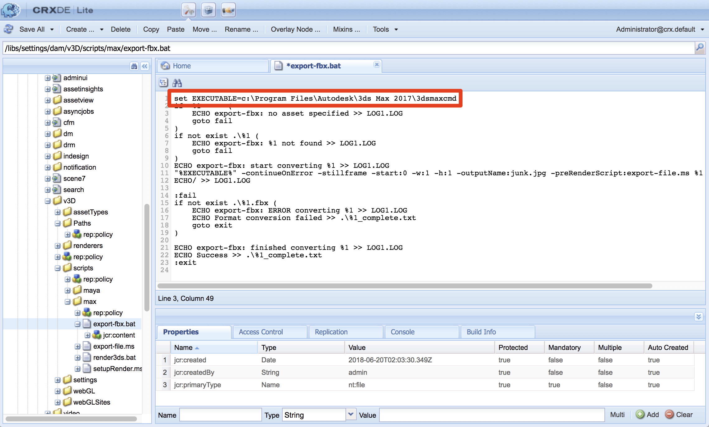

# Integration von AEM 3D mit Autodesk 3ds Max {#integrating-aem-d-with-autodesk-ds-max}

>[!NOTE]
>
>Diese Aufgabe ist optional und nur unter Windows verfügbar.

Sie können optional AEM 3D mit der Autodesk 3ds Max Software integrieren, um die Unterstützung für native 3ds Max-Dateien (.MAX) zu aktivieren. Das Rendering mittels 3ds Max wird derzeit nicht unterstützt.

Siehe [Erweiterte Konfigurationseinstellungen](advanced-config-3d.md).

Siehe auch [Integration von AEM 3D mit AutoDesk Maya](integrate-maya-with-3d.md).

**So integrieren Sie AEM 3D mit Autodesk 3ds Max**:

1. Installieren Sie die Autodesk 3ds Max-Software auf denselben Servern, auf denen AEM Author-Knoten installiert sind.

   Vergewissern Sie sich nach der Installation, dass Sie Maya öffnen sowie verwenden können und keine Lizenzprobleme auftreten.

   >[!NOTE]
   >
   >Um Probleme mit verweigertem Zugriff zu vermeiden, installieren Sie 3ds Max mit demselben Admin-Benutzerkonto wie AEM.

1. Klicken Sie in 3ds Max auf **[!UICONTROL Anpassen > Plug-in-Manager]**.

   Suchen Sie nach `FBXMAX.DLU` und vergewissern Sie sich, dass **[!UICONTROL Status]** **[!UICONTROL geladen]** ist.

   Schließen Sie die Dialogfelder **[!UICONTROL Plug-In-Manager]** und 3ds Max.

1. Aktualisieren Sie das Konvertierungsskript.

   AEM verwendet ein Befehlszeilenskript, um das Befehlszeilendienstprogramm `3dsmaxcmd.exe` von 3ds Max aufzurufen. Sie müssen dieses Skript bearbeiten, wenn Sie eine andere Version als 3ds Max 2016 installiert haben, oder wenn Sie 3ds Max an einem nicht standardmäßigen Speicherort installiert haben oder wenn Sie AEM auf einer anderen Partition oder einem anderen Laufwerk installiert haben.

   1. Öffnen Sie die CRXDE Lite und navigieren Sie zu `/libs/settings/dam/v3D/scripts/max`.
   1. Klicken Sie mit der Dublette auf `export-fbx.bat`, um es zu öffnen.
   1. Bearbeiten Sie die erste Zeile des Skripts nach Bedarf, um den Speicherort des Dienstprogramms `3dsmaxcmd.exe` anzuzeigen. Wenn beispielsweise 3ds Max 2017 verwendet wird und AEM auf einem anderen Festplattenlaufwerk installiert ist:

   

1. Tippen Sie links oben auf der Seite &quot;CRXDE Lite&quot;auf **[!UICONTROL Alle speichern]**.

   Tippen Sie links oben auf der Seite &quot;CRXDE Lite&quot;auf **[!UICONTROL Alle speichern]**.

1. Entfernen Sie den Arbeitsordner (nur erforderlich, wenn zuvor versucht wurde, eine .MAX-Datei zu erfassen).

   1. Navigieren Sie in CRXDE Lite zu `/libs/settings/dam/v3D/Paths/maxWorkPath`. Der Standardwert dieser Einstellung ist `./MaxWork`, was relativ zum AEM Installationsstammordner ist.
   1. Melden Sie sich beim Server selbst an und verwenden Sie den DateiExplorer, um zum AEM Installationsstammordner zu navigieren.
   1. Löschen Sie den Ordner **[!UICONTROL MaxWork]** einschließlich des gesamten Inhalts, falls vorhanden.

      Der Ordner wird automatisch neu erstellt, wenn eine .MAX-Datei das nächste Mal aufgenommen wird.

1. Aktivieren Sie &quot;3ds Max&quot;für die Erfassung, indem Sie folgende Schritte ausführen:

   1. Navigieren Sie in der CRXDE Lite zu `/libs/settings/dam/v3D/assetTypes/max` und setzen Sie die Eigenschaft **[!UICONTROL Enabled]** auf true:

   

1. Tippen Sie links oben auf der Seite &quot;CRXDE Lite&quot;auf **[!UICONTROL Alle speichern]**.

## Testen der Integration von AEM 3D mit Autodesk 3ds Max {#testing-the-integration-of-aem-d-with-autodesk-ds-max}

1. Öffnen Sie AEM Assets und laden Sie dann die Datei `.max` unter `sample-3D-content/models` in den Ordner **[!UICONTROL test3d]** hoch.

   Beachten Sie, dass sample-3D-content.zip zuvor zum Überprüfen der grundlegenden 3D-Funktionen heruntergeladen wurde.

1. Kehren Sie zur Ansicht **[!UICONTROL Card]** zurück und sehen Sie sich die Meldungsbanner an, die auf den hochgeladenen Assets angezeigt werden.

   Das Banner Konvertierungsformat wird angezeigt, während 3ds Max das native Format 3ds Max in .FBX konvertiert.

1. Nach Abschluss der Verarbeitung öffnen Sie `logo-sphere.max` in der Ansicht **[!UICONTROL Detail]**.

   Das Erlebnis für die Vorschau ist dasselbe wie bei `logo_sphere.fbx`.
