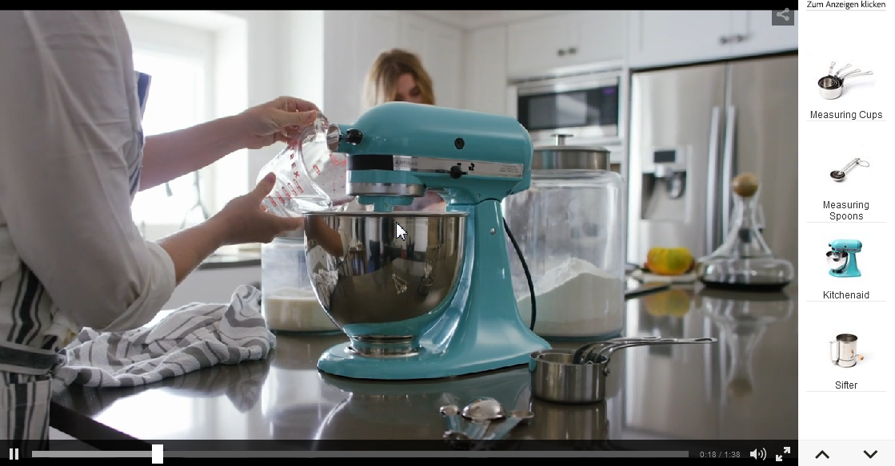
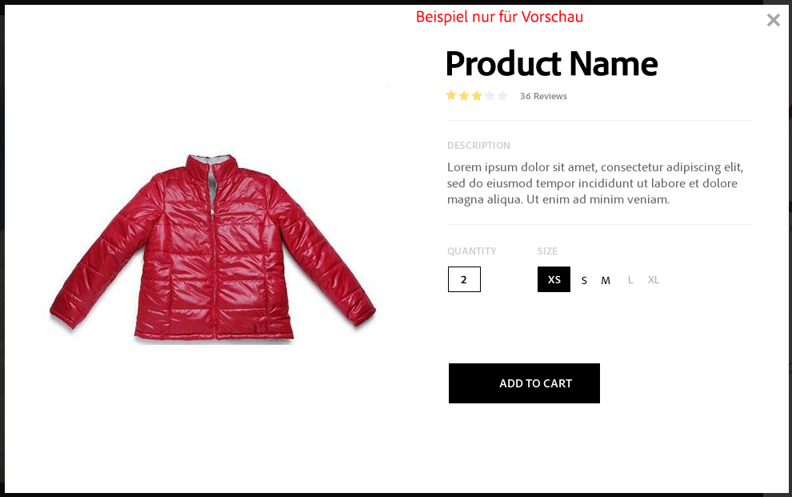
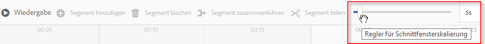
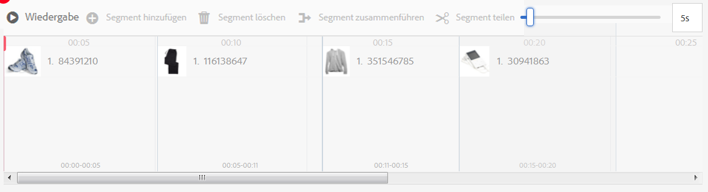
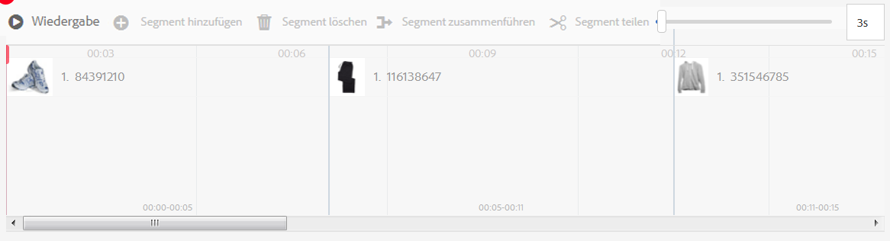
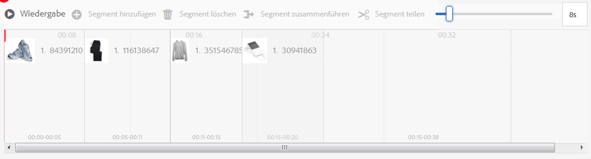
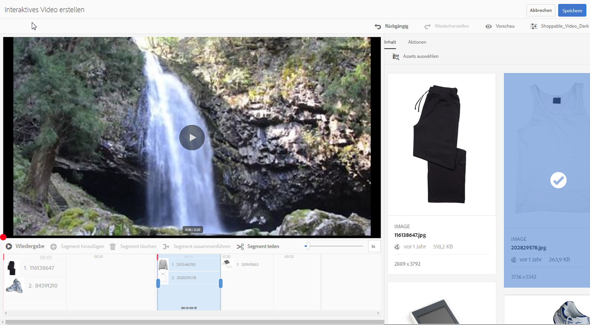
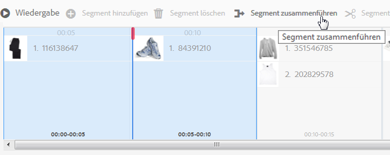
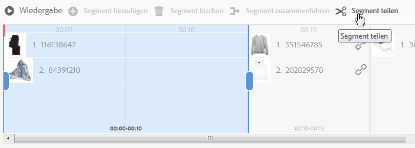

# Interaktive Videos {#interactive-videos}

Sie können interaktive Videos einfach erstellen, die direkt im Video den Abschluss unterstützen. Die Kundeninteraktion mit dem Video erfolgt in einem Feld neben dem Videoplayer, in dem die zugehörigen Services, Informationen oder Produktminiaturen auf Grundlage des Umfangs im Video per Bildlauf in die Ansicht einfließen. Kunden können auf die Miniatur tippen und werden direkt mit dem Service verbunden. Alternativ können sie den Artikel für den direkten Erwerb zu einem Warenkorb hinzufügen oder sie werden mit einer Web-Seite verbunden, um weitere Informationen zu erhalten.

Wenn das Video beendet wird, wird eine visuelle Zusammenfassung sämtlicher Angebote angezeigt, um den Aktionsaufruf zu unterstützen. Kunden haben eine weitere Möglichkeit, auf den gewünschten Artikel zu tippen. Umsetzbare und spezifische Erlebnisse wie diese erhöhen die Kundeninteraktion und Konversionen.

Informationen hierzu finden Sie auch unter [Interaktive Bilder](interactive-images.md).

## Interaktives Video in Aktion {#interactive-video-in-action}

Um ein interaktives Video mit Shopping-Funktion anzuzeigen, klicken Sie auf [Live-Demos](https://landing.adobe.com/en/na/dynamic-media/ctir-2755/live-demos.html), scrollen Sie zum **[!UICONTROL Shoppable Media]** auf der Seite klicken und dann auf das gewünschte Video klicken.

* Wenn während der Wiedergabe Produkte im Video verwendet werden, wird das gleiche Produkt auf der rechten Seite als Miniatur angezeigt.

* Klicken Sie auf die Miniaturansicht, wenn Sie das Video anhalten und die Schnellansicht des Produkts öffnen möchten. Sie können im Video beispielsweise auf die KitchenAid-Miniaturansicht klicken, um eine 360-Grad-Rotationsansicht des Küchengeräts anzuzeigen, oder vergrößern, um die Details des Mixers zu sehen.

<!-- There was a link here that showed the video frame of an interactive video and when the reader clicked the frame the video would play https://experienceleague.adobe.com/tools/dynamic-media-demo/shoppable-video/AXIS/index.html. This now needs to call a new interactive video-->

 *Ein Videobild, das aus einem interaktiven, Shop-fähigen Video erfasst wird.*

>[!NOTE]
>
>Wenn Sie ein interaktives Video erstellen, um eine Webseite zu starten, wenn ein Benutzer auf eine Miniaturansicht klickt, wird das Öffnen der Popup-Webseite durch einige Geräte blockiert. In diesen Fällen müssen Sie die Popup-Blocker-Einstellung auf dem Gerät ändern. Auf einem Apple iPhone 6 tippen Sie beispielsweise auf **[!UICONTROL Einstellungen]** > **Safari** > **Popups blockieren** und schieben Sie das Steuerelement auf **[!UICONTROL Aus]**. Wenn Sie ein interaktives Video wiedergeben und auf eine Miniaturansicht klicken, werden Sie gefragt, ob das Popup geöffnet werden soll. Wenn Sie dies akzeptieren, wird die Web-Seite geöffnet.

## Erstellen von interaktiven Videos {#watch-how-interactive-videos-are-created}

exemplarische Vorgehensweise [Erstellung interaktiver Videos](https://s7d5.scene7.com/s7viewers/html5/VideoViewer.html?videoserverurl=https://s7d5.scene7.com/is/content/&amp;emailurl=https://s7d5.scene7.com/s7/emailFriend&amp;serverUrl=https://s7d5.scene7.com/is/image/&amp;config=Scene7SharedAssets/Universal_HTML5_Video_social&amp;contenturl=https://s7d5.scene7.com/skins/&amp;asset=S7tutorials/InteractiveVideo) [](https://outv.omniture.com?v=s4NHQ2dzqd7hIqWjeG2sIdyNWsTWyupA). (7 Minuten, 30 Sekunden) Obwohl die Videoeinführung mit Assets on Demand gebrandmarkt ist, gelten die Prinzipien und Schritte weiterhin für interaktive Videos in Adobe Experience Manager Assets.

## Kundenerfolgs-Webinar von Adobe {#adobe-customer-success-webinar}

Im Webinar &quot;Using Interactive Video, Link Sharing, and YouTube sharing in Experience Manager Assets&quot;erfahren Sie, wie Sie interaktive Videos und andere Funktionen verwenden können, um konversionsgesteuerte Ereignisse mit Ihren Videomarketing-Inhalten zu verknüpfen.

>[!NOTE]
[Verwenden von interaktiven Videos, Linkfreigabe und YouTube-Freigabe in Experience Manager Assets](https://adobecustomersuccess.adobeconnect.com/p1yxzdo4aec/).

## Schnellstart: interaktive Videos {#quick-start-interactive-videos}

Die folgende schrittweise Workflow-Beschreibung soll Ihnen dabei helfen, interaktive Videos in Dynamic Media einzurichten und schnell auszuführen.

Suchen Sie nach der Überschrift **Beispiele** in einigen der Schnellstartaufgaben. Hier finden Sie ein kurzes Tutorial, das auf dieser Demo-Web-Seite basiert, der noch *keine* Interaktivität hinzugefügt wurde:

[https://experienceleague.adobe.com/tools/dynamic-media-demo/shoppable-video/john-lewis/landing-0.html?lang=de](https://experienceleague.adobe.com/tools/dynamic-media-demo/shoppable-video/john-lewis/landing-0.html?lang=de)

Die **Beispiele** veranschaulichen die Schritte zur Integration interaktiver Videos auf Ihrer Website.

Wenn Sie das Tutorial im letzten Beispiel abgeschlossen haben, sieht die finale Demowebseite mit den vollständig integrierten interaktiven Videos wie folgt aus:

[https://experienceleague.adobe.com/tools/dynamic-media-demo/shoppable-video/john-lewis/landing-3.html?lang=de](https://experienceleague.adobe.com/tools/dynamic-media-demo/shoppable-video/john-lewis/landing-3.html?lang=de)

**Interaktiver Video-Workflow:**

1. **(Optional) Ermitteln von Schnellansichtsvariablen**: Ermitteln Sie zunächst die dynamischen Variablen, die von der vorhandenen Schnellansichtsimplementierung verwendet werden. Mit den Variablen ordnen Sie Produktminiaturansichten der entsprechenden Produktschnellansicht zu, wenn Sie ein interaktives Video erstellen. Siehe [(Optional) Ermitteln von Schnellansichtsvariablen](#optional-identifying-quickview-variables).

   *Dieser Schritt ist nur erforderlich, wenn alle folgenden Bedingungen erfüllt sind*:

   * Sie möchten das Bild durch Auslösen von Schnellansichten in ein interaktives Video umwandeln.
   * Ihre Implementierung von Experience Manager *not* Verwenden Sie ein eCommerce-Integrations-Framework, um Produktdaten aus einer beliebigen eCommerce-Lösung wie IBM® WebSphere® Commerce, Elastic Path, hybris oder Intershop in den Experience Manager zu übernehmen. Siehe [eCommerce-Konzepte in Experience Manager Assets](/help/sites-administering/concepts.md).

1. **(Optional) Erstellen einer Viewer-Vorgabe für ein interaktives Video**: Passen Sie das Aussehen und Verhalten verschiedener Komponenten im Player an, beispielsweise den Video-Scrubber und die interaktiven Miniaturansichten.

   Die Erstellung einer eigenen Viewer-Vorgabe für ein interaktives Video ist nicht erforderlich, wenn Sie stattdessen die standardmäßig bereitgestellten Viewer-Vorgaben für interaktive Videos namens `Shoppable_Video_Light` oder `Shoppable_Video_Dark` verwenden möchten.
Siehe [Erstellen einer neuen Viewer-Vorgabe](managing-viewer-presets.md#creating-a-new-viewer-preset) (optional) und [Besondere Überlegungen bei der Erstellung einer interaktiven Viewer-Vorgabe](managing-viewer-presets.md#special-considerations-for-creating-an-interactive-viewer-preset).

1. **Hochladen eines Videos und der zugehörigen Bild-Assets**: Laden Sie ein Video und die zugehörigen Bilder hoch, die interaktiv sein sollen.

   Informationen hierzu finden Sie unter [Hochladen eines Videos und der zugehörigen Miniatur-Assets](#uploading-a-video-and-its-associated-thumbnail-assets).

1. **Hinzufügen von Interaktivität zum Video**: Fügen Sie dem Video mindestens ein Zeitsegment hinzu. Verknüpfen Sie dann Miniaturen mit diesen Zeitsegmenten. Weisen Sie jeder Miniatur eine Aktion wie einen Hyperlink, eine Schnellansicht oder ein Experience Fragment zu.

   (Die URL-basierte Verknüpfungsmethode ist nicht möglich, wenn Ihr interaktiver Inhalt über Links mit relativen URLs verfügt, insbesondere über Links zu Seiten in Adobe Experience Manager Sites.)

   Schließen Sie den Vorgang ab, indem Sie die interaktiven Video-Assets veröffentlichen. Durch das Veröffentlichen wird der Integrations-Code oder die URL erstellt, die Sie schließlich kopieren und auf die Landingpage Ihrer Website anwenden. Informationen hierzu finden Sie unter [Hinzufügen von Interaktivität zum Video](#adding-interactivity-to-your-video).

   Siehe [Veröffentlichen von Assets](publishing-dynamicmedia-assets.md).

1. **Hinzufügen eines interaktiven Videos zu Ihrer Website oder zu Ihrer Website in Experience Manager**

   Wenn Sie Experience Manager Sites, Experience Manager eCommerce oder beides verwenden, können Sie das interaktive Video direkt zu einer Web-Seite in Experience Manager hinzufügen, indem Sie die interaktive Medienkomponente auf die Seite ziehen. Siehe [Hinzufügen von Dynamic Media-Assets zu Seiten](adding-dynamic-media-assets-to-pages.md).

   Verwenden Sie den Einbettungs-Code oder die URL, um das interaktive Video in Ihr Website-Erlebnis zu integrieren. Siehe [Integrieren eines interaktiven Videos auf Ihrer Website](#integrating-an-interactive-video-with-your-website).

   Wenn Sie einen Drittanbieter-WCM (Web Content Manager) verwenden, müssen Sie das neue interaktive Video in die vorhandene Schnellansichtsimplementierung integrieren, die auf Ihrer Website verwendet wird. Siehe [Integrieren eines interaktiven Videos in einer Schnellansicht](#integrating-an-interactive-video-with-an-existing-quickview).

## (Optional) Ermitteln von Schnellansichtsvariablen {#optional-identifying-quickview-variables}

>[!NOTE]
Diese Aufgabe ist nur erforderlich, wenn Folgendes zutrifft:
* Sie möchten das Bild durch Auslösen von Schnellansichten in ein interaktives Video umwandeln.
* Ihre Implementierung von Experience Manager *not* Verwenden Sie ein eCommerce-Integrations-Framework, um Produktdaten aus einer beliebigen eCommerce-Lösung wie IBM® WebSphere® Commerce, Elastic Path, hybris oder Intershop in den Experience Manager zu übernehmen. Siehe [eCommerce-Konzepte in Experience Manager Assets](/help/sites-administering/concepts.md).
Wenn Ihre Experience Manager-Implementierung E-Commerce nutzt, können Sie diese Aufgabe überspringen und mit der nächsten Aufgabe fortfahren.

Ermitteln Sie zunächst die durch Ihre vorhandene Schnellansichtsimplementierung verwendeten dynamischen Variablen, damit Sie die Produktminiaturen während des Erstellungsvorgangs des interaktiven Videos der entsprechenden Produktschnellansicht zuordnen können.

Beim Hinzufügen von Zeitsegmenten zu einem Video weisen Sie jeder Miniatur, die Sie zu einem Segment hinzufügen, eine Artikelnummer (Stock Keeping Unit, SKU) und zusätzliche Variablen hinzu. Solche Variablen werden später verwendet, um das richtige Schnellansichtsprodukt anzuzeigen.

Es ist wichtig, entsprechend zu ermitteln, welche Variablen erforderlich sind, um eine Produktschnellansicht eindeutig auszulösen.

Manchmal ist es ausreichend, die IT-Experten zu konsultieren, die für Ihre vorhandene Schnellansichtsimplementierung verantwortlich sind. Sie wissen wahrscheinlich, welcher Mindestsatz an Daten erforderlich ist, um die Schnellansicht im System zu identifizieren. Es ist jedoch auch möglich, einfach das vorhandene Verhalten des Frontend-Codes zu analysieren.

Bei den meisten Schnellansichtsimplementierungen wird das folgende Muster verwendet:

* Benutzer aktiviert ein Benutzeroberflächenelement auf der Website. Beispiel: Klicken auf eine **[!UICONTROL Schnellansicht]** Schaltfläche.
* Die Website sendet eine Ajax-Anfrage an das Backend, um bei Bedarf die Schnellansichtsdaten oder -inhalte zu laden.
* Die Schnellansichtsdaten werden in den Inhalt übersetzt, um für das Rendern auf der Web-Seite vorbereitet zu werden.
* Schließlich zeigt der Frontend-Code diesen Inhalt visuell auf dem Bildschirm an.

Dann werden unterschiedliche Bereiche der vorhandenen Website besucht, auf denen die Schnellansichtsfunktion implementiert wird, die Schnellansicht wird ausgelöst und die Ajax-URL, die durch die Web-Seite zum Laden der Schnellansichtsdaten oder -inhalte gesendet wurde, wird erfasst.

Normalerweise müssen Sie keine speziellen Debugging-Tools verwenden. Moderne Webbrowser verfügen über Web-Inspektoren, die dafür ausreichend sind. Die folgenden Webbrowser beispielsweise umfassen Web-Inspektoren:

* Um alle ausgehenden HTTP-Anforderungen in Google Chrome anzuzeigen, verwenden Sie den Tastaturbefehl `F12` (Windows) oder `Command + Options + I` (Mac), um die **[!UICONTROL Entwicklertools]** und klicken Sie dann auf **[!UICONTROL Netzwerk]** Registerkarte.

* In Mozilla Firefox können Sie das Firebug-Plug-in über den Tastaturbefehl aktivieren `F12` (Windows) oder `Command + Options + I` (Mac) und verwenden Sie dessen **[!UICONTROL Net]** oder Sie können das integrierte Inspektor-Tool und dessen Registerkarte &quot;Netzwerk&quot;verwenden.

* In Internet Explorer aktivieren Sie das Debugger-Tool, indem Sie `F12` drücken.

Wenn die Netzwerküberwachung im Browser aktiviert ist, lösen Sie die Schnellansicht auf der Seite aus.

Suchen Sie nun die Schnellansichts-Ajax-URL im Netzwerkprotokoll und kopieren Sie die aufgezeichnete URL für die zukünftige Analyse. Normalerweise werden beim Trigger der Schnellansicht zahlreiche Anfragen an den Server gesendet. In der Regel ist die Schnellansichts-Ajax-URL die erste URL in der Liste. Sie weist einen Teil oder Pfad mit einer komplexen Abfragezeichenfolge auf und ihr MIME-Typ lautet entweder `text/html`, `text/xml` oder `text/javascript`.

Während dieses Vorgangs müssen Sie verschiedene Bereiche der Website mit verschiedenen Produktkategorien und -typen besuchen. Grund dafür ist, dass Schnellansichts-URLs möglicherweise Teile aufweisen, die für eine bestimmte Website-Kategorie häufig vorkommen, sich aber nur ändern, wenn Sie einen anderen Bereich der Website besuchen.

Im einfachsten Fall ist der einzige variable Teil der Schnellansichts-URL die Produkt-SKU. In diesem Fall ist der Wert der Produkt-SKU der einzige Teil der Daten, der zum Hinzufügen von Miniaturen zu einem Zeitintervall im interaktiven Video in Experience Manager benötigt wird.

In komplexen Fällen verfügt die Schnellansichts-URL jedoch zusätzlich zur Produkt-SKU über verschiedene Elemente, z. B. Kategorie-ID und Farbcode. In solchen Fällen wird jedes dieser Elemente zu einer separaten Variablen bei der Definition der Daten für die Miniatur in Experience Manager.

Nachfolgend finden Sie einige Beispiele für Schnellansichts-URLs und die resultierenden Miniatursvariablen:

<table> 
     <tbody> 
      <tr> 
       <td><p>Einzelne SKU, befindet sich in der Abfragezeichenfolge.</p> </td> 
       <td><p>Die aufgezeichneten Schnellansichts-URLs enthalten Folgendes:</p> 
        <ul> 
         <li><p><code>https://server/json?productId=866558&amp;source=100</code></p> </li> 
         <li><p><code>https://server/json?productId=1196184&amp;source=100</code></p> </li> 
         <li><p><code>https://server/json?productId=1081492&amp;source=100</code></p> </li> 
         <li><p><code>https://server/json?productId=1898294&amp;source=100</code></p> </li> 
        </ul> <p>Der einzige variable Teil der URL ist der Wert des Abfrageparameters <code>productId=</code> und es ist offensichtlich ein SKU-Wert. Daher müssen nur die SKU-Felder der Miniaturen mit Werten wie <strong><code>866558</code></strong>, <strong><code>1196184</code></strong>, <strong><code>1081492</code></strong> und <strong><code>1898294</code></strong> ausgefüllt werden.</p> </td> 
      </tr> 
      <tr> 
       <td><p>Einzelne SKU, befindet sich im URL-Pfad.</p> </td> 
       <td><p>Die aufgezeichneten Schnellansichts-URLs enthalten Folgendes:</p> 
        <ul> 
         <li><p><code>https://server/product/6422350843</code></p> </li> 
         <li><p><code>https://server/product/1607745002</code></p> </li> 
         <li><p><code>https://server/product/0086724882</code></p> </li> 
        </ul> <p>Der variable Teil befindet sich im letzten Abschnitt des Pfads und wird zum SKU-Wert der Experience Manager-Miniaturen: <strong><code>6422350843</code></strong>, <strong><code>1607745002</code></strong>, <strong><code>0086724882</code></strong>.</p> </td> 
      </tr> 
      <tr> 
       <td><p>SKU und Kategorie-ID in der Abfragezeichenfolge.</p> </td> 
       <td><p>Die aufgezeichneten Schnellansichts-URLs enthalten Folgendes:</p> 
        <ul> 
         <li><p><code>https://server/quickView/product/?category=1100004&amp;prodId=305466</code></p> </li> 
         <li><p><code>https://server/quickView/product/?category=1100004&amp;prodId=310181</code></p> </li> 
         <li><p><code>https://server/quickView/product/?category=1740148&amp;prodId=308706</code></p> </li> 
        </ul> <p>In diesem Fall liegen zwei abweichende Teile in der URL vor. Die SKU wird im Parameter <code>prodId</code> gespeichert, während die Kategorie-ID im Parameter <code>category=</code> gespeichert wird.</p> <p>Bei den Definitionen für Miniaturen selbst handelt es sich um Paare. Also einen SKU-Wert und eine zusätzliche Variable mit dem Namen <code>categoryId</code>. Die resultierenden Paare lauten wie folgt:</p> 
        <ul> 
         <li>Die SKU lautet <code>305466</code> und <code>categoryId</code> lautet <code>1100004</code></li> 
         <li>Die SKU lautet <code>310181</code> und <code>categoryId</code> lautet <code>1100004</code></li> 
         <li>Die SKU lautet <code>308706</code> und <code>categoryId</code> lautet <code>1740148</code></li> 
        </ul> <p> </p> </td> 
      </tr> 
     </tbody> 
    </table> </td> 
  </tr> 
  <tr>
</table>

**Beispiel**

Wenn der oben genannte Ansatz auf die Beispiel-Website angewendet wird, haben Sie eine Webseite mit mehreren Produktminiaturansichten, von denen jede eine **[!UICONTROL MEHR DAZU]** Schaltfläche:

[https://experienceleague.adobe.com/tools/dynamic-media-demo/shoppable-video/john-lewis/landing-0.html?lang=de](https://experienceleague.adobe.com/tools/dynamic-media-demo/shoppable-video/john-lewis/landing-0.html)

Nachdem Sie alle Produktschnellansichten auf der Seite aktiviert haben, erhalten Sie die folgende Liste mit den an das Backend gesendeten Schnellansichtsanfragen:

* datafeed/candles-233396346.json
* datafeed/candles-233978050.json
* datafeed/candles-234024346.json
* datafeed/candles-234024356.json
* datafeed/candles-234024359.json
* datafeed/cushions-233939848.json
* datafeed/cushions-234019477.json
* datafeed/cushions-234019483.json
* datafeed/furniture-231747479.json
* datafeed/furniture-232625621.json
* datafeed/furniture-232625626.json
* datafeed/furniture-233939810.json
* datafeed/furniture-233939825.json
* datafeed/furniture-233939828.json
* datafeed/furniture-233939853.json
* datafeed/furniture-233940334.json
* datafeed/glassware-000064007.json
* datafeed/glassware-230722193.json
* datafeed/glassware-233916550.json
* datafeed/glassware-233916597.json

Wenn Sie sich die Server-Aufrufe ansehen, sehen Sie, dass produktspezifische Informationen nur im Anfragepfad vorhanden sind. Beachten Sie außerdem, dass die Abfragezeichenfolge überhaupt nicht verwendet wird und zwei unterschiedliche Typen von Datenteilen beteiligt sind:

* Beim ersten Typ handelt es sich um Kerzen, Kissen, Möbel und Glaswaren. Dies kann als „Produktkategorie“ bezeichnet werden.
* Der zweite Typ ist der Produkt-Code, wie beispielsweise „233916597“. Sie können davon ausgehen, dass dies die „Produkt-SKU“ ist.

Mit diesen Informationen hat die gesamte Schnellansichts-URL das folgende Muster:

`/datafeed/$categoryId$-$SKU$.json`

Basierend auf dieser Analyse stellen Sie fest, dass Sie die beiden folgenden Variablen für die Miniaturen verwenden können: `categoryId` und `SKU`.

Sie können jetzt ein Video und die zugehörigen Miniatur-Assets hochladen.

## (Optional) Erstellen einer Viewer-Vorgabe für ein interaktives Video {#optional-creating-an-interactive-video-viewer-preset}

Sie können diese Aufgabe überspringen und mit der nächsten fortfahren, wenn Sie eine der standardmäßigen Viewer-Vorgabentypen für interaktive Videos verwenden möchten, die als `Shoppable_Video_dark` oder `Shoppable_Video_light`.

Wenn in der Authoring-Umgebung auf eine Miniaturansicht geklickt wird, eine Vorschau der **[!UICONTROL Schnellansicht]** angezeigt.



Optional können Sie eine eigene benutzerdefinierte Viewer-Vorgabe für ein interaktives Video erstellen. Sie können unter anderem den Stil des Video-Players, die interaktiven Miniaturen und die Miniatur-Rasteransicht, die am Ende des Videos angezeigt wird, bestimmen.

Eine Viewer-Vorgabe für interaktive Videos rendert das Video entsprechend sowie alle Zeitleistensegmente, die Sie hinzugefügt haben. Außerdem wird eine standardmäßige Beispielschnellansicht verwendet, wenn Sie auf eine Produktminiatur in **[!UICONTROL Vorschau]** -Modus, damit Sie die Interaktivität vor der Veröffentlichung testen können.

Nachdem Sie die Viewer-Vorgabe gespeichert haben, wird ihr Status automatisch auf der Seite „Viewer-Vorgaben“ auf **[!UICONTROL Ein]** festgelegt. Dieser Status bedeutet, dass sie in der Komponente „Dynamische Medien“ sichtbar ist und immer dann, wenn Sie die Vorschau eines Videos damit anzeigen. **** Denken Sie daran, die neue Viewer-Vorgabe auch manuell zu veröffentlichen.

Siehe [Erstellen einer neuen Viewer-Vorgabe](managing-viewer-presets.md#creating-a-new-viewer-preset), um eine eigene Viewer-Vorgabe für interaktive Videos zu erstellen.

## Hochladen eines Videos und der zugehörigen Miniatur-Assets {#uploading-a-video-and-its-associated-thumbnail-assets}

Wenn Sie Ihr Video und die Miniaturansicht-Assets bereits hochgeladen haben, fahren Sie mit dem Schritt [Hinzufügen von Interaktivität zum Video](#adding-interactivity-to-your-video) fort.

Wenn Sie falsche Videos oder Bilder hochgeladen haben oder Sie nicht mehr benötigte hochgeladene Videos oder Bilder löschen möchten, finden Sie weitere Informationen unter [Löschen von Assets](managing-assets-touch-ui.md#deleting-assets).

**So laden Sie ein Video und die zugehörigen Miniatur-Assets hoch:**

1. Laden Sie das Video und die zugehörigen Miniatur-Assets in den bzw. die gewünschten Ordner hoch.

   Informationen hierzu finden Sie unter [Hochladen von Assets](managing-assets-touch-ui.md).

   Informationen hierzu finden Sie im Thema über das [Hochladen von Assets mithilfe der FTP-Auftragsplanung](managing-assets-touch-ui.md).

   Fügen Sie Ihrem Video nun Interaktivität hinzu.

## Hinzufügen von Interaktivität zum Video {#adding-interactivity-to-your-video}

Sie fügen einem Video mithilfe des integrierten visuellen Editors auf der Seite „Interaktives Video erstellen“ Zeitleistensegmente hinzu.

Nach dem Hinzufügen von Zeitleistensegmenten fügen Sie Miniaturbilder in jedem Segment hinzu. Für jede von Ihnen hinzugefügte Miniatur wenden Sie eine Aktion darauf an. Beispielsweise können Sie eine Schnellansicht auf die Miniatur anwenden. Alternativ können Sie ihr einen Hyperlink oder ein Experience Fragment zuweisen.

Weitere Informationen finden Sie unter [Experience Fragments](/help/sites-authoring/experience-fragments.md).

>[!NOTE]
Die URL-basierte Verknüpfungsmethode ist nicht möglich, wenn Ihr interaktiver Inhalt über Links mit relativen URLs verfügt, insbesondere über Links zu Seiten in Adobe Experience Manager Sites.

**[!UICONTROL Die Optionen „Rückgängig“ und „Wiederholen“ in der Nähe der oberen rechten Ecke der Seite werden während der aktuellen Erstellungs-/Bearbeitungssitzung unterstützt.]******

Nachdem Sie Ihr interaktives Video gespeichert haben, wird das Video sofort in der Vorschau geöffnet. Hier können Sie die Viewer-Vorgabe für interaktive Videos auswählen und das Video wiedergeben, um die ungefähre Darstellung anzuzeigen, wie es Kunden angezeigt wird.

**So fügen Sie Ihrem Video Interaktivität hinzu:**

1. Navigieren Sie in der Ansicht „Assets“ zum Video, das Sie hochgeladen haben und interaktiv machen möchten.
1. Führen Sie einen der folgenden Schritte aus:

   * Bewegen Sie den Mauszeiger über das Bild und tippen Sie auf **[!UICONTROL Auswählen]** (Häkchensymbol). Tippen Sie in der Symbolleiste auf **[!UICONTROL Bearbeiten]**.
   * Bewegen Sie den Mauszeiger über dem Bild und tippen Sie dann auf **[!UICONTROL Mehr Aktionen]** (Ellipsensymbol) > **[!UICONTROL Bearbeiten]**.
   * Tippen Sie auf das Bild, damit Sie es auf der Seite &quot;Detailansicht&quot;öffnen können. Tippen Sie in der Symbolleiste auf **[!UICONTROL Bearbeiten]**.

1. Im **[!UICONTROL Interaktives Video erstellen]** -Seite, führen Sie einen der folgenden Schritte aus:

   * Tippen Sie auf **[!UICONTROL Play]** -Schaltfläche, damit Sie das Video wiedergeben können. Wenn bestimmte Produkte, Services oder Einzelheiten, die Sie hervorheben möchten, in der Ansicht angezeigt werden, tippen Sie in der Symbolleiste auf **[!UICONTROL Segment hinzufügen]**. Wiederholen Sie den Vorgang, bis Sie das Ende des Videos erreicht haben.

      Weisen Sie jedem hinzugefügten Zeitsegment ein oder mehrere Miniaturansichten zu und verknüpfen Sie diese Miniaturansichten dann mit Schnellansichtsproduktseiten, auf denen Kunden Einkäufe tätigen können, oder mit Webseiten für weitere Informationen.

   * Tippen Sie auf **[!UICONTROL Play]** -Schaltfläche, damit Sie das Video wiedergeben können. Wenn bestimmte Produkte, Services oder Einzelheiten, die Sie hervorheben möchten, in der Ansicht angezeigt werden, tippen Sie auf **[!UICONTROL Pause]**. Tippen Sie auf **[!UICONTROL Segment hinzufügen]**.

      Fahren Sie mit dem Wiedergeben und Anhalten des Videos an den Punkten entlang der Zeitleiste fort, an denen Sie ein Segment hinzufügen möchten, bis Sie das Ende des Videos erreicht haben.

1. (Optional) Ziehen Sie die Leiste auf dem **[!UICONTROL Regler für die Zeitleistenskalierung]** nach links, um die Ansicht zu vergrößern, oder nach rechts, um sie zu verkleinern. Auf diese Weise steuern Sie, wie viele Details der hinzugefügten Segmente angezeigt werden.

   

   Je nach Länge des Videos wird die **[!UICONTROL Segmentdauer]** verwendet standardmäßig die folgenden Werte:

   <table> 
    <tbody> 
      <tr> 
      <td><strong>Videolänge</strong></td> 
      <td><strong>Standardwert für die Segmentdauer</strong></td> 
      </tr> 
      <tr> 
      <td>3 Minuten oder mehr</td> 
      <td>60 Sekunden</td> 
      </tr> 
      <tr> 
      <td>2–3 Minuten</td> 
      <td>30 Sekunden</td> 
      </tr> 
      <tr> 
      <td>1-2 Minuten</td> 
      <td>20 Sekunden<br /> </td> 
      </tr> 
      <tr> 
      <td>30–60 Sekunden</td> 
      <td>10 Sekunden</td> 
      </tr> 
      <tr> 
      <td>maximal 30 Sekunden</td> 
      <td>5 Sekunden</td> 
      </tr> 
    </tbody> 
   </table>

   Die Zeitleiste des Videos beansprucht so viel Platz auf dem Bildschirm, wie für sie verfügbar ist. Wenn Sie daher die Größe des Browsers ändern, behalten die hinzugefügten Segmente ihre korrekte Breite bei.

   Dies wird durch die folgenden drei Screenshots veranschaulicht, die auf demselben Video basieren. Beachten Sie, dass sich die Breite jedes Segments je nach **[!UICONTROL Zeitleistenskalierung]** -Einstellung.

   

   Screenshot A

   Screenshot A oben zeigt die Standardansicht eines 29 Sekunden langen Produktvideos. Die **[!UICONTROL Zeitleistenskalierung]** auf den Standardwert von 5 Sekunden eingestellt ist.

   

   Screenshot B

   Im Screenshot B oben wird die **[!UICONTROL Zeitleistenskalierung]** wurde vom Standardwert von 5 Sekunden auf 3 Sekunden gezogen. Beachten Sie, dass die Person **[!UICONTROL Zeitleistenskalierung]** Zeitstempel sind nun alle in Intervallen von 3 Sekunden eingestellt.

   

   Screenshot C

   Im Screenshot C oben wird die **[!UICONTROL Zeitleistenskalierung]** wurde auf 8 Sekunden verschoben. Beachten Sie, wie die Segmente, die Produktminiaturen enthalten, verkleinert wurden. Ein solches „Herauszoomen“ ist bei langen Videos sinnvoll, um eine Übersicht über mehrere Segmente zu erhalten, die normalerweise auf die Breite einer Seite passen.

1. (Optional) Führen Sie einen der folgenden Schritte aus:

   * So passen Sie die Start- und Endzeit eines Segments an:

      Wählen Sie ein Segment und ziehen Sie das blaue ovale Symbol am Anfang oder Ende, um die Zeit für den Beginn bzw. das Ende anzupassen. Der angezeigte Videoframe wechselt auf Grundlage Ihrer Anpassungen zur entsprechenden Zeit im Video. Die Verschiebung des Zeitleistensegments ist auf Grundlage der benachbarten Segmente in der Zeitleiste beschränkt. Die minimal zulässige Segmentzeit lautet eine Sekunde.

      Verwenden Sie die folgenden Navigationsverknüpfungen, um Ihre Videosegmente schnell zu überprüfen und zu optimieren:

      * Tippen Sie auf das blaue Oval am Anfang, wenn Sie das Video direkt am Anfang dieses Segments suchen möchten.
      * Tippen Sie auf das blaue oval am Ende, wenn Sie das Video direkt am Ende dieses Segments suchen möchten.
      * Tippen Sie auf das gesamte Segment, wenn Sie die Videowiedergabe zum Anfang dieses Segments zurückgeben möchten

   

   Neupositionierung des Endes eines Zeitleistensegments

   * So löschen Sie ein Segment:

      Wählen Sie das letzte Zeitleistensegment und tippen Sie dann in der Symbolleiste auf **[!UICONTROL Segment löschen]**. Wenn zwei oder mehr Segmente ausgewählt sind, wird die **[!UICONTROL Segment löschen]** -Funktion deaktiviert ist.

      Sie können nur das letzte Segment löschen. Wenn Sie beispielsweise alle Zeitleistensegment-Segmente löschen möchten, müssen Sie immer zunächst das letzte auswählen und dann auf **[!UICONTROL Segment löschen]** tippen.


1. Wählen Sie ein Zeitsegment aus, mit dem Sie das oder die Miniaturbild(er) verknüpfen möchten.
1. Tippen Sie auf der rechten Seite des Videos auf die Registerkarte **[!UICONTROL Inhalt]**.
1. Unter dem **[!UICONTROL Inhalt]** Registerkarte, tippen **[!UICONTROL Auswählen von Assets]**, durchsuchen und wählen Sie dann alle Bild-Assets aus, die Sie mit Ihrem Video verwenden möchten. Die ausgewählten Assets werden zum **[!UICONTROL Asset-Auswahl]** -Bedienfeld in **[!UICONTROL Inhalt]** Registerkarte.

1. In der Asset-Auswahl auf der Registerkarte „Inhalt“ gehen Sie wie folgt vor:

   <table> 
    <tbody> 
      <tr> 
      <td>So verknüpfen Sie eine Miniatur mit einem ausgewählten Zeitleistensegment-Segment</td> 
      <td><p>Tippen Sie auf das Bild im Asset-Auswahlbereich auf der rechten Seite.</p> <p>Sie können so viele Miniaturen hinzufügen, wie in einem Zeitleistensegment-Segment vorhanden sein sollen. Für jedes von Ihnen ausgewählte Bild wird ein Häkchen über dem Bild in der Asset-Auswahl angezeigt.</p> </td> 
      </tr> 
      <tr> 
      <td>So entfernen Sie eine Miniatur aus dem ausgewählten Zeitleistensegment-Segment</td> 
      <td><p>Führen Sie einen der folgenden Schritte aus:</p> 
        <ul> 
        <li>Tippen Sie im Asset-Auswahlbereich auf ein Bild mit einem Häkchen, um seine Auswahl aufzuheben. Das Bild-Asset wird aus dem Zeitleistensegment-Segment entfernt.<br /> </li> 
        <li>Tippen Sie in einem ausgewählten Zeitleistensegment-Segment auf ein Bild und tippen Sie dann in der Symbolleiste auf <strong>Produkt löschen</strong>.</li> 
        </ul> </td> 
      </tr> 
    </tbody> 
   </table>

   

   Durch Tippen wird ein Bild in einem Asset-Auswahlbereich dem ausgewählten Zeitleistensegment-Segment hinzugefügt.

1. Wählen Sie ein einzelnes Miniaturbild in einem der Zeitleistensegment-Segmente und tippen Sie dann auf die Registerkarte **[!UICONTROL Aktionen]**.
1. Führen Sie einen der folgenden Schritte aus:
   <table> 
    <tbody> 
      <tr> 
      <td>So verknüpfen Sie das ausgewählte Miniaturbild mit einer Schnellansicht:</td> 
      <td><p>Tippen Sie unter „Aktionstyp“ auf <strong>Schnellansicht</strong>.</p> <p>Wenn Sie ein Experience Manager Sites- und E-Commerce-Kunde sind, gehen Sie wie folgt vor:</p> 
       <ul> 
       <li>Beachten Sie, dass das Textfeld "SKU-Wert"mit der SKU (Stock Keeping Unit, Bestandseinheit) des ausgewählten Produkts vorausgefüllt ist. Hierbei handelt es sich um eine eindeutige Kennung für jedes von Ihnen angebotene Produkt oder Service. Dieses Feld wird automatisch ausgefüllt, wenn das Bild mit einem Produkt in Experience Manager Commerce verknüpft ist.</li> 
       <li>Wenn die vorausgefüllte SKU falsch ist, tippen oder klicken Sie auf das Produktauswahlsymbol (Lupe), um die Seite „Produkt wählen“ zu öffnen. Tippen oder klicken Sie auf das Produkt, das Sie verwenden möchten, und tippen Sie dann oben rechts auf der Seite auf das Häkchen, damit Sie zum interaktiven Video-Editor zurückkehren können.</li> 
       </ul> <p> Wenn Sie <em>kein</em> Experience Manager Sites- oder E-Commerce-Kunde sind, gehen Sie wie folgt vor:</p> 
       <ul> 
       <li>Siehe <a href="/help/assets/carousel-banners.md#identifying-hotspot-and-image-map-variables">Ermitteln von Hotspot-Variablen</a>. Sie müssen diese Variablen definieren. </li> 
       <li>Standardmäßig verwendet dieses SKU-Feld den Dateinamen des Bild-Assets ohne Erweiterung. Wenn Sie eine standardmäßige Namenskonvention für Ihre Dateien auf der Grundlage der SKU befolgen, sind für diese Dateien in der Regel keine zusätzlichen Änderungen erforderlich. </li> 
       <li>Bearbeiten Sie andernfalls den Standardwert und geben Sie den korrekten SKU-Wert ein. Geben Sie im Textfeld „SKU-Wert“ die Bestandseinheit (Stock Keeping Unit, SKU) des Produkts ein. Hierbei handelt es sich um eine eindeutige Kennung für die jeweiligen von Ihnen angebotenen Produkte oder Services. Der variable Teil der Schnellansichtsvorlage wird automatisch mit dem eingegebenen SKU-Wert ausgefüllt, sodass das System den Hotspot, auf den getippt wird, mit der Schnellansicht einer bestimmten SKU verbinden kann.</li> 
       </ul> <p>(Optional) Wenn andere Variablen in der Schnellansicht vorhanden sind, die Sie zur weiteren Identifizierung eines Produkts verwenden müssen, tippen Sie auf <strong>Generische Variable hinzufügen</strong>. Geben Sie im Textfeld eine zusätzliche Variable an. Beispielsweise ist <code>category=Womens</code> eine hinzugefügte Variable.</p> <p> </p> </td> 
      </tr> 
      <tr> 
      <td>So verknüpfen Sie das ausgewählte Miniaturbild mit einem Hyperlink</td> 
      <td><p>Tippen Sie unter „Aktionstyp“ auf <strong>Hyperlink</strong> und führen Sie dann einen der folgenden Schritte aus:</p> 
       <ul> 
       <li>Wenn Sie Experience Manager Sites-Kunde sind, tippen Sie auf das Symbol zur Site-Auswahl (Ordner), um zu einer Web-Seite zu navigieren. Die URL-basierte Verknüpfungsmethode ist nicht möglich, wenn Ihr interaktiver Inhalt über Links mit relativen URLs verfügt, insbesondere über Links zu Seiten in Adobe Experience Manager Sites.</li> 
       <li>Wenn Sie nur Dynamic Media verwenden, geben Sie im Textfeld „HREF“ den vollständigen URL-Pfad zu einer verknüpften Web-Seite an.</li> 
       </ul> <p>Stellen Sie sicher, dass Sie angeben, ob Sie den Link in einem neuen Browser oder auf der aktuellen Registerkarte öffnen möchten.</p> </td> 
      </tr> 
      <tr> 
      <td>So verknüpfen Sie das ausgewählte Miniaturbild mit einem Experience Fragment:</td> 
      <td><p>Tippen Sie unter „Aktionstyp“ auf <strong>Experience Fragment</strong> und führen Sie dann einen der folgenden Schritte aus:<p> 
       <ul> 
       <li>Wenn Sie Experience Manager Sites-Kunde sind, tippen Sie auf das Suchsymbol (Lupe), um die Seite „Experience Fragment“ zu öffnen. Tippen oder klicken Sie auf das Experience Fragment, das Sie verwenden möchten, und tippen Sie dann auf <strong>Auswählen </strong>in der oberen rechten Ecke der Seite, damit Sie zum Bereich Aktionen auf der vorherigen Seite zurückkehren können.<br /> Weitere Informationen finden Sie unter <a href="/help/sites-authoring/experience-fragments.md">Experience Fragments</a>.</li> 
      </ul> 
       <ul> 
       <li>Legen Sie die Breite und Höhe des Experience Fragments so fest, wie es im Video angezeigt wird.</li>
       </ul><strong>Hinweis</strong>: Im interaktiven Video werden die Tools zur Freigabe in Social Media nicht unterstützt, wenn Sie den Viewer in ein Experience Fragment einbetten. Um dies zu vermeiden, können Sie Viewer-Vorgaben verwenden oder erstellen, die keine Tools zur Freigabe in Social Media aufweisen. Mit diesen Viewer-Vorgaben können Sie sie erfolgreich in Experience Fragments einbetten.</p></tr>&lt; 
      <tr> 
      <td>So bearbeiten Sie eine bereits einem Miniaturbild zugewiesene Aktion:</td> 
      <td>Tippen Sie in einem Zeitleistensegment-Segment auf ein Miniaturbild, das rechts neben seinem Textfeld über ein Kettenglied verfügt. Das Kettenglied deutet darauf hin, dass eine Aktion zugewiesen ist. Tippen Sie auf <strong>Aktionen</strong> , damit Sie Ihre Änderungen vornehmen können.</td> 
      </tr> 
      <tr> 
      <td>So ändern Sie das Textfeld eines Miniaturbildes</td> 
      <td><p>Standardmäßig verwendet das Textfeld das Metadatenfeld <code>Title</code> des Miniaturbilds. Wenn <code>Title</code> nicht vorhanden ist, wird stattdessen der Dateiname des Miniaturbilds verwendet, jedoch ohne die Erweiterung.</p> <p>Um das Textfeld eines Miniaturbilds zu ändern, geben Sie den gewünschten Text auf der Registerkarte <strong>Aktionen</strong> direkt unter dem angezeigten Bild-Asset ein. Siehe Screenshot unten.</p> <p>Das neue Textfeld wird nur durch den Video-Player an sich und den Miniaturtext verwendet, der im Zeitleistensegment angezeigt wird. Die Änderung des Textfelds wirkt sich nicht auf das Metadatenfeld „Titel“ des Miniaturbilds oder auf den Dateinamen aus.</p> </td> 
      </tr> 
      <tr> 
      <td>Wenn Sie eine Änderung rückgängig machen möchten,</td> 
      <td>Tippen Sie in der Nähe der oberen rechten Ecke der Seite auf <strong>Rückgängig</strong> oder <strong>Wiederholen</strong>.</td> 
      </tr> 
    </tbody> 
   </table>

   

   Dem Miniaturbild wird ein neues Textfeld hinzugefügt.

1. Führen Sie einen der folgenden Schritte aus:

   * Wiederholen Sie die Schritte 6 bis 11, um den Zeitleistensegmenten des Videos weitere Miniaturbilder hinzuzufügen.
   * Fahren Sie mit dem optionalen Schritt 13 fort.

1. (Optional) Führen Sie einen der folgenden Schritte aus:

   * **[!UICONTROL Segment zusammenführen]**: Sie können zwei benachbarte Segmente (mit oder ohne zugewiesenen Miniaturen) in ein Segment zusammenführen.

      Tippen Sie in der Zeitleistensegment auf zwei oder mehr angrenzende Segmente, die Sie zu einem einzigen zusammenführen möchten. Es gibt keine blauen ovalen Ziehpunkte für die beiden ausgewählten Segmente im folgenden Screenshot.

      Tippen Sie in der Symbolleiste auf **[!UICONTROL Segment zusammenführen]**.
   

   Zusammenführen zweier ausgewählter 5-Sekunden-Segmente zu einem 10-Sekunden-Segment.

   * **[!UICONTROL Segment teilen]**: Sie können ein einzelnes Segment in zwei gleich lange Segmente aufteilen. Wenn dem Segment bereits Produktminiaturen zugewiesen sind, werden die Miniaturen im linken Segment zusammengefasst.

      Tippen Sie in der Zeitleistensegment auf ein Segment, das Sie in der Hälfte teilen möchten, und tippen Sie dann in der Symbolleiste auf **[!UICONTROL Segment teilen]**.

      Wenn Sie zwei oder mehr Segmente auswählen, wird die Funktion **[!UICONTROL Segment teilen]** deaktiviert.
   

   Teilen eines ausgewählten zehn Sekunden langen Segments in zwei Segmente mit je fünf Sekunden.

1. In der Nähe der rechten oberen Ecke der Seite **[!UICONTROL Interaktives Video erstellen]** wird der Name der aktuell ausgewählten und für dieses Video verwendeten Viewer-Vorgabe angezeigt. Tippen Sie auf den Namen, wenn Sie eine andere Viewer-Vorgabe auswählen möchten.

   Beispielsweise können Sie mit der Viewer-Vorgabe `Shoppable_Video_light` das Video mit einem weißen Anzeigebereich neben dem Video wiedergeben. Der Anzeigebereich ist dort, wo die klickbaren Miniaturbilder während der Wiedergabe angezeigt werden. Mit der Viewer-Vorgabe `Shoppable_Video_dark` können Sie das Video mit einem schwarzen Anzeigebereich neben dem Video wiedergeben.

   Wenn Sie Ihre eigene Viewer-Vorgabe für interaktive Videos erstellt haben, sehen Sie sie auch in der Liste der Vorgaben, aus denen Sie wählen können.

   Wenn Sie fertig sind, tippen Sie auf **[!UICONTROL Speichern]**.

   >[!NOTE]
   Beim Speichern des interaktiven Videos wird automatisch eine zugehörige `.vtt`-Datei gespeichert. Die `.vtt`-Datei wird im Ordner `_VTT` gespeichert. Dieser befindet sich im Stamm von **[!UICONTROL Assets]**. Die Datei und der Ordner sind erforderlich, damit das interaktive Video auf Ihrer Website richtig wiedergegeben werden kann. Daher sollten Sie weder den Ordner `_VTT` noch dessen Inhalte verschieben, bearbeiten oder löschen.

1. Veröffentlichen des interaktiven Videos Durch das Veröffentlichen wird der Integrations-Code oder die URL erstellt, die Sie schließlich kopieren und auf die Website-Oberfläche einfügen.

   Wenn Sie die Interaktivität mit Schnellansichten hinzugefügt haben, verwenden Sie nur den Integrations-Code. Wenn Sie die Interaktivität mit per Hyperlink verbundenen Web-Seiten hinzugefügt haben, können Sie auch die veröffentlichte URL verwenden. Beachten Sie jedoch, dass die URL-basierte Verknüpfungsmethode nicht möglich ist, wenn Ihr interaktiver Inhalt über Links mit relativen URLs verfügt, insbesondere über Links zu Seiten in Adobe Experience Manager Sites.

   Siehe [Veröffentlichen von Assets](publishing-dynamicmedia-assets.md).

   >[!NOTE]
   Um ein Video mit Shopping-Funktion und Schnellansichten zu veröffentlichen, stellen Sie sicher, dass Sie auch alle zugehörigen Bild-Assets des Videos aus Ihrem E-Commerce-Bereich separat veröffentlichen.

   Nachdem Sie Zeitleistensegment-Segmente hinzugefügt und das interaktive Video veröffentlicht haben, sind Sie bereit, sie zur Landingpage Ihrer vorhandenen Website hinzuzufügen. Siehe [Integrieren eines interaktiven Videos auf Ihrer Website](#integrating-an-interactive-video-with-your-website).

## Veröffentlichen interaktiver Video-Assets {#publishing-interactive-video-assets}

Weitere Informationen zum Veröffentlichen interaktiver Video-Assets finden Sie in [Veröffentlichen von Assets](publishing-dynamicmedia-assets.md).

## Integrieren eines interaktiven Videos mit Ihrer Website {#integrating-an-interactive-video-with-your-website}

Nachdem Sie ein Video hochgeladen, zu diesem Zeitleistensegmente hinzugefügt und das interaktive Video veröffentlicht haben, sind Sie nun in der Lage, es zu Ihrer vorhandenen Website hinzuzufügen.

Wenn Sie Experience Manager Sites-Kunde sind, können Sie das interaktive Video hinzufügen, indem Sie die interaktive Medienkomponente auf Ihre Seite ziehen. Siehe [Hinzufügen von Dynamic Media-Assets zu Seiten](adding-dynamic-media-assets-to-pages.md).

Wenn Sie Experience Manager Assets alleine verwenden, können Sie das interaktive Video Ihrer Website manuell hinzufügen, wie in diesem Abschnitt beschrieben.

**So integrieren Sie ein interaktives Video in Ihre Website:**

1. Kopieren Sie den Einbettungs-Code oder die URL des veröffentlichten interaktiven Videos.

   Siehe [Einbetten des Video- oder Bild-Viewers auf einer Web-Seite](embed-code.md).

   Wenn Sie die Interaktivität mit Schnellansichten hinzugefügt haben, verwenden Sie nur den Integrations-Code. Wenn Sie die Interaktivität mit per Hyperlink verbundenen Web-Seiten hinzugefügt haben, können Sie auch die veröffentlichte URL verwenden. Beachten Sie jedoch, dass die URL-basierte Verknüpfungsmethode nicht möglich ist, wenn Ihr interaktiver Inhalt über Links mit relativen URLs verfügt, insbesondere über Links zu Seiten in Adobe Experience Manager Sites.

1. Ermitteln Sie im Web-Seiten-Code des Ziels, wo sich das statische Video befindet.
1. Entfernen Sie das statische Video und ersetzen Sie den Code durch den kopierten Integrations-Code oder die URL, den bzw. die Sie wie besehen aus Experience Manager-Assets kopiert haben.

   Der kopierte Integrationscode wird für eine responsive Umgebung festgelegt. Daher sollte automatisch der Bereich angepasst werden, der zuvor vom statischen Video belegt war.

>[!NOTE]
An dieser Stelle sind Sie fertig, wenn Sie die Interaktivität mit ausschließlich per Hyperlink verbundener Web-Seiten hinzugefügt haben.
Wenn Sie jedoch eine Interaktivität zum Trigger einer Schnellansicht hinzugefügt haben, dienen die Miniaturansichten neben dem interaktiven Video nur zu Anzeigezwecken. sie sind noch nicht in Ihre vorhandenen Schnellansichten integriert. In diesem Fall müssen Sie das interaktive Video jetzt mit vorhandenen Schnellansichten auf Ihrer Website integrieren.

**Beispiel**

Verwenden der Demo-Website als ein Beispiel:

[https://experienceleague.adobe.com/tools/dynamic-media-demo/shoppable-video/john-lewis/landing-0.html?lang=de](https://experienceleague.adobe.com/tools/dynamic-media-demo/shoppable-video/john-lewis/landing-0.html)

Beachten Sie, dass es sich um standardmäßigen Video-Einbettungscode handelt:

```xml
<style type="text/css">
 #s7video_div.s7videoviewer{
   width:100%; 
   height:auto;
 }
</style>

<script type="text/javascript" src="https://demos-pub.assetsadobe.com/etc/dam/viewers/s7viewers/html5/js/VideoViewer.js"></script>
<div id="s7video_div"></div>
<script type="text/javascript">
 var s7videoviewer = new s7viewers.VideoViewer({
  "containerId" : "s7video_div",
  "params" : { 
   "serverurl" : "https://adobedemo62-h.assetsadobe.com/is/image",
   "contenturl" : "https://demos-pub.assetsadobe.com/", 
   "config" : "/etc/dam/presets/viewer/Video",
   "config2": "/etc/dam/presets/analytics",
   "videoserverurl": "https://gateway-na.assetsadobe.com/DMGateway/public/demoCo",
   "posterimage": "/content/dam/marketing/shoppable-video/john-lewis/shoppable-video-john-lewis-2014.mp4",
   "asset" : "/content/dam/marketing/shoppable-video/john-lewis/shoppable-video-john-lewis-2014.mp4" }
 }).init();
</script>
```

Zur Integration müssen Sie den Video-Einbettungs-Code nur durch den Einbettungs-Code des interaktiven Videos aus Experience Manager ersetzen. Das Ergebnis sehen Sie unter folgender URL. Ein auf der Seite vorhandenes interaktives Video wird zwar angezeigt, es ist jedoch noch nicht mit den Schnellansichten integriert:

[https://experienceleague.adobe.com/tools/dynamic-media-demo/shoppable-video/john-lewis/landing-1.html?lang=de](https://experienceleague.adobe.com/tools/dynamic-media-demo/shoppable-video/john-lewis/landing-1.html?lang=de)

## Integrieren eines interaktiven Videos mit einer Schnellansicht  {#integrating-an-interactive-video-with-an-existing-quickview}

>[!NOTE]
Diese Aufgabe ist nur relevant, wenn Sie ausschließlich Experience Manager Assets verwenden.

Im letzten Schritt in diesem Prozess integrieren Sie das interaktive Video in einer vorhandenen Schnellansichtsimplementierung, die auf Ihrer Website verwendet wird. Es gibt keine Lösung für die Integration, die für alle Fälle funktioniert. Jede Schnellansichtsimplementierung ist einzigartig. Daher ist ein spezifischer Ansatz erforderlich, wofür die Unterstützung eines Frontend-IT-Mitarbeiters nötig ist.

Die vorhandene Schnellansichtsimplementierung stellt normalerweise eine Kette von untereinander verknüpften Aktionen dar, die auf der Web-Seite in der folgenden Reihenfolge stattfinden:

1. Ein Benutzer löst ein Element auf der Benutzeroberfläche Ihrer Website aus.
1. Der Frontend-Code ruft anhand des in Schritt 1 ausgelösten Benutzeroberflächenelements eine Schnellansichts-URL auf.
1. Der Frontend-Code sendet mithilfe der in Schritt 2 abgerufenen URL eine Ajax-Anfrage.
1. Die Backend-Logik gibt dem Frontend-Code die entsprechenden Schnellansichtsdaten oder -inhalte zurück.
1. Der Frontend-Code lädt die Schnellansichtsdaten oder -inhalte.
1. Optional wandelt der Frontend-Code die geladenen Schnellansichtsdaten in eine HTML-Darstellung um.
1. Der Frontend-Code zeigt ein modales Dialogfeld an und rendert den HTML-Inhalt auf dem Bildschirm für den Endbenutzer.

Diese Aufrufe stellen möglicherweise keine unabhängigen öffentlichen API-Aufrufe dar, die durch die Web-Seitenlogik in einem beliebigen Schritt aufgerufen werden können. Vielmehr handelt es sich um einen verketteten Aufruf, in dem der jeweils nächste Schritte in der letzten Phase (Callback) des vorherigen Schritts ausgeblendet ist.

Sobald das interaktive Video Schritt 1 und teilweise Schritt 2 ersetzt, sofern ein Benutzer auf eine Miniaturansicht im interaktiven Video klickt, wird eine solche Benutzerinteraktion durch den Viewer verarbeitet. Der Viewer gibt an die Web-Seite ein Ereignis zurück, das alle zuvor zu Experience Manager hinzugefügten Miniaturdaten aufweist.

In einem solchen Ereignis-Handler führt der Frontend-Code Folgendes aus:

* Er lauscht am Ereignis, das durch das interaktive Video ausgegeben wird.
* Er erstellt anhand der Miniaturen eine Schnellansichts-URL.
* Er löst den Schnellansichts-Ladevorgang vom Backend aus und rendert die Schnellansicht auf dem Bildschirm, um sie anzuzeigen.

Außerdem unterstützt der interaktive Video-Viewer den Vollbildmodus. Der Endbenutzer löst Schnellansichten aus, indem er auf eine Miniaturansicht klickt, ohne das Vollbild verlassen zu müssen. Um diese Funktion zu erzielen, ändern Sie den Frontend-Code so, dass das modale Dialogfeld für die Schnellansicht am Container des Viewers angehängt ist. Fügen Sie keinen Dokument-TEXT oder ein anderes Web-Seitenelement hinzu, das nicht verfügbar ist, wenn der Viewer im Vollbildmodus angezeigt wird. Der Code, der für diese Aufgabe zuständig ist, muss an einem weiteren Viewer-Callback lauschen, der gesendet wird, nachdem der Viewer auf der Seite geladen wurde.

Der von Experience Manager zurückgegebene Einbettungs-Code verfügt über einen einsatzbereiten Ereignis-Handler. Er ist auskommentiert, wie im folgenden hervorgehobenen Code-Fragment zu sehen ist:

```xml
<style type="text/css">
 #s7interactivevideo_div.s7interactivevideoviewer{
   width:100%; 
   height:auto;
 }
</style>
<script type="text/javascript" src="https://demos-pub.assetsadobe.com/etc/dam/viewers/s7viewers/html5/js/InteractiveVideoViewer.js"></script>

<div id="s7interactivevideo_div"></div>
<script type="text/javascript">
 var s7interactivevideoviewer = new s7viewers.InteractiveVideoViewer({
  "containerId" : "s7interactivevideo_div",
  "params" : { 
   "serverurl" : "https://adobedemo62-h.assetsadobe.com/is/image",
   "contenturl" : "https://demos-pub.assetsadobe.com/", 
   "config" : "/etc/dam/presets/viewer/Shoppable_Video_light",
   "config2": "/etc/dam/presets/analytics",
   "videoserverurl": "https://gateway-na.assetsadobe.com/DMGateway/public/demoCo",
   "interactivedata": "content/dam/_VTT/marketing/shoppable-video/john-lewis/shoppable-video-john-lewis-2014.mp4.svideo.vtt",
   "VideoPlayer.contenturl": "https://adobedemo62-h.assetsadobe.com/is/content",
   "asset" : "/content/dam/marketing/shoppable-video/john-lewis/shoppable-video-john-lewis-2014.mp4" }
 })
 /* // Example of interactive video event for quickview.
   s7interactivevideoviewer.setHandlers({ 
   "quickViewActivate": function(inData) {
     var sku=inData.sku; //SKU for product ID
    //To pass other parameter from the hotspot, you need to add custom parameter during the hotspot setup as parameterName=value
    loadQuickView(sku); //Replace this call with your quickview plugin
    //Please refer to your quickviewer plugin for the quickview call
    }, 
"initComplete":function() { 
    //--- Attach quickview popup to viewer container so popup will work in fullscreen mode ---
    var popup = document.getElementById('quickview_div'); // get custom quickview container
    popup.parentNode.removeChild(popup); // remove it from current DOM
    var sdkContainerId = s7interactivevideoviewer.getComponent("container").getInnerContainerId(); // get viewer container component
    var inner_container = document.getElementById(sdkContainerId); 
    inner_container.appendChild(popup); //Attach custom quickview container to viewer
    } 
   });
 */
 s7interactivevideoviewer.init();
</script>
```

Daher muss die Auskommentierung des Codes nur aufgehoben und der Platzhaltertext des Handlers durch den Code für die betreffende Web-Seite ersetzt werden.

Der Standard-Einbettungs-Code enthält zwei standardmäßige Callback-Handler: `quickViewActivate` und `initComplete`. Der `quickViewActivate`-Handler wird beim Klicken auf eine Miniaturansicht im Viewer ausgelöst. Sie integrieren damit den Viewer mit der Aktivierungslogik für die Schnellansicht. Der `initComplete`-Handler wird nur einmal beim Laden des Viewers auf der Seite ausgelöst. Dieser Handler wird verwendet, um die Position des Schnellansichtsdialogfelds im DOM der Web-Seite anzupassen.

Der Prozess der Erstellung der Schnellansichts-URL ist im Prinzip das Gegenteil des Prozesses, der verwendet wird, um die zuvor in diesem Thema erläuterten Miniaturvariablen zu ermitteln. Anhand der zuvor verwendeten Beispiele für Schnellansichts-URLs können Sie sehen, wie sich die Schnellansichts-URL in den einzelnen Fällen zusammensetzt:

<table> 
     <tbody> 
      <tr> 
       <td><p>Einzelne SKU, befindet sich in der Abfragezeichenfolge.</p> </td> 
       <td><code class="code">s7interactivevideoviewer.setHandlers({
          "quickViewActivate": function(inData) {
          var quickViewUrl = "https://server/json?productId=" + inData.sku + "&amp;source=100";
          },
          });</code></td> 
      </tr> 
      <tr> 
       <td>Einzelne SKU, befindet sich im URL-Pfad.</td> 
       <td><code class="code">s7interactivevideoviewer.setHandlers({
          "quickViewActivate": function(inData) {
          var quickViewUrl = "https://server/product/" + inData.sku;
          },
          });</code></td> 
      </tr> 
      <tr> 
       <td><p>SKU und Kategorie-ID in der Abfragezeichenfolge.</p> </td> 
       <td><code class="code">s7interactivevideoviewer.setHandlers({
          "quickViewActivate": function(inData) {
          var quickViewUrl = "https://server/quickView/product/?category=" + inData.categoryId + "&amp;prodId=" + inData.sku;
          },
          });</code></td> 
      </tr> 
     </tbody> 
    </table> </td> 
  </tr> 
  <tr></tr> 
 </tbody> 
</table>

Der letzte Schritt besteht darin, die Schnellansichts-URL auszulösen, und für das Aktivieren des Schnellansichtsbereichs ist höchstwahrscheinlich die Unterstützung eines Frontend-IT-Mitarbeiters aus Ihrer IT-Abteilung erforderlich. Er verfügt am ehesten über das entsprechende Fachwissen, um die Schnellansichtsimplementierung aus dem entsprechenden Schritt entsprechend auszulösen, um über eine einsatzbereite Schnellansichts-URL zu verfügen.

Sie können sehen, wie diese Schritte auf die Demowebsite angewendet werden, um den Schnellansichts-Code vollständig in ein interaktives Video zu integrieren. Zuvor in diesem Thema wurde die Struktur der Schnellansichts-URL wie folgt ermittelt:

```xml
/datafeed/$CategoryId$-$SKU$.json
```

Diese URL kann einfach innerhalb der Handlers `quickViewActivate` rekonstruiert werden, indem die Felder `categoryId` und `sku` verwendet werden, die im durch den Code des Viewers an den Handler übergebenen Objekt `inData` verfügbar sind:

```xml
var sku=inData.sku;
var categoryId=inData.categoryId;
var quickViewUrl = "datafeed/" + categoryId + "-" + sku + ".json";
```

Auf der Demo-Website wird die Anzeige des Schnellansichtsdialogfelds durch einen einfachen `loadQuickView()`-Funktionsaufruf ausgelöst. Diese Funktion akzeptiert als einziges Argument die Schnellansichtsdaten-URL. Der letzte Schritt besteht darin, das interaktive Video zu integrieren, indem die folgende Codezeile zum `quickViewActivate` handler:

```xml
loadQuickView(quickViewUrl);
```

Stellen Sie abschließend sicher, dass Ihre **[!UICONTROL Schnellansicht]** an das Container-Element des Viewers angehängt. Der Standard-Einbettungs-Code bietet Beispielschritte, um diese Funktion zu erzielen. Um einen Verweis auf das Container-Element des Viewers zu erhalten, können Sie die folgenden Codezeilen verwenden:

```xml
var sdkContainerId = s7interactivevideoviewer.getComponent("container").getInnerContainerId(); // get viewer container component
var inner_container = document.getElementById(sdkContainerId);
```

Hierbei ist `inner_container` ein Verweis auf ein `DIV`-Element, das vom Viewer verwaltet wird. Das Dialogfeld sollte ein untergeordnetes Element dieses `DIV` sein.

Die Schritte zum eigentlichen Auffinden des modalen Dialogfeldelements und zum Anhängen an den Container hängen vom spezifischen Fall ab. Auch hier sollten Sie die Hilfe eines Frontend-Entwicklers in Anspruch nehmen, der mit der benötigten Schnellansichtsimplementierung vertraut ist.

Im Falle der Beispiel-Website wird das modale Schnellansichtsdialogfeld als `DIV` implementiert, wobei die ID der modalen Schnellansicht direkt an den Dokument-`BODY` angehängt wird. Deshalb ist der Code, um das Dialogfeld in den Container des Vierwers zu verschieben, ganz unkompliziert, wie Sie im Folgenden sehen können:

```xml
var sdkContainerId = s7interactivevideoviewer.getComponent("container").getInnerContainerId(); // get viewer container component
var inner_container = document.getElementById(sdkContainerId);
inner_container.appendChild(document.getElementById("quickview-modal"));
```

Der vollständige Quell-Code lautet wie folgt:

```xml
<style type="text/css">
 #s7interactivevideo_div.s7interactivevideoviewer{
   width:100%; 
   height:auto;
 }
</style>
<script type="text/javascript" src="https://demos-pub.assetsadobe.com/etc/dam/viewers/s7viewers/html5/js/InteractiveVideoViewer.js"></script>

<div id="s7interactivevideo_div"></div>
<script type="text/javascript">
 var s7interactivevideoviewer = new s7viewers.InteractiveVideoViewer({
  "containerId" : "s7interactivevideo_div",
  "params" : { 
   "serverurl" : "https://adobedemo62-h.assetsadobe.com/is/image",
   "contenturl" : "https://demos-pub.assetsadobe.com/", 
   "config" : "/etc/dam/presets/viewer/Shoppable_Video_light",
   "videoserverurl": "https://gateway-na.assetsadobe.com/DMGateway/public/demoCo",
   "interactivedata": "content/dam/_VTT/marketing/shoppable-video/john-lewis/shoppable-video-john-lewis-2014.mp4.svideo.vtt",
   "VideoPlayer.contenturl": "https://adobedemo62-h.assetsadobe.com/is/content",
   "asset" : "/content/dam/marketing/shoppable-video/john-lewis/shoppable-video-john-lewis-2014.mp4" }
 })
 // Example of interactive video event for quickview.
   s7interactivevideoviewer.setHandlers({ 
   "quickViewActivate": function(inData) {
     var sku=inData.sku; //SKU for product ID
     var categoryId=inData.categoryId; //categoryId
    var quickViewUrl = "datafeed/" + categoryId + "-" + sku + ".json";
    loadQuickView(quickViewUrl);
    },
   "initComplete":function() { 
    //--- Attach quickview popup to viewer container so popup will work in fullscreen mode ---
    var sdkContainerId = s7interactivevideoviewer.getComponent("container").getInnerContainerId(); // get viewer container component
    var inner_container = document.getElementById(sdkContainerId);
    inner_container.appendChild(document.getElementById("quickview-modal"));
    } 
   });
 s7interactivevideoviewer.init();
</script>
```

Die endgültige Demo-Website mit dem vollständig integrierten interaktiven Video hat folgendes Aussehen:

[https://experienceleague.adobe.com/tools/dynamic-media-demo/shoppable-video/john-lewis/landing-3.html?lang=de](https://experienceleague.adobe.com/tools/dynamic-media-demo/shoppable-video/john-lewis/landing-3.html)

## Erstellen benutzerdefinierter Popups mithilfe von Schnellansichten {#using-quickviews-to-create-custom-pop-ups}

Siehe [Erstellen benutzerdefinierter Popups mithilfe von Schnellansichten](custom-pop-ups.md).
