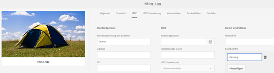

# Unterstützung für IPTC-Metadaten {#support-for-iptc-metadata}

>[!CAUTION]
>
>AEM 6.4 hat das Ende der erweiterten Unterstützung erreicht und diese Dokumentation wird nicht mehr aktualisiert. Weitere Informationen finden Sie in unserer [technische Unterstützung](https://helpx.adobe.com/de/support/programs/eol-matrix.html). Unterstützte Versionen suchen [here](https://experienceleague.adobe.com/docs/?lang=de).

Erfahren Sie, wie Adobe Experience Manager Assets die IPTC-Metadaten, kreativen Bewertungen und Suchbegriffe unterstützt, die über Adobe Bridge und andere Kreativ-Apps zu Assets hinzugefügt werden.

Adobe Experience Manager Assets unterstützt den IPTC-Metadatenstandard, der häufig zur Beschreibung von Assets verwendet wird. Auf diese Weise verbessert [!DNL Experience Manager Assets] die Akzeptanz der eigenen Bilder bei den verschiedenen Beteiligten wie Fotografen, Werbeagenturen, Bibliotheken und Museen.

Das Standard-Metadatenschema für Assets enthält jetzt die Metadatenschemata IPTC Core und IPTC Extension , um umfassende Metadateneigenschaften zu definieren, mit denen Benutzer präzise und zuverlässige Daten über Personen, Standorte und Produkte hinzufügen können, die in einem Bild angezeigt werden. Es unterstützt auch Daten, Namen und Kennungen zur Erstellung des Bildes sowie eine flexible Methode zum Ausdrücken von Rechtsinformationen.

Die Eigenschaftenseite für Assets enthält jetzt separate Registerkarten, auf denen die IPTC Core- und IPTC Extension-Metadaten in bearbeitbaren Feldern angezeigt werden.

1. Wählen Sie in der Assets-Benutzeroberfläche ein Bild aus.
1. Klicken oder tippen Sie auf **[!UICONTROL Eigenschaften]** in der Symbolleiste.
1. Klicken oder tippen Sie auf der Eigenschaftenseite auf die Registerkarte **[!UICONTROL IPTC]**, um die IPTC-Metadaten für das Asset anzuzeigen.
1. Bearbeiten Sie die IPTC-Metadateneigenschaften wie gewünscht.

   

1. Klicken oder tippen Sie auf die Registerkarte **[!UICONTROL IPTC-Erweiterung]**, um die IPTC-Erweiterungs-Metadaten für das Asset anzuzeigen.
1. Bearbeiten Sie die IPTC-Erweiterungs-Metadateneigenschaften wie gewünscht.
1. Klicken oder tippen Sie auf **[!UICONTROL Speichern und schließen]**, um die Änderungen zu speichern.

## Unterstützung für kreative Bewertungen {#creative-rating-support}

Parallel zum Anzeigen individueller Benutzerbewertungen und aggregierter Bewertungen zeigt die Eigenschaftenseite jetzt Asset-Bewertungen an, die über Adobe Bridge und andere Kreativanwendungen erfolgt sind.

Diese Bewertungen sind auf der Registerkarte **[!UICONTROL Erweitert]** im Bereich **[!UICONTROL Kreative Bewertung]** verfügbar.

Diese Bewertung ist eine schreibgeschützte Eigenschaft und liegt zwischen 1 und 5. Sie können im Suchbereich nach Assets basierend auf ihrer kreativen Bewertung suchen.

Diese Eigenschaft ist jedoch derzeit nicht indiziert, um Konflikte mit benutzerdefinierten Änderungen zu vermeiden, die von Benutzern vorgenommen werden.

## Unterstützung von Keywords {#keyword-support}

Die **[!UICONTROL IPTC]** auf der Seite Eigenschaften werden auch Suchbegriffe angezeigt, die über Adobe Bridge und andere Creative Apps zu Assets hinzugefügt wurden. Sie können diese Suchbegriffe auch über die Registerkarte **[!UICONTROL IPTC]** bearbeiten und weitere Suchbegriffe hinzufügen.

